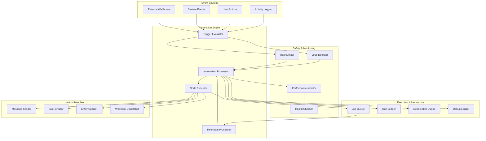

# Design Document: Automation System Enhancements

## Overview

This design document outlines the comprehensive enhancement of the SmartSapp automation system to transform it from a basic workflow engine into a full-featured CRM and marketing automation platform. The enhancements add 20 major capabilities including complete CRM trigger coverage, advanced action types, sophisticated error handling, performance monitoring, and safety mechanisms.

### Current State

The existing automation system provides:
- **9 trigger types**: SCHOOL_CREATED, SCHOOL_STAGE_CHANGED, TASK_COMPLETED, SURVEY_SUBMITTED, PDF_SIGNED, WEBHOOK_RECEIVED, MEETING_CREATED, TAG_ADDED, TAG_REMOVED
- **6 node types**: triggerNode, actionNode, conditionNode, delayNode, tagConditionNode, tagActionNode
- **Basic execution engine**: Node traversal with condition branching
- **Delay scheduling**: Job queue with heartbeat processor
- **Contact adapter layer**: Unified access to legacy and new entity models

### Target State

The enhanced system will provide:
- **29 trigger types**: Adding 20 new triggers for deals, companies, activities, campaigns, and engagement
- **15 action types**: Adding 9 new action types for CRM operations
- **Advanced condition operators**: 10 new operators for sophisticated branching logic
- **Retry logic**: Exponential backoff with dead letter queue
- **Loop detection**: Protection against infinite automation cycles
- **Rate limiting**: Prevention of automation storms
- **Test mode**: Dry run capability for workflow validation
- **Performance metrics**: Comprehensive monitoring and analytics
- **Template validation**: Runtime verification of template availability
- **Workspace isolation**: Strict boundary enforcement
- **Heartbeat monitoring**: Health checks for delayed job processing
- **Variable resolution**: Enhanced handling with defaults and nested paths
- **Execution limits**: Timeouts to prevent runaway automations
- **Debug tools**: Step-by-step execution tracing
- **Analytics dashboard**: Impact measurement and optimization insights
- **Blueprint parser**: Import/export for version control
- **Conditional delays**: Wait for external events before continuing
- **Parallel execution**: Simultaneous branch processing


## Architecture

### System Components



### Component Responsibilities

#### Activity Logger
- **Purpose**: Event bus that detects system events and fires automation triggers
- **Responsibilities**:
  - Monitor entity lifecycle events (create, update, delete)
  - Track user interactions (calls, emails, notes, meetings)
  - Detect campaign engagement (opens, clicks, deliveries)
  - Emit standardized trigger payloads with workspace context
- **Key Enhancement**: Add 20 new trigger types for comprehensive CRM coverage

#### Automation Engine (Trigger Evaluator)
- **Purpose**: Orchestrates automation discovery and execution
- **Responsibilities**:
  - Query active automations matching trigger type
  - Filter by workspace and trigger configuration
  - Validate workspace isolation
  - Initialize execution context
  - Enforce rate limits
- **Key Enhancement**: Add trigger config filtering for specialized triggers

#### Automation Processor
- **Purpose**: Executes workflow logic by traversing node graphs
- **Responsibilities**:
  - Traverse nodes following edges
  - Evaluate condition branches
  - Execute action nodes
  - Handle delay nodes
  - Manage execution state
  - Implement retry logic
  - Detect loops
- **Key Enhancement**: Add retry logic, loop detection, and execution limits

#### Node Executor
- **Purpose**: Executes individual node logic
- **Responsibilities**:
  - Process action nodes (send message, create task, update entity)
  - Evaluate condition nodes (field comparisons, tag checks)
  - Handle tag action nodes (add/remove tags)
  - Queue delay nodes
  - Resolve variables in configurations
- **Key Enhancement**: Add 9 new action types and 10 new condition operators

#### Heartbeat Processor
- **Purpose**: Scheduled job processor for delayed workflows
- **Responsibilities**:
  - Scan job queue for pending jobs
  - Resume paused workflows
  - Handle job failures
  - Move expired jobs to dead letter queue
  - Report health metrics
- **Key Enhancement**: Add health monitoring and conditional delay support

#### Loop Detector
- **Purpose**: Safety mechanism to prevent infinite automation cycles
- **Responsibilities**:
  - Track loop detection counter per run
  - Detect circular automation chains
  - Terminate runs exceeding node limits
  - Log loop detection errors
- **Key Enhancement**: New component for automation safety

#### Rate Limiter
- **Purpose**: Safety mechanism to prevent automation storms
- **Responsibilities**:
  - Track execution frequency per automation
  - Throttle high-frequency triggers
  - Queue rate-limited executions
  - Alert on workspace-level thresholds
- **Key Enhancement**: New component for system protection

#### Performance Monitor
- **Purpose**: Tracks execution metrics for optimization
- **Responsibilities**:
  - Record execution times per run and per node
  - Calculate success/failure rates
  - Identify slow nodes
  - Mark unhealthy automations
  - Generate performance reports
- **Key Enhancement**: New component for observability

#### Health Checker
- **Purpose**: Monitors system health and alerts on issues
- **Responsibilities**:
  - Verify heartbeat processor runs
  - Check job queue depth
  - Alert on repeated failures
  - Monitor execution timeouts
- **Key Enhancement**: New component for operational reliability

### Data Flow

#### Trigger Flow
```
Event Occurs → Activity Logger → Trigger Payload → 
Rate Limiter → Automation Engine → Filter by Workspace → 
Filter by Trigger Config → Execute Automation
```

#### Execution Flow
```
Initialize Run → Create Run Ledger → Find Trigger Node → 
Traverse Nodes → Execute Node Logic → Follow Edges → 
Update Run Status → Record Metrics
```

#### Delay Flow
```
Encounter Delay Node → Create Job → Queue Job → 
Heartbeat Scans → Resume Run → Continue Traversal
```

#### Retry Flow
```
Action Fails → Check Retry Count → Exponential Backoff → 
Retry Action → Max Retries Exceeded → Dead Letter Queue
```


## Components and Interfaces

### 1. Enhanced Activity Logger

```typescript
interface ActivityLoggerConfig {
  enabledTriggers: Set<AutomationTrigger>;
  workspaceContext: WorkspaceContext;
  batchingEnabled: boolean;
  batchSize: number;
  batchInterval: number; // milliseconds
}

interface TriggerPayload {
  trigger: AutomationTrigger;
  organizationId: string;
  workspaceId: string;
  entityId?: string;
  entityType?: EntityType;
  timestamp: string;
  actorId?: string;
  metadata: Record<string, any>;
}

class ActivityLogger {
  async emitTrigger(payload: TriggerPayload): Promise<void>;
  async emitCompanyCreated(company: Company, context: WorkspaceContext): Promise<void>;
  async emitCompanyUpdated(companyId: string, changes: FieldChanges, context: WorkspaceContext): Promise<void>;
  async emitDealCreated(deal: Deal, context: WorkspaceContext): Promise<void>;
  async emitDealStageChanged(dealId: string, oldStage: string, newStage: string, context: WorkspaceContext): Promise<void>;
  async emitDealWon(deal: Deal, context: WorkspaceContext): Promise<void>;
  async emitDealLost(deal: Deal, lossReason: string, context: WorkspaceContext): Promise<void>;
  async emitCallLogged(activity: Activity, context: WorkspaceContext): Promise<void>;
  async emitEmailSent(message: Message, context: WorkspaceContext): Promise<void>;
  async emitCampaignStarted(campaign: Campaign, context: WorkspaceContext): Promise<void>;
  async emitEmailOpened(messageId: string, contactId: string, metadata: OpenMetadata): Promise<void>;
  async emitEmailClicked(messageId: string, contactId: string, linkUrl: string): Promise<void>;
}
```

### 2. Enhanced Automation Engine

```typescript
interface AutomationEngineConfig {
  maxConcurrentRuns: number;
  rateLimitWindow: number; // milliseconds
  rateLimitThreshold: number;
  enableLoopDetection: boolean;
  maxLoopCount: number;
  maxNodesPerRun: number;
}

interface TriggerFilter {
  workspaceIds: string[];
  tagIds?: string[];
  contactType?: string;
  appliedBy?: 'manual' | 'automatic';
}

class AutomationEngine {
  async triggerAutomations(trigger: AutomationTrigger, payload: TriggerPayload): Promise<void>;
  async findMatchingAutomations(trigger: AutomationTrigger, workspaceId: string): Promise<Automation[]>;
  async evaluateTriggerConfig(automation: Automation, payload: TriggerPayload): boolean;
  async checkRateLimit(automationId: string): Promise<boolean>;
  async queueRateLimitedExecution(automationId: string, payload: TriggerPayload): Promise<void>;
  async alertOnRateLimit(workspaceId: string, automationId: string): Promise<void>;
}
```

### 3. Enhanced Automation Processor

```typescript
interface ExecutionContext {
  automationId: string;
  runId: string;
  entityId?: string;
  entityType?: EntityType;
  workspaceId: string;
  organizationId: string;
  payload: Record<string, any>;
  loopCounter: number;
  nodeCounter: number;
  startTime: number;
  debugMode: boolean;
  testMode: boolean;
}

interface RetryConfig {
  maxRetries: number;
  backoffMultiplier: number;
  initialDelay: number; // milliseconds
  maxDelay: number; // milliseconds
}

interface ExecutionResult {
  success: boolean;
  error?: string;
  executionTime: number;
  nodesExecuted: number;
  actionsPerformed: number;
}

class AutomationProcessor {
  async executeAutomation(automation: Automation, payload: TriggerPayload): Promise<ExecutionResult>;
  async traverseNodes(nodeId: string, automation: Automation, context: ExecutionContext): Promise<void>;
  async executeNode(node: AutomationNode, context: ExecutionContext): Promise<void>;
  async executeWithRetry(action: () => Promise<void>, config: RetryConfig): Promise<void>;
  async checkLoopDetection(context: ExecutionContext): Promise<void>;
  async checkExecutionTimeout(context: ExecutionContext): Promise<void>;
  async recordNodeExecution(nodeId: string, context: ExecutionContext, duration: number): Promise<void>;
}
```

### 4. Enhanced Node Executor

```typescript
interface ActionNodeConfig {
  actionType: ActionType;
  config: Record<string, any>;
  retryable: boolean;
  timeout: number; // milliseconds
  strictMode: boolean;
}

interface ConditionNodeConfig {
  field: string;
  operator: ConditionOperator;
  value: any;
  secondValue?: any; // for date_between
}

type ConditionOperator = 
  | 'equals' | 'not_equals' | 'contains' | 'greater_than' | 'less_than'
  | 'starts_with' | 'ends_with' | 'in_list' | 'not_in_list'
  | 'is_empty' | 'is_not_empty'
  | 'date_before' | 'date_after' | 'date_between'
  | 'regex_match';

type ActionType =
  | 'SEND_MESSAGE' | 'CREATE_TASK' | 'UPDATE_SCHOOL'
  | 'UPDATE_DEAL' | 'UPDATE_COMPANY' | 'ASSIGN_USER'
  | 'ADD_TO_CAMPAIGN' | 'REMOVE_FROM_CAMPAIGN'
  | 'CREATE_ACTIVITY' | 'SEND_WEBHOOK'
  | 'UPDATE_CUSTOM_FIELD' | 'CALCULATE_SCORE'
  | 'CREATE_DEAL';

class NodeExecutor {
  async executeActionNode(node: ActionNode, context: ExecutionContext): Promise<void>;
  async evaluateConditionNode(node: ConditionNode, context: ExecutionContext): Promise<boolean>;
  async evaluateCondition(config: ConditionNodeConfig, payload: Record<string, any>): boolean;
  async resolveVariables(config: Record<string, any>, payload: Record<string, any>): Record<string, any>;
  async handleUpdateDeal(config: any, context: ExecutionContext): Promise<void>;
  async handleUpdateCompany(config: any, context: ExecutionContext): Promise<void>;
  async handleAssignUser(config: any, context: ExecutionContext): Promise<void>;
  async handleAddToCampaign(config: any, context: ExecutionContext): Promise<void>;
  async handleCreateActivity(config: any, context: ExecutionContext): Promise<void>;
  async handleSendWebhook(config: any, context: ExecutionContext): Promise<void>;
  async handleUpdateCustomField(config: any, context: ExecutionContext): Promise<void>;
  async handleCalculateScore(config: any, context: ExecutionContext): Promise<void>;
}
```

### 5. Loop Detector

```typescript
interface LoopDetectionConfig {
  maxLoopCount: number;
  maxNodesPerRun: number;
  trackAutomationChain: boolean;
}

interface AutomationChain {
  automationIds: string[];
  depth: number;
}

class LoopDetector {
  async incrementLoopCounter(context: ExecutionContext): Promise<void>;
  async checkLoopLimit(context: ExecutionContext): Promise<void>;
  async trackAutomationChain(triggeringAutomationId: string, context: ExecutionContext): Promise<void>;
  async detectCircularDependency(chain: AutomationChain): Promise<boolean>;
  async terminateRun(context: ExecutionContext, reason: string): Promise<void>;
}
```

### 6. Rate Limiter

```typescript
interface RateLimitConfig {
  automationWindow: number; // milliseconds
  automationThreshold: number;
  contactWindow: number; // milliseconds
  contactThreshold: number;
  workspaceWindow: number; // milliseconds
  workspaceThreshold: number;
  queueProcessingRate: number; // executions per minute
}

interface RateLimitStatus {
  limited: boolean;
  reason?: string;
  retryAfter?: number; // milliseconds
}

class RateLimiter {
  async checkAutomationRate(automationId: string): Promise<RateLimitStatus>;
  async checkContactRate(contactId: string): Promise<RateLimitStatus>;
  async checkWorkspaceRate(workspaceId: string): Promise<RateLimitStatus>;
  async recordExecution(automationId: string, contactId: string, workspaceId: string): Promise<void>;
  async queueExecution(automationId: string, payload: TriggerPayload): Promise<void>;
  async processQueuedExecutions(): Promise<number>;
  async alertOnRateLimit(workspaceId: string, reason: string): Promise<void>;
}
```

### 7. Performance Monitor

```typescript
interface PerformanceMetrics {
  automationId: string;
  totalRuns: number;
  successfulRuns: number;
  failedRuns: number;
  averageExecutionTime: number;
  maxExecutionTime: number;
  minExecutionTime: number;
  successRate: number;
  failureRate: number;
  lastRun: string;
  nodeMetrics: Map<string, NodeMetrics>;
}

interface NodeMetrics {
  nodeId: string;
  nodeType: string;
  executionCount: number;
  averageTime: number;
  maxTime: number;
  failureCount: number;
}

interface HealthStatus {
  healthy: boolean;
  issues: string[];
  recommendations: string[];
}

class PerformanceMonitor {
  async recordRunStart(runId: string, automationId: string): Promise<void>;
  async recordRunComplete(runId: string, success: boolean, executionTime: number): Promise<void>;
  async recordNodeExecution(runId: string, nodeId: string, executionTime: number): Promise<void>;
  async calculateMetrics(automationId: string, window: number): Promise<PerformanceMetrics>;
  async checkHealth(automationId: string): Promise<HealthStatus>;
  async identifySlowNodes(automationId: string, threshold: number): Promise<NodeMetrics[]>;
  async alertOnUnhealthy(automationId: string, status: HealthStatus): Promise<void>;
}
```

### 8. Heartbeat Processor

```typescript
interface HeartbeatConfig {
  scanInterval: number; // milliseconds
  batchSize: number;
  maxJobAge: number; // milliseconds
  retryFailedJobs: boolean;
  maxRetries: number;
}

interface HeartbeatMetrics {
  lastRun: string;
  jobsProcessed: number;
  jobsSucceeded: number;
  jobsFailed: number;
  averageProcessingTime: number;
  queueDepth: number;
}

class HeartbeatProcessor {
  async processScheduledJobs(): Promise<HeartbeatMetrics>;
  async scanJobQueue(limit: number): Promise<AutomationJob[]>;
  async resumeJob(job: AutomationJob): Promise<boolean>;
  async evaluateConditionalDelay(job: AutomationJob): Promise<boolean>;
  async moveToDeadLetterQueue(job: AutomationJob, reason: string): Promise<void>;
  async reportHealth(): Promise<HeartbeatMetrics>;
}
```

### 9. Template Validator

```typescript
interface TemplateValidationResult {
  valid: boolean;
  templateId?: string;
  templateName?: string;
  error?: string;
  warning?: string;
}

class TemplateValidator {
  async validateTemplate(templateId: string): Promise<TemplateValidationResult>;
  async validateTemplateByCategory(category: string, type: string, organizationId: string): Promise<TemplateValidationResult>;
  async checkTemplateActive(templateId: string): Promise<boolean>;
  async validateVariables(templateId: string, variables: Record<string, any>, strictMode: boolean): Promise<string[]>;
  async revalidateAutomationTemplates(automationId: string): Promise<TemplateValidationResult[]>;
}
```

### 10. Variable Resolver

```typescript
interface VariableResolutionConfig {
  strictMode: boolean;
  defaults: Record<string, any>;
  maxDepth: number;
  logResolutions: boolean;
}

interface VariableResolutionResult {
  resolved: Record<string, any>;
  missing: string[];
  errors: string[];
}

class VariableResolver {
  async resolveVariables(template: string, payload: Record<string, any>, config: VariableResolutionConfig): Promise<string>;
  async resolveNestedPath(path: string, payload: Record<string, any>): Promise<any>;
  async resolveArrayAccess(path: string, payload: Record<string, any>): Promise<any>;
  async applyDefaults(missing: string[], defaults: Record<string, any>): Record<string, any>;
  async logResolution(variable: string, value: any, context: ExecutionContext): Promise<void>;
}
```

### 11. Debug Logger

```typescript
interface DebugLogEntry {
  runId: string;
  timestamp: string;
  nodeId: string;
  nodeType: string;
  event: 'node_enter' | 'node_exit' | 'condition_eval' | 'variable_resolve' | 'action_execute' | 'error';
  payload: Record<string, any>;
  duration?: number;
  result?: any;
  error?: string;
}

interface DebugReport {
  runId: string;
  automationId: string;
  timeline: DebugLogEntry[];
  pathTaken: string[];
  variableResolutions: Map<string, any>;
  errors: string[];
  totalDuration: number;
}

class DebugLogger {
  async logNodeEnter(nodeId: string, context: ExecutionContext): Promise<void>;
  async logNodeExit(nodeId: string, context: ExecutionContext, duration: number): Promise<void>;
  async logConditionEval(nodeId: string, field: string, operator: string, value: any, result: boolean, context: ExecutionContext): Promise<void>;
  async logVariableResolve(variable: string, originalValue: string, resolvedValue: any, context: ExecutionContext): Promise<void>;
  async logActionExecute(nodeId: string, actionType: string, config: any, context: ExecutionContext): Promise<void>;
  async generateReport(runId: string): Promise<DebugReport>;
  async exportReport(runId: string, format: 'json' | 'html'): Promise<string>;
}
```

### 12. Blueprint Parser

```typescript
interface BlueprintMetadata {
  version: string;
  createdAt: string;
  createdBy: string;
  workspaceId: string;
  organizationId: string;
}

interface BlueprintValidationResult {
  valid: boolean;
  errors: ValidationError[];
  warnings: ValidationWarning[];
}

interface ValidationError {
  field: string;
  message: string;
  severity: 'error' | 'warning';
}

class BlueprintParser {
  async exportBlueprint(automationId: string): Promise<string>;
  async importBlueprint(json: string, workspaceId: string): Promise<string>;
  async validateBlueprint(json: string): Promise<BlueprintValidationResult>;
  async prettyPrint(blueprint: Automation): Promise<string>;
  async verifyReferences(blueprint: Automation, workspaceId: string): Promise<ValidationError[]>;
  async roundTripTest(blueprint: Automation): Promise<boolean>;
}
```


## Data Models

### 1. Enhanced Automation Document

```typescript
interface Automation {
  id: string;
  organizationId: string;
  workspaceIds: string[];
  name: string;
  description?: string;
  trigger: AutomationTrigger;
  triggerConfig?: TriggerConfig;
  nodes: AutomationNode[];
  edges: AutomationEdge[];
  isActive: boolean;
  
  // Metadata
  createdAt: string;
  updatedAt: string;
  createdBy: string;
  updatedBy?: string;
  
  // Performance tracking
  totalRuns?: number;
  successfulRuns?: number;
  failedRuns?: number;
  lastRun?: string;
  averageExecutionTime?: number;
  
  // Health status
  healthStatus?: 'healthy' | 'degraded' | 'unhealthy';
  healthCheckedAt?: string;
  
  // Version control
  version?: number;
  previousVersionId?: string;
}

interface TriggerConfig {
  // For TAG_ADDED / TAG_REMOVED
  tagIds?: string[];
  contactType?: 'institution' | 'family' | 'person';
  appliedBy?: 'manual' | 'automatic';
  
  // For DEAL_STAGE_CHANGED
  pipelineIds?: string[];
  fromStageIds?: string[];
  toStageIds?: string[];
  
  // For CAMPAIGN triggers
  campaignIds?: string[];
  
  // For time-based triggers
  timeWindow?: {
    start: string; // HH:mm
    end: string; // HH:mm
    timezone: string;
  };
}
```

### 2. Enhanced Automation Run

```typescript
interface AutomationRun {
  id: string;
  automationId: string;
  automationName: string;
  automationVersion?: number;
  
  // Context
  organizationId: string;
  workspaceId: string;
  entityId?: string;
  entityType?: EntityType;
  
  // Execution state
  status: 'running' | 'completed' | 'failed' | 'timeout' | 'loop_detected' | 'rate_limited';
  startedAt: string;
  finishedAt?: string;
  executionTime?: number; // milliseconds
  
  // Trigger data
  trigger: AutomationTrigger;
  triggerData: Record<string, any>;
  
  // Execution tracking
  nodesExecuted: number;
  actionsPerformed: number;
  loopCounter: number;
  
  // Results
  error?: string;
  errorNode?: string;
  errorStack?: string;
  
  // Debug info
  debugMode?: boolean;
  testMode?: boolean;
  debugLog?: DebugLogEntry[];
  
  // Performance
  nodeExecutionTimes?: Map<string, number>;
  slowestNode?: string;
  slowestNodeTime?: number;
}
```

### 3. Enhanced Automation Job

```typescript
interface AutomationJob {
  id: string;
  automationId: string;
  runId: string;
  
  // Delay configuration
  targetNodeId: string;
  delayType: 'fixed' | 'conditional';
  executeAt: string;
  
  // Conditional delay
  condition?: ConditionNodeConfig;
  maxWaitTime?: string; // ISO timestamp
  checkInterval?: number; // milliseconds
  lastCheckedAt?: string;
  checkCount?: number;
  
  // Context
  payload: Record<string, any>;
  workspaceId: string;
  entityId?: string;
  
  // Status
  status: 'pending' | 'processing' | 'completed' | 'failed' | 'expired';
  createdAt: string;
  updatedAt: string;
  
  // Retry tracking
  retryCount?: number;
  lastError?: string;
  
  // Metadata
  priority?: 'low' | 'normal' | 'high';
  tags?: string[];
}
```

### 4. Dead Letter Queue Entry

```typescript
interface DeadLetterEntry {
  id: string;
  automationId: string;
  automationName: string;
  runId: string;
  nodeId?: string;
  
  // Context
  workspaceId: string;
  entityId?: string;
  payload: Record<string, any>;
  
  // Failure details
  failureReason: string;
  error: string;
  errorStack?: string;
  retryCount: number;
  
  // Timestamps
  failedAt: string;
  originalExecuteAt?: string;
  
  // Resolution
  status: 'pending_review' | 'resolved' | 'ignored';
  resolvedAt?: string;
  resolvedBy?: string;
  resolutionNotes?: string;
}
```

### 5. Rate Limit Tracking

```typescript
interface RateLimitRecord {
  id: string;
  type: 'automation' | 'contact' | 'workspace';
  targetId: string; // automationId, contactId, or workspaceId
  
  // Window tracking
  windowStart: string;
  windowEnd: string;
  executionCount: number;
  
  // Limit configuration
  threshold: number;
  windowDuration: number; // milliseconds
  
  // Status
  limited: boolean;
  limitedAt?: string;
  limitedUntil?: string;
  
  // Queued executions
  queuedExecutions?: string[]; // runIds
}
```

### 6. Performance Metrics Document

```typescript
interface AutomationMetrics {
  id: string; // automationId
  automationName: string;
  workspaceId: string;
  
  // Aggregate metrics
  totalRuns: number;
  successfulRuns: number;
  failedRuns: number;
  timeoutRuns: number;
  loopDetectedRuns: number;
  
  // Time metrics
  averageExecutionTime: number;
  medianExecutionTime: number;
  p95ExecutionTime: number;
  p99ExecutionTime: number;
  maxExecutionTime: number;
  minExecutionTime: number;
  
  // Success rate
  successRate: number; // percentage
  failureRate: number; // percentage
  
  // Node-level metrics
  nodeMetrics: {
    [nodeId: string]: {
      nodeType: string;
      executionCount: number;
      averageTime: number;
      maxTime: number;
      failureCount: number;
    };
  };
  
  // Health status
  healthStatus: 'healthy' | 'degraded' | 'unhealthy';
  healthIssues: string[];
  healthRecommendations: string[];
  
  // Time windows
  last24Hours: MetricsSnapshot;
  last7Days: MetricsSnapshot;
  last30Days: MetricsSnapshot;
  
  // Timestamps
  lastCalculated: string;
  lastRun: string;
}

interface MetricsSnapshot {
  runs: number;
  successRate: number;
  averageTime: number;
  failureCount: number;
}
```

### 7. Heartbeat Health Record

```typescript
interface HeartbeatHealth {
  id: string; // singleton document
  
  // Last execution
  lastRun: string;
  lastRunDuration: number;
  lastRunJobsProcessed: number;
  lastRunJobsSucceeded: number;
  lastRunJobsFailed: number;
  
  // Queue status
  currentQueueDepth: number;
  oldestPendingJob?: string; // timestamp
  
  // Health indicators
  healthy: boolean;
  lastHealthCheck: string;
  consecutiveFailures: number;
  
  // Alerts
  alertsSent: number;
  lastAlertSent?: string;
  
  // Historical metrics
  averageProcessingTime: number;
  averageBatchSize: number;
  totalJobsProcessed: number;
  
  // Configuration
  scanInterval: number;
  batchSize: number;
  maxJobAge: number;
}
```

### 8. Workspace Isolation Audit

```typescript
interface WorkspaceIsolationAudit {
  id: string;
  timestamp: string;
  
  // Violation details
  violationType: 'missing_workspace_id' | 'cross_workspace_access' | 'invalid_user_access';
  automationId: string;
  runId: string;
  
  // Context
  attemptedWorkspaceId?: string;
  actualWorkspaceId?: string;
  entityId?: string;
  userId?: string;
  
  // Action taken
  actionTaken: 'blocked' | 'logged' | 'alerted';
  
  // Severity
  severity: 'low' | 'medium' | 'high' | 'critical';
}
```

### 9. Template Validation Cache

```typescript
interface TemplateValidationCache {
  id: string; // templateId
  templateName: string;
  category: string;
  type: string;
  
  // Validation status
  isActive: boolean;
  lastValidated: string;
  validationResult: 'valid' | 'inactive' | 'missing' | 'error';
  
  // Usage tracking
  usedByAutomations: string[]; // automationIds
  lastUsed: string;
  
  // Invalidation
  invalidatedAt?: string;
  invalidationReason?: string;
}
```

### 10. Analytics Dashboard Data

```typescript
interface AutomationAnalytics {
  id: string; // workspaceId
  workspaceId: string;
  organizationId: string;
  
  // Period
  periodStart: string;
  periodEnd: string;
  periodType: 'day' | 'week' | 'month';
  
  // Aggregate stats
  totalRuns: number;
  totalAutomations: number;
  activeAutomations: number;
  
  // Top performers
  topExecutedAutomations: Array<{
    automationId: string;
    automationName: string;
    runCount: number;
  }>;
  
  topFailingAutomations: Array<{
    automationId: string;
    automationName: string;
    failureRate: number;
    failureCount: number;
  }>;
  
  // Time series
  executionsPerDay: Array<{
    date: string;
    count: number;
    successCount: number;
    failureCount: number;
  }>;
  
  // Impact metrics
  messagesSent: number;
  tasksCreated: number;
  entitiesUpdated: number;
  dealsCreated: number;
  
  // Performance
  averageExecutionTime: number;
  slowestAutomations: Array<{
    automationId: string;
    automationName: string;
    averageTime: number;
  }>;
  
  // Generated at
  generatedAt: string;
}
```


## Algorithms

### 1. Retry Logic with Exponential Backoff

```typescript
async function executeWithRetry<T>(
  action: () => Promise<T>,
  config: RetryConfig,
  context: ExecutionContext
): Promise<T> {
  let lastError: Error;
  let delay = config.initialDelay;
  
  for (let attempt = 0; attempt <= config.maxRetries; attempt++) {
    try {
      return await action();
    } catch (error) {
      lastError = error as Error;
      
      // Check if error is retryable
      if (!isRetryableError(error)) {
        throw error;
      }
      
      // Last attempt failed
      if (attempt === config.maxRetries) {
        await moveToDeadLetterQueue(context, lastError);
        throw new Error(`Action failed after ${config.maxRetries} retries: ${lastError.message}`);
      }
      
      // Wait before retry
      await sleep(delay);
      
      // Exponential backoff with cap
      delay = Math.min(delay * config.backoffMultiplier, config.maxDelay);
      
      console.log(`Retry attempt ${attempt + 1}/${config.maxRetries} after ${delay}ms`);
    }
  }
  
  throw lastError!;
}

function isRetryableError(error: any): boolean {
  // Network errors
  if (error.code === 'ECONNREFUSED' || error.code === 'ETIMEDOUT') {
    return true;
  }
  
  // Firestore errors
  if (error.code === 'unavailable' || error.code === 'deadline-exceeded') {
    return true;
  }
  
  // HTTP errors (5xx)
  if (error.status >= 500 && error.status < 600) {
    return true;
  }
  
  // Rate limit errors (should be handled by rate limiter, but retry anyway)
  if (error.status === 429) {
    return true;
  }
  
  // Non-retryable errors
  // - Validation errors (4xx except 429)
  // - Invalid recipient
  // - Missing template
  return false;
}
```

### 2. Loop Detection Algorithm

```typescript
async function checkLoopDetection(context: ExecutionContext): Promise<void> {
  // Check loop counter
  if (context.loopCounter > config.maxLoopCount) {
    await terminateRun(context, `Loop detection: exceeded ${config.maxLoopCount} tag actions`);
    throw new Error('Loop detected: too many tag actions in single run');
  }
  
  // Check node counter
  if (context.nodeCounter > config.maxNodesPerRun) {
    await terminateRun(context, `Excessive execution: exceeded ${config.maxNodesPerRun} nodes`);
    throw new Error('Excessive execution: too many nodes traversed');
  }
  
  // Check automation chain for circular dependencies
  if (context.triggeringAutomationId) {
    const chain = await getAutomationChain(context.runId);
    if (detectCircularDependency(chain, context.automationId)) {
      await terminateRun(context, 'Circular automation dependency detected');
      throw new Error('Circular dependency: automation chain loops back to itself');
    }
  }
}

function detectCircularDependency(chain: string[], currentAutomationId: string): boolean {
  // Check if current automation already exists in the chain
  return chain.includes(currentAutomationId);
}

async function incrementLoopCounter(context: ExecutionContext): Promise<void> {
  context.loopCounter++;
  
  // Update run document with current loop counter
  await adminDb.collection('automation_runs').doc(context.runId).update({
    loopCounter: context.loopCounter,
    updatedAt: new Date().toISOString()
  });
}
```

### 3. Rate Limiting Algorithm

```typescript
async function checkRateLimit(
  automationId: string,
  contactId: string,
  workspaceId: string
): Promise<RateLimitStatus> {
  const now = Date.now();
  
  // Check automation-level rate limit
  const automationLimit = await checkAutomationRate(automationId, now);
  if (automationLimit.limited) {
    return automationLimit;
  }
  
  // Check contact-level rate limit
  const contactLimit = await checkContactRate(contactId, now);
  if (contactLimit.limited) {
    return contactLimit;
  }
  
  // Check workspace-level rate limit
  const workspaceLimit = await checkWorkspaceRate(workspaceId, now);
  if (workspaceLimit.limited) {
    return workspaceLimit;
  }
  
  return { limited: false };
}

async function checkAutomationRate(automationId: string, now: number): Promise<RateLimitStatus> {
  const windowStart = now - config.automationWindow;
  
  // Count executions in window
  const count = await adminDb.collection('automation_runs')
    .where('automationId', '==', automationId)
    .where('startedAt', '>=', new Date(windowStart).toISOString())
    .count()
    .get();
  
  if (count.data().count >= config.automationThreshold) {
    return {
      limited: true,
      reason: `Automation rate limit exceeded: ${count.data().count}/${config.automationThreshold} in ${config.automationWindow}ms`,
      retryAfter: config.automationWindow
    };
  }
  
  return { limited: false };
}

async function processQueuedExecutions(): Promise<number> {
  const now = Date.now();
  let processed = 0;
  
  // Get queued executions that are ready to process
  const queuedSnap = await adminDb.collection('rate_limit_queue')
    .where('status', '==', 'queued')
    .where('retryAfter', '<=', now)
    .limit(config.queueProcessingRate)
    .get();
  
  for (const doc of queuedSnap.docs) {
    const queued = doc.data();
    
    // Check if rate limit has cleared
    const limitStatus = await checkRateLimit(
      queued.automationId,
      queued.contactId,
      queued.workspaceId
    );
    
    if (!limitStatus.limited) {
      // Execute the automation
      await triggerAutomations(queued.trigger, queued.payload);
      
      // Mark as processed
      await doc.ref.update({ status: 'processed', processedAt: new Date().toISOString() });
      processed++;
    } else {
      // Still rate limited, update retry time
      await doc.ref.update({ retryAfter: now + limitStatus.retryAfter! });
    }
  }
  
  return processed;
}
```

### 4. Conditional Delay Evaluation

```typescript
async function evaluateConditionalDelay(job: AutomationJob): Promise<boolean> {
  if (job.delayType !== 'conditional' || !job.condition) {
    return true; // Fixed delay, always ready
  }
  
  // Check if max wait time exceeded
  if (job.maxWaitTime && new Date(job.maxWaitTime) < new Date()) {
    await terminateRun(
      { runId: job.runId, automationId: job.automationId } as ExecutionContext,
      'Conditional delay timeout: max wait time exceeded'
    );
    return false;
  }
  
  // Fetch current entity state
  const entity = await resolveContact(job.entityId!, job.workspaceId);
  if (!entity) {
    return false;
  }
  
  // Evaluate condition against current state
  const conditionMet = await evaluateCondition(job.condition, {
    ...job.payload,
    ...entity
  });
  
  // Update check count
  await adminDb.collection('automation_jobs').doc(job.id).update({
    lastCheckedAt: new Date().toISOString(),
    checkCount: (job.checkCount || 0) + 1
  });
  
  return conditionMet;
}
```

### 5. Advanced Condition Evaluation

```typescript
function evaluateCondition(config: ConditionNodeConfig, payload: Record<string, any>): boolean {
  const actualValue = payload[config.field];
  const comparisonValue = config.value;
  
  switch (config.operator) {
    case 'equals':
      return String(actualValue) === String(comparisonValue);
      
    case 'not_equals':
      return String(actualValue) !== String(comparisonValue);
      
    case 'contains':
      return String(actualValue).toLowerCase().includes(String(comparisonValue).toLowerCase());
      
    case 'starts_with':
      return String(actualValue).toLowerCase().startsWith(String(comparisonValue).toLowerCase());
      
    case 'ends_with':
      return String(actualValue).toLowerCase().endsWith(String(comparisonValue).toLowerCase());
      
    case 'in_list':
      return Array.isArray(comparisonValue) && comparisonValue.includes(actualValue);
      
    case 'not_in_list':
      return Array.isArray(comparisonValue) && !comparisonValue.includes(actualValue);
      
    case 'is_empty':
      return actualValue === null || actualValue === undefined || actualValue === '';
      
    case 'is_not_empty':
      return actualValue !== null && actualValue !== undefined && actualValue !== '';
      
    case 'greater_than':
      return Number(actualValue) > Number(comparisonValue);
      
    case 'less_than':
      return Number(actualValue) < Number(comparisonValue);
      
    case 'date_before':
      return new Date(actualValue) < new Date(comparisonValue);
      
    case 'date_after':
      return new Date(actualValue) > new Date(comparisonValue);
      
    case 'date_between':
      const date = new Date(actualValue);
      const start = new Date(comparisonValue);
      const end = new Date(config.secondValue!);
      return date >= start && date <= end;
      
    case 'regex_match':
      try {
        const regex = new RegExp(comparisonValue);
        return regex.test(String(actualValue));
      } catch (e) {
        console.error('Invalid regex pattern:', comparisonValue);
        return false;
      }
      
    default:
      return false;
  }
}
```

### 6. Variable Resolution with Nested Paths

```typescript
function resolveVariables(config: Record<string, any>, payload: Record<string, any>): Record<string, any> {
  const json = JSON.stringify(config);
  const resolved = json.replace(/\{\{(.*?)\}\}/g, (match, key) => {
    const cleanKey = key.trim();
    
    // Handle nested paths (e.g., {{contact.email}})
    if (cleanKey.includes('.')) {
      const value = resolveNestedPath(cleanKey, payload);
      return value !== undefined ? String(value) : match;
    }
    
    // Handle array access (e.g., {{contacts[0].email}})
    if (cleanKey.includes('[')) {
      const value = resolveArrayAccess(cleanKey, payload);
      return value !== undefined ? String(value) : match;
    }
    
    // Simple key lookup
    return payload[cleanKey] !== undefined ? String(payload[cleanKey]) : match;
  });
  
  return JSON.parse(resolved);
}

function resolveNestedPath(path: string, payload: Record<string, any>): any {
  const parts = path.split('.');
  let current: any = payload;
  
  for (const part of parts) {
    if (current === null || current === undefined) {
      return undefined;
    }
    current = current[part];
  }
  
  return current;
}

function resolveArrayAccess(path: string, payload: Record<string, any>): any {
  // Parse path like "contacts[0].email"
  const match = path.match(/^([^[]+)\[(\d+)\](.*)$/);
  if (!match) {
    return undefined;
  }
  
  const [, arrayName, indexStr, remainingPath] = match;
  const index = parseInt(indexStr, 10);
  
  const array = payload[arrayName];
  if (!Array.isArray(array) || index >= array.length) {
    return undefined;
  }
  
  const element = array[index];
  
  // If there's a remaining path, resolve it
  if (remainingPath) {
    const cleanPath = remainingPath.startsWith('.') ? remainingPath.slice(1) : remainingPath;
    return resolveNestedPath(cleanPath, element);
  }
  
  return element;
}
```

### 7. Parallel Execution Algorithm

```typescript
async function executeParallelBranches(
  node: ParallelNode,
  automation: Automation,
  context: ExecutionContext
): Promise<void> {
  const outgoingEdges = automation.edges.filter(e => e.source === node.id);
  
  if (outgoingEdges.length === 0) {
    return;
  }
  
  // Create separate execution contexts for each branch
  const branchContexts = outgoingEdges.map(edge => ({
    ...context,
    branchId: edge.id,
    branchStartTime: Date.now()
  }));
  
  // Execute all branches in parallel
  const branchPromises = branchContexts.map((branchContext, index) => {
    const edge = outgoingEdges[index];
    return executeParallelBranch(edge.target, automation, branchContext)
      .then(result => ({ success: true, branchId: edge.id, result }))
      .catch(error => ({ success: false, branchId: edge.id, error }));
  });
  
  // Wait for all branches with timeout
  const timeout = node.data?.config?.timeout || 60000; // 60 seconds default
  const results = await Promise.race([
    Promise.all(branchPromises),
    sleep(timeout).then(() => {
      throw new Error(`Parallel execution timeout after ${timeout}ms`);
    })
  ]);
  
  // Check results
  const failures = results.filter(r => !r.success);
  if (failures.length > 0) {
    console.warn(`${failures.length} parallel branches failed:`, failures);
    // Continue execution even if some branches failed (configurable behavior)
  }
  
  // Merge execution contexts (handle conflicts)
  await mergeParallelContexts(context, branchContexts);
  
  // Record parallel execution metrics
  await recordParallelExecution(context.runId, node.id, results);
}

async function executeParallelBranch(
  nodeId: string,
  automation: Automation,
  context: ExecutionContext
): Promise<void> {
  // Execute branch with entity update serialization
  await withEntityLock(context.entityId!, async () => {
    await traverseNodes(nodeId, automation, context);
  });
}

async function withEntityLock<T>(entityId: string, fn: () => Promise<T>): Promise<T> {
  const lockKey = `entity_lock:${entityId}`;
  const lockTimeout = 30000; // 30 seconds
  
  // Acquire lock
  const acquired = await acquireLock(lockKey, lockTimeout);
  if (!acquired) {
    throw new Error(`Failed to acquire lock for entity ${entityId}`);
  }
  
  try {
    return await fn();
  } finally {
    // Release lock
    await releaseLock(lockKey);
  }
}
```

### 8. Blueprint Round-Trip Validation

```typescript
async function validateRoundTrip(blueprint: Automation): Promise<boolean> {
  // Step 1: Serialize to JSON
  const json1 = JSON.stringify(blueprint, null, 2);
  
  // Step 2: Parse JSON
  const parsed = JSON.parse(json1);
  
  // Step 3: Serialize again
  const json2 = JSON.stringify(parsed, null, 2);
  
  // Step 4: Compare
  if (json1 !== json2) {
    console.error('Round-trip validation failed: serialization not idempotent');
    return false;
  }
  
  // Step 5: Validate structure
  const validation = await validateBlueprintStructure(parsed);
  if (!validation.valid) {
    console.error('Round-trip validation failed: structure invalid after round-trip');
    return false;
  }
  
  // Step 6: Deep equality check
  const equal = deepEqual(blueprint, parsed);
  if (!equal) {
    console.error('Round-trip validation failed: deep equality check failed');
    return false;
  }
  
  return true;
}

function deepEqual(obj1: any, obj2: any): boolean {
  if (obj1 === obj2) return true;
  
  if (typeof obj1 !== 'object' || typeof obj2 !== 'object' || obj1 === null || obj2 === null) {
    return false;
  }
  
  const keys1 = Object.keys(obj1);
  const keys2 = Object.keys(obj2);
  
  if (keys1.length !== keys2.length) return false;
  
  for (const key of keys1) {
    if (!keys2.includes(key)) return false;
    if (!deepEqual(obj1[key], obj2[key])) return false;
  }
  
  return true;
}
```


## Error Handling

### Error Classification

#### Retryable Errors
- Network timeouts (ETIMEDOUT, ECONNREFUSED)
- Firestore unavailable (unavailable, deadline-exceeded)
- HTTP 5xx errors
- Rate limit errors (429)
- Temporary service unavailability

**Handling**: Retry with exponential backoff (1s, 2s, 4s)

#### Non-Retryable Errors
- Validation errors (HTTP 4xx except 429)
- Invalid recipient (email/phone format)
- Missing template
- Permission denied
- Invalid configuration
- Workspace boundary violations

**Handling**: Fail immediately, log to run ledger, move to dead letter queue

#### System Errors
- Loop detection
- Execution timeout
- Rate limit exceeded
- Circular dependency
- Excessive node traversal

**Handling**: Terminate run, log error, alert admins

### Error Recovery Strategies

#### 1. Retry with Exponential Backoff
```typescript
const retryConfig: RetryConfig = {
  maxRetries: 3,
  initialDelay: 1000, // 1 second
  backoffMultiplier: 2,
  maxDelay: 10000 // 10 seconds
};
```

#### 2. Dead Letter Queue
- Store failed jobs after max retries
- Include full context for debugging
- Allow manual retry or resolution
- Track resolution status

#### 3. Graceful Degradation
- Continue execution on non-critical failures
- Log warnings for degraded functionality
- Skip optional actions that fail
- Preserve core workflow integrity

#### 4. Circuit Breaker Pattern
- Track failure rates per action type
- Open circuit after threshold (e.g., 50% failure rate over 10 attempts)
- Prevent cascading failures
- Auto-reset after cooldown period

### Error Logging

#### Run Ledger
```typescript
{
  status: 'failed',
  error: 'Template not found: welcome-email',
  errorNode: 'node_send_message_1',
  errorStack: '...',
  errorTimestamp: '2025-01-15T10:30:00Z'
}
```

#### Dead Letter Queue
```typescript
{
  failureReason: 'Max retries exceeded',
  error: 'Network timeout after 3 attempts',
  retryCount: 3,
  originalExecuteAt: '2025-01-15T10:00:00Z',
  failedAt: '2025-01-15T10:05:00Z'
}
```

#### Debug Log
```typescript
{
  event: 'error',
  nodeId: 'node_webhook_1',
  error: 'Webhook timeout after 30s',
  errorStack: '...',
  context: { ... }
}
```

### Alert Thresholds

#### Automation-Level Alerts
- Failure rate > 20% over 50 runs
- Consecutive failures > 5
- Average execution time > 30 seconds
- Loop detection triggered

**Recipients**: Automation owner, workspace admins

#### Workspace-Level Alerts
- Total executions > 1000 in 1 hour
- Rate limiting active
- Dead letter queue > 100 entries
- Heartbeat processor not running for 5 minutes

**Recipients**: Workspace admins, system admins

#### System-Level Alerts
- Heartbeat processor failure
- Job queue depth > 1000
- Multiple workspace rate limits active
- Widespread automation failures

**Recipients**: System admins, DevOps team


## Testing Strategy

### Unit Tests

#### Component Testing
- **Activity Logger**: Test all 29 trigger types emit correct payloads
- **Automation Engine**: Test trigger filtering, workspace isolation, rate limiting
- **Automation Processor**: Test node traversal, condition evaluation, action execution
- **Node Executor**: Test all 15 action types and 10 condition operators
- **Loop Detector**: Test loop counter, circular dependency detection
- **Rate Limiter**: Test automation/contact/workspace rate limits
- **Performance Monitor**: Test metrics calculation, health status determination
- **Heartbeat Processor**: Test job scanning, resumption, conditional delays
- **Template Validator**: Test template existence, active status, variable validation
- **Variable Resolver**: Test nested paths, array access, defaults
- **Debug Logger**: Test log entry creation, report generation
- **Blueprint Parser**: Test export, import, validation, round-trip

#### Algorithm Testing
- **Retry Logic**: Test exponential backoff, max retries, error classification
- **Loop Detection**: Test counter increment, circular dependency detection
- **Rate Limiting**: Test window tracking, threshold enforcement, queue processing
- **Conditional Delay**: Test condition evaluation, max wait time, check interval
- **Condition Evaluation**: Test all 14 operators with various data types
- **Variable Resolution**: Test simple variables, nested paths, array access
- **Parallel Execution**: Test branch spawning, timeout, context merging

### Integration Tests

#### End-to-End Workflows
1. **Simple Automation**: Trigger → Action → Complete
2. **Conditional Automation**: Trigger → Condition → Branch → Actions
3. **Delayed Automation**: Trigger → Delay → Resume → Action
4. **Tag-Based Automation**: Tag Added → Filter → Action → Tag Removed
5. **Multi-Step Automation**: Trigger → Multiple Actions → Conditions → Delays
6. **Parallel Automation**: Trigger → Parallel Branches → Merge → Continue

#### Error Scenarios
1. **Retry Success**: Action fails twice, succeeds on third attempt
2. **Retry Failure**: Action fails 3 times, moves to dead letter queue
3. **Loop Detection**: Tag action triggers automation that adds same tag
4. **Rate Limit**: Automation executes 100 times in 5 minutes, gets throttled
5. **Execution Timeout**: Automation runs for 60 seconds, gets terminated
6. **Template Missing**: Send message action with inactive template
7. **Workspace Violation**: Automation attempts cross-workspace access

#### Performance Tests
1. **High Volume**: 1000 automations triggered simultaneously
2. **Long Delays**: Automation with 24-hour delay resumes correctly
3. **Complex Conditions**: Automation with 10 nested conditions
4. **Large Payloads**: Automation with 1MB payload data
5. **Parallel Branches**: Automation with 10 parallel branches

### Mock-Based Tests

#### External Dependencies
- **Firestore**: Mock database operations for unit tests
- **Messaging Engine**: Mock message sending
- **Task Creator**: Mock task creation
- **Webhook Dispatcher**: Mock HTTP requests
- **Contact Adapter**: Mock entity resolution

#### Time-Dependent Logic
- **Delay Nodes**: Mock time advancement
- **Conditional Delays**: Mock condition evaluation over time
- **Rate Limiting**: Mock time windows
- **Heartbeat Processor**: Mock scheduled execution

### Test Data

#### Sample Automations
```typescript
const sampleAutomations = {
  simple: {
    trigger: 'ENTITY_CREATED',
    nodes: [triggerNode, sendMessageNode],
    edges: [{ source: 'trigger', target: 'message' }]
  },
  conditional: {
    trigger: 'DEAL_STAGE_CHANGED',
    nodes: [triggerNode, conditionNode, actionNode1, actionNode2],
    edges: [
      { source: 'trigger', target: 'condition' },
      { source: 'condition', target: 'action1', sourceHandle: 'true' },
      { source: 'condition', target: 'action2', sourceHandle: 'false' }
    ]
  },
  delayed: {
    trigger: 'TAG_ADDED',
    nodes: [triggerNode, delayNode, actionNode],
    edges: [
      { source: 'trigger', target: 'delay' },
      { source: 'delay', target: 'action' }
    ]
  }
};
```

#### Sample Payloads
```typescript
const samplePayloads = {
  entityCreated: {
    trigger: 'ENTITY_CREATED',
    organizationId: 'org_123',
    workspaceId: 'ws_456',
    entityId: 'entity_789',
    entityType: 'institution',
    entityName: 'Test School',
    timestamp: '2025-01-15T10:00:00Z'
  },
  dealStageChanged: {
    trigger: 'DEAL_STAGE_CHANGED',
    organizationId: 'org_123',
    workspaceId: 'ws_456',
    dealId: 'deal_789',
    oldStageId: 'stage_1',
    newStageId: 'stage_2',
    pipelineId: 'pipeline_1',
    timestamp: '2025-01-15T10:00:00Z'
  },
  tagAdded: {
    trigger: 'TAG_ADDED',
    organizationId: 'org_123',
    workspaceId: 'ws_456',
    entityId: 'entity_789',
    tagId: 'tag_hot_lead',
    tagName: 'Hot Lead',
    appliedBy: 'user_123',
    timestamp: '2025-01-15T10:00:00Z'
  }
};
```

### Test Coverage Goals

- **Unit Tests**: 90% code coverage
- **Integration Tests**: All critical workflows covered
- **Error Scenarios**: All error types tested
- **Performance Tests**: All scalability requirements validated

### Continuous Testing

#### Pre-Commit Hooks
- Run unit tests
- Run linter
- Check TypeScript compilation

#### CI/CD Pipeline
- Run full test suite
- Run integration tests
- Run performance tests
- Generate coverage report
- Deploy to staging on success

#### Monitoring in Production
- Track automation success rates
- Monitor execution times
- Alert on failures
- Track dead letter queue depth


## Correctness Properties

*A property is a characteristic or behavior that should hold true across all valid executions of a system—essentially, a formal statement about what the system should do. Properties serve as the bridge between human-readable specifications and machine-verifiable correctness guarantees.*

### Property 1: String Prefix Matching

*For any* string value and any prefix string, the starts_with operator SHALL return true if and only if the value string begins with the prefix string (case-insensitive).

**Validates: Requirements 5.1**

### Property 2: String Suffix Matching

*For any* string value and any suffix string, the ends_with operator SHALL return true if and only if the value string ends with the suffix string (case-insensitive).

**Validates: Requirements 5.2**

### Property 3: List Membership

*For any* value and any array of values, the in_list operator SHALL return true if and only if the value exists in the array.

**Validates: Requirements 5.3**

### Property 4: List Non-Membership

*For any* value and any array of values, the not_in_list operator SHALL return true if and only if the value does not exist in the array.

**Validates: Requirements 5.4**

### Property 5: Emptiness Check

*For any* value, the is_empty operator SHALL return true if and only if the value is null, undefined, or an empty string.

**Validates: Requirements 5.5**

### Property 6: Non-Emptiness Check

*For any* value, the is_not_empty operator SHALL return true if and only if the value is not null, not undefined, and not an empty string.

**Validates: Requirements 5.6**

### Property 7: Date Before Comparison

*For any* two valid date values, the date_before operator SHALL return true if and only if the first date occurs chronologically before the second date.

**Validates: Requirements 5.7**

### Property 8: Date After Comparison

*For any* two valid date values, the date_after operator SHALL return true if and only if the first date occurs chronologically after the second date.

**Validates: Requirements 5.8**

### Property 9: Date Range Inclusion

*For any* date value and any date range (start, end), the date_between operator SHALL return true if and only if the date falls within the range (inclusive of boundaries).

**Validates: Requirements 5.9**

### Property 10: Regular Expression Matching

*For any* string value and any valid regular expression pattern, the regex_match operator SHALL return true if and only if the string matches the pattern according to JavaScript regex semantics.

**Validates: Requirements 5.10**

### Property 11: Circular Dependency Detection

*For any* automation chain (sequence of automation IDs), the circular dependency detector SHALL identify a cycle if and only if any automation ID appears more than once in the chain.

**Validates: Requirements 7.5, 7.6**

### Property 12: Nested Path Resolution

*For any* nested object and any valid dot-notation path, the variable resolver SHALL return the value at that path, or undefined if the path does not exist.

**Validates: Requirements 14.5**

### Property 13: Array Access Resolution

*For any* array and any valid array access expression (e.g., "array[index].field"), the variable resolver SHALL return the value at that location, or undefined if the index is out of bounds or the field does not exist.

**Validates: Requirements 14.6**

### Property 14: Blueprint Serialization Validity

*For any* valid automation blueprint, serializing to JSON SHALL produce a valid JSON string that can be parsed back into a JavaScript object.

**Validates: Requirements 18.1**

### Property 15: Blueprint Round-Trip Identity

*For any* valid automation blueprint, serializing to JSON then parsing back SHALL produce a blueprint that is structurally equivalent to the original (round-trip property).

**Validates: Requirements 18.5**


## Implementation Approach

### Phase 1: Foundation (Weeks 1-2)

#### 1.1 Enhanced Data Models
- Update Automation interface with new fields
- Create AutomationRun enhancements
- Add AutomationJob conditional delay fields
- Create DeadLetterEntry collection
- Create RateLimitRecord collection
- Create AutomationMetrics collection
- Create HeartbeatHealth singleton

#### 1.2 Core Infrastructure
- Implement Loop Detector component
- Implement Rate Limiter component
- Implement Performance Monitor component
- Implement Health Checker component
- Update Automation Engine with safety checks
- Update Automation Processor with retry logic

### Phase 2: Triggers and Actions (Weeks 3-4)

#### 2.1 New Trigger Types
- Add 9 deal lifecycle triggers (DEAL_CREATED, DEAL_STAGE_CHANGED, etc.)
- Add 2 company triggers (COMPANY_CREATED, COMPANY_UPDATED)
- Add 6 activity triggers (CALL_LOGGED, EMAIL_SENT, etc.)
- Add 9 campaign triggers (CAMPAIGN_STARTED, EMAIL_OPENED, etc.)
- Update Activity Logger to emit all new triggers

#### 2.2 New Action Types
- Implement UPDATE_DEAL action handler
- Implement UPDATE_COMPANY action handler
- Implement ASSIGN_USER action handler
- Implement ADD_TO_CAMPAIGN action handler
- Implement REMOVE_FROM_CAMPAIGN action handler
- Implement CREATE_ACTIVITY action handler
- Implement SEND_WEBHOOK action handler
- Implement UPDATE_CUSTOM_FIELD action handler
- Implement CALCULATE_SCORE action handler

#### 2.3 Advanced Condition Operators
- Implement starts_with operator
- Implement ends_with operator
- Implement in_list operator
- Implement not_in_list operator
- Implement is_empty operator
- Implement is_not_empty operator
- Implement date_before operator
- Implement date_after operator
- Implement date_between operator
- Implement regex_match operator

### Phase 3: Safety and Monitoring (Weeks 5-6)

#### 3.1 Loop Detection
- Implement loop counter tracking
- Implement circular dependency detection
- Implement node counter tracking
- Add termination logic
- Add loop detection logging

#### 3.2 Rate Limiting
- Implement automation-level rate limiting
- Implement contact-level rate limiting
- Implement workspace-level rate limiting
- Implement rate limit queue
- Implement queue processing
- Add rate limit alerts

#### 3.3 Performance Monitoring
- Implement run time tracking
- Implement node time tracking
- Implement metrics calculation
- Implement health status determination
- Add performance alerts
- Create metrics dashboard

#### 3.4 Heartbeat Health
- Implement heartbeat metrics tracking
- Implement health check logic
- Add heartbeat alerts
- Create health dashboard

### Phase 4: Advanced Features (Weeks 7-8)

#### 4.1 Template Validation
- Implement template existence check
- Implement template active status check
- Implement variable validation
- Add validation warnings in UI
- Implement re-validation on template updates

#### 4.2 Variable Resolution
- Implement nested path resolution
- Implement array access resolution
- Implement default value support
- Add variable resolution logging
- Implement strict mode

#### 4.3 Execution Limits
- Implement run timeout (60 seconds)
- Implement node timeout (30 seconds)
- Implement condition timeout (5 seconds)
- Implement webhook timeout (30 seconds)
- Add timeout alerts

#### 4.4 Debug Tools
- Implement debug logger
- Implement debug report generation
- Add debug mode UI
- Implement timeline visualization
- Add export functionality

### Phase 5: Testing and Quality (Weeks 9-10)

#### 5.1 Test Mode
- Implement test mode execution
- Implement dry run mode
- Add sample payload support
- Create test report UI
- Add visual flow diagram

#### 5.2 Blueprint Parser
- Implement export functionality
- Implement import functionality
- Implement validation logic
- Implement pretty printer
- Add round-trip tests
- Create import/export UI

#### 5.3 Property-Based Tests
- Write property tests for condition operators (Properties 1-10)
- Write property tests for circular dependency detection (Property 11)
- Write property tests for variable resolution (Properties 12-13)
- Write property tests for blueprint serialization (Properties 14-15)
- Configure 100+ iterations per test
- Add property test tags

#### 5.4 Integration Tests
- Write tests for all trigger types
- Write tests for all action types
- Write tests for error scenarios
- Write tests for performance requirements
- Write tests for security requirements

### Phase 6: Advanced Execution (Weeks 11-12)

#### 6.1 Conditional Delays
- Implement conditional delay nodes
- Implement condition evaluation loop
- Implement max wait time
- Add conditional delay UI
- Add validation

#### 6.2 Parallel Execution
- Implement parallel node type
- Implement branch spawning
- Implement context merging
- Implement entity locking
- Add parallel execution UI
- Add timeout handling

#### 6.3 Analytics Dashboard
- Implement analytics data aggregation
- Create dashboard UI
- Add time-series charts
- Add top performers lists
- Add filtering by date range
- Add export functionality

### Phase 7: Documentation and Deployment (Week 13)

#### 7.1 Documentation
- Write user guide for new features
- Write admin guide for monitoring
- Write developer guide for extending
- Create video tutorials
- Update API documentation

#### 7.2 Migration
- Create migration scripts for existing automations
- Add backward compatibility layer
- Test migration on staging
- Plan rollout strategy

#### 7.3 Deployment
- Deploy to staging environment
- Run full test suite
- Perform load testing
- Deploy to production
- Monitor for issues

### Migration Strategy

#### Backward Compatibility

**Existing Automations**:
- Continue to work without modification
- Gradually adopt new features
- No breaking changes to existing triggers/actions
- Legacy template resolution supported

**Data Migration**:
- No migration required for existing automations
- New fields added with defaults
- Metrics calculated retroactively for existing runs
- Dead letter queue starts empty

**API Compatibility**:
- All existing API endpoints maintained
- New endpoints added for new features
- Deprecated endpoints marked but not removed
- Version headers for future breaking changes

#### Feature Flags

Enable gradual rollout of new features:

```typescript
const FEATURE_FLAGS = {
  LOOP_DETECTION: true,
  RATE_LIMITING: true,
  PERFORMANCE_MONITORING: true,
  CONDITIONAL_DELAYS: false, // Rollout in Phase 6
  PARALLEL_EXECUTION: false, // Rollout in Phase 6
  ADVANCED_CONDITIONS: true,
  NEW_TRIGGERS: true,
  NEW_ACTIONS: true,
  DEBUG_MODE: true,
  TEST_MODE: true
};
```

#### Rollout Plan

**Week 1-2**: Deploy foundation to staging
**Week 3-4**: Deploy triggers/actions to staging
**Week 5-6**: Deploy safety/monitoring to staging
**Week 7-8**: Deploy advanced features to staging
**Week 9-10**: Full testing on staging
**Week 11-12**: Deploy to production (gradual rollout)
**Week 13**: Monitor and optimize

#### Monitoring During Rollout

- Track error rates for new features
- Monitor performance impact
- Track adoption of new triggers/actions
- Monitor dead letter queue depth
- Track rate limiting frequency
- Monitor heartbeat health

#### Rollback Plan

If critical issues arise:
1. Disable feature flags for problematic features
2. Revert to previous version if necessary
3. Investigate and fix issues
4. Re-deploy with fixes
5. Resume rollout

### Performance Considerations

#### Database Optimization

**Indexes Required**:
```typescript
// automation_runs collection
{ automationId: 1, startedAt: -1 }
{ workspaceId: 1, startedAt: -1 }
{ status: 1, startedAt: -1 }

// automation_jobs collection
{ status: 1, executeAt: 1 }
{ runId: 1 }
{ automationId: 1, status: 1 }

// dead_letter_queue collection
{ workspaceId: 1, failedAt: -1 }
{ automationId: 1, status: 1 }

// rate_limit_records collection
{ targetId: 1, windowStart: 1 }
{ type: 1, limited: 1 }
```

#### Caching Strategy

**Template Validation Cache**:
- Cache template validation results for 5 minutes
- Invalidate on template updates
- Reduce database queries

**Automation Lookup Cache**:
- Cache active automations by trigger type
- Invalidate on automation updates
- Reduce query load

**Metrics Cache**:
- Cache calculated metrics for 1 hour
- Recalculate on demand
- Reduce computation load

#### Batch Processing

**Job Queue Processing**:
- Process jobs in batches of 20
- Limit to 20 executions per minute
- Prevent system overload

**Metrics Calculation**:
- Calculate metrics in background jobs
- Batch calculate for multiple automations
- Schedule during off-peak hours

#### Resource Limits

**Memory**:
- Limit payload size to 1MB
- Limit debug log size to 10MB per run
- Implement streaming for large exports

**CPU**:
- Timeout long-running operations
- Limit parallel execution branches to 10
- Throttle high-frequency triggers

**Database**:
- Limit query result sizes
- Use pagination for large datasets
- Archive old runs after 90 days

### Security Considerations

#### Workspace Isolation

**Enforcement Points**:
1. Trigger evaluation: Verify workspaceId in payload
2. Entity access: Verify entity belongs to workspace
3. User assignment: Verify user has workspace access
4. Message sending: Verify recipient belongs to workspace
5. Template access: Verify template belongs to organization

**Audit Logging**:
- Log all workspace boundary violations
- Alert on repeated violations
- Track violation patterns

#### Input Validation

**Payload Validation**:
- Validate all trigger payloads
- Sanitize user input in variables
- Validate regex patterns
- Limit payload size

**Configuration Validation**:
- Validate automation blueprints on import
- Validate condition configurations
- Validate action configurations
- Prevent injection attacks

#### Rate Limiting as Security

**DDoS Protection**:
- Rate limit prevents automation storms
- Protects against malicious triggers
- Prevents resource exhaustion

**Abuse Prevention**:
- Track automation execution patterns
- Alert on suspicious activity
- Implement circuit breakers


## Summary

This design document outlines a comprehensive enhancement of the SmartSapp automation system, transforming it from a basic workflow engine into a full-featured CRM and marketing automation platform. The enhancements span 20 major requirements and introduce:

### Key Capabilities

1. **Complete CRM Coverage**: 20 new trigger types for deals, companies, activities, and campaigns
2. **Advanced Actions**: 9 new action types for comprehensive CRM operations
3. **Sophisticated Logic**: 10 new condition operators for complex branching
4. **Robust Error Handling**: Retry logic with exponential backoff and dead letter queue
5. **Safety Mechanisms**: Loop detection and rate limiting to prevent system abuse
6. **Performance Monitoring**: Comprehensive metrics and health tracking
7. **Operational Excellence**: Template validation, workspace isolation, and heartbeat monitoring
8. **Developer Experience**: Test mode, debug tools, and blueprint import/export
9. **Advanced Execution**: Conditional delays and parallel execution paths
10. **Analytics**: Dashboard for measuring automation impact

### Architecture Highlights

- **Modular Design**: Clear separation of concerns across 12 major components
- **Safety First**: Multiple layers of protection against infinite loops and automation storms
- **Observable**: Comprehensive logging, metrics, and debugging capabilities
- **Scalable**: Batch processing, caching, and resource limits for high-volume workloads
- **Secure**: Strict workspace isolation and input validation
- **Testable**: Property-based tests for pure logic, integration tests for workflows

### Implementation Strategy

- **13-week phased rollout**: Foundation → Triggers/Actions → Safety → Advanced Features → Testing → Deployment
- **Backward compatible**: Existing automations continue to work without modification
- **Feature flags**: Gradual rollout with ability to disable problematic features
- **Comprehensive testing**: 90% code coverage with unit, integration, and property-based tests

### Success Metrics

- **Reliability**: 99.9% automation success rate
- **Performance**: Average execution time < 5 seconds
- **Safety**: Zero infinite loops in production
- **Adoption**: 80% of workspaces using new triggers within 6 months
- **Impact**: 50% reduction in manual tasks through automation

### Next Steps

1. Review and approve design document
2. Create detailed task breakdown
3. Set up development environment
4. Begin Phase 1 implementation
5. Establish monitoring and alerting
6. Plan user training and documentation

This design provides a solid foundation for building a world-class automation system that will significantly enhance the SmartSapp platform's capabilities and user experience.

