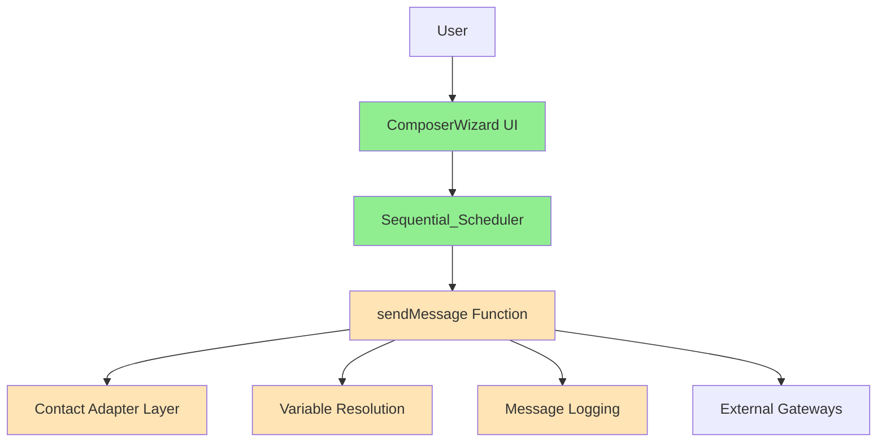

# Design Document: Multi-Contact Messaging

## Overview

This feature adds multi-entity messaging capability to the existing messaging portal by introducing a thin orchestration layer on top of the current messaging infrastructure. The design focuses on enabling users to select multiple schools/entities from the UI and send messages sequentially without modifying any existing messaging engine logic.

The core principle is **integration, not modification**: we add new UI components and an orchestration scheduler while preserving all existing functionality in sendMessage, variable resolution, contact adapter, and message logging.

### Key Design Decisions

1. **Orchestration Pattern**: Sequential_Scheduler calls the existing sendMessage function repeatedly rather than modifying sendMessage to handle multiple recipients
2. **UI Integration**: EntitySelector component integrates into existing ComposerWizard Step 2 alongside current single-recipient input
3. **Contact Resolution**: Leverage existing Contact Adapter Layer and sendMessage's built-in contact resolution logic
4. **Variable Resolution**: Use existing variable resolution in sendMessage without any changes
5. **Logging**: Rely on existing individual message logging in sendMessage
6. **Backward Compatibility**: All existing workflows (single-recipient, CSV bulk, scheduled messages, attachments) continue to work unchanged

### Scope Boundaries

**In Scope (PRIMARY)**:
- EntitySelector UI component for multi-entity selection
- Sequential_Scheduler orchestration layer
- Integration into ComposerWizard Step 2
- Progress tracking UI during sequential sends
- Summary reporting after bulk sends

**Out of Scope (OPTIONAL - Can be deferred)**:
- ContactSelector for multi-contact within entity
- Modifications to sendMessage function
- Changes to variable resolution logic
- Changes to message logging structure
- Changes to Contact Adapter Layer

## Architecture

### System Context



**Legend**:
- Green: New components being added
- Beige: Existing components (no modifications)

### Component Architecture

The architecture introduces only two new components:

1. **EntitySelector** (UI Component): Multi-entity selection interface
2. **Sequential_Scheduler** (Orchestration Layer): Queues and sends messages sequentially

All other components remain unchanged.

## Components and Interfaces

### 1. EntitySelector Component

**Purpose**: Provide UI for selecting multiple entities (schools) in the messaging portal.

**Location**: `src/app/admin/messaging/composer/components/EntitySelector.tsx`

**Interface**:
```typescript
interface EntitySelectorProps {
  channel: 'email' | 'sms';
  onSelectionChange: (entityIds: string[]) => void;
  selectedEntityIds: string[];
  maxSelections?: number; // Default 100
}

export function EntitySelector(props: EntitySelectorProps): JSX.Element;
```

**Key Features**:
- Searchable entity list with filtering by name, location, status
- Checkbox-based multi-selection
- "Select All" with confirmation dialog
- Display count of selected entities
- Remove individual selections
- Pagination (50 entities per page)
- Debounced search (300ms)

**State Management**:
```typescript
const [searchTerm, setSearchTerm] = useState('');
const [selectedIds, setSelectedIds] = useState<string[]>([]);
const [showConfirmDialog, setShowConfirmDialog] = useState(false);
```

**Data Loading**:
Uses existing Firestore hooks to load schools/entities:
```typescript
const schoolsQuery = useMemoFirebase(() => {
  if (!firestore) return null;
  return query(
    collection(firestore, 'schools'), 
    orderBy('name', 'asc')
  );
}, [firestore]);

const { data: schools } = useCollection<School>(schoolsQuery);
```

### 2. Sequential_Scheduler

**Purpose**: Orchestrate sequential message sending by calling sendMessage for each selected entity.

**Location**: `src/lib/sequential-scheduler.ts`

**Interface**:
```typescript
interface ScheduleMessageInput {
  templateId: string;
  senderProfileId: string;
  entityIds: string[]; // Array of schoolIds
  variables: Record<string, any>;
  attachments?: EmailAttachment[];
  workspaceId?: string;
  scheduledAt?: string;
  delayMs?: number; // Default 500ms
  onProgress?: (sent: number, total: number, currentEntity: string) => void;
  onError?: (entityId: string, error: string) => void;
}

interface ScheduleMessageResult {
  success: boolean;
  totalSent: number;
  totalFailed: number;
  failedEntities: Array<{ entityId: string; error: string }>;
  logIds: string[];
}

export async function scheduleMultiEntityMessages(
  input: ScheduleMessageInput
): Promise<ScheduleMessageResult>;
```

**Implementation Strategy**:

```typescript
export async function scheduleMultiEntityMessages(
  input: ScheduleMessageInput
): Promise<ScheduleMessageResult> {
  const {
    templateId,
    senderProfileId,
    entityIds,
    variables,
    attachments,
    workspaceId,
    scheduledAt,
    delayMs = 500,
    onProgress,
    onError
  } = input;

  const results: ScheduleMessageResult = {
    success: true,
    totalSent: 0,
    totalFailed: 0,
    failedEntities: [],
    logIds: []
  };

  // Validate queue size
  if (entityIds.length > 500) {
    throw new Error('Maximum queue size of 500 messages exceeded');
  }

  // Sequential processing
  for (let i = 0; i < entityIds.length; i++) {
    const entityId = entityIds[i];
    
    try {
      // Call existing sendMessage function
      // The existing function will:
      // 1. Resolve contact via Contact Adapter Layer
      // 2. Resolve all variables (school, contact, tag, constants)
      // 3. Determine recipient email/phone from contact
      // 4. Create individual message log
      // 5. Send via gateway
      const result = await sendMessage({
        templateId,
        senderProfileId,
        recipient: '', // Empty - sendMessage will resolve from schoolId
        variables,
        attachments,
        schoolId: entityId,
        workspaceId,
        scheduledAt
      });

      if (result.success) {
        results.totalSent++;
        if (result.logId) results.logIds.push(result.logId);
      } else {
        results.totalFailed++;
        results.failedEntities.push({
          entityId,
          error: result.error || 'Unknown error'
        });
        if (onError) onError(entityId, result.error || 'Unknown error');
      }

      // Progress callback
      if (onProgress) {
        onProgress(i + 1, entityIds.length, entityId);
      }

      // Delay between messages (except last one)
      if (i < entityIds.length - 1) {
        await new Promise(resolve => setTimeout(resolve, delayMs));
      }

    } catch (error: any) {
      results.totalFailed++;
      results.failedEntities.push({
        entityId,
        error: error.message
      });
      if (onError) onError(entityId, error.message);
    }
  }

  results.success = results.totalFailed === 0;
  return results;
}
```

**Key Characteristics**:
- Does NOT modify sendMessage signature or behavior
- Passes empty recipient string - sendMessage resolves from schoolId
- Waits for each sendMessage to complete before starting next
- Implements configurable delay between messages
- Continues on individual failures
- Provides progress callbacks for UI updates
- Enforces maximum queue size of 500

### 3. ComposerWizard Integration

**Modifications to ComposerWizard.tsx**:

**Step 2 UI Enhancement**:
Add EntitySelector alongside existing single-recipient input:

```typescript
// Add to form schema
const formSchema = z.object({
  // ... existing fields
  selectedEntityIds: z.array(z.string()).default([]),
  useMultiEntity: z.boolean().default(false),
});

// Add state for multi-entity mode
const [useMultiEntity, setUseMultiEntity] = useState(false);
const [sendProgress, setSendProgress] = useState({ sent: 0, total: 0 });

// In Step 2 render:
<div className="space-y-4">
  <div className="flex items-center gap-4">
    <Switch
      checked={useMultiEntity}
      onCheckedChange={setUseMultiEntity}
    />
    <Label>Send to multiple schools</Label>
  </div>

  {useMultiEntity ? (
    <EntitySelector
      channel={watchedChannel}
      selectedEntityIds={watch('selectedEntityIds')}
      onSelectionChange={(ids) => setValue('selectedEntityIds', ids)}
    />
  ) : (
    // Existing single-recipient input
    <Input {...existingRecipientInput} />
  )}
</div>
```

**Submit Handler Enhancement**:

```typescript
const onSubmit = async (data: FormData) => {
  if (!user) return;
  setIsSubmitting(true);

  try {
    // Multi-entity mode
    if (data.useMultiEntity && data.selectedEntityIds.length > 0) {
      const result = await scheduleMultiEntityMessages({
        templateId: data.templateId,
        senderProfileId: data.senderProfileId,
        entityIds: data.selectedEntityIds,
        variables: data.variables,
        attachments: data.attachments,
        workspaceId: data.workspaceId,
        scheduledAt: data.isScheduled ? data.scheduledAt?.toISOString() : undefined,
        onProgress: (sent, total, currentEntity) => {
          setSendProgress({ sent, total });
        },
        onError: (entityId, error) => {
          console.error(`Failed to send to ${entityId}:`, error);
        }
      });

      toast({
        title: 'Bulk Send Complete',
        description: `Sent: ${result.totalSent}, Failed: ${result.totalFailed}`
      });
    }
    // Single-recipient mode (existing logic)
    else {
      await sendMessage({
        // ... existing single-recipient logic
      });
    }
  } catch (error: any) {
    toast({ variant: 'destructive', title: 'Send Failed', description: error.message });
  } finally {
    setIsSubmitting(false);
  }
};
```

**Progress Display**:

```typescript
{isSubmitting && sendProgress.total > 0 && (
  <Card>
    <CardContent className="pt-6">
      <div className="space-y-2">
        <div className="flex justify-between text-sm">
          <span>Sending messages...</span>
          <span>{sendProgress.sent} / {sendProgress.total}</span>
        </div>
        <Progress 
          value={(sendProgress.sent / sendProgress.total) * 100} 
        />
      </div>
    </CardContent>
  </Card>
)}
```

## Data Models

### No New Database Collections

This feature does NOT introduce any new database collections or modify existing schemas. All data models remain unchanged:

- `schools` collection: Used as-is for entity selection
- `entities` collection: Used as-is via Contact Adapter Layer
- `workspace_entities` collection: Used as-is via Contact Adapter Layer
- `message_logs` collection: Individual logs created by existing sendMessage function
- `message_templates` collection: Used as-is
- `sender_profiles` collection: Used as-is

### Runtime Data Structures

**EntitySelection** (UI state only):
```typescript
interface EntitySelection {
  entityId: string;
  entityName: string;
  estimatedRecipient: string; // Preview only
}
```

**SendProgress** (UI state only):
```typescript
interface SendProgress {
  sent: number;
  total: number;
  currentEntity?: string;
  errors: Array<{ entityId: string; error: string }>;
}
```

## Correctness Properties

*A property is a characteristic or behavior that should hold true across all valid executions of a system-essentially, a formal statement about what the system should do. Properties serve as the bridge between human-readable specifications and machine-verifiable correctness guarantees.*


### Property 1: Entity List Display Completeness

*For any* set of entities in the database, the EntitySelector component should display all entities that match the current filter criteria.

**Validates: Requirements 1.2**

### Property 2: Entity Filtering Correctness

*For any* filter term (name, location, or status), all entities displayed by the EntitySelector should match the filter criteria, and all entities matching the criteria should be displayed.

**Validates: Requirements 1.4**

### Property 3: Selection Count Validation

*For any* number of selected entities between 1 and 100, the selection should be accepted; selecting 0 entities or more than 100 entities should be rejected with appropriate validation errors.

**Validates: Requirements 1.5**

### Property 4: Selection Count Display Accuracy

*For any* set of selected entities, the displayed count in the EntitySelector should equal the actual number of selected entities.

**Validates: Requirements 1.6**

### Property 5: Select All Confirmation Display

*For any* entity list, when the "Select All" option is triggered, a confirmation dialog should appear displaying the total number of entities and the estimated message count.

**Validates: Requirements 1.8**

### Property 6: Entity Deselection

*For any* selected entity, clicking to deselect that entity should remove it from the selection list.

**Validates: Requirements 1.9**

### Property 7: Sequential Scheduler Invocation Count

*For any* list of N entities, the Sequential_Scheduler should invoke the sendMessage function exactly N times, once per entity.

**Validates: Requirements 3.1**

### Property 8: SchoolId Parameter Passing

*For any* entity in the selected list, the Sequential_Scheduler should call sendMessage with that entity's schoolId as a parameter.

**Validates: Requirements 3.3, 6.5**

### Property 9: Entity Skipping on Invalid Contact

*For any* entity without a valid primary contact for the selected channel, the Sequential_Scheduler should skip that entity, log a warning, and continue processing remaining entities.

**Validates: Requirements 3.5, 9.2**

### Property 10: Message Count Preview Accuracy

*For any* selection of entities, the displayed preview message count should equal the number of selected entities (or number of selected entities × selected contacts per entity if multi-contact is implemented).

**Validates: Requirements 3.6, 7.5**

### Property 11: Sequential Execution Order

*For any* list of messages in the queue, each sendMessage call should complete before the next sendMessage call begins.

**Validates: Requirements 4.1, 4.2**

### Property 12: Error Resilience

*For any* message that fails during sequential sending, the Sequential_Scheduler should log the failure and continue processing the remaining messages in the queue.

**Validates: Requirements 4.3, 9.3**

### Property 13: Inter-Message Delay

*For any* two consecutive sendMessage calls in the queue, there should be a configurable delay (default 500ms) between the completion of the first and the start of the second.

**Validates: Requirements 4.4**

### Property 14: Progress Tracking Accuracy

*For any* point during sequential sending, the displayed progress (sent count and remaining count) should accurately reflect the actual number of messages sent and remaining.

**Validates: Requirements 4.5**

### Property 15: ScheduledAt Parameter Propagation

*For any* scheduledAt value provided to the Sequential_Scheduler, that value should be passed to every sendMessage call in the queue.

**Validates: Requirements 4.6**

### Property 16: Summary Report Accuracy

*For any* completed bulk send operation, the summary report should display success and failure counts that match the actual number of successful and failed sendMessage calls.

**Validates: Requirements 5.7**

### Property 17: Selected Entity Display

*For any* selected entity, the Messaging_Portal should display that entity in a visually distinct section with its name and relevant details.

**Validates: Requirements 7.3**

### Property 18: Remove Button Availability

*For any* selected entity displayed in the selection list, a "Remove" button should be present and functional for that entity.

**Validates: Requirements 7.4**

### Property 19: Message Preview Variable Resolution

*For any* selected entity list with at least one entity, the message preview should display the message content with variables resolved using the first entity's data.

**Validates: Requirements 7.8**

### Property 20: Error Summary Display

*For any* bulk send operation that completes with one or more failures, the Messaging_Portal should display an error summary showing the number of failed messages.

**Validates: Requirements 9.4**

### Property 21: Pagination Behavior

*For any* entity list with more than 50 entities, the EntitySelector should display entities in pages of 50, with navigation controls to move between pages.

**Validates: Requirements 10.1**

### Property 22: Search Debouncing

*For any* sequence of rapid search input changes, the EntitySelector should only trigger a search operation after 300ms of input inactivity.

**Validates: Requirements 10.4**

## Error Handling

### Error Categories

**1. Validation Errors (User-Facing)**:
- No entities selected: Display "No recipients selected" error
- Selection exceeds 100 entities: Display "Maximum 100 entities allowed" error
- Queue size exceeds 500: Display "Maximum queue size of 500 messages exceeded" error
- No valid recipients: Display "No valid recipients found for selected channel" error

**2. Runtime Errors (Graceful Degradation)**:
- Entity has no valid contact: Skip entity, log warning, continue
- sendMessage fails for one entity: Log error, continue with remaining entities
- Network timeout: Retry once, then skip and continue

**3. System Errors (Fatal)**:
- Firestore connection failure: Display error, abort operation
- Invalid template or sender profile: Display error, prevent submission

### Error Handling Strategy

**Sequential_Scheduler Error Handling**:
```typescript
try {
  const result = await sendMessage({...});
  if (result.success) {
    results.totalSent++;
  } else {
    // Non-fatal: log and continue
    results.totalFailed++;
    results.failedEntities.push({ entityId, error: result.error });
    if (onError) onError(entityId, result.error);
  }
} catch (error: any) {
  // Unexpected error: log and continue
  results.totalFailed++;
  results.failedEntities.push({ entityId, error: error.message });
  if (onError) onError(entityId, error.message);
}
```

**UI Error Display**:
- Validation errors: Inline error messages with red styling
- Runtime errors: Toast notifications for individual failures
- Summary errors: Modal dialog after bulk send completion showing all failures

### Error Recovery

- Users can retry failed entities by selecting them again
- Failed entity IDs are included in the summary report
- Error messages include actionable guidance (e.g., "Check contact information for School XYZ")

## Testing Strategy

### Dual Testing Approach

This feature requires both unit tests and property-based tests for comprehensive coverage:

**Unit Tests**: Focus on specific examples, edge cases, and UI interactions
- EntitySelector renders correctly
- Submit button is disabled when no entities selected
- Confirmation dialog appears for "Select All"
- Progress bar updates during sending
- Error messages display correctly
- Backward compatibility: single-recipient mode still works
- Backward compatibility: CSV bulk mode still works

**Property-Based Tests**: Verify universal properties across all inputs
- Use fast-check library for TypeScript/React
- Minimum 100 iterations per property test
- Each test references its design document property

### Property-Based Testing Configuration

**Library**: fast-check (TypeScript property-based testing library)

**Test Structure**:
```typescript
import fc from 'fast-check';

describe('Sequential Scheduler Properties', () => {
  it('Property 7: Sequential Scheduler Invocation Count', async () => {
    // Feature: multi-contact-messaging, Property 7: For any list of N entities, 
    // the Sequential_Scheduler should invoke sendMessage exactly N times
    
    await fc.assert(
      fc.asyncProperty(
        fc.array(fc.string(), { minLength: 1, maxLength: 100 }), // Generate entity IDs
        async (entityIds) => {
          let callCount = 0;
          const mockSendMessage = jest.fn().mockImplementation(async () => {
            callCount++;
            return { success: true };
          });

          await scheduleMultiEntityMessages({
            entityIds,
            templateId: 'test-template',
            senderProfileId: 'test-sender',
            variables: {},
            sendMessageFn: mockSendMessage // Inject mock
          });

          expect(callCount).toBe(entityIds.length);
        }
      ),
      { numRuns: 100 }
    );
  });

  it('Property 11: Sequential Execution Order', async () => {
    // Feature: multi-contact-messaging, Property 11: For any list of messages, 
    // each sendMessage call should complete before the next begins
    
    await fc.assert(
      fc.asyncProperty(
        fc.array(fc.string(), { minLength: 2, maxLength: 10 }),
        async (entityIds) => {
          const executionOrder: string[] = [];
          const mockSendMessage = jest.fn().mockImplementation(async (input) => {
            executionOrder.push(`start-${input.schoolId}`);
            await new Promise(resolve => setTimeout(resolve, 10));
            executionOrder.push(`end-${input.schoolId}`);
            return { success: true };
          });

          await scheduleMultiEntityMessages({
            entityIds,
            templateId: 'test-template',
            senderProfileId: 'test-sender',
            variables: {},
            sendMessageFn: mockSendMessage
          });

          // Verify sequential execution: each end should come before next start
          for (let i = 0; i < entityIds.length - 1; i++) {
            const currentEndIndex = executionOrder.indexOf(`end-${entityIds[i]}`);
            const nextStartIndex = executionOrder.indexOf(`start-${entityIds[i + 1]}`);
            expect(currentEndIndex).toBeLessThan(nextStartIndex);
          }
        }
      ),
      { numRuns: 100 }
    );
  });

  it('Property 12: Error Resilience', async () => {
    // Feature: multi-contact-messaging, Property 12: For any message that fails, 
    // the scheduler should continue processing remaining messages
    
    await fc.assert(
      fc.asyncProperty(
        fc.array(fc.string(), { minLength: 3, maxLength: 20 }),
        fc.integer({ min: 0, max: 100 }), // Random failure index
        async (entityIds, failureIndex) => {
          const actualFailureIndex = failureIndex % entityIds.length;
          let callCount = 0;
          
          const mockSendMessage = jest.fn().mockImplementation(async (input) => {
            const currentIndex = entityIds.indexOf(input.schoolId);
            callCount++;
            
            if (currentIndex === actualFailureIndex) {
              return { success: false, error: 'Simulated failure' };
            }
            return { success: true };
          });

          const result = await scheduleMultiEntityMessages({
            entityIds,
            templateId: 'test-template',
            senderProfileId: 'test-sender',
            variables: {},
            sendMessageFn: mockSendMessage
          });

          // All entities should be processed despite one failure
          expect(callCount).toBe(entityIds.length);
          expect(result.totalFailed).toBe(1);
          expect(result.totalSent).toBe(entityIds.length - 1);
        }
      ),
      { numRuns: 100 }
    );
  });
});
```

### Unit Test Examples

```typescript
describe('EntitySelector Component', () => {
  it('should render entity list with checkboxes', () => {
    const entities = [
      { id: '1', name: 'School A' },
      { id: '2', name: 'School B' }
    ];
    
    const { getAllByRole } = render(
      <EntitySelector 
        channel="email"
        selectedEntityIds={[]}
        onSelectionChange={jest.fn()}
      />
    );
    
    const checkboxes = getAllByRole('checkbox');
    expect(checkboxes).toHaveLength(entities.length);
  });

  it('should display error when no entities selected', () => {
    const { getByText, getByRole } = render(<ComposerWizard />);
    
    // Navigate to Step 2
    fireEvent.click(getByText('Next Phase'));
    
    // Enable multi-entity mode
    fireEvent.click(getByRole('switch'));
    
    // Try to submit without selection
    fireEvent.click(getByText('Send Messages'));
    
    expect(getByText('No recipients selected')).toBeInTheDocument();
  });

  it('should maintain backward compatibility with single-recipient mode', () => {
    const { getByPlaceholderText, getByRole } = render(<ComposerWizard />);
    
    // Single-recipient input should be present
    const recipientInput = getByPlaceholderText(/parent@example.com/i);
    expect(recipientInput).toBeInTheDocument();
    
    // Should be able to enter recipient manually
    fireEvent.change(recipientInput, { target: { value: 'test@example.com' } });
    expect(recipientInput).toHaveValue('test@example.com');
  });
});
```

### Test Coverage Goals

- Unit test coverage: 80% of new code (EntitySelector, Sequential_Scheduler, ComposerWizard changes)
- Property test coverage: All 22 correctness properties
- Integration test coverage: End-to-end flow from entity selection to message sending
- Backward compatibility: All existing tests continue to pass

### Testing Priorities

1. **Critical Path**: Sequential_Scheduler orchestration logic (Properties 7, 11, 12)
2. **User-Facing**: EntitySelector UI behavior (Properties 2, 3, 4, 6)
3. **Data Integrity**: Parameter passing and variable resolution (Properties 8, 15, 19)
4. **Error Handling**: Validation and error resilience (Properties 9, 12, 20)
5. **Performance**: Pagination and debouncing (Properties 21, 22)

## Implementation Notes

### Development Phases

**Phase 1: Core Orchestration** (Highest Priority)
- Implement Sequential_Scheduler in `src/lib/sequential-scheduler.ts`
- Add unit tests for scheduler logic
- Add property tests for Properties 7, 11, 12

**Phase 2: UI Components** (High Priority)
- Implement EntitySelector component
- Add to ComposerWizard Step 2
- Add unit tests for UI interactions
- Add property tests for Properties 2, 3, 4, 6

**Phase 3: Integration** (Medium Priority)
- Wire EntitySelector to Sequential_Scheduler
- Add progress tracking UI
- Add summary reporting
- Add property tests for Properties 14, 16, 20

**Phase 4: Polish** (Lower Priority)
- Add pagination to EntitySelector
- Add search debouncing
- Add confirmation dialogs
- Add property tests for Properties 21, 22

**Phase 5: Optional Enhancements** (Future)
- ContactSelector for multi-contact within entity (Requirement 2)
- Batch metadata tracking (Requirement 5.6)

### Key Implementation Constraints

1. **DO NOT modify sendMessage function**: All changes must be in new files
2. **DO NOT modify Contact Adapter Layer**: Use as-is for contact resolution
3. **DO NOT modify variable resolution logic**: Rely on existing sendMessage behavior
4. **DO NOT modify message logging**: Individual logs created by sendMessage
5. **DO NOT break existing workflows**: Single-recipient and CSV bulk must continue working

### Dependencies

**New Dependencies**: None (use existing libraries)
- fast-check: Already available for property-based testing
- React Hook Form: Already used in ComposerWizard
- Firestore hooks: Already available

**Existing Dependencies**:
- sendMessage function: `src/lib/messaging-engine.ts`
- Contact Adapter Layer: `src/lib/contact-adapter.ts`
- Variable resolution: `src/lib/messaging-utils.ts`
- ComposerWizard: `src/app/admin/messaging/composer/components/ComposerWizard.tsx`

### Performance Considerations

1. **Pagination**: Load entities in chunks of 50 to avoid rendering delays
2. **Debouncing**: 300ms delay on search input to reduce query load
3. **Memoization**: Use React.memo for EntitySelector to prevent unnecessary re-renders
4. **Sequential Delay**: 500ms default delay between messages to avoid rate limits
5. **Queue Size Limit**: Maximum 500 messages to prevent memory issues

### Security Considerations

1. **Authorization**: Verify user has permission to send messages to selected entities
2. **Rate Limiting**: Sequential sending with delays prevents gateway rate limit violations
3. **Input Validation**: Validate entity IDs and selection counts before processing
4. **Error Exposure**: Don't expose sensitive error details in UI messages

## Deployment Strategy

### Rollout Plan

**Stage 1: Internal Testing**
- Deploy to staging environment
- Test with small entity lists (< 10 entities)
- Verify backward compatibility with existing workflows

**Stage 2: Limited Release**
- Enable for admin users only
- Monitor error rates and performance
- Gather user feedback

**Stage 3: General Availability**
- Enable for all messaging administrators
- Monitor gateway rate limits
- Document new workflow in user guide

### Rollback Plan

If issues arise:
1. Disable multi-entity mode via feature flag
2. Revert to single-recipient and CSV bulk modes only
3. Investigate and fix issues in staging
4. Re-deploy after validation

### Monitoring

**Metrics to Track**:
- Average entities selected per message
- Sequential send completion rate
- Individual message failure rate
- Average time to complete bulk send
- Gateway rate limit violations

**Alerts**:
- Failure rate > 10% for bulk sends
- Queue size approaching 500 limit
- Gateway rate limit violations
- Sequential_Scheduler errors

## Future Enhancements

### Optional Features (Deferred)

1. **Multi-Contact Selection** (Requirement 2)
   - ContactSelector component for selecting multiple contacts within an entity
   - Expand Sequential_Scheduler to handle multiple contacts per entity
   - Update message count calculations

2. **Batch Metadata Tracking** (Requirement 5.6)
   - Add batchId field to message logs
   - Group related messages in logs view
   - Batch-level analytics and reporting

3. **Advanced Filtering**
   - Filter entities by tags
   - Filter entities by workspace
   - Save filter presets

4. **Scheduling Optimization**
   - Parallel sending with rate limiting
   - Priority queue for urgent messages
   - Retry failed messages automatically

### Integration Opportunities

1. **Tag-Based Audience Selection**: Integrate with existing TagAudienceSelector component
2. **Workspace Filtering**: Filter entities by workspace context
3. **Analytics Dashboard**: Track multi-entity messaging usage and effectiveness
4. **Template Recommendations**: Suggest templates based on selected entities

## Conclusion

This design provides a minimal, focused solution for multi-entity messaging by adding a thin orchestration layer on top of the existing messaging infrastructure. The Sequential_Scheduler and EntitySelector components integrate seamlessly with the current system without requiring any modifications to core messaging logic.

The design prioritizes:
- **Simplicity**: Only two new components
- **Integration**: Works with existing sendMessage, Contact Adapter, and variable resolution
- **Backward Compatibility**: All existing workflows continue unchanged
- **Testability**: Comprehensive property-based and unit test coverage
- **Maintainability**: Clear separation of concerns, no modifications to existing code

By following this design, we enable efficient multi-entity messaging while preserving the stability and reliability of the existing messaging system.
