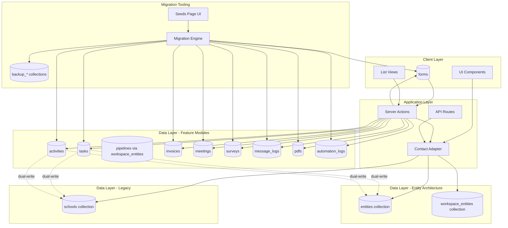

# Design Document: SchoolId to EntityId Migration

## Overview

This design document specifies the technical solution for migrating the SmartSapp application from using `schoolId` as the primary contact identifier to using `entityId` across all features. The migration implements a dual-write pattern during the transition period, maintaining backward compatibility while progressively adopting the unified entity architecture.

The core entity system (entities and workspace_entities collections) has already been migrated. This design focuses on migrating 11 feature modules (tasks, activities, pipelines, dashboard, forms, invoices, meetings, signups, profiles, settings, surveys) and providing comprehensive migration tooling through the seeds page.

### Design Goals

1. **Zero Downtime**: Maintain full application functionality during migration
2. **Backward Compatibility**: Support both legacy schoolId and new entityId references
3. **Data Integrity**: Ensure no data loss during migration with full rollback capability
4. **Progressive Migration**: Enable feature-by-feature migration without big-bang deployment
5. **Developer Experience**: Provide clear patterns and tooling for migrating each feature
6. **Performance**: Maintain or improve query performance with proper indexing

### Key Architectural Decisions

1. **Dual-Write Pattern**: Write both schoolId and entityId during transition period
2. **Contact Adapter Layer**: Unified interface for resolving contact data from either legacy or migrated sources
3. **Fetch-Enrich-Restore Protocol**: Consistent migration pattern with backup and rollback
4. **Seeds Page Tooling**: Administrative UI for executing and monitoring migrations
5. **Idempotent Operations**: All migrations can be safely re-run
6. **Batch Processing**: Handle large datasets within Firestore limits (500 operations per batch)


## Architecture

### System Architecture Diagram



### Architecture Layers

#### 1. Contact Adapter Layer

The Contact Adapter provides a unified interface for resolving contact data regardless of migration status:

```typescript
interface ContactAdapter {
  // Resolve contact by either schoolId or entityId
  resolveContact(identifier: { schoolId?: string; entityId?: string }, workspaceId: string): Promise<ResolvedContact>;
  
  // Query contacts for a workspace
  getWorkspaceContacts(workspaceId: string): Promise<ResolvedContact[]>;
  
  // Check if a contact exists
  contactExists(identifier: { schoolId?: string; entityId?: string }): Promise<boolean>;
}
```

The adapter handles three scenarios:
- **Legacy Only**: Contact exists only in schools collection (migrationStatus !== 'migrated')
- **Migrated**: Contact exists in entities + workspace_entities (migrationStatus === 'migrated')
- **Dual State**: Contact exists in both (during transition)


#### 2. Server Actions Layer

Server actions implement the dual-write pattern:

```typescript
// Example: Create Task with dual-write
async function createTask(input: CreateTaskInput): Promise<Task> {
  const task: Task = {
    id: generateId(),
    workspaceId: input.workspaceId,
    title: input.title,
    // Dual-write: populate both identifiers
    schoolId: input.schoolId || null,
    entityId: input.entityId || null,
    entityType: input.entityType || null,
    // ... other fields
  };
  
  await setDoc(doc(firestore, 'tasks', task.id), task);
  return task;
}
```

#### 3. Migration Engine

The migration engine implements the Fetch-Enrich-Restore protocol:

```typescript
interface MigrationEngine {
  // Fetch records needing migration
  fetch(collection: string): Promise<MigrationBatch>;
  
  // Enrich with entityId by resolving schoolId
  enrich(batch: MigrationBatch): Promise<EnrichedBatch>;
  
  // Restore to Firestore with backups
  restore(batch: EnrichedBatch): Promise<MigrationResult>;
  
  // Verify migration completeness
  verify(collection: string): Promise<VerificationResult>;
  
  // Rollback to pre-migration state
  rollback(collection: string): Promise<RollbackResult>;
}
```

### Data Flow Patterns

#### Pattern 1: Query with Fallback

```typescript
// Query by entityId first, fallback to schoolId
async function getTasksForContact(contactId: { entityId?: string; schoolId?: string }) {
  let query = collection(firestore, 'tasks');
  
  if (contactId.entityId) {
    query = query.where('entityId', '==', contactId.entityId);
  } else if (contactId.schoolId) {
    query = query.where('schoolId', '==', contactId.schoolId);
  }
  
  return await getDocs(query);
}
```

#### Pattern 2: Dual-Write on Create/Update

```typescript
// Always write both identifiers when available
async function updateTask(taskId: string, updates: Partial<Task>) {
  const task = await getTask(taskId);
  
  // If updating contact reference, resolve both identifiers
  if (updates.entityId) {
    const contact = await contactAdapter.resolveContact({ entityId: updates.entityId });
    updates.schoolId = contact.schoolData?.id || null;
  }
  
  await updateDoc(doc(firestore, 'tasks', taskId), updates);
}
```

#### Pattern 3: Contact Resolution

```typescript
// Resolve contact data through adapter
async function displayTask(task: Task) {
  const contact = await contactAdapter.resolveContact({
    entityId: task.entityId,
    schoolId: task.schoolId
  }, task.workspaceId);
  
  return {
    ...task,
    contactName: contact.name,
    contactEmail: contact.primaryEmail,
    contactTags: contact.tags
  };
}
```


## Components and Interfaces

### Core Data Models

#### Entity (Already Migrated)

```typescript
interface Entity {
  id: string; // Format: entity_<random_id>
  organizationId: string;
  entityType: 'institution' | 'family' | 'person';
  name: string;
  slug?: string; // For institutions
  contacts: FocalPerson[];
  globalTags: string[]; // Identity-level tags
  status?: 'active' | 'archived';
  createdAt: string;
  updatedAt: string;
  
  // Scope-specific data (only one populated)
  institutionData?: InstitutionData;
  familyData?: FamilyData;
  personData?: PersonData;
  
  // Reserved for future relationships
  relatedEntityIds?: string[];
}

interface InstitutionData {
  nominalRoll: number;
  billingAddress: string;
  currency: string;
  subscriptionPackageId: string;
  subscriptionRate: number;
  focalPersons: FocalPerson[];
}

interface FamilyData {
  guardians: Guardian[];
  children: Child[];
  homeAddress: string;
}

interface PersonData {
  firstName: string;
  lastName: string;
  email: string;
  phone: string;
  company?: string;
  title?: string;
}
```

#### WorkspaceEntity (Already Migrated)

```typescript
interface WorkspaceEntity {
  id: string; // Format: {workspaceId}_{entityId}
  organizationId: string;
  workspaceId: string;
  entityId: string;
  entityType: 'institution' | 'family' | 'person';
  
  // Pipeline state
  pipelineId: string;
  stageId: string;
  currentStageName?: string;
  
  // Assignment
  assignedTo?: {
    userId: string | null;
    name: string | null;
    email: string | null;
  };
  
  // Status
  status: 'active' | 'archived';
  workspaceTags: string[]; // Workspace-scoped tags
  lastContactedAt?: string;
  
  // Denormalized fields for performance
  displayName: string;
  primaryEmail?: string;
  primaryPhone?: string;
  
  addedAt: string;
  updatedAt: string;
}
```


### Feature Module Data Models

#### Task (Migrating)

```typescript
interface Task {
  id: string;
  organizationId?: string;
  workspaceId: string;
  title: string;
  description: string;
  priority: 'low' | 'medium' | 'high' | 'urgent';
  status: 'todo' | 'in_progress' | 'waiting' | 'review' | 'done';
  category: 'call' | 'visit' | 'document' | 'training' | 'general';
  assignedTo: string;
  assignedToName?: string;
  
  // Dual-write fields (both optional during migration)
  schoolId?: string | null; // Legacy field
  schoolName?: string | null; // Legacy field
  entityId?: string | null; // New field
  entityType?: 'institution' | 'family' | 'person'; // New field
  
  dueDate: string;
  startDate?: string;
  createdAt: string;
  updatedAt: string;
  completedAt?: string;
  source?: 'manual' | 'automation' | 'system';
  automationId?: string;
  attachments?: TaskAttachment[];
  notes?: TaskNote[];
  reminders: TaskReminder[];
  reminderSent: boolean;
  relatedEntityType?: 'SurveyResponse' | 'Submission' | 'Meeting' | 'School' | null;
  relatedParentId?: string | null;
  relatedEntityId?: string | null;
}
```

#### Activity (Migrating)

```typescript
interface Activity {
  id: string;
  organizationId?: string;
  workspaceId: string;
  type: 'call' | 'email' | 'meeting' | 'note' | 'status_change' | 'task_completed' | 'form_submitted';
  description: string;
  
  // Dual-write fields
  schoolId?: string | null; // Legacy field
  schoolName?: string | null; // Legacy field
  entityId?: string | null; // New field
  entityType?: 'institution' | 'family' | 'person'; // New field
  entitySlug?: string; // Denormalized for performance
  displayName?: string; // Denormalized for performance
  
  userId: string;
  userName?: string;
  timestamp: string;
  metadata?: Record<string, any>;
  createdAt: string;
}
```

#### Form (Migrating)

```typescript
interface Form {
  id: string;
  organizationId?: string;
  workspaceId: string;
  title: string;
  description: string;
  
  // Dual-write fields
  schoolId?: string | null; // Legacy field
  entityId?: string | null; // New field
  entityType?: 'institution' | 'family' | 'person'; // New field
  
  fields: FormField[];
  status: 'draft' | 'published' | 'archived';
  createdBy: string;
  createdAt: string;
  updatedAt: string;
}

interface FormSubmission {
  id: string;
  formId: string;
  
  // Dual-write fields
  schoolId?: string | null;
  entityId?: string | null;
  entityType?: 'institution' | 'family' | 'person';
  
  responses: Record<string, any>;
  submittedAt: string;
  submittedBy?: string;
}
```


#### Invoice (Migrating)

```typescript
interface Invoice {
  id: string;
  invoiceNumber: string;
  organizationId?: string;
  
  // Dual-write fields
  schoolId?: string; // Legacy field
  schoolName?: string; // Legacy field
  entityId?: string; // New field
  entityType?: 'institution' | 'family' | 'person'; // New field
  
  periodId: string;
  periodName: string;
  nominalRoll?: number;
  packageId?: string;
  items: InvoiceItem[];
  subtotal: number;
  tax: number;
  total: number;
  status: 'draft' | 'sent' | 'paid' | 'partial' | 'overdue';
  dueDate: string;
  paidDate?: string;
  paidAmount?: number;
  createdAt: string;
  updatedAt: string;
}
```

#### Meeting (Migrating)

```typescript
interface Meeting {
  id: string;
  organizationId?: string;
  workspaceId: string;
  title: string;
  description: string;
  
  // Dual-write fields
  schoolSlug?: string; // Legacy field (used in public URLs)
  entityId?: string; // New field
  entityType?: 'institution' | 'family' | 'person'; // New field
  
  startTime: string;
  endTime: string;
  location?: string;
  meetingLink?: string;
  attendees: string[];
  status: 'scheduled' | 'completed' | 'cancelled';
  createdBy: string;
  createdAt: string;
  updatedAt: string;
}
```

#### Survey (Migrating)

```typescript
interface Survey {
  id: string;
  organizationId?: string;
  workspaceId: string;
  title: string;
  description: string;
  
  // Dual-write fields
  schoolId?: string | null; // Legacy field
  entityId?: string | null; // New field
  entityType?: 'institution' | 'family' | 'person'; // New field
  
  questions: SurveyQuestion[];
  status: 'draft' | 'active' | 'closed';
  createdBy: string;
  createdAt: string;
  updatedAt: string;
}

interface SurveyResponse {
  id: string;
  surveyId: string;
  
  // Dual-write fields
  schoolId?: string | null;
  entityId?: string | null;
  entityType?: 'institution' | 'family' | 'person';
  
  answers: Record<string, any>;
  submittedAt: string;
  submittedBy?: string;
}
```


#### MessageLog (Migrating)

```typescript
interface MessageLog {
  id: string;
  organizationId?: string;
  workspaceId: string;
  
  // Dual-write fields
  schoolId?: string | null; // Legacy field
  entityId?: string | null; // New field
  entityType?: 'institution' | 'family' | 'person'; // New field
  
  messageType: 'email' | 'sms' | 'whatsapp';
  recipient: string;
  subject?: string;
  body: string;
  status: 'pending' | 'sent' | 'delivered' | 'failed';
  sentAt?: string;
  deliveredAt?: string;
  errorMessage?: string;
  createdAt: string;
}
```

#### PDF (Migrating)

```typescript
interface PDF {
  id: string;
  organizationId?: string;
  workspaceId: string;
  title: string;
  templateId: string;
  
  // Dual-write fields
  schoolId?: string | null; // Legacy field
  entityId?: string | null; // New field
  entityType?: 'institution' | 'family' | 'person'; // New field
  
  data: Record<string, any>;
  generatedUrl?: string;
  status: 'draft' | 'generated' | 'sent';
  createdBy: string;
  createdAt: string;
  updatedAt: string;
}
```

#### AutomationLog (Migrating)

```typescript
interface AutomationLog {
  id: string;
  automationId: string;
  organizationId?: string;
  workspaceId: string;
  
  // Dual-write fields
  schoolId?: string | null; // Legacy field
  entityId?: string | null; // New field
  entityType?: 'institution' | 'family' | 'person'; // New field
  
  triggerType: string;
  actionType: string;
  status: 'success' | 'failed' | 'skipped';
  errorMessage?: string;
  executedAt: string;
  metadata?: Record<string, any>;
}
```

### Contact Adapter Interface

```typescript
interface ResolvedContact {
  id: string;
  name: string;
  slug?: string;
  contacts: FocalPerson[];
  
  // Workspace-specific operational state
  pipelineId?: string;
  stageId?: string;
  stageName?: string;
  assignedTo?: {
    userId: string | null;
    name: string | null;
    email: string | null;
  };
  status?: string;
  tags: string[]; // Workspace tags
  globalTags?: string[]; // Global identity tags (migrated only)
  
  // Entity metadata
  entityType?: 'institution' | 'family' | 'person';
  entityId?: string;
  workspaceEntityId?: string;
  
  // Migration tracking
  migrationStatus: 'legacy' | 'migrated';
  
  // Legacy school data (for backward compatibility)
  schoolData?: School;
}

interface ContactAdapter {
  resolveContact(
    identifier: { schoolId?: string; entityId?: string },
    workspaceId: string
  ): Promise<ResolvedContact | null>;
  
  getWorkspaceContacts(
    workspaceId: string,
    filters?: ContactFilters
  ): Promise<ResolvedContact[]>;
  
  contactExists(
    identifier: { schoolId?: string; entityId?: string }
  ): Promise<boolean>;
  
  searchContacts(
    workspaceId: string,
    searchTerm: string
  ): Promise<ResolvedContact[]>;
}
```


## Data Models

### Migration State Tracking

```typescript
interface MigrationStatus {
  collection: string;
  status: 'not_started' | 'in_progress' | 'completed' | 'failed';
  totalRecords: number;
  migratedRecords: number;
  failedRecords: number;
  lastRunAt?: string;
  completedAt?: string;
  errors: MigrationError[];
}

interface MigrationError {
  recordId: string;
  error: string;
  timestamp: string;
}

interface MigrationResult {
  total: number;
  succeeded: number;
  failed: number;
  skipped: number;
  errors: Array<{ id: string; error: string }>;
}

interface VerificationResult {
  collection: string;
  totalRecords: number;
  migratedRecords: number;
  unmigratedRecords: number;
  orphanedRecords: number; // entityId exists but entity doesn't
  validationErrors: ValidationError[];
}

interface ValidationError {
  recordId: string;
  field: string;
  issue: string;
}
```

### Migration Batch Processing

```typescript
interface MigrationBatch {
  collection: string;
  records: any[];
  batchSize: number;
  totalBatches: number;
  currentBatch: number;
}

interface EnrichedRecord {
  id: string;
  original: any;
  enriched: {
    entityId: string;
    entityType: 'institution' | 'family' | 'person';
  };
}

interface EnrichedBatch {
  collection: string;
  records: EnrichedRecord[];
  backupCollection: string;
}
```

### Query Patterns

```typescript
// Pattern 1: Query by entityId with schoolId fallback
interface ContactQuery {
  entityId?: string;
  schoolId?: string;
  workspaceId: string;
}

// Pattern 2: Workspace-scoped entity query
interface WorkspaceEntityQuery {
  workspaceId: string;
  entityType?: 'institution' | 'family' | 'person';
  pipelineId?: string;
  stageId?: string;
  assignedTo?: string;
  tags?: string[];
  status?: 'active' | 'archived';
}

// Pattern 3: Cross-workspace entity query (admin only)
interface EntityQuery {
  organizationId: string;
  entityType?: 'institution' | 'family' | 'person';
  globalTags?: string[];
  status?: 'active' | 'archived';
}
```


### Migration Tooling Data Models

```typescript
interface FeatureMigrationCard {
  featureName: string;
  collection: string;
  displayName: string;
  description: string;
  status: MigrationStatus;
  actions: {
    fetch: () => Promise<FetchResult>;
    enrichAndRestore: () => Promise<MigrationResult>;
    verify: () => Promise<VerificationResult>;
    rollback: () => Promise<RollbackResult>;
  };
}

interface FetchResult {
  collection: string;
  totalRecords: number;
  recordsToMigrate: number;
  sampleRecords: any[];
  invalidRecords: Array<{ id: string; reason: string }>;
}

interface RollbackResult {
  collection: string;
  totalRestored: number;
  failed: number;
  errors: Array<{ id: string; error: string }>;
}

interface MigrationProgress {
  collection: string;
  phase: 'fetch' | 'enrich' | 'restore' | 'verify' | 'rollback';
  percentage: number;
  recordsProcessed: number;
  totalRecords: number;
  currentBatch: number;
  totalBatches: number;
  errors: MigrationError[];
}
```

### Firestore Index Requirements

```typescript
// Required composite indexes for entityId queries
const REQUIRED_INDEXES = [
  // Tasks by entityId
  {
    collection: 'tasks',
    fields: [
      { field: 'workspaceId', order: 'ASCENDING' },
      { field: 'entityId', order: 'ASCENDING' },
      { field: 'dueDate', order: 'ASCENDING' }
    ]
  },
  // Activities by entityId
  {
    collection: 'activities',
    fields: [
      { field: 'workspaceId', order: 'ASCENDING' },
      { field: 'entityId', order: 'ASCENDING' },
      { field: 'timestamp', order: 'DESCENDING' }
    ]
  },
  // Workspace entities by workspace and type
  {
    collection: 'workspace_entities',
    fields: [
      { field: 'workspaceId', order: 'ASCENDING' },
      { field: 'entityType', order: 'ASCENDING' },
      { field: 'status', order: 'ASCENDING' }
    ]
  },
  // Workspace entities by pipeline
  {
    collection: 'workspace_entities',
    fields: [
      { field: 'workspaceId', order: 'ASCENDING' },
      { field: 'pipelineId', order: 'ASCENDING' },
      { field: 'stageId', order: 'ASCENDING' }
    ]
  },
  // Message logs by entityId
  {
    collection: 'message_logs',
    fields: [
      { field: 'workspaceId', order: 'ASCENDING' },
      { field: 'entityId', order: 'ASCENDING' },
      { field: 'createdAt', order: 'DESCENDING' }
    ]
  },
  // Forms by entityId
  {
    collection: 'forms',
    fields: [
      { field: 'workspaceId', order: 'ASCENDING' },
      { field: 'entityId', order: 'ASCENDING' },
      { field: 'status', order: 'ASCENDING' }
    ]
  },
  // Invoices by entityId
  {
    collection: 'invoices',
    fields: [
      { field: 'organizationId', order: 'ASCENDING' },
      { field: 'entityId', order: 'ASCENDING' },
      { field: 'status', order: 'ASCENDING' }
    ]
  },
  // Meetings by entityId
  {
    collection: 'meetings',
    fields: [
      { field: 'workspaceId', order: 'ASCENDING' },
      { field: 'entityId', order: 'ASCENDING' },
      { field: 'startTime', order: 'ASCENDING' }
    ]
  },
  // Surveys by entityId
  {
    collection: 'surveys',
    fields: [
      { field: 'workspaceId', order: 'ASCENDING' },
      { field: 'entityId', order: 'ASCENDING' },
      { field: 'status', order: 'ASCENDING' }
    ]
  },
  // PDFs by entityId
  {
    collection: 'pdfs',
    fields: [
      { field: 'workspaceId', order: 'ASCENDING' },
      { field: 'entityId', order: 'ASCENDING' },
      { field: 'createdAt', order: 'DESCENDING' }
    ]
  },
  // Automation logs by entityId
  {
    collection: 'automation_logs',
    fields: [
      { field: 'workspaceId', order: 'ASCENDING' },
      { field: 'entityId', order: 'ASCENDING' },
      { field: 'executedAt', order: 'DESCENDING' }
    ]
  }
];
```


## Correctness Properties

*A property is a characteristic or behavior that should hold true across all valid executions of a system—essentially, a formal statement about what the system should do. Properties serve as the bridge between human-readable specifications and machine-verifiable correctness guarantees.*

### Property Reflection

After analyzing all 30 requirements with 150+ acceptance criteria, I identified the following redundancies and consolidations:

**Redundant Query Patterns**: Requirements 3.4, 3.5, 4.2, 7.5, 8.4, 9.4, 13.5, 15.5, 16.4, 22.1, 22.2 all test the same "query by entityId with schoolId fallback" pattern. These can be consolidated into a single comprehensive property.

**Redundant Dual-Write Patterns**: Requirements 2.5, 3.1, 4.1, 7.2, 13.2, 15.2, 16.5, 24.2, 25.3 all test that new records include both schoolId and entityId. These can be consolidated into a single property about dual-write behavior.

**Redundant Preservation Patterns**: Requirements 3.2, 8.2, 9.2 all test that edit operations preserve identifier fields. These can be consolidated into a single invariant property.

**Redundant Adapter Integration**: Requirements 3.6, 4.3, 5.3, 7.4, 8.3, 9.3, 11.1, 15.4, 23.1, 25.4 all test that UI components use the Contact_Adapter. These are examples, not properties, and can be covered by integration tests.

**Redundant Migration Operations**: Requirements 18.1 and 19.1 test the same fetch logic. Requirements 19.10 and 21.6 test idempotency for different operations but can share a pattern.

After consolidation, the following properties provide unique validation value:


### Property 1: Dual-Write Consistency

*For any* new record created in a feature collection (tasks, activities, forms, invoices, meetings, surveys, message_logs, pdfs, automation_logs), if a contact identifier is provided, the system should populate both `schoolId` (if available from legacy data) and `entityId` fields.

**Validates: Requirements 2.5, 3.1, 4.1, 7.2, 13.2, 15.2, 16.5, 24.2, 25.3**

### Property 2: Query Fallback Pattern

*For any* feature collection query that filters by contact, the system should accept either `entityId` or `schoolId` as the identifier parameter, preferring `entityId` when both are provided, and successfully return matching records.

**Validates: Requirements 3.4, 3.5, 4.2, 7.5, 8.4, 9.4, 13.5, 15.5, 16.4, 22.1, 22.2**

### Property 3: Identifier Preservation Invariant

*For any* record update operation on tasks, invoices, or meetings, the `schoolId`, `entityId`, and `entityType` fields should remain unchanged unless explicitly being migrated.

**Validates: Requirements 3.2, 8.2, 9.2**

### Property 4: Entity Creation Completeness

*For any* new contact signup, the system should create both an `entities` record with a unique `entityId` in the format `entity_<random_id>` and a corresponding `workspace_entities` record linking the entity to the workspace.

**Validates: Requirements 10.1, 10.2, 10.4**

### Property 5: No Legacy School Creation

*For any* new contact signup after migration, the system should not create a record in the `schools` collection.

**Validates: Requirements 10.3**

### Property 6: Signup Activity Logging

*For any* completed signup, the system should create an activity record that references the new entity using `entityId` rather than `schoolId`.

**Validates: Requirements 10.5**

### Property 7: Profile Update Routing

*For any* profile edit operation, updates to identity fields (name, contacts, globalTags) should modify the `entities` collection using `entityId`, while updates to operational fields (pipelineId, stageId, assignedTo, workspaceTags) should modify the `workspace_entities` collection.

**Validates: Requirements 11.4, 11.5**

### Property 8: Migration Fetch Accuracy

*For any* feature collection, the fetch operation should return exactly those records that have a `schoolId` field but no `entityId` field, identifying them as unmigrated.

**Validates: Requirements 18.1, 19.1**

### Property 9: Migration Enrichment Correctness

*For any* record fetched for migration, if the associated school has `migrationStatus === 'migrated'`, the system should use the school's `entityId` field; otherwise, it should generate a new `entityId` using the format `entity_<schoolId>`.

**Validates: Requirements 19.2, 19.3, 19.4**

### Property 10: Migration Backup Creation

*For any* record being migrated, the system should create a backup copy in the `backup_<collection>_entity_migration` collection before applying any updates.

**Validates: Requirements 19.5**

### Property 11: Migration Field Preservation

*For any* record updated during migration, the original `schoolId` field should remain unchanged while new `entityId` and `entityType` fields are added.

**Validates: Requirements 19.6**

### Property 12: Migration Error Resilience

*For any* migration batch, if an error occurs while processing a single record, the system should log the error and continue processing the remaining records in the batch.

**Validates: Requirements 19.9**

### Property 13: Migration Idempotency

*For any* migration operation (enrich & restore), running the operation multiple times on the same collection should produce the same final state, with already-migrated records being skipped.

**Validates: Requirements 19.10**

### Property 14: Verification Completeness

*For any* feature collection after migration, the verify operation should correctly count: (1) records with `entityId` (migrated), (2) records with `schoolId` but no `entityId` (unmigrated), and (3) records with `entityId` that doesn't exist in the `entities` collection (orphaned).

**Validates: Requirements 20.1, 20.2, 20.5**

### Property 15: Verification Validation

*For any* migrated record in a feature collection, the verify operation should confirm that both `entityId` and `entityType` fields contain valid, non-empty values.

**Validates: Requirements 20.3, 20.4**

### Property 16: Rollback Restoration

*For any* feature collection with a backup collection, the rollback operation should restore all records to their pre-migration state by copying data from `backup_<collection>_entity_migration` and removing the `entityId` and `entityType` fields.

**Validates: Requirements 21.2, 21.3**

### Property 17: Rollback Cleanup

*For any* successful rollback operation, the system should delete the corresponding `backup_<collection>_entity_migration` collection.

**Validates: Requirements 21.4**

### Property 18: Rollback Idempotency

*For any* rollback operation, running the operation multiple times should produce the same final state without errors.

**Validates: Requirements 21.6**

### Property 19: Automation Dual-Write

*For any* task created by an automation, the system should populate both `schoolId` (if available) and `entityId` fields, and set the `source` field to 'automation'.

**Validates: Requirements 14.2**

### Property 20: Automation Entity Operations

*For any* automation that updates a contact, the system should modify the `entities` collection using `entityId` as the primary identifier.

**Validates: Requirements 14.4**

### Property 21: Automation Trigger Compatibility

*For any* automation trigger configuration, the system should accept both `schoolId` and `entityId` as trigger conditions during the migration period.

**Validates: Requirements 14.5**

### Property 22: Workspace Boundary Enforcement

*For any* user query for entities or workspace_entities, the system should return only records where the user has access to the associated workspace, enforcing workspace isolation.

**Validates: Requirements 29.1, 29.2**

### Property 23: Entity Update Authorization

*For any* entity update operation, the system should verify that the user has the required permissions for the entity's workspace before allowing the modification.

**Validates: Requirements 29.3**

### Property 24: Entity Audit Logging

*For any* entity data access or modification operation, the system should create an audit log entry recording the user, operation type, timestamp, and affected entity.

**Validates: Requirements 29.4**

### Property 25: Cross-Workspace Isolation

*For any* entityId query, the system should prevent access to workspace_entities records from workspaces the user is not authorized to access, even if the entityId is valid.

**Validates: Requirements 29.5**

### Property 26: Migration Operation Logging

*For any* migration operation (fetch, enrich, restore, verify, rollback), the system should create a log entry with the operation type, collection, timestamp, and result summary.

**Validates: Requirements 30.1**

### Property 27: Migration Metrics Tracking

*For any* migration operation, the system should record metrics including total records processed, success count, failure count, and duration.

**Validates: Requirements 30.2**

### Property 28: Migration Error Alerting

*For any* migration operation where the failure rate exceeds 5% of total records, the system should trigger an alert notification.

**Validates: Requirements 30.3**

### Property 29: Migration Log Retention

*For any* migration log entry, the system should retain the log for at least 90 days before allowing deletion.

**Validates: Requirements 30.5**


## Error Handling

### Error Categories

#### 1. Migration Errors

**Scenario**: Record fails to migrate due to missing or invalid schoolId

**Handling**:
```typescript
try {
  const school = await getDoc(doc(firestore, 'schools', record.schoolId));
  if (!school.exists()) {
    throw new Error(`School ${record.schoolId} not found`);
  }
  // Continue migration
} catch (error) {
  migrationErrors.push({
    recordId: record.id,
    error: error.message,
    timestamp: new Date().toISOString()
  });
  // Continue with next record
}
```

**Recovery**: Log error, skip record, continue batch. Manual review required for failed records.

#### 2. Query Fallback Errors

**Scenario**: Query fails with entityId, needs to fallback to schoolId

**Handling**:
```typescript
async function getTasksForContact(contactId: ContactIdentifier) {
  try {
    if (contactId.entityId) {
      return await queryByEntityId(contactId.entityId);
    }
  } catch (error) {
    console.warn('EntityId query failed, falling back to schoolId', error);
  }
  
  if (contactId.schoolId) {
    return await queryBySchoolId(contactId.schoolId);
  }
  
  throw new Error('No valid contact identifier provided');
}
```

**Recovery**: Automatic fallback to legacy query method.

#### 3. Contact Adapter Resolution Errors

**Scenario**: Contact cannot be resolved from either legacy or migrated sources

**Handling**:
```typescript
async function resolveContact(identifier: ContactIdentifier): Promise<ResolvedContact | null> {
  try {
    // Try entity + workspace_entity first
    if (identifier.entityId) {
      const entity = await getEntity(identifier.entityId);
      if (entity) return mapEntityToResolvedContact(entity);
    }
    
    // Fallback to legacy school
    if (identifier.schoolId) {
      const school = await getSchool(identifier.schoolId);
      if (school) return mapSchoolToResolvedContact(school);
    }
    
    return null; // Contact not found
  } catch (error) {
    console.error('Contact resolution failed', error);
    return null;
  }
}
```

**Recovery**: Return null, let calling code handle missing contact gracefully.

#### 4. Dual-Write Failures

**Scenario**: Write succeeds for one identifier but fails for the other

**Handling**:
```typescript
async function createTask(input: CreateTaskInput): Promise<Task> {
  const task: Task = {
    id: generateId(),
    ...input,
    schoolId: null,
    entityId: null,
    entityType: null
  };
  
  // Resolve both identifiers
  if (input.entityId) {
    task.entityId = input.entityId;
    task.entityType = input.entityType;
    
    // Try to resolve schoolId for backward compatibility
    try {
      const contact = await contactAdapter.resolveContact({ entityId: input.entityId });
      task.schoolId = contact?.schoolData?.id || null;
    } catch (error) {
      console.warn('Could not resolve schoolId for entityId', input.entityId, error);
      // Continue without schoolId
    }
  } else if (input.schoolId) {
    task.schoolId = input.schoolId;
    
    // Try to resolve entityId
    try {
      const school = await getSchool(input.schoolId);
      if (school.migrationStatus === 'migrated') {
        task.entityId = school.entityId;
        task.entityType = 'institution';
      }
    } catch (error) {
      console.warn('Could not resolve entityId for schoolId', input.schoolId, error);
      // Continue without entityId
    }
  }
  
  await setDoc(doc(firestore, 'tasks', task.id), task);
  return task;
}
```

**Recovery**: Log warning, continue with partial data. System remains functional with single identifier.

#### 5. Rollback Failures

**Scenario**: Rollback operation fails partway through

**Handling**:
```typescript
async function rollbackMigration(collection: string): Promise<RollbackResult> {
  const backupCollection = `backup_${collection}_entity_migration`;
  const result: RollbackResult = { totalRestored: 0, failed: 0, errors: [] };
  
  try {
    const backups = await getDocs(collection(firestore, backupCollection));
    
    for (const backup of backups.docs) {
      try {
        const { backedUpAt, ...original } = backup.data();
        await setDoc(doc(firestore, collection, backup.id), original);
        result.totalRestored++;
      } catch (error) {
        result.failed++;
        result.errors.push({ id: backup.id, error: error.message });
        // Continue with next record
      }
    }
    
    return result;
  } catch (error) {
    throw new Error(`Rollback failed: ${error.message}`);
  }
}
```

**Recovery**: Log errors, continue with remaining records. Provide detailed error report for manual intervention.

#### 6. Orphaned Entity References

**Scenario**: Feature record references entityId that doesn't exist in entities collection

**Handling**:
```typescript
async function verifyMigration(collection: string): Promise<VerificationResult> {
  const records = await getDocs(collection(firestore, collection));
  const orphanedRecords: string[] = [];
  
  for (const record of records.docs) {
    const data = record.data();
    if (data.entityId) {
      const entity = await getDoc(doc(firestore, 'entities', data.entityId));
      if (!entity.exists()) {
        orphanedRecords.push(record.id);
      }
    }
  }
  
  return {
    collection,
    orphanedRecords: orphanedRecords.length,
    orphanedIds: orphanedRecords
  };
}
```

**Recovery**: Report orphaned records, provide cleanup script to either create missing entities or remove orphaned references.

### Error Monitoring

All errors should be logged with structured data:

```typescript
interface ErrorLog {
  timestamp: string;
  errorType: 'migration' | 'query' | 'resolution' | 'dual_write' | 'rollback' | 'orphaned';
  collection?: string;
  recordId?: string;
  operation: string;
  errorMessage: string;
  stackTrace?: string;
  userId?: string;
  workspaceId?: string;
}
```

Errors should be aggregated and monitored for patterns indicating systemic issues.


## Testing Strategy

### Dual Testing Approach

This migration requires both unit tests and property-based tests to ensure comprehensive coverage:

- **Unit tests**: Verify specific examples, edge cases, error conditions, and UI integration
- **Property tests**: Verify universal properties across all inputs using randomized data generation

Together, these approaches provide comprehensive coverage where unit tests catch concrete bugs and property tests verify general correctness.

### Property-Based Testing

We will use **fast-check** (JavaScript/TypeScript property-based testing library) for all property tests. Each property test will run a minimum of 100 iterations with randomized inputs.

#### Property Test Configuration

```typescript
import fc from 'fast-check';

// Configure all property tests to run 100+ iterations
const propertyTestConfig = {
  numRuns: 100,
  verbose: true,
  seed: Date.now() // For reproducibility
};
```

#### Property Test Examples

**Property 1: Dual-Write Consistency**

```typescript
// Feature: schoolid-to-entityid-migration, Property 1: Dual-Write Consistency
describe('Property 1: Dual-Write Consistency', () => {
  it('should populate both schoolId and entityId for new records', () => {
    fc.assert(
      fc.asyncProperty(
        fc.record({
          title: fc.string(),
          entityId: fc.string(),
          schoolId: fc.option(fc.string(), { nil: null }),
          workspaceId: fc.string()
        }),
        async (input) => {
          const task = await createTask(input);
          
          // Both fields should be populated when available
          if (input.entityId) {
            expect(task.entityId).toBe(input.entityId);
          }
          if (input.schoolId) {
            expect(task.schoolId).toBe(input.schoolId);
          }
        }
      ),
      propertyTestConfig
    );
  });
});
```

**Property 2: Query Fallback Pattern**

```typescript
// Feature: schoolid-to-entityid-migration, Property 2: Query Fallback Pattern
describe('Property 2: Query Fallback Pattern', () => {
  it('should query by entityId or schoolId successfully', () => {
    fc.assert(
      fc.asyncProperty(
        fc.record({
          entityId: fc.option(fc.string(), { nil: undefined }),
          schoolId: fc.option(fc.string(), { nil: undefined })
        }).filter(id => id.entityId || id.schoolId), // At least one must be present
        async (identifier) => {
          const tasks = await getTasksForContact(identifier);
          
          // Query should succeed with either identifier
          expect(tasks).toBeDefined();
          expect(Array.isArray(tasks)).toBe(true);
        }
      ),
      propertyTestConfig
    );
  });
});
```

**Property 3: Identifier Preservation Invariant**

```typescript
// Feature: schoolid-to-entityid-migration, Property 3: Identifier Preservation Invariant
describe('Property 3: Identifier Preservation Invariant', () => {
  it('should preserve identifiers during updates', () => {
    fc.assert(
      fc.asyncProperty(
        fc.record({
          taskId: fc.string(),
          updates: fc.record({
            title: fc.option(fc.string()),
            description: fc.option(fc.string()),
            status: fc.option(fc.constantFrom('todo', 'in_progress', 'done'))
          })
        }),
        async ({ taskId, updates }) => {
          const originalTask = await getTask(taskId);
          const originalSchoolId = originalTask.schoolId;
          const originalEntityId = originalTask.entityId;
          const originalEntityType = originalTask.entityType;
          
          await updateTask(taskId, updates);
          
          const updatedTask = await getTask(taskId);
          
          // Identifiers should remain unchanged
          expect(updatedTask.schoolId).toBe(originalSchoolId);
          expect(updatedTask.entityId).toBe(originalEntityId);
          expect(updatedTask.entityType).toBe(originalEntityType);
        }
      ),
      propertyTestConfig
    );
  });
});
```

**Property 13: Migration Idempotency**

```typescript
// Feature: schoolid-to-entityid-migration, Property 13: Migration Idempotency
describe('Property 13: Migration Idempotency', () => {
  it('should produce same result when run multiple times', () => {
    fc.assert(
      fc.asyncProperty(
        fc.constant('tasks'), // Test with tasks collection
        async (collection) => {
          // Run migration first time
          const result1 = await migrateCollection(collection);
          
          // Run migration second time
          const result2 = await migrateCollection(collection);
          
          // Second run should skip all records (already migrated)
          expect(result2.succeeded).toBe(0);
          expect(result2.skipped).toBe(result1.succeeded);
          
          // Verify final state is identical
          const records1 = await getAllRecords(collection);
          const records2 = await getAllRecords(collection);
          expect(records1).toEqual(records2);
        }
      ),
      propertyTestConfig
    );
  });
});
```

**Property 16: Rollback Restoration**

```typescript
// Feature: schoolid-to-entityid-migration, Property 16: Rollback Restoration
describe('Property 16: Rollback Restoration', () => {
  it('should restore records to pre-migration state', () => {
    fc.assert(
      fc.asyncProperty(
        fc.constant('tasks'),
        async (collection) => {
          // Capture original state
          const originalRecords = await getAllRecords(collection);
          
          // Run migration
          await migrateCollection(collection);
          
          // Run rollback
          await rollbackMigration(collection);
          
          // Verify restoration
          const restoredRecords = await getAllRecords(collection);
          
          // All records should match original state
          expect(restoredRecords.length).toBe(originalRecords.length);
          
          for (let i = 0; i < originalRecords.length; i++) {
            const original = originalRecords[i];
            const restored = restoredRecords.find(r => r.id === original.id);
            
            expect(restored).toBeDefined();
            expect(restored.schoolId).toBe(original.schoolId);
            expect(restored.entityId).toBeUndefined();
            expect(restored.entityType).toBeUndefined();
          }
        }
      ),
      propertyTestConfig
    );
  });
});
```


### Unit Testing

Unit tests focus on specific examples, edge cases, and integration points.

#### Unit Test Examples

**Contact Adapter Resolution**

```typescript
describe('Contact Adapter', () => {
  it('should resolve migrated entity', async () => {
    const contact = await contactAdapter.resolveContact(
      { entityId: 'entity_123' },
      'workspace_1'
    );
    
    expect(contact).toBeDefined();
    expect(contact.migrationStatus).toBe('migrated');
    expect(contact.entityId).toBe('entity_123');
  });
  
  it('should resolve legacy school', async () => {
    const contact = await contactAdapter.resolveContact(
      { schoolId: 'school_456' },
      'workspace_1'
    );
    
    expect(contact).toBeDefined();
    expect(contact.migrationStatus).toBe('legacy');
    expect(contact.schoolData).toBeDefined();
  });
  
  it('should return null for non-existent contact', async () => {
    const contact = await contactAdapter.resolveContact(
      { entityId: 'non_existent' },
      'workspace_1'
    );
    
    expect(contact).toBeNull();
  });
});
```

**Migration Fetch Operation**

```typescript
describe('Migration Fetch', () => {
  it('should identify unmigrated records', async () => {
    const result = await fetchUnmigratedRecords('tasks');
    
    expect(result.totalRecords).toBeGreaterThan(0);
    expect(result.recordsToMigrate).toBeLessThanOrEqual(result.totalRecords);
    
    // All records to migrate should have schoolId but no entityId
    for (const record of result.sampleRecords) {
      expect(record.schoolId).toBeDefined();
      expect(record.entityId).toBeUndefined();
    }
  });
  
  it('should identify invalid records', async () => {
    const result = await fetchUnmigratedRecords('tasks');
    
    // Invalid records should have missing or null schoolId
    for (const invalid of result.invalidRecords) {
      expect(invalid.reason).toContain('schoolId');
    }
  });
});
```

**Migration Enrichment**

```typescript
describe('Migration Enrichment', () => {
  it('should use existing entityId for migrated schools', async () => {
    const record = { id: 'task_1', schoolId: 'school_migrated' };
    const enriched = await enrichRecord(record);
    
    expect(enriched.entityId).toBe('entity_school_migrated');
    expect(enriched.entityType).toBe('institution');
  });
  
  it('should generate entityId for non-migrated schools', async () => {
    const record = { id: 'task_2', schoolId: 'school_legacy' };
    const enriched = await enrichRecord(record);
    
    expect(enriched.entityId).toBe('entity_school_legacy');
    expect(enriched.entityType).toBe('institution');
  });
  
  it('should handle missing school gracefully', async () => {
    const record = { id: 'task_3', schoolId: 'school_missing' };
    
    await expect(enrichRecord(record)).rejects.toThrow('School not found');
  });
});
```

**Dual-Write Edge Cases**

```typescript
describe('Dual-Write Edge Cases', () => {
  it('should handle entityId without schoolId', async () => {
    const task = await createTask({
      title: 'Test Task',
      entityId: 'entity_new',
      entityType: 'institution',
      workspaceId: 'workspace_1'
    });
    
    expect(task.entityId).toBe('entity_new');
    expect(task.schoolId).toBeNull();
  });
  
  it('should handle schoolId without entityId (legacy)', async () => {
    const task = await createTask({
      title: 'Test Task',
      schoolId: 'school_legacy',
      workspaceId: 'workspace_1'
    });
    
    expect(task.schoolId).toBe('school_legacy');
    expect(task.entityId).toBeNull();
  });
  
  it('should handle both identifiers', async () => {
    const task = await createTask({
      title: 'Test Task',
      schoolId: 'school_123',
      entityId: 'entity_123',
      entityType: 'institution',
      workspaceId: 'workspace_1'
    });
    
    expect(task.schoolId).toBe('school_123');
    expect(task.entityId).toBe('entity_123');
  });
});
```

**Workspace Boundary Enforcement**

```typescript
describe('Workspace Boundary Enforcement', () => {
  it('should only return entities for authorized workspaces', async () => {
    const user = { id: 'user_1', workspaceIds: ['workspace_1'] };
    const entities = await getWorkspaceEntities('workspace_1', user);
    
    expect(entities.length).toBeGreaterThan(0);
    
    // All entities should belong to workspace_1
    for (const entity of entities) {
      expect(entity.workspaceId).toBe('workspace_1');
    }
  });
  
  it('should reject access to unauthorized workspaces', async () => {
    const user = { id: 'user_1', workspaceIds: ['workspace_1'] };
    
    await expect(
      getWorkspaceEntities('workspace_2', user)
    ).rejects.toThrow('Unauthorized');
  });
});
```

### Integration Testing

Integration tests verify end-to-end workflows across multiple components.

```typescript
describe('End-to-End Migration Workflow', () => {
  it('should complete full migration cycle', async () => {
    // 1. Fetch unmigrated records
    const fetchResult = await fetchUnmigratedRecords('tasks');
    expect(fetchResult.recordsToMigrate).toBeGreaterThan(0);
    
    // 2. Run migration
    const migrationResult = await migrateCollection('tasks');
    expect(migrationResult.succeeded).toBe(fetchResult.recordsToMigrate);
    expect(migrationResult.failed).toBe(0);
    
    // 3. Verify migration
    const verifyResult = await verifyMigration('tasks');
    expect(verifyResult.migratedRecords).toBe(migrationResult.succeeded);
    expect(verifyResult.unmigratedRecords).toBe(0);
    expect(verifyResult.orphanedRecords).toBe(0);
    
    // 4. Test rollback
    const rollbackResult = await rollbackMigration('tasks');
    expect(rollbackResult.totalRestored).toBe(migrationResult.succeeded);
    
    // 5. Verify rollback
    const verifyRollback = await verifyMigration('tasks');
    expect(verifyRollback.migratedRecords).toBe(0);
    expect(verifyRollback.unmigratedRecords).toBe(fetchResult.recordsToMigrate);
  });
});

describe('Task Creation with Entity', () => {
  it('should create task, resolve contact, and display correctly', async () => {
    // 1. Create entity
    const entity = await createEntity({
      entityType: 'institution',
      name: 'Test School',
      organizationId: 'org_1'
    });
    
    // 2. Link to workspace
    const workspaceEntity = await linkEntityToWorkspace({
      entityId: entity.id,
      workspaceId: 'workspace_1',
      pipelineId: 'pipeline_1',
      stageId: 'stage_1'
    });
    
    // 3. Create task
    const task = await createTask({
      title: 'Follow up',
      entityId: entity.id,
      entityType: 'institution',
      workspaceId: 'workspace_1'
    });
    
    expect(task.entityId).toBe(entity.id);
    
    // 4. Resolve contact for display
    const contact = await contactAdapter.resolveContact(
      { entityId: task.entityId },
      task.workspaceId
    );
    
    expect(contact).toBeDefined();
    expect(contact.name).toBe('Test School');
    expect(contact.migrationStatus).toBe('migrated');
  });
});
```

### Test Coverage Goals

- **Unit Tests**: 80%+ code coverage for all migration functions, adapters, and server actions
- **Property Tests**: 100% coverage of all 29 correctness properties
- **Integration Tests**: Coverage of all critical user workflows (create task, log activity, send message, etc.)
- **Edge Case Tests**: Coverage of error conditions, boundary cases, and backward compatibility scenarios

### Test Execution

```bash
# Run all tests
npm test

# Run only property tests
npm test -- --grep "Property"

# Run only unit tests
npm test -- --grep -v "Property"

# Run with coverage
npm test -- --coverage

# Run specific feature tests
npm test -- src/lib/__tests__/migration.test.ts
```


## Implementation Patterns

### Pattern 1: Feature Module Migration Template

Each feature module follows this standard migration pattern:

```typescript
// 1. Update TypeScript interface
interface Task {
  // ... existing fields
  schoolId?: string | null; // Mark as optional
  entityId?: string | null; // Add new field
  entityType?: 'institution' | 'family' | 'person'; // Add new field
}

// 2. Update create function with dual-write
async function createTask(input: CreateTaskInput): Promise<Task> {
  const task: Task = {
    id: generateId(),
    ...input,
    schoolId: input.schoolId || null,
    entityId: input.entityId || null,
    entityType: input.entityType || null,
    createdAt: new Date().toISOString(),
    updatedAt: new Date().toISOString()
  };
  
  await setDoc(doc(firestore, 'tasks', task.id), task);
  return task;
}

// 3. Update query functions with fallback
async function getTasksForContact(
  identifier: { entityId?: string; schoolId?: string },
  workspaceId: string
): Promise<Task[]> {
  let q = query(
    collection(firestore, 'tasks'),
    where('workspaceId', '==', workspaceId)
  );
  
  if (identifier.entityId) {
    q = query(q, where('entityId', '==', identifier.entityId));
  } else if (identifier.schoolId) {
    q = query(q, where('schoolId', '==', identifier.schoolId));
  }
  
  const snapshot = await getDocs(q);
  return snapshot.docs.map(doc => doc.data() as Task);
}

// 4. Update display functions to use adapter
async function displayTask(task: Task): Promise<TaskDisplay> {
  const contact = await contactAdapter.resolveContact(
    { entityId: task.entityId, schoolId: task.schoolId },
    task.workspaceId
  );
  
  return {
    ...task,
    contactName: contact?.name || 'Unknown',
    contactEmail: contact?.primaryEmail || '',
    contactTags: contact?.tags || []
  };
}
```

