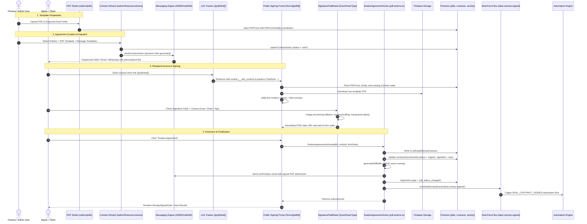
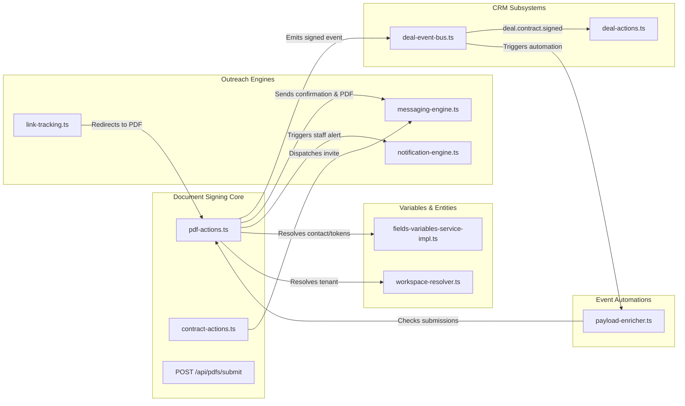

# Phase 0.1 — Code-Path & Dependency Inventory

> **Module:** Document Signing & Contract Platform  
> **Status:** Phase 0 Baseline Discovery  
> **Governance:** Strict Typing (Zero `any`), Mobile-First UX, Enterprise Security Standards  

---

## 1. Executive Summary & Flow Architecture

The SmartSapp Document Signing system integrates:
1. An administrative **PDF Studio & Field Mapper** for template creation.
2. A **Finance Contract Wizard** for customer contract dispatch via multi-channel messaging (Email, SMS, WhatsApp).
3. A **Public Responsive Signing Portal** (`/forms/[pdfId]`) rendering interactive fields via `pdfjs-dist` on HTML5 canvas.
4. An advanced **Signature Capture Engine** supporting 4 modalities (Camera Scan with real-time ink thresholding, Canvas Draw, Calligraphic Type, and File Upload).
5. A **Server Execution & Automation Pipeline** that executes the contract, overlays vector field values using `pdf-lib`, writes activity logs, updates CRM deal probabilities, and dispatches confirmation messages.
6. A **Results Viewer & Export Suite** with password-gated access, CSV exports, and drop-off funnel analytics.

---

## 2. Exhaustive Inventory of Code Files & Components

### 2.1 Public Client Surfaces & Routes

| Path | File Type | Responsibility | Key Callers / Downstream Dependencies |
| :--- | :--- | :--- | :--- |
| `src/app/forms/[pdfId]/page.tsx` | Server Component | Public entry point. Resolves SEO metadata, brand styling, entity context via `FieldsVariablesService.resolveEntityContextFromParams`, checks password protection, and checks if already signed. | Downstream: `PdfFormRenderer`, `PasswordGatedForm`, `AlreadySignedGate`. |
| `src/app/forms/[pdfId]/components/PdfFormRenderer.tsx` | Client Component | Main interactive document signing canvas. Loads PDF via `pdfjs-dist`, handles touch pinch-to-zoom, calculates scale, manages React Hook Form state, renders interactive input overlays, handles "Save Progress" and "Finalize". | Downstream: `pdfjs-dist`, `SignaturePadModal`, `DataEntryModal`, `saveAgreementProgressAction`, `finalizeAgreementAction`. |
| `src/app/forms/[pdfId]/components/PasswordGatedForm.tsx` | Client Component | Password gate dialog protecting confidential PDF forms. Verifies entered password against `pdfForm.password`. | Caller: `page.tsx`. Downstream: Unlocks `PdfFormRenderer`. |
| `src/app/forms/[pdfId]/components/AlreadySignedGate.tsx` | Client Component | Read-only lock screen shown when a contract has already been executed (`contract.status === 'signed'`), preventing duplicate submissions and routing to audit results. | Caller: `page.tsx`, `PdfFormRenderer.tsx`. |
| `src/app/forms/[pdfId]/components/DataEntryModal.tsx` | Client Component | Modal fallback for inputting text/dropdown/date fields on mobile when tap-to-focus on small screen canvas inputs is difficult. | Caller: `PdfFormRenderer.tsx`. |
| `src/app/forms/[pdfId]/not-found.tsx` | Server Component | 404 handler for unpublished, deleted, or nonexistent PDF form IDs. | Caller: Next.js routing. |
| `src/app/forms/results/[slug]/page.tsx` | Server Component | Public shared results view routing. Resolves slug or PDF ID and lists submissions if sharing is enabled. | Downstream: `SharedResultsListView`. |
| `src/app/forms/results/[slug]/[submissionId]/page.tsx` | Server Component | Individual submission audit page. Resolves PDFForm, Submission, and Entity records from Firestore. | Downstream: `SharedSubmissionView`. |
| `src/app/forms/results/components/SharedSubmissionView.tsx` | Client Component | Renders the completed document with filled values and signatures. Features password-gated access with a 1-hour session cache and a "Download Signed Copy" button. | **Caution Area:** Uses `html2canvas` for screenshot download (identified for replacement). |
| `src/app/forms/results/components/PasswordGatedResults.tsx` | Client Component | Password verification gate for accessing shared results portals. | Caller: `results/[slug]/page.tsx`. |

---

### 2.2 Admin & Studio Components

| Path | File Type | Responsibility | Key Callers / Downstream Dependencies |
| :--- | :--- | :--- | :--- |
| `src/app/admin/pdfs/page.tsx` & `PdfsClient.tsx` | Admin UI | Master PDF template dashboard. Lists all workspace templates, search, status filter (`draft`, `published`, `archived`), cloning (`clonePdfForm`), deletion (`deletePdfForm`), and link copying. | Downstream: `deletePdfForm`, `clonePdfForm`, `updatePdfFormStatus`, `SubmissionCount`. |
| `src/app/admin/pdfs/components/UploadPDFButton.tsx` & `PdfUploader.tsx` | Client Component | File picker and Cloud Storage uploader for initial PDF template onboarding. Uploads file to Firebase Storage and initializes `PDFForm` record. | Downstream: `createPdfForm`. |
| `src/app/admin/pdfs/[id]/edit/page.tsx` | Admin UI | PDF Visual Studio entry point. Loads PDF metadata, parses page count, and initializes the `EditorContext`. | Downstream: `EditorSidebar`, `DocumentCanvas`, `Inspector`. |
| `src/app/admin/pdfs/[id]/edit/components/Editor/EditorContext.tsx` | React Context | Manages studio canvas state: zoom, selected fields, marquee selection, active field updates, alignment, distribution, undo/redo, and saving. | Downstream: `DocumentCanvas`, `Inspector`, `updatePdfFormMapping`. |
| `src/app/admin/pdfs/[id]/edit/components/Editor/Sidebar/Inspector.tsx` | Client Component | Field property sidebar. Customizes field type (`text`, `dropdown`, `date`, `time`, `phone`, `email`, `static-text`, `variable`, `signature`, `photo`), variable token binding, typography (size, color, bold, italic, underline, case transform), and horizontal/vertical alignment. | Downstream: `FieldsVariablesService`, `field_groups`, `app_fields`. |
| `src/app/admin/pdfs/[id]/edit/components/Editor/viewport/DocumentCanvas.tsx` | Client Component | The visual PDF canvas viewport. Renders PDF pages with `pdfjs-dist` and overlays draggable, resizable bounding boxes for fields. | Downstream: `PageRenderer`, `FieldOverlay`, `ContextMenu`. |
| `src/app/admin/pdfs/[id]/submissions/page.tsx` | Admin UI | Record audit dashboard. Displays submission logs, CSV export, multi-select deletion, batch downloading, and **Funnel Drop-Off Analytics** tracking scroll depth and completion drop-offs. | Downstream: `HighFidelityDownloader`, `deleteSubmissions`, `updatePdfResultsSharing`. |
| `src/app/admin/finance/contracts/ContractsClient.tsx` | Admin UI | Agreements lifecycle table for finance operations. Filter by status (`draft`, `sent`, `partially_signed`, `signed`), search by entity, inspect signatories, view signed documents, or launch Contract Wizard. | Downstream: `useEntitySearch`, `ContractWizard`, `deleteContractAction`. |
| `src/app/admin/finance/contracts/components/ContractWizard.tsx` | Client Component | 4-step agreement dispatch wizard. Selects target entities, maps PDF contract template, selects Email/SMS messaging templates, supports test dispatches, and handles batch sending. | Downstream: `upsertContractAction`, `sendContractAction`, `TestDispatchDialog`. |

---

### 2.3 Signature Engine & Processing Modules

| Path | File Type | Responsibility | Key Callers / Downstream Dependencies |
| :--- | :--- | :--- | :--- |
| `src/components/SignaturePadModal.tsx` | Client Component | Multi-mode signature capture dialog:  1. **Scan**: Real-time webcam video feed with laser scanner animation, continuous autofocus tracking, and manual tap-to-focus. 2. **Draw**: Freehand canvas sketching using `react-signature-canvas`. 3. **Type**: Cursive rendering in Mrs Saint Delafield font. 4. **Upload**: Image file picker. Also contains a 3-step refinement flow (Input $\rightarrow$ Refine $\rightarrow$ Confirm). | Downstream: `processSignatureImage`, `processPhotoImage`, `react-easy-crop`, `react-signature-canvas`, `react-webcam`. |
| `src/lib/signature-processing.ts` | Client Utility | Advanced HTML5 canvas image processing pipeline:  - **Spatial Transformation**: Rotation (`-180°` to `+180°`), focal zoom, and manual bounding-box cropping. - **Smoothing & Dilation**: Convolution blur filter and pixel expansion to adjust stroke weight. - **Adaptive Thresholding**: Pixel luminance calculation (`0.299R + 0.587G + 0.114B`). Dark pixels become pure black (`#000000`); light pixels become 100% transparent (`rgba(0,0,0,0)`). - **Auto-Tighten**: Automatically crops bounding whitespace to isolate ink, normalizing to 1000px standard width. | Callers: `SignaturePadModal.tsx`. |

---

### 2.4 Server Actions & API Route Handlers

| Path | File Type | Responsibility | Key Callers / Downstream Dependencies |
| :--- | :--- | :--- | :--- |
| `src/lib/pdf-actions.ts` | Server Actions | Core PDF business logic:  - `generatePdfBuffer`: Uses `pdf-lib` to overlay vector text, fonts, and base64 images at exact percentage coordinates. - `saveAgreementProgressAction`: Creates/updates partial submission in `pdfs/{pdfId}/submissions` and updates contract to `partially_signed`. - `finalizeAgreementAction`: Full execution. Creates submission, sets contract status to `signed`, generates PDF buffer, sends confirmation email with attachment, triggers manager alerts, logs to `activity`. - `createPdfForm`, `deletePdfForm`, `clonePdfForm`, `updatePdfFormStatus`. | Callers: `PdfFormRenderer.tsx`, `ContractWizard.tsx`, `PdfsClient.tsx`. |
| `src/lib/contract-actions.ts` | Server Actions | Contract lifecycle actions:  - `upsertContractAction`: RBAC checks (`canUser`), creates/updates contract doc in `contracts` collection. - `sendContractAction`: RBAC checks, variable interpolation, dispatches messages via `messaging-engine`, updates status to `sent`. - `deleteContractAction`: Atomic batch delete of contract document and linked submission document. | Callers: `ContractWizard.tsx`, `ContractsClient.tsx`. |
| `src/lib/pdf-queries.ts` | Server Actions | Data retrieval helpers: `getPdfsByContact`, `getSubmissionsByContact`, `getPdfsForWorkspace`, `getPdfById`, `getSubmissionById`. | Callers: CRM views, entity profile tabs. |
| `src/app/api/pdfs/submit/route.ts` | Route Handler | Public REST submission endpoint for PDF forms. Checks published status, creates submission record, synchronizes contract status to `signed`, dispatches confirmation email with PDF attachment, triggers team notifications, and logs activity. | Caller: `PdfFormRenderer.tsx` fallback submit. |
| `src/app/api/pdfs/[pdfId]/generate/[submissionId]/route.ts` | Route Handler | Public vector PDF download endpoint. Fetches PDFForm and Submission, calls `generatePdfBuffer`, and streams back binary PDF with headers `Content-Disposition: attachment; filename="..."`. | Caller: External download requests. |
| `src/app/go/[linkId]/route.ts` | Route Handler | High-performance short-link redirector. Resolves `page_serial` to PDF forms (`/forms/[pdfId]`), appends contact/entity parameters, and sets encrypted `__onb_context` tracking cookie. | Ingress for SMS & WhatsApp campaign recipients. |

---

## 3. Downstream & Systemic Integrations

1. **CRM Deals (`src/lib/deals/deal-event-bus.ts`, `src/app/actions/deal-actions.ts`)**:
   - `deal.contract.signed` is defined as a domain event enum in `deal-event-bus.ts:45`, which advances deal probability to 100% and sets `contractStatus: 'signed'`.
   - *Audit finding:* This event is currently dormant/unwired in `pdf-actions.ts:finalizeAgreementAction` and `POST /api/pdfs/submit`. Phase 1 Task 1.2 will formally wire `emitDealDomainEvent('deal.contract.signed')` upon successful envelope execution.
2. **Automations Engine (`src/lib/automations/payload-enricher.ts`)**:
   - Lines 220–240 read `adminDb.collection('pdfs').doc(pId).collection('submissions')` to evaluate `form_field` condition nodes.
   - Any schema changes must preserve `subData.formData` access.
3. **Fields & Variables SSOT (`src/lib/services/fields-variables-service-impl.ts`)**:
   - Resolves dynamic contact and institutional tokens for both template overlays and email message dispatch.
4. **Short-Link Redirection (`src/app/go/[linkId]/route.ts`)**:
   - Maps 11-character stateless tokens to `pdfs` via `page_serial` and propagates recipient context cookies.

---

## 4. UI/UX Architecture & Usability Audit

Conforming to `emilkowal-animations`, `frontend-design`, and `ui-ux-pro-max`:

### 4.1 Current UI Strengths
- **Computer-Vision Scan Mode**: Live camera capture with real-time ink isolation is a standout feature with high conversion potential.
- **Visual Drag-and-Drop Studio**: Intuitive field positioning with alignment guides and typography styling.
- **Funnel Drop-Off Analytics**: Built-in tracking of scroll depth and drop-off rates on `SubmissionsPage.tsx`.

### 4.2 UI/UX Friction Points & Modernization Targets
1. **Mobile Pinch-Zoom Dependency**:
   - On screens $<640\text{px}$, reading an A4/Letter PDF requires extensive two-finger pinching and horizontal scrolling.
   - *Target UX:* Add an **Adaptive Form Mode** (stacked mobile form) for mobile screens, with a one-tap "Preview Full Document" button.
2. **No Guided Field Stepper**:
   - Signers must visually hunt across multi-page documents to find required signature lines.
   - *Target UX:* Implement a persistent, floating **Signing Action Dock** at the bottom of the viewport:
     - `START SIGNING` $\rightarrow$ smoothly scrolls to and zooms in on Field 1.
     - `NEXT FIELD` $\rightarrow$ auto-focuses the next required tag.
     - `FINISH & SIGN` $\rightarrow$ opens the finalization dialog when all required fields are complete.
3. **Canvas Stroke Fidelity**:
   - `react-signature-canvas` draws standard uniform strokes that look pixelated and unnatural.
   - *Target UX:* Upgrade to velocity- and pressure-sensitive Bezier curves that mimic physical fountain pen ink.
4. **Microcopy Simplification**:
   - Replace complex labels with clear, conversational English: *"Sign Here"*, *"Type Your Name"*, *"Next Field"*, *"Finish & Submit"*, *"Download Copy"*.

---

## 5. P0.1 Acceptance Sign-Off

- [x] Every public, admin, and background route has an identified entry point and file location.
- [x] Downstream dependencies (CRM Deals, Automations, Messaging, Short-Links) are mapped.
- [x] UI/UX audit conducted with concrete mobile-first modernization specifications.
- [x] File committed locally to git.
