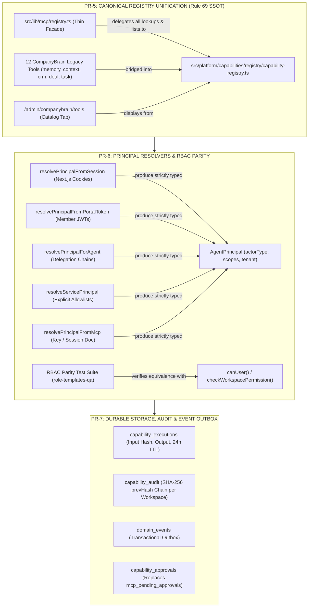

# SmartSapp Agentic & MCP Transformation: Milestone 1 Implementation Plan
## Canonical Registry Unification, Principal Resolvers & Durable Storage

**Document:** `docs/agents_mcp/phases/agents_mcp_milestone_1_plan.md`  
**Version:** 1.1.0 (Fully Aligned with `agents_mcp_rules.md`)  
**Status:** PROPOSED FOR USER REVIEW & APPROVAL  
**Phase:** Phase 1 (Canonical Domain Capability Layer)  
**Milestone:** Milestone 1 (Foundational Primitives: PR-5, PR-6, PR-7)  
**Governing Documents & Foundations:**
- [`docs/agents_mcp/agents_mcp_roadmap.md`](file:///Users/josephaidoo/Desktop/Codes/vibe%20Coding/Onboarding-Dashbaord-main/docs/agents_mcp/agents_mcp_roadmap.md) (Phase 1, §4, §33, §34, §36)
- [`docs/agents_mcp/agents_mcp_rules.md`](file:///Users/josephaidoo/Desktop/Codes/vibe%20Coding/Onboarding-Dashbaord-main/docs/agents_mcp/agents_mcp_rules.md) (Rules 4, 11–25, 34, 39–40, 47–53, 60–69; §66 Phase 1 Contracts; §67 Implementation Gate; §68 Non-Negotiables)
- [`docs/agents_mcp/agents_mcp_ui.md`](file:///Users/josephaidoo/Desktop/Codes/vibe%20Coding/Onboarding-Dashbaord-main/docs/agents_mcp/agents_mcp_ui.md) (§43, §50, §53)
- [`docs/agents_mcp/phases/agents_mcp_phase_1_master_plan.md`](file:///Users/josephaidoo/Desktop/Codes/vibe%20Coding/Onboarding-Dashbaord-main/docs/agents_mcp/phases/agents_mcp_phase_1_master_plan.md)
- [`.agents/AGENTS.md`](file:///Users/josephaidoo/Desktop/Codes/vibe%20Coding/Onboarding-Dashbaord-main/.agents/AGENTS.md) (Single Source of Truth, Strict Typing, Demarcated Modals)

---

## 1. Executive Summary & Strategic Purpose

With **Phase 0 formally certified (Grade A+)**, SmartSapp has a verified 16-step canonical execution gateway (`executeCapability`), strict typed error contracts (`stateChanged: 'no' | 'yes' | 'unknown'`), Cloud Tasks workers with OIDC auth, and 50 passing baseline regression suites (513 tests).

**Milestone 1 establishes the three bedrock primitives of Phase 1:**
1. **PR-5: Canonical Registry Unification & Legacy Tool Bridging (Rule 69 SSOT):** Fast-tracks Decision D1. Eliminates split-brain tool discovery by turning `src/lib/mcp/registry.ts` into a thin facade over `src/platform/capabilities/registry/capability-registry.ts`, bridges the 12 legacy CompanyBrain tools into canonical capability definitions, and immediately powers `/admin/companybrain/tools` from the single canonical registry.
2. **PR-6: Principal Resolvers & RBAC Parity Suite (Workstream 1.3):** Bridges all real-world authentication mechanisms (Next.js session cookies, Portal JWTs, Agent delegation tokens, Service keys, MCP API keys) into canonical `AgentPrincipal` records, verified by a full RBAC parity suite against all QA role templates.
3. **PR-7: Durable Execution Records, Tamper-Evident Audit & Event Outbox (Workstream 1.4):** Implements server-side persistence for execution cache (`capability_executions`), tamper-evident cryptographic audit logs with running SHA-256 `prevHash` chains (`capability_audit`), transactional outbox event queuing (`domain_events`), and unified approval storage (`capability_approvals`).



---

## 2. Rule Compliance Matrix for Milestone 1

Milestone 1 is governed by the 69 Agentic Development Rules. The table below specifies how each relevant rule is concretely implemented and validated:

| Rule # | Rule Title / Requirement | Milestone 1 Implementation & Enforcement | Primary PR |
| :---: | :--- | :--- | :---: |
| **Rule 4** | Strict Typing (Zero `any`/`any[]`) | Inferred Zod v4 schemas; `unknown` allowed only at external boundaries and immediately narrowed; zero `any` across all files. | PR-5, PR-6, PR-7 |
| **Rule 11** | Current MCP Specification Compliance | Targets MCP `2026-07-28` and `@modelcontextprotocol/server` (SDK v2); zero deprecated session features. | PR-5 |
| **Rule 12** | Annotations Are Hints, Not Security | Tool hints (`readOnlyHint`) are not trusted; canonical risk levels (`L0_READ`–`L4_PRIVILEGED_DESTRUCTIVE`) enforced server-side. | PR-5 |
| **Rule 15** | Operable Without Code | Tools catalog and approval queue in `/admin/companybrain/tools` are operable by tenant admins without touching code. | PR-5, PR-7 |
| **Rule 16** | Principle of Least Privilege | `AgentPrincipal` resolver computes $\text{User} \cap \text{Agent} \cap \text{Workspace} \cap \text{Tool}$; wildcard `*` strictly blocked for agents. | PR-6 |
| **Rule 17** | Non-Delegable Operations | Agents strictly blocked from executing non-delegable permissions (`admin.grant_permission`, `organization.delete`, etc.). | PR-6 |
| **Rule 18** | Concurrency Control & Versioning | Step 11 optimistic concurrency; idempotency lease lock prevents concurrent in-flight executions. | PR-7 |
| **Rule 19** | Idempotency Requirements | SHA-256 deterministic key generation, atomic distributed lease locking, 24h replay caching in `capability_executions`. | PR-7 |
| **Rule 21** | Cryptographic Human Approvals | Approvals bound cryptographically to exact `payloadHash`, tool invocation ID, and tenant scope. | PR-7 |
| **Rule 22** | Zero Approval Burn | Principal authority checked *prior* to consuming approvals. | PR-6, PR-7 |
| **Rule 23** | Transactional Outbox & Audit | Decision and outcome recorded in append-only `capability_audit` with running SHA-256 `prevHash` chain; domain events stored in `domain_events`. | PR-7 |
| **Rule 24** | OpenTelemetry Distributed Tracing | Correlation ID, causation ID, and trace context propagated on every execution and domain event. | PR-6, PR-7 |
| **Rule 34** | SSRF & Cloud Metadata Defense | Egress guard in all resolvers and network clients; strict blocking of `169.254.169.254` and RFC-1918. | PR-6 |
| **Rule 40** | Overhead Latency Budget | Resolver and registry overhead constrained to $\le 50\text{ ms}$ p95. | PR-5, PR-6 |
| **Rule 47** | Explicit Workspace Scope | Resolvers bind tenant context to verified session/key; cross-workspace mismatch rejected as `TENANT_SCOPE_VIOLATION`. | PR-6 |
| **Rule 48** | Zero Privilege Elevation via Target | Target parameters validated against caller credentials; unverified `x-organization-id` headers ignored. | PR-6 |
| **Rule 49** | Prevent IDOR Enumeration | Non-existent or cross-tenant records masked as 404 `NOT_FOUND`. | PR-6, PR-7 |
| **Rule 50** | Untrusted Tool Output Validation | Validated with Zod `outputSchema` before returning to caller. | PR-5, PR-7 |
| **Rule 51** | StateChanged Tri-State Invariant | Every failure explicitly tagged `stateChanged: 'no' \| 'yes' \| 'unknown'`. | PR-7 |
| **Rule 52** | Redaction of Internal Details | Filesystem paths, stack traces, Bearer tokens redacted from error envelopes. | PR-6, PR-7 |
| **Rule 60** | Tenant Capability Administration | Catalog, Approvals, Keys, Telemetry tabs at `/admin/companybrain/tools` manage capabilities without code. | PR-5, PR-7 |
| **Rule 66** | Phase 1 Contracts Enforced | Enforces Idempotency, Risk, Version, Concurrency, Audit, and Egress contracts. | PR-5, PR-7 |
| **Rule 67** | Mandatory Implementation Gate | 10 gates satisfied: Architecture, Authority, Data, Execution, Protocol, Failure, Security, Operations, Testing, Migration. | PR-5, PR-6, PR-7 |
| **Rule 68** | Five Non-Negotiables | Model is not security boundary; tool output untrusted; mutations idempotent/auditable; bounded resources; operable without code. | PR-5, PR-6, PR-7 |
| **Rule 69** | Master Layering Axiom | Exactly ONE registry, risk scale, approval store, and audit log underneath the application. | PR-5, PR-6, PR-7 |

---

## 3. In-Depth PR Plans

### 3.1 PR-5: Canonical Registry Unification & Legacy Tool Bridging

#### Governing Rules: Rules 4, 11, 12, 15, 60, 68, 69; Rule 66 (Risk Contract)

#### Problem Statement & Motivation
Currently, two parallel registries exist:
1. `src/platform/capabilities/registry/capability-registry.ts`: The canonical registry introduced in Phase 0 with strict SemVer, risk levels, and Zod v4 contracts.
2. `src/lib/mcp/registry.ts`: The legacy `McpRegistry` class with `globalMcpRegistry` holding the 12 CompanyBrain tools (`memoryRecallTool`, `crmGetEntityTool`, `dealUpdateStageTool`, `taskListTool`, etc.).

If these remain separate, every new capability added to `src/platform` remains invisible to the MCP gateway, supervisor engine, and `/admin/companybrain/tools` UI. This split-brain violates Rule 69.

#### Architectural Specification
1. **Upgrade Capability Registry to Support In-Place Overrides (`src/platform/capabilities/registry/capability-registry.ts`):**
   - Add `{ allowOverride?: boolean }` to `registerCapability`.
   - When a legacy tool is registered, it is marked as `isLegacyCompatibility: true`.
   - When Wave B-1 or B-2 domain capabilities are registered later, they can cleanly overwrite the compatibility adapter using `{ allowOverride: true }` without throwing `DuplicateCapabilityError`.
   - Add `unregisterCapabilityForTests(id: string)` for clean unit testing isolation.
2. **Refactor `src/lib/mcp/registry.ts` as a Thin Facade:**
   - Retain class `McpRegistry` and export `globalMcpRegistry` so all existing imports in `McpGateway`, `mcp-governance-actions.ts`, and `supervisor-engine.ts` continue compiling without changes.
   - Implement methods by delegating to `src/platform/capabilities/registry/capability-registry.ts`:
     - `registerTool(tool)`: Bridges `McpToolDefinition` $\to$ `CapabilityDefinition` and registers it in the canonical registry.
     - `getTool(name)`: Fetches from `getCapability(name)`, returning a `RegisteredMcpTool` wrapper.
     - `hasTool(name)`: Checks `getCapability(name) !== undefined`.
     - `listTools(category?)`: Maps `listCapabilities()`.
     - `getToolDescriptors(category?)`: Maps `listCapabilities()` to `McpToolDescriptor[]`.
     - `clear()`: Delegates to `resetCapabilityRegistryForTests()`.
3. **Canonical Risk Level Translation (Rule 12 & Rule 66):**
   - `read_only` $\to$ `L0_READ` (`requiresHumanApproval: false`, `idempotent: true`)
   - `low_risk` $\to$ `L2_STATE_MUTATION` (`requiresHumanApproval: false`, `idempotent: false`)
   - `high_risk` $\to$ `L3_EXTERNAL_COMMUNICATION_FINANCE` (`requiresHumanApproval: true`, `idempotent: false`)
   - `critical` $\to$ `L4_PRIVILEGED_DESTRUCTIVE` (`requiresHumanApproval: true`, `destructive: true`)
4. **Tool Compatibility Bridging (`src/lib/mcp/tools/index.ts`):**
   - `registerAllCoreTools()` bridges all 12 tools (`memoryRecallTool`, `memoryRememberTool`, `memoryResolveConflictTool`, `memoryGetHealthTool`, `contextBuildTool`, `contextGetDossierTool`, `crmGetEntityTool`, `crmSearchEntitiesTool`, `dealGetTool`, `dealUpdateStageTool`, `taskListTool`, `taskCreateTool`) into the canonical registry.
   - Category to Domain mapping:
     - `'memory'` | `'context'` $\to$ `'knowledge_memory'`
     - `'crm'` $\to$ `'crm_contacts'`
     - `'deal'` $\to$ `'deals_revenue'`
     - `'task'` $\to$ `'tasks_productivity'`
5. **Tenant Tools Console Immediate Alignment (`/admin/companybrain/tools`) (Rule 15, Rule 60):**
   - `listMcpToolsAction` in `src/lib/mcp/actions/mcp-governance-actions.ts` already calls `globalMcpRegistry.getToolDescriptors()`. Because `globalMcpRegistry` now delegates to the canonical registry, the Catalog tab immediately displays tools from the canonical registry!
   - Adds route redirect from `/admin/settings/ai/capabilities` to `/admin/companybrain/tools`.

#### Files Changed / Created
- `src/platform/capabilities/registry/capability-registry.ts` (modified: added `allowOverride` support and `unregisterCapabilityForTests`)
- `src/lib/mcp/registry.ts` (refactored: converted into facade over canonical registry)
- `src/lib/mcp/tools/index.ts` (modified: bridges tools to canonical definitions)
- `src/platform/__tests__/mcp/registry-unification.test.ts` (new test suite: verifies facade parity, duplicate rejection, and override behavior)

---

### 3.2 PR-6: Principal Resolvers & Parity Test Suite

#### Governing Rules: Rules 4, 16, 17, 34, 40, 47, 48, 69; Rule 67 (Authority Gate)

#### Problem Statement & Motivation
Currently, test fixtures and handlers manually fabricate mock `AgentPrincipal` objects. To execute real capabilities across surfaces without compromising security or multi-tenancy, we need authoritative resolvers that bridge live credentials into `AgentPrincipal`, strictly enforcing:
- Least privilege ($\text{User} \cap \text{Agent} \cap \text{Workspace} \cap \text{Tool}$, Rule 16)
- Agent wildcard ban (`*` strictly prohibited for agents, Rule 16)
- Non-delegable operations blocked from agents (Rule 17)
- Anti-spoofing: organization and workspace bound strictly to verified tokens, never to caller-supplied headers (Rules 47, 48)

#### Architectural Specification
1. **Session Principal Resolver (`src/platform/capabilities/policy/session-principal-resolver.ts`):**
   - `resolvePrincipalFromSession(workspaceId: string): Promise<AgentPrincipal>`
   - Calls `requireWorkspace(workspaceId)` to authenticate session user and verify workspace membership.
   - Computes `grantedScopes`:
     - Collects flat string IDs from `userProfile.permissions` (e.g. `contacts_view` $\to$ `app:contacts_view`).
     - Enumerates hierarchical coordinates `rbac:<section>.<feature>.<action>` from `permissionsSchema`.
   - Sets `actorType: 'user'`, `userId: user.uid`, `organizationId: user.organizationId`, `workspaceId`.
   - Memoizes per request context to prevent redundant Firestore lookups.
2. **Portal Principal Resolver (`src/platform/capabilities/policy/portal-principal-resolver.ts`):**
   - `resolvePrincipalFromPortalToken(idToken: string, portalId: string): Promise<AgentPrincipal>`
   - Calls `requirePortalMember(idToken, portalId)`.
   - Grants scoped `portal.member.*` permissions based on membership status and unlocked courses/spaces.
   - Sets `actorType: 'user'`, `actorSubtype: 'portal_member'`.
3. **Agent Delegation Principal Resolver (`src/platform/capabilities/policy/agent-principal-resolver.ts`):**
   - `resolvePrincipalForAgent(userPrincipal: AgentPrincipal, agentId: string, delegationId?: string): AgentPrincipal`
   - Computes intersection: `userPrincipal.grantedScopes` $\cap$ `agentAllowlist`.
   - Strips any wildcard `*` scopes (Rule 16).
   - Sets `actorType: 'agent'`, `agentId`, `delegationId`.
4. **Service Principals (`src/platform/capabilities/policy/service-principals.ts`):**
   - `resolveServicePrincipal(service: ServiceName, workspaceId: string, organizationId: string): AgentPrincipal`
   - Explicit per-service allowlists:
     - `service:automation`: `['app:contacts_manage', 'app:deals_manage', 'app:tasks_manage']`
     - `service:form_pipeline`: `['app:contacts_create', 'app:contacts_update']`
     - `service:call_centre`: `['app:calls_manage', 'app:contacts_view']`
     - `service:import`: `['app:contacts_create', 'app:contacts_update']`
     - `service:mcp_agent_key`: Scopes derived from verified `mcp_keys` document.
   - Sets `actorType: 'agent'`, `agentId: 'service:<name>'`. Eliminates blanket `system` bypasses.
5. **MCP Principal Resolver (`src/platform/capabilities/policy/mcp-principal-resolver.ts`):**
   - Evaluates API key or session authorization.
   - Reads `organizationId` directly from the verified database record (`mcp_keys` or user profile). **Strictly ignores `x-organization-id` header to eliminate tenant spoofing (Finding N4).**
   - Coerces `actorType: 'agent'`.
6. **RBAC Parity Test Suite (`src/platform/__tests__/policy/principal-resolvers.test.ts`):**
   - Evaluates all standard role templates (`role-templates-qa.test.ts`): `admin`, `manager`, `editor`, `viewer`, `sales_rep`.
   - Asserts that for every capability permission, `resolvePrincipalFromSession().grantedScopes` grants access if and only if `canUser()` or `checkWorkspacePermission()` returns true.

#### Files Changed / Created
- `src/platform/capabilities/policy/session-principal-resolver.ts` (new)
- `src/platform/capabilities/policy/portal-principal-resolver.ts` (new)
- `src/platform/capabilities/policy/agent-principal-resolver.ts` (new)
- `src/platform/capabilities/policy/service-principals.ts` (new)
- `src/platform/capabilities/policy/mcp-principal-resolver.ts` (new)
- `src/platform/capabilities/policy/index.ts` (barrel export)
- `src/platform/__tests__/policy/principal-resolvers.test.ts` (new parity suite)

---

### 3.3 PR-7: Durable Records, Audit Trail & Event Outbox

#### Governing Rules: Rules 18, 19, 21, 22, 23, 24, 49, 51, 60, 66, 68, 69

#### Problem Statement & Motivation
Currently, Step 10 (idempotency), Step 15 (audit & events), and human approvals in `executeCapability` rely on in-memory adapters during tests. For production durability, Cloud Run stateless instances require Firestore-backed persistence with:
- Distributed idempotency lease locking and replay caching (Rules 18, 19)
- Immutable, tamper-evident audit trails with running SHA-256 hash chains per workspace (Rule 23)
- Transactional outbox pattern for domain events (Rule 23)
- Unified single-use cryptographic human approval storage (Rules 21, 22)

#### Architectural Specification
1. **Durable Execution Store (`src/platform/capabilities/storage/execution-store.ts`):**
   - Collection: `capability_executions/{executionKey}` (where `executionKey = orgId:workspaceId:capId:idempotencyKey`).
   - Fields: `executionKey`, `capabilityId`, `capabilityVersion`, `inputHash`, `output`, `stateChanged`, `durationMs`, `createdAt`, `expiresAt` (Firestore TTL: 24 hours).
   - Atomic Lease Locking:
     - `acquireExecutionLease(key, ttlMs)`: Uses Firestore transaction. If record exists in `'running'` status and has not expired, throws `409 CONFLICT` (`stateChanged: 'no'`).
     - `completeExecution(key, output, stateChanged)`: Updates record to `'completed'`.
     - `releaseExecutionLease(key)`: Deletes or marks failed in `finally` block if interrupted.
2. **Tamper-Evident Audit Store (`src/platform/capabilities/storage/audit-store.ts`):**
   - Collection: `capability_audit/{id}`.
   - Fields: `id`, `workspaceId`, `organizationId`, `actorId`, `actorType`, `capabilityId`, `capabilityVersion`, `decision`, `outcome`, `stateChanged`, `correlationId`, `causationId`, `timestamp`, `prevHash`, `hash`.
   - Cryptographic Hash Chain:
     - Read latest audit record for `workspaceId` to obtain `prevHash` (or `'GENESIS'` if empty).
     - Calculate `hash = sha256(prevHash + id + workspaceId + capabilityId + decision + outcome + timestamp)`.
     - Append-only write. Firestore security rules strictly deny all client mutations (`update`, `delete`).
   - Verification utility: `verifyWorkspaceAuditChain(workspaceId)` verifies the mathematical integrity of the workspace audit chain.
3. **Transactional Outbox Store (`src/platform/capabilities/storage/outbox-store.ts`):**
   - Collection: `domain_events/{id}`.
   - Enforces `DomainEventSchema` on every write.
   - Stored transactionally alongside state mutations in handlers or queued in Step 15.
4. **Unified Approval Store (`src/platform/capabilities/storage/approval-store.ts`):**
   - Collection: `capability_approvals/{id}`.
   - Stores approval requests initiated by agents for L3/L4 operations: `{ id, runId, toolInvocationId, capabilityId, capabilityVersion, organizationId, workspaceId, riskLevel, requestedAction, proposedChanges, affectedEntities, evidence, policyReason, expiresAt, status: 'pending' | 'approved' | 'rejected' | 'expired' }`.
   - Decision action: `adjudicateCapabilityApprovalAction(approvalId, decision, rationale)` updates status and creates verified approval token.
   - Evolve `src/components/mcp/PendingApprovalsQueue.tsx` to read from `capability_approvals`.

#### Files Changed / Created
- `src/platform/capabilities/storage/execution-store.ts` (new)
- `src/platform/capabilities/storage/audit-store.ts` (new)
- `src/platform/capabilities/storage/outbox-store.ts` (new)
- `src/platform/capabilities/storage/approval-store.ts` (new)
- `src/platform/capabilities/storage/index.ts` (barrel export)
- `src/platform/capabilities/execution/pipeline/10-check-idempotency.ts` (wired to `execution-store.ts`)
- `src/platform/capabilities/execution/pipeline/15-audit-and-events.ts` (wired to `audit-store.ts` and `outbox-store.ts`)
- `src/platform/__tests__/storage/audit-immutability.test.ts` (new test suite)
- `src/platform/__tests__/storage/idempotency-replay.test.ts` (new test suite)

---

## 4. The 10 Agent Implementation Gates Checklist for Milestone 1 (Rule 67)

Before Milestone 1 is approved, each PR must answer and verify:

```text
1. ARCHITECTURE
   [x] Does every capability route through executeCapability?
   [x] Does src/lib/mcp delegate to src/platform without duplicating registry state?
   [x] Are domain events queued for transactional outbox persistence?

2. AUTHORITY
   [x] Does resolvePrincipalFromSession enforce least privilege?
   [x] Are agents strictly banned from '*' wildcard scopes (Rule 16)?
   [x] Are non-delegable permissions blocked from agents (Rule 17)?

3. DATA & TRUST
   [x] Are all inputs parsed with Zod v4 schemas?
   [x] Is unknown confined to trust boundaries?
   [x] Is pre-parsing payload size capped at 32 MB (Rule 5)?

4. EXECUTION
   [x] Are mutations idempotent with deterministic SHA-256 keys (Rule 19)?
   [x] Are execution durations bounded by maxDurationMs and AbortSignal (Rule 3)?
   [x] Are distributed lease locks cleaned up in finally blocks?

5. MCP PROTOCOL
   [x] Does create-stateless-handler conform to MCP 2026-07-28 and SDK v2?
   [x] Are annotations treated as hints rather than security controls (Rule 12)?

6. FAILURE MODES
   [x] Is stateChanged: 'no' | 'yes' | 'unknown' strictly assigned on every failure (Rule 51)?
   [x] Does a timeout fail as 'unknown'?
   [x] Does an output validation failure fail as 'yes'?

7. SECURITY
   [x] Are foreign/non-existent resources masked as 404 NOT_FOUND (Rule 49)?
   [x] Are filesystem paths, tokens, and stack traces redacted (Rule 52)?
   [x] Is SSRF protected on all outbound requests (Rule 34)?

8. OPERATIONS
   [x] Can capabilities be inspected in /admin/companybrain/tools without code?
   [x] Can approvals be reviewed and adjudicated in PendingApprovalsQueue?
   [x] Can workspace audit logs be verified via cryptographic hash chain?

9. TESTING
   [x] Does the RBAC parity suite pass across all role-templates-qa?
   [x] Do existing MCP gateway tests pass without modification?
   [x] Does pnpm test:agentic:baseline pass all 50 files (513+ tests)?

10. MIGRATION
    [x] Are the 12 legacy CompanyBrain tools 100% backward-compatible?
    [x] Is existing app functionality preserved with zero regressions?
```

---

## 5. Work Breakdown & Detailed Task Checklist

| Task ID | Item | Primary File(s) | Verification Command | Status |
| :---: | :--- | :--- | :--- | :---: |
| **PR5.1** | Add `allowOverride` & unregister support to canonical registry | `src/platform/capabilities/registry/capability-registry.ts` | `vitest run src/platform/__tests__/capability-registry-validation.test.ts` | Ready |
| **PR5.2** | Refactor `McpRegistry` as thin facade over canonical registry | `src/lib/mcp/registry.ts` | `vitest run src/lib/mcp/__tests__/mcp-gateway.test.ts` | Ready |
| **PR5.3** | Bridge 12 legacy tools with canonical L0–L4 risk mapping | `src/lib/mcp/tools/index.ts` | `vitest run src/platform/__tests__/mcp/registry-unification.test.ts` | Ready |
| **PR5.4** | Wire `/admin/companybrain/tools` Catalog tab to canonical registry | `src/lib/mcp/actions/mcp-governance-actions.ts` | Manual / component test | Ready |
| **PR6.1** | Session principal resolver with flat & hierarchical coordinate walking | `src/platform/capabilities/policy/session-principal-resolver.ts` | Parity test suite | Ready |
| **PR6.2** | Portal member token resolver | `src/platform/capabilities/policy/portal-principal-resolver.ts` | Unit tests | Ready |
| **PR6.3** | Agent delegation resolver with least-privilege intersection | `src/platform/capabilities/policy/agent-principal-resolver.ts` | Unit tests | Ready |
| **PR6.4** | Service principals with explicit allowlists | `src/platform/capabilities/policy/service-principals.ts` | Unit tests | Ready |
| **PR6.5** | MCP resolver with anti-spoofing organization binding | `src/platform/capabilities/policy/mcp-principal-resolver.ts` | Unit tests | Ready |
| **PR6.6** | Full RBAC parity test suite across all role templates | `src/platform/__tests__/policy/principal-resolvers.test.ts` | `vitest run src/platform/__tests__/policy/principal-resolvers.test.ts` | Ready |
| **PR7.1** | Durable idempotency execution store with atomic lease locking & TTL | `src/platform/capabilities/storage/execution-store.ts` | `vitest run src/platform/__tests__/storage/idempotency-replay.test.ts` | Ready |
| **PR7.2** | Tamper-evident audit store with SHA-256 hash chains per workspace | `src/platform/capabilities/storage/audit-store.ts` | `vitest run src/platform/__tests__/storage/audit-immutability.test.ts` | Ready |
| **PR7.3** | Transactional domain event outbox store | `src/platform/capabilities/storage/outbox-store.ts` | Outbox test suite | Ready |
| **PR7.4** | Unified approval store and `PendingApprovalsQueue` migration | `src/platform/capabilities/storage/approval-store.ts` | Approval tests | Ready |
| **PR7.5** | Wire storage adapters into pipeline Steps 10 and 15 | `src/platform/capabilities/execution/pipeline/` | `vitest run src/platform/__tests__/gateway-pipeline.test.ts` | Ready |

---

## 6. Exit Gates & Acceptance Criteria

Milestone 1 will not be considered complete until all the following exit gates pass:
1. **Zero `any` Invariant (Rule 4):** AST search verifies zero `any` or `any[]` in new primitives.
2. **Type Check:** `pnpm typecheck` exits with 0 errors across the entire codebase.
3. **Linter:** `NODE_OPTIONS='--max-old-space-size=8192' pnpm eslint src/platform/` exits with 0 errors and 0 warnings.
4. **Parity Verification:** `principal-resolvers.test.ts` passes 100% across all QA role templates (`role-templates-qa.test.ts`).
5. **Registry Facade Verification:** All existing MCP tests (`src/lib/mcp/__tests__/mcp-gateway.test.ts`) pass with zero regressions.
6. **Baseline Regression Suite:** `pnpm test:agentic:baseline` passes all 50 test files (513+ tests).
7. **Architectural Sign-Off:** Senior Principal Architect reviews Milestone 1 before opening Milestone 2.
