# SmartSapp Agentic & MCP Transformation: Milestone 3 Implementation Plan
## Canonical Capability Waves & UI Proof Points (PR-10, PR-11, PR-12)

> **For agentic workers:** REQUIRED SUB-SKILL: Use `superpowers:subagent-driven-development` (recommended) or `superpowers:executing-plans` to implement this plan task-by-task. Steps use checkbox (`- [ ]`) syntax for tracking.

**Document:** `docs/agents_mcp/phases/agents_mcp_milestone_3_plan.md`  
**Version:** 1.2.0 (Fully Executed & Verified)  
**Status:** COMPLETED (Verified 100%)  
**Phase:** Phase 1 (Canonical Domain Capability Layer)  
**Milestone:** Milestone 3 (Canonical Capability Waves & UI Proof Points: PR-10, PR-11, PR-12)  

**Goal:** Deliver the first three canonical capability waves (Wave A: Identity & Access, Wave B-1: Tasks, Tags & Notes, Wave B-2: Entities, Deals & Pipelines) totaling 30 production-grade capabilities, execute in-place upgrades of legacy MCP tools in the unified registry, migrate real UI surfaces (`TasksClient`, `TagSelector`, `KanbanBoard`) onto `useCapability`, and implement optimistic rollback and contract test generation.

**Architecture:** Under Rule 69 (The Master Axiom), capability definitions wrap existing hardened business cores (`task-core.ts`, `entity-core.ts`, `deal-core.ts`, `scoped-tag-actions.ts`) rather than duplicating database logic or raw Firestore mutations. Each capability enforces the 16-step gateway pipeline (input/output Zod schemas, 6-tier flag evaluation, synchronous RBAC, SHA-256 idempotency leasing, TOCTOU version checking via `updatedAt`, SHA-256 audit chaining, and domain event outbox emission). The client UI layer interacts exclusively through `useCapability` and `invokeCapabilityAction`, displaying standardized error badges, retry policies, and rollback ergonomics.

**Tech Stack:** Next.js 15 App Router, React 19, TypeScript (strict mode, zero `any`), Zod v4, Firebase Firestore & Admin SDK, Vitest, `@modelcontextprotocol/server` (2026-07-28), Tailwind CSS, Radix UI dialog primitives (`theme.md` §8).

**Governing Documents & Foundations:**
- [`docs/agents_mcp/agents_mcp_roadmap.md`](file:///Users/josephaidoo/Desktop/Codes/vibe%20Coding/Onboarding-Dashbaord-main/docs/agents_mcp/agents_mcp_roadmap.md) (Phase 1, Workstreams 1.5 Wave A, 1.5 Wave B-1, 1.5 Wave B-2, §4, §33, §34)
- [`docs/agents_mcp/agents_mcp_rules.md`](file:///Users/josephaidoo/Desktop/Codes/vibe%20Coding/Onboarding-Dashbaord-main/docs/agents_mcp/agents_mcp_rules.md) (Rules 1, 2, 3, 4, 7, 8, 9, 10, 11, 12, 13, 14, 16, 17, 18, 19, 20, 21, 22, 23, 26, 27, 28, 31, 33, 34, 39, 40, 41, 47, 48, 49, 50, 51, 52, 60, 62, 64, 65, 66, 67, 68, 69)
- [`docs/agents_mcp/agents_mcp_ui.md`](file:///Users/josephaidoo/Desktop/Codes/vibe%20Coding/Onboarding-Dashbaord-main/docs/agents_mcp/agents_mcp_ui.md) (§50, §53, §62, §65, §67–72, §80, §82)
- [`docs/agents_mcp/phases/agents_mcp_phase_1_master_plan.md`](file:///Users/josephaidoo/Desktop/Codes/vibe%20Coding/Onboarding-Dashbaord-main/docs/agents_mcp/phases/agents_mcp_phase_1_master_plan.md) (Milestone 3: PR-10, PR-11, PR-12)
- [`docs/agentic/14-migration-plan.md`](file:///Users/josephaidoo/Desktop/Codes/vibe%20Coding/Onboarding-Dashbaord-main/docs/agentic/14-migration-plan.md) (Strangler Fig pattern)
- [`.agents/AGENTS.md`](file:///Users/josephaidoo/Desktop/Codes/vibe%20Coding/Onboarding-Dashbaord-main/.agents/AGENTS.md) (Modal Architecture, TagSelector SSOT, FieldsVariables SSOT, Strict Typing)
- [`theme.md`](file:///Users/josephaidoo/Desktop/Codes/vibe%20Coding/Onboarding-Dashbaord-main/theme.md) (Section 8 Standardized Modal Architecture)

---

## 1. Executive Summary & Strategic Scope

With **Milestones 1 & 2 fully executed and certified (Grade A+)**, SmartSapp possesses a unified canonical registry (Decision D1), principal resolvers across all 5 actor types (PR-6), durable cryptographic SHA-256 audit chaining (PR-7), 6-tier runtime governance flags with dead-man controls (PR-8), and the client UI invocation framework with standardized error/conflict surfaces (PR-9).

**Milestone 3 shifts from platform infrastructure to live business domain migration across 3 major Pull Requests:**

```mermaid
flowchart TD
    subgraph M3_PR10["PR-10: WAVE A — IDENTITY & ACCESS"]
        IdActor["identity.actor.get_current (L0)"]
        IdWorkspaces["identity.workspace.list_accessible (L0)"]
        IdWorkspaceGet["identity.workspace.get (L0)"]
        IdCheckPerm["identity.access.check_permission (L0)"]
        IdListPerms["identity.access.list_effective_permissions (L0)"]
        GenSuite["define-contract-suite.ts (Contract Generator)"]
    end

    subgraph M3_PR11["PR-11: WAVE B-1 — TASKS, TAGS & NOTES"]
        TaskCaps["task.search, task.get, task.create, task.update, task.complete"]
        TagCaps["crm.entity.add_tag, crm.entity.remove_tag, crm.entity.list_tags"]
        NoteCaps["crm.activity.create, crm.note.create, crm.entity.get_timeline"]
        UpgradeTasks["In-Place Registry Upgrade (legacy task.create / task.list)"]
        TasksClientUI["TasksClient.tsx Migration (useCapability)"]
        TagSelectorUI["TagSelector.tsx Migration (useCapability)"]
        SameCapParity["Same-Capability Parity Test (UI vs MCP tools/call)"]
    end

    subgraph M3_PR12["PR-12: WAVE B-2 — ENTITIES, DEALS & PIPELINES"]
        EntityCaps["crm.entity.search, crm.entity.get, crm.entity.create, crm.entity.update..."]
        DealCaps["deal.search, deal.get, deal.create, deal.update, deal.advance_stage, deal.assign_owner"]
        PipeCaps["pipeline.list, pipeline.get"]
        UpgradeDeals["In-Place Registry Upgrade (legacy crm.* & deal.*)"]
        KanbanUI["KanbanBoard.tsx Migration (Optimistic Drag & Drop + Refusal Rollback)"]
        DealAdvanceTests["deal-advance-stage.test.ts (Stage Transition & Rollback)"]
    end

    M3_PR10 --> M3_PR11
    M3_PR11 --> M3_PR12
```



---

## 2. Exhaustive Rule Compliance Matrix for Milestone 3

Every capability, handler, contract, test suite, and UI component in Milestone 3 strictly adheres to the 69 Agentic Development Rules:

| Rule # | Requirement | Milestone 3 Implementation & Enforcement |
| :---: | :--- | :--- |
| **Rule 1** | Best Practice Conformance | Adheres to Next.js server actions, React 19 optimistic hooks, and Emil Kowalski tactile animations. |
| **Rule 2** | Testability & Verification | Every capability backed by contract tests, parity tests, and regression verification; zero remote pushes. |
| **Rule 3** | Backoffice Governance Without Code | All 30 capabilities controllable via `platform_features` flags and dead-man controls without code deployments. |
| **Rule 4** | Strict Typing (Zero `any`) | Complete type safety across inputs, outputs, domain events, and UI bindings (`unknown` immediately narrowed). |
| **Rule 5** | Staging & Verification Discipline | Validated against baseline regression suites and isolated contract harnesses before production deployment consideration. |
| **Rule 7** | Mobile-First & Accessibility | $\ge 44\text{ px}$ touch targets, ARIA live region announcements, keyboard accessibility on Kanban and Tasks. |
| **Rule 8** | Web Security & Anti-XSS | Strict relative paths on actionable toasts, Zod input validation, sanitization of user strings. |
| **Rule 9** | Load Resilience & Anti-Exhaustion | Bounded searches ($\le 100$ records), pagination, execution timeouts, in-memory caching. |
| **Rule 10** | Inline Documentation & Guidance | Every module contains architectural headers, rationale, maintainer pointers, and caution areas. |
| **Rule 11** | MCP Protocol Compliance | Stateless operation targeting revision 2026-07-28 via split `@modelcontextprotocol/server`. |
| **Rule 12** | MCP Risk Metadata as Hints | Risk classifications enforced strictly by server-side capability policies, never trusting client hints. |
| **Rule 13** | Trust Boundary Matrix | Untrusted model/client arguments separated from verified session context (`requireWorkspace`). |
| **Rule 14** | Tool Poisoning / Rug-Pull Defense | Capability definitions are immutable once registered; schemas strictly validated with byte limits. |
| **Rule 16** | Principle of Least Privilege | Synchronous capability evaluation ($\text{User} \cap \text{Agent} \cap \text{Workspace} \cap \text{Tool}$); agents blocked from wildcards. |
| **Rule 17** | Non-Delegable Operations | Identity and permission management operations refuse delegation to autonomous subagents. |
| **Rule 18** | TOCTOU Concurrency Guard | `expectedVersion` matching stored `updatedAt`; conflicts trigger `<VersionConflictDialog>`. |
| **Rule 19** | Idempotency Key Discipline | Deterministic SHA-256 idempotency key per intent; retried on `stateChanged === 'no'`, refreshed on mutation. |
| **Rule 20** | Duplicate Mutation Defense | In-flight execution lease locks prevent concurrent mutations under identical idempotency keys. |
| **Rule 21** | Human Approval Workflow | Operations with risk $\ge$ L3 return `APPROVAL_REQUIRED` and route to approval queues. |
| **Rule 22** | Approval Binding | Approvals bound to exact resource, tool, and parameter hashes; zero approval burn on pre-flight failure. |
| **Rule 23** | State-Changed Invariant | Every capability outcome explicitly declares `stateChanged: 'no' \| 'yes' \| 'unknown'` (UI §53). |
| **Rule 26** | Cancellation Semantics | `AbortSignal` propagated to async domain operations; handles timeouts cleanly with `stateChanged: 'unknown'`. |
| **Rule 27** | Formal Saga / Compensation Model | Optimistic UI rollback in `KanbanBoard` smoothly snaps card back to source column upon refusal. |
| **Rule 28** | Context Budgeting & Bounded Reads | Search and list capabilities enforce hard page ceilings (`limit` $\le 100$) and cursor pagination. |
| **Rule 31** | Output Validation | Outputs strictly validated against Zod `outputSchema` before returning to caller. |
| **Rule 33 & 34** | Egress & SSRF Boundary Controls | All outbound HTTP queries route through `safe-url-fetch.ts`. |
| **Rule 39** | OpenTelemetry & Trace Context | `correlationId` and `causationId` propagated across execution logs and audit entries. |
| **Rule 40** | Audit Log Immutability | Decisions and outcomes logged to append-only `capability_audit` with cryptographic SHA-256 running hash chain per workspace. |
| **Rule 41** | "Why Did You Do This?" Audit View | Audits record `decisionReason`, actor type, and principal context for transparency. |
| **Rule 47** | "Never Trust the Model" | Model-supplied IDs and arguments are fully re-authorized and validated server-side. |
| **Rule 48** | "Never Trust the Tool Either" | Tool responses sanitized and typed against strict output schemas. |
| **Rule 49** | Anti-IDOR & Tenant Isolation | Cross-tenant lookups strictly rejected and masked as 404 `NOT_FOUND`. |
| **Rule 50** | Output Schema Sanitization | Sensitive internal fields and database structures stripped from output schemas. |
| **Rule 51** | User-Facing Error Surfaces | UI proof points display `<CapabilityErrorNotice>` with visual state badges and relative action routes. |
| **Rule 52** | Client/Server Boundary Safety | Serialization safety across Next.js boundary; internal stacks and secrets stripped from client error envelopes. |
| **Rule 60** | Dead-Man Switch Mechanics | All capabilities wired into Step 3 flag evaluation, instantly obeying global dead-man halts. |
| **Rule 62** | Zero Code Deployments | Capabilities dynamically controlled via `platform_features` overrides and backoffice switches. |
| **Rule 64** | Precedence Hierarchy | 6-tier flag hierarchy evaluated on every capability execution. |
| **Rule 65** | Canary Rollouts | Deterministic cohort hash bucketing supported on every newly introduced capability. |
| **Rule 66** | Phase 1 Contracts | Idempotency, Risk, Version, Concurrency, Audit, and Egress contracts satisfied on every handler. |
| **Rule 67** | Agent Implementation Gate | All 10 checklist criteria verified for each capability before merge. |
| **Rule 68** | Non-Negotiable Foundations | Verified session identity, state transparency, zero `any`, least privilege. |
| **Rule 69** | Master Layering Axiom | UI components route through the capability gateway (`useCapability`), eliminating direct Firestore updates. |
| **Theme §8** | Standardized Modal Architecture | Demarcated header/footer, single-circle `<CardInfoTooltip>`, `sr-only` description, `min-h-[44px]` tactile buttons. |
| **SSOT 1** | Fields & Variables SSOT | Template and script token interpolations route exclusively through `FieldsVariablesService` and `<VariablesPanel>`. |
| **SSOT 2** | Tag Selection SSOT | Workspace contact tag selection routes exclusively through `<TagSelector>`. |

---

## 3. In-Depth PR Specifications

### 3.1 PR-10: Wave A Capabilities — Identity & Access (5 Capabilities)

#### Architectural Purpose
Establishes canonical identity, tenant scoping, and authorization query capabilities for callers. These capabilities allow human sessions, automated agents, and MCP clients to inspect who they are, which workspaces they have access to, and what permissions they hold without directly inspecting session cookies or executing arbitrary permission logic.

#### Capabilities Delivered
1. **`identity.actor.get_current` (`L0_READ`)**:
   - Returns caller profile, tenant context, active scopes, and role info using `resolvePrincipalFromSession` / principal resolvers.
   - Input: `{ workspaceId?: z.string().optional() }`
   - Output: `{ userId: string, actorType: string, organizationId?: string, workspaceId?: string, permissions: string[], roles: string[] }`
2. **`identity.workspace.list_accessible` (`L0_READ`)**:
   - Returns list of workspaces accessible to caller using `getUserWorkspaceIds` / tenant isolation.
   - Input: `{}`
   - Output: `{ workspaces: Array<{ id: string, name: string, role: string }> }`
3. **`identity.workspace.get` (`L0_READ`)**:
   - Fetches workspace configuration and active modules, enforcing tenant access.
   - Input: `{ workspaceId: z.string() }`
   - Output: `{ id: string, name: string, organizationId: string, settings: Record<string, unknown> }`
4. **`identity.access.check_permission` (`L0_READ`)**:
   - Evaluates target permission against caller (`canUser` / `checkWorkspacePermission`).
   - Input: `{ workspaceId: z.string(), permission: z.string(), resourceId?: z.string().optional() }`
   - Output: `{ granted: boolean, reason?: string }`
5. **`identity.access.list_effective_permissions` (`L0_READ`)**:
   - Returns enumerated permission coordinates for current actor in workspace.
   - Input: `{ workspaceId: z.string() }`
   - Output: `{ workspaceId: string, permissions: string[], isOwner: boolean, isAdmin: boolean }`

#### Non-Delegable Enforcement (Rule 17)
- Automated agents are explicitly blocked from executing permission evaluation or escalation capabilities on behalf of other actors.

#### Test Infrastructure: Contract Suite Generator (`define-contract-suite.ts`)
- Deliver `src/platform/__tests__/contract/define-contract-suite.ts`:
  - Reusable test harness producing the roadmap's Layer 2 cases:
    1. Valid input succeeds with expected output schema.
    2. Invalid input rejected with `VALIDATION` error code (`stateChanged: 'no'`).
    3. Missing permission rejected with `FORBIDDEN` error code (`stateChanged: 'no'`).
    4. Foreign workspace / cross-tenant access returns `NOT_FOUND` (Rule 47).
    5. Audit log correctly emitted to `capability_audit` with running SHA-256 hash chain.

---

### 3.2 PR-11: Wave B-1 Capabilities — Tasks, Tags, Notes & UI Proof Points (11 Capabilities)

#### Capabilities Delivered
- **Tasks (Domain `tasks_productivity`):**
  1. `task.search` (`L0_READ`): Filter tasks by assignee, due date, priority, entity (bounded $\le 100$ per Rule 28).
  2. `task.get` (`L0_READ`): Fetch single task by ID within workspace (anti-IDOR Rule 47).
  3. `task.create` (`L2_STATE_MUTATION`): Creates action item calling `createTaskCore`. Emits `task.created` domain event.
  4. `task.update` (`L2_STATE_MUTATION`): Updates task fields with TOCTOU `expectedVersion` check calling `updateTaskCore`.
  5. `task.complete` (`L2_STATE_MUTATION`): Completes task calling `updateTaskCore({ status: 'completed' })`. Emits `task.completed`.
- **Tags (Domain `crm_contacts`):**
  6. `crm.entity.add_tag` (`L2_STATE_MUTATION`): Applies scoped tag calling `applyTagAction`.
  7. `crm.entity.remove_tag` (`L2_STATE_MUTATION`): Removes scoped tag calling `removeTagAction`.
  8. `crm.entity.list_tags` (`L0_READ`): Lists tags for entity within workspace calling `getEntityTagsAction`.
- **Notes & Activity (Domain `crm_contacts`):**
  9. `crm.activity.create` (`L2_STATE_MUTATION`): Logs timeline activity.
  10. `crm.note.create` (`L1_INTERNAL_DRAFT`): Creates note calling `logNoteActivity`.
  11. `crm.entity.get_timeline` (`L0_READ`): Reads activity timeline (bounded $\le 100$).

#### In-Place Upgrades of Legacy Registry
- Upgrade legacy `task.create` and `task.list` in `src/lib/mcp/tools/task-tools.ts` using `registerCapability(definition, { allowOverride: true })`.

#### UI Proof-Point Migrations
1. **`src/app/admin/tasks/TasksClient.tsx`**:
   - Migrate task creation, editing, and inline completion to `useCapability('task.create')` and `useCapability('task.complete')`.
   - Bind `<CapabilityErrorNotice>` on error and `<VersionConflictDialog>` on TOCTOU collisions.
2. **`src/components/tags/TagSelector.tsx`**:
   - Migrate tag addition and removal to route through `crm.entity.add_tag` and `crm.entity.remove_tag`.
   - Preserve Tag Selection SSOT while delegating state mutations to the canonical gateway.

#### Parity Verification Suite
- `src/platform/__tests__/parity/same-capability-proof.test.ts`:
  - Proves that invoking `task.create` via Server Action (`invokeCapabilityAction`) and via MCP `tools/call` produces the exact same audit entry, validates identical Zod schemas, and triggers the same domain event.

---

### 3.3 PR-12: Wave B-2 Capabilities — Entities, Deals, Pipelines & Kanban UI Proof Point (14 Capabilities)

#### Capabilities Delivered
- **Entities / Contacts (Domain `crm_contacts`):**
  1. `crm.entity.search` (`L0_READ`): Bounded query across contacts in workspace (Rule 28).
  2. `crm.entity.get` (`L0_READ`): Fetch entity with workspace links (anti-IDOR Rule 47).
  3. `crm.entity.create` (`L2_STATE_MUTATION`): Create entity calling `createEntityCore`. Emits `crm.entity.created`.
  4. `crm.entity.update` (`L2_STATE_MUTATION`): Update entity fields with TOCTOU `expectedVersion` calling `updateEntityCore`.
  5. `crm.workspace_entity.update` (`L2_STATE_MUTATION`): Update workspace-specific entity metadata.
  6. `crm.workspace_entity.archive` (`L2_STATE_MUTATION`): Archive entity association.
- **Deals & Opportunities (Domain `deals_revenue`):**
  7. `deal.search` (`L0_READ`): Search deals by stage, owner, value (bounded $\le 100$).
  8. `deal.get` (`L0_READ`): Fetch deal details.
  9. `deal.create` (`L2_STATE_MUTATION`): Create deal calling `createDealCore`. Emits `deal.created`.
  10. `deal.update` (`L2_STATE_MUTATION`): Update deal details with TOCTOU check.
  11. `deal.advance_stage` (`L2_STATE_MUTATION`): Advance deal stage calling `updateDealStageCore`. Emits `deal.stage_advanced`.
  12. `deal.assign_owner` (`L2_STATE_MUTATION`): Reassign deal owner calling `updateDealOwnerCore`.
- **Pipelines (Domain `deals_revenue`):**
  13. `pipeline.list` (`L0_READ`): List pipelines shared with workspace.
  14. `pipeline.get` (`L0_READ`): Get pipeline and its ordered stages.

#### In-Place Upgrades of Legacy Registry
- Upgrade legacy `crm.get_entity`, `crm.search_entities`, `deal.get`, and `deal.update_stage` in `src/lib/mcp/tools/` using `registerCapability(..., { allowOverride: true })`.

#### UI Proof-Point Migration: `KanbanBoard.tsx` (Optimistic Drag & Drop + Refusal Rollback)
- `src/app/admin/pipeline/components/KanbanBoard.tsx`:
  - Refactor drag-and-drop stage movement to route through `useCapability('deal.advance_stage')`.
  - **Optimistic Drag & Drop with Rollback on Refusal:**
    - On card drop, optimistically update the board column state.
    - If the gateway rejects the transition (unmet required fields, missing permission, or TOCTOU version conflict), card smoothly rolls back to source column, and `<CapabilityErrorNotice>` explains the refusal.

---

## 4. File Structure & Responsibilities

```text
src/platform/
├── domains/
│   ├── identity_access/
│   │   ├── contracts/
│   │   │   ├── get-current-actor.contract.ts
│   │   │   ├── list-accessible-workspaces.contract.ts
│   │   │   ├── get-workspace.contract.ts
│   │   │   ├── check-permission.contract.ts
│   │   │   └── list-effective-permissions.contract.ts
│   │   ├── handlers/
│   │   │   ├── get-current-actor.handler.ts
│   │   │   ├── list-accessible-workspaces.handler.ts
│   │   │   ├── get-workspace.handler.ts
│   │   │   ├── check-permission.handler.ts
│   │   │   └── list-effective-permissions.handler.ts
│   │   └── index.ts (Registers Wave A capabilities)
│   ├── tasks_productivity/
│   │   ├── contracts/
│   │   │   ├── task-search.contract.ts
│   │   │   ├── task-get.contract.ts
│   │   │   ├── task-create.contract.ts
│   │   │   ├── task-update.contract.ts
│   │   │   └── task-complete.contract.ts
│   │   ├── handlers/
│   │   │   └── ... (wraps task-core.ts)
│   │   └── index.ts (Registers Task capabilities)
│   ├── crm_contacts/
│   │   ├── contracts/
│   │   │   ├── tag-capabilities.contract.ts
│   │   │   ├── note-capabilities.contract.ts
│   │   │   ├── entity-capabilities.contract.ts
│   │   │   └── timeline-capabilities.contract.ts
│   │   ├── handlers/
│   │   │   └── ... (wraps scoped-tag-actions, entity-core, note-actions)
│   │   └── index.ts (Registers CRM & Tag capabilities)
│   └── deals_revenue/
│       ├── contracts/
│       │   ├── deal-capabilities.contract.ts
│       │   └── pipeline-capabilities.contract.ts
│       ├── handlers/
│       │   └── ... (wraps deal-core.ts)
│       └── index.ts (Registers Deal & Pipeline capabilities)
└── __tests__/
    ├── contract/
    │   └── define-contract-suite.ts (Reusable contract suite generator)
    ├── domains/
    │   ├── identity-access.test.ts
    │   ├── tasks-productivity.test.ts
    │   ├── crm-contacts.test.ts
    │   └── deal-advance-stage.test.ts
    └── parity/
        └── same-capability-proof.test.ts
```

---

## 5. Bite-Sized Implementation Tasks

### Task 1: Reusable Contract Suite Generator (`define-contract-suite.ts`)
**Files:**
- Create: `src/platform/__tests__/contract/define-contract-suite.ts`
- Test: `src/platform/__tests__/contract/define-contract-suite.test.ts`

- [x] **Step 1: Write failing test for the contract suite generator**
  - Verify that `defineContractSuite` executes a dummy capability against input schema validation, missing permission, and audit output.
- [x] **Step 2: Run test to verify failure**
  - Run: `pnpm vitest run src/platform/__tests__/contract/define-contract-suite.test.ts`
- [x] **Step 3: Implement `defineContractSuite` generator**
  - Parameterize capability definition, sample valid input, sample invalid input, unauthorized principal, and foreign workspace context.
- [x] **Step 4: Run test to verify pass**
  - Run: `pnpm vitest run src/platform/__tests__/contract/define-contract-suite.test.ts`
- [x] **Step 5: Verify strict typing & lint**
  - Run: `pnpm typecheck`

---

### Task 2: PR-10 — Wave A Identity & Access Capabilities
**Files:**
- Create: `src/platform/domains/identity_access/contracts/*.ts`
- Create: `src/platform/domains/identity_access/handlers/*.ts`
- Create: `src/platform/domains/identity_access/index.ts`
- Test: `src/platform/__tests__/domains/identity-access.test.ts`

- [x] **Step 1: Write failing tests for Wave A capabilities**
  - Test `identity.actor.get_current`, `identity.workspace.list_accessible`, `identity.workspace.get`, `identity.access.check_permission`, and `identity.access.list_effective_permissions` via `defineContractSuite`.
- [x] **Step 2: Run tests to verify failure**
  - Run: `pnpm vitest run src/platform/__tests__/domains/identity-access.test.ts`
- [x] **Step 3: Implement Wave A contracts & handlers**
  - Strictly typed Zod schemas, L0 risk metadata, tenant isolation checks, and handler delegation to principal resolvers and workspace Firestore lookups.
- [x] **Step 4: Register Wave A capabilities in `index.ts`**
  - Ensure all 5 capabilities are auto-registered into `src/platform/capabilities/registry/capability-registry.ts`.
- [x] **Step 5: Run tests and verify pass**
  - Run: `pnpm vitest run src/platform/__tests__/domains/identity-access.test.ts`
- [x] **Step 6: Verify strict typing & lint**
  - Run: `pnpm typecheck`

---

### Task 3: PR-11 — Wave B-1 Tasks, Tags & Notes Capabilities
**Files:**
- Create: `src/platform/domains/tasks_productivity/contracts/*.ts`
- Create: `src/platform/domains/tasks_productivity/handlers/*.ts`
- Create: `src/platform/domains/tasks_productivity/index.ts`
- Create: `src/platform/domains/crm_contacts/contracts/tag-capabilities.contract.ts`
- Create: `src/platform/domains/crm_contacts/contracts/note-capabilities.contract.ts`
- Create: `src/platform/domains/crm_contacts/handlers/tag-handlers.ts`
- Create: `src/platform/domains/crm_contacts/handlers/note-handlers.ts`
- Modify: `src/lib/mcp/tools/task-tools.ts` (Upgrade legacy tools in-place with `allowOverride: true`)
- Test: `src/platform/__tests__/domains/tasks-productivity.test.ts`
- Test: `src/platform/__tests__/domains/tags-notes.test.ts`

- [x] **Step 1: Write failing tests for Tasks, Tags, and Notes**
  - Test `task.search`, `task.get`, `task.create`, `task.update`, `task.complete`, `crm.entity.add_tag`, `crm.entity.remove_tag`, `crm.entity.list_tags`, `crm.activity.create`, `crm.note.create`, `crm.entity.get_timeline`.
- [x] **Step 2: Run tests to verify failure**
  - Run: `pnpm vitest run src/platform/__tests__/domains/tasks-productivity.test.ts src/platform/__tests__/domains/tags-notes.test.ts`
- [x] **Step 3: Implement Tasks contracts & handlers**
  - Wrap `task-core.ts` (`createTaskCore`, `updateTaskCore`, `deleteTaskCore`, `getTasksForContactCore`).
  - Wire TOCTOU `updatedAt` concurrency checks.
  - Emit typed `task.created` and `task.completed` domain events to the outbox.
- [x] **Step 4: Implement Tags contracts & handlers**
  - Wrap `scoped-tag-actions.ts` (`applyTagAction`, `removeTagAction`, `getEntityTagsAction`).
- [x] **Step 5: Implement Notes contracts & handlers**
  - Wrap `note-actions.ts` (`logNoteActivity`) and `activity-actions.ts`.
- [x] **Step 6: In-place upgrade legacy task tools in unified registry**
  - Upgrade `taskCreateTool` and `taskListTool` in `src/lib/mcp/tools/task-tools.ts` to register the canonical capability definitions with `{ allowOverride: true }`.
- [x] **Step 7: Run tests to verify pass**
  - Run: `pnpm vitest run src/platform/__tests__/domains/tasks-productivity.test.ts src/platform/__tests__/domains/tags-notes.test.ts`

---

### Task 4: PR-11 — UI Proof Points (`TasksClient.tsx` & `TagSelector.tsx`)
**Files:**
- Modify: `src/app/admin/tasks/TasksClient.tsx`
- Modify: `src/components/tags/TagSelector.tsx`
- Test: `src/platform/__tests__/ui/tasks-client-migration.test.tsx`
- Test: `src/platform/__tests__/ui/tag-selector-migration.test.tsx`

- [x] **Step 1: Write failing UI tests for `TasksClient` and `TagSelector`**
  - Verify that task creation and status change call `useCapability('task.create')` / `useCapability('task.complete')`.
  - Verify that tag addition/removal calls `useCapability('crm.entity.add_tag')` / `useCapability('crm.entity.remove_tag')`.
- [x] **Step 2: Run UI tests to verify failure**
  - Run: `pnpm vitest run src/platform/__tests__/ui/tasks-client-migration.test.tsx src/platform/__tests__/ui/tag-selector-migration.test.tsx`
- [x] **Step 3: Migrate `TasksClient.tsx`**
  - Replace direct calls to `createTaskAction` / `updateTaskAction` with `useCapability('task.create')` / `useCapability('task.complete')`.
  - Bind `<CapabilityErrorNotice>` on error and `<VersionConflictDialog>` on TOCTOU version collisions.
- [x] **Step 4: Migrate `TagSelector.tsx`**
  - Update `applyTagsAction` and `removeTagsAction` integration to route through `crm.entity.add_tag` and `crm.entity.remove_tag` capabilities.
  - Preserve Tag Selection SSOT invariants.
- [x] **Step 5: Run UI tests to verify pass**
  - Run: `pnpm vitest run src/platform/__tests__/ui/tasks-client-migration.test.tsx src/platform/__tests__/ui/tag-selector-migration.test.tsx`

---

### Task 5: PR-11 — Parity Verification (`same-capability-proof.test.ts`)
**Files:**
- Create: `src/platform/__tests__/parity/same-capability-proof.test.ts`

- [x] **Step 1: Write parity proof test**
  - Invoke `task.create` via Server Action (`invokeCapabilityAction`) and via MCP `tools/call`.
  - Assert both invocations:
    1. Validate against the identical Zod input schema.
    2. Write to `capability_executions` with deterministic idempotency behavior.
    3. Append an immutable record to `capability_audit` with the running hash chain.
    4. Emit the identical `task.created` domain event to `domain_events`.
- [x] **Step 2: Run test and verify pass**
  - Run: `pnpm vitest run src/platform/__tests__/parity/same-capability-proof.test.ts`

---

### Task 6: PR-12 — Wave B-2 CRM Entities, Deals & Pipelines Capabilities
**Files:**
- Create: `src/platform/domains/crm_contacts/contracts/entity-capabilities.contract.ts`
- Create: `src/platform/domains/crm_contacts/handlers/entity-handlers.ts`
- Create: `src/platform/domains/deals_revenue/contracts/*.ts`
- Create: `src/platform/domains/deals_revenue/handlers/*.ts`
- Create: `src/platform/domains/deals_revenue/index.ts`
- Modify: `src/lib/mcp/tools/crm-tools.ts` (Upgrade legacy crm tools in-place)
- Modify: `src/lib/mcp/tools/deal-tools.ts` (Upgrade legacy deal tools in-place)
- Test: `src/platform/__tests__/domains/crm-entities.test.ts`
- Test: `src/platform/__tests__/domains/deals-pipelines.test.ts`

- [x] **Step 1: Write failing tests for Entities, Deals, and Pipelines**
  - Test `crm.entity.search`, `crm.entity.get`, `crm.entity.create`, `crm.entity.update`, `deal.search`, `deal.get`, `deal.create`, `deal.update`, `deal.advance_stage`, `deal.assign_owner`, `pipeline.list`, `pipeline.get`.
- [x] **Step 2: Run tests to verify failure**
  - Run: `pnpm vitest run src/platform/__tests__/domains/crm-entities.test.ts src/platform/__tests__/domains/deals-pipelines.test.ts`
- [x] **Step 3: Implement Entity capabilities**
  - Wrap `entity-core.ts` (`createEntityCore`, `updateEntityCore`) and `workspace-entity-actions.ts`.
  - Enforce bounded search pagination ($\le 100$) per Rule 28.
- [x] **Step 4: Implement Deal & Pipeline capabilities**
  - Wrap `deal-core.ts` (`createDealCore`, `updateDealStageCore`, `updateDealOwnerCore`, `loadAuthorizedDeal`).
  - Wire stage validation rules (`deal-stage-validation.ts`).
  - Emit `deal.stage_advanced` domain event on transition.
- [x] **Step 5: In-place upgrade legacy tools in unified registry**
  - Upgrade `crmGetEntityTool`, `crmSearchEntitiesTool`, `dealGetTool`, `dealUpdateStageTool` to register canonical capability definitions with `{ allowOverride: true }`.
- [x] **Step 6: Run tests to verify pass**
  - Run: `pnpm vitest run src/platform/__tests__/domains/crm-entities.test.ts src/platform/__tests__/domains/deals-pipelines.test.ts`

---

### Task 7: PR-12 — UI Proof Point (`KanbanBoard.tsx` Optimistic Drag & Drop + Refusal Rollback)
**Files:**
- Modify: `src/app/admin/pipeline/components/KanbanBoard.tsx`
- Test: `src/platform/__tests__/domains/deal-advance-stage.test.ts`
- Test: `src/platform/__tests__/ui/kanban-rollback.test.tsx`

- [x] **Step 1: Write failing tests for Kanban optimistic advance & rollback**
  - Simulate deal card drag to a new stage column.
  - Test success: card settles in new column, success toast emitted.
  - Test refusal (e.g. required field missing or permission denied): card smoothly rolls back to source column, `<CapabilityErrorNotice>` displays refusal reason.
  - Test TOCTOU collision: card rolls back, `<VersionConflictDialog>` displayed.
- [x] **Step 2: Run tests to verify failure**
  - Run: `pnpm vitest run src/platform/__tests__/domains/deal-advance-stage.test.ts src/platform/__tests__/ui/kanban-rollback.test.tsx`
- [x] **Step 3: Refactor `KanbanBoard.tsx` stage transition**
  - Route drag-and-drop through `useCapability('deal.advance_stage')`.
  - Maintain optimistic local state before action resolution.
  - In catch / failure block, rollback optimistic state to previous stage order.
  - Render `<CapabilityErrorNotice>` toast with actionable details.
- [x] **Step 4: Run tests to verify pass**
  - Run: `pnpm vitest run src/platform/__tests__/domains/deal-advance-stage.test.ts src/platform/__tests__/ui/kanban-rollback.test.tsx`

---

### Task 8: Quality Gates & Full Baseline Regression Verification
**Files:**
- Test: Whole suite

- [x] **Step 1: Typecheck Verification**
  - Run: `pnpm typecheck` (Target: 0 errors repository-wide)
- [x] **Step 2: ESLint Verification**
  - Run: `NODE_OPTIONS='--max-old-space-size=8192' pnpm eslint src/platform/ src/components/capabilities/ src/app/admin/tasks/ src/components/tags/ src/app/admin/pipeline/` (Target: 0 errors, 0 warnings)
- [x] **Step 3: AST Server Action Security Sweep**
  - Run: `pnpm vitest run src/platform/__tests__/security/server-action-guard-sweep.test.ts` (Target: 8/8 pass)
- [x] **Step 4: Platform vitest suite**
  - Run: `pnpm vitest run src/platform/__tests__/` (Target: 100% pass)
- [x] **Step 5: Full baseline regression suite**
  - Run: `pnpm test:agentic:baseline` (Target: 577/577 pass)
- [x] **Step 6: Git Working Tree Safety Check**
  - Run: `git status` (Verify zero unrequested remote pushes)

---

## 6. Definition of Done & Phase 1 Exit Criteria
Milestone 3 is complete only when:
1. All 30 canonical capabilities across Wave A, Wave B-1, and Wave B-2 pass their contract suites.
2. In-place upgrades of legacy MCP tools in the unified registry resolve transparently without breaking existing callers.
3. UI Proof points in `TasksClient.tsx`, `TagSelector.tsx`, and `KanbanBoard.tsx` route through `useCapability`, with verified optimistic rollback and `<CapabilityErrorNotice>` surfaces.
4. Same-capability parity test (`same-capability-proof.test.ts`) confirms 100% parity between Server Action and MCP tool invocation.
5. All quality gates pass with zero regressions (TypeScript, ESLint, 577 baseline tests).
