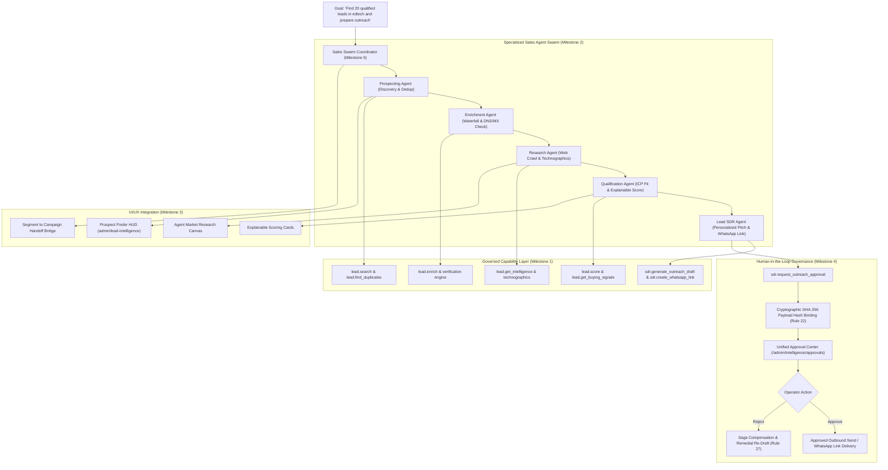

# SmartSapp Agentic & MCP Transformation: Phase 10 Master Implementation Plan
## Second Agent Wave: Sales & Growth Agent System (Agentic Revenue Operations)
### Deeply Integrated with `docs/agents_mcp/`, `docs/agentic/`, `theme.md` §8 & The 69 Agentic Development Rules

**Version:** 1.0.0 (Exhaustive 69-Rules Synthesis & Mandatory Domain Agent Deliverables Gate)  
**Status:** READY FOR IMPLEMENTATION  
**Authors:** Senior Principal Systems & AI Agentic Architecture Engineer  
**Governing Documents & Source Foundations:**
- **Agentic & MCP Transformation Foundation:**
  - [`docs/agents_mcp/agents_mcp_roadmap.md`](file:///Users/josephaidoo/Desktop/Codes/vibe%20Coding/Onboarding-Dashbaord-main/docs/agents_mcp/agents_mcp_roadmap.md) (§ Phase 10: "Sales & Growth Agent System", lines 1583–1668: "Convert existing lead-intelligence into specialized agents: Prospecting Agent [discover → deduplicate → enrich → verify → score → segment → route], Deal Agent [monitor → detect risk → retrieve context → diagnose → propose next actions → prepare tasks → prepare communications], Campaign Agent [objective → audience → research → positioning → offer → messaging → landing page → form → survey → automation → analytics → optimization], Outbound Agent (Autonomous SDR) [initially draft → approval → send; eventually defined delegated authority → policy check → send → monitor → adapt while preserving explicit safety boundaries], Sales Coach Agent, Revenue Analyst Agent.")
  - [`docs/agents_mcp/agents_mcp_ui.md`](file:///Users/josephaidoo/Desktop/Codes/vibe%20Coding/Onboarding-Dashbaord-main/docs/agents_mcp/agents_mcp_ui.md) (§ Phase 10 Sales/Growth Agents, lines 3467–3496: Upgrade Lead Intelligence [Dashboard, Prospect Finder, Website Scanner, Saved Searches, Enrichment, Agent Research, Campaign Handoff]; Add: 'Have the Agent research this market', 'Turn this segment into a campaign'.)
  - [`docs/agents_mcp/agents_mcp_rules.md`](file:///Users/josephaidoo/Desktop/Codes/vibe%20Coding/Onboarding-Dashbaord-main/docs/agents_mcp/agents_mcp_rules.md) (Lines 1940–1953: Domain Agents Mandatory Deliverables: Shadow Mode, Evaluation Dataset, Permission Matrix, Tool Matrix, Failure Matrix, Security Tests, Rollback Plan; §67 The Agent Implementation Gate; All 69 Master Rules.)
  - [`docs/agents_mcp/agents_mcp_tools.md`](file:///Users/josephaidoo/Desktop/Codes/vibe%20Coding/Onboarding-Dashbaord-main/docs/agents_mcp/agents_mcp_tools.md) (§ Domain 13 Lead Intelligence and Autonomous SDR, lines 2760–2896: `lead.search`, `lead.enrich`, `lead.get_intelligence`, `lead.score`, `lead.get_decision_makers`, `lead.get_buying_signals`, `lead.get_recommended_pitch`, `lead.get_objection_handlers`, `sdr.get_daily_briefing`, `sdr.get_priority_queue`, `sdr.generate_outreach_draft`, `sdr.create_whatsapp_link`, `sdr.request_outreach_approval`, `sdr.record_outreach_outcome`, `sdr.get_conversion_insights`; Note: 'Use the existing AutonomousSDREngine, explainable scoring and revenue attribution implementations rather than building duplicate scoring logic.')
  - [`docs/agentic/07-agent-model.md`](file:///Users/josephaidoo/Desktop/Codes/vibe%20Coding/Onboarding-Dashbaord-main/docs/agentic/07-agent-model.md) (§2.2 Autonomous Lead SDR Agent, §2.3 Deal Strategy & Coach Agent; Resource Budgets & Guardrails.)
  - [`docs/agentic/02-capability-catalog.md`](file:///Users/josephaidoo/Desktop/Codes/vibe%20Coding/Onboarding-Dashbaord-main/docs/agentic/02-capability-catalog.md) (Domain 13: `lead_intelligence`, Domain 14: `campaigns_growth`, Domain 15: `messaging_outbound`.)
  - [`docs/agentic/08-memory-model.md`](file:///Users/josephaidoo/Desktop/Codes/vibe%20Coding/Onboarding-Dashbaord-main/docs/agentic/08-memory-model.md) (5-Tier Memory, prompt injection isolation `<untrusted_reference_data id="...">`.)
  - [`docs/agentic/13-uiux-architecture.md`](file:///Users/josephaidoo/Desktop/Codes/vibe%20Coding/Onboarding-Dashbaord-main/docs/agentic/13-uiux-architecture.md) (Two-Phase Human Approval Modals, HUD Cards, Explainability Grids.)
  - [`docs/agents_mcp/agents_mcp_cloudrun.md`](file:///Users/josephaidoo/Desktop/Codes/vibe%20Coding/Onboarding-Dashbaord-main/docs/agents_mcp/agents_mcp_cloudrun.md) (Stateless runtime, Cloud Tasks execution, 32MB payload ceiling, SSRF defense.)
- **Design System & Workspace Rules:**
  - [`theme.md` Section 8](file:///Users/josephaidoo/Desktop/Codes/vibe%20Coding/Onboarding-Dashbaord-main/theme.md#L396-L442) (Standardized Modal & Dialog Architecture SSOT: demarcated header/footer, single-circle info tooltip at `z-[10050]`, zero raw descriptions.)
  - [`.agents/AGENTS.md`](file:///Users/josephaidoo/Desktop/Codes/vibe%20Coding/Onboarding-Dashbaord-main/.agents/AGENTS.md) (SSOT: Strict Typing zero `any`, TagSelector, FieldsVariablesService, Actionable Toasts, Modal System, Strangler Fig Invariant.)

---

## 1. Executive Summary & Strategic Rationale

### 1.1 The Second Agent Wave: From Context to Revenue Operations
In Phase 9, SmartSapp established the **First Agent Wave (Universal CRM Agent & Account Intelligence Swarm)**, demonstrating high-context, internal-facing, read-heavy intelligence over entities, deals, notes, and meetings.

Phase 10 represents the **Second Agent Wave: Agentic Revenue Operations**. Where Phase 9 understood existing customer relationships, Phase 10 **autonomously expands revenue pipelines**:
1. **Prospecting & Discovery:** Finding ideal customer profile (ICP) accounts matching high-intent criteria.
2. **Multi-Provider Waterfall Enrichment:** Deterministic deduplication, email deliverability verification (DNS/MX/SMTP handshake), and technographic classification.
3. **Deep Research & Market Intelligence:** Crawling public web properties, detecting competitive footprint, and formulating executive dossiers.
4. **Explainable Qualification:** Harmonic scoring across Fit, Need, Intent, Budget, Authority, and Recency with full breakdown.
5. **Autonomous SDR & Outbound:** Generating hyper-personalized outreach sequences, WhatsApp click-to-chat links, and objection handling scripts.
6. **Strict Governance & Two-Phase Approval:** High-risk external actions (sending emails, messaging WhatsApp, launching mass campaigns) **never send autonomously without human confirmation** (`draft → approval → send`, Rules 21 & 22).

### 1.2 Preservation of Existing Engines (Rule 69 Strangler Fig Pattern)
SmartSapp already contains high-grade engines in `src/lib/lead-intelligence/`:
- `LeadIntelligenceEngine.ts`: Core prospect store & query logic.
- `sdr/AutonomousSDREngine.ts`: SDR briefing, priority queue, and outreach formulation.
- `scoring/ExplainableScoringEngine.ts`: Multi-dimensional score calculation.
- `waterfall/WaterfallEnrichmentEngine.ts`: Multi-provider fallback cascade.
- `research/DeepResearchDossierEngine.ts`: Account research dossiers.
- `campaigns/ProspectingCampaignEngine.ts`: Prospecting campaign execution.
- `attribution/RevenueAttributionEngine.ts`: Funnel metrics and ROI analysis.

**Rule 69 Architectural Invariant:**
Under no circumstances will Phase 10 rewrite, discard, or duplicate these proven engines. Instead, Phase 10 constructs **canonical capability adapters** (`lead.*` and `sdr.*`) in `src/platform/capabilities/sales/` and **specialized agent personas** in `src/platform/agents/sales/` that govern and orchestrate these engines under strict runtime policies.

### 1.3 Signature Revenue Workflow: "Find 20 qualified leads in edtech and prepare outreach"
When an SDR or Sales Manager prompts:
> **“Find 20 qualified leads in edtech and prepare outreach”**

The Sales Swarm coordinates a 6-stage autonomous pipeline:
```text
  1. Discovery: Prospecting Agent searches and deduplicates target accounts.
  2. Enrichment: Enrichment Agent runs waterfall lookups and verifies email deliverability.
  3. Research: Research Agent gathers technographics, pain points, and executive contacts.
  4. Qualification: Qualification Agent evaluates ICP fit and calculates explainable scores.
  5. Personalization: Autonomous SDR drafts custom email & WhatsApp pitches with objection handlers.
  6. Governance: Outbound Agent creates Action Proposals with SHA-256 payload hashes for human review.
```



---

## 2. Invariant Architecture: Dual-Tier CRM Data Model & Tenant Scoping (Rule 8, 47, 69)

When leads are converted or synchronized into the CRM, they must strictly follow the **Dual-Tier CRM Data Model**:
```text
┌────────────────────────────────────────────────────────────────────────┐
│                        GLOBAL MASTER IDENTITY                          │
│ Collection: /entities/{entityId}                                       │
│ Invariant: Immutable global identity (domain, name, verified website, │
│            global contacts, primary jurisdiction).                     │
└───────────────────────────────────┬────────────────────────────────────┘
                                    │
                    Partitions into Workspace Tenancy
                                    │
                                    ▼
┌────────────────────────────────────────────────────────────────────────┐
│                    WORKSPACE OPERATIONAL CRM RECORD                    │
│ Collection: /workspace_entities/{workspaceId}_{entityId}               │
│ Invariant: Workspace-scoped qualification, lead status, assigned SDR,   │
│            outreach history, custom workspace tags, deal stages.       │
└────────────────────────────────────────────────────────────────────────┘
```

### Critical Safeguards:
1. **Zero Global Overwrite:** Mutating operations triggered by lead synchronization or outbound qualification update `/workspace_entities/{workspaceId}_{entityId}`, never the shared global master record.
2. **Tenant Scoping:** Every query, enrichment run, campaign creation, and proposal creation immutably binds to the authenticated `organizationId` and `workspaceId`.
3. **Anti-IDOR Gate:** All Server Actions enforce `assertTenantContext(auth, orgId, workspaceId)` and fail closed with HTTP 403 on tenant mismatches.
4. **SSRF Boundary Protection:** All external website scans, crawler requests, and multi-source enrichment APIs route through `validateSafeEgressUrl` (Rule 34), blocking RFC 1918 private subnets, loopback addresses, and cloud metadata services (`169.254.169.254`).

---

## 3. Master 69-Rules Alignment & Enforcement Matrix for Phase 10

| Rule # | Category | Phase 10 Enforcement & Architectural Defense |
| :---: | :--- | :--- |
| **Rule 1** | Standards & Style | Follows Next.js 15 App Router best practices, `vercel-react-best-practices`, and `theme.md` §8 modal system. |
| **Rule 2** | Failure Mode Planning | Comprehensive failure matrix covering multi-provider API outages, DNS failures, disposable emails, and model hallucinations. |
| **Rule 3** | Backoffice Observability | Operator insight into lead discovery runs, score distributions, and outreach approval conversion on `/admin/lead-intelligence`. |
| **Rule 4** | Zero `any` / Zero `any[]` | 100% strict TypeScript types across all 5 milestones. Zod v4 schemas for all contracts, inputs, and outputs. |
| **Rule 5** | Staged Verification | Compound indexes for `prospects`, `prospecting_campaigns`, and `sdr_drafts` deployed and verified on security rules emulator. |
| **Rule 6** | Dependencies & Context7 | Validated dependencies; documentation verified via Context7 MCP. |
| **Rule 7** | Mobile-First UI English | Touch targets $\ge 44\text{px}$ (`min-h-[44px]`). UI uses clear business English without raw stack traces. |
| **Rule 8** | High Security & Anti-IDOR | Every database lookup and Server Action locks to authenticated `organizationId` and `workspaceId`. |
| **Rule 9** | High Load & Resource Limits | Prospect queries bounded ($\le 50$ records). Context knapsack packing restricts lead dossiers to $\le 4,000$ tokens. |
| **Rule 10** | Inline Documentation | Comprehensive `@fileOverview` headers explaining design rationale, rules compliance, and testability. |
| **Rule 11** | MCP Protocol Compliance | Canonical `lead.*` and `sdr.*` capabilities exposed via Streamable HTTP (Spec 2026-07-28). |
| **Rule 12** | Risk Levels | Operations classified: `lead.search` (L0_READ), `lead.enrich` (L1_INTERNAL_DRAFT), `sdr.request_outreach_approval` (L3_EXTERNAL_COMMUNICATION). |
| **Rule 13** | Trust Boundary Matrix | Web scraper output and external website HTML treated as untrusted and containerized in `<untrusted_reference_data id="...">`. |
| **Rule 14** | Fingerprint Drift Defense | Pre-execution SHA-256 fingerprint verification (`verifyCapabilityFingerprint`) before invoking any sales capability. |
| **Rule 15** | Server Allowlisting | External enrichment providers (Clearbit, Apollo, Hunter, BuiltWith) gated by the allowlist registry. |
| **Rule 16** | Agent Identity | Explicit persona definitions (`lead_sdr`, `prospecting_agent`, `enrichment_agent`, `qualification_agent`, `sales_coach`). |
| **Rule 17** | Non-Delegable Actions | Unsolicited bulk messaging and prospect deletion classified as non-delegable. |
| **Rule 18** | TOCTOU Concurrency | Optimistic locking on lead qualification updates and campaign status transitions. |
| **Rule 19** | Mandatory Idempotency | Deterministic idempotency keys (`sdr_draft_${prospectId}_${version}`, `lead_sync_${id}`). |
| **Rule 20** | Replay & Tracing | All lead runs emit structured `correlationId` and OpenTelemetry span attributes. |
| **Rule 21** | Two-Phase Action Model | Outbound communications require explicit human approval via `sdr.request_outreach_approval`. |
| **Rule 22** | Cryptographic Binding | Approval proposals bind to canonical sorted SHA-256 `payloadHash` preventing parameter tampering. |
| **Rule 23** | Budget Ceilings | Sales agent runs bounded by: $\le 120\text{s}$ duration, $\le 50,000$ tokens, $\le 15$ tool calls, $\le 25$ mutations. |
| **Rule 24** | 5-State Circuit Breakers | External enrichment APIs protected by circuit breakers (`healthy`, `degraded`, `open`, `half_open`). |
| **Rule 25** | Dead-Letter Queues | Failed enrichment jobs and outreach generation failures routed to operator DLQ. |
| **Rule 26** | Cooperative Cancellation | Context assembly and outreach generation accept `AbortSignal` for instant cancellation. |
| **Rule 27** | Formal Saga Sagas | Mutating proposals include compensating capabilities (e.g. canceling drafted campaigns or reverting synced leads). |
| **Rule 28** | Context Compression | Knapsack context compression keeps prospect history and technographics strictly $\le 4,000$ tokens. |
| **Rule 29** | Memory Governance | Retrieval weights fresh buying signals higher than stale historical interactions using temporal decay. |
| **Rule 30** | Knowledge Poisoning | Prompt injection scanning on scraped web pages and emails, isolated via `<untrusted_reference_data id="...">`. |
| **Rule 31** | Output Schema Validation | Capability outputs verified using Zod v4 `safeParse` before passing to subsequent agent steps. |
| **Rule 32** | Exfiltration Detection | Sales agents strictly restricted to allowed domains (`lead_intelligence`, `crm_contacts`, `campaigns_growth`, `messaging_outbound`). |
| **Rule 33** | Egress Redaction | Redaction engine masks API keys, bearer tokens, and sensitive contact PII before logging. |
| **Rule 34** | SSRF Defense | All outbound website crawler requests and webhook endpoints validated with `validateSafeEgressUrl`. |
| **Rule 35** | MCP Discovery Caching | Tool definitions cached with deterministic ETag HTTP 304 validation. |
| **Rule 36** | Version Compatibility | Agent definitions declare exact SemVer requirements for sales capabilities. |
| **Rule 37** | MCP Spec Compliance | Verification against MCP Protocol Spec 2026-07-28 test suites. |
| **Rule 38** | No Deprecated Primitives | Rejects legacy stateful sessions; uses Streamable HTTP transport. |
| **Rule 39** | OpenTelemetry Standards | Injects W3C `traceparent` headers across all distributed sales capability invocations. |
| **Rule 40** | Immutable Audit Trail | Sales events (`sales.lead.discovered`, `sales.lead.enriched`, `sales.lead.scored`, `sales.outreach.drafted`, `sales.outreach.approved`) emitted to audit store. |
| **Rule 41** | "Why Did You Do This?" | Every score breakdown and outreach draft explicitly renders WHAT, WHY, and EXPECTED STATE CHANGE. |
| **Rule 42** | Shadow Mode Simulation | Mandatory shadow mode harness (`dryRun: true`) tests sales agents on live data with zero writes, outputting Blast Radius Reports. |
| **Rule 43** | Replayable Runs | Prospecting and SDR runs persist execution traces allowing replay and audit review. |
| **Rule 44** | Deterministic Harness | Hermetic Vitest test harness with mock lead stores simulating discovery and scoring pipelines. |
| **Rule 45** | Chaos Testing | Simulates provider rate limits, network disconnects, and malformed HTML payloads. |
| **Rule 46** | Adversarial Red-Team | Red-team test suite against prompt injection via website meta tags, SSRF prober, and unapproved outbound bypass. |
| **Rule 47** | Never Trust the Model | All model outputs, lead scores, and generated drafts are validated against strict Zod v4 schemas. |
| **Rule 48** | Never Trust the Tool | Tool errors sanitized to mask internal database/network details from operator UI. |
| **Rule 49** | Public Resource Isolation | Sales agent capabilities restricted strictly to authenticated admin workspace surfaces. |
| **Rule 50** | Cache Partitioning | In-memory lead and score caches partitioned by `organizationId`, `workspaceId`, and `prospectId`. |
| **Rule 51** | Server Action Gate | All Server Actions enforce `'use server'`, Clerk session authentication (`requireAuth()`), and tenant IDOR checks. |
| **Rule 52** | Client/Server Boundary | Zero server-only secrets or Node core modules leaked to client bundles. |
| **Rule 53** | Dependency Governance | Zero unvetted dependencies added; all packages locked and security-audited. |
| **Rule 54** | Performance Budgets | Lead search $<400\text{ms}$; score calculation $<250\text{ms}$; outreach draft formulation $<1,500\text{ms}$. |
| **Rule 55** | DOM Resource Limits | Prospect grid displays bounded to $\le 50$ items per view with virtualization. |
| **Rule 56** | Knapsack Context Packing | Multi-source enrichment data packed via stratified knapsack algorithm keeping context $\le 4,000$ tokens. |
| **Rule 57** | Data Residency | Lead data queries honor tenant data residency tags and redaction rules. |
| **Rule 58** | Model Routing Policy | Fast filters & contact extraction route to Flash; deep research dossiers, ICP scoring, and outreach drafting route to Pro. |
| **Rule 59** | Capability Domain Guard | Persona capabilities filtered strictly by allowed domains. |
| **Rule 60** | Emergency Dead-Man Switch | `checkGovernanceDeadManSwitch` evaluated before every lead run, step dispatch, and proposal creation; fails closed with HTTP 503. |
| **Rule 61** | Surface Isolation | Administrative lead settings restricted to `isBackofficeSurface()`. |
| **Rule 62** | Real-Time SSE Reactivity | Live scan progress and enrichment updates stream via Server-Sent Events (`useEventStream`) without polling. |
| **Rule 63** | Incident Management | Operators can pause SDR outreach, reject proposals, and trigger rollback directly from UI. |
| **Rule 64** | Zero Raw HTML/CSS Leakage | Generated drafts and dossiers rendered through sanitized markdown components; features gated by `FF_SALES_AGENT_WAVE`. |
| **Rule 65** | Canary Releases | Staged rollout supporting dark launches and workspace beta flags. |
| **Rule 66** | Phased Alignment | Fully aligned with Phase 10 roadmap and forward-compatible with Phase 11 (Meetings & Customer Intelligence). |
| **Rule 67** | The Implementation Gate | Mandatory 9-point pre-flight checklist verified before marking any Phase 10 milestone complete. |
| **Rule 68** | The Five Non-Negotiables | 1. Model is not security boundary. 2. Tool output is untrusted. 3. Mutations idempotent & auditable. 4. Bounded authority & resources. 5. Operable without code. |
| **Rule 69** | Strangler Fig Pattern | Wraps existing `src/lib/lead-intelligence/` engines without rewriting; preserves dual-tier CRM model. |

---

## 4. The Agent Implementation Gate Verification (Rule 67)

```text
1. ARCHITECTURE
   □ Canonical capabilities used: lead.search, lead.enrich, lead.get_intelligence, lead.score,
     lead.get_decision_makers, lead.get_buying_signals, lead.get_recommended_pitch, lead.get_objection_handlers,
     sdr.get_daily_briefing, sdr.get_priority_queue, sdr.generate_outreach_draft, sdr.create_whatsapp_link,
     sdr.request_outreach_approval, sdr.record_outreach_outcome, sdr.get_conversion_insights.
   □ No duplication of existing services: wraps existing LeadIntelligenceEngine, ExplainableScoringEngine,
     WaterfallEnrichmentEngine, AutonomousSDREngine, and DeepResearchDossierEngine.
   □ Source of truth: Firestore (/prospects, /workspace_entities, /entities, /sdr_drafts, /prospecting_campaigns).
   □ Events emitted: sales.lead.discovered, sales.lead.enriched, sales.lead.scored, sales.outreach.drafted,
     sales.outreach.approval_required, sales.outreach.approved, sales.outreach.rejected, sales.campaign.launched.

2. AUTHORITY
   □ Who is allowed to use it: Authenticated SDRs, Sales Managers, and Admins with sales_outbound or crm permissions.
   □ What may the agent do: Search leads, enrich data, calculate scores, research public websites, draft outreach pitches,
     generate WhatsApp click-to-chat links, propose CRM stage transitions.
   □ What may the agent never do: Send unsolicited bulk emails without human approval, execute live financial transactions,
     delete CRM accounts, bypass SSRF network controls.
   □ Can a sub-agent inherit this authority: Yes, strictly monotonically attenuated (P_child = P_parent ∩ P_specialist).

3. DATA
   □ What data enters the agent: Prospect names, company domains, public websites, technographics, ICP criteria.
   □ What data leaves the system: Outbound email drafts, WhatsApp prefilled messages (upon approval), CRM records.
   □ What is trusted: Verified tenant configuration, system prompt templates, canonical CRM records.
   □ What is untrusted: External website HTML, scraped meta tags, third-party provider responses.
   □ What is sensitive: Personal contact emails, phone numbers, executive revenue numbers (redacted in logs).

4. EXECUTION
   □ Is it idempotent: Yes, deterministic idempotency keys for all mutations (sdr_draft_${id}, lead_sync_${id}).
   □ Can it be retried: Yes, exponential backoff with jitter up to maxAttempts = 3.
   □ Can it be cancelled: Yes, cooperative cancellation via AbortSignal.
   □ Can it be duplicated: No, deduplication keys prevent concurrent identical runs.
   □ What if underlying record changes: TOCTOU version check aborts with optimistic lock error.
   □ What if response is lost: Checkpoint hash chain allows exact replay from last verified state.

5. MCP
   □ What protocol version: Spec 2026-07-28.
   □ What SDK version: @modelcontextprotocol/server v2.x.
   □ What capabilities: Tools, Prompts, Resources, Tasks.
   □ What annotations: Readonly, destructive, high_risk hints (server-verified, Rule 12).
   □ What server identity: sales-intelligence-mcp-server.
   □ What schema version: Zod v4 canonical contracts.
   □ What if tool definition changes: Pre-execution cryptographic SHA-256 fingerprint verification fails closed.

6. FAILURE
   □ Timeout: 120s max duration ceiling per agent run; 5,000ms ceiling for web crawlers.
   □ 429: Circuit breaker trips to 'open', backpressure backoff kicks in.
   □ 500: Caught, sanitized, mapped to structured error codes (SALES_ERROR_CODES).
   □ Partial execution: Saga reverse-LIFO compensation rolls back executed steps.
   □ Provider unavailable: Waterfall fallback to secondary provider (Clearbit -> Apollo -> Hunter -> BuiltWith).
   □ Stale approval: Action proposal expires after 24h; requires re-proposal.
   □ Concurrent modification: Optimistic concurrency version mismatch triggers replan.

7. SECURITY
   □ Prompt injection: Neutralized via regex pattern scanning and <untrusted_reference_data id="..."> isolation.
   □ Tool poisoning: SHA-256 capability fingerprint verification.
   □ Confused deputy: Agent identity immutably bound to caller's tenant context.
   □ SSRF: validateSafeEgressUrl blocks loopback, private subnets, and GCP metadata IPs.
   □ Exfiltration: Outbound domain whitelist enforced by capability registry.
   □ Privilege escalation: Monotonic downward scope attenuation prevents privilege elevation.
   □ Cross-tenant leakage: Strict Anti-IDOR validation on every query and action.

8. OPERATIONS
   □ Can Backoffice disable it: Yes, emergency dead-man pause switch (Rule 60).
   □ Can Backoffice inspect it: Yes, live execution timeline on /admin/intelligence/runs.
   □ Can Backoffice replay it: Yes, deterministic replay from execution traces.
   □ Can Backoffice rollback it: Yes, reverse-LIFO saga compensation button.
   □ Can Backoffice change policy without code: Yes, dynamic persona policy editor (/admin/intelligence/agents).

9. TESTING
   □ Unit: Contract validation, score calculation, URL parameter encoding, SSRF prober.
   □ Integration: Multi-provider waterfall fallback, CRM dual-tier linking, Server Actions.
   □ Security: Adversarial prompt injection in web HTML, IDOR cross-tenant probing, unapproved outbound send bypass.
   □ Evaluation: 20+ real-world sales scenarios evaluated on golden benchmark dataset.
   □ Chaos: Provider 500/429 simulation, DNS resolution timeouts, malformed HTML responses.

10. MIGRATION
   □ Existing behavior preserved: 100% of existing Lead Intelligence UI tabs and routes remain intact.
   □ Existing routes preserved: /admin/lead-intelligence continues to operate seamlessly.
   □ Existing data preserved: Dual-tier CRM data model (/entities vs /workspace_entities) preserved without data migration.
   □ Rollback documented: Feature flag FF_SALES_AGENT_WAVE allows instant rollback to classic mode.
```

---

## 5. Domain Agents Mandatory Deliverables Gate (Rules 1940–1953)

Each specialized agent in Phase 10 implements the 7 mandatory deliverables:

```text
┌─────────────────────────┬────────────────────────────────────────────────────────────────────────┐
│ Deliverable             │ Phase 10 Implementation & Verification                                  │
├─────────────────────────┼────────────────────────────────────────────────────────────────────────┤
│ 1. Shadow Mode          │ sales-shadow-runner.ts: Runs agent runs with dryRun: true; intercepts   │
│                         │ mutations, logs intended actions, outputs Blast Radius Reports.        │
├─────────────────────────┼────────────────────────────────────────────────────────────────────────┤
│ 2. Evaluation Dataset   │ sales-eval-dataset.ts: 20+ realistic golden benchmarks (discovery,      │
│                         │ enrichment waterfall, ICP qualification, pitch drafting, SSRF probes). │
├─────────────────────────┼────────────────────────────────────────────────────────────────────────┤
│ 3. Permission Matrix    │ sales-tool-matrix.ts: Explicit domain privileges (lead_intelligence,   │
│                         │ crm_contacts, campaigns_growth, messaging_outbound); no wildcard scopes│
├─────────────────────────┼────────────────────────────────────────────────────────────────────────┤
│ 4. Tool Matrix          │ Canonical mappings for 15 sales & SDR capabilities with risk levels.   │
├─────────────────────────┼────────────────────────────────────────────────────────────────────────┤
│ 5. Failure Matrix       │ Explicit handling of 12 distinct failure modes (API limits, DNS drops, │
│                         │ disposable emails, model hallucinations, stale approvals).             │
├─────────────────────────┼────────────────────────────────────────────────────────────────────────┤
│ 6. Security Tests       │ Dedicated test suites for SSRF defense, prompt injection isolation,   │
│                         │ anti-IDOR boundary validation, and two-phase approval enforcement.     │
├─────────────────────────┼────────────────────────────────────────────────────────────────────────┤
│ 7. Rollback Plan        │ Saga compensation capabilities (reverting synced leads, canceling      │
│                         │ drafted campaigns, rejecting pending proposals).                       │
└─────────────────────────┴────────────────────────────────────────────────────────────────────────┘
```

---

## 6. Phase 10 Milestone Breakdown & Roadmap

```text
┌──────────────────────────────────────────────────────────────────────────────────────────┐
│ MILESTONE 1: Lead Intelligence Data Foundation, Canonical Capabilities & Scoring Adapter  │
│ - Canonical sales contracts & Zod v4 schemas (src/platform/agents/sales/context/)         │
│ - Canonical capability adapters for lead.* (src/platform/capabilities/sales/)            │
│ - Lead Context Assembler with dual-tier CRM linking (entities vs workspace_entities)     │
│ - Server Actions for sales intelligence with Clerk auth & Anti-IDOR validation           │
│ - Comprehensive unit & contract test suites                                               │
├──────────────────────────────────────────────────────────────────────────────────────────┤
│ MILESTONE 2: Specialized Sales Agent Personas, Tool Matrix, Eval Dataset & Shadow Mode   │
│ - Specialized personas: lead_sdr, prospecting_agent, enrichment_agent, qualification_agent│
│ - Permission Matrix & Tool Matrix with least privilege scopes                            │
│ - Evaluation Dataset with 20+ golden benchmark scenarios                                 │
│ - Shadow Mode simulation harness (dryRun: true) with Blast Radius Report generation      │
│ - Persona & Shadow Mode unit test suites                                                 │
├──────────────────────────────────────────────────────────────────────────────────────────┤
│ MILESTONE 3: Lead Intelligence UI Surfaces, Prospect Finder HUD & Market Research Canvas │
│ - Market Research Canvas Modal ("Have the Agent research this market") (theme.md §8)     │
│ - Segment to Campaign Handoff Bridge ("Turn this segment into a campaign") (theme.md §8) │
│ - Embedded Explainable Score Cards & Pitch Recommendation HUD                            │
│ - Upgrade /admin/lead-intelligence tabs with Strangler Fig preservation                  │
│ - Real-time SSE reactivity (useEventStream) for scan/enrichment progression              │
├──────────────────────────────────────────────────────────────────────────────────────────┤
│ MILESTONE 4: Autonomous Outbound Pipeline, Two-Phase Approval Desk & WhatsApp Formulator  │
│ - SDR Outbound Engine & canonical capability adapters for sdr.*                          │
│ - Two-Phase Outreach Approval Desk with SHA-256 payloadHash cryptographic binding         │
│ - WhatsApp Click-to-Chat & Email formulator with anti-injection parameter encoding       │
│ - Outreach Review Drawer / Modal conforming to theme.md §8                               │
│ - Outbound integration & security test suites                                            │
├──────────────────────────────────────────────────────────────────────────────────────────┤
│ MILESTONE 5: Flagship Revenue Operations Workflow, Multi-Agent Swarm & Platform QA       │
│ - Flagship Workflow: "Find 20 qualified leads in edtech and prepare outreach"             │
│ - Autonomous Swarm Orchestrator (Prospecting -> Enrichment -> Qualification -> SDR)      │
│ - Adversarial Red-Team Security Suite (SSRF, prompt injection, deliverability limits)    │
│ - Full Platform QA Vitest Run (1,500+ tests passing, 0 typecheck errors, 0 lint errors)   │
└──────────────────────────────────────────────────────────────────────────────────────────┘
```

---

## 7. Immediate Next Step

Author the detailed, step-by-step implementation plan for **Phase 10 Milestone 1**:
[`docs/agents_mcp/phases/agents_mcp_phase_10_milestone_1_plan.md`](file:///Users/josephaidoo/Desktop/Codes/vibe%20Coding/Onboarding-Dashbaord-main/docs/agents_mcp/phases/agents_mcp_phase_10_milestone_1_plan.md), covering Tasks 1–5 with strict TDD bite-sized execution steps.
