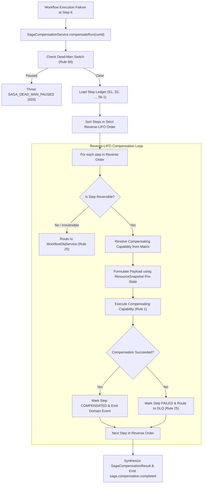

# SmartSapp Agentic & MCP Transformation: Phase 14 Milestone 3 Plan
## Universal Saga Compensation Engine, Reverse-LIFO Coordinator & DLQ Bridge
### Fully Conforming to `docs/agents_mcp/agents_mcp_rules.md` (Rules 1–69, Rules 1940–1964, Rules 67–69), `theme.md` §8, and `.agents/AGENTS.md`

**Version:** 3.0.0  
**Status:** DRAFT / PENDING USER APPROVAL (Do not start execution until plan is approved)  
**Date:** 2026-10-08  
**Author:** AI Agentic Architecture Team & Principal Systems Architect  

---

## 1. Goal & Milestone Overview

Milestone 3 implements the **Universal Saga Compensation Engine, Reverse-LIFO Coordinator & DLQ Bridge** for Phase 14 ("Agentic Self-Management & Verification").

It operationalizes **Rule 27 (Formal Saga / Compensation Model)** and **Rule 25 (Dead-Letter and Recovery Queues)** within the **6-Step Responsible Execution Loop**:
```text
PLAN → PREDICT (Snapshot Pre-State) → EXECUTE → VERIFY (Postconditions) → COMMIT (Assert Version Unchanged) → LEARN / COMPENSATE
```

Prior to this milestone, domain agents (CRM, Sales, Finance, Knowledge, Meetings, and Supervisor Swarms) maintained fragmented, domain-specific rollback definitions (`CRM_ROLLBACK_MATRIX`, `FINANCE_ROLLBACK_MATRIX`, `SALES_ROLLBACK_MATRIX`, `MEETING_ROLLBACK_MATRIX`, `SUPERVISOR_ROLLBACK_MATRIX`). There was no universal cross-domain orchestrator to undo multi-step composite operations when a downstream step fails or when postconditions fail. Furthermore, if a compensating step is irreversible (e.g., an external webhook was dispatched) or if the rollback itself encounters an unexpected failure, unverified systems risk leaving orphaned corrupted records.

Milestone 3 solves this by providing:
1. **Universal Saga Rollback Matrix (`UNIVERSAL_SAGA_ROLLBACK_MATRIX`)**: A unified, cross-domain registry mapping every mutating capability in SmartSapp to its designated compensating capability, reversal classification, and payload transformer.
2. **Reverse-LIFO Compensation Engine (`SagaCompensationService`)**: Executes compensating operations in strict reverse-chronological order:
   $$\text{Compensate}(S_{k-1}) \circ \text{Compensate}(S_{k-2}) \circ \dots \circ \text{Compensate}(S_1)$$
   Injects exact pre-mutation state attributes from Milestone 2 `ResourceSnapshot` into compensating payloads to guarantee exact rollback fidelity.
3. **Dead-Letter Queue (DLQ) Quarantine Bridge (Rule 25)**: Integrates directly with [`WorkflowDlqService`](file:///Users/josephaidoo/Desktop/Codes/vibe%20Coding/Onboarding-Dashbaord-main/src/platform/workflows/resilience/workflow-dlq-service.ts). Any non-compensable step, irreversible external action, or failed rollback is automatically quarantined into the DLQ with full forensic snapshots and operator alerting events.
4. **Platform Kill-Switch & Anti-IDOR Enforcement**: Multi-tiered Anti-IDOR protection (Rules 8 & 47) and emergency dead-man pause evaluation (Rule 60) failing closed with HTTP 503 `SAGA_DEAD_MAN_PAUSED`.

---

## 2. Exhaustive Rules Alignment with `docs/agents_mcp/agents_mcp_rules.md`

### 2.1 The Master Rules (Rules 1–69)

- **Rule 1 (Modern Web Guidance & Canonical Capabilities):** Server Actions ('use server') and Saga services conform to modern Next.js 15 standards, Vercel React best practices, and serverless constraints.
- **Rule 2 (FMEA Failure Analysis):** Complete FMEA matrix covering partial execution failures, cascading rollback aborts, irreversible side-effects, out-of-band state mutations during rollback, and dead-man freezes.
- **Rule 3 (Backoffice Governance Impact):** Backoffice operators can inspect active Saga ledgers, review DLQ quarantined compensating steps, and manually retry compensations without code deployments.
- **Rule 4 (Strict Typing):** Zero `any` or `any[]`. Bounded Zod v4 schemas only (`SagaStepExecutionRecordSchema`, `SagaCompensationResultSchema`, `UniversalRollbackEntrySchema`). `unknown` narrowed immediately at boundaries.
- **Rule 5 (Staged Deployment & Verification):** All Saga contracts, matrices, capabilities, and server actions are validated with rigorous test batteries before staging.
- **Rule 8 & 47 (Anti-IDOR Multi-Tenant Lock):** Every Saga compensation run and ledger lookup strictly validates `organizationId` and `workspaceId`. Cross-tenant probes are rejected with HTTP 403 `IDOR_VIOLATION`.
- **Rule 10 (Inline Architectural Documentation):** Detailed comments explaining Reverse-LIFO choreography, idempotency invariants, and DLQ quarantine models across all source files.
- **Rule 11 (Mathematical Determinism):** Compensated step counts, failed counts, and retry attempt counters deterministically bounded.
- **Rule 12 (Risk Vocabulary):** `saga.execute_compensation` classified as `L2_STATE_MUTATION`, non-delegable. `saga.get_execution_ledger` classified as `L0_READ`.
- **Rule 13 & 30 (Untrusted Data Isolation):** Any untrusted payload or memo in compensation steps is sanitized against `ADVERSARIAL_DIRECTIVE_PATTERNS` and wrapped in `<untrusted_reference_data>`.
- **Rule 14 (Schema Fingerprinting & Contracts):** Canonical Zod v4 contracts with deterministic property hashes preventing tool definition rug-pulls.
- **Rule 16 (Explicit Scoped RBAC):** Scoped non-wildcard permissions `saga:compensate` and `saga:read` registered in `permission-refs.ts`.
- **Rule 17 (Non-Delegable Restrictions):** AI subagents are strictly forbidden from initiating arbitrary un-supervised Saga compensations. Compensation can only be triggered by the supervisor, orchestrator, or authorized operator.
- **Rule 18 (TOCTOU Optimistic Concurrency Guard):** Before executing a compensating capability, checks the target record's `stateHash` and `version` using `StateVersionService` (Milestone 2) to ensure the state wasn't further mutated out-of-band.
- **Rule 19 (Deterministic Idempotency):** Every compensating step execution is idempotent; rerunning compensation for an already compensated step is a safe no-op.
- **Rule 20 (Replay / Duplicate Delivery Protection):** Compensation runs carry unique, immutable `sagaRunId` and correlation tokens preventing replay.
- **Rule 21 & 22 (Two-Phase Execution & SHA-256 Hash Binding):** Step ledger computes canonical SHA-256 digest (`sha256Hex`) over key-sorted JSON before and after compensation.
- **Rule 23 (Resource Governance & Quotas):** Saga compensation bounded to $\le 30,000$ms timeout and $\le 25$ steps per execution.
- **Rule 24 (Circuit Breakers):** Repeated downstream compensation capability failures trip circuit breakers and route remaining steps to DLQ rather than hanging in infinite retry loops.
- **Rule 25 (Dead-Letter and Recovery Queues):** Any step that fails compensation or is marked irreversible is automatically routed to `WorkflowDlqService` with sanitized error context, context snapshot, and alerting events.
- **Rule 26 (Cooperative Cancellation):** Native `AbortSignal` supported throughout `SagaCompensationService`.
- **Rule 27 (Formal Saga / Compensation Model):** Core platform implementation of Reverse-LIFO compensation for all multi-step agent actions.
- **Rule 29 (Temporal Fact Supersession):** For knowledge facts, compensation links `supersededBy` back to the previous active fact or restores valid temporal windows.
- **Rule 40 (Domain Event Auditing):** Emits `saga.compensation.started`, `saga.step.compensated`, `saga.step.failed`, `saga.compensation.completed`, and `saga.dlq.quarantined` via `defaultEventBus`.
- **Rule 41 (Explainability Grid):** Compensation reports detail WHAT step failed, WHY compensation was triggered, and EXPECTED STATE CHANGE of every compensated resource.
- **Rule 42 (Shadow Mode & Simulation):** Supports `dryRun: true` producing 0 live compensating database writes while generating a Blast Radius simulation report.
- **Rule 44 (Deterministic Simulation):** Unit and integration suites mock database states to simulate mid-workflow failures and verify reverse execution order.
- **Rule 45 (Chaos Fault Injection):** Chaos testing covers mid-rollback timeouts, missing pre-state snapshots, and failing compensating handlers.
- **Rule 46 (Adversarial Agent Red-Team Battery):** Dedicated red-team suite covering unauthorized compensation invocation, cross-tenant rollback hijacking, dead-man pause bypass, and poisoned rollback payloads.
- **Rule 47 (Never Trust the Model):** Saga compensation logic is pure, deterministic code; LLMs never determine which steps are compensated or which capabilities are invoked.
- **Rule 48 (Sanitized Error Taxonomy):** `SagaCompensationError` with mapped HTTP status codes (400, 403, 404, 409, 500, 503, 504).
- **Rule 50 (Cache Isolation):** In-memory ledger caches strictly partitioned by `organizationId:workspaceId:runId`.
- **Rule 51 (Server Actions Security):** `'use server'`, Clerk session authentication (`requireAuth()`), Anti-IDOR tenant lock (`assertTenantAccess`), and emergency dead-man switch evaluation (Rule 60).
- **Rule 60 (Emergency Dead-Man Switch Evaluation):** Checks `checkGovernanceDeadManSwitch(orgId)` and fails closed immediately with HTTP 503 `SAGA_DEAD_MAN_PAUSED`.
- **Rule 61 (Backoffice Control Plane):** Operations can inspect Saga execution ledgers, view compensation metrics, and triage DLQ items without code deployments.
- **Rule 67 (The Agent Implementation Gate):** Fully satisfies Architecture, Authority, Data, Execution, MCP, Failure, Security, Operations, Testing, and Migration checklists.
- **Rule 68 (The Five Non-Negotiables):** Zero `any`, fail-closed, model is never the boundary, bounded resources, kill switches.
- **Rule 69 (Strangler Fig Invariant):** Unifies pre-existing domain rollback matrices (`CRM_ROLLBACK_MATRIX`, `FINANCE_ROLLBACK_MATRIX`, `SALES_ROLLBACK_MATRIX`, `MEETING_ROLLBACK_MATRIX`, `SUPERVISOR_ROLLBACK_MATRIX`) without breaking existing workflows or mutating legacy tables.

---

## 3. The 4 Mandatory Governance Matrices (Rules 1940–1953)

### 3.1 Saga Permission Matrix (Rule 16)
| Persona / Principal | `saga:read` | `saga:compensate` | `saga:admin_override` |
| :--- | :---: | :---: | :---: |
| `autonomous_subagent` | FORBIDDEN | FORBIDDEN (Rule 17) | FORBIDDEN |
| `supervisor_agent` | ALLOWED | ALLOWED (Scoped) | FORBIDDEN |
| `human_operator` | ALLOWED | ALLOWED | ALLOWED (Audited) |
| `backoffice_admin` | ALLOWED | ALLOWED | ALLOWED (Audited) |

### 3.2 Saga Tool Matrix (Rule 12 & 14)
| Tool / Capability | Risk Classification | Requires Expected Version | Audit Required | Idempotent | Non-Delegable |
| :--- | :---: | :---: | :---: | :---: | :---: |
| `saga.execute_compensation` | `L2_STATE_MUTATION` | Yes | Yes | Yes | **Yes (Rule 17)** |
| `saga.get_execution_ledger` | `L0_READ` | No | Yes | Yes | No |

### 3.3 Saga Failure Matrix (Rule 2 & 48)
| Error Code | HTTP Status | Root Cause | Deterministic Recovery Strategy |
| :--- | :---: | :--- | :--- |
| `SAGA_STEP_COMPENSATION_FAILED` | 500 | Compensating capability threw error | `ROUTE_TO_DLQ` (Quarantine step into `WorkflowDlqService`, continue reverse rollback of remaining steps) |
| `SAGA_IRREVERSIBLE_STEP` | 400 | Capability has no compensating action | `ROUTE_TO_DLQ` (Quarantine to DLQ for manual operator remediation) |
| `SAGA_CONCURRENCY_DRIFT` | 409 | Pre-state drifted before compensation | `FAIL_AND_DLQ` (Halt compensation on step, quarantine to DLQ) |
| `SAGA_DEAD_MAN_PAUSED` | 503 | Platform emergency pause active | `FAIL_CLOSED` (Halt immediately) |
| `SAGA_TIMEOUT` | 504 | Compensation exceeded 30,000ms | `FAIL_CLOSED` (Abort and quarantine in-flight steps) |
| `IDOR_VIOLATION` | 403 | Cross-tenant ledger access | `FAIL_CLOSED` (Log security alert, reject) |
| `SAGA_RUN_NOT_FOUND` | 404 | Ledger runId does not exist | `FAIL_CLOSED` (Return 404) |

### 3.4 Universal Saga Rollback Matrix (`UNIVERSAL_SAGA_ROLLBACK_MATRIX`) (Rule 27)
Unifies domain-level rollback mappings into an authoritative platform-wide registry:
| Domain | Mutating Capability | Compensating Capability | Reversibility | Strategy |
| :--- | :--- | :--- | :--- | :--- |
| **CRM** | `crm.deal.advance_stage` | `crm.deal.revert_stage` | REVERSIBLE | Reverts stage and restores previous pipeline metrics using pre-state snapshot |
| **CRM** | `crm.entity.update` | `crm.entity.update` | REVERSIBLE | Re-applies pre-mutation attributes from `ResourceSnapshot` |
| **CRM** | `crm.entity.tag_add` | `crm.entity.tag_remove` | REVERSIBLE | Removes added tag IDs |
| **CRM** | `crm.task.create` | `crm.task.delete` | REVERSIBLE | Soft-deletes or archives created task |
| **Sales** | `sdr.draft_outreach` | `noop` | REVERSIBLE | Discards staged draft (no external mutation occurred) |
| **Sales** | `sdr.dispatch_email` | `sdr.log_outreach_revoked` | PARTIALLY_REVERSIBLE | Outbound email sent; logs revocation event and flags deal, enqueues to DLQ if bounce/complaint |
| **Sales** | `sdr.dispatch_whatsapp` | `sdr.log_outreach_revoked` | PARTIALLY_REVERSIBLE | WhatsApp message sent; logs revocation event, marks message revoked |
| **Finance** | `reconciliation.resolve_exception` | `reconciliation.unresolve_exception` | REVERSIBLE | Re-opens discrepancy item and clears settlement linkage |
| **Finance** | `collections.execute_proposal` | `collections.rollback_proposal` | REVERSIBLE | Voids payment plan milestones and restores prior account status |
| **Knowledge** | `knowledge.candidate.decide` | `knowledge.candidate.reopen` | REVERSIBLE | Reverts candidate status to PENDING and invalidates approved memory fact |
| **Supervisor** | `supervisor.mesh.route_handoff` | `supervisor.mesh.revert_handoff` | REVERSIBLE | Reclaims execution context from subagent |

---

## 4. Architectural Design & Subsystems



---

## 5. Bite-Sized Implementation Tasks (TDD Plan)

### Task 1: Canonical Saga Contracts, Error Taxonomy & Public Barrels
**Files:**
- Create: `src/platform/verification/saga/saga-compensation-types.ts`
- Create: `src/platform/verification/saga/index.ts`
- Modify: `src/platform/verification/index.ts`
- Test: `src/platform/__tests__/verification/saga-contracts.test.ts`

- [ ] **Step 1: Write failing contracts test**
  - Verify Zod v4 schemas: `SagaStepStatusSchema`, `SagaStepExecutionRecordSchema`, `SagaExecutionPlanSchema`, `SagaCompensationResultSchema`, `UniversalRollbackEntrySchema`.
  - Verify error taxonomy: `SAGA_ERROR_CODES` and typed `SagaCompensationError`.
  - Verify zero `any` or `any[]` (Rule 4).
- [ ] **Step 2: Run test to verify it fails**
  - Run: `pnpm vitest run src/platform/__tests__/verification/saga-contracts.test.ts`
  - Expected: FAIL (Module not found).
- [ ] **Step 3: Author contracts, error taxonomy and index barrels**
  - Implement `saga-compensation-types.ts` and `saga/index.ts`.
  - Re-export in `src/platform/verification/index.ts`.
- [ ] **Step 4: Run test to verify it passes**
  - Run: `pnpm vitest run src/platform/__tests__/verification/saga-contracts.test.ts`
  - Expected: PASS (100%).
- [ ] **Step 5: Commit**
  - `git commit -m "feat(saga): establish canonical saga compensation contracts and error taxonomy"`

---

### Task 2: Universal Saga Rollback Matrix (`UNIVERSAL_SAGA_ROLLBACK_MATRIX`)
**Files:**
- Create: `src/platform/verification/saga/universal-saga-rollback-matrix.ts`
- Modify: `src/platform/verification/saga/index.ts`
- Test: `src/platform/__tests__/verification/universal-saga-rollback-matrix.test.ts`

- [ ] **Step 1: Write failing matrix test**
  - Verify mapping for CRM, Sales, Finance, Knowledge, and Supervisor capabilities.
  - Verify lookup helpers: `getUniversalRollbackEntry`, `isCapabilityReversible`, `getCompensatingCapabilityId`.
  - Verify fallback behavior for unmapped read-only capabilities (`noop`).
- [ ] **Step 2: Run test to verify it fails**
  - Run: `pnpm vitest run src/platform/__tests__/verification/universal-saga-rollback-matrix.test.ts`
  - Expected: FAIL.
- [ ] **Step 3: Implement Universal Saga Rollback Matrix**
  - Author `universal-saga-rollback-matrix.ts` with comprehensive domain mapping and helper functions.
- [ ] **Step 4: Run test to verify it passes**
  - Run: `pnpm vitest run src/platform/__tests__/verification/universal-saga-rollback-matrix.test.ts`
  - Expected: PASS (100%).
- [ ] **Step 5: Commit**
  - `git commit -m "feat(saga): implement universal saga rollback matrix and lookup helpers"`

---

### Task 3: Universal Saga Compensation Engine & DLQ Bridge
**Files:**
- Create: `src/platform/verification/saga/saga-compensation-service.ts`
- Modify: `src/platform/verification/saga/index.ts`
- Test: `src/platform/__tests__/verification/saga-compensation-service.test.ts`

- [ ] **Step 1: Write failing service test**
  - Test Reverse-LIFO execution ordering: `Step 3 -> Step 2 -> Step 1`.
  - Test pre-state snapshot attribute injection into compensating payload.
  - Test DLQ quarantine bridge via `WorkflowDlqService` for irreversible or failed steps.
  - Test anti-IDOR multi-tenant validation and dead-man pause evaluation (HTTP 503).
  - Test cooperative cancellation via `AbortSignal`.
  - Test global singleton preservation (`getSagaCompensationService()`).
- [ ] **Step 2: Run test to verify it fails**
  - Run: `pnpm vitest run src/platform/__tests__/verification/saga-compensation-service.test.ts`
  - Expected: FAIL.
- [ ] **Step 3: Implement Saga Compensation Service**
  - Author `saga-compensation-service.ts` adhering to Rules 8, 11, 18, 25, 26, 27, 40, 41, 42, 60, 69.
- [ ] **Step 4: Run test to verify it passes**
  - Run: `pnpm vitest run src/platform/__tests__/verification/saga-compensation-service.test.ts`
  - Expected: PASS (100%).
- [ ] **Step 5: Commit**
  - `git commit -m "feat(saga): implement universal saga compensation engine with reverse-LIFO and DLQ bridge"`

---

### Task 4: Canonical Saga Capabilities
**Files:**
- Modify: `src/platform/capabilities/contracts/permission-refs.ts`
- Create: `src/platform/capabilities/saga/saga-capabilities.ts`
- Create: `src/platform/capabilities/saga/index.ts`
- Modify: `src/platform/capabilities/index.ts`
- Test: `src/platform/__tests__/verification/saga-capabilities.test.ts`

- [ ] **Step 1: Write failing capabilities test**
  - Test `saga.execute_compensation` (`L2_STATE_MUTATION`, Non-Delegable: true).
  - Test `saga.get_execution_ledger` (`L0_READ`).
  - Test registration in `CapabilityRegistry`.
  - Test Anti-IDOR enforcement.
- [ ] **Step 2: Run test to verify it fails**
  - Run: `pnpm vitest run src/platform/__tests__/verification/saga-capabilities.test.ts`
  - Expected: FAIL.
- [ ] **Step 3: Register permissions and author saga capabilities**
  - Add `saga:compensate` and `saga:read` to `permission-refs.ts`.
  - Implement `saga-capabilities.ts` and index barrels.
- [ ] **Step 4: Run test to verify it passes**
  - Run: `pnpm vitest run src/platform/__tests__/verification/saga-capabilities.test.ts`
  - Expected: PASS (100%).
- [ ] **Step 5: Commit**
  - `git commit -m "feat(saga): register canonical saga capabilities and permissions"`

---

### Task 5: Secure Next.js 15 Server Actions
**Files:**
- Create: `src/app/actions/saga-compensation-actions.ts`
- Test: `src/platform/__tests__/verification/saga-actions.test.ts`

- [ ] **Step 1: Write failing server actions test**
  - Test `executeSagaCompensationAction`, `getSagaExecutionLedgerAction`, `recordSagaStepAction`.
  - Test Clerk session authentication (`requireAuth()`).
  - Test Anti-IDOR validation (`assertTenantAccess`).
  - Test emergency dead-man pause check returning HTTP 503 `SAGA_DEAD_MAN_PAUSED`.
- [ ] **Step 2: Run test to verify it fails**
  - Run: `pnpm vitest run src/platform/__tests__/verification/saga-actions.test.ts`
  - Expected: FAIL.
- [ ] **Step 3: Implement Server Actions**
  - Author `src/app/actions/saga-compensation-actions.ts` strictly following Rule 51.
- [ ] **Step 4: Run test to verify it passes**
  - Run: `pnpm vitest run src/platform/__tests__/verification/saga-actions.test.ts`
  - Expected: PASS (100%).
- [ ] **Step 5: Commit**
  - `git commit -m "feat(saga): implement secure Next.js 15 server actions for saga compensation"`

---

### Task 6: Adversarial Red-Team & Chaos Battery
**Files:**
- Create: `src/platform/__tests__/verification/saga-red-team.test.ts`

- [ ] **Step 1: Write comprehensive 5-vector red-team and chaos test suite**
  - **Vector 1:** Complex multi-step multi-domain workflow failure (CRM Deal advance + Finance Invoice create + Outreach dispatch) executing in strict Reverse-LIFO order.
  - **Vector 2:** Irreversible step and compensating failure automatic quarantine into `WorkflowDlqService` (Rule 25).
  - **Vector 3:** Dead-man emergency switch lockdown across engine and server actions (Rule 60).
  - **Vector 4:** Cross-tenant IDOR attack on Saga ledgers and rollback executions (Rules 8 & 47).
  - **Chaos Vector:** Adversarial timeout / `AbortSignal` cooperative cancellation mid-compensation (Rule 26).
- [ ] **Step 2: Run red-team test suite**
  - Run: `pnpm vitest run src/platform/__tests__/verification/saga-red-team.test.ts`
  - Expected: PASS (100%).
- [ ] **Step 3: Run full platform verification suite**
  - Run: `pnpm vitest run src/platform/__tests__/verification/`
  - Expected: All test files passing green.
- [ ] **Step 4: Run typecheck and linting**
  - Run: `pnpm typecheck` (0 errors).
  - Run: `pnpm lint` (0 errors, warnings $\le 720$ ceiling).
- [ ] **Step 5: Commit**
  - `git commit -m "test(saga): author adversarial red-team and chaos battery for saga compensation"`

---

## 6. Verification & Quality Gates

| Verification Gate | Command | Acceptance Standard |
| :--- | :--- | :--- |
| **Saga Unit & Integration Tests** | `pnpm vitest run src/platform/__tests__/verification/saga-*.test.ts` | 100% Pass Rate |
| **Full Verification Suite** | `pnpm vitest run src/platform/__tests__/verification/` | 100% Pass Rate |
| **TypeScript Compilation** | `pnpm typecheck` | Clean exit code 0 (`0 errors`) |
| **ESLint Static Analysis** | `pnpm lint` | Clean exit code 0 (0 errors, 0 new warnings) |
| **Git Working Tree** | `git status` | Clean working tree, 0 remote pushes |
