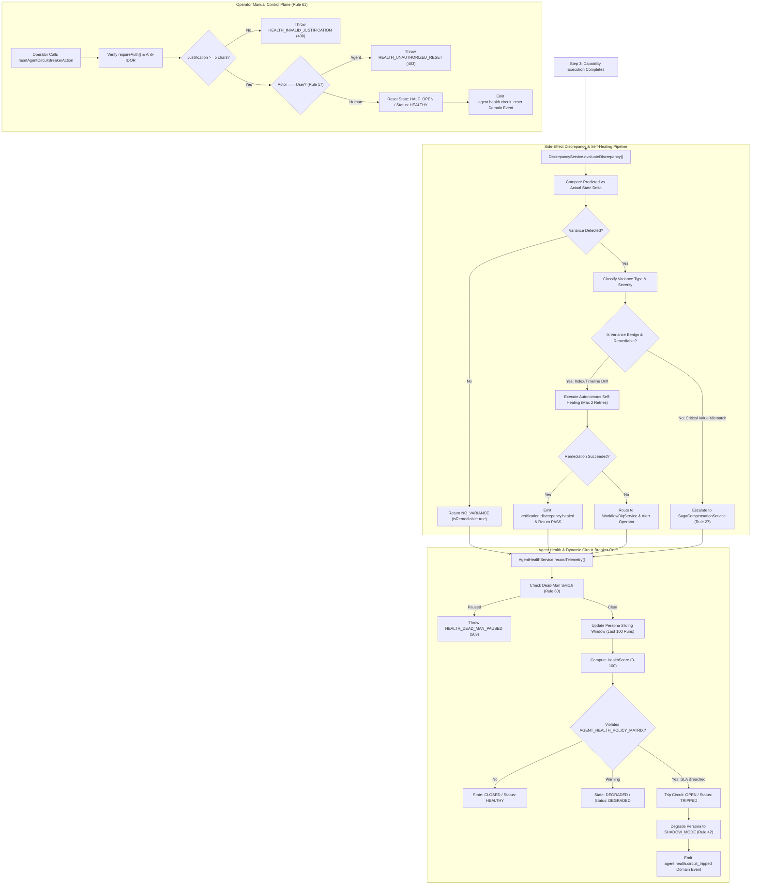
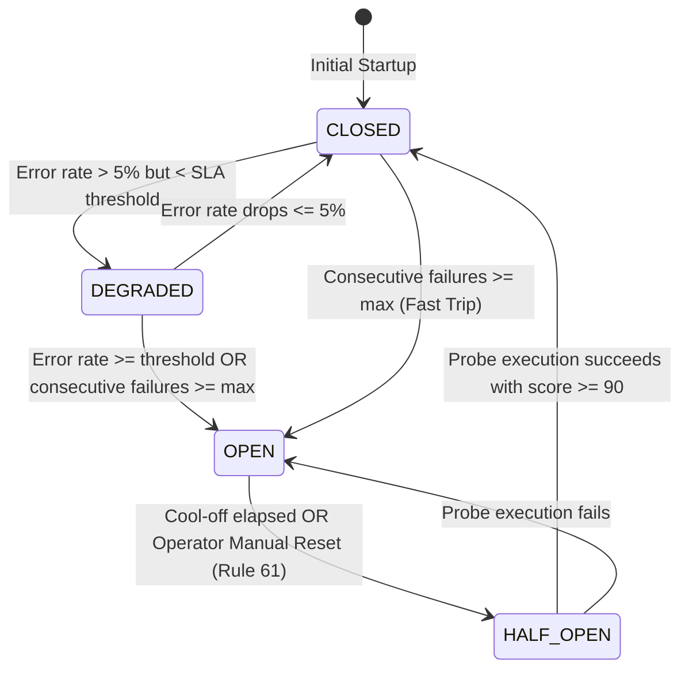

# SmartSapp Agentic & MCP Transformation: Phase 14 Milestone 4 Plan
## Side-Effect Discrepancy Engine, Autonomous Self-Healing & Health Telemetry Core
### Fully Conforming to `docs/agents_mcp/agents_mcp_rules.md` (Rules 1–69, Rules 1940–1964, Rules 67–69), `theme.md` §8, and `.agents/AGENTS.md`

**Version:** 4.2.0  
**Status:** DRAFT / PENDING USER APPROVAL (Do not start execution until plan is approved)  
**Date:** 2026-10-08  
**Author:** AI Agentic Architecture Team & Principal Systems Architect  

---

## 1. Goal & Milestone Overview

Milestone 4 implements the **Side-Effect Discrepancy Engine, Autonomous Self-Healing & Health Telemetry Core** for Phase 14 ("Agentic Self-Management & Verification").

It operationalizes **Step 4 (Verify: Side-Effect Discrepancy Detection)** and **Step 6 (Learn: Self-Healing & Continuous Health Telemetry)** within the **6-Step Responsible Execution Loop**:
```text
PLAN → PREDICT (Snapshot Pre-State) → EXECUTE → VERIFY (Postconditions & Discrepancies) → COMMIT (Assert Version Unchanged) → LEARN (Self-Healing / Health Telemetry)
```

### 1.1 The Operational Problem

Prior to this milestone, even with postcondition verification (Milestone 1), state-version validation (Milestone 2), and universal saga compensation (Milestone 3), critical operational gaps remain:
1. **Undetected Side-Effect Drift (Rule 1962):** Multi-agent workflows often trigger indirect side-effects (secondary projection indexes, activity timeline nodes, search vector embeddings, contact tag caches). When primary mutations succeed but secondary side-effects drift or fail silently, records become partially desynchronized without failing immediate postconditions.
2. **Lack of Autonomous Self-Healing:** Not every discrepancy warrants a full, expensive reverse-LIFO saga rollback. Benign side-effects (e.g. temporary secondary index desynchronization or unlinked activity cards) can be safely, idempotently healed without aborting business transactions.
3. **Static Agent Configurations & No Dynamic Circuit Breakers (Rule 24):** Personas currently operate without continuous real-time health telemetry. If a provider API degrades, an MCP tool experiences transient failures, or a persona begins producing high error rates, there is no dynamic circuit breaker to detect the anomaly and automatically throttle or degrade that persona to Shadow Mode (Rule 42 - zero live writes) before cascading corruption occurs.
4. **Operator Governance Gap (Rules 3, 60 & 61):** Operators lack a programmatic control plane to inspect persona health scorecards, monitor circuit states (`CLOSED`, `DEGRADED`, `OPEN`, `HALF_OPEN`), and perform audited manual circuit resets without code redeployments.

### 1.2 The Solution

Milestone 4 delivers an integrated, mathematically bounded self-healing and health governance architecture:
1. **Side-Effect Discrepancy Engine (`DiscrepancyService`)**: Compares `PredictedStateChange` against `ActualStateChange`, detects unintended variances, classifies variance severity (`NO_VARIANCE`, `BENIGN_INDEX_DRIFT`, `BENIGN_TIMELINE_UNLINK`, `FIELD_VALUE_MISMATCH`, `MISSING_RECORD`, `UNEXPECTED_MUTATION`), and determines whether self-healing is possible.
2. **Autonomous Self-Healing Executor**: Executes deterministic, bounded remediation routines for benign variances (max 2 retries, idempotent, zero destructive operations) and escalates critical discrepancies to `SagaCompensationService` (Milestone 3) or `WorkflowDlqService` (Rule 25).
3. **Agent Health Policy Matrix (`AGENT_HEALTH_POLICY_MATRIX`) (Rule 1962)**: Authoritative governance matrix establishing baseline operational SLAs per specialized persona across CRM, Sales, Meetings, Knowledge, Finance, School Ops, and Supervisor mesh.
4. **Agent Health Monitoring Core & Dynamic Circuit Breaker (`AgentHealthService`)**: Computes deterministic health scores (0–100) using a multi-factor weighted algorithm, automatically trips circuits to `OPEN` and degrades personas to `SHADOW_MODE` upon threshold breaches, and supports audited manual resets ($\ge 5$ characters justification, Rule 61).
5. **Canonical Capabilities & Secure Next.js 15 Server Actions**: Implements secure capabilities and Server Actions with strict Anti-IDOR validation (Rules 8 & 47), non-delegable controls (Rule 17), and Rule 60 emergency dead-man switch fail-closed semantics.

---

## 2. Exhaustive Rules Alignment with `docs/agents_mcp/agents_mcp_rules.md`

### 2.1 The Master Rules (Rules 1–69)

- **Rule 1 (Modern Web Guidance & Canonical Capabilities):** Server Actions ('use server') conform to Next.js 15 standards, Vercel React best practices, and serverless constraints.
- **Rule 2 (FMEA Failure Analysis):** Comprehensive failure mode analysis covering discrepancy analysis timeouts, self-healing race conditions, circuit breaker flap cycles, and telemetry store saturation.
- **Rule 3 & Rule 61 (Backoffice Governance Impact):** Backoffice operators can inspect agent health scorecards, trigger manual self-healing, and reset tripped circuit breakers with mandatory audit justifications ($\ge 5$ characters) without code deployments.
- **Rule 4 (Strict Typing Protocol):** Zero `any` or `any[]`. Bounded Zod v4 schemas only (`DiscrepancyReportSchema`, `AgentHealthScorecardSchema`, `HealthThresholdPolicySchema`, `ResetCircuitBreakerInputSchema`). `unknown` narrowed immediately at boundaries.
- **Rule 5 (Staged Deployment & Verification):** All health and discrepancy contracts, matrices, capabilities, and server actions are validated with rigorous test batteries before staging.
- **Rule 7 (Tactile Feedback & Usability):** Action buttons or modal controls for circuit breaker resets feature active scale transformations (`active:scale-[0.97]`) and minimum 44px touch targets.
- **Rule 8 & 47 (Anti-IDOR Multi-Tenant Lock):** Every health scorecard lookup, discrepancy evaluation, and circuit reset strictly validates `organizationId` and `workspaceId`. Cross-tenant probes are rejected with HTTP 403 `IDOR_VIOLATION`.
- **Rule 9 & Rule 23 (Bounded Concurrency & Resource Ceilings):** Self-healing routines are bounded to $\le 2$ retry attempts and $\le 5,000$ms execution timeout. Discrepancy analysis executes within $\le 3,000$ms.
- **Rule 10 (Inline Architectural Documentation):** Detailed comments explaining discrepancy classification, health score formulas, circuit state transitions, and self-healing boundaries across all source files.
- **Rule 11 (Mathematical Determinism):** Pure deterministic formulas for health scoring:
  $$\text{HealthScore} = \text{round}\left(0.40 \cdot S_{\text{success}} + 0.30 \cdot (100 - S_{\text{errorRate}}) + 0.20 \cdot S_{\text{recovery}} + 0.10 \cdot S_{\text{latency}}\right)$$
  Integer rounding eliminates fractional floating-point drift.
- **Rule 12 (Risk Vocabulary):** `health.reset_circuit_breaker` classified as `L2_STATE_MUTATION`, non-delegable. `health.get_scorecard`, `health.list_scorecards`, `health.record_telemetry`, and `health.evaluate_discrepancy` classified as `L0_READ`.
- **Rule 13 & 30 (Untrusted Data Isolation & Injection Defense):** Any untrusted payload or external discrepancy context is sanitized against `ADVERSARIAL_DIRECTIVE_PATTERNS` and wrapped in `<untrusted_reference_data id="...">`.
- **Rule 14 (Schema Fingerprinting & Contracts):** Canonical Zod v4 contracts with deterministic property hashes preventing tool definition rug-pulls.
- **Rule 16 (Explicit Scoped RBAC):** Scoped non-wildcard permissions `health:read` and `health:manage` registered in `permission-refs.ts`.
- **Rule 17 (Non-Delegable Restrictions & Deciders):** AI subagents are strictly forbidden from resetting circuit breakers or declaring failing agents "healthy". Reset actions require human operators.
- **Rule 18 (TOCTOU Optimistic Concurrency Guard):** Self-healing routines assert resource version before applying secondary repairs.
- **Rule 19 (Deterministic Idempotency):** Telemetry recording and self-healing actions are strictly idempotent.
- **Rule 20 (Replay Protection):** Telemetry event processing verifies unique `executionId` preventing duplicate failure counts.
- **Rule 21 & 22 (Two-Phase Execution & SHA-256 Hash Binding):** Discrepancy reports compute SHA-256 hashes (`sha256Hex`) over expected vs actual state deltas to detect tampering.
- **Rule 24 (Dynamic Circuit Breakers):** Autonomous circuit tripping when `successRate < minSuccessRate` or consecutive failures exceed thresholds, auto-degrading persona to `SHADOW_MODE`.
- **Rule 25 (Dead-Letter and Recovery Queues):** Non-remediable critical discrepancies route to `WorkflowDlqService` for operator inspection.
- **Rule 26 (Cooperative Cancellation):** Native `AbortSignal` supported throughout `DiscrepancyService` and `AgentHealthService`.
- **Rule 27 (Formal Saga / Compensation Model):** Connects to `SagaCompensationService` (Milestone 3) when critical state discrepancies cannot be healed.
- **Rule 28 & Rule 56 (Knapsack Context Budgeting):** Discrepancy audit summaries and scorecard payloads bounded strictly $\le 4,000$ tokens.
- **Rule 31, 32, 33 (Data Minimization & Sensitive Data Isolation):** Health telemetry and discrepancy reports scrub PII and secrets before persisting or emitting events.
- **Rule 40 (Domain Event Auditing):** Emits `verification.discrepancy.detected`, `verification.discrepancy.healed`, `verification.discrepancy.escalated`, `agent.health.scorecard_updated`, `agent.health.circuit_tripped`, and `agent.health.circuit_reset` via `defaultEventBus`.
- **Rule 41 (Explainability Grid):** Discrepancy reports detail WHAT changed, WHY variance occurred, and EXPECTED STATE CHANGE after remediation.
- **Rule 42 (Shadow Mode & Dynamic Degradation):** When a circuit trips, the persona is automatically downgraded to `SHADOW_MODE` (zero live writes).
- **Rule 46 (Adversarial Agent Red-Team Battery):** Dedicated red-team suite covering discrepancy report tampering, unauthorized circuit resets, cross-tenant telemetry poisoning, and cascade tripping.
- **Rule 47 (Never Trust the Model):** Discrepancy detection and circuit breaker transitions are 100% deterministic code; models never evaluate health scores or circuit states.
- **Rule 48 (Sanitized Error Taxonomy):** `AgentHealthError` with mapped HTTP status codes (400, 403, 404, 409, 500, 503, 504).
- **Rule 50 (Cache & State Isolation):** Telemetry records strictly partitioned by `${organizationId}:${workspaceId}:${personaId}`.
- **Rule 51 (Server Actions Security):** Enforces `'use server'`, Clerk session authentication (`requireAuth()`), Anti-IDOR tenant lock (`assertTenantAccess`), and emergency dead-man pause check (Rule 60).
- **Rule 54 (State Machine Invariants):** Strict circuit breaker FSM: `CLOSED` $\rightarrow$ `DEGRADED` $\rightarrow$ `OPEN` (Tripped) $\rightarrow$ `HALF_OPEN` $\rightarrow$ `CLOSED`.
- **Rule 55 (Clamping Ceilings):** Clamps maximum tracked telemetry history to $\le 100$ records per persona and maximum remediation retries to $\le 2$.
- **Rule 60 (Emergency Dead-Man Switch Evaluation):** Checks `checkGovernanceDeadManSwitch(orgId)` and fails closed immediately with HTTP 503 `HEALTH_DEAD_MAN_PAUSED`.
- **Rule 61 (Mandatory Justification for Operator Actions):** Manual circuit breaker resets require explicit operator justification note ($\ge 5$ characters).
- **Rule 62 (Real-Time SSE Reactivity):** Health events emitted to `defaultEventBus` stream directly to backoffice monitors.
- **Rule 67 (The Agent Implementation Gate):** Satisfies Architecture, Authority, Data, Execution, MCP, Failure, Security, Operations, Testing, and Migration checklists.
- **Rule 68 (The Five Non-Negotiables):** Zero `any`, fail-closed security, model is never the boundary, bounded resources, kill switches.
- **Rule 69 (Strangler Fig Invariant):** Preserves existing identity, capability, and workflow registries without breaking current behavior.
- **Rules 1940–1953 (Domain Agents Mandatory Deliverables Gate):** Formalizes 4 Governance Matrices for health and discrepancy systems.
- **Rule 1962 (Phase 14 Verification: Side-Effect Verification Gate):** Fully operationalizes mandatory Phase 14 side-effect verification and health monitoring.

---

### 2.2 The Rule 67 Agent Implementation Gate Verification

Every deliverable in Milestone 4 must satisfy the ten Rule 67 dimensions before completion:

```text
ARCHITECTURE
□ What canonical capability does this use? (health.get_scorecard, health.list_scorecards, health.record_telemetry, health.evaluate_discrepancy, health.reset_circuit_breaker)
□ Is this duplicating an existing service? (No; extends CapabilityRegistry, EventBus, WorkflowDlqService, and SagaCompensationService)
□ What is the source of truth? (Firestore / In-Memory telemetry store partitioned by org:ws:persona + immutable audit events)
□ What events are emitted? (verification.discrepancy.*, agent.health.* via defaultEventBus)

AUTHORITY
□ Who is allowed to use it? (Clerk session auth via requireAuth(); read open to authenticated operators/supervisors; reset restricted to human operators)
□ What may the agent do? (Record execution telemetry, request discrepancy evaluation, participate in self-healing)
□ What may the agent never do? (Reset circuit breakers or declare itself "healthy" - Rule 17)
□ Can a sub-agent inherit this authority? (No; reset capability is non-delegable)

DATA
□ What data enters the agent? (Predicted vs actual state snapshots, execution metrics: duration, tokens, error codes)
□ What data leaves the system? (Sanitized discrepancy reports, health scorecards, circuit trip/reset events)
□ What is trusted? (Internal execution telemetry, cryptographic hashes, verified database records)
□ What is untrusted? (External API status messages, scraped payload memos, client-supplied discrepancy inputs)
□ What is sensitive? (Authentication tokens and customer PII; scrubbed before telemetry aggregation)

EXECUTION
□ Is it idempotent? (Yes; telemetry records keyed by unique executionId, self-healing routines idempotent)
□ Can it be retried? (Yes; benign discrepancy healing bounded to <= 2 retries)
□ Can it be cancelled? (Yes; cooperative cancellation via native AbortSignal - Rule 26)
□ Can it be duplicated? (Deduplicated via executionId in sliding-window buffer)
□ What if the underlying record changes? (Checked via StateVersionService before self-healing commit - Rule 18)
□ What if the response is lost? (Scorecards re-computed deterministically from sliding-window history)

MCP
□ What protocol version? (MCP Spec 2026-07-28)
□ What SDK version? (TypeScript SDK v2 / @modelcontextprotocol/server)
□ What capabilities? (health.get_scorecard, health.evaluate_discrepancy)
□ What annotations? (Risk level annotations, audit required)
□ What server identity? (Stateless HTTP streamable transport)
□ What schema version? (Zod v4 canonical contracts)
□ What happens if tool definition changes? (SHA-256 fingerprint drift detection - Rule 14)

FAILURE
□ Timeout? (Bounded: discrepancy analysis <= 3s, self-healing <= 5s, throwing HEALTH_TIMEOUT / 504)
□ 429? (Exponential backoff with jitter on secondary healing calls)
□ 500? (Caught by engine, routes non-remediable discrepancies to DLQ or Saga)
□ Partial execution? (Recorded as error event, increments failure counter, updates health score)
□ Provider unavailable? (Circuit breaker trips to OPEN, persona degraded to SHADOW_MODE)
□ Stale approval? (Rejected with STALE_APPROVAL / 409)
□ Concurrent modification? (Optimistic locking check; fail-closed with 409)

SECURITY
□ Prompt injection? (All external discrepancy context scanned for ADVERSARIAL_DIRECTIVE_PATTERNS and isolated in <untrusted_reference_data>)
□ Tool poisoning? (Canonical schema hashes verify tool integrity)
□ Confused deputy? (Multi-tenant partition assertion assertTenantAccess prevents cross-tenant access)
□ SSRF? (No arbitrary URL fetching during self-healing)
□ Exfiltration? (Telemetry payloads stripped of secrets before storage or event emission)
□ Privilege escalation? (Circuit reset strictly enforces actor.type === 'user')
□ Cross-tenant leakage? (Partitioned by organizationId:workspaceId)

OPERATIONS
□ Can Backoffice disable it? (Yes; via platform dead-man kill switch - Rule 60)
□ Can Backoffice inspect it? (Yes; health scorecards and discrepancy reports exposed via Server Actions)
□ Can Backoffice replay it? (Yes; self-healing routines re-executable idempotently)
□ Can Backoffice rollback it? (Yes; via SagaCompensationService - Rule 27)
□ Can Backoffice change policy without code? (Yes; AGENT_HEALTH_POLICY_MATRIX thresholds configurable via backoffice policy store)

TESTING
□ Unit: Full coverage of scoring math, sliding window, and variance categorization
□ Integration: EventBus subscription and DLQ routing
□ Contract: Zod v4 schemas validation and strict typing
□ Security: Anti-IDOR cross-tenant injection and subagent reset bypass
□ Adversarial: 5-vector red-team test suite
□ Load: 100-event telemetry burst processing under bounded memory
□ Chaos: AbortSignal cancellation mid-evaluation and mid-healing

MIGRATION
□ Existing behavior preserved? (Yes; 100% backward compatible with existing personas)
□ Existing routes preserved? (Yes; zero modifications to legacy routes)
□ Existing data preserved? (Yes; read-only telemetry overlay, zero destructive table migrations)
□ Backfill needed? (No; telemetry records dynamically on fresh executions)
□ Restore procedure documented? (Yes; manual circuit reset runbook)
□ Rollback documented? (Yes; feature flag / kill switch disabling telemetry hooks)
```

---

### 2.3 The Rule 68 Five Non-Negotiables Verification

1. **Non-Negotiable 11 — The model is never the security boundary:**  
   Discrepancy classification, health score computation, and circuit breaker state transitions are 100% deterministic TypeScript algorithms. LLMs are never consulted to judge agent health or authorize circuit resets.
2. **Non-Negotiable 12 — Tool output is untrusted data:**  
   Any discrepancy evidence or external provider error string is parsed through `ADVERSARIAL_DIRECTIVE_PATTERNS` and wrapped in `<untrusted_reference_data id="...">` containers before rendering or storage.
3. **Non-Negotiable 13 — Every mutation must be idempotent, authorized, version-checked and auditable:**  
   Self-healing routines assert version currentness (`assertVersionCurrent`) and circuit breaker resets require verified user authority (`requireAuth()`), audit logs, and domain events.
4. **Non-Negotiable 14 — Every production agent must have bounded authority and bounded resources:**  
   Telemetry history is clamped to $\le 100$ entries per persona; self-healing is clamped to $\le 2$ retries; evaluation timeouts are enforced at $\le 3,000$ms and $\le 5,000$ms.
5. **Non-Negotiable 15 — Every autonomous capability must be operable without code:**  
   Operators can view health scores, inspect variance reports, and reset tripped circuit breakers through Server Actions and standardized UI without deploying code.

---

### 2.4 Actionable Toast & Error Navigation (`.agents/AGENTS.md`)

- Whenever an agent circuit breaker trips into `OPEN` or health status degrades to `CRITICAL`, toast notifications dispatched to operators must include `actionConfig`:
  ```typescript
  toast({
    title: 'Agent Circuit Breaker Tripped',
    description: `Persona '${personaId}' has breached failure SLA and degraded to Shadow Mode.`,
    variant: 'destructive',
    duration: 15000,
    actionConfig: {
      path: '/admin/intelligence/health',
      label: 'Inspect Agent Health',
    },
  });
  ```
- To comply with platform security:
  - `actionConfig.path` strictly starts with `/` and references internal relative routes only.
  - Buttons feature `active:scale-[0.97]` tactile transitions and minimum 44px touch targets.

---

## 3. The 4 Mandatory Governance Matrices (Rules 1940–1953)

### 3.1 Health & Discrepancy Permission Matrix (Rule 16)
| Persona / Principal | `health:read` | `health:manage` | `health:admin_override` |
| :--- | :---: | :---: | :---: |
| `autonomous_subagent` | FORBIDDEN | FORBIDDEN (Rule 17) | FORBIDDEN |
| `supervisor_agent` | ALLOWED | FORBIDDEN (Rule 17) | FORBIDDEN |
| `human_operator` | ALLOWED | ALLOWED | FORBIDDEN |
| `backoffice_admin` | ALLOWED | ALLOWED | ALLOWED (Audited) |

### 3.2 Health & Discrepancy Tool Matrix (Rules 12 & 14)
| Tool / Capability | Risk Classification | Requires Expected Version | Audit Required | Idempotent | Non-Delegable |
| :--- | :---: | :---: | :---: | :---: | :---: |
| `health.get_scorecard` | `L0_READ` | No | Yes | Yes | No |
| `health.list_scorecards` | `L0_READ` | No | Yes | Yes | No |
| `health.record_telemetry` | `L0_READ` | No | Yes | Yes | No |
| `health.evaluate_discrepancy` | `L0_READ` | No | Yes | Yes | No |
| `health.reset_circuit_breaker` | `L2_STATE_MUTATION` | Yes | **Yes (Rule 61)** | Yes | **Yes (Rule 17)** |

### 3.3 Health & Telemetry Failure Matrix (Rules 2 & 48)
| Error Code | HTTP Status | Root Cause | Deterministic Recovery Strategy |
| :--- | :---: | :--- | :--- |
| `HEALTH_CIRCUIT_TRIPPED` | 503 | Persona failure rate or errors exceeded SLA | `DEGRADE_TO_SHADOW_MODE` (Degrade persona to shadow mode, alert operator) |
| `HEALTH_INVALID_JUSTIFICATION` | 400 | Reset attempted with justification < 5 chars | `FAIL_CLOSED` (Reject reset request) |
| `HEALTH_UNAUTHORIZED_RESET` | 403 | Autonomous agent attempted circuit reset | `FAIL_CLOSED` (Log security alert, reject) |
| `HEALTH_DEAD_MAN_PAUSED` | 503 | Platform emergency pause active | `FAIL_CLOSED` (Halt immediately) |
| `DISCREPANCY_REMEDIATION_FAILED` | 500 | Self-healing routine failed after 2 retries | `ESCALATE_TO_DLQ_OR_SAGA` (Route to DLQ or trigger Saga rollback) |
| `DISCREPANCY_NON_REMEDIABLE` | 409 | Critical field or record mismatch detected | `TRIGGER_SAGA_COMPENSATION` |
| `IDOR_VIOLATION` | 403 | Cross-tenant health scorecard access | `FAIL_CLOSED` (Log security alert, reject) |
| `HEALTH_PERSONA_NOT_FOUND` | 404 | Persona ID not recognized in registry | `FAIL_CLOSED` |

### 3.4 Agent Health Policy Matrix (`AGENT_HEALTH_POLICY_MATRIX`) (Rule 1962 & Rule 24)
Authoritative threshold policies defining SLAs per persona family:

| Persona Family / ID | Min Success Rate | Max Failure Rate | Max Tool Errors / Hr | Max Consecutive Failures | Cool-off Period | Degradation Mode |
| :--- | :---: | :---: | :---: | :---: | :---: | :--- |
| **Sales & SDR** (`lead_sdr`, `prospecting_agent`, `qualification_agent`) | 85% | 15% | 10 | 3 | 300,000ms (5m) | `SHADOW_MODE` |
| **Finance & Billing** (`billing_analyst`, `collections_agent`, `reconciliation_agent`) | 95% | 5% | 5 | 2 | 600,000ms (10m) | `SHADOW_MODE` |
| **School Operations** (`school_ops_agent`, `attendance_analyst`, `fee_collection_agent`) | 90% | 10% | 8 | 3 | 300,000ms (5m) | `SHADOW_MODE` |
| **Knowledge & Search** (`knowledge_agent`, `knowledge_analyst`) | 90% | 10% | 8 | 3 | 180,000ms (3m) | `SHADOW_MODE` |
| **Meeting Intelligence** (`meeting_analyst`, `meeting_prep`) | 90% | 10% | 8 | 3 | 300,000ms (5m) | `SHADOW_MODE` |
| **CRM Operations** (`crm_researcher`, `deal_coach`, `task_coordinator`) | 90% | 10% | 8 | 3 | 300,000ms (5m) | `SHADOW_MODE` |
| **Supervisor Swarm** (`supervisor`) | 95% | 5% | 4 | 2 | 600,000ms (10m) | `SHADOW_MODE` |

---

## 4. Architectural Design & Subsystems

### 4.1 Execution Sequence & Self-Healing Pipeline



### 4.2 Dynamic Circuit Breaker State Machine (Rule 54)



---

## 5. Bite-Sized Implementation Tasks (TDD Plan)

### Task 1: Canonical Health & Discrepancy Contracts, Error Taxonomy & Public Barrels
**Files:**
- Create: `src/platform/verification/health/health-types.ts`
- Create: `src/platform/verification/health/index.ts`
- Modify: `src/platform/verification/index.ts`
- Test: `src/platform/__tests__/verification/health-contracts.test.ts`

- [ ] **Step 1: Write failing contracts test**
  - Verify Zod v4 schemas: `DiscrepancyVarianceTypeSchema`, `DiscrepancyReportSchema`, `AgentHealthScorecardSchema`, `HealthThresholdPolicySchema`, `RecordExecutionTelemetryInputSchema`, `ResetCircuitBreakerInputSchema`, `CircuitStateSchema`, `AgentHealthStatusSchema`.
  - Verify error taxonomy: `HEALTH_ERROR_CODES` and typed `AgentHealthError` with HTTP mapping.
  - Verify zero `any` or `any[]` (Rule 4).
- [ ] **Step 2: Run test to verify it fails**
  - Run: `pnpm vitest run src/platform/__tests__/verification/health-contracts.test.ts`
  - Expected: FAIL (Module not found).
- [ ] **Step 3: Author contracts, error taxonomy and index barrels**
  - Implement `health-types.ts` and `health/index.ts`.
  - Re-export in `src/platform/verification/index.ts`.
- [ ] **Step 4: Run test to verify it passes**
  - Run: `pnpm vitest run src/platform/__tests__/verification/health-contracts.test.ts`
  - Expected: PASS (100%).
- [ ] **Step 5: Commit**
  - `git commit -m "feat(health): establish canonical discrepancy and agent health contracts"`

---

### Task 2: Agent Health Policy Matrix (`AGENT_HEALTH_POLICY_MATRIX`)
**Files:**
- Create: `src/platform/verification/health/agent-health-policy-matrix.ts`
- Modify: `src/platform/verification/health/index.ts`
- Test: `src/platform/__tests__/verification/agent-health-policy-matrix.test.ts`

- [ ] **Step 1: Write failing matrix test**
  - Verify threshold mappings for all 26 canonical agent personas across all domains (CRM, Sales, Meetings, Knowledge, Finance, School, Supervisor).
  - Verify lookup helpers: `getPersonaHealthPolicy`, `evaluateHealthStatus`, `getDegradationMode`.
  - Verify fallback behavior for custom / dynamic subagent personas.
- [ ] **Step 2: Run test to verify it fails**
  - Run: `pnpm vitest run src/platform/__tests__/verification/agent-health-policy-matrix.test.ts`
  - Expected: FAIL.
- [ ] **Step 3: Implement Agent Health Policy Matrix**
  - Author `agent-health-policy-matrix.ts` with strict threshold boundaries and lookup utilities.
- [ ] **Step 4: Run test to verify it passes**
  - Run: `pnpm vitest run src/platform/__tests__/verification/agent-health-policy-matrix.test.ts`
  - Expected: PASS (100%).
- [ ] **Step 5: Commit**
  - `git commit -m "feat(health): implement agent health policy matrix and threshold evaluators"`

---

### Task 3: Side-Effect Discrepancy Engine & Autonomous Self-Healing Service
**Files:**
- Create: `src/platform/verification/health/discrepancy-service.ts`
- Modify: `src/platform/verification/health/index.ts`
- Test: `src/platform/__tests__/verification/discrepancy-service.test.ts`

- [ ] **Step 1: Write failing discrepancy service test**
  - Test predicted vs actual change comparison logic.
  - Test detection of `NO_VARIANCE`, `BENIGN_INDEX_DRIFT`, `BENIGN_TIMELINE_UNLINK`, `FIELD_VALUE_MISMATCH`, `MISSING_RECORD`.
  - Test autonomous self-healing execution for benign drifts with bounded retries ($\le 2$).
  - Test escalation routing for critical discrepancies to `SagaCompensationService` or `WorkflowDlqService`.
  - Test untrusted data isolation inside `<untrusted_reference_data id="...">` (Rules 13 & 30).
  - Test dead-man pause evaluation (HTTP 503) and cooperative cancellation (`AbortSignal`).
  - Test global singleton preservation (`getDiscrepancyService()`).
- [ ] **Step 2: Run test to verify it fails**
  - Run: `pnpm vitest run src/platform/__tests__/verification/discrepancy-service.test.ts`
  - Expected: FAIL.
- [ ] **Step 3: Implement Discrepancy Service**
  - Author `discrepancy-service.ts` adhering to Rules 8, 9, 11, 13, 18, 25, 26, 27, 30, 40, 41, 48, 60, 69.
- [ ] **Step 4: Run test to verify it passes**
  - Run: `pnpm vitest run src/platform/__tests__/verification/discrepancy-service.test.ts`
  - Expected: PASS (100%).
- [ ] **Step 5: Commit**
  - `git commit -m "feat(health): implement side-effect discrepancy engine and self-healing service"`

---

### Task 4: Agent Health Monitoring Core & Dynamic Circuit Breaker Engine
**Files:**
- Create: `src/platform/verification/health/agent-health-service.ts`
- Modify: `src/platform/verification/health/index.ts`
- Test: `src/platform/__tests__/verification/agent-health-service.test.ts`

- [ ] **Step 1: Write failing agent health service test**
  - Test execution telemetry aggregation and sliding-window recording (max 100 entries).
  - Test multi-factor health score calculation algorithm (0–100).
  - Test dynamic circuit breaker auto-tripping when failure rates breach SLA.
  - Test persona auto-degradation to `SHADOW_MODE` (Rule 42).
  - Test manual circuit breaker reset with mandatory justification ($\ge 5$ characters, Rule 61).
  - Test non-delegable enforcement rejecting AI subagents attempting resets (Rule 17).
  - Test anti-IDOR tenant isolation (`organizationId`, `workspaceId`).
  - Test domain event emissions (`agent.health.scorecard_updated`, `agent.health.circuit_tripped`, `agent.health.circuit_reset`).
  - Test global singleton preservation (`getAgentHealthService()`, Rule 69).
- [ ] **Step 2: Run test to verify it fails**
  - Run: `pnpm vitest run src/platform/__tests__/verification/agent-health-service.test.ts`
  - Expected: FAIL.
- [ ] **Step 3: Implement Agent Health Service**
  - Author `agent-health-service.ts` adhering to Rules 8, 11, 12, 16, 17, 24, 40, 41, 42, 48, 50, 60, 61, 69.
- [ ] **Step 4: Run test to verify it passes**
  - Run: `pnpm vitest run src/platform/__tests__/verification/agent-health-service.test.ts`
  - Expected: PASS (100%).
- [ ] **Step 5: Commit**
  - `git commit -m "feat(health): implement agent health monitoring core and dynamic circuit breaker engine"`

---

### Task 5: Canonical Health Capabilities & Secure Next.js 15 Server Actions
**Files:**
- Modify: `src/platform/capabilities/contracts/permission-refs.ts`
- Create: `src/platform/capabilities/health/health-capabilities.ts`
- Create: `src/platform/capabilities/health/index.ts`
- Modify: `src/platform/capabilities/index.ts`
- Create: `src/app/actions/agent-health-actions.ts`
- Test: `src/platform/__tests__/verification/health-capabilities-and-actions.test.ts`

- [ ] **Step 1: Write failing capabilities & server actions test**
  - Test `health.get_scorecard` (`L0_READ`), `health.list_scorecards` (`L0_READ`), `health.reset_circuit_breaker` (`L2_STATE_MUTATION`, Non-Delegable, Rule 17).
  - Test Server Actions: `getAgentHealthScorecardAction`, `listAgentHealthScorecardsAction`, `resetAgentCircuitBreakerAction`, `evaluateDiscrepancyAction`.
  - Test Clerk session authentication (`requireAuth()`).
  - Test Anti-IDOR validation (`assertTenantAccess`).
  - Test dead-man pause check returning HTTP 503 `HEALTH_DEAD_MAN_PAUSED`.
  - Test mandatory audit justification validation ($\ge 5$ characters).
- [ ] **Step 2: Run test to verify it fails**
  - Run: `pnpm vitest run src/platform/__tests__/verification/health-capabilities-and-actions.test.ts`
  - Expected: FAIL.
- [ ] **Step 3: Implement Permissions, Capabilities & Server Actions**
  - Register `health:read` and `health:manage` in `permission-refs.ts`.
  - Author `health-capabilities.ts`, index barrels, and `agent-health-actions.ts` strictly following Rule 51.
- [ ] **Step 4: Run test to verify it passes**
  - Run: `pnpm vitest run src/platform/__tests__/verification/health-capabilities-and-actions.test.ts`
  - Expected: PASS (100%).
- [ ] **Step 5: Commit**
  - `git commit -m "feat(health): register canonical health capabilities and secure server actions"`

---

### Task 6: 5-Vector Adversarial Red-Team & Chaos Battery
**Files:**
- Create: `src/platform/__tests__/verification/health-red-team.test.ts`

- [ ] **Step 1: Write comprehensive 5-vector red-team and chaos test suite**
  - **Vector 1: Discrepancy Tampering & Fake-Clean Report Injection Attack (Rules 13, 22, 30)**: Attacker crafts a poisoned discrepancy payload with injected prompt directives; engine strips injection, wraps untrusted context, and verifies cryptographic delta integrity.
  - **Vector 2: Autonomous Circuit Breaker Reset Attempt by Subagent (Rule 17 Non-Delegable)**: Subagent attempts to invoke `reset_circuit_breaker`; engine rejects with `NON_DELEGABLE_ACTION` (HTTP 403).
  - **Vector 3: Cross-Tenant IDOR Attack on Health Telemetry & Scorecards (Rules 8 & 47)**: Cross-tenant caller attempts to access another organization's health scorecards; engine rejects with `IDOR_VIOLATION` (HTTP 403).
  - **Vector 4: Consecutive Failure Avalanche & Dynamic Shadow Mode Auto-Degradation (Rules 24 & 42)**: Simulates 5 consecutive failure events; engine trips circuit to `OPEN`, sets status `TRIPPED`, and automatically degrades persona to `SHADOW_MODE` (zero live writes).
  - **Vector 5: Emergency Dead-Man Switch Lockdown Across Discrepancy & Health Engines (Rule 60)**: When dead-man switch is engaged, all telemetry evaluation and resets fail closed with HTTP 503 `HEALTH_DEAD_MAN_PAUSED`.
- [ ] **Step 2: Run red-team test suite**
  - Run: `pnpm vitest run src/platform/__tests__/verification/health-red-team.test.ts`
  - Expected: PASS (100%).
- [ ] **Step 3: Run full platform verification suite**
  - Run: `pnpm vitest run src/platform/__tests__/verification/`
  - Expected: All test files passing green.
- [ ] **Step 4: Run typecheck and linting**
  - Run: `pnpm typecheck` (0 errors).
  - Run: `pnpm lint` (0 errors, warnings $\le 720$ ceiling).
- [ ] **Step 5: Commit**
  - `git commit -m "test(health): author 5-vector adversarial red-team and chaos battery for agent health"`

---

## 6. Verification & Quality Gates

| Verification Gate | Command | Acceptance Standard |
| :--- | :--- | :--- |
| **Milestone 4 Health & Discrepancy Tests** | `pnpm vitest run src/platform/__tests__/verification/health-*.test.ts` | 100% Pass Rate |
| **Full Platform Verification Suite (M1–M4)** | `pnpm vitest run src/platform/__tests__/verification/` | 100% Pass Rate |
| **TypeScript Compilation** | `pnpm typecheck` | Clean exit code 0 (`0 errors`) |
| **ESLint Static Analysis** | `pnpm lint` | Clean exit code 0 (0 errors, warnings $\le 720$ ceiling) |
| **Git Working Tree** | `git status` | Clean working tree, 0 remote pushes |
