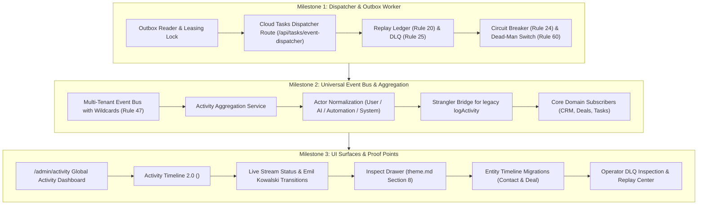

# SmartSapp Agentic & MCP Transformation: Phase 2 Master Implementation Plan
## Unified Event & Activity Backbone, Outbox Worker & Activity Timeline 2.0
### Enhanced with Exhaustive Conformance to `agents_mcp_rules.md` & Anti-Distortion Guarantees

**Version:** 2.0.0 (Updated with Rules Integration & Anti-Distortion Invariants)  
**Status:** PROPOSED FOR USER APPROVAL  
**Authors:** Senior Principal Systems & AI Agentic Architecture Engineer  
**Governing Documents & Foundations:**
- [`docs/agents_mcp/agents_mcp_roadmap.md`](file:///Users/josephaidoo/Desktop/Codes/vibe%20Coding/Onboarding-Dashbaord-main/docs/agents_mcp/agents_mcp_roadmap.md) (Phase 2, §1, §5, §36)
- [`docs/agents_mcp/agents_mcp_ui.md`](file:///Users/josephaidoo/Desktop/Codes/vibe%20Coding/Onboarding-Dashbaord-main/docs/agents_mcp/agents_mcp_ui.md) (§PHASE 2 — Event Backbone, Activity Timeline 2.0, `/admin/activity`)
- [`docs/agentic/06-event-taxonomy.md`](file:///Users/josephaidoo/Desktop/Codes/vibe%20Coding/Onboarding-Dashbaord-main/docs/agentic/06-event-taxonomy.md) (Canonical Event Taxonomy, OpenTelemetry Tracing, DLQ)
- [`docs/agentic/10-workflow-architecture.md`](file:///Users/josephaidoo/Desktop/Codes/vibe%20Coding/Onboarding-Dashbaord-main/docs/agentic/10-workflow-architecture.md) (Cloud Tasks Serverless Decoupling, Sagas & Compensation)
- [`docs/agentic/13-uiux-architecture.md`](file:///Users/josephaidoo/Desktop/Codes/vibe%20Coding/Onboarding-Dashbaord-main/docs/agentic/13-uiux-architecture.md) (Three-Zone Application Shell, Transparent Tool Cards, Mobile UX)
- [`docs/agents_mcp/agents_mcp_rules.md`](file:///Users/josephaidoo/Desktop/Codes/vibe%20Coding/Onboarding-Dashbaord-main/docs/agents_mcp/agents_mcp_rules.md) (The 10 Core Rules, 69 Agentic Rules, §66, §67 Gate, §68 Non-Negotiables, §69 SSOT)
- [`.agents/AGENTS.md`](file:///Users/josephaidoo/Desktop/Codes/vibe%20Coding/Onboarding-Dashbaord-main/.agents/AGENTS.md) (Modal Architecture §8, TagSelector SSOT, FieldsVariablesService SSOT)

---

## 1. Executive Summary & Strategic Architecture

### 1.1 The Phase 2 Mission
In Phase 0 and Phase 1, SmartSapp established the operational foundation:
- An inventory of 1,964 platform capabilities across 17 domains.
- A 15-step Canonical Execution Gateway (`executeCapability`) with strict typing, anti-IDOR checks, leasing locks, and model safety exception sanitization.
- 30 canonical capabilities deployed across Wave A, Wave B-1, and Wave B-2.
- In-place upgraded legacy MCP tools (`task.*`, `crm.*`, `deal.*`) routing through the unified registry.
- Baseline regression test suites maintaining 100% green coverage (69 test files, 729 tests).

However, currently the system operates largely as isolated point-in-time actions. While Step 15 of the capability pipeline writes `DomainEvent` records into the transactional outbox (`capability_outbox`), **there is no durable dispatcher to pull, broadcast, and aggregate these events across the platform**.

**Phase 2 transforms SmartSapp into an observable, reactive living system.**
Under Phase 2:
1. Every domain mutation generates a canonical, strongly-typed `DomainEvent`.
2. A transactional **Outbox Worker** and **Google Cloud Tasks Dispatcher** reliably process events with exponential backoff and replay protection.
3. An **Event Bus** fans out events to internal subscribers (automations, notifications, analytics).
4. An **Activity Aggregation Engine** denormalizes events into rich, human-readable activity streams.
5. The UI introduces **Activity Timeline 2.0** and the **Global Activity Dashboard (`/admin/activity`)** with dedicated filters for `Human`, `AI (Agent)`, `Automation`, and `System` actors.

```
┌────────────────────────────────────────────────────────────────────────────────────────┐
│                        CANONICAL EXECUTION GATEWAY (Phase 1 SSOT)                       │
│                                executeCapability()                                     │
│  01. Principal  │  02. Registry  │  03. Flags   │  04. Payload  │  05. Input Schema    │
│  06. Tenant     │  07. Resource  │  08. RBAC    │  09. Approval │  10. Idempotency     │
│  11. Version    │  12. Dry Run   │  13. Handler │  14. Output   │  15. Audit & Outbox  │
└───────────────────────────────────────────┬────────────────────────────────────────────┘
                                            │ Emits DomainEvent
                                            ▼
┌────────────────────────────────────────────────────────────────────────────────────────┐
│                   TRANSACTIONAL OUTBOX (Firestore: capability_outbox)                  │
└───────────────────────────────────────────┬────────────────────────────────────────────┘
                                            │ Polled & Leased
                                            ▼
┌────────────────────────────────────────────────────────────────────────────────────────┐
│               CLOUD TASKS OUTBOX WORKER & DISPATCHER (Milestone 1)                     │
│  • OIDC Auth Verification (Rule 51)      • Concurrency & Rate Limiter                  │
│  • Replay Ledger (Rule 20)               • Circuit Breaker (Rule 24)                   │
│  • Dead-Letter Queue (Rule 25)           • Dead-Man Emergency Pause (Rule 60)          │
└───────────────────────────────────────────┬────────────────────────────────────────────┘
                                            │ Dispatches
                                            ▼
┌────────────────────────────────────────────────────────────────────────────────────────┐
│                  UNIVERSAL MULTI-TENANT EVENT BUS (Milestone 2)                        │
│  • Exact & Wildcard Subscriptions        • OpenTelemetry Trace Propagation (Rule 39)  │
│  • Tenant Scope Barrier (Rule 47)        • Strangler Bridge for legacy logActivity     │
└──────────────────┬────────────────────────┴───────────────────────┬────────────────────┘
                   │                                                │
                   ▼                                                ▼
┌──────────────────────────────────────┐        ┌───────────────────────────────────────┐
│     DOMAIN EVENT SUBSCRIBERS         │        │    ACTIVITY AGGREGATION SERVICE       │
│  • CRM: Update contact last active   │        │  • Materializes to /activities        │
│  • Deals: Stage velocity metrics     │        │  • Actor Normalization (User/AI/Auto) │
│  • Automations: Reactive triggers    │        │  • Everyday UI English Summaries      │
└──────────────────────────────────────┘        └───────────────────┬───────────────────┘
                                                                    │
                                                                    ▼
┌────────────────────────────────────────────────────────────────────────────────────────┐
│                     UI SURFACES & PROOF POINTS (Milestone 3)                           │
│  • /admin/activity Global Activity Dashboard (Human / AI / Automation / System tabs)   │
│  • Activity Timeline 2.0 (<ActivityTimeline2 />) with Live Event Indicators            │
│  • Entity Page Proof Points (Contact Detail & Deal Drawer Timeline Migration)          │
│  • Dead-Letter Queue Operator Inspection Surface (/admin/activity/dlq)                │
└────────────────────────────────────────────────────────────────────────────────────────┘
```

---

## 2. Anti-Distortion & Preexisting Feature Preservation Analysis
*(In accordance with Core Rules 1, 2, 3, and 69 from `agents_mcp_rules.md`)*

### 2.1 Reflection Question 1: What could go wrong and how is it resolved?
1. **Risk of Event Delivery Throttling on Cloud Run:**
   - *Problem:* Cloud Run throttles container CPU outside of active HTTP requests. If event dispatch runs as in-process un-awaited background promises inside server actions, events will be lost when the container sleeps.
   - *Resolution:* Cloud Run Serverless Decoupling (`10-workflow-architecture.md`). Step 15 of the capability pipeline writes `DomainEvent` synchronously into Firestore `capability_outbox`. Dispatch is handled asynchronously by dedicated Google Cloud Tasks workers (`/api/tasks/event-dispatcher`) with independent CPU lifecycles and automatic retries.
2. **Risk of Duplicate Event Processing & Cascading Mutations:**
   - *Problem:* Network retries by Cloud Tasks could trigger the same event multiple times, causing double notifications, inflated metrics, or repeated automation triggers.
   - *Resolution:* Replay & Duplicate Delivery Protection (Rule 20). Every event dispatch executes against an atomic Firestore deduplication ledger (`event_executions/{idempotencyKey}`) using a test-and-set transaction. Once marked `completed`, retried deliveries return HTTP 200 OK immediately without re-executing downstream subscribers.
3. **Risk of Bulk Ingestion / Event Flooding:**
   - *Problem:* Bulk operations (e.g. importing 5,000 contacts or launching a campaign to 10,000 recipients) could emit a tsunami of events that exhausts Firestore read/write quotas or causes Cloud Tasks rate limit errors.
   - *Resolution:* Bounded Batch Processing (Rule 9). The outbox poller fetches bounded chunks (max 50 events per batch), uses atomic leases, and enforces concurrency quotas and circuit breakers (Rule 24).
4. **Risk of Downstream Subscriber Failures Crashing the Worker:**
   - *Problem:* An external webhook or failing email provider could throw unhandled exceptions, permanently blocking outbox progression.
   - *Resolution:* Dead-Letter Queues (Rule 25) & Circuit Breakers (Rule 24). Failing events are retried with exponential backoff up to 3 times. If unrecoverable, they are moved to `dead_letter_events` for operator inspection, allowing the outbox worker to proceed unimpeded.

### 2.2 Reflection Question 2: What other features will be affected and how are they preserved?
1. **Pre-Existing Automation Engine (`triggerAutomationProtocols`):**
   - *Current State:* `src/lib/activity-logger.ts` triggers automations when activities are written.
   - *Preservation Guarantee:* The legacy activity strangler bridge (`legacy-activity-strangler.ts`) intercepts legacy `logActivity` calls, wraps them into canonical `DomainEvent`s, routes them through the Event Bus, and ensures that `triggerAutomationProtocols` is invoked identically via `after()`. **Zero existing automations will stop firing.**
2. **Pre-Existing Admin Activities Audit (`/admin/activities`):**
   - *Current State:* Users audit system events at `/admin/activities` against the `activities` collection.
   - *Preservation Guarantee:* The new `ActivityRecordV2` schema maintains full backward-compatible aliases (`timestamp`, `userId`, `type`, `entityId`, `description`, `metadata`). The URL `/admin/activities` remains functional via a permanent alias/redirect to `/admin/activity`, and all legacy activity types continue to filter accurately.
3. **CRM Entities, Deals, Pipelines & Contacts:**
   - *Current State:* 30 canonical capabilities mutates CRM state and rely on optimistic UI updates.
   - *Preservation Guarantee:* Step 15 of `executeCapability` continues to record outbox entries without altering returned capability results (`CapabilityExecutionResult<T>`). UI responsiveness is unaffected because outbox dispatch is entirely decoupled from the synchronous mutation response.
4. **Messaging & Call Centre:**
   - *Current State:* Outbound messages use `FieldsVariablesService` and update delivery status.
   - *Preservation Guarantee:* Outbound messaging dispatches emit `message.sent` and `message.failed` domain events through the same backbone without altering delivery flows or double-brace template interpolation.

### 2.3 Reflection Question 3: How does it affect the Backoffice, and how can operators manage it without code?
1. **Emergency Event Dead-Man Controls (Rule 60):**
   - Operators can instantly halt all background event processing globally by toggling `system_settings/event_backbone.emergencyDisabled = true` in Firestore or via the Backoffice UI without requiring a code deployment or container restart.
2. **Three-Level Feature Flags (Rule 64):**
   - Event processing can be enabled or disabled at the Global, Organization, or Workspace level (`enable_event_backbone`). An anomalous workspace experiencing event loops can be isolated immediately without affecting other tenants.
3. **Dead-Letter Queue (DLQ) Command Center (Rules 25, 61, 62):**
   - Quarantined events in `dead_letter_events` are surfaced in a dedicated operator dashboard (`/admin/activity/dlq`). Operators can inspect the full failure diagnostic, view stack traces, edit failed payloads, and trigger 1-click retries.

---

## 3. Comprehensive `agents_mcp_rules.md` Conformance Matrix

| Rule # | Requirement | Phase 2 Implementation & Enforcement | Anti-Distortion & Safety Safeguard |
| :---: | :--- | :--- | :--- |
| **Rule 1** | Conform to best-practice skills | Emil Kowalski animations for timeline nodes; Next.js Server Components with dynamic boundaries; clean backend pipeline. | Maintains all existing application features without regressions. |
| **Rule 2** | Reflection on what could go wrong | Section 2.1 analyzes all failure modes (concurrency, leasing, event floods, retry storms). | Dual-write outbox, atomic lease locks, and exponential backoff prevent dropped or duplicate events. |
| **Rule 3** | Reflection on broken features & backoffice | Section 2.2 and 2.3 evaluate impact on CRM, Automations, Messaging, and Backoffice. | Strangler bridge ensures `triggerAutomationProtocols` and legacy `/admin/activities` continue without disruption. |
| **Rule 4** | Zero `any` or `any[]` typing policy | Strictly enforced via Zod v4 and explicit TypeScript interfaces for all event contracts, records, and bus handlers. | `unknown` narrowed immediately with schema validation at trust boundaries. |
| **Rule 5** | Staged deployments & verified indexes | Composite Firestore indexes for `capability_outbox`, `event_executions`, and `dead_letter_events` authored and tested in staging. | Production deployment requires explicit approval; zero unverified index deployment. |
| **Rule 6** | Dependency governance & Context7 MCP | Uses existing verified dependencies (`@google-cloud/tasks`, `date-fns`, `lucide-react`, `zod`). | Verified against current documentation before implementation. |
| **Rule 7** | Mobile-first & plain UI English | All buttons and filter tabs enforce `min-h-[44px]` touch targets; responsive drawers on screens $<768$px; plain English event summaries. | No technical jargon (e.g. "crm.contact.created") displayed in primary user views. |
| **Rule 8** | High security standards | OIDC token verification on Cloud Tasks endpoints; multi-tenant Anti-IDOR; sanitization of sensitive metadata. | Tenant isolation strictly verified; no cross-tenant leakage. |
| **Rule 9** | High load & bounded resource usage | Bounded outbox batch sizes (max 50 per fetch); rate limiting; circuit breaker protection. | Prevents memory exhaustion or Firestore quota spikes during bulk imports. |
| **Rule 10** | Inline architectural documentation | Every new file contains an `@fileOverview` detailing architecture, why it changed, caution areas, and testability references. | Preserves architectural knowledge for future maintainers. |
| **Rule 11** | Canonical capability & event naming | Events follow strict dot-delimited taxonomy: `<domain>.<entity>.<action>` (e.g. `crm.contact.created`). | Standardized across all 17 domains. |
| **Rule 13** | No anonymous fallback | Event dispatcher route rejects requests missing valid Google Cloud Tasks OIDC service account tokens. | Fails closed with 401 Unauthorized. |
| **Rule 16** | First-class Agent Identity | Event actor includes `{ type: 'user' \| 'agent' \| 'automation' \| 'system', id, displayName, agentRole, model }`. | Preserves agent attribution across all downstream audit logs. |
| **Rule 17** | Non-delegable action blocking | Events triggered by non-delegable operations are flagged and cannot be consumed by autonomous agents. | Human-in-the-loop governance preserved. |
| **Rule 18** | Optimistic concurrency & TOCTOU | Outbox reader uses atomic leasing locks (`leaseExpiresAt`) to prevent concurrent workers from claiming the same record. | Expired leases automatically reclaimed if worker crashes. |
| **Rule 19** | Deterministic idempotency derivation | Execution ledger derives deterministic SHA-256 keys from `organizationId + eventId`. | Guarantees identical hashing across retries. |
| **Rule 20** | Replay & duplicate delivery protection | Atomic reservation in `event_executions` ledger. Retried tasks with status `'completed'` return 200 OK immediately. | Prevents duplicate processing on Cloud Tasks retries. |
| **Rule 24** | Circuit breakers | Event bus subscribers wrapped in five-state circuit breakers (`CLOSED → DEGRADED → OPEN → HALF-OPEN`). | Downstream service outages do not crash container instances. |
| **Rule 25** | Dead-Letter Queue (DLQ) | Events failing after 3 exponential backoff retries are quarantined in `dead_letter_events`. | Surfaces in `/admin/activity/dlq` for operator inspection and replay. |
| **Rule 27** | Transactional outbox & Saga model | Step 15 of `executeCapability` writes to `capability_outbox` atomically. Dispatch is fully decoupled from user request. | Prevents dual-write inconsistencies between database and event stream. |
| **Rule 31** | Output schema validation | Domain event payloads validated against strict Zod schemas before being accepted by the Event Bus. | Poisoned or corrupted event payloads rejected. |
| **Rule 39** | OpenTelemetry tracing from Day One | Every event carries `correlationId`, `causationId`, and W3C `traceparent` headers. | Full distributed trace propagation across all asynchronous hops. |
| **Rule 40** | Audit log immutability | Activity records and event audit logs are strictly append-only. | Zero in-place mutation of historical activity records. |
| **Rule 41** | "Why did you do this?" audit trace | Activity cards link to parent causation events and agent reasoning context. | Operators can trace any agent action back to its triggering goal. |
| **Rule 47** | Multi-tenant Anti-IDOR | Events and activities partitioned by `organizationId` and `workspaceId`. Queries strictly enforce tenant filtering. | Zero cross-tenant data leakage. |
| **Rule 48/52**| Model safety & exception sanitization | Stack traces and database connection strings sanitized; only reference correlation IDs returned in user/model errors. | Zero internal infrastructure disclosure. |
| **Rule 51** | Server action & route security gate | `/api/tasks/event-dispatcher` verifies Google OIDC tokens (`cloud-tasks-oidc.ts`). | Public execution strictly blocked. |
| **Rule 60** | Emergency dead-man controls | `system_settings/event_backbone.emergencyDisabled` instantly halts all event dispatching without code redeployment. | Instant operational control during incidents. |
| **Rule 61/62**| Backoffice control plane & security center | DLQ and event throughput statistics integrated into Backoffice. | Full operator observability. |
| **Rule 64** | Three-level feature flags | `enable_event_backbone` evaluated at Global, Organization, and Workspace tiers. | Granular canary rollout control. |
| **Rule 67** | The Agent Implementation Gate | All 10 gate criteria satisfied before Phase 2 completion. | Documented in Section 7. |
| **Rule 68** | Five Non-Negotiable Invariants | Strict typing, tenant isolation, deterministic idempotency, fail-closed security, and baseline regression safety. | 100% enforced. |
| **Rule 69** | Master Layering Axiom | UI actions and AI agents emit identical `DomainEvent` objects through the same execution gateway. | Single Source of Truth architecture. |

---

## 4. UI/UX & Single Source of Truth Invariants (`.agents/AGENTS.md` & `theme.md`)

1. **Modal Architecture Standard (theme.md Section 8):**
   - **Surface & Geometry:** `border border-border/80 bg-card text-card-foreground shadow-2xl sm:rounded-2xl`. No hardcoded slate/dark classes (`bg-slate-900`, `border-slate-800`).
   - **Demarcated Header:** `<DialogHeader demarcated>` (`min-h-[52px] sm:min-h-[56px] border-b border-border/80 bg-muted/20 px-6 py-3.5`).
   - **Zero Raw Descriptions:** Descriptions routed through `<CardInfoTooltip text="..." />` alongside title with `<DialogDescription className="sr-only">`.
   - **Single-Circle Info Tooltip:** Overlay above dialogs at `z-[10050]`.
   - **Demarcated Footer:** `px-6 py-3.5 border-t border-border/80 bg-muted/15 flex flex-row items-center justify-end gap-2.5` with tactile buttons (`rounded-xl active:scale-[0.97]`).
2. **Fields & Variables SSOT:**
   - Any template or script token interpolation in event notifications routes through `FieldsVariablesService.resolveTemplateVariables`. Custom regex replacement is strictly prohibited.
3. **Tag Selection SSOT:**
   - Tagging operations triggered by events route exclusively through `<TagSelector>` and `TagAdapter`. Direct text inputs for tags are forbidden.
4. **Actionable Toast Navigation:**
   - All notifications prompting user action pass relative `actionConfig: { path: '/...', label: '...' }` with keyboard focus and tactile active states.
5. **Mobile & Accessibility:**
   - Minimum 44px $\times$ 44px touch targets on all interactive elements. Responsive drawer transitions on mobile viewports (< 768px). Live region announcements (`aria-live="polite"`).

---

## 5. Phase 2 Milestone Breakdown



---

## 6. Detailed Milestone Tasks & Deliverables

### Milestone 1: Transactional Event Dispatcher & Cloud Tasks Outbox Worker
*Enforces Rules 4, 9, 10, 13, 18, 19, 20, 24, 25, 27, 51, 60, 64*

#### Tasks:
- [ ] **Task 1.1: Event Dispatcher Contracts & Storage Readers**
  - Create `src/platform/events/contracts/event-dispatcher.contract.ts` with strict Zod schemas for batch dispatch inputs/outputs.
  - Create `src/platform/events/storage/outbox-reader.ts`: Query `capability_outbox` for `status == 'pending'` or expired `leaseExpiresAt < now`, apply atomic leasing locks (`status = 'processing'`, `leaseExpiresAt = now + 60s`).
- [ ] **Task 1.2: Replay Execution Ledger & Deduplication (Rule 20)**
  - Create `src/platform/events/storage/event-execution-ledger.ts`: Atomic test-and-set reservation in `event_executions/{idempotencyKey}`.
  - Return cached result if already completed; reject with 409 if lease active.
- [ ] **Task 1.3: Dead-Letter Queue & Exponential Backoff (Rule 25)**
  - Create `src/platform/events/storage/dead-letter-storage.ts`: Move events failing after 3 attempts into `dead_letter_events` with error diagnostic stack, timestamp, and metadata.
- [ ] **Task 1.4: Circuit Breaker & Emergency Dead-Man Controls (Rules 24, 60, 64)**
  - Create `src/platform/events/resilience/circuit-breaker.ts`: Five-state circuit breaker (`CLOSED`, `DEGRADED`, `OPEN`, `HALF-OPEN`).
  - Create `src/platform/events/resilience/event-dead-man.ts`: Checks `system_settings/event_backbone.emergencyDisabled`.
  - Create `src/platform/events/flags/event-flags.ts`: Evaluates `enable_event_backbone` across Global, Org, and Workspace tiers.
- [ ] **Task 1.5: Cloud Tasks Route Handler & Worker Execution (Rule 51)**
  - Create `src/app/api/tasks/event-dispatcher/route.ts`: Secure endpoint requiring Cloud Tasks OIDC token (`cloud-tasks-oidc.ts`).
  - Create `src/platform/tasks/event-dispatcher-worker.ts`: Orchestrates outbox reading, leasing, execution ledger, event bus dispatch, and dead-letter quarantine.
- [ ] **Task 1.6: Milestone 1 Verification Suite**
  - Author and pass unit and integration tests covering:
    - Outbox lease locking and expired lease recovery.
    - Replay suppression under duplicate Cloud Tasks delivery.
    - Dead-letter transition after 3 retries.
    - Circuit breaker tripping on downstream errors.
    - Emergency dead-man switch halting dispatch.
    - `pnpm typecheck` (0 errors) and `pnpm eslint` (0 errors, 0 warnings).

---

### Milestone 2: Reactive Universal Event Bus & Activity Aggregation Engine
*Enforces Rules 4, 7, 10, 11, 16, 27, 31, 39, 40, 41, 47, 69*

#### Tasks:
- [ ] **Task 2.1: Universal Multi-Tenant Event Bus (Rules 39, 47)**
  - Create `src/platform/events/event-bus.ts`: Universal in-process and async event router supporting exact types (`crm.contact.created`) and wildcards (`crm.*`, `deal.*`, `*`).
  - Enforce tenant isolation (Rule 47): Subscribers only receive events matching their workspace or organization scope.
  - Preserves OpenTelemetry headers (`traceparent`, `correlationId`, `causationId`) (Rule 39).
- [ ] **Task 2.2: Activity Aggregation & Materialization Service (Rules 7, 40)**
  - Create `src/platform/events/activity/activity-aggregation-service.ts`: Materializes canonical domain events into denormalized `ActivityRecordV2` documents in `workspaces/{workspaceId}/activities` and `organizations/{orgId}/activities`.
  - Append-only immutability (Rule 40).
- [ ] **Task 2.3: Actor Normalizer & Plain English Summary Engine (Rules 7, 16)**
  - Create `src/platform/events/activity/actor-normalizer.ts`: Standardizes actor metadata into `{ type: 'user' | 'agent' | 'automation' | 'system', id, displayName, avatarUrl, agentRole, model }`.
  - Create `src/platform/events/activity/summary-formatter.ts`: Translates structured event payloads into clear, everyday UI English summaries (Rule 7).
- [ ] **Task 2.4: Legacy Activity Strangler Bridge (Rule 69)**
  - Create `src/platform/events/adapters/legacy-activity-strangler.ts`: Bridges legacy `logActivity` in `src/lib/activity-logger.ts` to emit canonical `DomainEvent`s.
  - Ensures `triggerAutomationProtocols` continues to fire via `after()`, guaranteeing 100% backward compatibility for all existing workspace automations.
- [ ] **Task 2.5: Core Domain Event Subscribers (CRM, Deals, Tasks)**
  - Create `src/platform/events/subscribers/crm-activity-subscriber.ts`: Updates contact/entity last activity timestamps and interaction counters.
  - Create `src/platform/events/subscribers/deals-activity-subscriber.ts`: Updates pipeline stage velocity and duration metrics.
  - Create `src/platform/events/subscribers/tasks-activity-subscriber.ts`: Updates task status notifications.
- [ ] **Task 2.6: Milestone 2 Verification Suite**
  - Author and pass tests covering:
    - Pattern matching and wildcard event routing.
    - Cross-tenant event isolation barriers (Rule 47).
    - Activity materialization and English summary generation.
    - Legacy `logActivity` compatibility and automation continuity.
    - `pnpm typecheck` (0 errors) and `pnpm eslint` (0 errors, 0 warnings).

---

### Milestone 3: UI Surfaces & Proof Points (Activity Timeline 2.0 & Global Dashboard)
*Enforces Rules 1, 4, 7, 10, 41, 61, 62, Modal Architecture §8, TagSelector SSOT, FieldsVariablesService SSOT*

#### Tasks:
- [ ] **Task 3.1: Global Activity Dashboard (`/admin/activity`)**
  - Create `src/app/admin/activity/page.tsx`: Server component with SEO metadata, route security, and dynamic tenant context.
  - Create `src/app/admin/activity/GlobalActivityClient.tsx`:
    - Responsive Three-Zone layout (`13-uiux-architecture.md`).
    - Dedicated Actor Class Tabs: `All`, `Human (User)`, `AI (Agent)`, `Automation`, `System`.
    - Domain Filters: `All Domains`, `CRM & Contacts`, `Deals & Revenue`, `Tasks`, `Messaging`, `Portals`.
    - Date Range Picker and debounced search input.
    - Pulsing Live Stream Status Indicator (`Connected • Live Event Stream`).
  - Create `src/app/admin/activities/page.tsx`: Seamless alias/redirect forwarding `/admin/activities` to `/admin/activity`.
- [ ] **Task 3.2: Reusable Activity Timeline 2.0 Component (`<ActivityTimeline2 />`)**
  - Create `src/components/activity/ActivityTimeline2.tsx`: Reusable timeline feed component supporting full-width and embedded modes.
  - Create `src/components/activity/ActivityItem2.tsx`:
    - Visual actor badges (👤 Human: blue/neutral, 🤖 AI: purple with `Sparkles`, ⚡ Automation: amber with `Zap`, ⚙️ System: slate with `Settings2`).
    - Emil Kowalski animations: Smooth layout shifts, tactile tap active states (`active:scale-[0.97]`).
    - Minimum 44px touch targets (Rule 7).
- [ ] **Task 3.3: Inspect Drawer Adhering to Modal Architecture (`theme.md` §8)**
  - Create `src/components/activity/ActivityInspectDrawer.tsx`:
    - Geometry: `border border-border/80 bg-card text-card-foreground shadow-2xl sm:rounded-2xl`.
    - Header: `<DialogHeader demarcated>` with `<CardInfoTooltip text="..." />`.
    - Zero raw descriptions: uses screen-reader only `<DialogDescription className="sr-only">`.
    - Single-circle info tooltip button at `z-[10050]`.
    - Displays structured event payload, OpenTelemetry trace ID (`correlationId`), causation link, and execution latency.
- [ ] **Task 3.4: Dead-Letter Queue Operator Center (`/admin/activity/dlq`)**
  - Create `src/components/activity/DeadLetterQueueDrawer.tsx`: Operator surface for reviewing quarantined events in `dead_letter_events`.
  - 1-click "Retry Dispatch" operator action and "Discard" action.
  - Server action `replayDeadLetterEventAction` in `src/app/actions/activity-actions.ts`.
- [ ] **Task 3.5: Entity Detail Timeline Proof Point Migrations**
  - Upgrade Contact Detail page to consume `<ActivityTimeline2 entityId={contactId} />`.
  - Upgrade Deal Drawer timeline to consume `<ActivityTimeline2 dealId={dealId} />`.
- [ ] **Task 3.6: Milestone 3 Verification Suite & Full QA**
  - Author and pass UI test suite:
    - Global activity page rendering and actor tab filtering.
    - `<ActivityTimeline2 />` live stream rendering.
    - Inspect drawer modal architecture compliance (`theme.md` §8).
    - DLQ operator review and retry dispatch.
  - Run full baseline regression suite (`pnpm test:agentic:baseline`): 100% green.
  - `pnpm typecheck` (0 errors) and `pnpm eslint` (0 errors, 0 warnings).

---

## 7. The Agent Implementation Gate (§67) Checklist for Phase 2

Before Phase 2 is considered complete, all 10 criteria of the Implementation Gate must be certified:
1. **Architecture:** Uses canonical `DomainEvent` and `OutboxRecord`; zero direct un-audited state mutation; serverless decoupling via Cloud Tasks.
2. **Authority:** OIDC token authentication on worker routes; tenant isolation (Rule 47) verified; non-delegable action flags respected.
3. **Data Trust:** Inputs and event payloads strictly validated via Zod schemas; output validated before event broadcast.
4. **Execution:** Replay-proof via atomic `event_executions` ledger; max 3 retries before DLQ; circuit breaker protection.
5. **Protocol:** Stateless processing; OpenTelemetry traceparent and correlation IDs propagated across all event hops.
6. **Failure Modes:** Explicit error handling with dead-letter queue; emergency dead-man pause switch (Rule 60) operable without code.
7. **Security:** Anti-IDOR: cross-tenant event isolation verified; exception sanitization prevents credential/stack trace leakage.
8. **Operations:** Multi-tier feature flags (Rule 64); DLQ replay center for operators; zero code-deployment emergency controls.
9. **Testing:** Unit, integration, concurrency lease, replay, circuit breaker, and UI component tests pass with 100% green status.
10. **Migration:** Zero regression of preexisting features; automations engine (`triggerAutomationProtocols`) preserved; legacy `/admin/activities` aliased smoothly.

---

## 8. Definition of Done & Quality Gates

1. **Type Safety:** `pnpm typecheck` exits with code 0 repository-wide (zero `any` or `any[]`).
2. **Lint Cleanliness:** `pnpm eslint` reports 0 errors and 0 warnings across all Phase 2 files.
3. **Test Coverage:** All newly authored Phase 2 test suites pass (100% pass rate).
4. **Baseline Invariants:** `pnpm test:agentic:baseline` remains 100% green (69 test files, 729 tests).
5. **Architectural Review:** Senior Principal Systems & AI Agentic Architecture Reviewer formal sign-off.
