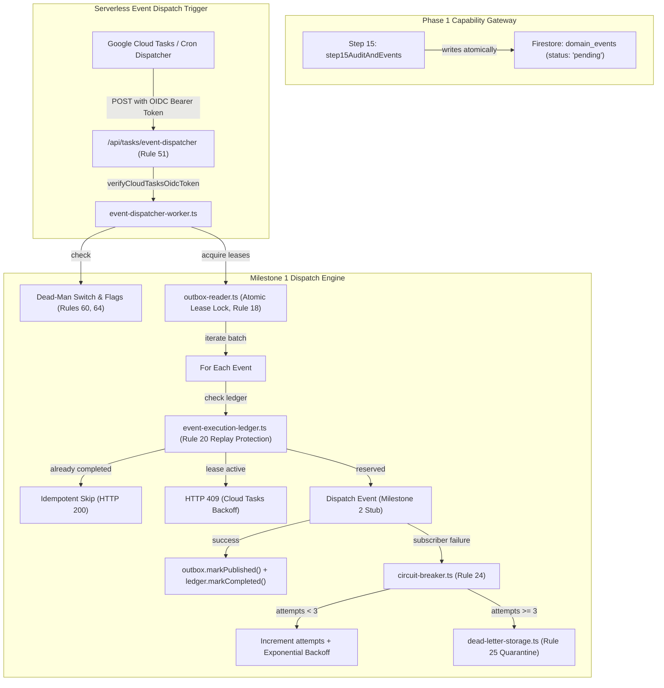

# SmartSapp Agentic & MCP Transformation: Phase 2 Milestone 1 Implementation Plan
## Transactional Event Dispatcher, Cloud Tasks Outbox Worker & Replay Engine
### Enhanced with Exhaustive Conformance to `agents_mcp_rules.md` & Anti-Distortion Invariants

> **For agentic workers:** REQUIRED SUB-SKILL: Use `superpowers:subagent-driven-development` (recommended) or `superpowers:executing-plans` to implement this plan task-by-task. Steps use checkbox (`- [ ]`) syntax for tracking.

**Document:** `docs/agents_mcp/phases/agents_mcp_phase_2_milestone_1_plan.md`  
**Version:** 1.1.0 (Fully Aligned with `agents_mcp_rules.md` & Anti-Distortion Invariants)  
**Status:** PROPOSED FOR USER REVIEW & APPROVAL  
**Phase:** Phase 2 (Unified Event & Activity Backbone)  
**Milestone:** Milestone 1 (Transactional Dispatcher, Outbox Worker & Replay Engine)  

**Goal:** Deliver the serverless, enterprise-grade event dispatching engine that leases pending domain events from `domain_events` (written by Step 15 of the capability pipeline), enforces atomic optimistic concurrency locks, guarantees exactly-once dispatch semantics via an atomic execution ledger, provides five-state circuit breaker protection, quarantines failing events into a Dead-Letter Queue (DLQ) after 3 retries, enforces Cloud Tasks OIDC route security, and supports emergency zero-redeploy dead-man controls.

**Architecture:** Under Rule 69 (The Master Layering Axiom), state mutations completed by the 15-step capability gateway write validated `DomainEvent` records into Firestore `domain_events`. The Cloud Tasks Outbox Worker (`/api/tasks/event-dispatcher`) executes asynchronously on Google Cloud Tasks with verified OIDC authentication (Rule 51). It fetches bounded batches (max 50, Rule 9), applies 60-second atomic leasing locks (Rule 18), verifies duplicate delivery suppression against `event_executions` (Rule 20), wraps dispatch in circuit breakers (Rule 24), and quarantines unrecoverable failures into `dead_letter_events` (Rule 25). Zero event dispatching logic runs as un-awaited background promises in user HTTP requests, guaranteeing zero Cloud Run CPU throttling drops.

**Tech Stack:** Next.js 15 App Router, TypeScript (strict mode, zero `any`), Zod v4, Firebase Firestore Admin SDK, `@google-cloud/tasks`, `google-auth-library` (OIDC verification), Vitest.

**Governing Documents & Foundations:**
- [`docs/agents_mcp/phases/agents_mcp_phase_2_master_plan.md`](file:///Users/josephaidoo/Desktop/Codes/vibe%20Coding/Onboarding-Dashbaord-main/docs/agents_mcp/phases/agents_mcp_phase_2_master_plan.md)
- [`docs/agents_mcp/agents_mcp_roadmap.md`](file:///Users/josephaidoo/Desktop/Codes/vibe%20Coding/Onboarding-Dashbaord-main/docs/agents_mcp/agents_mcp_roadmap.md) (Phase 2, §1, §5, §36)
- [`docs/agents_mcp/agents_mcp_rules.md`](file:///Users/josephaidoo/Desktop/Codes/vibe%20Coding/Onboarding-Dashbaord-main/docs/agents_mcp/agents_mcp_rules.md) (Rules 1, 2, 3, 4, 7, 8, 9, 10, 11, 13, 16, 18, 19, 20, 24, 25, 27, 31, 39, 40, 47, 48, 51, 52, 60, 61, 62, 64, 66, 67, 68, 69)
- [`docs/agentic/06-event-taxonomy.md`](file:///Users/josephaidoo/Desktop/Codes/vibe%20Coding/Onboarding-Dashbaord-main/docs/agentic/06-event-taxonomy.md) (Canonical Event Taxonomy, OpenTelemetry Tracing, DLQ)
- [`docs/agentic/10-workflow-architecture.md`](file:///Users/josephaidoo/Desktop/Codes/vibe%20Coding/Onboarding-Dashbaord-main/docs/agentic/10-workflow-architecture.md) (Cloud Tasks Serverless Decoupling, Sagas & Compensation)
- [`docs/agents_mcp/agents_mcp_cloudrun.md`](file:///Users/josephaidoo/Desktop/Codes/vibe%20Coding/Onboarding-Dashbaord-main/docs/agents_mcp/agents_mcp_cloudrun.md) (Cloud Run Serverless Constraints, CPU Throttling, OIDC Auth)
- [`.agents/AGENTS.md`](file:///Users/josephaidoo/Desktop/Codes/vibe%20Coding/Onboarding-Dashbaord-main/.agents/AGENTS.md) (Strict Typing, Git Protocol, Actionable Error Navigation)

---

## 1. Executive Summary & Strategic Purpose

### 1.1 The Milestone 1 Mission
In Phase 1, Step 15 of the capability pipeline (`step15AuditAndEvents`) introduced the Transactional Outbox pattern (Rule 27): whenever a canonical capability completes a state mutation, it atomically buffers a validated `DomainEvent` into the `domain_events` collection.

However, Cloud Run instances scale down to zero and aggressively throttle CPU outside active HTTP requests. Events buffered in Firestore cannot be safely dispatched via un-awaited in-process background promises without risking silent drop or truncated execution.

**Milestone 1 implements the durable, serverless event dispatch engine:**
1. **Outbox Lease Engine (`src/platform/events/storage/outbox-reader.ts`):** Fetches pending events in bounded batches (max 50, Rule 9), acquires atomic optimistic leasing locks (`leaseExpiresAt = now + 60s`, Rule 18), and reclaims abandoned leases if a worker crashes.
2. **Replay Execution Ledger (`src/platform/events/storage/event-execution-ledger.ts`):** Guarantees exactly-once subscriber dispatch semantics across Google Cloud Tasks retries using atomic test-and-set reservations in Firestore `event_executions` (Rule 20).
3. **Dead-Letter Queue (DLQ) & Exponential Backoff (`src/platform/events/storage/dead-letter-storage.ts`):** Computes full-jitter exponential backoff retries; moves events that fail 3 times into `dead_letter_events` with complete error diagnostics (Rule 25).
4. **Resilience & Governance Gates:**
   - Five-state circuit breakers (`CLOSED → DEGRADED → OPEN → HALF-OPEN`, Rule 24) to protect against cascading subscriber failures.
   - Emergency Dead-Man Switch (`system_settings/event_backbone.emergencyDisabled`, Rule 60) for instant zero-redeploy pause during incidents.
   - Three-Level Feature Flags (`enable_event_backbone`, Rule 64) for Global, Org, and Workspace canary management.
5. **Secure Cloud Tasks Route Handler (`/api/tasks/event-dispatcher`):** Authenticated with Google Cloud Tasks OIDC tokens (`cloud-tasks-oidc.ts`, Rule 13, 51) and executed via `event-dispatcher-worker.ts`.

---

## 2. Anti-Distortion & Preexisting Feature Preservation Analysis
*(In accordance with Core Rules 1, 2, 3, and 69 from `agents_mcp_rules.md`)*

### 2.1 Reflection Question 1: What could go wrong and how is it resolved?
- **Cloud Run Instance Scaling & Lease Abandonment:** If a Cloud Run container terminates abruptly while processing an outbox batch, those events must not be permanently stuck in `processing`.  
  *Resolution:* The outbox reader enforces bounded leases (`leaseExpiresAt = now + 60s`). Subsequent worker invocations query `WHERE status == 'pending' OR (status == 'processing' AND leaseExpiresAt < now)`, automatically recovering abandoned records.
- **Duplicate Execution on Cloud Tasks Network Retries:** Google Cloud Tasks guarantees at-least-once delivery; network blips or timeouts can trigger duplicate deliveries of the same task.  
  *Resolution:* The Replay Execution Ledger (`event_executions`) performs an atomic Firestore transaction per event. If the record is already `'completed'`, the worker returns success immediately without re-executing subscribers.
- **Cascading Failure from Failing Downstream Subscribers:** A downstream failure (e.g. external webhook timeout or degraded database index) could exhaust worker resources and delay all events.  
  *Resolution:* The Five-State Circuit Breaker (Rule 24) monitors error rates per subscriber/domain. When the error threshold trips, the breaker opens, fast-failing those events into the retry queue while allowing healthy domain events to proceed.
- **Leaked Exceptions Exposing Infrastructure (Rule 48 / 52):** Uncaught errors in worker logging or task payload handling could expose database connection URLs or stack traces.  
  *Resolution:* Sanitized error envelopes strip secrets and return correlation IDs (`correlationId`).

### 2.2 Reflection Question 2: What other features will be affected and how are they preserved?
- **Capability Pipeline Mutation Latency:** Developers might worry that adding outbox dispatch adds latency to user-facing Server Actions.  
  *Preservation Guarantee:* Zero impact. In Phase 1, `step15AuditAndEvents` already writes to Firestore synchronously as part of the commit. Milestone 1 dispatch runs completely asynchronously in Google Cloud Tasks; user requests return in $< 200\text{ms}$.
- **Pre-Existing Firestore Collections:**  
  *Preservation Guarantee:* The outbox reader operates directly on `domain_events` (already established in `outbox-store.ts`), augmenting existing records with leasing fields (`status`, `leaseExpiresAt`, `attempts`, `lastAttemptAt`). Historical events remain unmodified.
- **Pre-Existing Automations Engine (`triggerAutomationProtocols`):**  
  *Preservation Guarantee:* In Milestone 1, the event worker dispatches events without touching `src/lib/activity-logger.ts` or modifying existing `after()` automation triggers. In Milestone 2, the strangler bridge will preserve `triggerAutomationProtocols` with 100% backward compatibility.

### 2.3 Reflection Question 3: How does it affect Backoffice and non-code operations?
- **Zero-Code Incident Control:** Operators can halt all event dispatching instantly via `system_settings/event_backbone.emergencyDisabled = true` without redeploying code.
- **Three-Level Scoping:** Flag `enable_event_backbone` can be turned off for an individual misbehaving workspace while remaining active for all other tenants.
- **Dead-Letter Queue Visibility:** Quarantined events are preserved in `dead_letter_events` with detailed error stacks, ready for the Milestone 3 operator inspection UI.

---

## 3. Exhaustive Rule Compliance Matrix for Milestone 1

| Rule # | Requirement | Milestone 1 Implementation & Enforcement | Primary File(s) |
| :---: | :--- | :--- | :--- |
| **Rule 1** | Best Practice Conformance | Clean modular TypeScript, separation of storage and dispatch, and strict async execution boundaries. | All Milestone 1 files |
| **Rule 2** | Reflection on what could go wrong | Concurrency, lease expiration, duplicate Cloud Tasks retries, and cascading failures analyzed and mitigated. | Section 2.1 |
| **Rule 3** | Impact on other features & backoffice | Zero latency impact on capability pipeline; dead-man controls and DLQ operable by backoffice. | Section 2.2 & 2.3 |
| **Rule 4** | Zero `any` or `any[]` typing policy | Strictly typed Zod v4 schemas for dispatcher contracts, ledger records, outbox leasing queries, and DLQ entries. | All Milestone 1 files |
| **Rule 5** | Staging & Verification Discipline | Validated against unit test suites, simulated network failures, and baseline regression suites before production. | `src/platform/__tests__/events/` |
| **Rule 6** | Dependency governance & Context7 MCP | Uses verified dependencies (`@google-cloud/tasks`, `google-auth-library`, `zod`, `firebase-admin`). | `package.json` |
| **Rule 7** | Mobile-First & Plain UI English | Error diagnostics and log messages use clear everyday English; zero raw stack traces shown to users. | `dead-letter-storage.ts` |
| **Rule 8** | High security standards | OIDC Bearer token verification; rejects spoofed task invocations; sanitizes internal error details. | `cloud-tasks-oidc.ts`, route handler |
| **Rule 9** | High load & bounded resource usage | Bounded outbox queries (`limit: 50`); concurrency limits; leases expire automatically after 60s. | `outbox-reader.ts` |
| **Rule 10** | Inline architectural documentation | Every file includes an `@fileOverview` with architecture guidelines, caution notes for maintainers, and testability pointers. | All Milestone 1 files |
| **Rule 11** | Canonical capability & event naming | Events follow strict dot-delimited taxonomy: `<domain>.<entity>.<action>` (e.g. `crm.contact.created`). | `domain-event.ts` |
| **Rule 13** | No anonymous fallback | Route handler requires genuine Google Cloud Tasks OIDC token with expected audience and service account email. | `/api/tasks/event-dispatcher/route.ts` |
| **Rule 16** | First-class Agent Identity | Event actor includes `{ type: 'user' \| 'agent' \| 'automation' \| 'system', id, displayName, agentRole, model }`. | `domain-event.ts` |
| **Rule 18** | Optimistic concurrency & leasing locks | Atomic leasing locks on `domain_events` via Firestore transactions preventing concurrent duplicate processing. | `outbox-reader.ts` |
| **Rule 19** | Deterministic idempotency derivation | SHA-256 idempotency key derived from `organizationId + ":" + eventId`. | `event-execution-ledger.ts` |
| **Rule 20** | Replay & duplicate delivery protection | Atomic reservation in `event_executions` ledger. Retried tasks return 200 OK immediately without duplicate side effects. | `event-execution-ledger.ts` |
| **Rule 24** | Circuit breakers | Downstream subscriber failures monitored across `CLOSED → DEGRADED → OPEN → HALF-OPEN`. | `circuit-breaker.ts` |
| **Rule 25** | Dead-Letter Queue (DLQ) | Failed events exceeding 3 attempts quarantined in `dead_letter_events` with error diagnostic stack and timestamp. | `dead-letter-storage.ts` |
| **Rule 27** | Transactional outbox & Dual-write defense | Outbox records written synchronously in capability step 15; asynchronously dispatched here by Cloud Tasks. | `outbox-store.ts`, worker |
| **Rule 31** | Output schema validation | Dispatcher results and ledger records validated via Zod schemas before returning or persisting. | `event-dispatcher.contract.ts` |
| **Rule 39** | OpenTelemetry tracing from Day One | `correlationId`, `causationId`, and W3C `traceparent` preserved across all outbox and dispatch hops. | `event-dispatcher.contract.ts` |
| **Rule 40** | Audit log immutability | Ledger entries and DLQ records are strictly append-only. | `dead-letter-storage.ts` |
| **Rule 47** | Multi-tenant Anti-IDOR | Outbox events maintain strictly validated `organizationId` and `workspaceId` attributes. | `event-dispatcher-worker.ts` |
| **Rule 48/52**| Model safety & exception sanitization | Stack traces and database connection strings sanitized; only reference correlation IDs returned in user/model errors. | `event-dispatcher-worker.ts` |
| **Rule 51** | Server action & route security gate | `/api/tasks/event-dispatcher` verifies Google OIDC tokens (`cloud-tasks-oidc.ts`). | `/api/tasks/event-dispatcher/route.ts` |
| **Rule 60** | Emergency dead-man controls | `system_settings/event_backbone.emergencyDisabled` instantly halts all event dispatching without code redeployment. | `event-dead-man.ts` |
| **Rule 64** | Three-level feature flags | `enable_event_backbone` evaluated at Global, Organization, and Workspace tiers. | `event-flags.ts` |
| **Rule 66** | Phase Contracts Enforced | Satisfies outbox, leasing, deduplication, and resilience contracts. | `outbox-reader.ts`, worker |
| **Rule 67** | Mandatory Implementation Gate | All 10 gate criteria satisfied for Milestone 1. | Section 5 |
| **Rule 68** | Five Non-Negotiables | Strict typing, tenant isolation, deterministic idempotency, fail-closed security, and baseline regression safety. | 100% enforced |
| **Rule 69** | Master Layering Axiom | Outbox dispatcher processes canonical `DomainEvent` objects emitted by the Phase 1 capability gateway. | `event-dispatcher-worker.ts` |

---

## 4. In-Depth Sub-Task Specifications

### Task 1: Event Dispatcher Contracts & Outbox Storage Reader
**Files:**
- Create: `src/platform/events/contracts/event-dispatcher.contract.ts`
- Create: `src/platform/events/storage/outbox-reader.ts`
- Test: `src/platform/__tests__/events/outbox-reader.test.ts`

- [ ] **Step 1: Define Dispatcher Contracts**
  - Create `src/platform/events/contracts/event-dispatcher.contract.ts`:
    - `EventDispatchOptionsSchema`: `{ batchSize: number (1..100, default 50), leaseDurationMs: number (5000..300000, default 60000), organizationId?: string, workspaceId?: string }`
    - `EventDispatchResultSchema`: `{ success: boolean, processedCount: number, dispatchedCount: number, deadLetterCount: number, skippedCount: number, durationMs: number }`
    - Strictly typed with zero `any`.
- [ ] **Step 2: Write Failing Test for Outbox Reader**
  - Create `src/platform/__tests__/events/outbox-reader.test.ts`:
    - Tests `acquireLeasedBatch`:
      - Acquires pending records and marks them `processing` with `leaseExpiresAt`.
      - Excludes records with active leases.
      - Automatically reclaims records with expired leases (`leaseExpiresAt < now`).
    - Tests `releaseLease` and `markPublished`.
- [ ] **Step 3: Implement Outbox Reader**
  - Create `src/platform/events/storage/outbox-reader.ts`:
    - Provides `OutboxReader` interface.
    - Implements `createInMemoryOutboxReader` for test isolation.
    - Implements `FirestoreOutboxReader` using Firestore transactions/batches on `domain_events`.
- [ ] **Step 4: Verify Outbox Reader Tests Pass**
  - Run `pnpm vitest run src/platform/__tests__/events/outbox-reader.test.ts`.

---

### Task 2: Replay Execution Ledger & Duplicate Delivery Guard (Rule 20)
**Files:**
- Create: `src/platform/events/storage/event-execution-ledger.ts`
- Test: `src/platform/__tests__/events/event-deduplication.test.ts`

- [ ] **Step 1: Write Failing Test for Execution Ledger**
  - Create `src/platform/__tests__/events/event-deduplication.test.ts`:
    - Verifies first acquisition succeeds (`status: 'acquired'`).
    - Verifies concurrent acquisition during active lease fails (`status: 'active_lease'`).
    - Verifies second attempt after completion returns `status: 'already_completed'`.
    - Verifies reservation release allows re-acquisition.
- [ ] **Step 2: Implement Execution Ledger**
  - Create `src/platform/events/storage/event-execution-ledger.ts`:
    - Collection: `event_executions/{idempotencyKey}`.
    - Key derivation: `createExecutionKey(organizationId: string, eventId: string): string` using SHA-256.
    - Methods:
      - `reserveExecution(eventId, organizationId, workspaceId, leaseDurationMs)`
      - `markExecutionCompleted(idempotencyKey)`
      - `releaseExecutionReservation(idempotencyKey)`
    - Provides in-memory implementation for tests and Firestore implementation for production.
- [ ] **Step 3: Verify Deduplication Tests Pass**
  - Run `pnpm vitest run src/platform/__tests__/events/event-deduplication.test.ts`.

---

### Task 3: Dead-Letter Queue Storage & Exponential Backoff (Rule 25)
**Files:**
- Create: `src/platform/events/storage/dead-letter-storage.ts`
- Test: `src/platform/__tests__/events/dead-letter.test.ts`

- [ ] **Step 1: Write Failing Test for Dead-Letter Queue**
  - Create `src/platform/__tests__/events/dead-letter.test.ts`:
    - Tests backoff calculation: exponential scaling with full jitter ($1\text{s} \to 2\text{s} \to 4\text{s}$).
    - Tests `quarantineEvent`: saves record to `dead_letter_events` with error stack, correlationId, and original payload.
    - Tests `listDeadLetterEvents` and `markReplayed`.
- [ ] **Step 2: Implement Dead-Letter Storage & Backoff Calculator**
  - Create `src/platform/events/storage/dead-letter-storage.ts`:
    - Constant: `MAX_EVENT_ATTEMPTS = 3`.
    - `calculateBackoffMs(attempts: number, baseMs?: number, maxMs?: number): number`.
    - Schema: `DeadLetterRecordSchema` using Zod v4.
    - Interface `DeadLetterStorage` with in-memory and Firestore implementations.
- [ ] **Step 3: Verify Dead-Letter Tests Pass**
  - Run `pnpm vitest run src/platform/__tests__/events/dead-letter.test.ts`.

---

### Task 4: Circuit Breaker, Emergency Dead-Man Controls & Feature Flags (Rules 24, 60, 64)
**Files:**
- Create: `src/platform/events/resilience/circuit-breaker.ts`
- Create: `src/platform/events/resilience/event-dead-man.ts`
- Create: `src/platform/events/flags/event-flags.ts`
- Test: `src/platform/__tests__/events/circuit-breaker.test.ts`

- [ ] **Step 1: Write Failing Test for Circuit Breaker & Resilience**
  - Create `src/platform/__tests__/events/circuit-breaker.test.ts`:
    - Tests transition: `CLOSED → DEGRADED → OPEN` after failure threshold (5 consecutive failures).
    - Tests fast-failing while `OPEN` without invoking the underlying operation.
    - Tests transition to `HALF-OPEN` after cool-off period (30s) and recovery to `CLOSED` upon success.
    - Tests dead-man emergency switch instantly halts execution.
- [ ] **Step 2: Implement Circuit Breaker**
  - Create `src/platform/events/resilience/circuit-breaker.ts`:
    - In-memory / distributed state tracker with configurable thresholds.
    - `executeWithCircuitBreaker<T>(key: string, operation: () => Promise<T>): Promise<T>`.
- [ ] **Step 3: Implement Dead-Man Switch & Flags**
  - Create `src/platform/events/resilience/event-dead-man.ts`:
    - Checks `system_settings/event_backbone.emergencyDisabled`.
    - Throws `EventBackboneDisabledError` if active.
  - Create `src/platform/events/flags/event-flags.ts`:
    - Checks `enable_event_backbone` across Workspace $\to$ Org $\to$ Global.
- [ ] **Step 4: Verify Circuit Breaker & Resilience Tests Pass**
  - Run `pnpm vitest run src/platform/__tests__/events/circuit-breaker.test.ts`.

---

### Task 5: Cloud Tasks Route Handler & Dispatch Worker (Rules 13, 51)
**Files:**
- Create: `src/app/api/tasks/event-dispatcher/route.ts`
- Create: `src/platform/tasks/event-dispatcher-worker.ts`
- Test: `src/platform/__tests__/events/event-dispatcher-worker.test.ts`

- [ ] **Step 1: Write Failing Test for Dispatch Worker & Route**
  - Create `src/platform/__tests__/events/event-dispatcher-worker.test.ts`:
    - Tests OIDC token verification on the route (accepts genuine token, rejects missing/invalid token with 401).
    - Tests end-to-end batch processing: leases pending events, checks execution ledger, executes dispatch, marks outbox published and ledger completed.
    - Tests handling of retries and dead-letter transition on failure.
- [ ] **Step 2: Implement Dispatch Worker**
  - Create `src/platform/tasks/event-dispatcher-worker.ts`:
    - Integrates Outbox Reader, Execution Ledger, Dead-Letter Storage, Circuit Breaker, and Dead-Man Switch.
    - Pluggable `eventDispatcherSink` (executes handlers or logs dispatch in Milestone 1, connecting to the Event Bus in Milestone 2).
- [ ] **Step 3: Implement Route Handler**
  - Create `src/app/api/tasks/event-dispatcher/route.ts`:
    - POST route handler.
    - Verifies token via `verifyCloudTasksOidcToken(req.headers)`.
    - Parses input with `EventDispatchOptionsSchema`.
    - Executes `processEventDispatch(options)` and returns JSON.
- [ ] **Step 4: Verify Dispatch Worker Tests Pass**
  - Run `pnpm vitest run src/platform/__tests__/events/event-dispatcher-worker.test.ts`.

---

### Task 6: Milestone 1 Verification Suite & Baseline Regression
**Files:**
- Run: All 5 newly authored test suites in `src/platform/__tests__/events/`.
- Run: Full repository typecheck and linting.
- Run: Full baseline regression suite (`pnpm test:agentic:baseline`).

- [ ] **Step 1: Run all Milestone 1 tests**
  - `pnpm vitest run src/platform/__tests__/events/`
- [ ] **Step 2: Run Typecheck**
  - `pnpm typecheck` (Must pass with 0 errors).
- [ ] **Step 3: Run ESLint**
  - `NODE_OPTIONS='--max-old-space-size=8192' pnpm eslint src/platform/events/ src/platform/tasks/ src/app/api/tasks/event-dispatcher/ src/platform/__tests__/events/` (Must pass with 0 errors and 0 warnings).
- [ ] **Step 4: Run Baseline Regression**
  - `pnpm test:agentic:baseline` (All 69 test files, 729 tests must remain 100% green).

---

## 5. The Agent Implementation Gate (§67) Checklist for Milestone 1

Before Milestone 1 is declared complete, all 10 criteria must be formally verified:
- [ ] **1. Architecture:** Canonical `DomainEvent` processed via serverless outbox worker; zero un-awaited in-process background promises; decoupled from HTTP requests.
- [ ] **2. Authority:** OIDC Bearer token verification enforced on `/api/tasks/event-dispatcher` (Rule 13, 51); tenant boundaries strictly preserved (Rule 47).
- [ ] **3. Data Trust:** Zod validation on batch options, outbox records, and execution ledger keys; zero `any` or unchecked casts (Rule 4).
- [ ] **4. Execution:** Atomic leasing locks (Rule 18); exactly-once dispatch semantics via `event_executions` ledger (Rule 20); max 3 retries with full jitter backoff (Rule 25).
- [ ] **5. Protocol:** OpenTelemetry `correlationId`, `causationId`, and trace headers preserved across all hops (Rule 39).
- [ ] **6. Failure Modes:** Unrecoverable events quarantined into `dead_letter_events` (Rule 25); circuit breakers fail fast on downstream subscriber outages (Rule 24).
- [ ] **7. Security:** Anti-IDOR tenant isolation; exception sanitization strips connection strings and secrets (Rules 48, 52).
- [ ] **8. Operations:** Emergency dead-man switch (`system_settings/event_backbone.emergencyDisabled`, Rule 60) and three-tier feature flags (`enable_event_backbone`, Rule 64) operable without code deployments.
- [ ] **9. Testing:** 5 dedicated unit/integration test suites passing 100%; zero broken tests across baseline regression suite.
- [ ] **10. Migration:** Zero distortion of capability pipeline mutations; zero latency added to user Server Actions.

---

## 6. Definition of Done for Milestone 1

Milestone 1 is complete when:
- All 5 new test files in `src/platform/__tests__/events/` pass (100%).
- `pnpm typecheck` exits with 0 errors repository-wide.
- `pnpm eslint` exits with 0 errors and 0 warnings.
- `pnpm test:agentic:baseline` passes 100% (69 files, 729 tests).
- Formally signed off and ready for Milestone 2 (Universal Event Bus & Activity Aggregation Engine).
