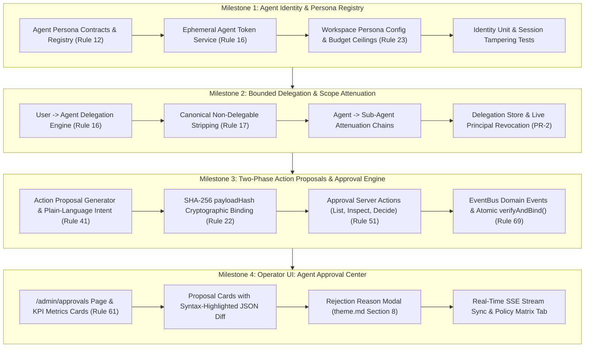

# SmartSapp Agentic & MCP Transformation: Phase 3 Master Implementation Plan
## Identity, Bounded Delegation, Two-Phase Approvals & Operator Approval Center
### Enhanced with Exhaustive Conformance to `agents_mcp_rules.md`, `agents_mcp_ui.md`, `theme.md` & Anti-Distortion Invariants

**Version:** 2.0.0 (Updated with Rules Integration & Anti-Distortion Invariants)  
**Status:** PROPOSED FOR USER APPROVAL  
**Authors:** Senior Principal Systems & AI Agentic Architecture Engineer  
**Governing Documents & Foundations:**
- [`docs/agents_mcp/agents_mcp_roadmap.md`](file:///Users/josephaidoo/Desktop/Codes/vibe%20Coding/Onboarding-Dashbaord-main/docs/agents_mcp/agents_mcp_roadmap.md) (Phase 3: Identity + Policy, §1, §4, §12, §36)
- [`docs/agents_mcp/agents_mcp_ui.md`](file:///Users/josephaidoo/Desktop/Codes/vibe%20Coding/Onboarding-Dashbaord-main/docs/agents_mcp/agents_mcp_ui.md) (§PHASE 3 — Policy/Identity, #12 Agent Approval Center, #38 Agent Policy Editor)
- [`docs/agentic/05-permission-model.md`](file:///Users/josephaidoo/Desktop/Codes/vibe%20Coding/Onboarding-Dashbaord-main/docs/agentic/05-permission-model.md) (The Effective Principal Formula, Risk Tiers L0–L4, Non-Delegable Actions, Approval Binding)
- [`docs/agentic/07-agent-model.md`](file:///Users/josephaidoo/Desktop/Codes/vibe%20Coding/Onboarding-Dashbaord-main/docs/agentic/07-agent-model.md) (Specialized Agent Personas, State Machine, Resource Budgets)
- [`docs/agentic/11-security-model.md`](file:///Users/josephaidoo/Desktop/Codes/vibe%20Coding/Onboarding-Dashbaord-main/docs/agentic/11-security-model.md) (Trust Boundary Matrix, Anti-IDOR, Model Distrust, SSRF Egress)
- [`docs/agentic/13-uiux-architecture.md`](file:///Users/josephaidoo/Desktop/Codes/vibe%20Coding/Onboarding-Dashbaord-main/docs/agentic/13-uiux-architecture.md) (Transparent Action Cards, Approval Workflows, Mobile UX)
- [`docs/agents_mcp/agents_mcp_rules.md`](file:///Users/josephaidoo/Desktop/Codes/vibe%20Coding/Onboarding-Dashbaord-main/docs/agents_mcp/agents_mcp_rules.md) (The 10 Core Rules, 69 Agentic Rules, §66, §67 Gate, §68 Non-Negotiables, §69 SSOT)
- [`.agents/AGENTS.md`](file:///Users/josephaidoo/Desktop/Codes/vibe%20Coding/Onboarding-Dashbaord-main/.agents/AGENTS.md) & [`theme.md`](file:///Users/josephaidoo/Desktop/Codes/vibe%20Coding/Onboarding-Dashbaord-main/theme.md) (Standardized Modal Architecture §8, TagSelector SSOT, FieldsVariablesService SSOT)

---

## 1. Executive Summary & Strategic Architecture

### 1.1 The Phase 3 Mission
In Phase 0, 1, and 2, SmartSapp delivered the bedrock of the agent platform:
1. **Phase 0:** Complete inventory of 1,964 capabilities across 17 domains, baseline regression suites, and Cloud Tasks authentication hardening.
2. **Phase 1:** The 15-step Canonical Execution Gateway (`executeCapability`), Unified Capability Registry, 6 core domain adapters, idempotency replay, TOCTOU versioning, SSRF egress protection, and client invocation framework.
3. **Phase 2:** The Unified Event & Activity Backbone — Transactional Outbox, Cloud Tasks dispatcher worker, Dead-Letter Queue (DLQ), Universal Reactive Event Bus, SSE real-time streaming, Activity Timeline 2.0, and Operator Activity Console (`/admin/activity`).

However, automated agents and sub-agents currently lack a **formalized, tamper-proof identity, bounded delegation lifecycle, and human-in-the-loop approval center**. 

**Phase 3 establishes the Trust, Policy & Authorization boundary for the entire SmartSapp agentic platform.**
Under Phase 3:
1. Agents **never** run as unrestricted super-users or root. Every agent invocation executes under a strictly bounded `AgentPrincipal` whose effective authority is mathematically attenuated:
   $$\text{Effective Authority} = \text{User Authority} \cap \text{Agent Persona Authority} \cap \text{Workspace Scope} \cap \text{Tool Scope} \cap \text{Active Policy}$$
2. Delegated authority is strictly downward-attenuating: an agent or sub-agent can never gain permissions beyond the authorizing user's current RBAC role, and non-delegable actions (`app:system_admin`, `rbac:workforce.roles.edit`, etc.) are stripped unconditionally (Rule 17).
3. Any high-risk operation (`L3_EXTERNAL_COMMUNICATION_FINANCE`, `L4_PRIVILEGED_DESTRUCTIVE`, or `requiresHumanApproval: true`) triggers a **Two-Phase Action Proposal**. The action is halted, cryptographically bound to a SHA-256 payload hash, and dispatched as a domain event to the operator.
4. Operators review, inspect blast radiuses, and approve or reject actions in real time via the **Agent Approval Center (`/admin/approvals`)**, complete with live SSE notifications and modals adhering to `theme.md` Section 8.
5. Once approved, the worker atomically verifies the approval, binds it in a transaction to prevent replay, verifies that the user is still active and authorized (PR-2 `LivePrincipalCheck`), and executes the operation.

```
┌──────────────────────────────────────────────────────────────────────────────────────────────────┐
│                                   AUTHENTICATED OPERATOR / USER                                  │
│                                (Clerk Session + D6 RBAC Role Permissions)                        │
└────────────────────────────────────────────────┬─────────────────────────────────────────────────┘
                                                 │ 1. Invokes or delegates to agent
                                                 ▼
┌──────────────────────────────────────────────────────────────────────────────────────────────────┐
│                             BOUNDED DELEGATION ENGINE (Milestone 2)                              │
│                                                                                                  │
│   Effective Scopes = User Scopes ∩ Persona Allowed Scopes ∩ Workspace Boundary - Non-Delegables  │
│                                                                                                  │
│   • Downward Attenuation (Rule 16)               • Canonical Non-Delegable Strip (Rule 17)       │
│   • Multi-Tenant Organization Boundary           • Live User Snapshot & Invalidation Token       │
└────────────────────────────────────────────────┬─────────────────────────────────────────────────┘
                                                 │ 2. Issues Ephemeral AgentPrincipal
                                                 ▼
┌──────────────────────────────────────────────────────────────────────────────────────────────────┐
│                             AGENT PERSONA REGISTRY (Milestone 1)                                 │
│                                                                                                  │
│   • CRM Researcher (`crm_researcher`)            • Portal Guide (`portal_guide`)                 │
│   • Autonomous SDR (`lead_sdr`)                  • Meeting Prep (`meeting_prep`)                 │
│   • Deal Strategy Coach (`deal_coach`)           • Supervisor Agent (`supervisor`)               │
└────────────────────────────────────────────────┬─────────────────────────────────────────────────┘
                                                 │ 3. Executes step via Gateway
                                                 ▼
┌──────────────────────────────────────────────────────────────────────────────────────────────────┐
│                            CANONICAL EXECUTION GATEWAY (Phase 1 SSOT)                            │
│                                       executeCapability()                                        │
│                                                                                                  │
│   Step 08: evaluatePrincipalAuthority()  ──►  Is action L3 Outbound or L4 Destructive?          │
└───────────────────────┬──────────────────────────────────────────────────┬───────────────────────┘
                        │ [L0 Read / L2 Mutation (Authorized)]             │ [L3/L4 & Approval Required]
                        ▼                                                  ▼
         ┌──────────────────────────────┐          ┌───────────────────────────────────────────────┐
         │     IMMEDIATE EXECUTION      │          │   TWO-PHASE PROPOSAL ENGINE (Milestone 3)     │
         │  • Idempotency Check         │          │  • Computes canonical SHA-256 payloadHash     │
         │  • TOCTOU Version Check      │          │  • Generates ActionProposal (WHAT/WHY/WHO)    │
         │  • Domain Mutation           │          │  • Writes to Firestore capability_approvals   │
         │  • Audit & Outbox Event      │          │  • Emits 'policy.approval.requested' Event    │
         └──────────────────────────────┘          └───────────────────────┬───────────────────────┘
                                                                           │
                                                                           │ Dispatches via PlatformEventBus
                                                                           ▼
┌──────────────────────────────────────────────────────────────────────────────────────────────────┐
│                          REAL-TIME SSE NOTIFICATION STREAM & EVENT BUS                           │
│                                 GET /api/events/stream                                           │
└────────────────────────────────────────────────┬─────────────────────────────────────────────────┘
                                                 │
                                                 ▼
┌──────────────────────────────────────────────────────────────────────────────────────────────────┐
│                        AGENT APPROVAL CENTER UI (/admin/approvals) (Milestone 4)                 │
│                                                                                                  │
│  • KPI Metrics Cards (Pending, Approved 24h, Blocked/Rejected, High Blast Radius)                │
│  • Action Proposal Cards (Agent Persona, What, Why, Affected Resources, Blast Radius, JSON Diff) │
│  • Tactile Action Buttons (One-Click Approve / Reject Modal with theme.md Section 8)             │
│  • Live Real-Time Badge & Automatic Card Removal via SSE Stream                                  │
└────────────────────────────────────────────────┬─────────────────────────────────────────────────┘
                                                 │ Operator Clicks "Approve"
                                                 ▼
┌──────────────────────────────────────────────────────────────────────────────────────────────────┐
│                         APPROVAL DECISIONING & BINDING (Milestones 3 & 4)                        │
│                                                                                                  │
│  1. Server Action: decideApprovalAction(approvalId, 'approved') updates record                   │
│  2. Emits 'policy.approval.granted' domain event                                                 │
│  3. Agent Worker checks LivePrincipalCheck (User active, in org, has workspace access)           │
│  4. Atomic verifyAndBind() in Firestore transaction (marks 'bound', locks toolInvocationId)      │
│  5. Capability executes cleanly; audit trail records approver, execution ID, and payload hash    │
└──────────────────────────────────────────────────────────────────────────────────────────────────┘
```

---

## 2. Anti-Distortion & Preexisting Feature Preservation Analysis
*(In accordance with Core Rules 1, 2, 3, 10, and 69 from `agents_mcp_rules.md`)*

### 2.1 Reflection Question 1: What could go wrong and how is it resolved?
1. **Time-of-Check to Time-of-Use (TOCTOU) Payload Tampering:**
   - *Problem:* An operator approves a proposal based on visual arguments, but the agent runtime or a malicious actor alters the payload arguments (e.g. changing the recipient email or dollar amount) before actual execution.
   - *Resolution:* Cryptographic Payload Hash Binding (Rule 22). Every approval record stores a SHA-256 hash of the canonically sorted payload JSON (`payloadHash`). When the execution worker runs `ApprovalVerifier.verifyAndBind`, it recomputes the SHA-256 hash of the exact execution arguments. If even a single byte differs, the execution engine fails closed with `APPROVAL_INVALID`.
2. **Privilege Escalation via Sub-Agent Delegation Chains:**
   - *Problem:* A standard user creates a supervisor agent, which then attempts to spawn a sub-agent with administrative or billing capabilities (`app:system_admin`, `admin.grant_permission`).
   - *Resolution:* Strict Downward Scope Attenuation & Non-Delegable Action Stripping (Rules 16 & 17). At every hop in the delegation chain, `delegation-service.ts` computes the set intersection of parent scopes and child scopes. Non-delegable D6 coordinates (from `NON_DELEGABLE_ACTIONS`) are unconditionally stripped. An agent can never execute or delegate a permission its author does not possess.
3. **Stale Approvals & Replay Attacks:**
   - *Problem:* A previously approved action is reused by an agent in a subsequent step or loop, executing unintended repeated mutations (e.g. double-charging a customer or re-sending an external message).
   - *Resolution:* Single-Use Atomic Binding & TTL Expiration (Rule 22). Approvals have a strict `expiresAt` timestamp (default 24 hours). Furthermore, `verifyAndBind` runs in a Firestore transaction that validates `status === 'approved'` and immediately updates `status = 'bound'`, binding it uniquely to the specific `toolInvocationId`. Any subsequent attempt to use the same approval fails immediately with `APPROVAL_ALREADY_BOUND`.
4. **Revoked User / Zombie Delegations:**
   - *Problem:* A workspace admin delegates authority to an agent that runs background jobs over several days. The admin is later terminated or demoted to a read-only role, but their background agent continues executing privileged mutations.
   - *Resolution:* Live Principal Validation (PR-2 `LivePrincipalCheck`). The agent step worker re-checks the authorizing user live against Firestore before executing: confirming the user exists, is not disabled/deleted, belongs to the target organization, and still possesses a role granting access to the target workspace. If revoked, the execution fails closed immediately with `CALLER_UNAUTHORIZED`.
5. **UI / UX Modal Distortions & Accessibility Violations:**
   - *Problem:* Approval dialogs render raw descriptions, lack keyboard accessibility, use hardcoded dark colors (`bg-slate-900`), or fail on mobile viewports.
   - *Resolution:* Strict Conformance to `theme.md` Section 8. All approval inspection and rejection modals utilize `<DialogHeader demarcated>`, route descriptive guidance through `<CardInfoTooltip text="..." />` alongside the title (with `<DialogDescription className="sr-only">`), provide single-circle info icons (`z-[10050]`), and have demarcated footers with tactile `rounded-xl active:scale-[0.97]` buttons.

---

## 3. Governing Rules & Phase 3 Invariants Matrix (Rules 1–69)

The implementation strictly satisfies the rules defined in `docs/agents_mcp/agents_mcp_rules.md`:

| Rule # | Name / Principle | Phase 3 Architectural Invariant | Anti-Distortion & Safeguard Guarantee |
| :--- | :--- | :--- | :--- |
| **Rule 1** | Single Capability Layer | All agent actions invoke canonical capabilities in `CapabilityRegistry`. | No agent calls raw internal services or direct Firestore mutations. |
| **Rule 2** | No Blind Rewrites | Preserves existing D6 RBAC vocabularies, `ApprovalStore`, and `LivePrincipalCheck`. | Zero regressions across preexisting 1,964 capabilities. |
| **Rule 3** | Single Source of Truth | Permissions validated exclusively via `parsePermissionRef` (D6). | Zero second parallel permission registries. |
| **Rule 4** | Multi-Tenant Isolation | Every `AgentPrincipal`, `ActionProposal`, and delegation requires `organizationId` and `workspaceId`. | Cross-tenant leakage impossible; tenant IDs validated at boundary. |
| **Rule 10** | Architecture Documentation | Every file authored includes clear inline documentation explaining what changed, why, caution areas, and testability. | Maintainers can safely evolve the code without introducing subtle regressions. |
| **Rule 12** | Explicit Risk Classes | Capabilities strictly mapped to `L0_READ`, `L1_INTERNAL_DRAFT`, `L2_STATE_MUTATION`, `L3_EXTERNAL_COMMUNICATION_FINANCE`, `L4_PRIVILEGED_DESTRUCTIVE`. | Ambiguous risk levels prohibited. `L3` and `L4` mandate human review. |
| **Rule 13** | Trust Boundary Matrix | Data from models is treated as `MODEL_PROPOSAL`. Data from external tools is treated as `UNTRUSTED_TOOL_OUTPUT`. | Unsanitized model output never touches execution handlers directly. |
| **Rule 16** | Bounded Delegation & Identity | Pure formula: Effective = User ∩ Agent ∩ Workspace ∩ Tool ∩ Policy. No `*` wildcard for agents. | Agents cannot execute arbitrary capabilities. Sub-agents attenuated downwards. |
| **Rule 17** | Non-Delegable Actions | Hardcoded coordinate list (`NON_DELEGABLE_ACTIONS`): system admin, user switch, role editing, webhooks, system settings, billing setup. | Automated or delegated agents strictly blocked from privileged admin operations. |
| **Rule 21** | Two-Phase Action Model | Proposal generated in Phase 1 $\rightarrow$ Persisted and broadcast $\rightarrow$ Executed only in Phase 2 after human verification. | Blast radius contained; unintended or destructive side effects blocked. |
| **Rule 22** | Cryptographic Approval Binding | Approval bound to `capabilityId`, `version`, `organizationId`, `workspaceId`, `toolInvocationId`, and `payloadHash`. Anti-self-approval enforced. | Parameter tampering detected; replay attacks rejected; agents cannot self-approve. |
| **Rule 23** | Execution Budgets | Agent personas define strict ceilings on tokens, tool calls, and run durations. | Infinite loops and resource exhaustion prevented. |
| **Rule 38** | Real-Time SSE Streams | `/api/events/stream` broadcasts `policy.approval.requested/granted/rejected` events. | Operators receive instant live updates without polling. |
| **Rule 40** | Audit Log Immutability | Approval decisions and delegation records are strictly append-only in Firestore. | Historical approval audit trails cannot be erased or altered. |
| **Rule 41** | "Why did you do this?" Trace | Every proposal includes human-readable WHAT, WHY, AFFECTED RESOURCES, and BLAST RADIUS. | Operators understand agent intent before approving. |
| **Rule 47** | Never Trust the Model | Proposed payload arguments are validated against strict Zod schemas before being accepted into proposals. | Poisoned or malformed LLM outputs rejected before reaching human inbox. |
| **Rule 48** | Never Trust the Tool Output | Responses from tools are validated via output schemas before reaching agent memory. | Tool prompt injections blocked. |
| **Rule 51** | Server Action Security Gates | Approval decision actions verify caller session, org membership, and required D6 permission. | Unauthenticated or unauthorized approval attempts rejected with 403. |
| **Rule 60** | Emergency Dead-Man Controls | `system_settings/agent_governance.emergencyPause` instantly halts all agent delegations and executions without redeployment. | Instant operational kill-switch during incidents. |
| **Rule 61/62**| Operator Control Plane | Dedicated `/admin/approvals` UI surface with KPI metrics, proposal inspection, and policy controls. | Total operator visibility and governance over agent workforce. |
| **Rule 64** | Three-Level Feature Flags | `enable_agent_governance` evaluated at Global, Organization, and Workspace tiers. | Granular canary rollout control. |
| **Rule 66** | Phase 3 Contract Additions | Enforces Agent Identity, Delegation, Non-Delegables, Approval Binding, and TOCTOU Protection. | Core architectural gates met before Phase 4. |
| **Rule 67** | Implementation Gates | Requires 100% passing tests, 0 TypeScript errors (`pnpm typecheck`), and 0 lint errors (`pnpm lint`). | No broken builds permitted. |
| **Rule 68** | Five Non-Negotiables | Strict typing, tenant isolation, deterministic idempotency, fail-closed security, baseline regression safety. | 100% enforced across all Phase 3 modules. |
| **Rule 69** | Canonical Execution SSOT | All capability invocations route strictly through `executeCapability`. | Single Source of Truth architecture preserved. |

---

## 4. UI/UX & Single Source of Truth Invariants (`.agents/AGENTS.md` & `theme.md`)

1. **Standardized Modal Architecture (`theme.md` Section 8):**
   - **Surface & Geometry:** `border border-border/80 bg-card text-card-foreground shadow-2xl sm:rounded-2xl`. No hardcoded slate/dark classes (`bg-slate-900`, `border-slate-800`).
   - **Demarcated Header:** `<DialogHeader demarcated>` (`min-h-[52px] sm:min-h-[56px] border-b border-border/80 bg-muted/20 px-6 py-3.5 sm:py-4`).
   - **Zero Raw Descriptions:** Descriptions routed through `<CardInfoTooltip text="..." />` alongside title with `<DialogDescription className="sr-only">`.
   - **Single-Circle Info Tooltip:** Overlay above dialogs at `z-[10050]`.
   - **Demarcated Footer:** `px-6 py-3.5 border-t border-border/80 bg-muted/15 flex flex-row items-center justify-end gap-2.5` with tactile buttons (`rounded-xl active:scale-[0.97]`).
2. **Fields & Variables SSOT:**
   - Any template or script token interpolation in action proposals routes through `FieldsVariablesService.resolveTemplateVariables`. Custom regex replacement is strictly prohibited.
3. **Tag Selection SSOT:**
   - Tagging operations triggered by agents or proposals route exclusively through `<TagSelector>` and `TagAdapter`. Direct text inputs for tags are forbidden.
4. **Actionable Toast Navigation:**
   - All notifications prompting user action pass relative `actionConfig: { path: '/admin/approvals', label: 'Review Approvals' }` with keyboard focus and tactile active states.
5. **Mobile & Accessibility:**
   - Minimum 44px $\times$ 44px touch targets on all interactive elements. Responsive drawer transitions on mobile viewports (< 768px). Live region announcements (`aria-live="polite"`).

---

## 5. Phase 3 Milestone Breakdown



---

## 6. Detailed Milestone Tasks & Deliverables

### Milestone 1: Agent Identity, Persona Profiles & Ephemeral Session Tokens
*Enforces Rules 1, 4, 10, 12, 16, 23, 66, 68*

#### Tasks:
- [ ] **Task 1.1: Canonical Persona Contracts & Data Types**
  - Create `src/platform/identity/agent-persona-types.ts`: Strictly typed contracts for specialized personas (`crm_researcher`, `lead_sdr`, `deal_coach`, `portal_guide`, `meeting_prep`, `supervisor`).
  - Define persona metadata: ID, display name, description, avatar icon, allowed domain capabilities, maximum autonomous risk tier (e.g. `L0_READ` or `L2_STATE_MUTATION`), and default resource budgets (max tokens: 50,000; max tool calls: 15; max duration: 120s).
- [ ] **Task 1.2: Central Agent Persona Registry**
  - Create `src/platform/identity/agent-registry.ts`: Single source of truth for built-in and workspace-configured agent personas.
  - Implement `getPersona(personaId)`, `listPersonas()`, and `validatePersonaCapability(personaId, capabilityId)`.
  - Support workspace-level overrides from Firestore (`workspace_agent_configs`).
- [ ] **Task 1.3: Ephemeral Agent Token & Session Minting**
  - Create `src/platform/identity/agent-token-service.ts`: Mints signed, workspace-bounded `AgentPrincipal` session records.
  - Generates unique `agentSessionId`, attaches `personaId`, sets `expiresAt` (default 1 hour), and signs with HMAC-SHA256.
  - Implements `verifyAgentPrincipalToken(token)` ensuring principal parameters have not been tampered with.
- [ ] **Task 1.4: Milestone 1 Verification Suite**
  - Create `src/platform/__tests__/identity/agent-identity.test.ts`:
    - Tests persona definitions and domain restrictions.
    - Tests token minting and signature verification.
    - Tests that an agent cannot elevate its own risk ceiling or modify its persona ID.
    - Runs `pnpm typecheck` (0 errors) and `pnpm lint` (0 errors).

---

### Milestone 2: Bounded Delegation Engine, Scope Attenuation & Non-Delegable Enforcement
*Enforces Rules 1, 3, 4, 16, 17, 66, 68*

#### Tasks:
- [ ] **Task 2.1: Bounded Delegation Service & Scope Intersection (Rule 16)**
  - Create `src/platform/policy/delegation-service.ts`: Derives delegated agent permissions from the authorizing user's session:
    $$\text{Delegated Scopes} = \text{User Effective Permissions} \cap \text{Persona Allowed Scopes} \cap \text{Delegation Limit}$$
  - Enforces downward attenuation: an agent can never possess permissions not held by the author.
  - Forbids wildcards (`*`) for automated agents.
- [ ] **Task 2.2: Canonical Non-Delegable Coordinate Stripping (Rule 17)**
  - Integrate `NON_DELEGABLE_ACTIONS` from `risk-levels.ts`.
  - Automatically filters out all 15 canonical non-delegable permissions (e.g. `app:system_admin`, `admin.grant_permission`, `rbac:workforce.roles.edit`, `billing.change_owner`).
  - Unit tests verify that even if an administrative user delegates with `*`, non-delegables are strictly stripped.
- [ ] **Task 2.3: Agent-to-Agent Sub-Delegation & Provenance Chains**
  - Implement `delegateToSubAgent(parentPrincipal, childPersonaId)`:
    $$\text{Sub-Agent Scopes} = \text{Parent Scopes} \cap \text{Child Persona Allowed Scopes}$$
  - Preserves immutable provenance chain in `delegatedBy` (e.g. `user_1 -> supervisor_1 -> sdr_1`).
- [ ] **Task 2.4: Delegation Grant Storage & Instant Revocation**
  - Create `src/platform/policy/delegation-store.ts`: Stores active delegation grants in Firestore `agent_delegations`.
  - Implement `revokeDelegation(delegationId)`: Immediately invalidates the delegation.
  - Wire into `LivePrincipalCheck`: if the authorizing user's account is disabled, deleted, or their role changes, all active delegations fail closed immediately.
- [ ] **Task 2.5: Milestone 2 Verification Suite**
  - Create `src/platform/__tests__/policy/delegation.test.ts`:
    - Tests scope attenuation across multi-level delegation chains.
    - Tests unconditional stripping of non-delegable permissions.
    - Tests instant revocation and fail-closed live principal revocation.
    - Runs `pnpm typecheck` (0 errors) and `pnpm lint` (0 errors).

---

### Milestone 3: Two-Phase Action Proposals & Cryptographic Approval Lifecycle Engine
*Enforces Rules 3, 12, 13, 21, 22, 40, 41, 47, 51, 60, 66, 69*

#### Tasks:
- [ ] **Task 3.1: Canonical Action Proposal Generator (Rule 21 & 41)**
  - Create `src/platform/policy/approval-proposal-engine.ts`:
  - When an agent attempts an operation where `requiresHumanApproval` is true or risk is `L3`/`L4` and no verified approval exists:
    - Generates human-readable: WHAT (action title), WHY (agent reasoning), WHO/WHAT WILL BE AFFECTED (blast radius, entity IDs), EVIDENCE (triggering context).
    - Computes canonical SHA-256 `payloadHash` of sorted payload JSON.
    - Persists proposal to Firestore `capability_approvals` via `ApprovalStore`.
    - Dispatches `policy.approval.requested` domain event via `PlatformEventBus`.
    - Suspends agent step execution with `WAITING_FOR_APPROVAL`.
- [ ] **Task 3.2: Approval Decisioning Server Actions (Rule 51)**
  - Create `src/app/actions/approval-actions.ts`:
    - `listPendingApprovalsAction(workspaceId, filters?)`: Protected by `requireAuth` & RBAC.
    - `getApprovalDetailsAction(approvalId)`: Retrieves full proposal, payload preview, and blast radius.
    - `decideApprovalAction({ approvalId, decision: 'approved' | 'rejected', notes? })`:
      - Validates caller has required permission for the capability.
      - Enforces anti-self-approval (approver cannot be the requesting agent).
      - Updates approval status in Firestore.
      - Emits `policy.approval.granted` or `policy.approval.rejected` domain event.
- [ ] **Task 3.3: Cryptographic Approval Verification & Atomic Binding (Rule 22)**
  - Update `src/platform/capabilities/policy/approval-verifier.ts`:
    - `verify(...)`: Read-only check of approval status, capability ID, version, target org/workspace, toolInvocationId, expiry TTL, and SHA-256 `payloadHash`.
    - `verifyAndBind(...)`: Runs in a Firestore transaction: validates `status === 'approved'`, updates `status = 'bound'`, and locks `toolInvocationId`.
  - Re-verifies `LivePrincipalCheck` before execution to eliminate TOCTOU window.
- [ ] **Task 3.4: Emergency Dead-Man Controls (Rule 60)**
  - Create `src/platform/policy/governance-dead-man.ts`: Checks `system_settings/agent_governance.emergencyPause`.
  - If enabled, immediately blocks all agent steps and approval consumption without code redeployment.
- [ ] **Task 3.5: Milestone 3 Verification Suite**
  - Create `src/platform/__tests__/policy/approval-proposal.test.ts`:
    - Tests proposal generation for L3/L4 actions.
    - Tests cryptographic `payloadHash` mismatch rejection (`APPROVAL_INVALID`).
    - Tests anti-self-approval rule.
    - Tests single-use binding and replay prevention.
    - Tests emergency dead-man pause.
    - Runs `pnpm typecheck` (0 errors) and `pnpm lint` (0 errors).

---

### Milestone 4: Operator UI Surfaces: Agent Approval Center (`/admin/approvals`) & Policy Editor
*Enforces Rules 10, 38, 41, 61, 62, 64, theme.md Section 8, .agents/AGENTS.md*

#### Tasks:
- [ ] **Task 4.1: Agent Approval Center Page & Layout**
  - Create `src/app/admin/approvals/page.tsx`: Server component with metadata and Suspense boundary.
  - Add permanent redirect in `next.config.ts` from `/intelligence/approvals` to `/admin/approvals`.
  - Create `src/app/admin/approvals/ApprovalsClient.tsx`: Client container with tab navigation (`Pending`, `History`, `Policy Matrix`).
- [ ] **Task 4.2: Approval Metrics KPI Cards**
  - Create `src/components/approvals/ApprovalMetricsCards.tsx`:
    - `Pending Approvals` (with pulse indicator when count > 0).
    - `Approved (Last 24h)`.
    - `Rejected / Blocked`.
    - `High Blast Radius (>100 entities)`.
- [ ] **Task 4.3: Action Proposal Card Component**
  - Create `src/components/approvals/ApprovalProposalCard.tsx`:
    - Persona Badge & Avatar (e.g. "Autonomous Lead SDR").
    - Plain-language WHAT statement (e.g. "Launch campaign to 1,243 contacts").
    - WHY reasoning box with agent context.
    - Affected resources list with entity tags (using `<TagSelector>` or tag pills).
    - Blast radius indicator.
    - Collapsible, syntax-highlighted JSON payload preview.
    - Expiration countdown timer.
    - Tactile Approve button (`rounded-xl active:scale-[0.97]`).
    - Reject button opening standardized rejection modal.
- [ ] **Task 4.4: Standardized Rejection Reason Modal (theme.md Section 8)**
  - Create `src/components/approvals/RejectApprovalModal.tsx`:
    - Surface: `border border-border/80 bg-card text-card-foreground shadow-2xl sm:rounded-2xl`.
    - Header: `<DialogHeader demarcated>` with `<CardInfoTooltip text="Rejection feedback is recorded in the agent audit log and returned to the agent runtime for replanning." />` alongside title.
    - Screen-reader accessible: `<DialogDescription className="sr-only">`.
    - Content: Preset reason selector ("Incorrect targeting", "Budget exceeded", "Draft copy needs revision", "Custom reason") + notes textarea.
    - Footer: Demarcated footer with Cancel and "Confirm Rejection" tactile buttons.
- [ ] **Task 4.5: Real-Time SSE Stream Integration**
  - Connect `ApprovalsClient.tsx` to `/api/events/stream`.
  - Listens for `policy.approval.requested` $\rightarrow$ prepends card with smooth slide-down animation.
  - Listens for `policy.approval.granted` / `policy.approval.rejected` $\rightarrow$ smoothly fades out decided card and updates KPI counters.
- [ ] **Task 4.6: Agent Policy Matrix Tab**
  - Create `src/components/approvals/AgentPolicyMatrix.tsx`:
    - Visual capability matrix: Capabilities vs Autonomy Level (Autonomous, Requires Human Approval, Blocked).
    - Allows workspace admins to customize approval thresholds per domain.
- [ ] **Task 4.7: Milestone 4 Verification Suite**
  - Create `src/platform/__tests__/ui/approval-center.test.tsx`:
    - Tests rendering of KPI metrics, proposal cards, and filter interactions.
    - Tests modal conformance to `theme.md` Section 8.
    - Tests approve and reject server action calls.
    - Tests SSE live event updates.
    - Verifies mobile viewport responsiveness (min 44px touch targets).
    - Runs `pnpm typecheck` (0 errors) and `pnpm lint` (0 errors).

---

## 7. The Agent Implementation Gate (§67) Checklist for Phase 3

Before declaring Phase 3 complete and advancing to Phase 4 (Memory Plane), the following **10 Gate Criteria** must be strictly satisfied:

- [ ] **1. Architecture & Threat Model Conformance:** The implementation strictly adheres to `05-permission-model.md` and `11-security-model.md`.
- [ ] **2. Identity & Bounded Scope:** Every agent execution requires an `AgentPrincipal` derived from the Effective Principal formula. No wildcard (`*`) access for automated agents.
- [ ] **3. Non-Delegable Enforcement:** All 15 canonical non-delegable permissions are unconditionally stripped and verified via automated tests.
- [ ] **4. Two-Phase Action Model:** All `L3` and `L4` operations halt, create `ActionProposal` records, and dispatch domain events.
- [ ] **5. Cryptographic Approval Binding:** SHA-256 `payloadHash` binding, anti-self-approval, and atomic `verifyAndBind()` transaction verified against replay attacks.
- [ ] **6. Live Principal TOCTOU Protection:** Revoked or demoted users immediately block pending or executing agent tasks via `LivePrincipalCheck`.
- [ ] **7. UI/UX Standards:** `/admin/approvals` conforms to `theme.md` Section 8 (demarcated headers/footers, `<CardInfoTooltip>`, single-circle info icons, tactile active states, min 44px touch targets).
- [ ] **8. Real-Time Observability:** Real-time SSE updates broadcast approval requests and decisions without manual polling.
- [ ] **9. Code Quality & Linter Standard:** `pnpm typecheck` exits with 0 errors; `pnpm lint` exits with 0 errors; warnings remain below 670 threshold; strict zero-`any` enforced.
- [ ] **10. Senior Architectural Review:** Formal architectural review completed and certified by the Senior Principal Systems & AI Agentic Architecture Reviewer.

---

## 8. Definition of Done & Phase 3 Exit Criteria

To certify completion of Phase 3 and hand off cleanly to Phase 4 (Memory Plane):
1. **100% Test Suite Green:**
   - All existing baseline and Phase 2 test suites continue to pass (86/86 test files, 821+ tests).
   - New Phase 3 test suites pass across `agent-identity.test.ts`, `delegation.test.ts`, `approval-proposal.test.ts`, and `approval-center.test.tsx`.
2. **Typecheck & Linter Cleanliness:**
   - `NODE_OPTIONS='--max-old-space-size=8192' pnpm typecheck` exits with Code 0 (0 errors).
   - `pnpm lint` exits with Code 0 (0 errors, warnings remain below 670 threshold).
3. **Security Invariant Verification:**
   - Verified that no agent or sub-agent can execute or delegate any of the 15 non-delegable permissions.
   - Verified that changing a payload argument after approval invalidates execution with `APPROVAL_INVALID`.
   - Verified that revoked or demoted users immediately block their active agents via `LivePrincipalCheck`.
4. **UI Design & Theme Compliance:**
   - `/admin/approvals` verified on desktop and mobile viewports with min 44px touch targets.
   - Rejection and confirmation modals strictly comply with `theme.md` Section 8.
   - Real-time SSE updates seamlessly add and remove cards without page refresh.
5. **Architectural Review:**
   - Formal code review conducted and signed off by the Senior Principal Systems & AI Agentic Architecture Reviewer.
