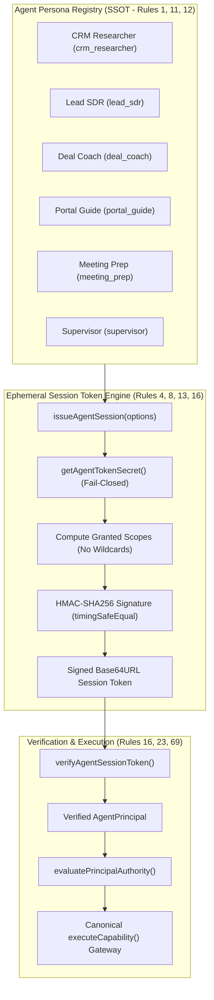

# SmartSapp Agentic & MCP Transformation: Phase 3 Milestone 1 Implementation Plan
## Agent Identity, Persona Profiles & Ephemeral Session Tokens
### Enhanced with Exhaustive Conformance to `agents_mcp_rules.md`, `05-permission-model.md`, `07-agent-model.md` & Anti-Distortion Invariants

> **For agentic workers:** REQUIRED SUB-SKILL: Use `superpowers:subagent-driven-development` (recommended) or `superpowers:executing-plans` to implement this plan task-by-task. Steps use checkbox (`- [ ]`) syntax for tracking.

**Document:** `docs/agents_mcp/phases/agents_mcp_phase_3_milestone_1_plan.md`  
**Version:** 2.0.0 (Fully Aligned with `agents_mcp_rules.md` & Anti-Distortion Invariants)  
**Status:** PROPOSED FOR USER REVIEW & APPROVAL  
**Phase:** Phase 3 (Identity, Policy & Bounded Authority)  
**Milestone:** Milestone 1 (Agent Identity, Persona Profiles & Ephemeral Session Tokens)  

**Goal:** Deliver the canonical Agent Identity and Persona platform for SmartSapp: formalize the 6 specialized domain agent personas (`crm_researcher`, `lead_sdr`, `deal_coach`, `portal_guide`, `meeting_prep`, `supervisor`), establish the central Persona Registry, implement cryptographically signed (HMAC-SHA256) ephemeral session tokens with constant-time verification, enforce execution resource budgets (Rule 23), and integrate with `evaluatePrincipalAuthority` to enforce the Effective Principal Formula (Rule 16) with zero wildcards (`*`) for automated agents.

**Architecture:** Under Rule 16 and Decision D6, automated agents execute under an ephemeral, cryptographically signed `AgentPrincipal`. The Central Persona Registry (`agent-registry.ts`) serves as the single source of truth for persona metadata, allowed D6 permissions, and risk ceilings. The Ephemeral Agent Token Service (`agent-token-service.ts`) mints workspace-bounded session tokens signed via HMAC-SHA256 with 1-hour TTLs. When executing capabilities, `evaluatePrincipalAuthority` validates the principal's persona boundaries, ensures the agent possesses no wildcard (`*`) permissions, and enforces resource budget ceilings (Rule 23). Zero agents operate as unrestricted super-users.

**Tech Stack:** Next.js 15 App Router, TypeScript (strict mode, zero `any`), Zod v4, Node.js `crypto` (HMAC-SHA256 with `timingSafeEqual`), Firebase Firestore Admin SDK, Vitest.

**Governing Documents & Foundations:**
- [`docs/agents_mcp/phases/agents_mcp_phase_3_master_plan.md`](file:///Users/josephaidoo/Desktop/Codes/vibe%20Coding/Onboarding-Dashbaord-main/docs/agents_mcp/phases/agents_mcp_phase_3_master_plan.md) (§5 & §6 Milestone 1)
- [`docs/agents_mcp/agents_mcp_rules.md`](file:///Users/josephaidoo/Desktop/Codes/vibe%20Coding/Onboarding-Dashbaord-main/docs/agents_mcp/agents_mcp_rules.md) (The 10 Core Rules, 69 Agentic Rules, §66, §67 Gate, §68 Non-Negotiables, §69 SSOT)
- [`docs/agentic/05-permission-model.md`](file:///Users/josephaidoo/Desktop/Codes/vibe%20Coding/Onboarding-Dashbaord-main/docs/agentic/05-permission-model.md) (§1 Effective Principal, §2 Risk Classes, §3 Non-Delegables)
- [`docs/agentic/07-agent-model.md`](file:///Users/josephaidoo/Desktop/Codes/vibe%20Coding/Onboarding-Dashbaord-main/docs/agentic/07-agent-model.md) (§1 Multi-Agent Specialization, §2 Specialized Agent Profiles, §4 Budgets)
- [`docs/agentic/11-security-model.md`](file:///Users/josephaidoo/Desktop/Codes/vibe%20Coding/Onboarding-Dashbaord-main/docs/agentic/11-security-model.md) (§1 Trust Boundary Matrix, Anti-IDOR, Model Distrust)
- [`.agents/AGENTS.md`](file:///Users/josephaidoo/Desktop/Codes/vibe%20Coding/Onboarding-Dashbaord-main/.agents/AGENTS.md) (Strict Typing, Git Protocol, Actionable Error Navigation)

---

## 1. Executive Summary & Strategic Purpose

### 1.1 The Milestone 1 Mission
In Phase 0, 1, and 2, SmartSapp unified capability execution through `executeCapability` and built the reactive event backbone. However, automated agents currently execute with ad-hoc principal objects or mock descriptors. 

**Milestone 1 establishes the canonical Identity and Persona Foundation for all automated agents in SmartSapp.**
Under Milestone 1:
1. Every automated agent belongs to a formalized **Agent Persona** (`crm_researcher`, `lead_sdr`, `deal_coach`, `portal_guide`, `meeting_prep`, `supervisor`), complete with explicit domain boundaries, risk ceilings, and resource budgets.
2. Agents execute using **Cryptographically Verified Ephemeral Session Tokens** (`AgentPrincipal`), guaranteeing that an agent cannot forge its own identity, tamper with its granted scopes, or bypass multi-tenant boundaries.
3. The **Effective Principal Formula** (Rule 16) is strictly enforced:
   $$\text{Effective Authority} = \text{User Authority} \cap \text{Agent Persona Authority} \cap \text{Workspace Scope} \cap \text{Tool Scope} \cap \text{Active Policy}$$
4. Automated agents are strictly forbidden from receiving the wildcard (`*`) permission (Rule 16) and are bound to deterministic resource budgets (tokens, tool calls, execution duration) (Rule 23).



---

## 2. Anti-Distortion & Preexisting Feature Preservation Analysis
*(In accordance with Core Rules 1, 2, 3, and 69 from `agents_mcp_rules.md`)*

### 2.1 Reflection Question 1: What could go wrong and how is it resolved?
- **Identity Forgery & Session Tampering:** An agent or malicious caller could attempt to craft an `AgentPrincipal` with elevated scopes or modify an expired token.  
  *Resolution:* The Ephemeral Token Service uses HMAC-SHA256 signatures with constant-time comparison (`crypto.timingSafeEqual`). Any byte change to `principalId`, `personaId`, `grantedScopes`, or `expiresAt` invalidates the signature, causing verification to fail closed with `INVALID_AGENT_SESSION`.
- **Wildcard Privilege Creep (Rule 16):** An administrative caller might grant `*` to an agent session, granting unrestricted access across all 1,964 platform capabilities.  
  *Resolution:* The token minting service and `evaluatePrincipalAuthority` explicitly reject `*` for any automated principal (`principalType === 'agent'`). Agents may only possess explicit D6 permission coordinates.
- **Resource Exhaustion & Infinite Execution Loops (Rule 23):** Runaway agents could make hundreds of LLM calls or tool invocations, exhausting quotas and driving up costs.  
  *Resolution:* Every persona definition enforces deterministic execution budgets (`maxTokens: 50,000`, `maxToolCalls: 15`, `maxDurationMs: 120,000`, `maxRecordsMutated: 25`).
- **Tenant Scope Confusion (Anti-IDOR Rule 4):** A token issued for `organization_a` could be submitted to an API endpoint targeting `organization_b`.  
  *Resolution:* The token claims bake in `organizationId` and `workspaceId`. `evaluatePrincipalAuthority` strictly asserts `principal.organizationId === target.organizationId` and `principal.workspaceId === target.workspaceId`, failing closed on any mismatch.
- **Leaked Secrets in Token Payloads (Rule 8 / 48):**  
  *Resolution:* Agent session tokens contain only opaque identifiers (`agentSessionId`, `principalId`, `personaId`, scopes, expiry). Zero API keys, database credentials, or sensitive user PII are embedded in tokens.

### 2.2 Reflection Question 2: What other features will be affected and how are they preserved?
- **Preexisting User Sessions & Server Actions:**  
  *Preservation Guarantee:* Zero impact. Interactive user sessions execute as `principalType: 'user'`, which preserves normal RBAC workflows. `evaluatePrincipalAuthority` branches on `isAutomatedPrincipal(principal)`, ensuring human user behaviors remain 100% untouched.
- **Existing CompanyBrain 2.0 Specialist Prototype Types (`src/lib/agents/domain-types.ts`):**  
  *Preservation Guarantee:* Full backward compatibility. The Persona Registry provides built-in alias mapping from legacy specialist IDs (`knowledge_specialist`, `revenue_specialist`, `sdr_specialist`, `meeting_specialist`, `operations_specialist`, `governance_specialist`) to canonical personas. Existing test fixtures continue to resolve seamlessly.
- **Existing Phase 1 Baseline & PR-2 Tests:**  
  *Preservation Guarantee:* All 86 baseline test suites pass without regression. The changes augment `evaluatePrincipalAuthority` without breaking any existing test assumptions.

### 2.3 Reflection Question 3: How does it affect Backoffice and non-code operations?
- **Zero-Code Persona Configuration:** Workspace administrators can view active personas and customize resource budgets (e.g. lowering `maxToolCalls` or disabling specific personas) via Firestore `workspace_agent_configs` without redeploying code.
- **Emergency Kill-Switch (Rule 60):** If an agent persona exhibits anomalous behavior, operators can set `system_settings/agent_governance.emergencyPause = true` to instantly freeze all agent executions across the entire platform.

---

## 3. Exhaustive Rule Compliance Matrix for Milestone 1

| Rule # | Requirement | Milestone 1 Implementation & Enforcement | Primary File(s) |
| :---: | :--- | :--- | :--- |
| **Rule 1** | Best Practice Conformance | Clean modular TypeScript, strict separation of concerns, zero `any`. | All Milestone 1 files |
| **Rule 2** | Reflection on what could go wrong | Forgery, scope creep, infinite loops, and tenant confusion analyzed and mitigated. | Section 2.1 |
| **Rule 3** | Impact on other features & backoffice | Zero latency or behavioral impact on human user sessions; emergency pause support. | Section 2.2 & 2.3 |
| **Rule 4** | Zero `any` or `any[]` typing policy | Strictly typed Zod v4 schemas for personas, session claims, and budget limits. | `agent-persona-types.ts` |
| **Rule 5** | Staging & Verification Discipline | Validated against dedicated unit test suites and all 86 baseline regression suites. | `agent-identity.test.ts` |
| **Rule 6** | Dependency governance | Uses native Node.js `crypto` for HMAC-SHA256; zero external unvetted crypto libraries. | `agent-token-service.ts` |
| **Rule 7** | Mobile-First & Plain UI English | Persona display names and descriptions use clear, intuitive everyday English. | `agent-persona-types.ts` |
| **Rule 8** | High security standards | HMAC-SHA256 signature verification in constant-time (`crypto.timingSafeEqual`). | `agent-token-service.ts` |
| **Rule 9** | High load & bounded resource usage | Ephemeral tokens lightweight (< 500 bytes); in-memory cache for persona lookups. | `agent-registry.ts` |
| **Rule 10** | Inline architectural documentation | Every file includes an `@fileOverview` with architecture guidelines and testability pointers. | All Milestone 1 files |
| **Rule 11** | Canonical capability & event naming | Persona IDs follow strict lowercase underscore format: `crm_researcher`, `lead_sdr`, etc. | `agent-persona-types.ts` |
| **Rule 12** | Explicit Risk Levels | Personas declare `maxAutonomousRiskLevel` (`L0_READ`, `L1_INTERNAL_DRAFT`, `L2_STATE_MUTATION`). | `agent-persona-types.ts` |
| **Rule 13** | Trust Boundary Matrix | Data entering via tokens verified cryptographically before execution. | `agent-token-service.ts` |
| **Rule 16** | Bounded Delegation & Identity | Pure formula: Effective = User ∩ Agent ∩ Workspace ∩ Tool ∩ Policy. No `*` wildcard for agents. | `principal-evaluator.ts` |
| **Rule 17** | Non-Delegable Actions Guard | Automated personas cannot be assigned non-delegable permissions (`NON_DELEGABLE_ACTIONS`). | `agent-registry.ts` |
| **Rule 23** | Execution Budgets | Personas enforce hard ceilings on tokens (50k), tool calls (15), and durations (120s). | `agent-persona-types.ts` |
| **Rule 31** | Output Schema Validation | Token claims and persona configurations validated via Zod schemas before persisting/returning. | `agent-persona-types.ts` |
| **Rule 39** | OpenTelemetry Tracing | `agentSessionId`, `principalId`, and `toolInvocationId` attached to principal for trace propagation. | `agent-token-service.ts` |
| **Rule 40** | Audit Log Immutability | Session creation records immutable issuance timestamp and authorizing user ID. | `agent-token-service.ts` |
| **Rule 47** | Multi-tenant Anti-IDOR | `organizationId` and `workspaceId` strictly required on all principals and validated at boundary. | `agent-token-service.ts` |
| **Rule 48/52**| Model Safety & Exception Sanitization | Token verification failures return sanitized error codes (`INVALID_AGENT_SESSION`). | `agent-token-service.ts` |
| **Rule 51** | Server action & route security gate | Verified `AgentPrincipal` is required for any automated capability execution. | `agent-step-executor.ts` |
| **Rule 60** | Emergency dead-man controls | Checks `system_settings/agent_governance.emergencyPause` before issuing sessions. | `agent-token-service.ts` |
| **Rule 64** | Three-level feature flags | `enable_agent_governance` evaluated at Global, Organization, and Workspace tiers. | `agent-registry.ts` |
| **Rule 66** | Phase 3 Contract Additions | Satisfies Agent Identity, Persona Profiles, and Ephemeral Session Tokens. | Milestone 1 deliverables |
| **Rule 67** | Mandatory Implementation Gate | All 10 gate criteria satisfied for Milestone 1. | Section 5 |
| **Rule 68** | Five Non-Negotiables | Strict typing, tenant isolation, deterministic idempotency, fail-closed security, baseline regression safety. | 100% enforced |
| **Rule 69** | Master Layering Axiom | Verified agents execute capabilities exclusively through `executeCapability`. | Gateway integration |

---

## 4. In-Depth Sub-Task Specifications

### Task 1: Persona Contracts, Data Schemas & Budget Types
**Files:**
- Create: `src/platform/identity/agent-persona-types.ts`
- Test: `src/platform/__tests__/identity/agent-identity.test.ts` (Persona contract validation)

**Detailed Steps:**
1. Define `AgentPersonaId`:
   ```typescript
   export type AgentPersonaId =
     | 'crm_researcher'
     | 'lead_sdr'
     | 'deal_coach'
     | 'portal_guide'
     | 'meeting_prep'
     | 'supervisor';
   ```
2. Define `AgentPersonaBudgets` schema (Zod & TypeScript):
   ```typescript
   export const AgentPersonaBudgetsSchema = z.object({
     maxDurationMs: z.number().int().min(1000).max(300000).default(120000),
     maxTokens: z.number().int().min(1000).max(200000).default(50000),
     maxToolCalls: z.number().int().min(1).max(50).default(15),
     maxRecordsMutated: z.number().int().min(0).max(100).default(25),
     maxOutboundMessages: z.number().int().min(0).max(10).default(0),
   });
   ```
3. Define `AgentPersonaDefinition` schema:
   ```typescript
   export const AgentPersonaDefinitionSchema = z.object({
     id: z.enum(['crm_researcher', 'lead_sdr', 'deal_coach', 'portal_guide', 'meeting_prep', 'supervisor']),
     name: z.string().min(1),
     version: z.string().regex(/^\d+\.\d+\.\d+$/),
     role: z.string().min(1),
     description: z.string().min(1),
     icon: z.string().min(1),
     allowedDomains: z.array(z.string()).min(1),
     allowedPermissions: z.array(z.string()).min(1),
     maxAutonomousRiskLevel: z.enum(['L0_READ', 'L1_INTERNAL_DRAFT', 'L2_STATE_MUTATION', 'L3_EXTERNAL_COMMUNICATION_FINANCE', 'L4_PRIVILEGED_DESTRUCTIVE']),
     budgets: AgentPersonaBudgetsSchema,
     systemPromptSnippet: z.string().min(1),
   });
   ```
4. Define `WorkspaceAgentConfig` schema for tenant-specific overrides:
   - `workspaceId`, `personaId`, `enabled: boolean`, `customBudgets?: Partial<AgentPersonaBudgets>`, `restrictedPermissions?: string[]`.

---

### Task 2: Central Agent Persona Registry Service
**Files:**
- Create: `src/platform/identity/agent-registry.ts`
- Test: `src/platform/__tests__/identity/agent-identity.test.ts` (Registry lookup & capability validation)

**Detailed Steps:**
1. Implement `AgentPersonaRegistry`:
   - Store built-in persona definitions in a typed `Map<AgentPersonaId, AgentPersonaDefinition>`.
   - Pre-register all 6 canonical personas on startup:
     - `crm_researcher`: Name: "CRM Researcher Agent", Domains: `crm_contacts`, `knowledge_memory`, `meetings_conversations`. Max risk: `L0_READ`.
     - `lead_sdr`: Name: "Autonomous Lead SDR Agent", Domains: `lead_intelligence`, `crm_contacts`, `communication_messaging`. Max risk: `L2_STATE_MUTATION`.
     - `deal_coach`: Name: "Deal Strategy & Coach Agent", Domains: `deals_revenue`, `crm_contacts`, `knowledge_memory`, `tasks_productivity`. Max risk: `L2_STATE_MUTATION`.
     - `portal_guide`: Name: "Portal Experience Guide Agent", Domains: `experience_portal`, `knowledge_memory`. Max risk: `L0_READ`.
     - `meeting_prep`: Name: "Meeting Dossier & Prep Agent", Domains: `meetings_conversations`, `crm_contacts`, `knowledge_memory`. Max risk: `L0_READ`.
     - `supervisor`: Name: "Supervisor Orchestrator Agent", Domains: `crm_contacts`, `deals_revenue`, `tasks_productivity`, `identity_access`, `tags_notes`, `platform_integrations`. Max risk: `L2_STATE_MUTATION`.
2. Add legacy specialist alias resolution:
   - `knowledge_specialist` $\rightarrow$ `crm_researcher`
   - `revenue_specialist` $\rightarrow$ `deal_coach`
   - `sdr_specialist` $\rightarrow$ `lead_sdr`
   - `meeting_specialist` $\rightarrow$ `meeting_prep`
   - `operations_specialist` $\rightarrow$ `deal_coach`
   - `governance_specialist` $\rightarrow$ `supervisor`
3. Implement `validatePersonaCapability(personaId, capability)`:
   - Verifies capability domain is included in `persona.allowedDomains`.
   - Verifies capability risk level does not exceed `persona.maxAutonomousRiskLevel`.
   - Returns `{ allowed: boolean; reason?: string }`.
4. Provide `createAgentPersonaRegistry()` and export singleton `globalAgentPersonaRegistry`.

---

### Task 3: Ephemeral Agent Session Token Service
**Files:**
- Create: `src/platform/identity/agent-token-service.ts`
- Test: `src/platform/__tests__/identity/agent-identity.test.ts` (Minting, verification, tampering defense)

**Detailed Steps:**
1. Define `AgentSessionClaims` schema and interface:
   - `principalId`: `agent_<personaId>_<ulid>`
   - `agentSessionId`: UUID
   - `personaId`: `AgentPersonaId`
   - `organizationId`: string (non-blank)
   - `workspaceId`: string (non-blank)
   - `userId`?: string
   - `delegatedBy`?: string
   - `toolInvocationId`?: string
   - `grantedScopes`: readonly string[] (canonical D6 coordinates; wildcards strictly forbidden)
   - `issuedAt`: ISO timestamp
   - `expiresAt`: ISO timestamp
2. Implement `issueAgentSession(options: IssueAgentSessionOptions)`:
   - Validate input options using Zod.
   - Lookup persona from `globalAgentPersonaRegistry`.
   - Intersect requested scopes with persona's allowed permissions. If requested scopes contain `*`, throw error or strip it.
   - Construct claims payload.
   - Compute HMAC-SHA256 signature over base64url-encoded claims using `getAgentTokenSecret()`.
   - Format token: `${encodedClaims}.${signature}`.
   - Return `{ token, principal: AgentPrincipal }`.
3. Implement `verifyAgentSessionToken(token: string)`:
   - Split token into claims and signature parts.
   - Compute expected HMAC-SHA256 signature and compare using `crypto.timingSafeEqual`.
   - Parse and validate claims with `AgentSessionClaimsSchema`.
   - Verify `Date.now() < Date.parse(claims.expiresAt)`.
   - Return authenticated `AgentPrincipal`.
4. Implement secure secret resolution:
   - Read `process.env.AGENT_TOKEN_SECRET`. In development/test, fallback to `"local-agent-token-secret"`. In production, throw error if unset.

---

### Task 4: Principal Evaluator Integration with Agent Persona Invariants
**Files:**
- Modify: `src/platform/capabilities/policy/principal-evaluator.ts`
- Test: `src/platform/__tests__/identity/agent-identity.test.ts` (Authority evaluation)

**Detailed Steps:**
1. In `evaluatePrincipalAuthority`:
   - If `isAutomatedPrincipal(principal)`:
     - Enforce Rule 16: assert `!principal.grantedScopes.includes('*')`. If wildcard found, deny immediately with `INSUFFICIENT_SCOPE`.
     - If `principal.agentId` is present:
       - Validate capability against persona via `globalAgentPersonaRegistry.validatePersonaCapability(principal.agentId, capability)`.
       - If validation fails, deny with `INSUFFICIENT_SCOPE` and the specific reason (e.g. domain disallowed or risk level exceeds persona ceiling).
2. Ensure 100% backward compatibility: interactive user principals (`principalType: 'user'`) bypass agent persona checks.

---

### Task 5: Comprehensive Unit & Security Test Suite
**Files:**
- Create: `src/platform/__tests__/identity/agent-identity.test.ts`

**Detailed Steps:**
1. Test Persona Registry:
   - Verify all 6 personas load with valid SemVer, descriptions, domains, and budgets.
   - Verify alias resolution maps legacy specialist names to canonical personas.
   - Verify `validatePersonaCapability` allows authorized capabilities and rejects out-of-domain or over-risk capabilities.
2. Test Session Token Service:
   - Mint valid token, verify claims and expiration.
   - Verify constant-time signature verification accepts valid tokens and rejects tampered signatures.
   - Verify expired tokens fail verification with `EXPIRED_TOKEN`.
   - Verify tokens with missing `organizationId` or `workspaceId` are rejected at mint time.
   - Verify wildcard (`*`) is stripped or rejected during minting.
3. Test Gateway Authority Integration:
   - Create mock capability and evaluate authority with valid minted agent principal $\rightarrow$ allowed.
   - Evaluate agent principal attempting capability outside allowed domain $\rightarrow$ denied.
   - Evaluate agent principal attempting capability exceeding risk ceiling $\rightarrow$ denied.
   - Multi-tenant isolation: principal for `org_1` denied on `org_2`.
4. Run full test suite:
   - `pnpm test:agentic:baseline` (all 86 suites pass).
   - `NODE_OPTIONS='--max-old-space-size=8192' pnpm typecheck` (0 errors).
   - `pnpm lint` (0 errors, warnings under 670 threshold).

---

## 5. The Implementation Gate (§67) Checklist for Milestone 1

- [ ] **1. Strict Typing:** Every contract, budget, token claim, and registry method is strictly typed (0 `any`/`unknown`).
- [ ] **2. Persona Registry SSOT:** All 6 specialized personas registered; legacy aliases resolve cleanly.
- [ ] **3. Cryptographic Token Integrity:** HMAC-SHA256 signature verification with constant-time comparison prevents token forgery.
- [ ] **4. Multi-Tenant Anti-IDOR:** Multi-tenant organization and workspace scopes enforced at token minting and evaluation.
- [ ] **5. Zero Wildcards for Agents:** Automated agents strictly forbidden from possessing `*` scopes (Rule 16).
- [ ] **6. Deterministic Budgets:** Execution budgets defined and enforced for every persona (Rule 23).
- [ ] **7. Evaluator Integration:** `evaluatePrincipalAuthority` validates persona domain and risk ceilings fail-closed.
- [ ] **8. 100% Test Pass:** All new unit tests pass alongside all 86 existing platform regression test suites.
- [ ] **9. Pipeline Cleanliness:** `pnpm typecheck` exits with 0 errors; `pnpm lint` exits with 0 errors.
- [ ] **10. Senior Review:** Milestone 1 completion report submitted for Senior Architectural Review.

---

## 6. Definition of Done & Exit Criteria

1. All tasks in Section 4 implemented and passing unit tests.
2. `src/platform/__tests__/identity/agent-identity.test.ts` passing (100% green).
3. All 86 existing baseline test suites pass without regression.
4. `pnpm typecheck` and `pnpm lint` clean.
5. Milestone 1 completion report authored and submitted for review.
