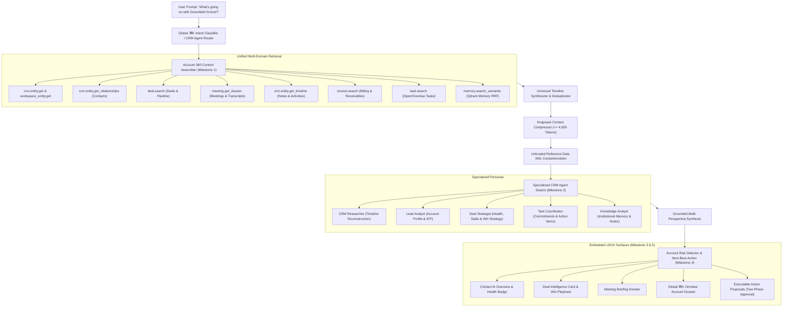

# SmartSapp Agentic & MCP Transformation: Phase 9 Master Implementation Plan
## First Agent Wave: Universal CRM Agent & Account Intelligence Swarm
### Deeply Integrated with `docs/agents_mcp/`, `docs/agentic/`, `theme.md` §8 & The 69 Agentic Development Rules

**Version:** 1.1.0 (Exhaustive 69-Rules Synthesis & Mandatory Domain Agent Deliverables Gate)  
**Status:** READY FOR IMPLEMENTATION  
**Authors:** Senior Principal Systems & AI Agentic Architecture Engineer  
**Governing Documents & Source Foundations:**
- **Agentic & MCP Transformation Foundation:**
  - [`docs/agents_mcp/agents_mcp_roadmap.md`](file:///Users/josephaidoo/Desktop/Codes/vibe%20Coding/Onboarding-Dashbaord-main/docs/agents_mcp/agents_mcp_roadmap.md) (§ Phase 9: "First Agent Wave: Universal CRM Agent", lines 1516–1581: "Do not begin with a highly autonomous outbound agent. Start with the domain where context richness is highest and external risk is relatively manageable. First agent family: CRM Assistant, CRM Researcher, Lead Analyst, Deal Strategist, Task Coordinator, Knowledge Analyst. Signature behavior: User says 'What's going on with Greenfield School?' -> 14-step autonomous timeline construction, unresolved issues, commitments, structured answer, executable next actions.")
  - [`docs/agents_mcp/agents_mcp_ui.md`](file:///Users/josephaidoo/Desktop/Codes/vibe%20Coding/Onboarding-Dashbaord-main/docs/agents_mcp/agents_mcp_ui.md) (§ Phase 9 CRM Redesign, lines 3425–3464: Contact AI Overview, Knowledge, Recommendations; Deal Intelligence; Meeting Brief; Lead Intelligence AI Researcher; Core Use Cases: Account research, Deal review, Next-best-action, Meeting preparation, Follow-up preparation.)
  - [`docs/agents_mcp/agents_mcp_rules.md`](file:///Users/josephaidoo/Desktop/Codes/vibe%20Coding/Onboarding-Dashbaord-main/docs/agents_mcp/agents_mcp_rules.md) (Lines 1940–1953: Domain Agents Mandatory Deliverables: Shadow Mode, Evaluation Dataset, Permission Matrix, Tool Matrix, Failure Matrix, Security Tests, Rollback Plan; §67 The Agent Implementation Gate; All 69 Master Rules.)
  - [`docs/agents_mcp/agents_mcp_tools.md`](file:///Users/josephaidoo/Desktop/Codes/vibe%20Coding/Onboarding-Dashbaord-main/docs/agents_mcp/agents_mcp_tools.md) (§ Domain 2 CRM, Contacts and Entity Relationships, lines 275–515: `crm.entity.search`, `crm.entity.get`, `crm.entity.create`, `crm.entity.update`, `crm.entity.find_duplicates`, `crm.entity.propose_merge`, `crm.workspace_entity.get`, `crm.workspace_entity.create`, `crm.workspace_entity.update`, `crm.entity.get_timeline`, `crm.entity.summarize_history`, `crm.entity.add_note`, `crm.entity.add_tag`, `crm.entity.assign_owner`, `crm.pipeline.list`, `crm.pipeline.get`, `crm.stage.propose_transition`, `crm.activity.create`; § Preservation of Dual-Tier Data Model: `entities` vs `workspace_entities` `${workspaceId}_${entityId}`.)
  - [`docs/agentic/07-agent-model.md`](file:///Users/josephaidoo/Desktop/Codes/vibe%20Coding/Onboarding-Dashbaord-main/docs/agentic/07-agent-model.md) (§2.1 CRM Researcher Agent, §2.2 Autonomous Lead SDR Agent, §2.3 Deal Strategy & Coach Agent; Resource Budgets & Guardrails.)
  - [`docs/agentic/02-capability-catalog.md`](file:///Users/josephaidoo/Desktop/Codes/vibe%20Coding/Onboarding-Dashbaord-main/docs/agentic/02-capability-catalog.md) (Domain 02: `crm_contacts`, Domain 03: `deals_revenue`, Domain 04: `knowledge_memory`, Domain 05: `tasks_productivity`, Domain 06: `meetings_conversations`.)
  - [`docs/agentic/08-memory-model.md`](file:///Users/josephaidoo/Desktop/Codes/vibe%20Coding/Onboarding-Dashbaord-main/docs/agentic/08-memory-model.md) (5-Tier Memory, Qdrant payload isolation, prompt injection isolation `<untrusted_reference_data id="...">`.)
  - [`docs/agentic/13-uiux-architecture.md`](file:///Users/josephaidoo/Desktop/Codes/vibe%20Coding/Onboarding-Dashbaord-main/docs/agentic/13-uiux-architecture.md) (3-Zone Shell, Adaptive Context Rail, Transparent Tool-Call Cards, Two-Phase Human Approval Modals.)
  - [`docs/agents_mcp/agents_mcp_cloudrun.md`](file:///Users/josephaidoo/Desktop/Codes/vibe%20Coding/Onboarding-Dashbaord-main/docs/agents_mcp/agents_mcp_cloudrun.md) (Stateless runtime, Cloud Tasks execution, 32MB payload ceiling, SSRF defense.)
- **Design System & Workspace Rules:**
  - [`theme.md` Section 8](file:///Users/josephaidoo/Desktop/Codes/vibe%20Coding/Onboarding-Dashbaord-main/theme.md#L396-L442) (Standardized Modal & Dialog Architecture SSOT: demarcated header/footer, single-circle info tooltip at `z-[10050]`, zero raw descriptions.)
  - [`.agents/AGENTS.md`](file:///Users/josephaidoo/Desktop/Codes/vibe%20Coding/Onboarding-Dashbaord-main/.agents/AGENTS.md) (SSOT: Strict Typing zero `any`, TagSelector, FieldsVariablesService, Actionable Toasts, Modal System, Strangler Fig Invariant.)

---

## 1. Executive Summary & Architectural Strategy

### 1.1 Why CRM Is the First Agent Wave
The roadmap explicitly mandates:
> **“Do not begin with a highly autonomous outbound agent. Start with the domain where context richness is highest and external risk is relatively manageable.”**

Outbound marketing and sales automation carry high external blast radiuses (brand reputation, email deliverability, spam complaints, compliance). In contrast, CRM intelligence is **context-rich, internal-first, read-heavy, and high-leverage**:
1. **Context Richness:** A single customer account touches entities, contacts, deals, meetings, notes, transcripts, emails, invoices, payment history, and tasks.
2. **Safety Profile:** 90% of operations are `L0_READ` (timeline reconstruction, deal health evaluation, transcript analysis, semantic search) or `L1_INTERNAL_DRAFT` (syntheses, action proposals, follow-up drafts).
3. **Controlled Mutations:** All state-changing actions (stage transitions, owner assignments, tag applications, task creation) route through either bounded delegation or the Phase 6/8 Two-Phase Proposal Interceptor (Rule 21 & 22).
4. **Signature Demonstration:** Demonstrates that SmartSapp's AI "uses the app better than humans" not through an opaque LLM, but through **complete structured access to SmartSapp's unified data plane**.

### 1.2 The Signature 14-Step Autonomous Account Synthesis
When a sales rep, manager, or executive asks:
> **“What's going on with Greenfield School?”**

The Universal CRM Agent autonomously executes a structured 14-step assembly:
```text
  1. Retrieve Entity Master & Workspace Operational Record (entities & workspace_entities)
  2. Retrieve Related Contacts (primary, billing, academic, administrative)
  3. Retrieve Active & Historical Deals (pipeline stage, probability, value, age)
  4. Retrieve Meetings & Calendar Events (past dossiers, upcoming sessions)
  5. Retrieve Notes & Activity Memos (quick notes, call logs, interaction history)
  6. Retrieve Payment Context (invoices, aging, collection status, balance)
  7. Retrieve Previous Communications (email/message history, channel preferences)
  8. Retrieve Tasks & Action Items (completed, pending, overdue)
  9. Retrieve Relevant Knowledge & Semantic Memory (Qdrant RRF hybrid vector search)
 10. Construct Unified Chronological Timeline (normalized event stream)
 11. Identify Unresolved Issues & Account Risks (stalled deals, unanswered inquiries)
 12. Identify Commitments (promises made in meetings/notes, upcoming deliverables)
 13. Produce Grounded, Multi-Section Synthesis Answer (with citations)
 14. Offer Executable Next Actions (one-click tasks, stage transition proposals)
```



---

## 2. Invariant Architecture: Dual-Tier CRM Data Model Preservation (Rule 69)

A cornerstone architectural constraint of SmartSapp (documented in `agents_mcp_tools.md` lines 505–514) is the **dual-tier CRM data model**:
```text
┌────────────────────────────────────────────────────────────────────────┐
│                        GLOBAL MASTER IDENTITY                          │
│ Collection: /entities/{entityId}                                       │
│ Responsibility: Universal identity, legal name, domain, national tax   │
│                 ID, global contacts, verified firmographics.           │
└───────────────────────────────────┬────────────────────────────────────┘
                                    │
                    Partitions into Workspace Tenancy
                                    │
                                    ▼
┌────────────────────────────────────────────────────────────────────────┐
│                    WORKSPACE OPERATIONAL CRM RECORD                    │
│ Collection: /workspace_entities/{workspaceId}_{entityId}               │
│ Responsibility: Workspace-scoped pipeline stages, operational tags,    │
│                 account owner assignment, custom workspace fields,     │
│                 lead status, activity history, SLA tracking.           │
└────────────────────────────────────────────────────────────────────────┘
```

### Critical Implementation Safeguards:
1. **Zero Accidental Identity Overwrite:** When an agent updates a deal stage, assigns an account owner, or applies a workspace tag, it MUST target `/workspace_entities/{workspaceId}_{entityId}`. Under no circumstances may an agent mutate `/entities/{entityId}` for workspace-specific state.
2. **Polymorphic Query Layer:** Context assembly must read `/entities/{entityId}` for base attributes and overlay `/workspace_entities/{workspaceId}_{entityId}` for active tenant state.
3. **Tag Invariant:** Tag applications route exclusively through the canonical `<TagSelector>` component and `tag-actions.ts`, updating `workspaceTags` on the workspace record.
4. **Strangler Fig Compliance:** Existing CRM queries, actions, and UI components continue operating uninterrupted.

---

## 3. Master 69-Rules Alignment & Enforcement Matrix for Phase 9

To guarantee full conformance with `docs/agents_mcp/agents_mcp_rules.md` without compromising any platform functionality, the matrix below details the exact architectural defense and implementation for all 69 rules in Phase 9:

### Section A: Core Development & Engineering Principles (Rules 1–10)
| Rule # | Requirement | Phase 9 Implementation & Architectural Defense |
| :---: | :--- | :--- |
| **Rule 1** | Skill Conformance & Standards | Conforms strictly to `next-best-practices`, `vercel-react-best-practices`, `emilkowal-animations`, `frontend-design`, and `backend-design`. All existing CRM functionality preserved. |
| **Rule 2** | Failure Mode Planning & Cleanliness | Comprehensive failure matrix covering missing entities, empty timelines, stalled deals, contradictory notes, model timeouts, and network disconnects. |
| **Rule 3** | Backoffice Enhancement & Non-Breaking | Provides operator visibility into CRM agent reasoning, evaluation scores, and proposal conversion on `/admin/intelligence/agents`. |
| **Rule 4** | Zero `any` / Zero `any[]` Typing Policy | 100% strict TypeScript types across all 5 milestones. Zod v4 schemas for all context contracts, agent inputs/outputs, and actions. |
| **Rule 5** | Staged Deployment & Security Verification | Staged Firestore compound indexes for `workspace_entities`, `deals`, and `notes`; security rules emulator verified prior to production push. |
| **Rule 6** | Dependencies & Context7 Documentation | Uses verified stable versions of `@modelcontextprotocol/server`, `zod/v4`, `date-fns`, and `lucide-react`. Documentation verified via Context7 MCP. |
| **Rule 7** | Mobile-First & Plain UI English | All CRM intelligence cards, recommendation chips, and action modals enforce $\ge 44\text{px}$ touch targets (`min-h-[44px]`). UI uses clear, concise business English with zero raw stack traces or leaked JSON. |
| **Rule 8** | High Security, Data Protection & Anti-IDOR | Every query, context assembly, and action immutably binds to authenticated session `organizationId` and active `workspaceId`. Cross-tenant leaks fail closed with HTTP 403. |
| **Rule 9** | High Load & Resource Exhaustion Defense | All CRM sub-retrievals strictly bounded (`limit <= 50`). Context assembly throttled to max 5,000ms duration and max 4,000 tokens. |
| **Rule 10** | Inline Architectural Documentation | Every authored file includes comprehensive `@fileOverview` documentation detailing architecture, security invariants, Rule mappings, and testability pointers. |

### Section B: MCP & Security Foundations (Rules 11–25)
| Rule # | Requirement | Phase 9 Implementation & Architectural Defense |
| :---: | :--- | :--- |
| **Rule 11** | MCP Protocol Compliance | Tool invocations route through domain MCP servers via Streamable HTTP (Spec 2026-07-28), supporting stateless multi-round-trip execution. |
| **Rule 12** | No MCP Annotations as Security Controls | Server-side verification calculates risk levels (`L0_READ` to `L2_STATE_MUTATION`) independently of client-provided metadata. |
| **Rule 13** | Formal Trust Boundary Matrix | External user notes, entity fields, email bodies, and transcripts are treated as untrusted and isolated inside `<untrusted_reference_data id="...">` containers before rendering or model ingestion (Rule 30). |
| **Rule 14** | Tool Poisoning / Rug-Pull Defense | Pre-execution cryptographic SHA-256 fingerprint verification (`verifyCapabilityFingerprint`) before executing any CRM capability. |
| **Rule 15** | Server Allowlisting & Supply-Chain Security | External enrichment tools gated by 8-stage allowlist state machine (`approved`, `connected`, `monitored`). |
| **Rule 16** | Agent Identity as Security Principal | CRM agents execute with explicit persona identities (`crm_assistant`, `crm_researcher`, `deal_strategist`, etc.) and granted scopes; wildcard (`*`) scopes banned. |
| **Rule 17** | Non-Delegable Actions | Destructive actions (e.g. deleting an entity, wiping deal history) are classified as non-delegable and unconditionally stripped from autonomous agent execution. |
| **Rule 18** | TOCTOU Live Principal / Delegation Check | Live optimistic concurrency check: record versions verified before committing stage transitions or owner assignments. |
| **Rule 19** | Mandatory Idempotency for Mutating Tools | Mutating actions (task creation, tag application) enforce deterministic idempotency keys (`crm_task_${entityId}_${hash}`). |
| **Rule 20** | Replay & Distributed Tracing | All CRM agent runs and tool dispatches emit structured `correlationId` and `transactionId` in event metadata. |
| **Rule 21** | Two-Phase Action Model for High-Risk Work | Mutating actions (`L2_STATE_MUTATION` like stage transition or owner reassignment) transition to pending proposals requiring human confirmation. |
| **Rule 22** | Cryptographic Approval Binding | Proposals cryptographically bind to sorted SHA-256 `payloadHash` preventing parameter tampering between approval and execution. |
| **Rule 23** | Budget, Backpressure & Resource Governance | Agent runs bounded by: $\le 120\text{s}$ duration, $\le 50,000$ tokens, $\le 15$ tool calls, $\le 25$ record mutations. |
| **Rule 24** | 5-State Circuit Breakers | Model router and external retrieval services protected by circuit breakers (`healthy`, `degraded`, `open`, `half_open`). |
| **Rule 25** | Dead-Letter & Recovery Queues | Failed CRM agent runs and timed-out steps recorded in operator DLQ with structured error diagnostics. |

### Section C: Agent Runtime, Governance & Execution (Rules 26–40)
| Rule # | Requirement | Phase 9 Implementation & Architectural Defense |
| :---: | :--- | :--- |
| **Rule 26** | True Cooperative Cancellation Semantics | Context assembly and agent reasoning accept `AbortSignal` for instant cancellation when users navigate away. |
| **Rule 27** | Formal Saga / Compensation Model | Mutating proposals include compensating capabilities (e.g., `remove_tag` compensates `apply_tag`) for reverse-LIFO rollback. |
| **Rule 28** | Context Budgeting | Stratified greedy knapsack packing keeps account history strictly $\le 4,000$ tokens. |
| **Rule 29** | Memory Governance | Semantic memory retrieval utilizes temporal decay weighting, prioritizing fresh notes and recent meeting memos over stale records. |
| **Rule 30** | Knowledge Poisoning Defense | Adversarial directives in customer notes or emails neutralized by pre-retrieval regex scanning and XML containerization (`<untrusted_reference_data id="...">`). |
| **Rule 31** | Output Validation Between Agent & Tool | Step validator verifies capability output schema via `safeParse` before passing data to the next step. |
| **Rule 32** | Cross-Domain Data Exfiltration Detection | CRM agents restricted strictly to allowed domains (`crm_contacts`, `deals_revenue`, `knowledge_memory`, `tasks_productivity`). |
| **Rule 33** | Egress Control & Redaction | In-place redaction masks credentials, API keys, and sensitive financial data in timeline logs (`[REDACTED_SECRET:<type>]`). |
| **Rule 34** | SSRF & Network Boundary Controls | External website links or company URLs validated with `validateSafeEgressUrl` blocking loopback, GCP metadata, and private IP blocks. |
| **Rule 35** | MCP Discovery Caching | Discovery schemas cached with deterministic ETag HTTP 304 validation. |
| **Rule 36** | Capability Version Compatibility | Agent definitions declare exact SemVer requirements for CRM capabilities. |
| **Rule 37** | MCP Spec Compatibility Testing | Verifies all CRM capabilities comply with MCP Protocol Spec 2026-07-28 test suites. |
| **Rule 38** | No Features on Deprecated MCP Primitives | Rejects legacy stateful sessions; uses Streamable HTTP transport. |
| **Rule 39** | OpenTelemetry From Day One | Emits `traceparent` headers and OpenTelemetry span attributes on all CRM agent executions. |
| **Rule 40** | Audit Log Immutability | All CRM agent events (`crm.account.analyzed`, `crm.risk.detected`, `crm.action.proposed`, `crm.action.executed`) published to tamper-evident audit store via `defaultEventBus`. |

### Section D: Testing, Safety & Failure Modes (Rules 41–55)
| Rule # | Requirement | Phase 9 Implementation & Architectural Defense |
| :---: | :--- | :--- |
| **Rule 41** | "Why Did You Do This?" Audit View | Every recommendation, risk alert, and action proposal explicitly renders WHAT, WHY, and EXPECTED STATE CHANGE. |
| **Rule 42** | Shadow Mode (Dry-Run Simulation) | Mandatory shadow mode harness (`dryRun: true`) runs CRM agent swarms on real account queries with zero database mutations, producing Blast Radius Reports. |
| **Rule 43** | Replayable Agent Runs | Account synthesis runs persist full execution traces allowing step-by-step replay and debugging. |
| **Rule 44** | Deterministic Simulation Harness | Hermetic Vitest test harness with mock CRM data stores simulating 14-step timeline construction. |
| **Rule 45** | Chaos Testing | Simulates Firestore query failures, delayed sub-queries, missing entity relations, and model timeouts. |
| **Rule 46** | Adversarial UI Testing | Red-team test suite against prompt injection via notes, cross-tenant IDOR probing, and unapproved mutation bypass. |
| **Rule 47** | Never Trust the Model | All model outputs, risk scores, and proposed actions are validated against strict Zod v4 schemas before execution or rendering. |
| **Rule 48** | Never Trust the Tool Either | Tool execution errors are caught, sanitized (masking internal stack traces), and mapped to structured user-friendly alerts. |
| **Rule 49** | Public Resource Isolation | CRM agent operations restricted strictly to authenticated admin/workspace surfaces; zero leakage to public portal routes. |
| **Rule 50** | Cache Isolation Rules | In-memory timeline and context caches partitioned by `organizationId`, `workspaceId`, and `entityId`. |
| **Rule 51** | Server Action / Route Handler Security Gate | Every exported Server Action enforces `'use server'`, Clerk session authentication (`requireAuth()`), and tenant IDOR checks. |
| **Rule 52** | Client/Server Boundary Tests | Verifies that server-side database access, API secrets, and AI prompts are never bundled into client bundles. |
| **Rule 53** | Dependency Governance | Zero unvetted dependencies added; all packages locked and security-audited. |
| **Rule 54** | Performance Budgets | Timeline assembly $<500\text{ms}$; AI overview render $<1,200\text{ms}$; action proposal generation $<800\text{ms}$. |
| **Rule 55** | Graph & Canvas Resource Limits | Relationship graph displays bounded to $\le 30$ connected nodes to prevent browser DOM lag. |

### Section E: Governance, Operations & The Non-Negotiables (Rules 56–69)
| Rule # | Requirement | Phase 9 Implementation & Architectural Defense |
| :---: | :--- | :--- |
| **Rule 56** | Agent Context Compression | Knapsack context compressor summarizes long account histories, keeping input tokens strictly $\le 4,000$. |
| **Rule 57** | Data Residency & Retention Awareness | CRM context queries honor tenant data residency tags and redaction policies. |
| **Rule 58** | Model Routing Policy | Quick entity lookups & timeline formatting route to Flash; deep account synthesis, risk detection, and deal strategy route to Pro. |
| **Rule 59** | Tool Selection Evaluation | CRM agents restricted strictly to allowed capability domains (`crm_contacts`, `deals_revenue`, `knowledge_memory`, `tasks_productivity`). |
| **Rule 60** | Emergency Dead-Man Controls | `checkGovernanceDeadManSwitch` evaluated before every agent run, step dispatch, and proposal creation. Active switch pauses all reasoning with HTTP 503 / `CRM_DEAD_MAN_PAUSED`. |
| **Rule 61** | Surface Isolation | CRM backoffice administrative configurations restricted to `isBackofficeSurface()`. |
| **Rule 62** | Real-Time UI Reactivity via SSE | Live timeline updates and agent progress stream via Server-Sent Events (`useEventStream`) without client polling. |
| **Rule 63** | Agent Incident Management | Operators can pause runs, reject proposals, and trigger manual rollback directly from the UI. |
| **Rule 64** | Zero Raw HTML/CSS Leakage & Feature Flags | Synthesized notes and AI summaries rendered through sanitized markdown components; features gated by `FF_CRM_AGENT_WAVE`. |
| **Rule 65** | Canary Releases | Staged release supporting dark launches and tenant-specific beta access. |
| **Rule 66** | Phased Roadmap Alignment | Fully aligned with Phase 9 roadmap requirements and forward-compatible with Phase 10 (Sales & Growth Agent System). |
| **Rule 67** | The Agent Implementation Gate | Mandatory 9-point pre-flight checklist verified before marking any Phase 9 milestone complete (see Section 4 below). |
| **Rule 68** | The Five Non-Negotiable Invariants | 1. Identity is not the user. 2. Never trust the model. 3. Never trust untrusted data. 4. High-risk actions require two phases. 5. No dead ends in user experience. |
| **Rule 69** | Strangler Fig Pattern SSOT | Preserves dual-tier data model (`entities` vs `workspace_entities`); zero regressions across existing CRM tests, tabs, and routes. |

---

## 4. The Agent Implementation Gate Verification (Rule 67)

In accordance with Rule 67 (`agents_mcp_rules.md` lines 1980–2050), the Universal CRM Agent answers every dimension of the gate:

```text
1. ARCHITECTURE
   □ Canonical capabilities used: crm.entity.search, crm.entity.get, crm.workspace_entity.get,
     crm.entity.get_timeline, deal.search, deal.get, meeting.get_dossier, task.search, memory.search_semantic.
   □ No duplication of existing services: wraps existing crm-core, deal-core, and note adapters.
   □ Source of truth: Firestore (/entities, /workspace_entities, /deals, /notes, /meetings, /tasks).
   □ Events emitted: crm.account.analyzed, crm.risk.detected, crm.action.proposed, crm.action.executed.

2. AUTHORITY
   □ Who is allowed to use it: Authenticated workspace members with 'operations:campuses:view' or 'crm:entities:read'.
   □ What may the agent do: Autonomous L0 read and L1 internal drafting (syntheses, dossiers, recommendations).
   □ What may the agent never do: Autonomous external email/SMS dispatch, entity deletion, or financial re-allocation.
   □ Sub-agent delegation: Scope attenuates downward (P_child = P_parent ∩ P_specialist); non-delegables stripped.

3. DATA
   □ Data entering agent: Entity details, contact roles, deal stages, notes, meeting transcripts, billing balances.
   □ Data leaving system: Zero external data exfiltration. Output remains within tenant UI context.
   □ Trusted data: Verified Firestore records, system timestamps, schema-validated metadata.
   □ Untrusted data: Customer emails, meeting audio transcripts, user notes (wrapped in XML isolation tags).
   □ Sensitive data: Credit cards, bank details, API keys (masked with [REDACTED_SECRET:<type>]).

4. EXECUTION
   □ Idempotency: All mutating proposals use deterministic idempotency keys (crm_action_${entityId}_${hash}).
   □ Retries: Read queries retry with exponential jitter; mutating actions fail closed.
   □ Cancellation: Cooperative cancellation via native AbortSignal on all promises.
   □ Record modification: TOCTOU concurrency check validates record version before committing updates.

5. MCP
   □ Protocol: Streamable HTTP Protocol Spec 2026-07-28.
   □ SDK: @modelcontextprotocol/server 2.1.0 with Genkit in-process adapter.
   □ Capabilities: Domain-partitioned CRM capabilities with cryptographic SHA-256 fingerprints.

6. FAILURE
   □ Timeout: 5,000ms context retrieval ceiling; 120,000ms overall run budget.
   □ 429/500: Circuit breaker trips after 3 consecutive failures, falling back to Flash or cached state.
   □ Stale approval: Proposals expire after 72 hours; live TOCTOU validation catches intermediate modifications.

7. SECURITY
   □ Prompt injection: Pre-retrieval regex scanning and <untrusted_reference_data id="..."> isolation container.
   □ Tool poisoning: Runtime cryptographic SHA-256 fingerprint verification fails closed on schema drift.
   □ Tenant isolation: Strict anti-IDOR checks immutable to authenticated session organizationId.

8. OPERATIONS
   □ Backoffice disable: Dead-man pause switch immediately stops all reasoning without redeploying code.
   □ Backoffice inspection: Live run timeline, correlation IDs, and token gauges on /admin/intelligence/agents.
   □ Backoffice rollback: One-click reverse-LIFO Saga compensation for any executed proposal.

9. TESTING
   □ Unit tests: Hermetic test suites for all context assemblers, risk engines, and recommendation bridges.
   □ Integration tests: End-to-end 14-step signature inquiry simulation.
   □ Adversarial tests: Prompt injection in notes, cross-tenant IDOR probing, and unapproved mutation bypass.
```

---

## 5. Domain Agents Mandatory Deliverables (Rules 1940–1953)

Per `agents_mcp_rules.md` lines 1940–1953, the Universal CRM Agent wave delivers the 7 mandatory artifacts:

```text
1. SHADOW MODE
   - executeCrmAgentShadowMode with dryRun: true.
   - Intercepts all L1/L2 mutations, generating Blast Radius Reports with zero database writes.

2. EVALUATION DATASET
   - 20+ real-world enterprise scenarios with ground-truth facts, expected citations, and acceptable actions.

3. PERMISSION MATRIX
   - Strict RBAC mapping across the 6 specialized personas (crm_assistant, crm_researcher, lead_analyst,
     deal_strategist, task_coordinator, knowledge_analyst).

4. TOOL MATRIX
   - Explicit allowed capability inventory and risk level ceilings per persona.

5. FAILURE MATRIX
   - Deterministic handling for missing entities, empty timelines, stale records, model timeouts, contradictory facts.

6. SECURITY TESTS
   - Adversarial red-team suite validating prompt injection defense, cross-tenant isolation, and unapproved mutation rejection.

7. ROLLBACK PLAN
   - Reverse-LIFO Saga compensation binding for every state-changing CRM action proposal.
```

---

## 6. Phase 9 Milestones Breakdown with Explicit Rule Mapping

Phase 9 is structured into **5 comprehensive, sequentially verifiable milestones**:

```
┌──────────────────────────────────────────────────────────────────────────────────────────────────┐
│                                 PHASE 9 IMPLEMENTATION MILESTONES                                │
│                                                                                                  │
│  Milestone 1: 360° Account Context Aggregator & Universal Timeline Assembly Engine               │
│  Milestone 2: Specialized CRM Agent Personas, Tool Matrix, Evaluation Datasets & Shadow Mode     │
│  Milestone 3: CRM AI Overview, Knowledge Panel & In-Context Intelligence Surfaces (Entity & Deal)│
│  Milestone 4: Next-Best-Action Engine, Account Risk Detector & Two-Phase CRM Proposal Workflows  │
│  Milestone 5: Signature Autonomous Experience ("What's going on with X?"), Multi-Turn Copilot & QA│
└──────────────────────────────────────────────────────────────────────────────────────────────────┘
```

---

### Milestone 1: 360° Account Context Aggregator & Universal Timeline Assembly Engine
**Goal:** Construct the multi-domain data aggregation and chronological timeline assembly engine that powers all CRM agent reasoning. It aggregates across global entities, workspace records, contacts, deals, meetings, notes, billing, tasks, and semantic memory into a clean, knapsack-compressed, and prompt-injection-safe context package.

#### Rule Compliance & Architectural Governance Mapping:
- **Rule 4 & 10 (Strict Typing & Zod Validation):** Zero `any`/`any[]`; explicit `Account360ContextSchema`, `AccountTimelineItemSchema`.
- **Rule 8 & 47 (Anti-IDOR & Multi-Tenancy):** Immutably bound to authenticated `organizationId` and `workspaceId`.
- **Rule 9 & 23 (Resource Bounds):** Sub-retrievals strictly bounded (`limit <= 50`); 5,000ms duration budget ceiling.
- **Rule 13 & 30 (Untrusted Input & Prompt Injection Isolation):** Customer notes, transcripts, and emails wrapped inside `<untrusted_reference_data id="...">` containers.
- **Rule 28 & 56 (Knapsack Context Budgeting):** Stratified greedy knapsack packing keeps prompt context $\le 4,000$ tokens.
- **Rule 69 (Dual-Tier Data Model Preservation):** Reads base identity from `/entities/{entityId}` and operational state from `/workspace_entities/{workspaceId}_{entityId}`.

#### Deliverables:
1. **Context Contracts (`src/platform/agents/crm/context/account-context-types.ts`):**
   - Canonical Zod v4 schemas: `Account360ContextSchema`, `AccountTimelineItemSchema`, `AccountEntitySummarySchema`, `AccountContactSummarySchema`, `AccountDealSummarySchema`, `AccountMeetingSummarySchema`, `AccountNoteSummarySchema`, `AccountTaskSummarySchema`, `AccountFinancialSummarySchema`, `AccountRiskItemSchema`, `AccountCommitmentItemSchema`.
2. **Multi-Domain Context Assembler (`src/platform/agents/crm/context/account-context-assembler.ts`):**
   - Parallel retrieval across 8 platform collections:
     - Global `/entities/{entityId}` & Workspace `/workspace_entities/{workspaceId}_{entityId}`
     - Associated Contacts via `resolveEntityContacts`
     - Active & historical deals via `deal.search`
     - Meetings via `/meetings` where attendee or subject matches entity
     - Notes via `/notes` and `entity-note-adapter`
     - Invoices & billing balance via `/invoices`
     - Tasks via `task.search`
     - Semantic memory nodes via `CanonicalMemoryService.searchSemanticMemory` with mandatory tenant filters
   - Prompt injection defense scanning (`scanForPoisoningDirective`) and `<untrusted_reference_data id="...">` wrapping.
   - Knapsack context compressor ($\le 4,000$ tokens).
3. **Universal Timeline Normalizer (`src/platform/agents/crm/context/account-timeline-service.ts`):**
   - Chronological event sequencer and deduplicator.
   - In-memory TTL caching (3 minutes) with EventBus invalidation on `crm.activity.created`, `deal.updated`, `note.created`.
4. **Testing Suite:**
   - `src/platform/__tests__/agents/crm/account-context-assembler.test.ts` (12 tests)
   - `src/platform/__tests__/agents/crm/account-timeline-service.test.ts` (8 tests)

---

### Milestone 2: Specialized CRM Agent Personas, Tool Matrix, Evaluation Datasets & Shadow Mode Harness
**Goal:** Define the 6 specialized CRM personas, their explicit tool and permission matrices, failure matrices, gold standard evaluation datasets, and shadow mode simulation harnesses in full compliance with `agents_mcp_rules.md` (lines 1940–1953 & Gate 67).

#### Rule Compliance & Architectural Governance Mapping:
- **Rule 4 & 10 (Strict Typing & Zod Validation):** Canonical schemas for personas, tool matrices, and eval benchmarks.
- **Rule 12 (Risk Ceilings):** Persona risk limits enforced (`L0_READ` for researchers/analysts; `L2_STATE_MUTATION` for coordinators).
- **Rule 16 & 59 (Agent Identity & Domain Bounds):** Explicitly allowed domains (`crm_contacts`, `deals_revenue`, `knowledge_memory`, `tasks_productivity`); wildcard (`*`) scopes banned.
- **Rule 17 (Non-Delegable Action Stripping):** Destructive actions unconditionally stripped from agent authority.
- **Rule 42 (Mandatory Shadow Mode):** Zero-write simulation harness producing Blast Radius Reports.
- **Rule 67 (Agent Implementation Gate):** Full compliance across all 9 dimensions.

#### Deliverables:
1. **Specialized Persona Definitions (`src/platform/agents/crm/personas/crm-persona-definitions.ts`):**
   - 6 Specialized CRM Personas: `crm_assistant`, `crm_researcher`, `lead_analyst`, `deal_strategist`, `task_coordinator`, `knowledge_analyst`.
   - Registration into `BUILT_IN_AGENT_PERSONAS` in `src/platform/identity/agent-registry.ts`.
2. **Agent Matrices (`src/platform/agents/crm/personas/crm-agent-matrix.ts`):**
   - **Permission Matrix:** Explicit RBAC mapping per persona.
   - **Tool Matrix:** Explicitly allowed capability inventory per persona.
   - **Failure Matrix:** Deterministic handling for missing entities, empty timelines, stale records, model timeouts.
3. **Gold Standard Evaluation Dataset (`src/platform/agents/crm/evaluation/crm-eval-dataset.ts`):**
   - 20+ realistic enterprise scenarios (Greenfield School, Stalled Deals, Duplicate Leads, At-Risk Accounts, Re-engagements).
4. **Shadow Mode Simulation Engine (`src/platform/agents/crm/evaluation/crm-shadow-mode.ts`):**
   - Shadow mode runner (`executeCrmAgentShadowMode`) with `dryRun: true`.
   - Intercepts all mutating operations, validating zero writes to production Firestore.
   - Produces Blast Radius & Evaluation Fidelity Report.
5. **Testing Suite:**
   - `src/platform/__tests__/agents/crm/crm-personas.test.ts` (10 tests)
   - `src/platform/__tests__/agents/crm/crm-eval-dataset.test.ts` (8 tests)
   - `src/platform/__tests__/agents/crm/crm-shadow-mode.test.ts` (6 tests)

---

### Milestone 3: CRM AI Overview, Knowledge Panel & In-Context Intelligence Surfaces (Entity & Deal Views)
**Goal:** Deliver the agent-native CRM redesign specified in `docs/agents_mcp/agents_mcp_ui.md` (§ Phase 9 CRM redesign: Contact AI Overview, Knowledge, Recommendations; Deal Intelligence; Meeting Brief), embedded directly into existing entity and deal pages without breaking existing functionality (Rule 69 Strangler Fig).

#### Rule Compliance & Architectural Governance Mapping:
- **Rule 4 & 10 (Strict Typing & Zod Validation):** Strictly typed server actions and UI props.
- **Rule 7 (Mobile-First & Plain English):** All touch targets $\ge 44\text{px}$ (`min-h-[44px]`). UI uses clear, human everyday language.
- **Rule 8 & 51 (Server Action Security):** `'use server'`, Clerk session authentication `requireAuth()`, and Anti-IDOR validation via `assertTenantContext`.
- **Rule 13 & 30 (Untrusted Data Isolation):** Citations rendered inside `<untrusted_reference_data id="...">` containers.
- **Rule 60 (Dead-Man Pause):** Mutating action affordances disabled when dead-man switch is tripped.
- **Rule 69 (Strangler Fig Invariant):** Preserves existing tabs, notes, and actions on `/admin/entities/[id]` and `/admin/deals/[id]`.
- **Modal Architecture SSOT (`theme.md` §8):** Standardized drawer surfaces, demarcated header/footer, single-circle info tooltip at `z-[10050]`.

#### Deliverables:
1. **Server Actions (`src/app/actions/crm-agent-actions.ts`):**
   - `getAccountAiOverviewAction`: Produces executive summary, health score (0–100), active momentum, and risk tags.
   - `getAccountKnowledgeAction`: Grounded institutional facts, meeting takeaways, and citations.
   - `getAccountRecommendationsAction`: Prioritized next-best-actions with rationale.
   - `getDealIntelligenceAction`: Deal health, stall risk, win probability, competitor analysis, tactical playbooks.
   - `getMeetingBriefAction`: Pre-meeting briefing dossier with attendees, commitments, and recommended agenda.
2. **Contact AI Overview Card (`src/components/crm/intelligence/AccountAiOverviewCard.tsx`):**
   - Health status badge (`HEALTHY`, `ATTENTION_NEEDED`, `AT_RISK`, `DORMANT`), executive summary, stakeholders pill list, recent signals chip carousel.
3. **Account Knowledge Panel (`src/components/crm/intelligence/AccountKnowledgePanel.tsx`):**
   - Grounded facts, source chips (`Note`, `Meeting`, `Transcript`, `Invoice`), Citation Drawer with untrusted reference isolation.
4. **Account Recommendations Card (`src/components/crm/intelligence/AccountRecommendationsCard.tsx`):**
   - Next-Best-Action chips with explainability grid (WHAT, WHY, IMPACT) (Rule 41) and one-click execution triggers.
5. **Deal Intelligence Card (`src/components/crm/intelligence/DealIntelligenceCard.tsx`):**
   - Stage velocity meter, win probability forecast, competitor objection breakdown, recommended win strategy.
6. **Page Integrations:**
   - Seamlessly embedded into `src/app/admin/entities/[id]/page.tsx` and `src/app/admin/deals/[id]/page.tsx`.
7. **Testing Suite:**
   - `src/platform/__tests__/agents/crm/crm-agent-actions.test.ts` (10 tests)
   - `src/platform/__tests__/ui/crm-ai-overview.test.tsx` (8 tests)
   - `src/platform/__tests__/ui/deal-intelligence.test.tsx` (6 tests)

---

### Milestone 4: Next-Best-Action Engine, Account Risk Detector & Two-Phase CRM Proposal Workflows
**Goal:** Engine the autonomous Account Risk Detector and Next-Best-Action (NBA) Engine, integrating them seamlessly with the Phase 6/8 Two-Phase Proposal Interceptor (Rule 21 & 22) for all state-changing operations, while strictly preserving the dual-tier data model (targeting `/workspace_entities/{workspaceId}_{entityId}`).

#### Rule Compliance & Architectural Governance Mapping:
- **Rule 4 & 10 (Strict Typing & Zod Validation):** Canonical schemas for risks, recommendations, and proposal execution.
- **Rule 18 (TOCTOU Concurrency Check):** Record version verified before committing stage transitions or assignments.
- **Rule 19 (Idempotency):** Deterministic idempotency keys (`crm_action_${entityId}_${hash}`).
- **Rule 21 (Two-Phase Approval):** Mutating CRM actions transition to pending proposals requiring human confirmation.
- **Rule 22 (Cryptographic Payload Binding):** Proposals bind to sorted SHA-256 `payloadHash` preventing parameter tampering.
- **Rule 27 (Sagas & Reverse-LIFO Rollback):** Every mutating proposal binds an explicit compensating capability for one-click undo.
- **Rule 40 (Domain Events):** Emits `crm.account.risk_detected`, `crm.action.proposed`, `crm.action.executed`, `crm.action.reverted`.
- **Rule 41 (Explainability):** Explicit WHAT, WHY, and EXPECTED STATE CHANGE on every recommendation.
- **Rule 69 (Dual-Tier Data Model Preservation):** Target updates apply to `workspace_entities` (`${workspaceId}_${entityId}`), never overwriting global `entities` identity master. Tag updates route exclusively through canonical tag infrastructure.

#### Deliverables:
1. **Action & Risk Contracts (`src/platform/agents/crm/actions/crm-action-types.ts`):**
   - Zod v4 schemas: `CrmProposedActionSchema`, `CrmRiskAssessmentSchema`, `AccountStallAlertSchema`, `CrmProposalExecutionResultSchema`.
2. **Hybrid Account Risk Detector (`src/platform/agents/crm/actions/crm-risk-detector.ts`):**
   - Deterministic heuristics + AI evaluation: Stalled deals ($>30$ days), dark accounts ($>45$ days), overdue commitments, aging receivables ($>60$ days).
3. **Next-Best-Action Engine (`src/platform/agents/crm/actions/crm-next-best-action-engine.ts`):**
   - Evaluates timeline, active risks, and deal states to synthesize prioritized Next-Best-Actions (NBA).
4. **Two-Phase CRM Proposal Bridge (`src/platform/agents/crm/actions/crm-proposal-bridge.ts`):**
   - Bridges CRM actions to `ApprovalInterceptor` and `ApprovalGovernanceActions`.
   - Generates SHA-256 `payloadHash`, enforces dual-tier workspace targeting, binds Saga rollback.
5. **Testing Suite:**
   - `src/platform/__tests__/agents/crm/crm-risk-detector.test.ts` (10 tests)
   - `src/platform/__tests__/agents/crm/crm-next-best-action.test.ts` (8 tests)
   - `src/platform/__tests__/agents/crm/crm-proposal-bridge.test.ts` (10 tests)

---

### Milestone 5: Signature Autonomous Experience ("What's going on with X?"), Multi-Turn Copilot & Full QA
**Goal:** Implement and verify the flagship signature autonomous behavior: "What's going on with Greenfield School?" — orchestrating the full 14-step timeline, risk identification, commitments, and executable actions. Integrate multi-turn conversational follow-ups into the Global ⌘K Omni-Bar and Context Rail, execute red-team security tests, and achieve full QA verification across the platform.

#### Rule Compliance & Architectural Governance Mapping:
- **Rule 4 & 10 (Strict Typing & Zod Validation):** Canonical schemas for signature queries, responses, and session state.
- **Rule 8 & 47 (Anti-IDOR & Tenant Isolation):** All sessions and queries immutably bound to authenticated `organizationId`.
- **Rule 24 & 58 (Circuit Breakers & Model Routing):** Tiered Model Router (Pro for deep synthesis, Flash for quick lookups) protected by 5-state circuit breakers.
- **Rule 28 & 56 (Knapsack Context Budgeting):** Full 14-step input compressed strictly $\le 4,000$ tokens.
- **Rule 30 (Prompt Injection Defense):** Adversarial directives in notes or transcripts neutralized via XML containerization.
- **Rule 46 (Adversarial Red-Team Testing):** Rigorous red-team tests against prompt injection, IDOR probing, and unapproved mutations.
- **Rule 60 (Dead-Man Controls):** Dead-man switch evaluation halts all reasoning with HTTP 503.
- **Rule 62 (SSE Reactivity):** Live step-by-step progress streamed to Global ⌘K Omni-Bar via `useEventStream`.
- **Rule 69 (Strangler Fig Invariant):** 100% pass across all preexisting platform test suites with zero regressions.

#### Deliverables:
1. **Signature Autonomous Orchestrator (`src/platform/agents/crm/signature/crm-signature-orchestrator.ts`):**
   - Flagship coordinator executing all 14 steps:
     1. Retrieve entity master & workspace operational record
     2. Retrieve related contacts
     3. Retrieve active & historical deals
     4. Retrieve meetings & transcripts
     5. Retrieve notes & call logs
     6. Retrieve payment & invoice context
     7. Retrieve previous communications
     8. Retrieve tasks & action items
     9. Retrieve semantic memory & knowledge facts
     10. Construct unified chronological timeline
     11. Identify unresolved issues & risks
     12. Identify commitments & promises
     13. Produce grounded synthesis answer with citations
     14. Offer executable next actions
2. **Multi-Turn Conversational Session Manager (`src/platform/agents/crm/signature/crm-multi-turn-session.ts`):**
   - Rolling dialogue context for follow-up inquiries; 30-minute automatic TTL expiration.
3. **Server Actions (`src/app/actions/crm-signature-actions.ts`):**
   - `executeCrmSignatureInquiryAction` and `sendCrmFollowupMessageAction`.
4. **Global ⌘K Omni-Bar & Context Rail Integration:**
   - Recognizes account inquiries in `GlobalCommandBar.tsx` and renders rich dossiers inline.
5. **Adversarial Red-Team & Full Platform QA Suite:**
   - `src/platform/__tests__/agents/crm/crm-signature-e2e.test.ts` (10 tests)
   - `src/platform/__tests__/agents/crm/crm-adversarial-security.test.ts` (8 tests)
   - Full platform regression verification (all Vitest suites passing, clean TypeScript compilation, clean ESLint analysis).
6. **Public Barrel:** `src/platform/agents/crm/index.ts`.

---

## 7. Verification Gates, CI/CD Pipeline & Invariant Checklists

### 7.1 The 8-Point Gate for Each Milestone
Every milestone must pass:
1. **Compilation Gate:** `NODE_OPTIONS='--max-old-space-size=8192' pnpm typecheck` with 0 errors (exit code 0).
2. **Linting Gate:** `pnpm lint` with 0 errors and zero new warnings.
3. **Unit Test Gate:** 100% pass rate on authored milestone test suites.
4. **Regression Gate:** Zero regressions across baseline test suites (Rule 69 Strangler Invariant).
5. **Security Gate:** Zero `any`/`any[]` (Rule 4), Anti-IDOR tenant lock (Rule 8), prompt injection XML isolation (Rule 30), and dead-man switch evaluation (Rule 60).
6. **Data Model Gate:** Dual-tier CRM data model strictly preserved (`entities` vs `workspace_entities`).
7. **Design System Gate:** Adherence to `theme.md` §8 (demarcated header/footer, single-circle info tooltip at `z-[10050]`, zero raw descriptions, $\ge 44\text{px}$ touch targets).
8. **Architectural Review Gate:** Formal Senior Principal Systems & AI Agentic Architecture review before progression.

---

## 8. Rollback Plan & Safety Invariants

1. **Feature Flag Isolation:** All Phase 9 CRM agent features will be gated behind `FF_CRM_AGENT_WAVE` and `FF_CRM_SIGNATURE_BEHAVIOR` flags. If disabled, UI surfaces gracefully revert to standard non-agentic CRM views.
2. **Zero In-Place Destruction:** No existing CRM database collections (`entities`, `workspace_entities`, `deals`, `notes`, `meetings`, `tasks`) are dropped or modified destructively. All agent writes are additive or strictly auditable.
3. **Emergency Pause (Rule 60):** Tripping the dead-man switch via `/admin/governance` immediately pauses all autonomous CRM reasoning and proposal executions with HTTP 503 / `CRM_DEAD_MAN_PAUSED`.
4. **Saga Reversibility (Rule 27):** Every mutating action proposed by the agent records an explicit compensating capability for instantaneous one-click operator rollback.
