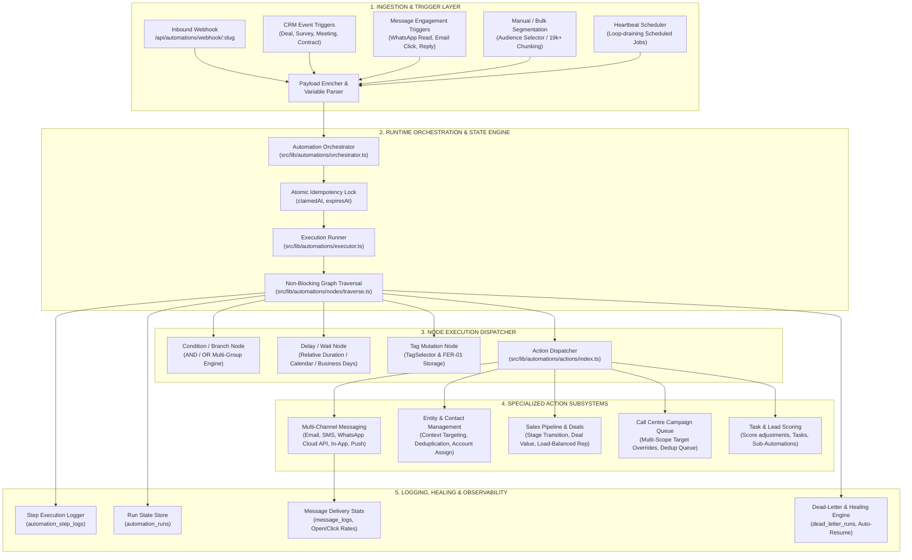

# Enterprise Automation Engine: Architectural Dossier & Current Capabilities

> **Document Version**: 2.4.0  
> **Last Updated**: August 2026  
> **Target Audience**: Systems Architects, Engineering Leads, Platform Developers  
> **Module Location**: `src/lib/automations/`, `src/app/admin/automations/`, `src/app/api/automations/`

---

## 1. Executive Summary & Current State of the Codebase

The Onboarding Dashboard Automation Engine is a distributed, event-driven workflow automation and visual flow orchestration platform. It is engineered to handle large-scale lead nurturing, multi-channel messaging (WhatsApp Cloud API, Email, SMS, Push, In-App), CRM life-cycle automation, sales pipeline stage progression, dynamic call center campaign queueing, and intelligent self-healing.

### 1.1 Core Architecture Highlights
* **Zero TypeScript Errors (`tsc --noEmit`)**: 100% strict type safety across all execution contexts, node schemas, and UI props with zero use of `any` or `any[]`.
* **Multi-Tenant Isolation**: Rigid workspace-level (`workspaceId`) and organization-level (`organizationId`) tenant boundaries enforced across all queries, triggers, and state machines.
* **Non-Blocking Resilient Traversal**: Node execution failures (e.g. invalid contact email or transient provider error) are logged non-fatally, allowing independent parallel or downstream branches to continue smoothly without aborting the entire run.
* **In-Memory Contact Deduplication**: Automatic deduplication on normalized email, E.164 phone numbers, and contact IDs prevents array explosion and duplicate queue entries across multi-target nodes.
* **Parked Contact Healing & Safety**: Double-confirmation reconciliation modal prevents orphaned parked runs on node deletion, and an automated background orphan reconciliation engine heals broken graph paths.
* **Channel-Aware Step Controls**: Granular single-node and bulk channel enable/disable toggles (Email, SMS, WhatsApp, Notifications) allow designers to bypass execution without breaking downstream flows.

---

## 2. High-Level System & Design Architecture

### 2.1 Architecture Diagram



### 2.2 Core State & Database Collections
* `automations`: Canonical flow graph definitions containing ReactFlow node and edge structures, triggers, conditions, and metadata.
* `automation_runs`: Individual execution instances tracking the contact traversing the graph, current node state (`running`, `completed`, `waiting`, `failed`, `cancelled`), and execution payloads.
* `automation_step_logs`: Granular per-step execution audit logs capturing input variables, resolved templates, provider dispatch IDs, and execution latency.
* `scheduled_jobs`: Parked wait-state documents claimed by the heartbeat scheduler for timed resumption.
* `dead_letter_runs`: Quarantine collection capturing unhandled exceptions with full payload context for one-click manual or automated replay.
* `message_logs`: Centralized message engagement logs tracking status (`sent`, `delivered`, `opened`, `read`, `clicked`, `bounced`, `failed`) across all channels.

---

## 3. Trigger Systems & Event Ingestion Pipeline

The platform supports **5 trigger paradigms**:

### 3.1 Inbound Webhook Gateway (`/api/automations/webhook/[slug]`)
* Accepts arbitrary external HTTPS POST webhooks from external CRMs, payment gateways (Stripe, Paystack), form builders, or Zapier/Make.
* Automatically resolves tenant context and runs payloads through `payload-enricher.ts` to map incoming fields (e.g. `contact_name`, `phone`, `email`) into standardized execution tokens.

### 3.2 CRM Lifecycle Event Triggers
* **Deal Stage Changed**: Triggers instantly upon deal movement between stages in sales pipelines.
* **Survey Submitted**: Triggers when an external or internal survey/form response is recorded.
* **Virtual Meeting Life-Cycle**: Triggers on `meeting_scheduled`, `meeting_started`, `meeting_completed`, or `meeting_no_show`.
* **Contract & Signature Events**: Triggers on contract viewing, signature completion, or rejection.
* **Tag Mutation Events**: Triggers when specific contact tags are added or removed.

### 3.3 Event-Driven Message Engagement Triggers
* Reacts in real-time to customer interactions received via WhatsApp and Email webhooks:
  * `whatsapp_read`: Blue checkmark read receipt received from Meta.
  * `whatsapp_replied`: Inbound text received from customer inside the 24-hour service window.
  * `email_opened` / `email_clicked` / `email_bounced`.

### 3.4 High-Capacity Manual & Segmented Enrollment
* Integrated with the **Message Composer Audience Selector Engine**.
* Supports targeting single entities, contact subsets, or **19,000+ segmented contacts** using concurrency-controlled chunking (50 contacts per batch) and GCP Cloud Tasks dispatching.

### 3.5 Time-Based Schedule Triggers
* Background heartbeat cron scheduler (`heartbeat-triggers.ts`) continuously loop-drains due jobs with concurrency limits to prevent timer drift and database socket exhaustion.

---

## 4. Action Capabilities & Subsystems

### 4.1 Multi-Channel Messaging Subsystem
* **WhatsApp Cloud API & Coexistence**:
  * Sends approved Meta templates (outside the 24h window) and freeform rich text/media (inside the 24h window).
  * Direct integration with Meta Graph API (`v21.0`) with automatic exponential backoff on HTTP 429/5xx.
  * Supports **Coexistence Mode** (WhatsApp Business App and Cloud API on the same number at 20 msg/sec).
* **Email (Transactional & Marketing via Resend)**:
  * Built-in email hygiene scoring, suppression list checks, and cryptographic one-click unsubscribe headers.
* **Direct SMS (via mNotify)**:
  * GSM 7-bit character segmentation and sender ID routing.
* **Push Notifications & In-App Alerts**:
  * Real-time notifications delivered to admin dashboard navigation and mobile devices.
* **Smart Resend Optimization**:
  * Automatically schedules alternate subject lines and preview text if an initial message is unopened (`no_open`) or unclicked (`no_click`) after a designated time window.

### 4.2 CRM Entity & Contact Automation Subsystem
* **Add Contact to Entity (`ADD_CONTACT_TO_ENTITY`)**:
  * **Automatic Context Targeting**: Automatically links contact to the traversing entity (`context.entityId`) without requiring manual string searches.
  * **Deduplication Safeguard**: Automatically checks existing contacts by normalized email, E.164 phone, or name, updating matching contacts in-place instead of creating duplicate records.
* **Update Contact (`UPDATE_CONTACT`)**:
  * Updates contact attributes, roles, and signatory flags, falling back to primary contact creation if 0 contacts exist.
* **Assign Entity (`ASSIGN_ENTITY`)**:
  * Round-robin, load-balanced, or direct assignment to workspace account managers.
  * Resolves and saves user display names (`assigneeName`) directly on visual canvas node cards.

### 4.3 Sales Pipeline & Deal Automation Subsystem
* **Deal Operations**: `CREATE_DEAL`, `UPDATE_DEAL_STAGE`, `UPDATE_DEAL_VALUE`, `UPDATE_DEAL_STATUS`.
* **Auto-Balanced Deal Assignment**: Dynamically allocates deals to sales reps based on active deal counts to ensure balanced workload distribution.

### 4.4 Call Centre & Voice Integration Subsystem
* **Add to Call Campaign (`ADD_TO_CALL_CAMPAIGN`)**:
  * Full **Target Contact Recipients** parity with the messaging inspector:
    * `Triggering Contact`, `Primary Contact`, `Campus Signatories`, `Specific Role(s)`, `All Contacts`.
  * In-memory contact deduplication prevents duplicate queue records in `call_queue_items`.

### 4.5 Workflow Control & Task Subsystem
* **Lead Scoring (`UPDATE_LEAD_SCORE`)**: Increment, decrement, or set lead scores based on interaction quality.
* **Sub-Flow Execution (`RUN_AUTOMATION`)**: Spawns nested sub-automations with recursion depth limits (`MAX_AUTOMATION_CHAIN_DEPTH = 10`).
* **Outbound Webhooks (`TRIGGER_OUTBOUND_WEBHOOK`)**: Dispatches real-time HTTPS webhooks with customizable headers and payload structures.

---

## 5. Logic, Conditions & Branching Engine

```
                     ┌────────────────────────┐
                     │   Trigger / Event      │
                     └───────────┬────────────┘
                                 │
                     ┌───────────▼────────────┐
                     │   Condition Node       │
                     │  (Group 1 AND Group 2) │
                     └─────┬────────────┬─────┘
                     TRUE  │            │  FALSE
              ┌────────────▼──┐      ┌──▼────────────┐
              │ Action Branch │      │ Action Branch │
              │ (Send WA / SMS│      │ (Update Stage)│
              └───────────────┘      └───────────────┘
```

* **Multi-Group Compound Logic (`ConditionsBuilder.tsx` & `automation-condition.ts`)**:
  * Evaluates multi-level groups with mixed `AND` and `OR` logic.
  * Supports field comparisons across contact attributes, entity custom fields, survey responses, deal values, lead scores, and message engagement history (e.g. `has_read_whatsapp_message`, `has_clicked_email_link`).
* **Tag Router (`TagNode.tsx`)**:
  * Branches contacts based on tag membership using standardized `<TagSelector>` components in draft mode.
* **Jump Engine (`jump-engine.ts`)**:
  * Allows non-linear jumps between nodes while preventing cyclic loops.

---

## 6. Scheduling, Resumption & Self-Healing Engine

* **Relative Delay**: Delay execution by minutes, hours, days, or business days.
* **Absolute Calendar Scheduling (`wait_until`)**: Parks execution until a specific timestamp or date attribute.
* **Parked Run Reconciliation & Deletion Safeguards**:
  * **Double-Confirmation on Node Deletion**: If a builder deletes a node containing parked contacts, `NodeDeletionReconcileDialog.tsx` prompts the user to either resume immediately to the next step, move to a parent node, or cancel safely.
  * **Orphan Run Repair Engine**: `OrphanedRunsCleanupModal.tsx` automatically detects orphaned runs and relinks them to the nearest valid downstream node.
* **Dead-Letter Queue (`dead-letter-service.ts`)**:
  * Quarantines failed runs, stores exact error stack traces, and provides one-click manual or bulk replay.

---

## 7. AI Capabilities & Intelligence Layer

1. **Dynamic Payload Enrichment (`payload-enricher.ts`)**:
   * Parses unstructured webhook payloads and resolves semantic parameter aliases.
2. **Smart Resend Optimization**:
   * Analyzes open/click engagement patterns and automatically rotates subject lines on `no_open` or `no_click` triggers.
3. **Inbound Sentiment & Intent Routing**:
   * Analyzes incoming WhatsApp/Email replies to detect customer intent (e.g. meeting reschedule, pricing inquiry, opt-out) and route contacts to specialized sub-flows.
4. **Behavioral Lead Scoring**:
   * Continuously adjusts lead scores based on multi-channel touchpoints to trigger immediate sales rep notifications.

---

## 8. UI & UX Design Architecture

* **Interactive Canvas (`ReactFlow` / `AutomationBuilder.tsx`)**:
  * Custom SVG node renderers with real-time execution overlay badges and animated connection edges.
  * Drag-and-drop node insertion and edge splicing.
* **Message Node Analytics Strip (`MessageNodeStatsStrip.tsx`)**:
  * Renders per-node real-time metrics: Sent count, Delivered %, Read/Open %, Click-Through Rate (CTR), and Bounces.
  * Click-to-inspect drill-down logs dialog showing individual recipient delivery timelines.
* **Diagnostics & Visual Run Timeline**:
  * `DiagnosticsPanel.tsx`: Evaluates graph health, detecting detached branches, circular loops, and missing templates.
  * `RunExecutionTimelineModal.tsx`: Visual timeline of exact step execution timestamps, payloads, and state transitions.
* **Mobile-First Responsiveness**:
  * Touch targets meet `min-h-[44px]`, smooth micro-interactions (`active:scale-[0.97]`), and responsive slide-in inspector drawers (`NodeInspector.tsx`).

---

## 9. Integration Matrix with Other Modules

| Module | Integration Mechanism | Key Capabilities |
| :--- | :--- | :--- |
| **Contacts & Entities** | FER-01 Single Source of Truth | Automatic context targeting, in-place deduplication. |
| **Messaging Hub** | WhatsApp Cloud API, Resend, mNotify | Multi-channel dispatch, template variable injection, Smart Resends. |
| **Sales Pipelines / Deals** | Stage change triggers, deal actions | Stage automation, auto-assignment load balancing. |
| **Call Centre Suite** | `ADD_TO_CALL_CAMPAIGN` | Automated queue item generation with multi-target recipient overrides. |
| **Forms & Surveys** | Variable resolver & submission triggers | Dynamic field mapping, survey submission automations. |
| **Virtual Meetings / Zoom** | Attendance & join link creation | Automated reminders, attendance tracking, no-show follow-ups. |
| **Tagging System** | `<TagSelector>` integration | Tag mutation triggers, tag conditional routing. |
| **Activity & Audit Logger** | Activity logger stream | Step execution auditing in `automation_step_logs` and `activity_log`. |

---

## 10. Expert Recommendations & Future Scaling Roadmap

| Priority | Recommendation | Architectural Rationale |
| :---: | :--- | :--- |
| **High** | **Distributed Message Queue (Redis / BullMQ / GCP Cloud Tasks Worker Pool)** | Decouples webhook ingestion from execution, scaling beyond 50,000 events/second with zero Firestore write contention. |
| **High** | **Visual Autonomous AI Agent Step** | Introduces an LLM node that dynamically decides next actions based on contact history and sentiment. |
| **Medium** | **Visual A/B Split Testing Nodes** | Enables multi-armed bandit traffic splitting between different messaging variants with automatic winning branch selection. |
| **Medium** | **Interactive Dry-Run Debugger & Sandbox Simulator** | Allows admins to simulate an automation run with mock contact data directly on the visual canvas before publishing. |
| **Low** | **Webhook Export Streams** | Streams real-time automation analytics to BigQuery, Snowflake, or Datadog. |
