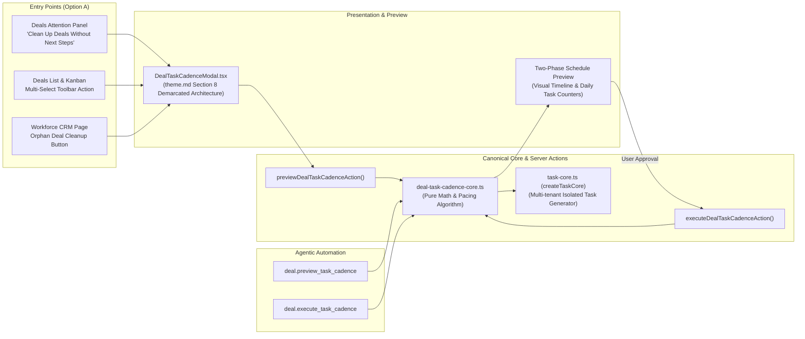

# SmartSapp CRM — Deal Task Assignment & Cadence Cleanup Engine

## Product Requirements Document, Canonical Engine Architecture & Implementation Blueprint

**Document Status:** Approved Architecture & Specification  
**Version:** 1.0  
**Product:** SmartSapp CRM Deals Platform 2.0  
**Module:** Deals & Revenue Opportunities / Workforce CRM  
**Target Scope:** Unassigned Opportunities & Deals Lacking Next Steps  
**Governance:** Conforms to `docs/agents_mcp/agents_mcp_rules.md`, `.agents/AGENTS.md`, and `theme.md` (Section 8)

---

# 1. Executive Summary & Problem Statement

### 1.1 The Operational Bottleneck
In fast-moving sales organizations, opportunities rapidly fall into two high-risk operational traps:
1. **Unassigned Deals:** Leads or opportunities ingested from inbound forms, campaigns, or acquisitions that sit unowned without a designated sales representative.
2. **Deals Without Next Steps:** Opportunities that are assigned to reps but possess **zero active operational tasks**, missing next steps, or overdue follow-ups, causing them to silently stall and breach stage SLAs.

When sales leadership attempts to clean up these backlogs, traditional CRM tools force a destructive trade-off:
- Either managers manually open and edit dozens of deals one-by-one (prohibitive cognitive drag),
- Or they perform a blunt "bulk edit" that assigns all 50 or 100 tasks on the exact same day. This creates massive **task debt** where a sales rep wakes up Monday morning with 80 calls due at 09:00 AM. Reps become demoralized, triage becomes chaotic, and high-value leads are neglected.

### 1.2 The Solution: Cadence Cleanup & Paced Task Dispatcher
The **Deal Task Assignment & Cadence Cleanup Engine** is an orchestrated bulk distribution system that takes any batch of unassigned or unattended deals and schedules tasks across business days and working hours according to:
- A user-selected or AI-synthesized **Action Template** (Discovery Call, Quote Review, Re-engagement Email, etc.).
- A strict daily capacity ceiling (**`maxFrequencyPerDay`**, e.g., 5, 10, or 15 tasks/day per rep).
- A defined **Start Date & Time** with automatic weekend skipping and business-hour interval spacing.
- An **Assignee Strategy**: Single designated rep, round-robin pool across the workspace sales team, or AI-balanced distribution based on rep capacity.
- **Atomic Deal Linkage**: Generates tasks via `createTaskCore()`, updates each deal's `nextStep` and `nextStepDueDate`, and logs an activity timeline entry so the Deals Attention Panel immediately clears the risk.

---

# 2. Conformance to `agents_mcp_rules.md` & System Invariants

This subsystem strictly adheres to every rule in `docs/agents_mcp/agents_mcp_rules.md` and the 10 Workspace Rules in `.agents/AGENTS.md`:

| Rule # | Requirement | Implementation Strategy in Cadence Engine |
| :--- | :--- | :--- |
| **Rule 4** | Strict Zero `any`/`any[]` Typing | Complete explicit TypeScript typing for configs, slots, inputs, and results. External boundaries parsed via Zod (`dealTaskCadenceConfigSchema`). |
| **Rule 7** | Mobile-First & Everyday English | Wizard designed with $\ge 44\text{px}$ touch targets, responsive touch containers, simple conversational labels without technical jargon. |
| **Rule 8** | Multi-Tenant Workspace Scoping | Every database query and task mutation is strictly filtered by `workspaceId`. Session auth verified via `adminAuth.verifyIdToken()`, authorization via `canUser(uid, 'operations', 'tasks', 'create', workspaceId)`. |
| **Rule 9** | High-Load & Batch Commit Safety | Mutations executed in deterministic chunks of $\le 250$ operations using Firestore batches. Hard ceiling of 200 deals per single cadence job run. |
| **Rule 10** | Inline Maintainer Guidance | Every file includes header comments detailing purpose, architecture, caution areas, and testability pointers. |
| **Rule 12 & 13** | Independent Security & Trust Boundaries | Server-side validation of deal ownership, rep workspace membership, and parameter sanitization. MCP annotations treated as advisory only. |
| **Rule 18 & 19** | TOCTOU Protection & Idempotency | Each cadence job produces a deterministic hash key (`cadence_${workspaceId}_${hash}`) preventing double-execution on duplicate submits. |
| **Rule 21 & 22** | Two-Phase Action Model | Phase 1 generates a read-only **Preview Schedule** showing daily task distributions and dates. Phase 2 commits after explicit user confirmation. |
| **Rule 23 & 24** | Bounded Queries & Circuit Breakers | AI analysis queries capped at 15 recent activities. Timeout circuit breaker (5000ms) with instant fallback to deterministic uniform action. |
| **Rule 69** | Canonical Layering Axiom | Pure math and pacing logic isolated in `deal-task-cadence-core.ts`. UI components and MCP tools are purely contextual adapters. |
| **Theme Section 8** | Standardized Modal Architecture | Modal uses demarcated header with `<CardInfoTooltip>`, sr-only description, demarcated footer, and tactile buttons with `active:scale-[0.97]`. |

---

# 3. Domain Models & TypeScript Schema

Located in `src/lib/deals/deal-types.ts`:

```typescript
import { z } from 'zod';

export type DealCadenceActionType = 'call' | 'email' | 'meeting' | 'review' | 'custom';
export type DealCadenceAssigneeMode = 'single' | 'round_robin' | 'ai_balanced';

export interface DealCadenceTimeSlot {
  dealId: string;
  dealTitle: string;
  dealValue: number;
  focalContactName?: string;
  focalContactEmail?: string;
  focalContactPhone?: string;
  assigneeId: string;
  assigneeName: string;
  assigneeEmail?: string;
  scheduledAt: string; // ISO 8601 string
  dayIndex: number;    // 0-indexed day relative to start
  actionTitle: string;
  actionDescription?: string;
  priority: 'low' | 'medium' | 'high' | 'urgent';
  aiRecommended?: boolean;
}

export interface DealTaskCadenceConfig {
  workspaceId: string;
  organizationId: string;
  dealIds: string[];
  actionType: DealCadenceActionType;
  taskTitle: string;
  taskDescription?: string;
  taskPriority: 'low' | 'medium' | 'high' | 'urgent';
  maxFrequencyPerDay: number; // 1 to 50 tasks per rep/day
  startDate: string;          // YYYY-MM-DD
  startTime: string;          // HH:mm (e.g., "09:00")
  intervalMinutes: number;    // e.g., 30, 45, 60 minutes between touches
  skipWeekends: boolean;      // Skip Saturday and Sunday
  assigneeMode: DealCadenceAssigneeMode;
  targetAssigneeIds: string[]; // 1 ID for 'single', 1+ IDs for 'round_robin' or 'ai_balanced'
  enableAiActionCustomization?: boolean;
}

export interface DealTaskCadencePreview {
  workspaceId: string;
  totalDeals: number;
  totalPipelineValue: number;
  totalDaysSpanned: number;
  startDate: string;
  endDate: string;
  slots: DealCadenceTimeSlot[];
  daySummaries: Array<{
    date: string;
    dayNumber: number;
    taskCount: number;
    deals: Array<{ id: string; title: string; assigneeName: string; time: string }>;
  }>;
}

export interface DealTaskCadenceExecutionResult {
  jobId: string;
  workspaceId: string;
  totalDealsProcessed: number;
  tasksCreatedCount: number;
  dealsUpdatedCount: number;
  startDate: string;
  endDate: string;
  executedAt: string;
  status: 'completed' | 'partial' | 'failed';
  errors?: string[];
}
```

---

# 4. Canonical Pacing Algorithm & Distribution Engine

Located in `src/lib/deals/deal-task-cadence-core.ts`:

### 4.1 Pacing Mathematics
Given:
- $N$ = Total deals selected
- $F$ = Maximum tasks per rep per day (`maxFrequencyPerDay`)
- $R$ = Number of active assignees in the pool ($R \ge 1$)
- $C_{day}$ = Daily team capacity = $F \times R$
- Total business days required: $D = \lceil N / C_{day} \rceil$

### 4.2 Time Slot Scheduling & Weekend Skipping
```typescript
export function computeNextWorkingDate(currentDate: Date, skipWeekends: boolean): Date {
  const next = new Date(currentDate);
  next.setDate(next.getDate() + 1);
  if (skipWeekends) {
    // 0 = Sunday, 6 = Saturday
    while (next.getDay() === 0 || next.getDay() === 6) {
      next.setDate(next.getDate() + 1);
    }
  }
  return next;
}
```

For each deal index $i \in [0, N-1]$:
1. **Day Index**: $d = \lfloor i / C_{day} \rfloor$
2. **Assignee Selection**:
   - `single`: `targetAssigneeIds[0]`
   - `round_robin`: `targetAssigneeIds[i % R]`
   - `ai_balanced`: Weighted by lowest active open task count from `CrmWorkloadService`.
3. **Time Computation**:
   - Intra-day slot index $k = \lfloor (i \pmod{C_{day}}) / R \rfloor$
   - `scheduledAt` = `dayDate` at `startTime` + $(k \times \text{intervalMinutes})$.
   - Clamped to business hours (default max 17:00).

---

# 5. AI Opportunity Intelligence & Next-Best-Action Synthesis

AI transforms this from a naive queue into an **Opportunity Acceleration Engine**:

### 5.1 Revenue-First Predictive Triage
Instead of arbitrary deal order, AI evaluates:
1. **MRR / ARR / Deal Value**: Larger deals take precedence.
2. **Stage SLA Urgency**: Deals closer to or exceeding stage SLAs receive priority.
3. **Recency of Last Touch**: Deals untouched for $>10\text{ days}$ get scheduled earlier in the cadence.

### 5.2 Dynamic Stage-Aware Next-Best-Action (NBA)
When `enableAiActionCustomization: true`, the engine queries `deal-intelligence-flow.ts` to assign contextual tasks:
- **Discovery Stage Deals:** *"Conduct ICP pain audit and sis sync verification"*
- **Proposal Stage Deals:** *"Follow up on pricing quote and contract terms review"*
- **Stalled Opportunities:** *"Deliver executive re-engagement value brief with recent case study"*

### 5.3 1-Click Execution Drafts
For every created task, the AI pre-populates `task.notes`:
- **Battlecard Summary:** Key objections, champion details, and decision timeline.
- **Pre-Drafted Outreach:** Contextual email/WhatsApp message ready to send with 1 click.

---

# 6. System Architecture & Component Placement (Option A)



### 6.1 Trigger Placement in the Product
1. **Deals Attention Panel (`DealsAttentionPanel.tsx`)**:
   - In the `"Deals Without Next Steps"` card, add a 1-click action pill:
     `[⚡ Schedule Follow-up Cadence]`. Automatically pre-fills all deals missing next steps.
2. **Pipeline List View Multi-Select Toolbar (`DealsListView.tsx`)**:
   - When 1 or more deals are checked, display `[📅 Schedule Task Cadence]` alongside bulk archive/stage buttons.
3. **Workforce CRM Allocation Control Center (`WorkforceCrmClient.tsx`)**:
   - In the Representative Allocation Table, unassigned deals can be batch-paced to selected reps directly.

---

# 7. Step-by-Step Implementation Tracking Checklist

### Phase 1: Domain Foundation & Pacing Engine
- [ ] Add `DealCadenceActionType`, `DealTaskCadenceConfig`, `DealCadenceTimeSlot`, `DealTaskCadencePreview`, and `DealTaskCadenceExecutionResult` to `src/lib/deals/deal-types.ts`.
- [ ] Implement `src/lib/deals/deal-task-cadence-core.ts`:
  - `generateCadencePreview()`: pure mathematical scheduling and slot projection.
  - `executeCadenceSchedule()`: chunked batch execution ($\le 250$ ops) with `createTaskCore()`, deal `nextStep` updates, and activity logging.
- [ ] Author comprehensive unit tests in `src/lib/deals/__tests__/deal-task-cadence-core.test.ts`.

### Phase 2: Server Actions & Two-Phase Execution
- [ ] Create `src/app/actions/deal-cadence-actions.ts`:
  - `previewDealTaskCadenceAction()`: authenticated preview with parameter validation.
  - `executeDealTaskCadenceAction()`: authenticated batch commit with TOCTOU lock.
- [ ] Add unit tests in `src/app/actions/__tests__/deal-cadence-actions.test.ts`.

### Phase 3: AI Next-Best-Action Synthesis & Triage
- [ ] Extend `src/app/actions/deal-ai-actions.ts` with `synthesizeCadenceTaskDetailsAction()`:
  - Generates deal-specific action recommendations and pre-drafted outreach notes.
  - Includes circuit breaker fallback to standard template on timeout ($<5000\text{ms}$).

### Phase 4: Standardized Modal Wizard UI
- [ ] Build `src/app/admin/pipeline/components/DealTaskCadenceModal.tsx`:
  - Standardized demarcated header with `<CardInfoTooltip>` and sr-only description.
  - Step 1: Action configuration (uniform template or AI Next-Best-Action toggle).
  - Step 2: Cadence pacing slider (`maxFrequencyPerDay`), start date, business hour limits.
  - Step 3: Interactive timeline preview showing day-by-day task buckets.
  - Standardized demarcated footer with tactile buttons ($\ge 44\text{px}$, `active:scale-[0.97]`).

### Phase 5: UI Entry Point Integration
- [ ] Wire trigger into `src/app/admin/pipeline/components/DealsAttentionPanel.tsx`.
- [ ] Wire multi-select toolbar button into `src/app/admin/pipeline/components/DealsListView.tsx` and `PipelineClient.tsx`.
- [ ] Wire shortcut into `src/app/admin/workforce/crm/WorkforceCrmClient.tsx`.

### Phase 6: Autonomous MCP Tools
- [ ] Register `deal.preview_task_cadence` and `deal.execute_task_cadence` in `src/lib/mcp/tools/deal-tools.ts`.
- [ ] Add tool schema validation and unit tests in `src/lib/mcp/__tests__/deal-cadence-mcp.test.ts`.

### Phase 7: Verification & Quality Assurance
- [ ] Run full test suites via Vitest: `pnpm vitest run src/lib/deals/__tests__/deal-task-cadence-core.test.ts`.
- [ ] Run complete type safety check: `pnpm typecheck` (zero TypeScript errors).
- [ ] Document changes in `walkthrough.md` and commit to git.
