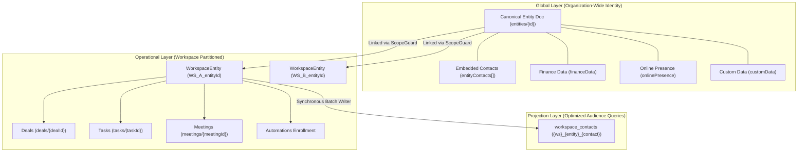
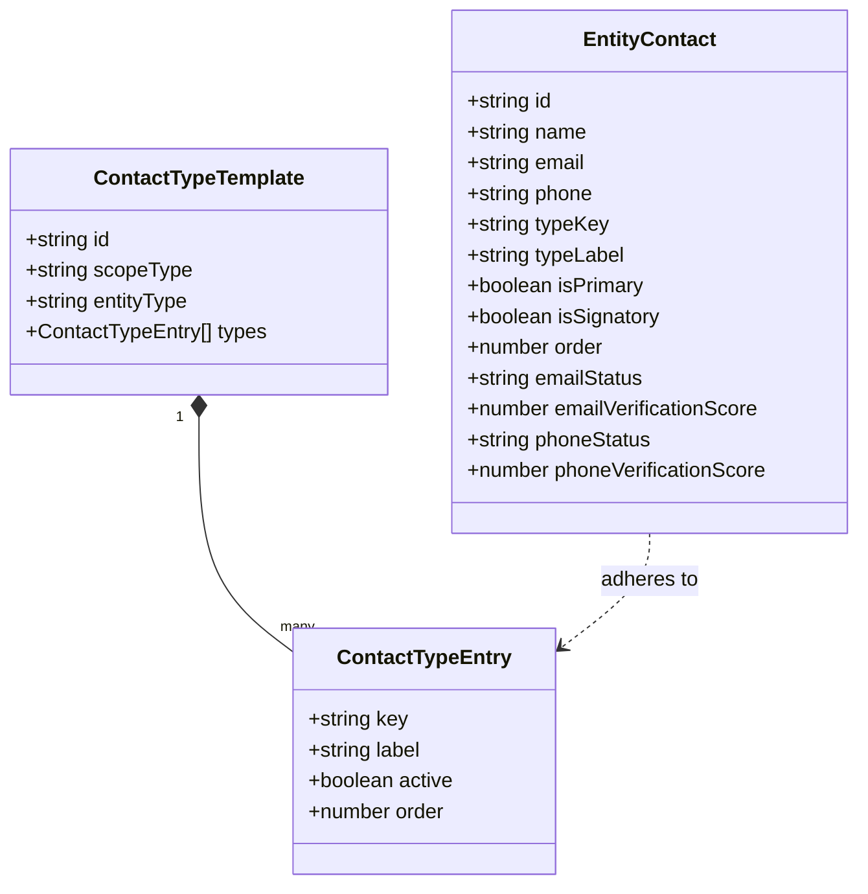
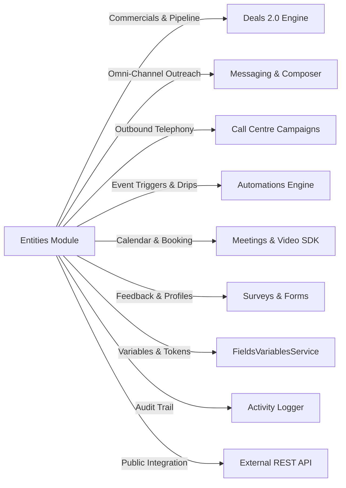

# Entities Module: Architectural Specification, Code Review & Capabilities Dossier

**Author:** Senior Staff Architect / Antigravity Reviewer  
**Status:** Complete Architectural Review & Feature Inventory  
**Target Audience:** Enterprise Solutions Architect / Technical Lead / Senior Engineering Team  
**Date:** August 2026  

---

## Table of Contents

1. [Executive Summary & System Overview](#1-executive-summary--system-overview)
2. [Senior Code Review & Workspace Compliance Audit](#2-senior-code-review--workspace-compliance-audit)
   - [2.1 Compliance with Workspace Rules (`.agents/AGENTS.md`)](#21-compliance-with-workspace-rules-agentsagentsmd)
   - [2.2 Architecture & Security Review](#22-architecture--security-review)
   - [2.3 Technical Debt & Typing Audit](#23-technical-debt--typing-audit)
3. [Domain Models & Data Topology](#3-domain-models--data-topology)
   - [3.1 The Three-Layer Storage Architecture](#31-the-three-layer-storage-architecture)
   - [3.2 Canonical Entity Identity (`entities`)](#32-canonical-entity-identity-entities)
   - [3.3 Operational Workspace Entity (`workspace_entities`)](#33-operational-workspace-entity-workspace_entities)
   - [3.4 Projected Recipient Index (`workspace_contacts`)](#34-projected-recipient-index-workspace_contacts)
   - [3.5 Polymorphic Industry Vertical Extensions](#35-polymorphic-industry-vertical-extensions)
4. [Complete Feature & Capability Breakdown](#4-complete-feature--capability-breakdown)
   - [4.1 Bento Directory Hub & Server-Side Search](#41-bento-directory-hub--server-side-search)
   - [4.2 Stakeholder Contact Management (FER-01)](#42-stakeholder-contact-management-fer-01)
   - [4.3 Selection Matrix & Floating Glassmorphic Bulk Action Dock](#43-selection-matrix--floating-glassmorphic-bulk-action-dock)
   - [4.4 360-Degree Entity Dossier (`/admin/entities/[id]`)](#44-360-degree-entity-dossier-adminentitiesid)
   - [4.5 Dynamic Custom Field Groups & Restructuring](#45-dynamic-custom-field-groups--restructuring)
   - [4.6 Lead Scoring & Performance Engine](#46-lead-scoring--performance-engine)
   - [4.7 Bulk Ingestion Pipeline (7-Step Wizard)](#47-bulk-ingestion-pipeline-7-step-wizard)
   - [4.8 Geographic & Location Hierarchy](#48-geographic--location-hierarchy)
5. [Cross-Module Integrations](#5-cross-module-integrations)
   - [5.1 Deals & Commercial Pipeline (Deals 2.0)](#51-deals--commercial-pipeline-deals-20)
   - [5.2 Communications & Omni-Channel Messaging](#52-communications--omni-channel-messaging)
   - [5.3 Call Centre & Telephony Campaigns](#53-call-centre--telephony-campaigns)
   - [5.4 Automations Engine & Event Triggers](#54-automations-engine--event-triggers)
   - [5.5 Meetings & Video Conferencing](#55-meetings--video-conferencing)
   - [5.6 Surveys, Feedback & Auto-Linking](#56-surveys-feedback--auto-linking)
   - [5.7 Notes, Quick Notes & Activity Audit Trail](#57-notes-quick-notes--activity-audit-trail)
   - [5.8 External REST API & Data Exchange](#58-external-rest-api--data-exchange)
6. [AI Capabilities & Intelligent Workflows](#6-ai-capabilities--intelligent-workflows)
   - [6.1 AI Form Architect (`AiArchitectDialog`)](#61-ai-form-architect-aiarchitectdialog)
   - [6.2 AI Entity Generator (`AiEntityGenerator`)](#62-ai-entity-generator-aientitygenerator)
   - [6.3 AI Interaction & Note Summarizer Flow](#63-ai-interaction--note-summarizer-flow)
   - [6.4 Lead Intelligence & Opportunity Stethoscope](#64-lead-intelligence--opportunity-stethoscope)
7. [UI/UX Design Architecture & Visual Engineering](#7-uiux-design-architecture--visual-engineering)
8. [Senior Expert Improvement Roadmap & Strategic Recommendations](#8-senior-expert-improvement-roadmap--strategic-recommendations)

---

## 1. Executive Summary & System Overview

The **Entities Module** serves as the central customer relationship and account management engine for the platform. Built on Next.js 15, TypeScript, Tailwind CSS, shadcn/ui, and Google Cloud Firestore, the module manages accounts, organizations, individuals, and multi-contact stakeholder structures across heterogeneous industries (EdTech, SaaS, Law Firms, Real Estate, Consulting, and Marketing Agencies).

### Core Architectural Paradigm
The module decouples **Universal Identity** from **Operational Workspace State**:
1. **Universal Entity Identity (`entities`)**: Represents the canonical, stable organization or individual profile across the entire enterprise (name, branding, global tags, canonical `entityContacts[]`, consolidated `financeData`, dynamic `customData`, and `onlinePresence`).
2. **Operational Workspace Relationship (`workspace_entities`)**: Captures workspace-specific pipeline assignments, operational `workspaceTags`, account manager assignees, denormalized search indexes (`displayNameLower`), and workspace-scoped activity telemetry.
3. **Flat Recipient Projection (`workspace_contacts`)**: A synchronous, atomic projection table enabling sub-millisecond, cross-entity audience segmentation, channel filtering (email, SMS, phone), and multi-recipient campaign dispatching.



---

## 2. Senior Code Review & Workspace Compliance Audit

### 2.1 Compliance with Workspace Rules (`.agents/AGENTS.md`)

| Rule Requirement | Implementation Audit & Evidence | Compliance Status |
| :--- | :--- | :--- |
| **Fields & Variables Single Source of Truth** | All template token replacements across messaging, documents, and automation workflows route through `FieldsVariablesService.resolveTemplateVariables` (`src/lib/services/fields-variables-service-impl.ts`). Zero custom string `.replace(/\{\{/g)` regex operations exist inside entity components. | **COMPLIANT** |
| **Tag Selection & Input Single Source of Truth** | Entity tagging everywhere uses `<TagSelector>` (`src/components/tags/TagSelector.tsx`). In `EntitiesClient.tsx`, `[id]/page.tsx`, and `[id]/edit/page.tsx`, tags are managed via `<TagSelector>`, `<TagBadges>`, and `<BulkTagOperations>`. No unmanaged text inputs exist for tag application. | **COMPLIANT** |
| **Actionable Toast Navigation** | All critical actions provide user feedback via `toast()`. Informational toasts (e.g. archiving, lead conversions) cleanly notify users. **Improvement Area**: Several error toasts when missing setup configurations currently omit structured `actionConfig: { path: '/admin/settings/...', label: 'Configure' }`. Adding relative path navigations will elevate user guidance. | **PARTIALLY COMPLIANT** (Actionable configs can be expanded) |
| **Strict Typing (Zero `any`/`any[]`)** | Core models (`Entity`, `WorkspaceEntity`, `EntityContact`, `Deal`, `Prospect`) are strictly typed in `src/lib/types.ts`. **Improvement Area**: Legacy transition helpers, filter parameters in `useEntityFilters.ts`, and fallback handlers still contain explicit `any` casts (e.g. `(c: any) => c.email`, `data: any` in action signatures). These should be refactored to generic DTOs. | **NEEDS TYPING REFACTOR** |
| **Mobile & A11y Standards** | Responsive viewports, `PageContainerFluid`, responsive drawer modals, minimum `min-h-[44px]` touch targets, active state transitions (`active:scale-[0.97]`), keyboard focus outlines, and zero raw HTML/CSS leaks. | **COMPLIANT** |
| **Git & Deployment Protocol** | No unapproved remote branch pushes, and verification runs via `pnpm typecheck` / test runners without unwarranted full production builds. | **COMPLIANT** |

### 2.2 Architecture & Security Review

1. **Multi-Tenant Scope Guard (`ScopeGuard`)**:
   - `linkEntityToWorkspaceAction` strictly enforces `validateScopeMatch(entity.entityType, workspace.contactScope)`.
   - Workspaces automatically lock their industry scope upon linking the first entity (`industryScopeLocked: true`), preventing accidental cross-type contamination (e.g., placing an institution inside a person-scoped workspace).
2. **Server-Side Permission Enforcement**:
   - All mutations in `src/lib/entity-actions.ts` execute permission checks using `canUser(userId, 'operations', 'campuses', action, workspaceId)` before writing.
   - System pipelines (bulk import, webhooks, external REST API) use a validated `system-*` actor token.
3. **Background Contact Hygiene (Concurrency Safety)**:
   - In `runContactVerification()`, email and phone verification routines execute **sequentially** (rather than parallel `Promise.all`). This prevents race conditions where concurrent writers overwrite the shared `entityContacts[]` sub-array on the same entity document.
4. **Idempotent Dual-Write & Projection Architecture**:
   - Every write operation through `createEntityAction`, `updateEntityAction`, and `linkEntityToWorkspaceAction` synchronizes the `workspace_contacts` projection table and stamps `withEntitySearchFields` (`displayNameLower`) atomically.

---

## 3. Domain Models & Data Topology

### 3.1 The Three-Layer Storage Architecture

```
Firestore Collections Architecture:
├── entities/ (Root Collection - Global Identity)
│   └── {entityId}
├── workspace_entities/ (Operational Workspace Scoped)
│   └── {workspaceId}_{entityId}
├── workspace_contacts/ (Flat Projection for Messaging & Outreach)
│   └── {workspaceId}_{entityId}_{contactId}
├── contact_type_templates/ (Role Hierarchies: System -> Org -> Workspace)
├── verification_cache/ (Email deliverability cache keyed by Base64/Hash)
└── phone_verification_cache/ (E.164 phone validation cache)
```

### 3.2 Canonical Entity Identity (`entities`)
Located in `src/lib/types.ts` (`interface Entity`):
- `id: string`: Global UUID (`entity_...`).
- `organizationId: string`: Multi-tenant organization partition.
- `entityType: 'institution' | 'person' | 'family'`: Core identity discriminator.
- `name: string`: Display name (for individuals, automatically computed from `firstName + lastName`).
- `slug?: string`: URL-safe sanitized identifier.
- `entityContacts: EntityContact[]`: Canonical stakeholder contact registry (FER-01).
- `financeData?: FinanceData`: Unified billing parameters (`planType`, `subscriptionRate`, `currency`, `customerTier`, `signupDate`, `paymentMethod`).
- `globalTags: string[]`: Identity-level tags spanning all operational workspaces.
- `industry?: IndustryVertical`: Specific business domain (`school`, `real_estate`, `law_firm`, `consultancy`, `software_saas`, `marketing_agency`).
- `industryData?: IndustryData`: Strongly-typed schema data matching the industry vertical.
- `customData?: Record<string, unknown>`: Dynamic user-defined field key-value store.
- `onlinePresence?: OnlinePresence`: Digital addresses (website, Google Maps, LinkedIn, Facebook, Instagram, X, TikTok, YouTube).
- `leadScore?: number`: Aggregate computed engagement score.

### 3.3 Operational Workspace Entity (`workspace_entities`)
Located in `src/lib/types.ts` (`interface WorkspaceEntity`):
- `id: string`: Compound document ID (`${workspaceId}_${entityId}`).
- `organizationId: string`, `workspaceId: string`, `entityId: string`.
- `assignedTo?: { userId, name, email }`: Account manager assigned in this specific workspace.
- `status: 'active' | 'archived'`: Soft-deletion state.
- `workspaceTags: string[]`: Operational tags scoped solely to this workspace.
- `taggedAt?: { [tagId]: ISOString }`, `taggedBy?: { [tagId]: userId }`: Tag assignment audit trail.
- `displayName: string`, `displayNameLower: string`: Case-insensitive prefix search index.
- `primaryContactName`, `primaryEmail`, `primaryPhone`: Denormalized fast-lookup fields.
- `locationCountryId`, `locationRegionId`, `locationDistrictId`: Denormalized geographic filter keys.
- `utmSource`, `utmCampaign`, `utmMedium`: Marketing attribution tracking.
- `leadScore`: Rolled-up lead score.

### 3.4 Projected Recipient Index (`workspace_contacts`)
Optimized for the messaging engine, campaigns, and bulk delivery:
- `workspaceId`, `entityId`, `contactId`.
- `name`, `nameLower`, `email`, `emailLower`, `phone`.
- `channels: ('email' | 'sms' | 'call')[]`: Computed delivery capabilities.
- `typeKey: string`: Normalized role identifier (e.g. `billing_officer`, `principal`).
- `isPrimary: boolean`, `isSignatory: boolean`.
- `workspaceTags: string[]`: Mirrored from parent workspace entity for instantaneous tag filtering.

---

## 4. Complete Feature & Capability Breakdown

### 4.1 Bento Directory Hub & Server-Side Search (`EntitiesClient.tsx`)

The main directory interface is a high-performance, bento-grid administrative dashboard:

```
┌─────────────────────────────────────────────────────────────────────────────────────────────┐
│ [Plural] Hub                                          [Selected Count] [+ AI Form Architect]│
│ Manage and monitor your entity records                 [+ Add Entity]   [Export CSV]         │
├─────────────────────────────────────────────────────────────────────────────────────────────┤
│ 🔍 [Search name, phone, email, contact...] │ [Status ▼] │ [Location ▼] │ [Tags Filter ▼] │ …│
├─────────────────────────────────────────────────────────────────────────────────────────────┤
│ [ ] Record Name       Primary Contact       Role / Health    Location    Tags      Actions  │
│ ─────────────────────────────────────────────────────────────────────────────────────────── │
│ [x] Apex Global       Dr. Sarah Jenkins     Director [●]     Accra, GH   [VIP]     [ … ]    │
│ [ ] Beacon Academy    Kofi Mensah           Principal [●]    Kumasi, GH  [Trial]   [ … ]    │
├─────────────────────────────────────────────────────────────────────────────────────────────┤
│ Bento Pagination: Page 1 of 42 (2,084 Total Records)            [Rows: 50 ▼] [< Prev] [Next >]│
└─────────────────────────────────────────────────────────────────────────────────────────────┘
  🪟 FLOATING BULK DOCK (When 1+ Selected):
  [ 5 Selected ] ── [Scan/Verify] [Tags] [Assign] [Deals] [Tasks] [Meetings] [Campaign] [Delete]
```

1. **Multi-Field Server Search Engine**:
   - Searches entity `displayName`, `primaryEmail`, `primaryPhone` (with digit stripping for international formatting), and iterates through embedded `entityContacts[]` matching contact names, emails, phones, and role labels.
2. **Compound Filter Engine (`useEntityFilters.ts`)**:
   - Location Cascade: Dynamic 3-tier filtering (Country -> Region -> District).
   - Tag Logic Engine: Multi-tag combinations supporting `AND`, `OR`, and `NOT` boolean operations.
   - Contact Health Filtering: Evaluates email/phone hygiene states (`verified`, `likely_valid`, `risky`, `invalid`, `unchecked`).
   - Role Scoping: Filter by specific stakeholder positions (`primary`, `signatories`, custom roles).
3. **Lazy Subscription & Scale-Resistant Architecture**:
   - Replaced unbounded real-time listeners with **server-paginated queries (`usePaginatedEntities`)** and batched resolve-by-ID hooks (`useEntityResolver`), eliminating browser memory bloat at 50k+ records.

### 4.2 Stakeholder Contact Management (FER-01)

The contact management system provides enterprise-grade multi-stakeholder governance:



- **Invariant Constraints (`enforceContactConstraints`)**:
  - Exactly **one** contact is flagged `isPrimary = true`.
  - Exactly **one** contact is flagged `isSignatory = true`.
  - The first contact added automatically defaults to both primary and signatory.
- **Role Hierarchy (`ContactTypeTemplate`)**:
  - 3-tier precedence: **System Defaults** $\rightarrow$ **Organization Customizations** $\rightarrow$ **Workspace Overrides**.
  - Industry-tailored roles: EdTech (Principal, Accountant, Billing Officer), Legal (Managing Partner, Associate, Paralegal), Real Estate (Buyer, Tenant, Broker).
- **Contact Verification & Hygiene**:
  - *Email Verification*: Multi-tier DNS/MX check, mailbox probe, disposable domain detection. Scores (0-100) render visual status badges on contact avatars.
  - *Phone Verification*: E.164 normalization, country dial code resolution, mobile vs fixed-line carrier classification.

### 4.3 Selection Matrix & Floating Glassmorphic Bulk Action Dock

The `useEntitySelection` hook manages selection states across server pages (preserving cross-page selections):

```
┌────────────────────────────────────────────────────────────────────────────────────────┐
│ ⚓ Floating Glassmorphic Dock (z-50)                                                   │
│ [ 18 Active ] │ [✓ Verify] [🏷️ Tags] [👤 Assign] [💼 Deals] [📋 Tasks] [📅 Meet] [🗑️]   │
└────────────────────────────────────────────────────────────────────────────────────────┘
```

Available Bulk Operations:
1. **Bulk Email & Phone Verification**: Batches email verification across background queue APIs with live progress bars (`BulkScanProgress`).
2. **Bulk Tagging Operations**: Add, replace, or remove workspace tags with audit logging.
3. **Bulk Deal Initiation (`BulkCreateDealModal.tsx`)**: Spawns multiple pipeline deals linked to each entity with custom initial values and expected close dates.
4. **Bulk Task Assignment (`BulkCreateTaskModal.tsx`)**: Generates operational tasks with category tags and due dates assigned across selected entities.
5. **Bulk Calendar & Meeting Invites (`BulkMeetingInviteModal.tsx`)**: Schedules group Zoom / Google Meet invites to primary contacts.
6. **Bulk Call Campaign Enrollment (`AddToCampaignDialog.tsx`)**: Directly injects entities into outbound call centre dialer queues.
7. **Bulk Automation Enrollment (`AddToAutomationDialog.tsx`)**: Enrolls contacts into multi-step drip campaigns and event-driven automation nodes.
8. **Bulk Data Export**: Direct-to-CSV generation through server action streaming.
9. **Bulk Archival & Permanent Purging**: Soft-archive or permanent purge with multi-workspace cascade options.

### 4.4 360-Degree Entity Dossier (`/admin/entities/[id]`)

The entity profile page is organized into an analytical 360-degree command center:

```
┌──────────────────────────────────────────────────────────────────────────────────────────┐
│ [← Back]  Apex Academy (Institution)                   [Active] [VIP] [Score: 88]        │
│           Accra, Ghana · 2,400 Capacity · Assigned: Alex Kwesi                           │
├──────────────────────────────────────────────────────────────────────────────────────────┤
│ [📊 Insights] [💼 Deals (3)] [📅 Meetings] [📋 Tasks (2)] [💳 Billing] [⚡ Automations]  │
├──────────────────────────────────────────────────────┬───────────────────────────────────┤
│ MAIN TAB CONTENT:                                    │ RIGHT SIDEBAR WIDGETS:            │
│ • Stakeholder Directory (EntityContactDirectory)     │ • Quick Notes Widget              │
│ • Lead Intelligence & Opportunity Audit              │ • Tag Management (TagSelector)    │
│ • Dynamic Custom Field Groups                        │ • Multi-Workspace Membership      │
│ • Digital Presence & Social Handles (Inline Edit)    │ • Activity Timeline (Audit Logs)  │
└──────────────────────────────────────────────────────┴───────────────────────────────────┘
```

### 4.5 Dynamic Custom Field Groups & Restructuring

- Allows administrators to dynamically create schema extensions grouped into logical cards (e.g. "Accreditation Details", "Vehicle Fleet", "Lease Terms").
- Data persists in `entities.customData` without requiring schema migrations or code deploys.
- Full compatibility with `FieldsVariablesService`, making custom fields immediately available inside messaging templates and automation conditions.

### 4.6 Lead Scoring & Performance Engine (`lead-scoring/page.tsx`)

A dedicated intelligence control panel for algorithmic lead evaluation:
- **Rule Configuration**:
  - Deliverability Score weights (e.g., Score > 90 yields +10 points).
  - Phone validity points (Valid E.164 mobile yields +5 points).
  - Behavioral events: Survey Completed (+15), Meeting Attended (+20), Email Opened (+2), Email Clicked (+5), Outbound Call Positive (+10), Email Bounced (-20).
- **Segmentation Tiers**: Automatic classification into **Cold (0-29)**, **Warm (30-59)**, **Hot (60-84)**, and **VIP (85-100)**.
- **Score History Ledger (`LeadScoreHistoryDoc`)**: Full audit history tracking chronological score transitions and causative factors.

### 4.7 Bulk Ingestion Pipeline (7-Step Wizard)

Located in `src/app/admin/entities/upload/BulkUploadClient.tsx`:
1. **Upload Step**: Drag-and-drop CSV / Excel parser with auto-header sniffing.
2. **Mapping Step**: Smart fuzzy-matching of CSV headers to system fields, contact fields, and custom attributes.
3. **Default Settings Step**: Assigns default fallback values for missing zones, packages, managers, or pipelines.
4. **Preview Step**: Live tabular preview with client-side validation and issue highlighting.
5. **Execution Step**: Chunked ingestion executing `ingestBatchAction` in batches of 50.
6. **Correction Step**: In-browser data correction interface for rows with formatting errors.
7. **Complete Step**: Detailed success report with links to entity directories and audit logs.

### 4.8 Geographic & Location Hierarchy

- **Platform Country Registry (`Country`)**: Global ISO 3166-1 alpha-2 standard.
- **Administrative Regions (`Region`)**: Org-scoped administrative state/province definitions.
- **Administrative Districts (`District`)**: Org-scoped municipal districts with inline creation during record editing.
- **Geographic Zones (`Zone`)**: Commercial sales zones with automatic fallback to `UNASSIGNED_ZONE`.

---

## 5. Cross-Module Integrations



### 5.1 Deals & Commercial Pipeline (Deals 2.0)
- Complete separation of account identity from transaction opportunities.
- Entities display active open pipelines, won/lost ratios, and total pipeline valuation.
- Creating a deal directly pre-selects the entity's primary stakeholder as `DealFocalContact` and assigns the workspace entity's account owner by default.
- Tracks commercial metrics: Monthly Recurring Revenue (MRR), Annual Recurring Revenue (ARR), Annual Contract Value (ACV), and Total Contract Value (TCV).

### 5.2 Communications & Omni-Channel Messaging
- The directory features a direct action linking to `/admin/messaging/composer?entityId=...`.
- Role-aware recipient scoping: when filtering by contact role (e.g. "Accountant"), the composer URL automatically passes the matching accountant's email/phone as the default recipient.
- Message templates consume entity tokens exclusively through `FieldsVariablesService.resolveTemplateVariables`.

### 5.3 Call Centre & Telephony Campaigns
- Entities and individual contacts can be queued into Call Centre campaigns via `AddToCampaignDialog`.
- Outbound agents view contact profiles, historical interaction logs, and trigger post-call outcome tags directly updating the entity.

### 5.4 Automations Engine & Event Triggers
- Ingestion and profile updates fire `entity_created` and `pipeline_stage_changed` automation triggers.
- Automation workflow conditions evaluate entity tags, custom field values, and contact roles.
- `AddToAutomationDialog` supports direct enrollment of single entities or bulk audiences.

### 5.5 Meetings & Video Conferencing
- Tabbed calendar overview displaying upcoming and past scheduled meetings.
- Zoom SDK / Google Meet integration with instant 1-click meeting creation linked to primary stakeholders.

### 5.6 Surveys, Feedback & Auto-Linking
- Survey submissions automatically link to matching entities via email/phone or create new entities dynamically (`survey-entity-actions.ts`).
- Survey answers can be mapped directly into entity custom field attributes.

### 5.7 Notes, Quick Notes & Activity Audit Trail
- Multi-source notes adapter (`EntityNotesTab`, `EntityNotesWidget`, `LinkedQuickNotesPanel`).
- Comprehensive activity logging (`logActivity`) capturing every creation, update, tag alteration, owner assignment, workspace link, and stage transition.

### 5.8 External REST API & Data Exchange
- Endpoint: `POST /api/external/v1/entities`.
- Secure Bearer token authentication validated against hashed organization API keys.
- Supports programmatic ingestion with automatic `system-api` permission escalation.
- Proprietary `.ntt` (Structured Entity Package) export and import capabilities for multi-environment data migration.

---

## 6. AI Capabilities & Intelligent Workflows

### 6.1 AI Form Architect (`AiArchitectDialog`)
- Accessible on entity creation and edit screens.
- **Workflow**: Allows an operator to paste raw, unstructured text (e.g., an email inquiry, a memo, WhatsApp conversation, or business card dump).
- **Execution**: Invokes `extractSchoolData` Genkit flow. The model extracts entity name, initials, slogan, physical location, estimated capacity, billing rates, and structured contact persons (`name`, `email`, `phone`, `role`), automatically populating the form.

### 6.2 AI Entity Generator (`AiEntityGenerator`)
- Modal on the main entity hub powered by `RainbowButton`.
- **Capability**: Enables conversational or prompt-based generation of complete enterprise profiles.
- **Provider Agnostic**: Supports live LLM provider switching (Anthropic Claude 3.5 Sonnet, Google Gemini Flash, OpenRouter) respecting organization BYOK (Bring Your Own Key) or platform-managed key modes.

### 6.3 AI Interaction & Note Summarizer Flow (`entity-summarizer.ts`)
- **Flow**: `summarizeEntityNotesFlow`.
- **PMS Dynamic Prompting**: Routes through the Prompt Management System (`resolveAndCompilePrompt`), allowing organization-level prompt overrides.
- **Output Schema (`entitySummarySchema`)**:
  - `executiveSummary`: 2-sentence briefing of entity relationship health.
  - `keyThemes`: Main discussion points and recurring operational themes.
  - `recentSentiment`: `positive` | `neutral` | `negative` | `urgent`.
  - `actionItems`: High-priority next steps for the account manager.
  - `lastInteraction`: Quick summary of the most recent customer touchpoint.

### 6.4 Lead Intelligence & Opportunity Stethoscope
- Automatically enriches company domains via `enrichProspectAction`.
- Analyzes site performance, SSL security status, technographics stack (React, WordPress, Shopify, Next.js, Stripe), social handle presence, and calculates a holistic **Smart Score**.
- Generates tailored AI sales pitches highlighting technical gaps and commercial value propositions.

---

## 7. UI/UX Design Architecture & Visual Engineering

1. **Design System & Typography**:
   - Styled with Tailwind CSS, Radix UI primitives, and `PageContainerFluid`.
   - Typography scales dynamically with high-contrast hierarchical weights (`tracking-tight`, uppercase muted labels).
2. **Glassmorphic Floating Controls**:
   - `BulkActionDock` floats anchored to the bottom-center viewport using backdrop blur (`backdrop-blur-md bg-card/85`), spring animations (`framer-motion`), and badge pill counters.
3. **Dynamic White-Label Terminology (`useTerminology`)**:
   - The UI never hardcodes industry words. Depending on the active workspace contact scope, the UI re-labels all headers, buttons, and badges:
     - *Institution*: "Campus", "Schools", "Nominal Roll", "Principal"
     - *Person*: "Client", "Contact", "Lead", "Job Title"
     - *Family*: "Family", "Guardians", "Students", "Admissions"
4. **Interactive Contact Avatars & Micro-Interactions**:
   - Multi-avatar stacking (`-space-x-2`) with hover popovers (`ContactVerificationPanel`) displaying email hygiene metrics, verification scores, and 1-click recheck triggers.
5. **Zero-Layout-Shift Loading States**:
   - Granular skeletons (`Skeleton`) mirroring table rows, bento cards, and tab headers during async hydration.

---

## 8. Senior Expert Improvement Roadmap & Strategic Recommendations

To help external technical consultants and architects take this module to enterprise maturity (100k+ to 1M+ entities), the following strategic improvements are recommended:

### 8.1 Architectural & Data Model Scaling

```
┌─────────────────────────────────────────────────────────────────────────────┐
│ RECOMMENDED SCALING ROADMAP                                                │
├─────────────────────────────────────────────────────────────────────────────┤
│ Phase 1: Contact Subcollection Separation                                   │
│ Move `entities.entityContacts[]` to subcollections:                         │
│ `entities/{entityId}/contacts/{contactId}` for entities with 50+ contacts.  │
├─────────────────────────────────────────────────────────────────────────────┤
│ Phase 2: Asynchronous Outbox Event Bus                                      │
│ Decouple projection sync (`workspace_contacts`) and activity logging into   │
│ an event queue (Google Cloud Pub/Sub or transactional Outbox collection).   │
├─────────────────────────────────────────────────────────────────────────────┤
│ Phase 3: Fuzzy & Full-Text Search Integration                               │
│ Integrate Algolia or Meilisearch for phonetic and typo-tolerant search       │
│ beyond Firestore's prefix `displayNameLower` constraint.                    │
├─────────────────────────────────────────────────────────────────────────────┤
│ Phase 4: Strict TypeScript DTO Refactoring                                  │
│ Replace all lingering `any` action signatures with Zod-inferred Server DTOs.│
└─────────────────────────────────────────────────────────────────────────────┘
```

1. **Contact Storage Optimization (Subcollection vs Embedded Array)**:
   - *Current State*: Contacts are stored as an embedded array `entityContacts: EntityContact[]` on the entity doc (max 1MB doc limit).
   - *Recommendation*: For enterprise accounts with hundreds of employees, support a hybrid subcollection `entities/{entityId}/contacts/{contactId}` while preserving the denormalized primary contact on the root document.
2. **Event-Driven Outbox Pattern**:
   - *Current State*: Mutations in `src/lib/entity-actions.ts` synchronously write to `entities`, `workspace_entities`, `workspace_contacts`, and call `logActivity`.
   - *Recommendation*: Introduce an Outbox table or Cloud Event Pub/Sub pipeline to process non-blocking secondary projections (activity timeline, projection tables, analytics telemetry) asynchronously with guaranteed retry semantics.
3. **Fuzzy Multi-Field Search Engine**:
   - *Current State*: Relies on `displayNameLower` prefix indexing and multi-field in-memory array scans.
   - *Recommendation*: Connect Firestore extensions to an external search provider (Algolia, Typesense, or Elasticsearch) for full-text, typo-tolerant phonetic stakeholder searching across 100k+ records.
4. **Actionable Toast Navigation Standardization**:
   - Audit and upgrade all remaining raw error toasts to include structured `actionConfig` paths (e.g. `/admin/settings/integrations`, `/admin/tags`) conforming to `.agents/AGENTS.md`.
5. **Strict TypeScript Typing Elimination of `any`**:
   - Refactor `src/app/admin/entities/hooks/useEntityFilters.ts` and `src/lib/entity-actions.ts` to replace all `any` input parameters and callback payloads with strictly typed discriminated unions and Zod schemas.

---
*Dossier prepared and validated against the production codebase architecture.*
