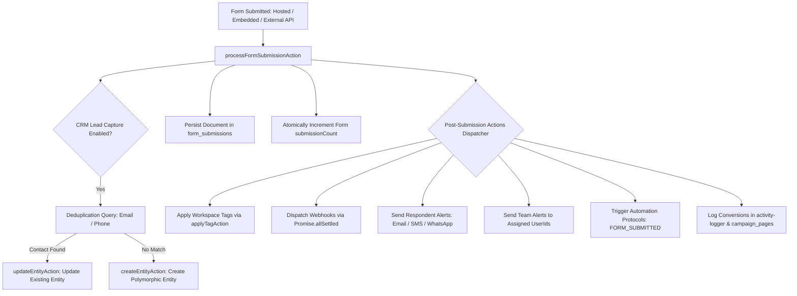

# Technical Blueprint & Comprehensive Architectural Review: Forms Module

This document provides an exhaustive, industry-grade technical blueprint and senior code review of the **Forms Module** in the Onboarding Dashboard. It covers all active capabilities, component topologies, ingestion pipelines, database schemas, integration layers, UI/UX aesthetics, identified security/performance vulnerabilities, and a strategic roadmap for future scaling.

---

## 1. Executive Summary & Core Pillars

The Forms Module is a multi-tenant, enterprise-grade form creation, rendering, and ingestion system. It provides an end-to-end framework allowing administrators to design custom data gathering structures, host them on public standalone URLs, embed them in landing pages, accept submissions from external headless frontends, and route collected data directly into CRM entities and automated workflow pipelines.

```
┌─────────────────────────────────────────────────────────────────────────────────────────────────┐
│                                    FORMS MODULE PILLARS                                         │
├──────────────────────┬──────────────────────┬───────────────────────┬───────────────────────────┤
│ 1. VISUAL BUILDER    │ 2. INGESTION & APIS  │ 3. AUTOMATION & CRM   │ 4. SUBMISSIONS & INSIGHTS │
├──────────────────────┼──────────────────────┼───────────────────────┼───────────────────────────┤
│ • 4-Step Wizard Flow │ • Standalone Hosted  │ • Polymorphic CRM     │ • Dynamic Field Columns   │
│ • Dnd-Kit Sortable   │   Routes (/p/f/)     │   Entity Resolution   │ • Safe Date Normalizer    │
│ • Real-time Logic    │ • Page Builder Embed │ • 3-Tier Alert Matrix │ • Export CSV Builder      │
│ • Theme & Sandbox    │ • Headless REST API  │ • Webhooks & Taggers  │ • Detail Drawer Panel     │
└──────────────────────┴──────────────────────┴───────────────────────┴───────────────────────────┘
```

---

## 2. Complete Subsystems & Feature Breakdown

### 2.1 The 4-Step Form Builder Wizard
Located at `src/app/admin/forms/[id]/edit/page.tsx`, the builder organizes the creation lifecycle into four structured phases:

1.  **Step 1 — Details & Scope Configuration:**
    *   **Form Type:** Selection between **Bound Forms** (strictly scoped to a contact context) and **Global Forms** (open public lead generation).
    *   **Contact Scope:** Strict binding to `institution`, `family`, or `person` entity models.
    *   **Multi-Workspace Visibility:** Toggles for cross-workspace visibility (`allowCrossVisibility`, `workspaceIds`).
    *   **SEO & Social Graph Engine:** Canonical metadata management (Meta Title, Description, Keywords, OG Images, and Twitter Card tags).
2.  **Step 2 — Builder Canvas & Visual Layout:**
    *   **Draggable Catalog (`FieldsSidebar.tsx`):** Displays available workspace `AppFields` grouped by system categories (`common`, `institution`, `family`, `person`, etc.) with instant search and status indicators.
    *   **Sortable Visual Canvas (`BuilderCanvas.tsx`):** Powered by `@dnd-kit/core` and `@dnd-kit/sortable` for vertical drag-and-drop reordering.
    *   **Properties Drawer (`PropertiesSidebar.tsx`):** Controls field instance overrides (Custom Labels, Placeholders, Help Texts, Default Values, Required toggles, Hidden toggles, and Layout Width: `full` vs `half`).
    *   **Conditional Logic Engine:** Direct rule configuration per field for dynamic interactive behaviors.
    *   **Theme Customizer:** Selection between 4 presets (`minimal`, `professional`, `card`, `embedded`), with granular control over border radius, accent colors, background opacity, CTA alignment, and button styles.
    *   **Viewport Sandbox (`ViewportToggle.tsx`):** Real-time interactive canvas scaling across **Desktop (100%)**, **Tablet (768px)**, and **Mobile (375px)** viewports.
3.  **Step 3 — Actions, CRM & Automations:**
    *   **CRM Ingestion Strategy:** Determines how submissions resolve contacts (`create_or_update`, `create_new`, or `update_matching`).
    *   **Automated Tagging:** Selection of workspace tags to automatically apply to resolved CRM entities.
    *   **External Webhook Dispatcher:** Registration of third-party API endpoints with inline payload test buttons.
    *   **Success Behavior Handler:** Configuration of post-submission presentation (Inline Modal, Full Thank You Page, or External URL Redirection with countdown delays, confetti triggers, and UTM parameter forwarding).
    *   **3-Tier Notification Matrix:** Multi-channel alert dispatching.
4.  **Step 4 — Distribution & Sharing:**
    *   **Public Direct Link:** One-click copyable standalone link (`https://domain/p/f/[slug]`).
    *   **Embed Snippet Generator:** Copyable responsive HTML `<iframe>` snippet with auto-height postMessage script.
    *   **QR Code Studio Integration:** High-resolution PNG and SVG QR code generator with download triggers.

---

### 2.2 Conditional Logic & Dependency Engine
The logic engine evaluates dynamic field display rules in real-time within `<FormRenderer>` and `<BuilderCanvas>`:
*   **Actions:** `show` | `hide`.
*   **Conditions:** `equals`, `not_equals`, `contains`, `empty`, `not_empty`.
*   **Evaluation Model:** Targets any prerequisite field (`targetFieldId`) in the form. As respondents type or select values, the dependency graph updates visibility instantly.

---

### 2.3 Standalone Hosted Public Forms (`/p/f/[slug]`)
Located at `src/app/p/f/[slug]/page.tsx`:
*   **Server-Side Rendering:** Uses React `cache()` to eliminate duplicate database calls between `generateMetadata` and page body rendering.
*   **Dynamic Theming:** Injects theme configurations (colors, card styles, button rounding) as custom CSS variables on page generation.
*   **Success Presentation:** Supports confetti celebrations (`canvas-confetti`) and smooth redirect transitions.

---

### 2.4 Page Builder & Campaign Landing Page Embeds (`<EmbeddedForm>`)
Located at `src/components/page-builder/embeds/EmbeddedForm.tsx`:
*   **Authentication Bypass:** Uses `getPublicFormDefinitionAction` Server Action via Firebase Admin SDK to fetch form schemas and active `app_fields` on public `/p/[slug]` landing pages without requiring visitor authentication.
*   **Theme Handshake:** Listens for parent window `postMessage` events, dynamically syncing theme modes (light/dark) between the landing page builder and the form iframe.
*   **Campaign Conversion Telemetry:** Passes `sourcePageId` to track conversion rates and trigger campaign-specific lifecycle tags (`source-<pageId>`).

---

### 2.5 Headless / External Form Submission REST API
Located at `src/app/api/external/forms/submit/route.ts`:
*   **Cross-Origin Resource Sharing (CORS):** Employs `Access-Control-Allow-Origin: *` to accept submissions from third-party websites (WordPress, Webflow, Shopify, custom HTML, mobile apps).
*   **Content-Type Flexibility:** Handles `application/json`, `multipart/form-data`, and `application/x-www-form-urlencoded`.
*   **Response Modes:** Returns standard JSON `{ success: true, submissionId }` for AJAX requests or executes HTTP 303 redirects when `redirectUrl` is supplied.

---

### 2.6 Dynamic Submissions Listview & Submissions Panel
Located at `src/app/admin/forms/[id]/submissions/`:
*   **Dynamic Column Matrix (`SubmissionsTable.tsx`):** Iterates over `form.fields` dynamically, rendering dedicated `<TableHead>` and `<TableCell>` columns with Title Case fallback formatting (`formatFieldLabel`).
*   **Resilient Date Parsing (`parseDateSafe`):** Sanitizes Firestore `Timestamp` instances, numeric seconds, and ISO strings, preventing client-side `RangeError` crashes.
*   **Responsive Table Container:** Employs `overflow-x-auto` with fixed minimum column widths (`min-w-[150px]`) ensuring seamless horizontal scrolling for wide forms.
*   **Submission Details Drawer (`SubmissionDrawer.tsx`):** Displays submission payloads with mapped field overrides, metadata timestamps, IP/UserAgent network telemetry, and direct deep-links to matched CRM records.

---

### 2.7 3-Tier Multi-Channel Notification Matrix
Located at `src/app/admin/forms/components/form-notification-settings.tsx`:
*   **Tier 1 — Internal Team Alerts:** Dispatches alerts to selected workspace team members (`userIds`).
*   **Tier 2 — Respondent Confirmation:** Detects email/phone fields from submitted data and fires confirmation messages to the submitter.
*   **Tier 3 — External Distribution Lists:** Forwards notification payloads to arbitrary third-party email addresses (`emailAddresses`).
*   **Omnichannel Support:** Independent template selection for **Email**, **SMS**, **WhatsApp**, **In-App Alerts**, and **Push Notifications**.
*   **Inline Template Workshop (`TemplateWorkshopSheet`):** Allows admins to build or edit messaging templates inside a modal without abandoning the form builder.

---

## 3. Architecture & Routing Topography

```
┌──────────────────────────────────────────────────────────────────────────────────────────────────┐
│                                     ROUTING TOPOGRAPHY                                           │
└────────────────────────────────────────────────┬─────────────────────────────────────────────────┘
                                                 │
      ┌──────────────────────────────────────────┼───────────────────────────────────────────┐
      ▼                                          ▼                                           ▼
[ADMIN SURFACES]                          [PUBLIC SURFACES]                           [HEADLESS API]
• `/admin/forms`                          • `/p/f/[slug]`                             • `/api/external/forms/submit`
  (Management Hub)                          (Hosted Form Landing Page)                  (CORS Ingestion Endpoint)
• `/admin/forms/[id]`                     • `/p/[slug]`
  (Form Overview Summary)                   (Campaign Page with <EmbeddedForm>)
• `/admin/forms/[id]/edit`
  (4-Step Visual Wizard)                  *Note: `/forms/[pdfId]` is dedicated to
• `/admin/forms/[id]/submissions`          PDF Document Signing & Contract Studios.
  (Dynamic Columns Listview)
```

### Key Architectural Patterns
1.  **RSC Parallel Fetching:** `/admin/forms/[id]/submissions/page.tsx` executes `Promise.all([getFormByIdAction(id), getFormSubmissionsAction(id)])` to preload metadata and records on the server, eliminating client waterfalls.
2.  **Undo/Redo History Stack:** `useFormHistory` captures canvas modifications, enabling full keyboard shortcut rollback (`Ctrl+Z`, `Ctrl+Shift+Z`).
3.  **Concurrency Conflict Protection:** Edits send a `version` attribute to `updateFormAction`. If database version > client version, it throws a concurrency conflict error.
4.  **Debounced Autosave:** A 2-second debounce timer commits dirty form state via `startSaveTransition` to maintain non-blocking UI responsiveness.

---

## 4. Database Schema Specifications

Backed by Cloud Firestore (`forms` and `form_submissions` collections):

```typescript
export interface Form {
  id: string;
  workspaceId: string;
  organizationId: string;
  internalName: string;
  title: string;
  slug: string;
  description?: string;
  seo?: SeoConfig;
  formType: 'bound' | 'global';
  contactScope?: 'institution' | 'family' | 'person';
  fields: FormFieldInstance[];
  theme: FormThemeConfig;
  successBehavior: FormSuccessBehavior;
  actions: FormSubmissionActions;
  status: 'draft' | 'published' | 'archived';
  submissionCount: number;
  workspaceIds?: string[];
  assignedUsers?: string[];
  assignmentEnabled?: boolean;
  allowResubmission?: boolean;
  allowCrossVisibility?: boolean;
  showDebugProcessingModal?: boolean;
  notifyAssignedUsers?: {
    email: boolean;
    sms: boolean;
  };
  createdAt: string;
  updatedAt?: string;
}

export interface FormFieldInstance {
  id: string; // e.g. "f_ms361ljj_1qmk"
  appFieldId: string; // Target AppField reference (e.g. "contact_name")
  labelOverride?: string;
  placeholderOverride?: string;
  helpTextOverride?: string;
  required: boolean;
  hidden: boolean;
  defaultValueOverride?: string | number | boolean;
  order: number;
  width?: 'full' | 'half';
  logicRules?: FormFieldLogicRule[];
}

export interface FormFieldLogicRule {
  id: string;
  action: 'show' | 'hide';
  condition: 'equals' | 'not_equals' | 'contains' | 'empty' | 'not_empty';
  targetFieldId: string;
  value?: string;
}

export interface FormSubmission {
  id: string;
  formId: string;
  workspaceId: string;
  organizationId: string;
  data: Record<string, unknown>; // Maps FormFieldInstance.id -> captured values
  entityId?: string; // Resolved CRM Entity reference
  sourcePageId?: string; // Originating Campaign Page ID
  ipAddress?: string;
  userAgent?: string;
  submittedAt: string;
  utmSource?: string;
  utmMedium?: string;
  utmCampaign?: string;
  utmTerm?: string;
  utmContent?: string;
}
```

---

## 5. Ingestion Pipeline & Integrations



*   **CRM Lead Engine:** Resolves matching records using phone or email. Updates existing contacts or creates new person/family/institution records based on the configured strategy (`create_or_update`, `create_new`, `update_matching`).
*   **Tagging Module (`tag-actions.ts`):** Applies tags on submission to the resolved CRM entity.
*   **Webhook Engine (`webhook-engine.ts`):** Dispatches JSON payloads in parallel to configured webhook endpoints using `Promise.allSettled` to prevent single failures from blocking other endpoints.
*   **Messaging Engine (`messaging-engine.ts`):** Dispatches respondent-facing confirmation notifications across Email, SMS, or WhatsApp channels using workspace template keys.
*   **Notification Engine (`notification-engine.ts`):** Sends internal alerts to defined team members via all configured templates (SMS, email, push, WhatsApp).
*   **Automation Processor (`automation-processor.ts`):** Triggers workspace automation blueprints mapped to the `FORM_SUBMITTED` event.
*   **Activity Logger (`activity-logger.ts`):** Logs submission audits and conversion telemetry for campaign landing pages.
*   **QR Studio (`CreateQRButton`):** Integrates directly to output QR codes pointing to public form routes.

---

## 6. UI/UX Design Standards

*   **Micro-Animations:** Employs Framer Motion layout animations for card scaling, modal entry, and stepper transition progress indicators conforming to Emil Kowalski guidelines.
*   **Render Performance Optimization:** Submissions table rows use `content-visibility: auto` to optimize repaint times during long list scroll cycles.
*   **Dynamic Code Splitting:** Heavy libraries (e.g. `canvas-confetti` animations for submission completion page) are dynamically imported (`next/dynamic`) to maintain a lightweight core package size.
*   **Mobile Touch Ergonomics:** All inputs, controls, and buttons enforce a `min-h-[44px]` touch target standard.

---

## 7. Senior Code Review: Vulnerabilities & Optimization Points

During the architectural review, five critical performance, tenant security, and code quality issues were identified:

### 1. High-Risk Memory Leak & OOM Crash in CRM Lead Deduplication
*   **Location:** `src/lib/forms-actions.ts` (lines 277–280)
*   **Vulnerability:** The action queries and downloads **all workspace entity documents** into serverless memory to perform linear array filtering:
    ```typescript
    const matchSnap = await adminDb.collection('workspace_entities')
      .where('workspaceId', '==', form.workspaceId)
      .get();
    
    const matchedDoc = matchSnap.docs.find(doc => {
      const d = doc.data();
      return (email && d.primaryEmail === email) || (phone && d.primaryPhone === phone);
    });
    ```
*   **Critique:** Workspaces with 10,000+ entities will trigger severe latency, exorbitant Firestore read costs, and Node.js Out-Of-Memory (OOM) process crashes.
*   **Resolution:** Implement parallelized, index-backed queries targeting email and phone directly:
    ```typescript
    const [emailSnap, phoneSnap] = await Promise.all([
      email ? adminDb.collection('workspace_entities')
        .where('workspaceId', '==', form.workspaceId)
        .where('primaryEmail', '==', email)
        .limit(1).get() : null,
      phone ? adminDb.collection('workspace_entities')
        .where('workspaceId', '==', form.workspaceId)
        .where('primaryPhone', '==', phone)
        .limit(1).get() : null
    ]);
    const matchedDoc = emailSnap?.docs[0] || phoneSnap?.docs[0] || null;
    ```

---

### 2. Tenant Isolation & Security Breach in Custom Fields Lookup
*   **Location:** `src/lib/forms-actions.ts` (line 751)
*   **Vulnerability:** The CSV exporter pulls the **entire** database collection of custom fields without scoping boundaries, filtering them in memory by workspace:
    ```typescript
    adminDb.collection(COLLECTIONS.APP_FIELDS).get()
    ```
*   **Critique:** Reading the entire global collection presents a severe tenant data leakage vulnerability and excessive database read overhead.
*   **Resolution:** Scope the query directly to the form's workspace:
    ```typescript
    adminDb.collection(COLLECTIONS.APP_FIELDS)
      .where('workspaceId', '==', form.workspaceId)
      .get()
    ```

---

### 3. Cursor Pagination Bug in Batch Deletions
*   **Location:** `src/lib/forms-actions.ts` (lines 146–163)
*   **Vulnerability:** Purge loop passes `startAfter(lastDoc)` after deleting `lastDoc` in the prior batch:
    ```typescript
    while (true) {
      let q = adminDb.collection(COLLECTIONS.FORM_SUBMISSIONS).where('formId', '==', id).limit(400);
      if (lastDoc) q = q.startAfter(lastDoc);
      ...
      subsSnap.docs.forEach(doc => batch.delete(doc.ref));
      await batch.commit();
      lastDoc = subsSnap.docs[subsSnap.docs.length - 1];
    }
    ```
*   **Critique:** Since `lastDoc` has been deleted, using it as a cursor offset in the next iteration fails or terminates prematurely, leaving orphaned submissions in the database.
*   **Resolution:** Query the first offset limit continuously without cursor shifts until empty:
    ```typescript
    while (true) {
      const subsSnap = await adminDb.collection(COLLECTIONS.FORM_SUBMISSIONS)
        .where('formId', '==', id)
        .limit(400).get();
      if (subsSnap.empty) break;
      const batch = adminDb.batch();
      subsSnap.docs.forEach(doc => batch.delete(doc.ref));
      await batch.commit();
    }
    ```

---

### 4. Tag Selector Single Source-of-Truth Violation
*   **Location:** `src/app/admin/forms/[id]/edit/page.tsx` (lines 1370–1378)
*   **Vulnerability:** Uses a generic `<MultiSelect>` component mapping `workspaceTags` instead of the standardized `<TagSelector>` component.
*   **Critique:** Violates workspace rule `Tag Selection & Input Single Source of Truth`.
*   **Resolution:** Replace `<MultiSelect>` with `<TagSelector>` in client/draft mode:
    ```tsx
    <TagSelector
      currentTagIds={formData.actions?.tags || []}
      onTagsChange={(tagIds) => {
        const currentActions = (formData.actions || {}) as FormSubmissionActions;
        updateField('actions', { ...currentActions, tags: tagIds });
      }}
    />
    ```

---

### 5. Architectural Pipeline Duality (`forms-actions.ts` vs `form-actions.ts`)
*   **Observation:** Submissions from `/p/f/[slug]` trigger `processFormSubmissionAction` (in `forms-actions.ts`), while embedded and headless submissions trigger `submitStandaloneFormAction` (in `form-actions.ts`).
*   **Critique:** The two pipelines have slight divergences (e.g., webhook and multi-tier notification execution is present in `processFormSubmissionAction` but omitted from `submitStandaloneFormAction`).
*   **Resolution:** Consolidate `submitStandaloneFormAction` into a single shared core pipeline so all submissions (hosted, embedded, and headless) execute identical post-submission actions.

---

## 8. Strategic Roadmap & Expansion Recommendations

1.  **AI Form Generator:** Integrate Gemini structured generation (mirroring the survey AI generator) to create complete forms from natural language prompts.
2.  **Multi-Step Stepper & Page Breaks:** Extend the builder canvas to support multi-page forms with conditional branch jumping between pages.
3.  **Real-Time Collaborative Builder:** Implement WebSockets / Yjs shared editing state to support simultaneous multi-user form editing.
4.  **Native Form Analytics Dashboard:** Add visual conversion funnel charts, field drop-off analytics, and geographic submission trends directly inside the form results view.
