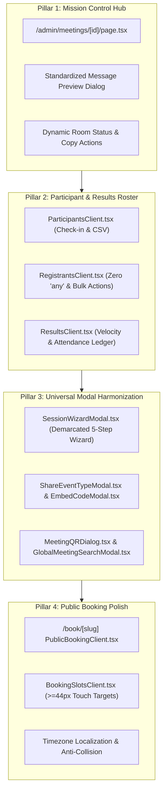

# SmartSapp Meetings 2.0: Phase 4 Master Implementation Plan
## Live Session Control Center, Multi-Role Participant Roster & End-to-End Operational Lifecycle
### Deeply Integrated with `theme.md` §8, `.agents/AGENTS.md` & `agents_mcp_rules.md`

**Version:** 1.0.0  
**Status:** PROPOSED FOR USER APPROVAL  
**Author:** Senior Principal UI/UX Architect & Staff Systems Engineer  

---

## 1. Executive Summary & Objective

With the completion of **Phase 1** (Backend Data Unification), **Phase 2** (Reactive Executive Dashboard & Zero Dummy Data), and **Phase 3** (Interactive Calendar Hub, 7-Column Month Grid & Universal Header Standard), SmartSapp Meetings 2.0 has established an airtight scheduling backbone.

**Phase 4** addresses the operational core of live sessions:
1. **Mission Control Detail Page (`/admin/meetings/[id]`)**: Transforming the session details hub into a high-performance mission control center with standardized preview modals, clean telemetry, and dynamic conferencing provider status.
2. **Multi-Role Participant Roster & Check-In Hub (`/admin/meetings/[id]/participants`, `/registrants`, `/results`)**: Providing real-time attendance tracking, no-show toggling, CSV exports, and purging legacy `as any` casts.
3. **Universal Modal Architecture Harmonization (`theme.md` §8)**: Standardizing `SessionWizardModal`, `ShareEventTypeModal`, `EmbedCodeModal`, `MeetingQRDialog`, and `GlobalMeetingSearchModal` with demarcated headers, `<CardInfoTooltip>`, and tactile buttons.
4. **Public Booking & Drop-In Ingress Verification (`/book/[slug]`)**: Ensuring responsive slot selection, timezone fidelity, double-booking prevention, and mobile touch targets $\ge 44\text{px}$.

---

## 2. Alignment with `agents_mcp_rules.md` & Design System Standards

| Rule / Standard | Requirement | Specific Alignment & Implementation Strategy |
| :--- | :--- | :--- |
| **Rule 4** | **Strict Typing & Zero `any`** | Eliminate all lingering `any` / `any[]` casts (e.g. `(meetingError || registrantsError) as any` in `RegistrantsClient.tsx`). All props and handlers strictly typed. |
| **Rule 7** | **Mobile & Accessibility First** | All action buttons, time slot chips, and table controls meet `min-h-[44px]` (or responsive `min-h-[44px] sm:min-h-[36px]`). Keyboard focus rings and screen reader `sr-only` descriptions. |
| **Rule 8** | **Security & Defensive Operations** | Defensive clipboard handling with `.then(...).catch(...)` across all share modals. Multi-tenant workspace scoping preserved. Safe relative URL navigation. |
| **Rule 9 & 10** | **Concurrency & Inline Documentation** | Debounced attendance toggling to prevent race conditions. Explanatory comments detailing architectural context and maintainer guidance. |
| **Rule 64** | **Emil Kowalski Tactile Animations** | Interactive buttons, chips, and modal triggers feature tactile feedback (`active:scale-[0.97]`). |
| **`theme.md` §8** | **Standardized Modal Architecture SSOT** | Zero raw descriptions under titles. All modals utilize `<DialogHeader demarcated>`, `<CardInfoTooltip text="..." />`, `<DialogDescription className="sr-only">`, and demarcated footers. |

---

## 3. Four Core Pillars of Phase 4

---

## 4. Detailed Implementation Tasks

### Pillar 1: Mission Control Hub (`/admin/meetings/[id]`)
- [ ] **Task 1.1: Standardize Message Preview Modal (`src/app/admin/meetings/[id]/page.tsx`)**:
  - Replace legacy phone mockup container (`border-slate-800`, `rounded-[32px]`, `bg-slate-50`) with clean `theme.md` compliant card surface.
  - Upgrade `<DialogContent>` to `border border-border/80 bg-card text-card-foreground shadow-2xl sm:rounded-2xl`.
  - Add `<DialogHeader demarcated>` with `<CardInfoTooltip text="Preview rendered message content and dispatch test alerts." />` and `<DialogDescription className="sr-only">`.
  - Add demarcated footer with tactile `active:scale-[0.97]` buttons and `min-h-[44px]` touch targets.
- [ ] **Task 1.2: Standardize Card Headers in Detail View**:
  - Convert raw descriptions in Distribution & Access, Session Controls, and Meeting Info cards to `<CardInfoTooltip>`.
  - Wrap clipboard copy actions in `.catch(...)` error handlers with user-friendly toast feedback.

### Pillar 2: Participant Roster & Attendance Check-In (`/participants`, `/registrants`, `/results`)
- [ ] **Task 2.1: Modernize `ParticipantsClient.tsx`**:
  - Remove raw `
` description under `<h2>Participant Roster</h2>` and mount `<CardInfoTooltip text="Manage hosts, facilitators, and attendees with live check-in and attendance duration tracking." />`.
  - Upgrade modal dialogs (Add Participant, Delete Confirm) to `theme.md` §8 demarcated layout.
  - Ensure all action buttons (`Sync Legacy`, `Export CSV`, role dropdowns) meet `min-h-[44px] sm:min-h-[36px]`.
- [ ] **Task 2.2: Harden `RegistrantsClient.tsx`**:
  - Eliminate `as any` cast on line 340 (`const error = (meetingError || registrantsError) as any;`) by strictly typing error message extraction.
  - Replace raw `<CardDescription>` under `<CardTitle>Registration Roster</CardTitle>` with `<CardInfoTooltip>`.
  - Ensure bulk toolbar buttons have `min-h-[36px] active:scale-[0.97]`.
- [ ] **Task 2.3: Standardize `ResultsClient.tsx`**:
  - Route descriptions in Login Velocity and Family Attendance Ledger into `<CardInfoTooltip>` with `<CardDescription className="sr-only">`.
  - Ensure `Join Active Room` CTA button and export triggers have `active:scale-[0.97]`.

### Pillar 3: Universal Modal Harmonization (`theme.md` §8)
- [ ] **Task 3.1: Upgrade `SessionWizardModal.tsx`**:
  - Add `demarcated` prop to `<DialogHeader>` and `<DialogFooter>`.
  - Remove raw `<DialogDescription>` under `<DialogTitle>`; place `<CardInfoTooltip text="Configure high-capacity webinars, workshops, or group training sessions." />` beside the title.
  - Set `<DialogDescription className="sr-only">`.
  - Ensure all session type option cards have `active:scale-[0.98]` and touch targets $\ge 44\text{px}$.
- [ ] **Task 3.2: Upgrade `ShareEventTypeModal.tsx`**:
  - Add `<DialogHeader demarcated>`, `<CardInfoTooltip text="Share booking link, generate embed iframe, or preview QR code." />`, and `<DialogDescription className="sr-only">`.
  - Wrap clipboard copy calls in `.catch(...)`.
- [ ] **Task 3.3: Upgrade `EmbedCodeModal.tsx`, `MeetingQRDialog.tsx`, and `GlobalMeetingSearchModal.tsx`**:
  - Apply `theme.md` §8 standardized modal styling and `<CardInfoTooltip>` headers.

### Pillar 4: Public Booking Experience Polish (`/book/[slug]`)
- [ ] **Task 4.1: Verify Touch Targets & UX in `BookingSlotsClient.tsx`**:
  - Ensure slot selection chips meet `min-h-[44px]` on mobile devices.
  - Ensure timezone selector provides clean search and instant offset display.
- [ ] **Task 4.2: Verify Zero `any` in `PublicBookingClient.tsx`**:
  - Verify strict typing and defensive payload parsing across booking confirmation.

---

## 5. Verification Plan

| Verification Step | Command / Tool | Success Criteria |
|---|---|---|
| **TypeScript Compilation** | `pnpm typecheck` (`tsc --noEmit`) | **0 errors** across entire project |
| **ESLint Analysis** | `pnpm eslint <files>` | **0 errors, 0 new warnings** |
| **Meetings Test Suite** | `pnpm vitest run src/lib/meetings/` | **All 145 tests pass** |
| **Platform UI Test Suite** | `pnpm vitest run src/platform/__tests__/ui/` | **All 54 tests pass** |
| **Modal Compliance Audit** | Manual Inspection | All dialogs comply with `theme.md` §8 (demarcated header, `CardInfoTooltip`, `sr-only` description, demarcated footer) |
