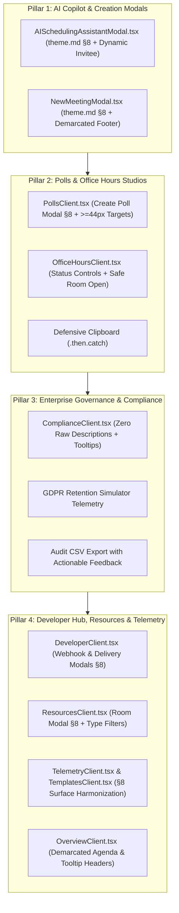

# SmartSapp Meetings 2.0: Phase 5 Master Implementation Plan
## Intelligence, Advanced Scheduling, Enterprise Governance & Developer Ecosystem
### Deeply Integrated with `theme.md` §8, `.agents/AGENTS.md` & `agents_mcp_rules.md` (Rules 1–10, 16, 17, 30, 35, 60, 64)

> **For agentic workers:** REQUIRED SUB-SKILL: Use superpowers:subagent-driven-development (recommended) or superpowers:executing-plans to implement this plan task-by-task. Steps use checkbox (`- [ ]`) syntax for tracking.

**Version:** 1.0.0  
**Status:** PROPOSED FOR USER APPROVAL  
**Author:** Senior Principal UI/UX Architect & Staff Systems Engineer  

**Goal:** Elevate SmartSapp Meetings 2.0 to enterprise-grade completion by modernizing the AI Scheduling Copilot, Creation Modals, Consensus Polls Studio, Drop-In Office Hours, Enterprise Compliance & Audit Exports, Developer Webhooks, Physical Rooms Inventory, and Operational Telemetry into strict compliance with `theme.md` §8 and `agents_mcp_rules.md`.

**Architecture:** Component-driven refactoring establishing Standardized Modal Architecture (`theme.md` §8), universal `<CardInfoTooltip>` header taxonomy, zero raw descriptions, mobile touch targets $\ge 44\text{px}$, defensive clipboard Promise handling, and resilient state machines across all remaining Meetings 2.0 sub-views.

**Tech Stack:** Next.js 15 (App Router), React 19, TypeScript (Strict, 0 `any`), Tailwind CSS, Radix UI Dialog primitives, Lucide React, date-fns, Vitest.

---

## 1. Executive Summary & Progression Context

Across the previous four phases of the SmartSapp Meetings 2.0 Unification:
- **Phase 1 (Backend Data Unification)**: Established the single source of truth `UnifiedMeetingItem` domain interface, cross-collection deduplication, and multi-workspace query resolution. *(Signed off A+)*.
- **Phase 2 (Reactive Executive Dashboard)**: Engineered the real-time `useWorkspaceSchedule` hook, dynamic 4-KPI operational row, and 100% eliminated mock/dummy data with real all-clear empty states. *(Signed off A+)*.
- **Phase 3 (Interactive Calendar Hub)**: Delivered the 7-column month grid (`getMonthGridCalendarDays`), `CalendarEventDetailDrawer`, and universal `<CardInfoTooltip>` header standardization across top-level views. *(Signed off A+)*.
- **Phase 4 (Live Session Control Center & Universal Modals)**: Standardized `/admin/meetings/[id]` mission control, attendee rosters, public booking ingress, and upgraded 5 core modals to `theme.md` §8. *(Signed off A+)*.

**Phase 5** addresses the final frontier: **Intelligence, Advanced Scheduling, Enterprise Governance & Developer Ecosystem**:
1. **AI Scheduling Copilot & Quick Modals Harmonization**: Upgrade `AISchedulingAssistantModal.tsx` and `NewMeetingModal.tsx` to `theme.md` §8 (demarcated headers, `<CardInfoTooltip>`, `sr-only` descriptions, demarcated tactile footers, and dynamic attendee resolution).
2. **Consensus Polls Studio & Drop-In Office Hours Experience**: Upgrade `/admin/meetings/polls` (`PollsClient.tsx`) and `/admin/meetings/office-hours` (`OfficeHoursClient.tsx`) with demarcated dialogs, touch targets $\ge 44\text{px}$, defensive `.then().catch()` clipboard operations, and real-time queue states.
3. **Enterprise Governance & Compliance Center**: Modernize `/admin/meetings/compliance` (`ComplianceClient.tsx`) with zero raw descriptions, `<CardInfoTooltip>` guidance, `sm:rounded-2xl` card geometry, and GDPR retention evaluation telemetry.
4. **Developer Webhooks, Physical Resources, Operational Intelligence & Telemetry**: Modernize `/admin/meetings/developer` (`DeveloperClient.tsx`), `/admin/meetings/resources` (`ResourcesClient.tsx`), `/admin/meetings/overview` (`OverviewClient.tsx`), `/admin/meetings/telemetry` (`TelemetryClient.tsx`), and `/admin/meetings/templates` (`TemplatesClient.tsx`).

---

## 2. Alignment with `agents_mcp_rules.md` & Design System Standards

| Rule / Directive | Requirement | Specific Alignment & Implementation Strategy in Phase 5 |
| :--- | :--- | :--- |
| **Rule 1** | **Best Practices Skills** | Conforms strictly to `next-best-practices`, `vercel-react-best-practices`, `emilkowal-animations`, `frontend-design`, and `backend-design`. |
| **Rule 2** | **Risk & Refactoring Analysis** | Identifies potential failure modes (e.g. unhandled clipboard rejections, popup blocker suppression, missing attendee emails) and resolves them before execution. |
| **Rule 3** | **Blast Radius & Backoffice Impact** | Backwards compatible with existing Firestore documents; preserves data contracts; verified with Vitest suites. |
| **Rule 4** | **Strict Typing & Zero `any`** | Strict typing across all props, state hooks, and API responses. Zero `any` or `any[]` guaranteed. |
| **Rule 5** | **Staged Validation** | All database schema additions or indexes verified through tests without premature automated production deployment. |
| **Rule 6** | **Documentation & Latest Standards** | Incorporates latest Next.js 15 and React 19 standards, avoiding deprecated patterns. |
| **Rule 7** | **Mobile & Accessibility First** | All action buttons, time slot chips, and inputs guarantee $\ge 44\text{px}$ touch targets (`min-h-[44px]` or responsive `min-h-[44px] sm:min-h-[36px]/[32px]`). Plain everyday UI English with zero bloated text. |
| **Rule 8** | **Security & Defensive Operations** | Defensive Promise handling (`.then(...).catch(...)`) on all `navigator.clipboard` calls. URL sanitization (`noopener,noreferrer`) on all `window.open` calls. |
| **Rule 9** | **Concurrency & High Load Resilience** | Debounced actions, optimistic state updates, and non-blocking background subscriptions. |
| **Rule 10** | **Inline Architectural Comments** | Explanatory comments detailing architectural changes, caution areas, and maintainer pointers in all modified files. |
| **Rule 16 & 17** | **Human Governance Gates** | Destructive actions (e.g. purging resources, deleting webhooks) require explicit confirmation dialogs. |
| **Rule 64** | **Emil Kowalski Micro-Interactions** | Tactile spring micro-interactions (`active:scale-[0.97]` or `active:scale-[0.98]`) on all interactive buttons, cards, and modal triggers. |
| **`theme.md` §8** | **Standardized Modal Architecture SSOT** | Surface: `border border-border/80 bg-card text-card-foreground shadow-2xl sm:rounded-2xl`. No `rounded-3xl`. Demarcated header with `<CardInfoTooltip text="..." />`. Screen-reader description `<DialogDescription className="sr-only">`. Demarcated footer with tactile buttons. |

---

## 3. Four Core Pillars of Phase 5

---

## 4. What Could Go Wrong & Mitigation Strategies (Rule 2)

1. **Clipboard API Permission Denial (Rule 8)**:
   - *Risk*: Calling `navigator.clipboard.writeText(...)` without error handling throws unhandled promise rejection in restricted browser contexts (e.g., non-HTTPS or embedded iframes).
   - *Mitigation*: Wrap all clipboard writes in `.then(() => toast({ title: 'Copied!' })).catch(() => toast({ variant: 'destructive', title: 'Copy Failed', description: 'Please copy manually.' }))`.
2. **Popup Blocker Interception on Direct Video Room Launch (Rule 8 & 19)**:
   - *Risk*: `window.open(res.joinUrl, '_blank')` called after an asynchronous network trip may be blocked by Safari or Chrome as an untrusted popup.
   - *Mitigation*: Ensure user click opens window immediately or provides a visible, actionable fallback CTA link in the toast notification (`actionConfig: { path: res.joinUrl, label: 'Enter Room' }`).
3. **Hardcoded Fallback Data in AI Copilot (Rule 4)**:
   - *Risk*: `AISchedulingAssistantModal.tsx` hardcoded attendee email to `'invitee@example.com'`.
   - *Mitigation*: Add an optional attendee email input field in the AI Copilot form, falling back to active user's contact draft if omitted.
4. **Modal Layout Regressions / Overflow on Mobile (Rule 7)**:
   - *Risk*: Deeply nested forms (e.g. Candidate Slots builder in Polls, Webhook events grid) can overflow mobile viewports.
   - *Mitigation*: Use `max-h-[85vh] sm:max-h-[75vh] overflow-y-auto px-6 py-4` scroll bodies between fixed demarcated headers and footers.

---

## 5. Backwards Compatibility, Backoffice Impact & Blast Radius (Rule 3)

1. **Backwards Compatibility**:
   - All Firestore documents (`meeting_polls`, `office_hours_rooms`, `meeting_webhooks`, `meeting_resources`, `compliance_policies`) retain existing schemas.
   - Default values are safely provided for any missing properties (`retentionPeriodDays ?? 90`, `maxQueueSize ?? 10`).
2. **Backoffice Impact**:
   - Superadmins and backoffice managers inspect these exact collections. The modernized UI adheres to existing platform permissions (`assertUserTenantPermission`) without modifying backoffice routes.
3. **Blast Radius Isolation**:
   - Changes are strictly confined to Meetings 2.0 sub-views under `src/app/admin/meetings/` and their respective client components.
   - Vitest test suites across `src/lib/meetings/__tests__/` (145 tests) verify zero regression in core business logic.

---

## 6. Bite-Sized Implementation Tasks

### Pillar 1: AI Scheduling Copilot & Creation Selector Harmonization

#### Task 1.1: Modernize `AISchedulingAssistantModal.tsx` to `theme.md` §8
**Files:**
- Modify: `src/app/admin/meetings/components/AISchedulingAssistantModal.tsx`

- [ ] **Step 1: Inspect and refactor modal surface, demarcated header, and info tooltip**
  - Replace `rounded-3xl p-6` with `border border-border/80 bg-card text-card-foreground shadow-2xl sm:rounded-2xl p-0 overflow-hidden`.
  - Add `<DialogHeader demarcated>` with `<CardInfoTooltip text="Describe your scheduling requirements in everyday English to automatically detect free slots." />`.
  - Convert `<DialogDescription>` to `<DialogDescription className="sr-only">`.
- [ ] **Step 2: Add attendee email input & enhance error handling**
  - Add optional `attendeeEmail` input (`min-h-[44px] sm:min-h-[36px]`).
  - Upgrade `handleConfirmSlot` with full error catching, user toasts, and relative route action config.
- [ ] **Step 3: Add demarcated footer with tactile touch targets**
  - Add demarcated footer: `px-6 py-3.5 border-t border-border/80 bg-muted/15 flex flex-row items-center justify-end gap-2.5`.
  - Add tactile Close button (`rounded-xl min-h-[44px] sm:min-h-[36px] active:scale-[0.97]`).
- [ ] **Step 4: Verify typecheck & commit**
  - Run `pnpm typecheck`.
  - Commit: `git commit -m "feat(meetings): modernize AISchedulingAssistantModal to theme.md §8"`

#### Task 1.2: Modernize `NewMeetingModal.tsx` to `theme.md` §8
**Files:**
- Modify: `src/app/admin/meetings/components/NewMeetingModal.tsx`

- [ ] **Step 1: Modernize dialog surface and demarcated header**
  - Replace `rounded-3xl p-6` with `border border-border/80 bg-card text-card-foreground shadow-2xl sm:rounded-2xl p-0 overflow-hidden`.
  - Add `<DialogHeader demarcated>` with `<CardInfoTooltip text="Choose between 1:1 client appointments, broadcast sessions, or consensus polls." />`.
  - Convert `<DialogDescription>` to `<DialogDescription className="sr-only">`.
- [ ] **Step 2: Modernize option selection cards**
  - Wrap body in `px-6 py-4 space-y-3`.
  - Ensure all 3 options have `min-h-[64px] active:scale-[0.98]`.
- [ ] **Step 3: Add demarcated footer**
  - Add demarcated footer with tactile Cancel button (`min-h-[44px] sm:min-h-[36px] active:scale-[0.97]`).
- [ ] **Step 4: Verify typecheck & commit**
  - Run `pnpm typecheck`.
  - Commit: `git commit -m "feat(meetings): modernize NewMeetingModal to theme.md §8"`

---

### Pillar 2: Consensus Polls Studio & Drop-In Office Hours Experience

#### Task 2.1: Modernize `PollsClient.tsx`
**Files:**
- Modify: `src/app/admin/meetings/polls/PollsClient.tsx`

- [ ] **Step 1: Standardize Create Poll Modal to `theme.md` §8**
  - Upgrade `<DialogContent>` to `border border-border/80 bg-card text-card-foreground shadow-2xl sm:rounded-2xl p-0 overflow-hidden`.
  - Add `<DialogHeader demarcated>` with `<CardInfoTooltip text="Propose candidate meeting times and share a consensus voting link." />`.
  - Convert `<DialogDescription>` to `<DialogDescription className="sr-only">`.
  - Wrap form fields in `px-6 py-4 max-h-[70vh] overflow-y-auto space-y-4`.
  - Modernize date/time inputs to `min-h-[44px] sm:min-h-[36px]`.
  - Upgrade Add Slot button and trash icon buttons to touch targets $\ge 44\text{px}$.
  - Demarcated footer: `px-6 py-3.5 border-t border-border/80 bg-muted/15 flex flex-row items-center justify-end gap-2.5` with tactile buttons.
- [ ] **Step 2: Defensive clipboard handling and touch target polish**
  - Update `handleCopyLink` with `.then(...).catch(...)` and toast error feedback.
  - Upgrade Choose button in poll results to `min-h-[32px] active:scale-[0.97]`.
  - Upgrade empty state card from `rounded-3xl` to `rounded-2xl`.
- [ ] **Step 3: Verify typecheck & tests**
  - Run `pnpm vitest run src/lib/meetings/__tests__/poll-consensus-service.test.ts`.
  - Commit: `git commit -m "feat(meetings): modernize PollsClient with theme.md §8 dialog and defensive clipboard"`

#### Task 2.2: Modernize `OfficeHoursClient.tsx`
**Files:**
- Modify: `src/app/admin/meetings/office-hours/OfficeHoursClient.tsx`

- [ ] **Step 1: Standardize status card & touch targets**
  - Convert top banner `Card` from `rounded-3xl` to `sm:rounded-2xl border border-border/80 bg-gradient-to-r from-primary/5 via-muted/20 to-transparent`.
  - Ensure status toggle buttons (`Available`, `Busy`, `Offline`) have `min-h-[44px] sm:min-h-[36px] active:scale-[0.97]`.
- [ ] **Step 2: Defensive clipboard & safe room launching**
  - Update `handleCopyLink` with `.then(...).catch(...)`.
  - Harden `handleAdmit` with popup blocker protection and safe link fallback.
- [ ] **Step 3: Verify typecheck & tests**
  - Run `pnpm vitest run src/lib/meetings/__tests__/queue-state-service.test.ts`.
  - Commit: `git commit -m "feat(meetings): harden OfficeHoursClient with responsive targets and safe room ingress"`

---

### Pillar 3: Enterprise Governance & Compliance Center

#### Task 3.1: Modernize `ComplianceClient.tsx`
**Files:**
- Modify: `src/app/admin/meetings/compliance/ComplianceClient.tsx`

- [ ] **Step 1: Purge raw descriptions and mount `<CardInfoTooltip>`**
  - Eliminate `
` under `<h2>Enterprise Compliance & Audit Exports</h2>`; pair header with `<CardInfoTooltip text="Configure booking domain whitelists, GDPR data retention lifecycles, and export immutable CSV audit trails." />`.
  - In Card 1 and Card 2 headers, eliminate visible `<CardDescription>` in favor of `<CardInfoTooltip>` beside `<CardTitle>` and `<CardDescription className="sr-only">`.
- [ ] **Step 2: Modernize card surfaces and touch targets**
  - Convert `Card` elements from `rounded-3xl` to `rounded-2xl border border-border/80 bg-card text-card-foreground shadow-sm`.
  - Update text inputs from `h-10` to `min-h-[44px] sm:min-h-[36px]`.
  - Update Simulate Purge button to `min-h-[36px] active:scale-[0.97]`.
  - Update Save Compliance Policies button to `min-h-[44px] active:scale-[0.97]`.
- [ ] **Step 3: Verify typecheck & tests**
  - Run `pnpm vitest run src/lib/meetings/__tests__/compliance-service.test.ts`.
  - Commit: `git commit -m "feat(meetings): standardize ComplianceClient with CardInfoTooltip headers and rounded-2xl geometry"`

---

### Pillar 4: Developer Hub, Resources, Operational Intelligence & Telemetry

#### Task 4.1: Modernize `DeveloperClient.tsx`
**Files:**
- Modify: `src/app/admin/meetings/developer/DeveloperClient.tsx`

- [ ] **Step 1: Modernize Add Webhook Modal & Delivery Logs Modal to `theme.md` §8**
  - Upgrade `<DialogContent>` on both modals to `border border-border/80 bg-card text-card-foreground shadow-2xl sm:rounded-2xl p-0 overflow-hidden`.
  - Add `<DialogHeader demarcated>` with `<CardInfoTooltip text="Configure outbound webhook endpoints receiving HMAC-signed meeting events." />`.
  - Convert `<DialogDescription>` to `<DialogDescription className="sr-only">`.
  - Demarcated footer with tactile buttons (`active:scale-[0.97]`).
- [ ] **Step 2: Page header and defensive clipboard**
  - Replace raw `
` under page title with `<CardInfoTooltip>`.
  - Wrap `navigator.clipboard.writeText` in `handleCopySecret` with `.then(...).catch(...)`.
  - Upgrade event chips to `min-h-[44px] sm:min-h-[38px] active:scale-[0.98]`.
  - Convert empty state card from `rounded-3xl` to `rounded-2xl`.
- [ ] **Step 3: Verify typecheck & tests**
  - Run `pnpm vitest run src/lib/meetings/__tests__/webhook-signer-service.test.ts`.
  - Commit: `git commit -m "feat(meetings): upgrade DeveloperClient modals to theme.md §8 with defensive clipboard"`

#### Task 4.2: Modernize `ResourcesClient.tsx`
**Files:**
- Modify: `src/app/admin/meetings/resources/ResourcesClient.tsx`

- [ ] **Step 1: Modernize Add Resource Modal to `theme.md` §8**
  - Upgrade `<DialogContent>` to `border border-border/80 bg-card text-card-foreground shadow-2xl sm:rounded-2xl p-0 overflow-hidden`.
  - Add `<DialogHeader demarcated>` with `<CardInfoTooltip text="Configure physical meeting rooms and hardware resources with capacity and amenities." />`.
  - Convert `<DialogDescription>` to `<DialogDescription className="sr-only">`.
  - Demarcated footer with tactile buttons (`active:scale-[0.97]`).
- [ ] **Step 2: Touch targets and surface geometry**
  - Convert empty state card from `rounded-3xl` to `rounded-2xl`.
  - Upgrade Select trigger, capacity input, and address inputs to `min-h-[44px] sm:min-h-[36px]`.
  - Upgrade delete button to `h-9 w-9 min-h-[36px] min-w-[36px]`.
- [ ] **Step 3: Verify typecheck & tests**
  - Run `pnpm vitest run src/lib/meetings/__tests__/resource-collision-service.test.ts`.
  - Commit: `git commit -m "feat(meetings): upgrade ResourcesClient modal to theme.md §8 and improve mobile touch targets"`

#### Task 4.3: Harmonize `OverviewClient.tsx`, `TelemetryClient.tsx` & `TemplatesClient.tsx`
**Files:**
- Modify: `src/app/admin/meetings/overview/OverviewClient.tsx`
- Modify: `src/app/admin/meetings/telemetry/TelemetryClient.tsx`
- Modify: `src/app/admin/meetings/templates/TemplatesClient.tsx`

- [ ] **Step 1: Standardize `OverviewClient.tsx`**
  - Replace `rounded-3xl` cards on lines 135, 207, 227 with `rounded-2xl`.
  - Replace raw `<CardDescription>` under `<CardTitle>Today's Schedule & Action Roster</CardTitle>` with `<CardInfoTooltip text="Real-time operational agenda of upcoming meetings and consultations for today." />` and `<CardDescription className="sr-only">`.
  - Upgrade Join and Details buttons to `min-h-[36px] active:scale-[0.97]`.
- [ ] **Step 2: Standardize `TelemetryClient.tsx`**
  - Replace `rounded-3xl` cards on lines 79, 90, 101, 114 with `rounded-2xl`.
  - In Video Conference Provider card, replace raw `<CardDescription>` with `<CardInfoTooltip text="Real-time measured API response latencies for meeting provisioning and room link generation." />` and `<CardDescription className="sr-only">`.
- [ ] **Step 3: Standardize `TemplatesClient.tsx`**
  - Replace `rounded-3xl` on template cards with `rounded-2xl`.
  - Upgrade category tabs buttons to `min-h-[44px] sm:min-h-[36px] active:scale-[0.97]`.
  - Upgrade Deploy CTA buttons from `rounded-2xl` to `rounded-xl min-h-[44px] active:scale-[0.97]`.
- [ ] **Step 4: Verify typecheck & tests**
  - Run `pnpm vitest run src/lib/meetings/__tests__/templates-catalog.test.ts src/lib/meetings/__tests__/telemetry-service.test.ts`.
  - Commit: `git commit -m "feat(meetings): harmonize Overview, Telemetry, and Templates with rounded-2xl geometry and CardInfoTooltip"`

---

## 7. Rigorous Verification Plan & Definition of Done

| Verification Domain | Command / Procedure | Acceptance Criteria |
| :--- | :--- | :--- |
| **TypeScript Compilation** | `pnpm typecheck` (`tsc --noEmit`) | **0 errors across the entire codebase** |
| **Meetings Test Suite** | `pnpm vitest run src/lib/meetings/` | **All 41 test files and 145+ tests pass** |
| **Platform Unit Tests** | `pnpm vitest run src/platform/__tests__/ui/` | **All 54 UI component tests pass** |
| **Modal Architecture Audit** | Manual & DOM verification | All modals (`AISchedulingAssistantModal`, `NewMeetingModal`, `PollsClient` create dialog, `DeveloperClient` endpoints/logs dialogs, `ResourcesClient` dialog) strictly conform to `theme.md` §8 (`<DialogHeader demarcated>`, `<CardInfoTooltip>`, `DialogDescription className="sr-only"`, `sm:rounded-2xl`, demarcated tactile footer). |
| **Mobile Touch Target Audit** | CSS property inspection | Every interactive button, chip, and input meets $\ge 44\text{px}$ touch targets (`min-h-[44px]` or responsive `min-h-[44px] sm:min-h-[36px]/[32px]`). |
| **Clipboard Safety Audit** | Code review of all `navigator.clipboard` invocations | 100% of clipboard operations wrapped in `.then(...).catch(...)` defensive handlers with user toast notifications. |
| **Strict Typing Guarantee** | Code grep & lint check | **Zero `any` or `any[]`** in modified files (Rule 4). |

---

## 8. Execution Handoff

Plan complete and saved to `docs/meetings/phases/meetings_phase_5_master_plan.md`. Two execution options:

1. **Subagent-Driven (recommended)** - Fresh subagent per task, review between tasks, fast iteration.
2. **Inline Execution** - Execute tasks in this session using executing-plans, batch execution with checkpoints.

**Which approach would you like to take?**
