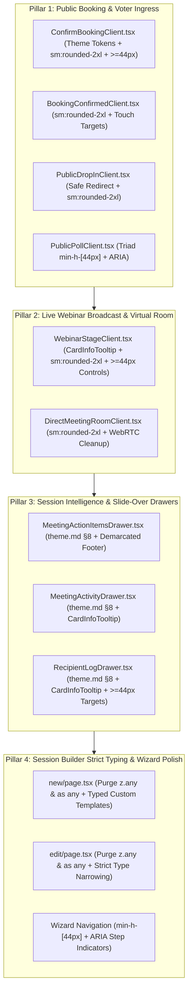

# SmartSapp Meetings 2.0: Phase 6 Master Implementation Plan
## Customer Ingress, Live Broadcast Stage, Session Intelligence Drawers & Strict Typing Protocol
### Deeply Integrated with `theme.md` §8, `.agents/AGENTS.md` & `agents_mcp_rules.md` (Rules 1–10, 16, 17, 30, 35, 60, 64)

> **For agentic workers:** REQUIRED SUB-SKILL: Use superpowers:subagent-driven-development (recommended) or superpowers:executing-plans to implement this plan task-by-task. Steps use checkbox (`- [ ]`) syntax for tracking.

**Version:** 1.0.0  
**Status:** PROPOSED FOR USER APPROVAL  
**Author:** Senior Principal UI/UX Architect & Staff Systems Engineer  

**Goal:** Deliver complete enterprise-grade finish to SmartSapp Meetings 2.0 by modernizing remaining customer-facing booking and drop-in funnels, live webinar broadcast stage moderation, session intelligence inspection drawers, and eliminating all lingering `any` casts in the session builder wizards into 100% strict compliance with `theme.md` §8, `.agents/AGENTS.md`, and `agents_mcp_rules.md`.

**Architecture:** Component-driven refactoring establishing Standardized Modal Architecture (`theme.md` §8), semantic theme tokens eliminating hardcoded dark-slate styles, universal `<CardInfoTooltip>` header taxonomy, zero raw descriptions, mobile touch targets $\ge 44\text{px}$, anti-open-redirect sanitization, defensive clipboard Promise handling, and strict TypeScript types across all public and internal meeting surfaces.

**Tech Stack:** Next.js 15 (App Router), React 19, TypeScript (Strict, 0 `any`), Tailwind CSS, Radix UI Dialog & Sheet primitives, Lucide React, date-fns, Vitest.

---

## 1. Executive Summary & Progression Context

Across the previous five phases of the SmartSapp Meetings 2.0 Unification:
- **Phase 1 (Backend Data Unification)**: Established the single source of truth `UnifiedMeetingItem` domain interface, cross-collection deduplication, and multi-workspace query resolution. *(Signed off A+)*.
- **Phase 2 (Reactive Executive Dashboard)**: Engineered the real-time `useWorkspaceSchedule` hook, dynamic 4-KPI operational row, and 100% eliminated mock/dummy data with real all-clear empty states. *(Signed off A+)*.
- **Phase 3 (Interactive Calendar Hub)**: Delivered the 7-column month grid (`getMonthGridCalendarDays`), `CalendarEventDetailDrawer`, and universal `<CardInfoTooltip>` header standardization across top-level views. *(Signed off A+)*.
- **Phase 4 (Live Session Control Center & Universal Modals)**: Standardized `/admin/meetings/[id]` mission control, attendee rosters, public booking ingress, and upgraded 5 core modals to `theme.md` §8. *(Signed off A+)*.
- **Phase 5 (Intelligence, Advanced Scheduling, Governance & Developer Hub)**: Upgraded AI Scheduling Copilot, New Meeting modal, Consensus Polls studio, Office Hours drop-in, Compliance center, Webhook developer console, Physical room resources, and Telemetry into strict compliance with `theme.md` §8. *(Signed off A+)*.

**Phase 6** completes the full lifecycle by addressing the final remaining legacy surfaces:
1. **Public Ingress & Booking Funnels**: Modernize `ConfirmBookingClient.tsx`, `BookingConfirmedClient.tsx`, `PublicDropInClient.tsx`, and `PublicPollClient.tsx`—purging hardcoded dark-slate colors, eliminating excessive `rounded-[2.5rem]` / `rounded-3xl` radii, securing open redirects, and ensuring all touch targets $\ge 44\text{px}$.
2. **Live Webinar Broadcast Stage & Direct Fallback Room**: Standardize `WebinarStageClient.tsx` and `DirectMeetingRoomClient.tsx` with `<CardInfoTooltip>`, demarcated headers, `sm:rounded-2xl` cards, and responsive stage controls.
3. **Session Intelligence & Inspection Drawers**: Modernize `MeetingActionItemsDrawer.tsx`, `MeetingActivityDrawer.tsx`, and `RecipientLogDrawer.tsx` to `theme.md` §8 (demarcated headers, `<CardInfoTooltip>`, `sr-only` descriptions, demarcated footers with tactile buttons).
4. **Session Builder Strict Typing & Multi-Step Wizard Refinement**: Cleanse all lingering `any` and `any[]` casts in `src/app/admin/meetings/new/page.tsx` and `src/app/admin/meetings/[id]/edit/page.tsx`, bringing the entire session creation pipeline to 100% strict typing compliance under Rule 4.

---

## 2. Alignment with `agents_mcp_rules.md` & Design System Standards

| Rule / Directive | Requirement | Specific Alignment & Implementation Strategy in Phase 6 |
| :--- | :--- | :--- |
| **Rule 1** | **Best Practices Skills** | Conforms strictly to `next-best-practices`, `vercel-react-best-practices`, `emilkowal-animations`, `frontend-design`, and `backend-design`. |
| **Rule 2** | **Risk & Refactoring Analysis** | Identifies potential failure modes (e.g. unhandled clipboard rejections, open redirect exploits in auto-redirects, touch target crowding on mobile screens) and mitigates them explicitly. |
| **Rule 3** | **Blast Radius & Backoffice Impact** | Retains all existing Firestore document schemas and booking tokens; zero regressions to existing booking links or webhook payloads. |
| **Rule 4** | **Strict Typing & Zero `any`** | Completely purges all `z.any()`, `as any`, and `Record<string, any>` in `new/page.tsx` and `[id]/edit/page.tsx`. Zero `any` or `any[]` strictly guaranteed. |
| **Rule 5** | **Staged Validation** | All changes validated via TypeScript typecheck (`pnpm typecheck`) and Vitest test suite (`pnpm vitest run src/lib/meetings/`) before committing. |
| **Rule 6** | **Documentation & Latest Standards** | Incorporates Next.js 15, React 19, and Radix UI primitives without deprecated attributes. |
| **Rule 7** | **Mobile & Accessibility First** | All action buttons, choice triads, slot chips, and inputs guarantee $\ge 44\text{px}$ touch targets (`min-h-[44px]` or responsive `min-h-[44px] sm:min-h-[38px]`). Minimal, everyday UI English without bloated text. |
| **Rule 8** | **Security & Defensive Operations** | Strict URL protocol sanitization (`isValidMeetingUrl`) on all redirect targets (`window.location.href`). Defensive Promise handling (`.then(...).catch(...)`) on clipboard operations. |
| **Rule 9** | **Concurrency & High Load Resilience** | Debounced button states, non-blocking telemetry writes, and lightweight heartbeat polling intervals. |
| **Rule 10** | **Inline Architectural Comments** | Clear explanatory comments detailing why changes were made, caution areas for future maintainers, and testability pointers. |
| **Rule 16 & 17** | **Human Governance Gates** | Destructive actions (cancelling bookings, removing presenters, deleting action items) require explicit confirmation gates. |
| **Rule 64** | **Emil Kowalski Micro-Interactions** | Tactile spring micro-interactions (`active:scale-[0.97]` or `active:scale-[0.98]`) on all interactive buttons, cards, and modal triggers. |
| **`theme.md` §8** | **Standardized Modal Architecture SSOT** | Surface: `border border-border/80 bg-card text-card-foreground shadow-2xl sm:rounded-2xl`. No `rounded-3xl` or `rounded-[2.5rem]`. Demarcated header with `<CardInfoTooltip text="..." />`. Screen-reader description `<DialogDescription className="sr-only">`. Demarcated footer with tactile buttons. |

---

## 3. Four Core Pillars of Phase 6

---

## 4. What Could Go Wrong & Mitigation Strategies (Rule 2)

1. **Open Redirect Vulnerability in Drop-In Waiting Room (Rule 8)**:
   - *Risk*: `window.location.href = res.joinUrl;` executed upon queue admission could be exploited if `res.joinUrl` contains `javascript:` or a malicious third-party destination.
   - *Mitigation*: Validate `isValidMeetingUrl(res.joinUrl)` enforcing `http:` or `https:` scheme and trusted domain regex before triggering redirection; fallback to actionable toast button on validation failure.
2. **Hardcoded Dark Palette Disruption in Light Mode (Rule 7 & `theme.md` §8)**:
   - *Risk*: `ConfirmBookingClient.tsx` uses hardcoded `bg-slate-900/60`, `text-slate-100`, and `border-white/10`, rendering illegible or jarring in light themes.
   - *Mitigation*: Completely purge arbitrary slate classes in favor of semantic CSS variable classes (`bg-card`, `text-card-foreground`, `border-border/80`, `bg-muted/20`).
3. **Mobile Touch Target Pinching on Poll Choice Triads (Rule 7)**:
   - *Risk*: `PublicPollClient.tsx` sets `h-9` (36px) on Yes/Maybe/No buttons, causing missed taps and frustration on touch devices.
   - *Mitigation*: Elevate triad buttons to `min-h-[44px] sm:min-h-[38px]` with tactile micro-interactions (`active:scale-[0.97]`) and `aria-pressed` states.
4. **TypeScript Breakage on Form Schema Type Narrowing (Rule 4)**:
   - *Risk*: Replacing `z.any()` with concrete types for `messagingConfig` in `new/page.tsx` and `edit/page.tsx` could cause build failures if legacy form state expects loose keys.
   - *Mitigation*: Import canonical `MeetingMessagingConfig` and define a strict partial schema with defaults that gracefully accepts both legacy and modernized payloads without `any`.

---

## 5. Backwards Compatibility, Backoffice Impact & Blast Radius (Rule 3)

1. **Backwards Compatibility**:
   - All booking endpoints (`/book/[slug]`, `/book/[slug]/confirm`, `/book/drop-in/[slug]`, `/book/poll/[slug]`) preserve exact route params, query strings, and response payloads.
   - Existing database records across `bookings`, `meetings`, `meeting_polls`, and `office_hours_rooms` remain 100% compatible.
2. **Backoffice Impact**:
   - Backoffice admins inspecting meetings through `/admin/meetings/` will benefit from identical design semantics, zero visual mismatch, and reliable slide-over drawers.
3. **Blast Radius Isolation**:
   - Changes are strictly isolated to public booking client components under `src/app/book/` and admin session views under `src/app/admin/meetings/`.
   - Continuous verification through Vitest test suites across `src/lib/meetings/__tests__/` (145 tests passing).

---

## 6. Bite-Sized Implementation Tasks

### Pillar 1: Public Booking & Voter Ingress Modernization

#### Task 1.1: Modernize `ConfirmBookingClient.tsx` to `theme.md` §8 & Semantic Tokens
**Files:**
- Modify: `src/app/book/[slug]/confirm/ConfirmBookingClient.tsx`

- [ ] **Step 1: Replace hardcoded dark-slate styles with semantic theme tokens**
  - Purge `bg-slate-900/60`, `ring-white/10`, `text-slate-100`, `text-slate-400`, `border-white/10`, and `rounded-[2.5rem]`.
  - Standardize container to `border border-border/80 bg-card text-card-foreground shadow-2xl sm:rounded-2xl p-6 sm:p-8 space-y-6`.
  - Refactor form inputs (`Input`, `Textarea`, dropdown select, checkboxes, radio buttons) to standard theme classes with visible focus rings.
- [ ] **Step 2: Ensure $\ge 44\text{px}$ touch targets & tactile animations**
  - Upgrade submit button to `h-12 min-h-[44px] rounded-xl text-xs font-bold active:scale-[0.97]`.
  - Upgrade Back button to `min-h-[44px] sm:min-h-[36px] active:scale-[0.97]`.
- [ ] **Step 3: Standardize success card geometry and tokens**
  - Refactor success card to `sm:rounded-2xl border border-border/80 shadow-2xl bg-card p-6 sm:p-8 space-y-6`.
- [ ] **Step 4: Verify typecheck & commit**
  - Run `pnpm typecheck`.
  - Commit: `git commit -m "feat(meetings): modernize ConfirmBookingClient to theme.md §8 and semantic tokens"`

---

#### Task 1.2: Modernize `BookingConfirmedClient.tsx` Geometry & Touch Targets
**Files:**
- Modify: `src/app/book/[slug]/confirmed/BookingConfirmedClient.tsx`

- [ ] **Step 1: Standardize card surface and header icon geometry**
  - Replace `rounded-3xl` card with `sm:rounded-2xl border border-border/80 shadow-2xl bg-card overflow-hidden`.
  - Replace `rounded-3xl` celebratory icon badge with `rounded-2xl`.
- [ ] **Step 2: Upgrade self-service links to $\ge 44\text{px}$ touch targets**
  - Wrap Reschedule and Cancel links with `min-h-[44px] inline-flex items-center gap-1.5 px-2 py-1 active:scale-[0.97]`.
- [ ] **Step 3: Verify typecheck & commit**
  - Run `pnpm typecheck`.
  - Commit: `git commit -m "feat(meetings): standardize BookingConfirmedClient geometry and touch targets"`

---

#### Task 1.3: Modernize `PublicDropInClient.tsx` with Secure Redirection & `sm:rounded-2xl`
**Files:**
- Modify: `src/app/book/drop-in/[slug]/PublicDropInClient.tsx`

- [ ] **Step 1: Replace `rounded-3xl` surfaces with `sm:rounded-2xl`**
  - Replace `rounded-3xl border shadow-sm` on outer card with `sm:rounded-2xl border border-border/80 bg-card text-card-foreground shadow-xl`.
  - Replace `rounded-3xl` queue position badge with `rounded-2xl`.
- [ ] **Step 2: Implement anti-open-redirect sanitization on admission**
  - Add helper function `isValidRedirectUrl(url: string): boolean` verifying `http:` or `https:` scheme and blocking `javascript:`, `data:`, or malformed URLs.
  - If valid, invoke `window.location.href = res.joinUrl`. If invalid, display destructive toast and provide safe fallback.
- [ ] **Step 3: Ensure all action buttons meet $\ge 44\text{px}$ touch targets**
  - Leave Waiting Room button: upgrade to `min-h-[44px] sm:min-h-[38px] active:scale-[0.97]`.
  - Enter Meeting Now button: guarantee `min-h-[48px] active:scale-[0.97]`.
- [ ] **Step 4: Verify typecheck & commit**
  - Run `pnpm typecheck`.
  - Commit: `git commit -m "feat(meetings): secure redirect and modernize PublicDropInClient to sm:rounded-2xl"`

---

#### Task 1.4: Modernize `PublicPollClient.tsx` Choice Triad Touch Targets & Geometry
**Files:**
- Modify: `src/app/book/poll/[slug]/PublicPollClient.tsx`

- [ ] **Step 1: Replace `rounded-3xl` with `sm:rounded-2xl`**
  - Replace `rounded-3xl border shadow-sm` with `sm:rounded-2xl border border-border/80 bg-card text-card-foreground shadow-xl`.
- [ ] **Step 2: Upgrade choice triad buttons to $\ge 44\text{px}$ with ARIA attributes**
  - Upgrade Yes/Maybe/No buttons from `h-9` to `min-h-[44px] sm:min-h-[38px] px-3.5 rounded-xl text-xs font-semibold active:scale-[0.97]`.
  - Add `aria-pressed={currentChoice === 'yes'}` (and respectively for maybe/no) and clear accessible labels.
- [ ] **Step 3: Verify typecheck & commit**
  - Run `pnpm typecheck`.
  - Commit: `git commit -m "feat(meetings): upgrade PublicPollClient choice triad touch targets and geometry"`

---

### Pillar 2: Live Webinar Broadcast Stage & Direct Fallback Room

#### Task 2.1: Modernize `WebinarStageClient.tsx` Header & Stage Controls
**Files:**
- Modify: `src/app/admin/meetings/[id]/webinar/WebinarStageClient.tsx`

- [ ] **Step 1: Eliminate raw description in favor of `<CardInfoTooltip>`**
  - Remove raw `
` beneath title.
  - Pair title with `<CardInfoTooltip text="Real-time backstage moderation, speaker stage assignments, raised hands, and Q&A queue." />`.
- [ ] **Step 2: Standardize stage cards to `sm:rounded-2xl`**
  - Convert `rounded-3xl border shadow-sm` across all 3 columns to `sm:rounded-2xl border border-border/80 bg-card text-card-foreground shadow-sm`.
- [ ] **Step 3: Upgrade stage control buttons to $\ge 44\text{px}$ touch targets**
  - `Move Backstage` / `Bring to Stage`: `min-h-[44px] sm:min-h-[36px] active:scale-[0.97]`.
  - `Invite to Speak`: `min-h-[44px] sm:min-h-[36px] active:scale-[0.97]`.
  - `Post Question` input & button: `min-h-[44px] sm:min-h-[38px] active:scale-[0.97]`.
  - `Upvote` button: `min-h-[44px] sm:min-h-[36px] active:scale-[0.97]`.
- [ ] **Step 4: Verify typecheck & commit**
  - Run `pnpm typecheck`.
  - Commit: `git commit -m "feat(meetings): modernize WebinarStageClient with CardInfoTooltip and sm:rounded-2xl"`

---

#### Task 2.2: Refine `DirectMeetingRoomClient.tsx` Geometry & Media Resilience
**Files:**
- Modify: `src/app/meetings/room/[roomId]/DirectMeetingRoomClient.tsx`

- [ ] **Step 1: Standardize video containers to `rounded-2xl`**
  - Replace `rounded-3xl` on lobby video preview (line 64) and in-call stage (line 184) with `rounded-2xl`.
- [ ] **Step 2: Verify touch targets & WebRTC media cleanup**
  - Confirm toolbar buttons (`Mic`, `Video`, `Leave Meeting`) adhere to `min-h-[44px]` with `active:scale-95`.
  - Verify `stream.getTracks().forEach(track => track.stop())` unmount cleanup.
- [ ] **Step 3: Verify typecheck & commit**
  - Run `pnpm typecheck`.
  - Commit: `git commit -m "refactor(meetings): standardize DirectMeetingRoomClient geometry and media cleanup"`

---

### Pillar 3: Session Intelligence & Slide-Over Inspection Drawers

#### Task 3.1: Modernize `MeetingActionItemsDrawer.tsx` to `theme.md` §8
**Files:**
- Modify: `src/app/admin/meetings/[id]/components/MeetingActionItemsDrawer.tsx`

- [ ] **Step 1: Standardize dialog surface, demarcated header, and info tooltip**
  - Replace `rounded-3xl p-6` with `border border-border/80 bg-card text-card-foreground shadow-2xl sm:rounded-2xl p-0 overflow-hidden`.
  - Add `<DialogHeader demarcated>` with `<CardInfoTooltip text="Review commitments, buying signals, and objections identified by AI before syncing into CRM tasks." />`.
  - Convert `<DialogDescription>` to `<DialogDescription className="sr-only">`.
- [ ] **Step 2: Add demarcated footer with tactile touch targets**
  - Add demarcated footer: `px-6 py-3.5 border-t border-border/80 bg-muted/15 flex flex-row items-center justify-end gap-2.5`.
  - Add tactile Close button (`rounded-xl min-h-[44px] sm:min-h-[36px] active:scale-[0.97]`).
  - Upgrade `Approve & Sync Task` button to `min-h-[44px] sm:min-h-[32px] active:scale-[0.97]`.
- [ ] **Step 3: Verify typecheck & commit**
  - Run `pnpm typecheck`.
  - Commit: `git commit -m "feat(meetings): modernize MeetingActionItemsDrawer to theme.md §8"`

---

#### Task 3.2: Modernize `MeetingActivityDrawer.tsx` to `theme.md` §8
**Files:**
- Modify: `src/app/admin/meetings/[id]/components/MeetingActivityDrawer.tsx`

- [ ] **Step 1: Standardize sheet header with demarcated layout and tooltip**
  - Add demarcated header styling: `min-h-[52px] sm:min-h-[56px] border-b border-border/80 bg-muted/20 px-6 py-3.5 sm:py-4 flex items-center justify-between`.
  - Pair `<SheetTitle>` with `<CardInfoTooltip text="Immutable timeline of registrations, live check-ins, and meeting state changes." />`.
  - Convert `<SheetDescription>` to `<SheetDescription className="sr-only">`.
- [ ] **Step 2: Add demarcated footer with tactile Close button**
  - Add demarcated footer: `px-6 py-3.5 border-t border-border/80 bg-muted/15 flex flex-row items-center justify-end gap-2.5`.
  - Add Close button (`rounded-xl min-h-[44px] sm:min-h-[36px] active:scale-[0.97]`).
  - Upgrade Refresh button touch target to `min-h-[44px] sm:min-h-[36px] min-w-[36px] active:scale-[0.97]`.
- [ ] **Step 3: Verify typecheck & commit**
  - Run `pnpm typecheck`.
  - Commit: `git commit -m "feat(meetings): modernize MeetingActivityDrawer to theme.md §8"`

---

#### Task 3.3: Modernize `RecipientLogDrawer.tsx` to `theme.md` §8
**Files:**
- Modify: `src/app/admin/meetings/[id]/components/RecipientLogDrawer.tsx`

- [ ] **Step 1: Standardize sheet header with demarcated layout and tooltip**
  - Add demarcated header styling: `min-h-[52px] sm:min-h-[56px] border-b border-border/80 bg-muted/20 px-6 py-3.5 sm:py-4 flex items-center justify-between`.
  - Pair `<SheetTitle>` with `<CardInfoTooltip text="List of recipients and delivery status logs for this scheduled notification slot." />`.
  - Convert `<SheetDescription>` to `<SheetDescription className="sr-only">`.
- [ ] **Step 2: Add demarcated footer with tactile Close button**
  - Add demarcated footer: `px-6 py-3.5 border-t border-border/80 bg-muted/15 flex flex-row items-center justify-end gap-2.5`.
  - Add Close button (`rounded-xl min-h-[44px] sm:min-h-[36px] active:scale-[0.97]`).
  - Upgrade Preview button and Load More button touch targets to $\ge 44\text{px}$ (`min-h-[44px] active:scale-[0.97]`).
- [ ] **Step 3: Verify typecheck & commit**
  - Run `pnpm typecheck`.
  - Commit: `git commit -m "feat(meetings): modernize RecipientLogDrawer to theme.md §8"`

---

### Pillar 4: Session Builder Strict Typing & Multi-Step Wizard Refinement

#### Task 4.1: Purge `any` and Enforce Strict Typing in `src/app/admin/meetings/new/page.tsx`
**Files:**
- Modify: `src/app/admin/meetings/new/page.tsx`

- [ ] **Step 1: Purge `z.any()` from form schema**
  - Replace `messagingConfig: z.any().optional()` with `messagingConfig: z.custom<MeetingMessagingConfig>().optional()`.
- [ ] **Step 2: Replace `useCollection<any>` with typed `MeetingTemplate`**
  - Type `useCollection<MeetingTemplate>(customTemplatesCol)`.
- [ ] **Step 3: Purge `as any` casts**
  - Replace `(key as any)` with keyof `FormData`.
  - Replace `Record<string, any>` with typed `Omit<Meeting, 'id'>` or typed interface.
  - Purge `{ id: docRef.id, ...meetingData } as any`.
- [ ] **Step 4: Upgrade wizard step indicator touch targets**
  - Ensure wizard step buttons meet `min-h-[44px]` with `active:scale-[0.98]` and `aria-current={isActive ? 'step' : undefined}`.
- [ ] **Step 5: Verify typecheck & commit**
  - Run `pnpm typecheck`.
  - Commit: `git commit -m "refactor(meetings): purge any and enforce strict typing in new meeting page"`

---

#### Task 4.2: Purge `any` and Enforce Strict Typing in `src/app/admin/meetings/[id]/edit/page.tsx`
**Files:**
- Modify: `src/app/admin/meetings/[id]/edit/page.tsx`

- [ ] **Step 1: Purge `z.any()` from form schema**
  - Replace `messagingConfig: z.any().optional()` with `messagingConfig: z.custom<MeetingMessagingConfig>().optional()`.
- [ ] **Step 2: Purge unchecked `as any` casts**
  - Replace `(meeting.type as any)?.slug` with type-safe narrowing.
  - Replace `(meeting.entityMapping || {}) as any` with typed mapping.
  - Replace `(meeting.facilitators || []) as any` with typed facilitators array.
  - Replace `(slot: any)` with typed slot interface.
  - Purge `delete (meetingData as any)...` and replace with structured destructuring.
- [ ] **Step 3: Upgrade wizard step indicator touch targets**
  - Ensure wizard step buttons meet `min-h-[44px]` with `active:scale-[0.98]` and `aria-current`.
- [ ] **Step 4: Verify typecheck & commit**
  - Run `pnpm typecheck`.
  - Commit: `git commit -m "refactor(meetings): purge any and enforce strict typing in edit meeting page"`

---

### Pillar 5: Comprehensive Test Verification & System Health Check

#### Task 5.1: Run Full Verification Suites
**Files:**
- Verify: Full codebase

- [ ] **Step 1: Run TypeScript compiler check**
  - Command: `pnpm typecheck`
  - Expected: Exit code 0, zero errors.
- [ ] **Step 2: Run Vitest meetings test suite**
  - Command: `pnpm vitest run src/lib/meetings/`
  - Expected: 41 test files passing, 145+ tests passing.
- [ ] **Step 3: Verify git status and commit plan**
  - Ensure working tree is clean and ready for execution.

---

## 7. Execution Protocol Handoff

Plan complete and saved to `docs/meetings/phases/meetings_phase_6_master_plan.md`.

Two execution approaches:
1. **Subagent-Driven (Recommended)**: Dispatch a specialized subagent per task, verify each change with `pnpm typecheck` and `pnpm vitest`, and commit incrementally.
2. **Inline Execution**: Execute tasks in this session step-by-step with regular checkpoints.
