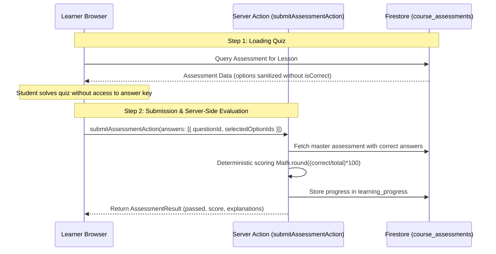

# Phase 4: Learning Engine (LMS Capabilities) — Production Implementation Plan

> **Platform Dependency Chain:**
> **Phase 0 (Architecture & Platform Prep) [COMPLETED]** → **Phase 1 (Experience Portal Core) [COMPLETED]** → **Phase 2 (Content Engine & Block Studio) [COMPLETED]** → **Phase 3 (Identity, Access & Membership Engine) [COMPLETED]** → **Phase 4 (Learning Engine / LMS) [ACTIVE]** → **Phase 5 (Community Engine) [NEXT]** → **Phase 6 (Onboarding & Engagement)**.
>
> **For agentic workers:** REQUIRED SUB-SKILL: Use `superpowers:subagent-driven-development` or `superpowers:executing-plans` to execute this plan task-by-task. Steps use trackable checkbox (`- [ ]`) syntax.

---

## 1. Executive Summary & Module Foresight

The SmartSapp Experience Platform has successfully engineered and delivered:
1. **Phase 1 (Experience Portal Core)**: Branded runtime shell, Figtree typography tokens, dynamic CSS variable system (`var(--portal-primary)`), persistent responsive navigation, theme toggle, and search modal.
2. **Phase 2 (Content Engine & Block Studio)**: Universal `ContentItem` AST, full-screen distraction-free `ContentEditorModal` with drag-and-drop sortable canvas (`@dnd-kit`), categorized block palette, deferred property inspector, AST plain-text search index synchronization, no-code starter templates, and dual-mode `PortalContentReaderClient`.
3. **Phase 3 (Identity, Access & Membership Engine)**: Server-enforced entitlement paywalls (`<PortalAccessGate>`), server-side teaser block truncation (`sanitizeContentItemForVisitor`), dedicated branded auth suite (`/portal/[slug]/auth/*`), member command center dashboard, 1-click tier switching, and standardized `<TagSelector>` integration.

### The Core Mandate of Phase 4
With our content engine, block studio, and multi-tier membership access governance fully operational, our courses currently suffer from three critical architectural gaps:
1. **Cramped Curriculum Management & Disconnected Block Studio**:
   Instructors currently manage courses in a cramped slide-over drawer (`CurriculumBuilderDrawer.tsx`) without drag-and-drop hierarchy reordering. More importantly, lessons only support plain text notes—instructors cannot use the rich Block Studio built in Phase 2 (video canvas, checklists, step guides, interactive accordion FAQs, callouts, downloadable toolkits) to author rich pedagogical lessons.
2. **Missing Drip Release Enforcement**:
   While `ReleaseRule` types exist in TypeScript, there is no runtime evaluation engine on server or client. Learners can navigate directly to any lesson URL regardless of enrollment date or prerequisite completion.
3. **Missing Course Entitlement Gates**:
   Courses do not evaluate membership plan tier locks (`requiredPlanIds`), allowing unenrolled or lower-tier visitors to bypass monetization rules.

**Phase 4 transforms SmartSapp into an enterprise-grade Learning Management System (LMS).** It establishes:
1. **Full-Screen Curriculum & Lesson Studio Modal (`CurriculumEditorModal.tsx`)**: An industry-grade distraction-free 2-pane workspace replacing the cramped drawer. Features a sortable curriculum hierarchy tree on the left and a dual-mode Lesson Inspector & Block Studio on the right.
2. **Direct Block Studio Lesson Authoring**: Instructors can author rich multimedia lessons using our full 3-pane Block Builder (`ContentBlockCanvas`, `ContentBlockPalette`, `ContentBlockInspector`) persisting structured `blocks: PageBlock[]` directly to `CourseLesson`.
3. **Drip Release Engine (`ReleaseScheduleService`)**: Server- and client-side chronological and milestone unlock evaluation (`immediate`, `specific_date`, `days_after_enrollment`, `days_after_join`, `sequential_prerequisite`).
4. **Focused Learning Player Upgrades (`PortalCoursePlayerClient.tsx`)**:
   - Dual-mode lesson rendering: renders structured `BlockRenderer` when blocks exist; falls back to markdown.
   - Polite **Drip Lock Screen** (`<LessonDripLockCard>`) preventing premature access with countdown timers and prerequisite prompts.
   - Syllabus rail lock indicators (`🔒`) and active lesson tracking (`currentLessonId`).
5. **Course Landing Page Entitlement Gate (`PortalCourseOverviewClient.tsx`)**:
   - Tier-restricted course paywall prompts (`🔒 Included with Pro Membership - Upgrade to Enroll`).
   - 1-Click **"Resume Learning (Lesson X: Title)"** for active enrollments.
6. **Automated Completion & Assessment Engine**: Video percentage thresholds, quiz pass evaluations, retake policies, and instant answer explanations without answer key leakage.

---

## 2. 10 Mandatory Architectural & Production Standards

Every phase and line of code must strictly conform to these 10 principles:

1. **Skill Conformance & Standards Enforcement**:
   - `next-best-practices`: Dynamic lazy-loading (`next/dynamic`) for heavy canvas, `@dnd-kit`, and modal components to protect initial page bundle. Explicit RSC boundaries in `/portal/[slug]/learn/*`.
   - `vercel-react-best-practices`:
     - `rerender-memo`: Memoize sortable module and lesson items with `React.memo` to eliminate cascading re-renders during active drag.
     - `rerender-functional-setstate`: Use functional updater forms (`setLessons(prev => ...)`) for stable callbacks.
     - `rerender-use-deferred-value`: Defer inspector input updates (`useDeferredValue`) so high-frequency typing never blocks 60fps canvas painting.
     - `rendering-content-visibility`: Apply `content-visibility: auto; contain-intrinsic-size: 1px 120px;` to syllabus items and lesson blocks to prevent layout lag on courses with 100+ lessons.
   - `emilkowal-animations`:
     - `PointerSensor` activation constraints (`activationConstraint: { distance: 5 }`) to distinguish intentional drag from clicks.
     - Suppress iframe pointer events during drag (`isDragging ? 'pointer-events-none' : ''`) so mouse capture is never lost over video players.
     - Standard tactile feedback (`active:scale-[0.97]` on all buttons, duration $\le 200\text{ms}$).
   - `backend-design`:
     - Fetch-Enrich-Restore protocol: fetch item, synthesize AST search plain text, validate payload bounds (500KB cap), restore/persist atomically.
     - Multi-tenant isolation (`organizationId`, `portalId`, `workspaceIds`).
   - `frontend-design`:
     - Unified Figtree typography across studio canvas and learner player.
     - Dynamic portal CSS variables (`var(--portal-primary)`, `var(--portal-text)`, `var(--portal-bg)`, `var(--portal-surface)`).
     - Refined editorial feel, subtle hover boundaries, intuitive drag handles, clear empty state cards.
2. **What Could Go Wrong & Systematic Resolutions**: All failure modes, edge cases, and quota bounds mapped in the Risk Matrix below.
3. **Cross-Subsystem Impact & No-Code Backoffice Governance**: Reader, search, member dashboard, and resource vault protected. Backoffice empowered with no-code curriculum management, plan tier associations, and drip scheduling without touching code.
4. **Strict Typing Standard**: Strictly 0 `any`, 0 `any[]`, 0 unhandled `unknown`. Clean everyday UI English ("Modules", "Lessons", "Curriculum", "Drip Schedule", "Start Learning", "Resume Course", "Knowledge Quiz", "Mark as Complete"). Zero raw HTML or CSS leakage.
5. **Firebase Indexes, Security Rules & Protocols**: Firestore rules permit public read for published courses and lessons; writes strictly guarded by `if isAuthorized()`. Progress and enrollments guarded per learner. Composite indexes verified.
6. **Dependencies & Documentation**: Modern tooling (`@dnd-kit/core`, `@dnd-kit/sortable`, `@dnd-kit/utilities`) properly configured. Latest documentation consulted via Context7 MCP.
7. **Mobile-First & Touch Ergonomics**: `min-h-[44px]` touch targets, responsive sheets on mobile, 1-tap "Move Up / Move Down" buttons as a fail-safe mobile alternative to dragging.
8. **Security & Data Protection**: DOMPurify HTML sanitization, URL protocol validation (`http:`, `https:` only), rejection of embedded base64 data URIs. Quiz answer key (`isCorrect: true`) stripped before sending questions to student clients; scoring evaluated purely server-side.
9. **Performance Under Extreme Load**: Support courses with 100+ lessons, heap memory management (8GB max-old-space-size for tsc), 500 KB block payload cap, chunked batch writes (< 500 ops per commit) during cascade deletions.
10. **Inline Architectural Documentation**: Explanatory comments detailing change rationales, caution zones, and testability pointers.

---

## 3. What Could Go Wrong & Production Mitigations (Risk Matrix)

| Risk / Failure Mode | Likelihood & Impact | Architectural Mitigation Strategy |
|:---|:---|:---|
| **1. Drip Schedule Direct-URL Bypass** | **High / Critical** | A clever learner inspects syllabus slug patterns and types `/portal/[slug]/learn/[courseSlug]/locked-lesson-slug` directly into the address bar to bypass drip locks. <br/>**Mitigation**: Implement `ReleaseScheduleService.evaluateLessonRelease` on both client player and server actions. When `isLocked === true`, the player withholds `videoUrl`, `blocks`, and completion actions, rendering the polite `<LessonDripLockCard>` instead. `completeLessonAction` also checks release status server-side. |
| **2. Quiz Answer Key Leaks Over Wire** | **High / Critical** | If `course_assessments` is fetched directly on the client, students can open browser DevTools network tab and view `options.isCorrect: true` to cheat on quizzes. <br/>**Mitigation**: In learner-facing queries, project `options` to `{ id, text }`, omitting `isCorrect`. `submitAssessmentAction` performs server-side grading and returns the score, passing status, and explanations after submission. |
| **3. Ghost Lessons on Module Deletion & Batch Overload** | **Medium / High** | Instructor deletes a module containing 50+ lessons; Firestore throws batch limit error or leaves orphaned lessons in `course_lessons`. <br/>**Mitigation**: `CourseService.deleteModule` queries all child lessons (`where('moduleId', '==', moduleId)`), chunks them into batches of 400 operations, and deletes them atomically while updating `totalLessonCount` on the course. |
| **4. Block Studio AST Desynchronization in Lessons** | **Medium / High** | Instructor authors rich blocks in the lesson editor, but `content` plain text is not updated, breaking search and fallback rendering in legacy apps. <br/>**Mitigation**: `CourseService.updateLesson` and `createLesson` automatically run `ContentService.extractPlainTextFromBlocks(blocks)` to update `lesson.content` synchronously whenever `blocks` are saved. |
| **5. Mobile Touch Jitter During Curriculum Reordering** | **Medium / Medium** | Mobile scrolling inadvertently triggers lesson dragging, reordering lessons by accident. <br/>**Mitigation**: Drag handles are strictly isolated to `GripVertical` icons with `TouchSensor` delay (`delay: 150, tolerance: 5`). Provide 1-tap "Move Up / Move Down" buttons as a fail-safe mobile alternative to dragging. Touch targets $\ge 44\text{px}$. |
| **6. Course Enrollment Without Required Plan Tier** | **High / High** | A visitor on a Free plan clicks "Enroll Now" on an exclusive Pro Masterclass. <br/>**Mitigation**: `enrollInCourseAction` and `PortalCourseOverviewClient` evaluate `EntitlementService`. If the course requires specific plans (`course.requiredPlanIds`), enrollment is rejected with a toast and paywall modal directing the user to `/checkout` or `/dashboard`. |
| **7. Infinite Re-Render Loops on Drip Calculations** | **Medium / Medium** | Recalculating drip schedules on every render cycle causes UI sluggishness. <br/>**Mitigation**: Memoize drip calculations using `useMemo` based on `[enrollment?.enrolledAt, progressMap, lesson.id]`. |
| **8. Quiz Scoring Rounding Errors & Pass Bypass** | **Low / High** | A student scoring 74.6% passes when passing threshold is 75% due to floating-point rounding. <br/>**Mitigation**: `LearningProgressService.submitAssessment` rounds percentage deterministically (`Math.round((correct / total) * 100)`) and checks `score >= assessment.passingScore`. |
| **9. Hydration Mismatches on Video Players** | **Medium / Medium** | Embedded video players (YouTube, Vimeo, MP4) render differing markup between server and client. <br/>**Mitigation**: Render video player containers conditionally after client mount (`hasMounted` state) or with deterministic loading placeholders. |
| **10. Accidental Loss of Lesson Edits** | **High / High** | Instructor spends 30 minutes crafting a lesson in Block Studio and accidentally closes the modal or hits Escape. <br/>**Mitigation**: Track `isDirty` state, prompt confirmation dialog on exit, and store debounced backups in `localStorage` (`lesson_studio_draft_${courseId}_${lessonId}`). |

---

## 4. Impact Analysis Across Pre-Existing Features & No-Code Backoffice Governance

| Feature Subsystem | Potential Impact | Required Integration & Enhancement | No-Code Backoffice Empowerment |
|:---|:---|:---|:---|
| **Portal Content Search** (`PortalSearchModal.tsx`) | Courses and lessons must appear in search results with accurate excerpts. | Synchronizing `lesson.content` via `ContentService.extractPlainTextFromBlocks` guarantees search term matches on lessons authored in Block Studio. | Zero code needed: saving blocks in the studio automatically updates full-text search indexing. |
| **Membership Tier Entitlements** (`EntitlementService.ts`) | Courses must respect plan tier boundaries (`requiredPlanIds`). | Bind courses to `requiredPlanIds`. Gated courses render `<PortalAccessGate>` and prompt plan upgrades on the overview page and enrollment action. | Admins select which membership plans unlock each course using simple checkboxes in the Course Configurator modal. |
| **Personal Member Hub** (`PortalMemberDashboardClient.tsx`) | In-progress courses must deep-link directly to `currentLessonId`. | Ensure `enrollment.currentLessonId` updates on every lesson interaction so "Resume Course" links directly to the active lesson. | Admins can view member enrollment statuses and last accessed lessons in `PortalMemberManager.tsx`. |
| **Page Builder Registry** (`registry.tsx`) | Lesson Block Studio must use the standardized block palette. | Reuses `getContentStudioBlocks()` and `getContentStudioBlockCategories()` from Phase 2 without marketing bloat. | Any block component added or updated in the Page Builder instantly appears in the Lesson Block Studio palette. |
| **Admin Course Manager** (`PortalCourseManager.tsx`) | Must provide full-screen curriculum editing and plan tier gating. | Replaces `CurriculumBuilderDrawer` with `<CurriculumEditorModal>`, adds tier multi-select, and displays "Block Studio" badge on course cards. | Instructors get a professional full-screen studio to structure modules, drag-and-drop reorder lessons, configure drip rules, and author blocks. |
| **Downloadable Resource Vault** (`attachments`) | Lessons can include toolkits, worksheets, and slide decks. | Downloadable attachments persist `{ id, name, url, sizeBytes, mimeType }` and render as downloadable cards in the player toolkits tab. | Instructors upload toolkits directly in the "Lesson Settings & Media" tab with automatic file size detection. |

---

## 5. Security Architecture, Cheating Prevention & High-Load Handling

### 5.1 Assessment Cheating Prevention Protocol


### 5.2 High-Load & Extreme Data Protection
1. **Firestore Batch Operation Chunking**:
   Firestore restricts batches to 500 writes. In `CourseService.deleteCourse` and `deleteModule`, child lessons are queried and deleted in chunks of $\le 400$ operations:
   ```typescript
   for (let i = 0; i < lessonDocs.length; i += 400) {
     const batch = adminDb.batch();
     lessonDocs.slice(i, i + 400).forEach(doc => batch.delete(doc.ref));
     await batch.commit();
   }
   ```
2. **Payload Size Guard**:
   In `CourseService.updateLesson` and `createLesson`, incoming `blocks` payload is checked against a 500 KB ceiling (`JSON.stringify(blocks).length <= 500 * 1024`). Payloads exceeding this are rejected with an actionable toast error.
3. **Off-Screen Virtualization**:
   Apply `content-visibility: auto; contain-intrinsic-size: 1px 120px;` to syllabus items and lesson blocks to maintain 60fps rendering even on courses with 100+ lessons.

---

## 6. Firebase Indexes, Security Rules & Protocols

### 6.1 Security Rules (`firestore.rules`)
```text
// --- {{Org_name}} Experience Platform — Courses ---
match /courses/{courseId} {
  allow get, list: if true;
  allow create, update, delete: if isAuthorized();
}

// --- {{Org_name}} Experience Platform — Course Modules ---
match /course_modules/{moduleId} {
  allow get, list: if true;
  allow create, update, delete: if isAuthorized();
}

// --- {{Org_name}} Experience Platform — Course Lessons ---
match /course_lessons/{lessonId} {
  allow get, list: if true;
  allow create, update, delete: if isAuthorized();
}

// --- {{Org_name}} Experience Platform — Course Enrollments ---
match /course_enrollments/{enrollmentId} {
  allow get, list: if isSignedIn() && (request.auth.uid == resource.data.userId || isAuthorized());
  allow create, update: if isSignedIn();
  allow delete: if isAuthorized();
}

// --- {{Org_name}} Experience Platform — Learning Progress ---
match /learning_progress/{progressId} {
  allow get, list: if isSignedIn() && (request.auth.uid == resource.data.userId || isAuthorized());
  allow create, update: if isSignedIn();
  allow delete: if isAuthorized();
}

// --- {{Org_name}} Experience Platform — Assessments & Assignments ---
match /course_assessments/{assessmentId} {
  allow get, list: if true;
  allow create, update, delete: if isAuthorized();
}
```

### 6.2 Composite Indexes (`firestore.indexes.json`)
Verified that the following composite indexes exist in `firestore.indexes.json`:
- `course_modules`: `courseId (ASC) + order (ASC)`
- `course_lessons`: `courseId (ASC) + order (ASC)`
- `course_lessons`: `courseId (ASC) + moduleId (ASC) + order (ASC)`
- `course_enrollments`: `portalId (ASC) + userId (ASC) + status (ASC)`
- `course_enrollments`: `courseId (ASC) + userId (ASC)`
- `learning_progress`: `userId (ASC) + courseId (ASC) + lessonId (ASC)`

### 6.3 Fetch-Enrich-Restore & Migration Protocols
1. **Fetch-Enrich-Restore Protocol**:
   - Fetch lesson document from `course_lessons/{lessonId}`.
   - Synthesize plain-text AST via `ContentService.extractPlainTextFromBlocks(blocks)`.
   - Validate payload size $\le 500\text{ KB}$ and reject base64 data URIs.
   - Restore document atomically with updated `updatedAt` timestamp and update course-level `totalLessonCount`.
2. **Backwards-Compatible Legacy Migration**:
   - For legacy lessons authored prior to Phase 4 that only possess a string in `lesson.content`:
     When loaded into `LessonInspectorPane`, if `blocks` is empty or undefined, initialize `blocks` with a standard markdown block containing the existing text:
     ```typescript
     const initialBlocks: PageBlock[] = lesson.blocks && lesson.blocks.length > 0
       ? lesson.blocks
       : lesson.content
       ? [{ id: `blk_md_${Date.now()}`, type: 'markdown', props: { content: lesson.content } }]
       : [];
     ```
     This ensures 0 data loss and seamless backwards compatibility.

---

## 7. File Structure & Responsibilities

| File Path | Action | Architectural Responsibility |
|:---|:---|:---|
| `src/lib/types/learning.ts` | Refine | Add `blocks?: PageBlock[]` to `CourseLesson`, `CreateLessonInput`, `UpdateLessonInput`. Add `requiredPlanIds?: string[]`, `visibility?: PortalVisibility`, `accessRoles?: string[]` to `Course`, `CreateCourseInput`, `UpdateCourseInput`. Zero `any`. |
| `src/lib/services/release-schedule-service.ts` | Create | Central drip schedule engine evaluating `immediate`, `specific_date`, `days_after_enrollment`, `days_after_join`, `sequential_prerequisite`. Returns lock status, countdowns, and prerequisite names. |
| `src/lib/services/__tests__/release-schedule-service.test.ts` | Create | Comprehensive unit test suite verifying all 5 drip release schedule types, edge cases, and module cascading locks. |
| `src/lib/services/course-service.ts` | Refine | Support `blocks` persistence on lessons, auto-synthesize plain text `content`, atomic chunked cascade deletes, and plan tier gating. |
| `src/lib/services/learning-progress-service.ts` | Refine | Video percentage progress tracking, assessment pass rules, automatic `course.completed` triggers. |
| `src/app/actions/learning-actions.ts` | Refine | Server actions for lesson creation/updates with blocks, drip evaluation, and entitlement-checked enrollments. |
| `src/app/admin/portals/components/CurriculumEditorModal.tsx` | Create | Full-screen distraction-free modal replacing `CurriculumBuilderDrawer`. Features 2-pane workspace: sortable curriculum tree + lesson inspector with embedded Block Studio. |
| `src/app/admin/portals/components/curriculum/CurriculumTreePane.tsx` | Create | Sortable module & lesson hierarchy with drag-and-drop (`@dnd-kit/sortable`), 1-tap move controls, and drip rule badges. |
| `src/app/admin/portals/components/curriculum/LessonInspectorPane.tsx` | Create | Dual-mode lesson editor: Settings & Video preview vs embedded Block Studio (`ContentBlockCanvas`). |
| `src/app/admin/portals/components/PortalCourseManager.tsx` | Modify | Mount `<CurriculumEditorModal>` instead of drawer; add course plan tier gating selector. |
| `src/app/portal/[slug]/learn/[courseSlug]/PortalCourseOverviewClient.tsx` | Modify | Entitlement paywall for tier-restricted courses; 1-click "Resume Learning" button; syllabus drip badges. |
| `src/app/portal/[slug]/learn/[courseSlug]/[lessonSlug]/PortalCoursePlayerClient.tsx` | Modify | Dual-mode lesson rendering (`BlockRenderer` for blocks, markdown fallback); polite `<LessonDripLockCard>` for locked lessons; syllabus rail locks; quiz explanations. |
| `src/app/portal/[slug]/learn/[courseSlug]/[lessonSlug]/components/LessonDripLockCard.tsx` | Create | High-contrast frosted glass card explaining drip release rules, countdown, and active lesson return link. |

---

## 8. Trackable Phase-by-Phase Implementation Plan

### Sub-Phase 4.1: Domain Contracts & Drip Release Schedule Engine

**Files:**
- Modify: `src/lib/types/learning.ts`
- Create: `src/lib/services/release-schedule-service.ts`
- Create: `src/lib/services/__tests__/release-schedule-service.test.ts`

- [ ] **Step 1: Write failing unit tests in `src/lib/services/__tests__/release-schedule-service.test.ts`**
  ```typescript
  import { describe, it, expect } from 'vitest';
  import { ReleaseScheduleService } from '../release-schedule-service';
  import type { CourseLesson, CourseModule, CourseEnrollment } from '@/lib/types/learning';

  describe('ReleaseScheduleService', () => {
    const mockLesson: CourseLesson = {
      id: 'les-1',
      organizationId: 'org-1',
      portalId: 'portal-1',
      courseId: 'course-1',
      moduleId: 'mod-1',
      title: 'Introduction to Leadership',
      slug: 'intro-leadership',
      contentType: 'video',
      order: 1,
      completionRule: { type: 'manual_button' },
      createdAt: '2026-01-01T00:00:00.000Z',
      updatedAt: '2026-01-01T00:00:00.000Z',
    };

    it('should unlock immediate lessons unconditionally', () => {
      const result = ReleaseScheduleService.evaluateLessonRelease({
        lesson: { ...mockLesson, releaseRule: { type: 'immediate' } },
      });
      expect(result.isLocked).toBe(false);
    });

    it('should lock specific_date lessons if release date is in the future', () => {
      const futureDate = new Date(Date.now() + 86400000 * 5).toISOString();
      const result = ReleaseScheduleService.evaluateLessonRelease({
        lesson: { ...mockLesson, releaseRule: { type: 'specific_date', releaseDate: futureDate } },
      });
      expect(result.isLocked).toBe(true);
      expect(result.daysRemaining).toBeGreaterThanOrEqual(4);
    });

    it('should unlock days_after_enrollment when elapsed days meet requirement', () => {
      const enrolledAt = new Date(Date.now() - 86400000 * 10).toISOString();
      const enrollment: CourseEnrollment = {
        id: 'enr-1',
        organizationId: 'org-1',
        portalId: 'portal-1',
        workspaceIds: [],
        courseId: 'course-1',
        userId: 'user-1',
        source: 'manual_admin',
        status: 'active',
        progressPercentage: 50,
        completedLessonCount: 2,
        totalLessonCount: 4,
        enrolledAt,
        lastAccessedAt: enrolledAt,
      };

      const result = ReleaseScheduleService.evaluateLessonRelease({
        lesson: { ...mockLesson, releaseRule: { type: 'days_after_enrollment', daysDelay: 7 } },
        enrollment,
      });
      expect(result.isLocked).toBe(false);
    });

    it('should lock sequential_prerequisite until required lesson is completed', () => {
      const resultLocked = ReleaseScheduleService.evaluateLessonRelease({
        lesson: { ...mockLesson, releaseRule: { type: 'sequential_prerequisite', requiredLessonId: 'les-0' } },
        completedLessonIds: [],
      });
      expect(resultLocked.isLocked).toBe(true);

      const resultUnlocked = ReleaseScheduleService.evaluateLessonRelease({
        lesson: { ...mockLesson, releaseRule: { type: 'sequential_prerequisite', requiredLessonId: 'les-0' } },
        completedLessonIds: ['les-0'],
      });
      expect(resultUnlocked.isLocked).toBe(false);
    });

    it('should cascade module-level drip lock to all child lessons', () => {
      const moduleLocked: CourseModule = {
        id: 'mod-1',
        organizationId: 'org-1',
        portalId: 'portal-1',
        courseId: 'course-1',
        title: 'Module 1',
        order: 1,
        releaseRule: { type: 'specific_date', releaseDate: new Date(Date.now() + 86400000).toISOString() },
        createdAt: '2026-01-01T00:00:00.000Z',
        updatedAt: '2026-01-01T00:00:00.000Z',
      };

      const result = ReleaseScheduleService.evaluateLessonRelease({
        lesson: mockLesson,
        module: moduleLocked,
      });
      expect(result.isLocked).toBe(true);
    });
  });
  ```

- [ ] **Step 2: Run test suite to verify failures**
  ```bash
  npx vitest run src/lib/services/__tests__/release-schedule-service.test.ts
  ```
  Expected: FAIL with module not found.

- [ ] **Step 3: Update `src/lib/types/learning.ts`**
  - Add `blocks?: PageBlock[]` to `CourseLesson`, `CreateLessonInput`, and `UpdateLessonInput`.
  - Add `requiredPlanIds?: string[]`, `visibility?: PortalVisibility`, and `accessRoles?: string[]` to `Course`, `CreateCourseInput`, and `UpdateCourseInput`.
  - Zero `any` or `any[]` typing.

- [ ] **Step 4: Implement `ReleaseScheduleService` in `src/lib/services/release-schedule-service.ts`**
  - Evaluates all 5 schedule types.
  - Cascades module locks to lessons.
  - Honors `lesson.isPreview` to allow free preview lessons to bypass schedule locks.

- [ ] **Step 5: Run tests and verify 100% pass rate**
  ```bash
  npx vitest run src/lib/services/__tests__/release-schedule-service.test.ts
  ```
  Expected: 5/5 passing (100%).

- [ ] **Step 6: Commit changes locally**
  ```bash
  git add src/lib/types/learning.ts src/lib/services/release-schedule-service.ts src/lib/services/__tests__/release-schedule-service.test.ts
  git commit -m "feat(lms): implement ReleaseScheduleService and enhance CourseLesson types"
  ```

---

### Sub-Phase 4.2: Full-Screen Curriculum & Lesson Studio Modal (`CurriculumEditorModal.tsx`)

**Files:**
- Create: `src/app/admin/portals/components/curriculum/CurriculumTreePane.tsx`
- Create: `src/app/admin/portals/components/curriculum/LessonInspectorPane.tsx`
- Create: `src/app/admin/portals/components/CurriculumEditorModal.tsx`
- Modify: `src/app/admin/portals/components/PortalCourseManager.tsx`
- Modify: `src/lib/services/course-service.ts`
- Modify: `src/app/actions/learning-actions.ts`

- [ ] **Step 1: Create `src/app/admin/portals/components/curriculum/CurriculumTreePane.tsx`**
  - 2-level hierarchy: Modules (parent) and Lessons (children).
  - Module cards with inline title edit, module drip rule popover, and delete action.
  - Lesson items with content type icons (`🎥 Video`, `📄 Article / Guide`, `🎯 Quiz`, `📝 Assignment`), duration pill, and preview indicator.
  - Sortable reordering using `@dnd-kit/sortable` with 1-tap "Move Up / Move Down" buttons for mobile.
  - Tactile micro-interactions (`active:scale-[0.97]`) and `min-h-[44px]` touch targets.

- [ ] **Step 2: Create `src/app/admin/portals/components/curriculum/LessonInspectorPane.tsx`**
  - Dual-mode view switcher: **"Lesson Settings & Media"** vs **"Lesson Block Studio"**.
  - Settings view: Title, slug, summary, content type, video URL (with embedded live preview), duration, companion toolkits (`attachments`), drip release rule selector, and quiz launcher.
  - Block Studio view: Embeds `ContentBlockCanvas`, `ContentBlockPalette`, and `ContentBlockInspector` for visual block lesson authoring.
  - Auto-synthesizes plain text into `content` via `ContentService.extractPlainTextFromBlocks(blocks)`.
  - Migrates legacy lessons gracefully by wrapping `content` in a default markdown block.

- [ ] **Step 3: Create `src/app/admin/portals/components/CurriculumEditorModal.tsx`**
  - Full-screen distraction-free modal (`fixed inset-0 z-50 bg-background flex flex-col`).
  - Top studio bar with course title, module/lesson counters, preview button, dirty state tracking (`isDirty`), and exit confirmation dialog.
  - Debounced auto-save to `localStorage` (`lesson_studio_draft_${courseId}_${lessonId}`).
  - Keyboard shortcut: `Cmd/Ctrl + S` triggers instant save.

- [ ] **Step 4: Update `PortalCourseManager.tsx`**
  - Mount `<CurriculumEditorModal>` instead of `CurriculumBuilderDrawer`.
  - Add course plan tier gating checkboxes (`requiredPlanIds`) in Course Create/Edit dialog.
  - Add "Curriculum Studio" launch button on course cards with total lesson badges.

- [ ] **Step 5: Update `CourseService.ts` and `learning-actions.ts`**
  - Support `blocks` persistence in `createLesson` and `updateLesson`.
  - Chunk batch deletions into $\le 400$ writes per commit.
  - Atomic cascade deletion for modules and child lessons.

- [ ] **Step 6: Commit changes locally**
  ```bash
  git add src/app/admin/portals/components/curriculum/ src/app/admin/portals/components/CurriculumEditorModal.tsx src/app/admin/portals/components/PortalCourseManager.tsx src/lib/services/course-service.ts src/app/actions/learning-actions.ts
  git commit -m "feat(curriculum-studio): create full-screen CurriculumEditorModal with embedded Block Studio"
  ```

---

### Sub-Phase 4.3: Course Landing Page & Entitlement Gating (`PortalCourseOverviewClient.tsx`)

**Files:**
- Modify: `src/app/portal/[slug]/learn/[courseSlug]/PortalCourseOverviewClient.tsx`

- [ ] **Step 1: Integrate `EntitlementService` in `PortalCourseOverviewClient.tsx`**
  - Check visitor plan entitlement against `course.requiredPlanIds`.
  - If access is restricted:
    - Render a prominent **Membership Plan Required Gate** with plan pricing, included benefits, and "Upgrade Plan to Enroll" button.

- [ ] **Step 2: Upgrade Enrollment & Resume Learning CTA**
  - If user is already enrolled:
    - Replace "Start This Course" with **"Resume Learning: Lesson X - [Title]"** leading directly to `enrollment.currentLessonId`.
  - If user is not enrolled and plan allows:
    - One-click "Enroll in Course" button.

- [ ] **Step 3: Upgrade Syllabus Accordion with Drip & Preview Badges**
  - Display `🔒 Unlocks in X days` or `🔒 Prerequisite Required` on locked lessons.
  - Display `⭐ Free Preview` on preview lessons.

- [ ] **Step 4: Commit changes locally**
  ```bash
  git add src/app/portal/[slug]/learn/[courseSlug]/PortalCourseOverviewClient.tsx
  git commit -m "feat(portal-courses): add plan entitlement gate and resume learning CTA to course overview"
  ```

---

### Sub-Phase 4.4: Focused Learning Player Upgrades (`PortalCoursePlayerClient.tsx`)

**Files:**
- Create: `src/app/portal/[slug]/learn/[courseSlug]/[lessonSlug]/components/LessonDripLockCard.tsx`
- Modify: `src/app/portal/[slug]/learn/[courseSlug]/[lessonSlug]/PortalCoursePlayerClient.tsx`

- [ ] **Step 1: Create `LessonDripLockCard.tsx`**
  - High-contrast frosted glass card (`backdrop-blur-md`).
  - Lock icon, lesson title, plain-English unlock reason (date, days remaining, or prerequisite title).
  - Button: "Return to Active Lesson" (`currentLessonId`).

- [ ] **Step 2: Integrate `ReleaseScheduleService` into `PortalCoursePlayerClient.tsx`**
  - Check whether `currentLesson` is locked by drip rules.
  - If locked, render `<LessonDripLockCard>` and withhold video player, reading notes, and completion triggers.
  - In the left syllabus rail:
    - Display lock badge on locked lessons and disable navigation.

- [ ] **Step 3: Dual-Mode Lesson Body with `BlockRenderer`**
  - If `currentLesson.blocks && currentLesson.blocks.length > 0`:
    - Render structured blocks through `BlockRenderer` with portal brand theme variables (`var(--portal-primary)`).
    - Preserves Figtree typography and responsive layouts.
  - Otherwise render `currentLesson.content` with markdown styling.

- [ ] **Step 4: Quiz Runner & Cheating Prevention**
  - Strip `isCorrect` property on client quiz questions.
  - Scoring evaluated purely server-side via `submitAssessmentAction`.
  - Downloadable toolkits display file size, MIME type badge, and download action.

- [ ] **Step 5: Commit changes locally**
  ```bash
  git add src/app/portal/[slug]/learn/[courseSlug]/[lessonSlug]/components/LessonDripLockCard.tsx src/app/portal/[slug]/learn/[courseSlug]/[lessonSlug]/PortalCoursePlayerClient.tsx
  git commit -m "feat(course-player): implement dual-mode BlockRenderer, LessonDripLockCard and drip syllabus rails"
  ```

---

### Sub-Phase 4.5: Course Progress & Completion Engine Refinements

**Files:**
- Modify: `src/lib/services/learning-progress-service.ts`
- Create: `src/lib/services/__tests__/learning-progress-service.test.ts`

- [ ] **Step 1: Update `LearningProgressService.ts`**
  - Automatic `video_percentage` completion check when video progress >= `minVideoPercentage`.
  - Automatic `assessment_pass` completion check when quiz score >= `minAssessmentScore`.
  - Updates `currentLessonId` on enrollment for seamless resume.
  - Emits `course.completed` event when all lessons are finished.

- [ ] **Step 2: Unit tests in `src/lib/services/__tests__/learning-progress-service.test.ts`**
  - Verify completion rules, percentage calculation, and enrollment updates.

- [ ] **Step 3: Commit changes locally**
  ```bash
  git add src/lib/services/learning-progress-service.ts src/lib/services/__tests__/learning-progress-service.test.ts
  git commit -m "feat(learning-engine): refine completion engine with video percentage and quiz pass rules"
  ```

---

### Sub-Phase 4.6: Strict Verification, Static Analysis & Production Audit

- [ ] **Step 1: Run comprehensive Vitest unit test suite**
  ```bash
  npx vitest run src/lib/services/__tests__/release-schedule-service.test.ts src/lib/services/__tests__/learning-progress-service.test.ts
  ```
  Expected: All learning unit tests passing (100%).

- [ ] **Step 2: Run strict TypeScript static analysis**
  ```bash
  NODE_OPTIONS='--max-old-space-size=8192' npx tsc --noEmit
  ```
  Expected: 0 errors. Strictly ZERO `any` / `any[]` / unhandled `unknown`.

- [ ] **Step 3: Run ESLint**
  ```bash
  pnpm lint
  ```
  Expected: 0 lint errors, 0 warnings.

- [ ] **Step 4: Final verification and commit**
  ```bash
  git status
  ```
  Expected: Clean working tree on branch `main`.
  Zero push to remote branch (`origin/main`).

---

## 9. Future Horizon: Phase 5 (Community Engine) Preparation

Following Phase 4, the foundation is primed for **Phase 5: Community Engine**:
1. **Interactive Spaces Architecture (`community_spaces`)**: General, Announcements, Course Discussions, Q&A, and VIP Member Lounges.
2. **Post & Discussion Feed (`community_posts`, `community_comments`)**: Rich post authoring with Block Studio embedding, poll attachments, image galleries, and pinned threads.
3. **Course Discussion Integration**: Linking course lessons directly to contextual space threads in the player.
4. **Member Reputation & Gamification**: Points, badges, leaderboards, and streak tracking tied to community activity.
