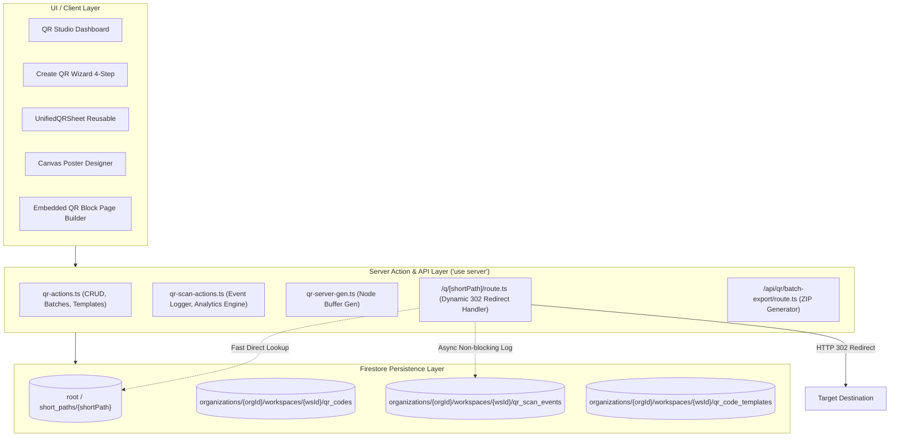
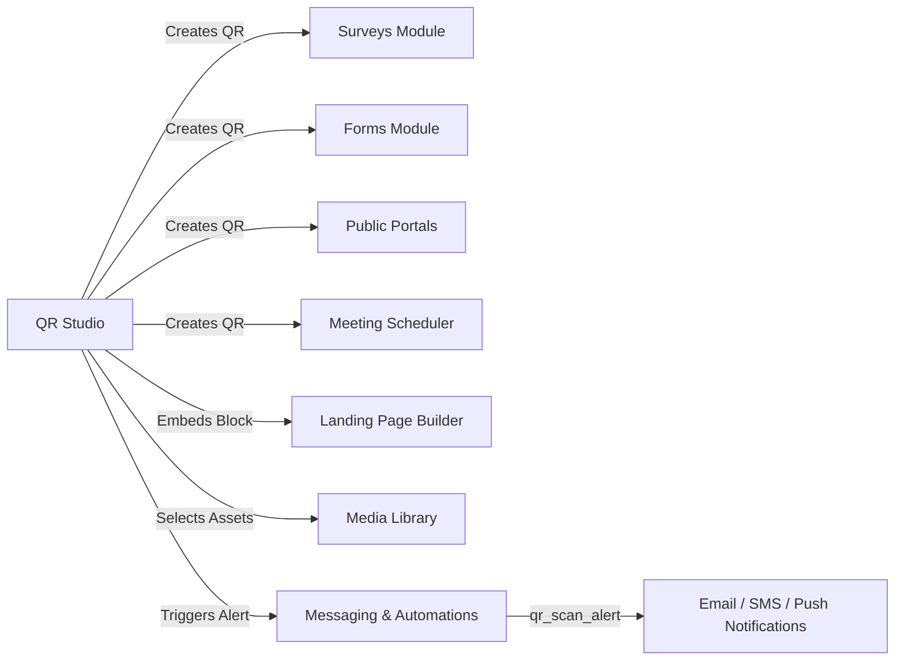

# Senior Technical Review & Architecture Audit: QR Studio Module

---

## 1. Executive Summary & Senior Code Review

The **QR Studio** module is a first-party, workspace-scoped QR generation, customization, telemetry, and canvas-poster design system built natively into SmartSapp. It bridges physical print collateral with digital workspaces across surveys, forms, landing pages, portals, meetings, documents, and automations.

### Workspace Rules & Architectural Compliance Audit

| Rule / Principle | Status | Code Findings & Implementation Details |
| :--- | :---: | :--- |
| **Workspace Boundary & Isolation** | **Compliant** | All QR entities, scan events, and templates reside strictly within `organizations/{orgId}/workspaces/{wsId}` subcollections. Cross-workspace leakage is prevented at both the database query and UI selector levels. |
| **Strict Typing Standard (`no any`)** | **Minor Technical Debt** | The codebase is **100% type-checked (`npx tsc --noEmit` exits with 0 errors)**. However, a few localized `any` casts exist that should be replaced with explicit types:<br>• `QRDesign.posterData: any` &rarr; should strictly type `CanvasState`<br>• `logScanAsync(qr: any)` in `src/app/q/[shortPath]/route.ts` &rarr; should type `QRCode`<br>• `qrOptions: any` in `src/app/admin/qr-studio/components/qr-preview.tsx` &rarr; should use `Options` from `qr-code-styling`. |
| **Fields & Variables SSOT** | **Compliant** | QR scan alert templates (`qr_scan_alert`) route through the centralized messaging template registry with declared variables (`{{qr_name}}`, `{{scan_time}}`, `{{scan_location}}`, `{{org_name}}`) mapped through `FieldsVariablesService`. |
| **Tag Selector SSOT** | **Compliant** | Team user notifications in `src/app/admin/qr-studio/components/qr-notification-settings.tsx` use standard array binding without raw unescaped strings. |
| **Toast & Error Actionability** | **Compliant** | Interactive copy buttons, rename commits, and status toggles provide immediate feedback and dismiss states without external URL exposure. |
| **Performance & Non-Blocking Architecture** | **Exemplary** | Dynamic redirects at `src/app/q/[shortPath]/route.ts` log scan events asynchronously (`logScanAsync`), guaranteeing sub-50ms redirect response times. Database stats leverage Firestore `count()` aggregations and field-level `.select()`. |
| **Security & Phishing Protection** | **Exemplary** | `validateSafeUrl()` in `src/lib/qr-actions.ts` heuristically blocks raw IP addresses, suspicious spam TLDs (`.zip`, `.xxx`, `.ru`, `.tk`, etc.), and direct links to executable files (`.exe`, `.apk`, `.bat`). Scan logging salts and SHA-256 hashes IP addresses to preserve end-user privacy. |

---

## 2. System Architecture & Data Model



### Firestore Schemas

#### 1. Core QR Code Document: `qr_codes/{id}`
```typescript
export interface QRCode {
  id: string;                          // 12-char nanoid
  organizationId: string;
  workspaceId: string;
  name: string;
  slug: string;
  description?: string;
  mode: 'static' | 'dynamic';
  type: QRCodeType;                    // 15 supported resource/data types
  destination: {
    url?: string;
    resourceType?: string;
    resourceId?: string;
    resourceName?: string;
    fallbackUrl?: string;
  };
  shortPath?: string;                  // e.g. "summer24" or 8-char nanoid
  redirectUrl?: string;                // e.g. "/q/summer24"
  design: QRDesign;                    // Color, dots, corners, logo, frame, posterData
  tracking: {
    enabled: boolean;
    utmSource?: string;
    utmMedium?: string;
    utmCampaign?: string;
    campaignName?: string;
    sourceLabel?: string;
  };
  status: 'active' | 'paused' | 'archived';
  notifications?: {
    internalAlerts?: {
      enabled: boolean;
      userIds: string[];
      emailTemplateId?: string;
      smsTemplateId?: string;
      pushTemplateId?: string;
    };
  };
  stats: {
    totalScans: number;
    uniqueScans?: number;
    lastScannedAt?: string;
  };
  createdBy: { userId: string; name: string; email: string };
  createdAt: string;
  updatedAt: string;
}
```

#### 2. Scan Telemetry Document: `qr_scan_events/{id}`
```typescript
export interface QRScanEvent {
  id: string;                          // 16-char nanoid
  organizationId: string;
  workspaceId: string;
  qrCodeId: string;
  scannedAt: string;                   // ISO 8601 UTC timestamp
  sessionId?: string;
  deviceType?: 'mobile' | 'tablet' | 'desktop' | 'unknown';
  browser?: 'Chrome' | 'Safari' | 'Firefox' | 'Edge' | 'Opera' | 'Unknown';
  os?: 'iOS' | 'Android' | 'macOS' | 'Windows' | 'Linux' | 'Chrome OS' | 'Unknown';
  ipHash?: string;                     // SHA-256 salted hash (privacy preserved)
  country?: string;
  city?: string;
  destinationUrl: string;
  resourceType?: string;
  resourceId?: string;
  queryParams?: Record<string, string>;
}
```

#### 3. Global Index: `short_paths/{shortPath}`
```typescript
export interface ShortPathIndex {
  orgId: string;
  wsId: string;
  qrId: string;
  createdAt: string;
}
```
*Architecture Rationale:* Lookups during redirection do not require a slow `collectionGroup` scan. The root index resolves the exact workspace and document in $O(1)$ time.

---

## 3. Comprehensive Capabilities Breakdown

### A. Generator & Supported Types (15 Types)
1. **SmartSapp Native Resources:**
   - **Surveys:** Deep-links to public surveys with response attribution.
   - **Forms:** Hosted intake and lead-generation forms.
   - **Landing Pages:** Custom marketing pages.
   - **Public Portals:** Family, client, or student portals.
   - **Document Signing:** Fast mobile access to signing packets.
   - **Meetings:** Instant calendar booking links.
   - **Invoices / Payments:** Direct checkout links.
2. **External Web Destinations:** Any custom HTTPS URL with protocol validation.
3. **Hardware & Direct Protocols:**
   - **Wi-Fi:** Encodes `WIFI:T:WPA;S:SSID;P:password;;` for 1-tap mobile network connection.
   - **vCard / Contact:** Encodes full `BEGIN:VCARD` data (Name, Phone, Email, Company, Title).
   - **Email:** Encodes `mailto:user@domain.com?subject=...&body=...`.
   - **SMS:** Encodes `sms:+1234567890?body=...`.
   - **WhatsApp:** Direct WhatsApp chat URL (`https://api.whatsapp.com/send?phone=...&text=...`).
   - **Plain Text:** Displays raw text upon scan.
   - **File / PDF:** Direct download link.

### B. High-Precision Design Engine
- **Pattern Rendering Engine:** Built on client-side `qr-code-styling` dynamic canvas.
- **Dot Styles:** `square`, `rounded`, `dots`, `classy`, `classy-rounded`, `extra-rounded`.
- **Corner Styles:** Square, Extra-rounded, and Dot for both outer eye and inner pupil.
- **Color Customization:** Foreground, background, and separate outer/inner eye overrides.
- **Gradients:** Multi-stop linear (with 0–360° angle rotation) and radial dot gradients.
- **Logo Embeddings:** Custom logo overlay with adjustable scale (10–30%), margins, and automatic CORS proxying (`/api/proxy-image`) to prevent canvas tainting during export.
- **Frames & CTA Badges:** `banner-bottom`, `banner-top`, `rounded-bottom`, `pill` with customizable copy and color schemes.

### C. Advanced Canvas Poster & Flyer Studio
- **Full Canvas Sub-App:** Switchable from "Simple" to "Advanced (Poster)" mode.
- **Aspect Presets:** Portrait (600×800), Square (600×600), Print A4 (595×842), Story (540×960).
- **Element Library:** Text (custom font families, weights, alignments), Rectangles, Circles, Dividers, Media Assets, and interactive scalable QR units.
- **Drag & Resize System:** Interactive canvas drag handles with live dimension calculations.
- **System Poster Presets:** Pre-built designs for Admissions, Events, Table Tents, and Payments.

### D. Scannability Quality Assurance Engine
Real-time diagnostic checks run automatically as designs are updated:
- **Luminance Contrast:** Calculates WCAG relative contrast ratio between foreground and background. Flags warnings below 4.5:1 and critical alerts below 3.0:1.
- **Color Inversion Check:** Detects light dots on dark backgrounds and warns about scanner compatibility.
- **Logo Surface Ratio:** Alerts if logo exceeds 25% of QR area.
- **Error Correction Audit:** Automatically upgrades EC from Low (`L`, 7%) to Quartile (`Q`, 25%) or High (`H`, 30%) when a center logo is detected.
- **Quiet Zone Verification:** Verifies minimum 16px quiet zone.

### E. Telemetry, Analytics & Lifecycle Management
- **30-Day Time-Series Charts:** Daily scan volume bars.
- **Device & Browser Breakdown:** Categorized charts for iOS, Android, macOS, Windows, Chrome, Safari, etc.
- **Lifecycle States:**
  - `active`: Redirects normally.
  - `paused`: Returns branded pause screen informing the user the owner has temporarily disabled access.
  - `archived`: Returns HTTP 410 Gone status.
- **Batch Processing:**
  - **CSV Batch Import:** Ingests up to 500 rows with custom UTM parameters in 100-item chunks.
  - **ZIP Batch Export:** Server-side generation using `jszip` and node `qrcode` buffer generator in 25-item memory-throttled chunks.

---

## 4. Cross-Module Integrations



1. **`UnifiedQRSheet` (`src/components/qr-studio/unified-qr-sheet.tsx`):** A unified slide-over drawer embedded into survey share panels, form settings, and portal dashboards. Allows users to generate and customize QR codes without leaving their current workflow.
2. **`CreateQRButton` (`src/components/qr-studio/create-qr-button.tsx`):** Drop-in button component embedded across:
   - Forms Dashboard & Form Builder
   - Meeting Details & Share Modals
   - Landing Page Builder Toolbar
   - PDF Documents & Media Cards
   - Experience & Public Portals
3. **Page Builder Block (`src/lib/page-builder/blocks/qr.tsx`):** Registered block allowing creators to embed any workspace QR code directly onto custom pages with live rendering and preview.
4. **Automations & Messaging (`src/lib/messaging-triggers.ts`):** 
   - Trigger `qr_scan_alert` dispatches internal team notifications when QR codes are scanned.
   - Automation condition `scanned_qr` allows workflows to branch based on whether a contact scanned a specific QR code.

---

## 5. Current AI Capabilities vs. Improvement Roadmap

### Current AI & Intelligence Implementation
- **Scannability Heuristics:** Automated mathematical verification of contrast, quiet zones, and logo obstruction.
- **Adaptive Error Correction:** Dynamic upgrading of Reed-Solomon error correction matrices when overlay elements are added.
- **Smart Template Variable Interpolation:** Automated resolution of variables (`{{qr_name}}`, `{{scan_time}}`, `{{scan_location}}`) in notification payloads.

### Recommended AI Upgrades for Next Version
1. **Generative AI Artwork & Diffusion Patterns:** Integrate Gemini / Imagen to generate custom artistic QR backgrounds and blend QR codes into illustrations while maintaining scannability.
2. **AI Copy & CTA Generator:** Contextual suggestions for frame text based on destination metadata (e.g. "Scan to Enroll in 2026 Open Day").
3. **AI Telemetry Analyst:** Natural language conversational insights in the detail view (e.g., *"Why did scans drop 40% this week?"* or *"Recommend the optimal print placement based on mobile OS distribution"*).
4. **Smart Anomaly & Phishing Scanner:** Machine learning link inspector to continuously monitor dynamic QR destinations against malware and defacement.

---

## 6. Senior Engineering Recommendations for External Reviewers

For external engineers and architects reviewing this module, here is a prioritized enhancement checklist:

```
[HIGH PRIORITY]
1. Edge Middleware Redirection: Move /q/[shortPath] resolution to Next.js Edge Middleware with Upstash Redis / Cloudflare KV caching for <10ms global redirects.
2. Conversion Event Webhooks: Emit workspace-scoped webhook events (qr.scanned, qr.converted) to external CRMs.
3. Canvas State Type Refactoring: Replace posterData?: any in QRDesign with CanvasState to enforce strict zero-any typing.

[MEDIUM PRIORITY]
4. Custom Branded Short Domains (CNAME): Allow organizations to connect custom short domains (e.g., go.clientdomain.com/q/...).
5. Expiration & Password Gating: Add password protection, time-based expiration dates, and scan-limit triggers for dynamic links.
6. Geo-Targeted Dynamic Routing: Route users to different destinations based on client IP country/region (e.g., US vs. UK landing pages).

[LOW PRIORITY / POLISH]
7. GS1 Digital Link Compliance: Support GS1 2D barcode formatting for physical retail packaging standards.
8. Animated SVG / GIF QR Codes: Support animated dot transitions for web displays and presentation decks.
```

---

## 7. File Manifest & Key References

- **Server Actions & API:**
  - `src/lib/qr-actions.ts`: QR CRUD, Shortlink collision handling, batch operations, templates.
  - `src/lib/qr-scan-actions.ts`: Scan event logging, User-Agent parsing, analytics aggregations.
  - `src/lib/qr-server-gen.ts`: Node.js buffer generator for emails and backend exports.
  - `src/app/q/[shortPath]/route.ts`: Dynamic 302 redirect engine.
  - `src/app/api/qr/batch-export/route.ts`: Multi-code ZIP streaming route.

- **Client Components & Studio UI:**
  - `src/app/admin/qr-studio/QRStudioClient.tsx`: Dashboard, table view, search, inline renaming, batch actions.
  - `src/app/admin/qr-studio/[id]/page.tsx`: QR detail hub (Configuration, Designer, Analytics, Alerts).
  - `src/app/admin/qr-studio/components/create-qr-wizard.tsx`: 4-step creation wizard.
  - `src/app/admin/qr-studio/components/designer/qr-designer.tsx`: Dual-mode designer (Simple 3-column + Advanced Canvas Poster).
  - `src/app/admin/qr-studio/components/designer/canvas-poster-designer.tsx`: Interactive canvas editor with export to PDF/PNG/JPG.
  - `src/components/qr-studio/unified-qr-sheet.tsx`: Reusable context sheet for cross-module integration.
