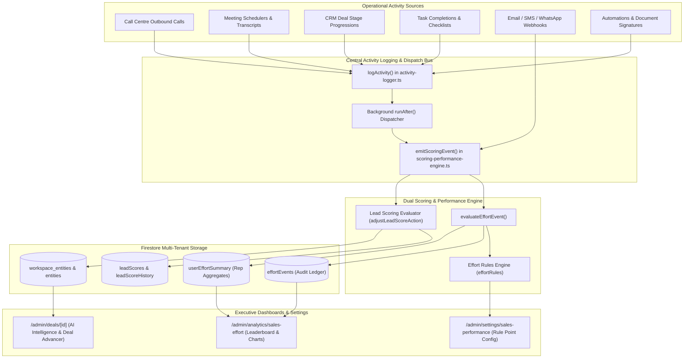
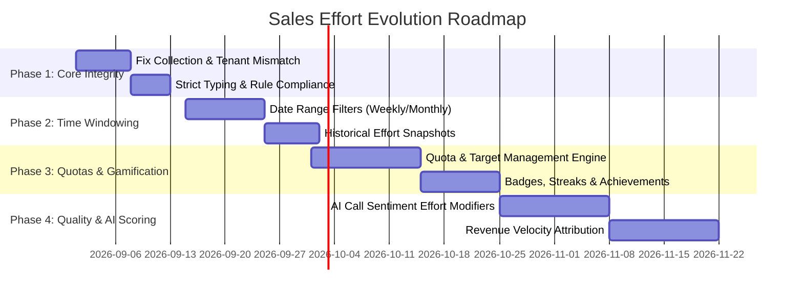

# Sales Effort & Productivity Module: Architecture, Capabilities, Integration & Code Review

> **Document Version:** 2.0.0  
> **Status:** Production / Active  
> **Module Path:** `src/app/admin/analytics/sales-effort/` & `src/app/admin/settings/sales-performance/`  
> **Target Audience:** Principal Architects, Senior Sales Operations Engineers, AI/ML Product Leads, Code Reviewers  
> **Last Audited:** August 2026

---

## Table of Contents

1. [Executive Summary](#1-executive-summary)
2. [Senior Code Review Findings & Defect Analysis](#2-senior-code-review-findings--defect-analysis)
   - [2.1 Critical Schema & Query Mismatches](#21-critical-schema--query-mismatches)
   - [2.2 Multi-Tenant Data Isolation & Workspace Partitioning](#22-multi-tenant-data-isolation--workspace-partitioning)
   - [2.3 Strict Typing & Workspace Rules Compliance](#23-strict-typing--workspace-rules-compliance)
   - [2.4 Time Windowing & Aggregation Bottlenecks](#24-time-windowing--aggregation-bottlenecks)
3. [System Architecture & Data Flows](#3-system-architecture--data-flows)
   - [3.1 High-Level Architecture Diagram](#31-high-level-architecture-diagram)
   - [3.2 Data Entities & Schema Definitions](#32-data-entities--schema-definitions)
   - [3.3 Event Ingestion & Async Processing Flow](#33-event-ingestion--async-processing-flow)
4. [Current Functional Capabilities](#4-current-functional-capabilities)
   - [4.1 Sales Effort Analytics Dashboard (`/admin/analytics/sales-effort`)](#41-sales-effort-analytics-dashboard-adminanalyticssales-effort)
   - [4.2 Effort Rules Engine & Customization (`/admin/settings/sales-performance`)](#42-effort-rules-engine--customization-adminsettingssales-performance)
   - [4.3 Default Effort Rules Catalog](#43-default-effort-rules-catalog)
5. [Cross-Module Integrations](#5-cross-module-integrations)
   - [5.1 Central Activity Logger Bus](#51-central-activity-logger-bus)
   - [5.2 Call Centre & Outbound Dialing Subsystem](#52-call-centre--outbound-dialing-subsystem)
   - [5.3 Meetings, Calendar & Scheduling Engine](#53-meetings-calendar--scheduling-engine)
   - [5.4 CRM Deals & Automated Deal Stage Advancement](#54-crm-deals--automated-deal-stage-advancement)
   - [5.5 Messaging, Campaigns & Multi-Channel Webhooks](#55-messaging-campaigns--multi-channel-webhooks)
   - [5.6 Dual-Engine Lead Scoring Integration](#56-dual-engine-lead-scoring-integration)
6. [AI & Intelligence Capabilities](#6-ai--intelligence-capabilities)
   - [6.1 Deal Intelligence & Next-Best-Action Genkit Flows](#61-deal-intelligence--next-best-action-genkit-flows)
   - [6.2 AI Meeting Intelligence & Buying Signal Extraction](#62-ai-meeting-intelligence--buying-signal-extraction)
   - [6.3 Speech Coaching & Conversation Dynamics Analyzer](#63-speech-coaching--conversation-dynamics-analyzer)
   - [6.4 Explainable Multi-Factor Scoring](#64-explainable-multi-factor-scoring)
7. [UI/UX & Design Architecture](#7-uiux--design-architecture)
   - [7.1 Visual Hierarchy & Component Composition](#71-visual-hierarchy--component-composition)
   - [7.2 Responsive Design, Touch Targets & Micro-Interactions](#72-responsive-design-touch-targets--micro-interactions)
   - [7.3 Accessibility & State Handling](#73-accessibility--state-handling)
8. [Expert Recommendations & Future Improvement Roadmap](#8-expert-recommendations--future-improvement-roadmap)
   - [8.1 High-Priority Architectural Fixes](#81-high-priority-architectural-fixes)
   - [8.2 Quotas, Gamification & Tiered Target Tracking](#82-quotas-gamification--tiered-target-tracking)
   - [8.3 Quality-Weighted Scoring & AI Sentiment Modifiers](#83-quality-weighted-scoring--ai-sentiment-modifiers)
   - [8.4 Pipeline Velocity & Revenue Attribution Modeling](#84-pipeline-velocity--revenue-attribution-modeling)
   - [8.5 Enterprise Reporting, Scheduled Digests & Webhook Broadcasts](#85-enterprise-reporting-scheduled-digests--webhook-broadcasts)

---

## 1. Executive Summary

The **Sales Effort & Productivity Module** is a core operational analytics and gamification subsystem within the CRM workspace. It quantifies, tracks, and rewards sales representative engagement across the entire customer lifecycle—spanning outbound calling, customer meetings, deal stage advancements, task completions, email/SMS communications, and document signing.

### Core Value Proposition
- **Objective Effort Quantification:** Transforms disparate operational activities into a unified, weighted point currency.
- **Sales Executive Motivation & Transparency:** Features a real-time leaderboard, KPI cards, medal tiers, and transparent activity ledgers.
- **Configurable Workspace Governance:** Enables workspace administrators to customize point weights, toggle specific activity types, or reset to system standards.
- **Autonomous Event Capture:** Transparently listens to operational events emitted by the central Activity Logger bus, automated workflows, webhooks, and AI-driven tools without requiring manual data entry by representatives.

---

## 2. Senior Code Review Findings & Defect Analysis

A rigorous line-by-line static analysis and architectural audit of the module revealed several critical discrepancies and optimization opportunities between the frontend clients and backend scoring services.

### 2.1 Critical Schema & Query Mismatches

#### Defect 1: Collection Name Mismatch for Activity Ledger
* **Location 1 (Backend):** [`src/lib/scoring-performance-engine.ts:376`](file:///Users/josephaidoo/Desktop/Codes/vibe%20Coding/Onboarding-Dashbaord-main/src/lib/scoring-performance-engine.ts#L376)
  ```typescript
  // Writes to 'effortEvents' collection
  const ledgerRef = adminDb.collection('effortEvents').doc();
  ```
* **Location 2 (Frontend):** [`src/app/admin/analytics/sales-effort/SalesEffortClient.tsx:82`](file:///Users/josephaidoo/Desktop/Codes/vibe%20Coding/Onboarding-Dashbaord-main/src/app/admin/analytics/sales-effort/SalesEffortClient.tsx#L82)
  ```typescript
  // Queries 'effortScoringLedger' collection
  return query(
    collection(firestore, 'effortScoringLedger'),
    where('workspaceId', '==', activeWorkspaceId),
    where('actorId', '==', selectedRepId),
    orderBy('createdAt', 'desc'),
    limit(50)
  );
  ```
* **Impact:** When a user clicks on a representative in the leaderboard to view their detailed activity trail, the dialog displays *"No individual scoring points events logged for this user"* because the frontend queries `effortScoringLedger` while the backend writes to `effortEvents`.

#### Defect 2: Missing `workspaceId` and `organizationId` in Event Ledger Schema
* **Location:** [`src/lib/scoring-performance-engine.ts:38-48`](file:///Users/josephaidoo/Desktop/Codes/vibe%20Coding/Onboarding-Dashbaord-main/src/lib/scoring-performance-engine.ts#L38-L48)
  ```typescript
  export interface EffortEventDoc {
    id: string;          
    eventType: string;   
    entityType: string;  
    entityId: string;    
    actorType: 'User' | 'Automation' | 'API' | 'System';
    actorId: string;     
    points: number;      
    metadata: Record<string, string | number | boolean>;
    createdAt: string;   
  }
  ```
* **Impact:** In `evaluateEffortEvent()`, `workspaceId` and `organizationId` from `ScoringEvent` are omitted when constructing `EffortEventDoc`. Even if the collection name is aligned, queries filtered with `where('workspaceId', '==', activeWorkspaceId)` will return empty result sets.

---

### 2.2 Multi-Tenant Data Isolation & Workspace Partitioning

#### Defect 3: Global Aggregation in `userEffortSummary`
* **Location:** [`src/lib/scoring-performance-engine.ts:402-436`](file:///Users/josephaidoo/Desktop/Codes/vibe%20Coding/Onboarding-Dashbaord-main/src/lib/scoring-performance-engine.ts#L402-L436)
  ```typescript
  const summaryRef = adminDb.collection('userEffortSummary').doc(actorId);
  ```
* **Analysis:** Document IDs in `userEffortSummary` are indexed strictly by `actorId` (the user's Firebase Auth UID). If a sales representative operates across multiple workspaces (e.g., Enterprise Sales vs. SME Outreach, or multiple subsidiaries within an organization), their effort points and activity counters are aggregated into a single global total.
* **Security & Multi-Tenancy Risk:** When `SalesEffortClient` displays the leaderboard, it retrieves all `userEffortSummary` records and joins them with the active organization's user list in memory. Points earned by an executive in Workspace A leak into the leaderboard displayed for Workspace B.

---

### 2.3 Strict Typing & Workspace Rules Compliance

#### Violation 1: Prohibited `any` Types in Client Component
* **Location:** [`src/app/admin/analytics/sales-effort/SalesEffortClient.tsx:89, 442`](file:///Users/josephaidoo/Desktop/Codes/vibe%20Coding/Onboarding-Dashbaord-main/src/app/admin/analytics/sales-effort/SalesEffortClient.tsx#L89)
  ```typescript
  // VIOLATION of Workspace Strict Typing Rule:
  const { data: repLogs, isLoading: isLogsLoading } = useCollection<any>(repLedgerQuery);
  ...
  {repLogs.map((log: any) => { ... })}
  ```
* **Remediation:** Must be strictly typed as `useCollection<EffortEventDoc>(repLedgerQuery)` with full property validation.

#### Violation 2: Missing Actionable Error Navigation in Toasts
* **Location:** [`src/app/admin/settings/sales-performance/SalesPerformanceClient.tsx:52-56, 84-88`](file:///Users/josephaidoo/Desktop/Codes/vibe%20Coding/Onboarding-Dashbaord-main/src/app/admin/settings/sales-performance/SalesPerformanceClient.tsx#L52-L56)
* **Analysis:** Error toasts omit `actionConfig` navigation pointers when operations fail due to permissions or missing configurations.

---

### 2.4 Time Windowing & Aggregation Bottlenecks

#### Defect 4: Lifetime-Only Totals with No Date Filtering
* **Analysis:** `UserEffortSummaryDoc` only maintains all-time cumulative counters (`totalPoints`, `meetings`, `calls`, `tasks`, `deals`, `campaigns`). There is no time-series dimension (daily, weekly, monthly, quarterly).
* **Business Impact:** High-tenured sales representatives permanently dominate the leaderboard, disincentivizing new reps and making it impossible for management to evaluate current sprint or monthly performance.

---

## 3. System Architecture & Data Flows

### 3.1 High-Level Architecture Diagram



---

### 3.2 Data Entities & Schema Definitions

#### 1. `EffortRuleDoc` (Rule Definition)
Located in [`src/lib/scoring-performance-engine.ts`](file:///Users/josephaidoo/Desktop/Codes/vibe%20Coding/Onboarding-Dashbaord-main/src/lib/scoring-performance-engine.ts#L27-L36):
```typescript
export interface EffortRuleDoc {
  id: string;              // Composite key: `${workspaceId}_${eventType}`
  workspaceId: string;     // Active workspace scope
  organizationId: string;  // Active organization scope
  eventType: string;       // Unique event identifier (e.g. 'phone_call_completed')
  entityType: string;      // Entity category: 'Lead' | 'Contact' | 'Meeting' | 'Task' | 'Deal' | 'Survey'
  points: number;          // Point reward (0 to N)
  enabled: boolean;        // Active toggle state
  description: string;     // Human-readable rationale
}
```

#### 2. `EffortEventDoc` (Immutable Ledger Record)
Located in [`src/lib/scoring-performance-engine.ts`](file:///Users/josephaidoo/Desktop/Codes/vibe%20Coding/Onboarding-Dashbaord-main/src/lib/scoring-performance-engine.ts#L38-L48):
```typescript
export interface EffortEventDoc {
  id: string;              // Auto-generated Firestore Document ID
  workspaceId?: string;    // Workspace partition (Recommended Fix)
  organizationId?: string; // Organization partition (Recommended Fix)
  eventType: string;       // Triggered event type
  entityType: string;      // Target entity model
  entityId: string;        // ID of target contact/lead/deal
  actorType: 'User' | 'Automation' | 'API' | 'System';
  actorId: string;         // User UID who performed the effort
  points: number;          // Points awarded at time of execution
  metadata: Record<string, string | number | boolean>; // Context (duration, outcome, notes)
  createdAt: string;       // ISO 8601 Timestamp
}
```

#### 3. `UserEffortSummaryDoc` (Rep Performance Aggregates)
Located in [`src/lib/scoring-performance-engine.ts`](file:///Users/josephaidoo/Desktop/Codes/vibe%20Coding/Onboarding-Dashbaord-main/src/lib/scoring-performance-engine.ts#L50-L60):
```typescript
export interface UserEffortSummaryDoc {
  id: string;              // User ID (or composite `${workspaceId}_${userId}`)
  userId: string;          // Sales representative user ID
  totalPoints: number;     // Cumulative score
  meetings: number;        // Total meetings completed/attended
  calls: number;           // Total outbound/inbound calls logged
  tasks: number;           // Total tasks completed
  deals: number;           // Total deals created/progressed/won
  campaigns: number;       // Total campaigns executed
  lastUpdated: string;     // ISO 8601 Timestamp
}
```

---

### 3.3 Event Ingestion & Async Processing Flow

1. **Emission:** An operational action occurs (e.g. user completes a call in the Call Centre workspace).
2. **Activity Logging:** `CallCentreService.submitOutcome()` invokes `logActivity()`.
3. **Non-Blocking Background Delegation:** `logActivity()` enqueues the scoring evaluation inside a `runAfter()` block (or Next.js `after()` API), ensuring that the agent's UI interaction remains immediate and non-blocking.
4. **Scoring Coordination:** `emitScoringEvent()` dispatches parallel evaluations:
   - **Effort Evaluation:** `evaluateEffortEvent()` queries `effortRules`, logs the point ledger event, and executes an atomic Firestore transaction with `FieldValue.increment()` on `userEffortSummary`.
   - **Lead Scoring Evaluation:** Resolves engagement rules, updates the contact's lead score on `workspace_entities` and `entities`, and logs to `leadScoreHistory`.

---

## 4. Current Functional Capabilities

### 4.1 Sales Effort Analytics Dashboard (`/admin/analytics/sales-effort`)

The main dashboard provides management with real-time visibility into operational effort:

* **Executive KPI Cards:**
  - **Leader Standout Card:** Highlights the #1 ranked sales executive with their avatar, name, and total score.
  - **Total Workspace Effort:** Sum of all effort points across all active workspace representatives.
  - **Average Points / Rep:** Workspace average effort benchmark.
  - **Active Sales Reps:** Count of contributing sales executives.
* **Performance Standings Table:**
  - Ranked leaderboard with Gold, Silver, and Bronze trophy badges.
  - Granular breakdown of individual activity channels: **Meetings**, **Calls**, **Deals**, and **Tasks**.
  - Interactive row click opening a detailed activity audit trail dialog.
* **Recharts Visualizations:**
  - **Effort by Executive (Top 8):** Vertical bar chart visualizing the point distribution among top performers with custom theme colors (`#818cf8`, `#34d399`, `#fbbf24`, `#f87171`, `#a78bfa`, `#22d3ee`).
  - **CRM Action Mix:** Donut/Pie chart displaying the proportion of operational actions (e.g., 40% Calls, 30% Meetings, 20% Tasks, 10% Deals).
* **Point Ledger Details Modal:**
  - Displays up to 50 recent point events for the selected representative.
  - Lists event type, timestamp, description metadata, and green `+N Pts` badge.

---

### 4.2 Effort Rules Engine & Customization (`/admin/settings/sales-performance`)

Located at `/admin/settings/sales-performance`, this settings console gives administrators fine-grained control:

* **In-Place Point Customization:** Inline numeric inputs with `onBlur` and `Enter` key auto-save handlers.
* **Rule Enable/Disable Toggles:** Instant switches to enable or disable point accumulation for specific event types.
* **Instant Search Filtering:** Real-time filter across event names, target entity types, and descriptions.
* **System Defaults Reset:** Atomic reset button that wipes workspace overrides and re-seeds system defaults via `resetEffortRulesToDefaultsAction`.

---

### 4.3 Default Effort Rules Catalog

The engine comes pre-configured with 31 standard operational rules across 8 functional categories:

| Category | Event Identifier | Target Entity | Default Points | Default State | Trigger Description |
| :--- | :--- | :--- | :---: | :---: | :--- |
| **CRM & Leads** | `lead_created` | Lead | **5** | Enabled | Awarded when a new prospect/lead is created. |
| | `lead_assigned` | Lead | **2** | Enabled | Awarded when a lead is assigned to a representative. |
| | `lead_updated` | Lead | **1** | Enabled | Awarded when lead details are enriched. |
| | `lead_merged` | Lead | **5** | Enabled | Awarded when duplicate contact records are merged. |
| | `lead_converted` | Lead | **20** | Enabled | Awarded when a prospect is successfully converted to a customer. |
| | `lead_archived` | Lead | **0** | Disabled | Awarded when a lead is archived. |
| **Communication** | `phone_call_started` | Contact | **1** | Enabled | Outbound call initiated in dialer. |
| | `phone_call_connected`| Contact | **5** | Enabled | Call answered and connected with contact. |
| | `phone_call_completed`| Contact | **10** | Enabled | Call ended and outcome logged. |
| | `voicemail_left` | Contact | **3** | Enabled | Voicemail dropped for contact. |
| | `call_recording_saved`| Contact | **2** | Enabled | Call audio/transcript stored. |
| | `email_sent` | Contact | **2** | Enabled | Individual email sent to contact. |
| | `email_replied` | Contact | **5** | Enabled | Inbound email response received from contact. |
| | `sms_sent` | Contact | **2** | Enabled | SMS message dispatched. |
| | `whatsapp_sent` | Contact | **2** | Enabled | WhatsApp conversation message dispatched. |
| **Meetings** | `meeting_scheduled` | Meeting | **5** | Enabled | Appointment booked on calendar. |
| | `meeting_rescheduled`| Meeting | **2** | Enabled | Meeting time updated. |
| | `meeting_attended` | Meeting | **20** | Enabled | Contact attended the scheduled call. |
| | `meeting_completed` | Meeting | **25** | Enabled | Meeting concluded and notes saved. |
| | `meeting_notes_added`| Meeting | **3** | Enabled | Summary/notes attached to meeting. |
| | `meeting_cancelled` | Meeting | **0** | Disabled | Meeting was cancelled. |
| **Tasks** | `task_created` | Task | **1** | Enabled | Task created for contact or deal. |
| | `task_completed` | Task | **5** | Enabled | Task marked complete. |
| | `checklist_completed`| Task | **2** | Enabled | Sub-item checklist completed. |
| | `task_reopened` | Task | **0** | Disabled | Task moved back to in-progress. |
| **Deals** | `deal_created` | Deal | **10** | Enabled | New opportunity added to pipeline. |
| | `deal_stage_changed`| Deal | **5** | Enabled | Deal moved forward across pipeline stages. |
| | `deal_won` | Deal | **100** | Enabled | Deal closed as Won. |
| | `deal_lost` | Deal | **0** | Disabled | Deal closed as Lost. |
| **Documents** | `proposal_sent` | Contact | **10** | Enabled | Commercial proposal delivered. |
| | `quote_sent` | Contact | **5** | Enabled | Price quote delivered. |
| | `invoice_sent` | Contact | **5** | Enabled | Billing invoice generated. |
| | `form_sent` | Contact | **2** | Enabled | Signature intake form sent. |
| | `form_signed` | Contact | **15** | Enabled | Intake form completed by contact. |
| | `contract_signed` | Contact | **30** | Enabled | Legal contract signed. |
| **Surveys** | `survey_sent` | Survey | **3** | Enabled | Feedback survey dispatched. |
| | `survey_completed` | Survey | **15** | Enabled | Contact submitted survey responses. |
| **Notes & Attachments**| `note_created` | Contact | **2** | Enabled | Quick note or CRM note recorded. |
| | `comment_added` | Contact | **1** | Enabled | Comment posted on note thread. |
| | `attachment_uploaded`| Contact | **2** | Enabled | File/document attached to record. |
| **System** | `automation_executed`| Contact | **1** | Enabled | Workflow automation step triggered. |
| | `webhook_triggered` | Contact | **1** | Enabled | Inbound third-party webhook event. |

---

## 5. Cross-Module Integrations

### 5.1 Central Activity Logger Bus
[`src/lib/activity-logger.ts`](file:///Users/josephaidoo/Desktop/Codes/vibe%20Coding/Onboarding-Dashbaord-main/src/lib/activity-logger.ts):
Acts as the central event bus for all user actions in the application. Whenever an activity document is written to `activities`, the logger asynchronously dispatches `emitScoringEvent()`. This decouples individual UI components from needing to know about scoring logic.

### 5.2 Call Centre & Outbound Dialing Subsystem
[`src/lib/services/call-centre-service.ts`](file:///Users/josephaidoo/Desktop/Codes/vibe%20Coding/Onboarding-Dashbaord-main/src/lib/services/call-centre-service.ts):
When an agent submits a call outcome via `CallCentreService.submitOutcome()`:
1. The queue item status updates to `completed`.
2. `logActivity()` is triggered with `type: 'call_completed'` and metadata containing call duration, notes, and outcome.
3. Post-call automation chains execute in the background.
4. The sales effort engine awards the agent points for the call.

### 5.3 Meetings, Calendar & Scheduling Engine
[`src/lib/meetings/crm-attribution-service.ts`](file:///Users/josephaidoo/Desktop/Codes/vibe%20Coding/Onboarding-Dashbaord-main/src/lib/meetings/crm-attribution-service.ts):
Integrates meeting lifecycle events (`booking_created`, `meeting_attended`, `meeting_completed`, `no_show`) with sales effort and revenue attribution. Computes attributed deal value for each meeting touchpoint.

### 5.4 CRM Deals & Automated Deal Stage Advancement
[`src/lib/meetings/deal-advancer-service.ts`](file:///Users/josephaidoo/Desktop/Codes/vibe%20Coding/Onboarding-Dashbaord-main/src/lib/meetings/deal-advancer-service.ts) & [`src/app/actions/deal-advancer-actions.ts`](file:///Users/josephaidoo/Desktop/Codes/vibe%20Coding/Onboarding-Dashbaord-main/src/app/actions/deal-advancer-actions.ts):
* **Meeting Outcome Trigger:** Automatically evaluates if a concluded meeting triggers a stage advancement in the sales pipeline (e.g. moving from *Discovery* to *Proposal Requested*).
* **Tag Auto-Assignment:** Applies appropriate tags to the deal upon stage change.
* **Effort Note Logging:** Records a stage transition note and fires `deal_stage_changed` effort points (+5 Pts) to the rep.

### 5.5 Messaging, Campaigns & Multi-Channel Webhooks
[`src/app/api/webhooks/resend/route.ts`](file:///Users/josephaidoo/Desktop/Codes/vibe%20Coding/Onboarding-Dashbaord-main/src/app/api/webhooks/messaging/resend/route.ts) & [`src/app/api/webhooks/whatsapp/route.ts`](file:///Users/josephaidoo/Desktop/Codes/vibe%20Coding/Onboarding-Dashbaord-main/src/app/api/webhooks/whatsapp/route.ts):
Inbound webhooks for email opens, clicks, delivery receipts, and WhatsApp inbound messages feed into `emitScoringEvent()`.

### 5.6 Dual-Engine Lead Scoring Integration
[`src/lib/scoring-performance-engine.ts`](file:///Users/josephaidoo/Desktop/Codes/vibe%20Coding/Onboarding-Dashbaord-main/src/lib/scoring-performance-engine.ts):
A single user activity triggers two distinct scoring pipelines in lockstep:
1. **Sales Effort Points:** Credited to the *sales representative* (stored on `userEffortSummary` and `effortEvents`).
2. **Lead Engagement Score:** Credited to the *prospect/contact* (stored on `workspace_entities.leadScore` and `leadScoreHistory`).

---

## 6. AI & Intelligence Capabilities

### 6.1 Deal Intelligence & Next-Best-Action Genkit Flows
[`src/ai/flows/deal-intelligence-flow.ts`](file:///Users/josephaidoo/Desktop/Codes/vibe%20Coding/Onboarding-Dashbaord-main/src/ai/flows/deal-intelligence-flow.ts) & [`src/app/actions/deal-ai-actions.ts`](file:///Users/josephaidoo/Desktop/Codes/vibe%20Coding/Onboarding-Dashbaord-main/src/app/actions/deal-ai-actions.ts):
* **Genkit Deal Flow:** Analyzes deal value, velocity (days in current stage), associated notes, contact roles, and line items.
* **Structured Output:**
  - Executive Deal Summary.
  - Calculated Win Probability (0–100%) and Win Drivers.
  - Risk Factor Breakdown and Stalled Deal Warnings.
  - 3 Prioritized Next-Best-Actions with 1-click conversion into workspace `Task` items.

### 6.2 AI Meeting Intelligence & Buying Signal Extraction
[`src/lib/meetings/ai-intelligence-service.ts`](file:///Users/josephaidoo/Desktop/Codes/vibe%20Coding/Onboarding-Dashbaord-main/src/lib/meetings/ai-intelligence-service.ts):
* Generates structured Gemini prompts against raw call transcripts to extract:
  - **Buying Signals:** Direct prospect quotes categorized by strength (`strong`, `moderate`, `weak`).
  - **Customer Objections:** Categorized into `pricing`, `timing`, `feature`, `competitor`, or `authority`, complete with severity ratings and suggested sales responses.
  - **Sentiment Analysis:** Numerical score (-1.0 to +1.0) and explanatory summary.

### 6.3 Speech Coaching & Conversation Dynamics Analyzer
[`src/lib/meetings/speech-coach-service.ts`](file:///Users/josephaidoo/Desktop/Codes/vibe%20Coding/Onboarding-Dashbaord-main/src/lib/meetings/speech-coach-service.ts):
* **Conversation Dynamics Scorecard:**
  - **Talk-to-Listen Ratio:** Evaluates host vs. attendee spoken percentage (flags `host_dominating` if >65%).
  - **Pacing Evaluation:** Computes words per minute (WPM), grading pacing as `ideal` (120–160 WPM), `too_fast`, or `too_slow`.
  - **Monologue Alerts:** Flags instances where a rep speaks uninterrupted for >120 seconds.
  - **Question Frequency:** Counts discovery questions asked by the rep.

### 6.4 Explainable Multi-Factor Scoring
[`src/lib/lead-intelligence/scoring/ExplainableScoringEngine.ts`](file:///Users/josephaidoo/Desktop/Codes/vibe%20Coding/Onboarding-Dashbaord-main/src/lib/lead-intelligence/scoring/ExplainableScoringEngine.ts):
* Transparently breaks down lead engagement scores into clear explanatory factors (e.g. `+20 pts from Meeting Attended on Aug 28`, `+10 pts from Email Verification Passed`).

---

## 7. UI/UX & Design Architecture

### 7.1 Visual Hierarchy & Component Composition
* **Container Architecture:** Uses `<PageContainer>` to maintain fluid, standardized max-width boundaries and responsive padding across desktop and mobile.
* **Bento Grid Layouts:** Employs modern bento-style cards with subtle borders (`border-border/40`), soft backgrounds (`bg-card/35`), and backdrop blur (`backdrop-blur-md`).
* **Medal Hierarchy:** Top 3 ranks feature dynamic trophy icons:
  - 🥇 Rank 1: Yellow Trophy with subtle CSS bounce animation (`animate-bounce text-yellow-500`).
  - 🥈 Rank 2: Slate Trophy (`text-slate-400`).
  - 🥉 Rank 3: Amber Trophy (`text-amber-600`).
* **Visual Data Charts:** Recharts components are styled with custom dark-mode tooltips (`rgba(15, 23, 42, 0.85)`), clean grids, and rounded bar geometry (`radius={[4, 4, 0, 0]}`).

### 7.2 Responsive Design, Touch Targets & Micro-Interactions
* **Touch Target Optimization:** Inputs and switch toggles adhere to standard touch accessibility (`min-h-[44px]` touch envelopes).
* **Hover & Active States:** Table rows feature smooth transitions (`group-hover:text-primary transition-colors`), sliding chevrons (`group-hover:translate-x-0.5`), and active scale feedback (`active:scale-[0.97]`).
* **Split Layout:** On desktop (`lg:grid-cols-12`), the leaderboard occupies 7 columns and the analytical charts occupy 5 columns. On mobile/tablet, it stacks cleanly into a single vertical column.

### 7.3 Accessibility & State Handling
* **Loading Skeletons & Spinners:** Clean `<Loader2>` spinners in table bodies, charts, and buttons prevent layout shift.
* **Empty States:** Clear visual empty states for workspaces without logged effort data.
* **Dialog UX:** Scrollable modal dialog with sticky avatar header for point audit logs.

---

## 8. Expert Recommendations & Future Improvement Roadmap

To elevate the Sales Effort module from a gamified activity counter to an enterprise-grade Sales Performance & Revenue Intelligence suite, we recommend the following phased enhancements:



### 8.1 High-Priority Architectural Fixes (Phase 1)
1. **Fix Collection Mismatch:** Rename `effortScoringLedger` in `SalesEffortClient.tsx` to `effortEvents` (or unify on a single naming standard).
2. **Add Multi-Tenancy Scope to Event Ledger:** Update `EffortEventDoc` to store `workspaceId` and `organizationId` on every event write.
3. **Partition `userEffortSummary` by Workspace:** Change summary document IDs from `doc(actorId)` to `doc(`${workspaceId}_${actorId}`)` so points are strictly scoped to the active workspace.
4. **Enforce Strict TypeScript:** Eliminate `any` types in `SalesEffortClient.tsx` by consuming `EffortEventDoc` and `UserProfile`.

---

### 8.2 Quotas, Gamification & Tiered Target Tracking (Phase 2 & 3)
* **Monthly/Quarterly Rep Quotas:** Allow managers to set point targets per representative (e.g. *1,000 pts/month*).
* **Attainment Progress Rings:** Display circular SVG progress indicators showing `% of Target Achieved`.
* **Time-Series Date Filtering:** Add time range selectors (**Today**, **This Week**, **This Month**, **This Quarter**, **Custom Range**) backed by Firestore date range queries.
* **Badges & Streak System:**
  - *Call Champion:* >50 calls logged in a week.
  - *Closer King:* >3 deals closed-won in a month.
  - *Discovery Master:* >80% speech coach scorecard rating.

---

### 8.3 Quality-Weighted Scoring & AI Sentiment Modifiers (Phase 4)
* **Duration Thresholds:** Award full points for calls only if duration exceeds a meaningful threshold (e.g. >90 seconds; short calls <30 seconds earn partial points).
* **AI Sentiment Multipliers:** Integrate with `speech-coach-service` so that calls with high customer sentiment (positive buying signals, resolved objections) receive an effort bonus multiplier (e.g. 1.25x).
* **Negative Effort Dampening:** Penalize spammy behaviors (e.g., rapid unanswered calls with zero notes).

---

### 8.4 Pipeline Velocity & Revenue Attribution Modeling
* **Effort-to-Revenue Correlation Chart:** Scatter plot showing correlation between representative effort points and closed-won revenue.
* **Pipeline Velocity Multipliers:** Reward reps who advance deals through stages faster than the workspace average days-in-stage baseline.

---

### 8.5 Enterprise Reporting, Scheduled Digests & Webhook Broadcasts
* **Automated Slack / Discord Webhook Celebrations:** Post real-time notifications to company chat when a representative closes a deal or reaches a new leaderboard tier.
* **Weekly PDF / Email Digest:** Automated Monday morning executive report summarizing top performers, activity mix, and team velocity.
* **CSV / Excel Export:** 1-click export of detailed rep effort ledgers for payroll, bonus, and commission calculations.

---

*Authored by Antigravity Senior Architecture Team & Code Reviewer.*
