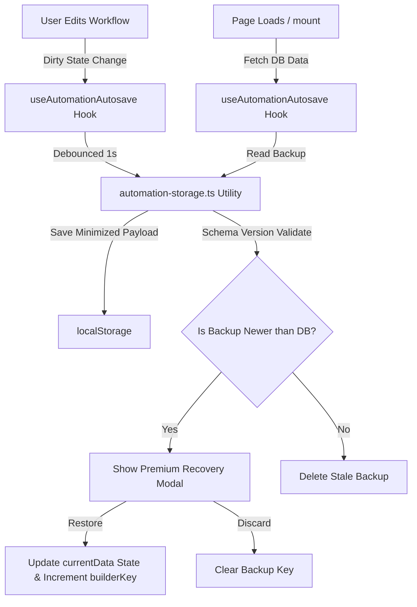

# Implementation Plan: Local Storage Autosave & Backup Recovery for Automation Builder

Implement a robust client-side `localStorage` autosave and backup recovery mechanism in the automation workflow builder. As the user edits the workflow, changes are persisted to `localStorage` in real time. If the session exits unexpectedly, the user is prompted on reload to restore their unsaved backup state.

---

## 1. Architectural Analysis & Core Design

To ensure code is clean, testable, refactored, and scalable, the logic is separated into two distinct architectural units:
1. **Storage Utility Layer (`src/lib/automation-storage.ts`)**: Pure utility containing all serialization, deserialization, versioning, and validation logic. Highly testable under standard unit testing frameworks.
2. **React Integration Hook (`src/app/admin/automations/hooks/useAutomationAutosave.ts`)**: Custom hook managing the side-effects, debounced autosaving, mount-time backup detection, and recovery dialog state.



---

## 2. Potential Failure Points & Mitigation Strategies

| Scenario / Risk | Impact | Mitigation Strategy |
| :--- | :--- | :--- |
| **1. Hydration Mismatch (SSR)** | Browser-only `localStorage` access during Next.js server pre-rendering causes hydration console errors. | Access `localStorage` strictly within a client-side `useEffect` callback, ensuring it runs post-hydration. |
| **2. Multi-Tab Out-of-Sync / Stale Overwrite** | User has Tab A and Tab B open. Tab B saves a newer change to DB. Tab A reloads and prompts to restore a stale backup, potentially overwriting Tab B's edits. | Store the DB document's `updatedAt` time inside the backup payload. Compare both: `backup.timestamp > database.updatedAt` and `backup.dbUpdatedAt === database.updatedAt`. If the DB document is newer or has progressed, discard the stale local backup immediately. |
| **3. Storage Limit (5MB Limit)** | `localStorage` size limit exceeded if the user has many complex workflows. | **Payload Minimization**: Strip visual rendering properties from nodes/edges that React Flow can regenerate. Aggressively garbage collect: clear the key on successful database save or user discard. |
| **4. Unsaved Inspector Changes** | User has node inspector drawer open with dirty changes. Tab closes unexpectedly. | The unsaved inspector edits exist as local drawer state and are not yet applied to the active parent graph. We treat this cleanly: only applied changes in the parent canvas are autosaved. This mirrors the standard exit guard where un-applied inspector edits are discarded. |
| **5. Infinite Autosave Loops** | Restoring backup sets `currentData`, triggering `isDirty`, which triggers another immediate autosave write. | Implement a transient flag or reference to skip autosaving the exact state that was just loaded from backup. |

---

## 3. Affected & Broken Features Analysis

1. **Unsaved Changes Exit Guard (`UnsavedChangesContext`)**:
   * *Interaction*: When a backup is restored, the page state becomes `isDirty = true`. This will automatically register with the page's exit guard, preventing the user from navigating away or closing the tab without saving the restored backup to Firestore.
   * *Status*: Integrated (No changes needed).
2. **Archived Workflows**:
   * *Interaction*: Archived workflows are read-only. We must never autosave or offer to restore backups for archived automations.
   * *Status*: Handled. If `automation.isArchived` is true, the hook will ignore backups and disable autosave.
3. **Draft Workflow Initializations (`/automations/new`)**:
   * *Interaction*: Creating a new automation instantly creates a draft in Firestore and redirects to `/[id]/edit`. Thus, we are always working with a valid document ID in the edit page.
   * *Status*: Handled. Backups are always scoped to a valid ID.

---

## 4. Phase-by-Phase Implementation Plan

### Phase 1: Pure Storage Utilities
Implement serialization and data-minimization utilities.

#### [NEW] [automation-storage.ts](file:///Users/josephaidoo/Desktop/Codes/vibe%20Coding/Onboarding-Dashbaord-main/src/lib/automation-storage.ts)
* Define the `AutomationBackup` typescript interface.
* Implement `saveAutomationBackup(id: string, payload: Omit<AutomationBackup, 'timestamp' | 'version'>)`:
  * Restricts nodes/edges fields to the minimum necessary (`id`, `type`, `position`, `data.config`, etc.).
  * Appends version (`1`) and current ISO timestamp.
* Implement `getAutomationBackup(id: string): AutomationBackup | null` with JSON parsing try-catch blocks and schema version validation.
* Implement `clearAutomationBackup(id: string)`.

### Phase 2: Custom React Integration Hook
Create the custom hook to isolate state and side-effects.

#### [NEW] [useAutomationAutosave.ts](file:///Users/josephaidoo/Desktop/Codes/vibe%20Coding/Onboarding-Dashbaord-main/src/app/admin/automations/hooks/useAutomationAutosave.ts)
* Accept params: `automationId: string`, `currentData: Partial<Automation>`, `automation: Automation | undefined`, `isDirty: boolean`.
* State variables:
  * `showRestoreDialog`: `boolean`
  * `backupData`: `AutomationBackup | null`
  * `builderKey`: `number` (incremented to force re-render visual canvas)
* On mount/doc load:
  * Run effect to fetch `getAutomationBackup(automationId)`.
  * If found and `new Date(backup.timestamp) > new Date(automation.updatedAt)`, set `backupData` and trigger `showRestoreDialog`.
  * Otherwise, purge it.
* Autosave effect:
  * Triggered by changes to `currentData` when `isDirty` is true and workflow is not archived.
  * Debounce write using `setTimeout` (1000ms), stored in a `useRef` timer.
* Return values: `{ showRestoreDialog, setShowRestoreDialog, backupData, builderKey, handleRestore, handleDiscard }`.

### Phase 3: Parent Editor Integration
Integrate the custom hook into the edit page container.

#### [MODIFY] [page.tsx](file:///Users/josephaidoo/Desktop/Codes/vibe%20Coding/Onboarding-Dashbaord-main/src/app/admin/automations/%5Bid%5D/edit/page.tsx)
* Import `useAutomationAutosave` hook.
* Call hook:
  ```typescript
  const {
    showRestoreDialog,
    setShowRestoreDialog,
    backupData,
    builderKey,
    handleRestore,
    handleDiscard
  } = useAutomationAutosave(automationId, currentData, automation, isDirty);
  ```
* Modify `handleSaveAndReturn` to clear local storage backup on success:
  ```typescript
  import { clearAutomationBackup } from '@/lib/automation-storage';
  // ... inside handleSaveAndReturn after success
  clearAutomationBackup(automationId);
  ```
* Add the Dialog components rendering the premium Recovery Modal.
* Add the `key={builderKey}` to `<AutomationBuilder>`:
  ```typescript
  <AutomationBuilder
    key={builderKey}
    initialNodes={currentData.nodes ?? automation.nodes}
    initialEdges={currentData.edges ?? automation.edges}
    triggers={activeTriggers}
    onStateChange={handleStateChange}
    onTriggersChange={handleTriggersChange}
    automationId={automationId}
  />
  ```

---

## 5. Verification Plan (Pre-Checklist)

> [!IMPORTANT]
> To save AI tokens/credits, building and lint checking will be executed locally by the developer once code is written.

### Manual Test Cases
1. **Verification of Autosave Debounce**:
   * Open workflow, drag three nodes. Check localStorage key `automation-autosave-[id]`. Verify it is written exactly 1 second after the last node drag.
2. **Recovery Prompt Contrast Check**:
   * Modify workflow, refresh browser. Ensure recovery dialog displays clearly with high contrast text, appropriate relative time indicator, and doesn't cause hydration flash.
3. **Database Conflict Safety**:
   * Open automation in Tab A. Modify a node position (autosaved locally).
   * Open same automation in Tab B. Rename it, and click "Save".
   * Refresh Tab A. Confirm recovery prompt is **not** displayed because the DB timestamp is newer than the local backup.
4. **Successful Save Clearance**:
   * Modify workflow. Verify local storage exists.
   * Click "Save Automation". Verify local storage key is instantly removed.
