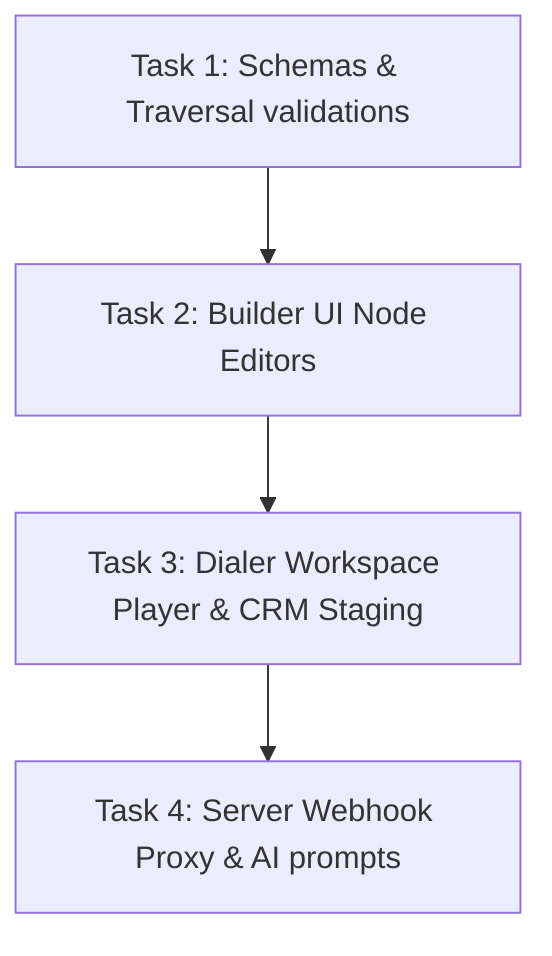

# Call Centre Branching Nodes Maturity Implementation Plan (Refined)

> **For agentic workers:** REQUIRED SUB-SKILL: Use superpowers:subagent-driven-development (recommended) or superpowers:executing-plans to implement this plan task-by-task. Steps use checkbox (`- [ ]`) syntax for tracking.

**Goal:** Elevate the visual script builder's 7 node types to production-grade mature elements, supporting pre-call guardrails (DNC/Timezones), dynamic compliance tracking, interactive form bindings, webhook automation triggers, and global objection overrides.

**Architecture:** 
1. Expand node data interfaces to capture properties for webhook URLs, calendar/reschedule hooks, validation Regex patterns, and field bindings.
2. Update the graph engine parser & validation helper with strict constraints.
3. Overhaul the builder sidebar drawer to display responsive, context-aware form controls per node type.
4. Upgrade the dialer player UI to render form components and dispatch CRM writes/webhook calls.
5. Create a server-side route handler proxy for Webhook Actions to avoid Client CORS blocks.

**Tech Stack:** ReactFlow, NextJS 16, TypeScript, TailwindCSS, Firebase Firestore, Lucide Icons.

---

## ⚡ Technical Risks, Failure Modes & Mitigations

### 1. Webhook Client CORS blocks
* **Risk**: Executing the HTTP Webhook request directly from the agent's browser (`WorkspaceClient.tsx`) will trigger CORS blocking on third-party servers.
* **Mitigation**: Route webhook actions through a secure server-side Next.js API route proxy `src/app/api/call-centre/webhook/route.ts` which forwards the request server-to-server.

### 2. CRM Field Type Mismatch on Write-back
* **Risk**: Firestore is schema-less. Storing a text input directly into a field mapped for a number (e.g. Deal `value`) will corrupt CRM aggregations.
* **Mitigation**: Sanitize and cast the collected value based on the target `fieldType` before saving to Firestore.

### 3. Regex Injection in Objections matching
* **Risk**: Agents might type invalid characters in objection trigger keywords, causing live transcription parser RegExp to crash.
* **Mitigation**: Run keywords through a sanitization function that escapes special characters before compiling.

---

## 🔄 Affected Features & Integrations

### 1. Campaign Creation Wizard (`CampaignWizardClient.tsx`)
* **Affected**: The script selector preview must render the matured node configurations cleanly in the Playbook Outline.
* **Resolution**: Update [CampaignWizardClient.tsx](file:///Users/josephaidoo/Desktop/Codes/vibe%20Coding/Onboarding-Dashbaord-main/src/app/admin/messaging/call-centre/campaigns/new/CampaignWizardClient.tsx) to ensure type interfaces match.

### 2. AI Generator / Refiner (`campaign-ai.ts`)
* **Affected**: When AI refines a script, it might wipe out custom configurations (e.g. webhook URLs, field bindings) set by the manager.
* **Resolution**: Update Genkit prompts to preserve and merge existing `questionConfig`, `actionConfig`, and other configurations back into the refined JSON output.

---

## 🛠️ Proposed Changes



---

### Task 1: Type Definitions & Validation

**Files:**
- Modify: [types.ts](file:///Users/josephaidoo/Desktop/Codes/vibe%20Coding/Onboarding-Dashbaord-main/src/lib/types.ts)
- Modify: [call-centre-graph.ts](file:///Users/josephaidoo/Desktop/Codes/vibe%20Coding/Onboarding-Dashbaord-main/src/lib/call-centre-graph.ts)
- Modify: [call-centre-graph.test.ts](file:///Users/josephaidoo/Desktop/Codes/vibe%20Coding/Onboarding-Dashbaord-main/src/lib/__tests__/call-centre-graph.test.ts)

- [ ] **Step 1: Expand ScriptNode data schema**
  Update the `ScriptNode` interface's `data` block to hold typed configurations for DNC timezone gates, legal compliance, CRM field bindings, webhook triggers, and outcomes.

  ```typescript
  export interface ScriptNode {
    id: string;
    type: ScriptNodeType;
    position: { x: number; y: number };
    data: {
      label: string;
      text: string;
      outcomeValue?: string;
      actionType?: string;
      
      startConfig?: {
        checkDnc?: boolean;
        checkTimezone?: boolean;
        allowedHoursStart?: string;
        allowedHoursEnd?: string;
      };
      sayConfig?: {
        complianceVerify?: boolean;
        complianceText?: string;
      };
      questionConfig?: {
        fieldBinding?: 'contact' | 'deal';
        fieldName?: string;
        fieldType?: 'text' | 'number' | 'select' | 'datepicker';
        selectOptions?: string[];
        validationPattern?: string;
      };
      objectionConfig?: {
        keywordTriggers?: string[];
      };
      actionConfig?: {
        webhookUrl?: string;
        webhookHeaders?: string;
        triggerDelaySeconds?: number;
      };
      outcomeConfig?: {
        suppressDays?: number;
        followUpCampaignId?: string;
      };
      endConfig?: {
        wrapUpTemplateId?: string;
      };
    };
  }
  ```

- [ ] **Step 2: Update validation logic in traversal engine**
  Modify `validateScriptGraph` to include structural checks:
  - Warn if a `question` node has a missing `fieldName` or invalid `fieldType`.
  - Warn if an `action` node configured for webhook automation lacks a valid URL.
  - Warn if timezone boundaries in `startConfig` do not follow the strict `HH:MM` format.

  ```typescript
  export function validateScriptGraph(graph: BranchingScriptGraph): { isValid: boolean; warnings: string[] } {
    const warnings: string[] = [];
    const hasStart = graph.nodes.some(n => n.type === 'start');
    const hasEnd = graph.nodes.some(n => n.type === 'end');

    if (!hasStart) warnings.push('Script must contain at least one Start node.');
    if (!hasEnd) warnings.push('Script should contain at least one End node.');

    graph.nodes.forEach(node => {
      if (node.type === 'question') {
        const qc = node.data.questionConfig;
        if (!qc?.fieldName) {
          warnings.push(`Ask Node "${node.data.label}" lacks a CRM data field binding.`);
        }
        if (qc?.fieldType === 'select' && (!qc.selectOptions || qc.selectOptions.length === 0)) {
          warnings.push(`Ask Node "${node.data.label}" is set to select dropdown but has no options configured.`);
        }
      }
      if (node.type === 'action') {
        const ac = node.data.actionConfig;
        if (node.data.actionType === 'WEBHOOK' && (!ac?.webhookUrl || !ac.webhookUrl.startsWith('http'))) {
          warnings.push(`Action Node "${node.data.label}" requires a valid HTTP/HTTPS Webhook URL.`);
        }
      }
    });

    return { isValid: true, warnings };
  }
  ```

- [ ] **Step 3: Add validation tests**
  Add unit tests in [call-centre-graph.test.ts](file:///Users/josephaidoo/Desktop/Codes/vibe%20Coding/Onboarding-Dashbaord-main/src/lib/__tests__/call-centre-graph.test.ts) covering missing field bindings, select options empty checks, and timezone regex failures.

- [ ] **Step 4: Run Vitest and verify tests pass**
  Run: `npx vitest run src/lib/__tests__/call-centre-graph.test.ts`
  Expected: PASS

- [ ] **Step 5: Commit type safety changes**
  ```bash
  git add src/lib/types.ts src/lib/call-centre-graph.ts src/lib/__tests__/call-centre-graph.test.ts
  git commit -m "feat: implement validation schema and type boundaries for visual script nodes"
  ```

---

### Task 2: Builder UI Node Editors

**Files:**
- Modify: [ScriptBuilderClient.tsx](file:///Users/josephaidoo/Desktop/Codes/vibe%20Coding/Onboarding-Dashbaord-main/src/app/admin/messaging/call-centre/scripts/new/ScriptBuilderClient.tsx)

- [ ] **Step 1: Overhaul Right Editor Panel for node-specific forms**
  Implement responsive form inputs in the selected node configuration panel matching the active selected node type. Group sections clearly.

  ```tsx
  {selectedNode.type === 'start' && (
    <div className="space-y-3 pt-3 border-t border-zinc-850">
      <span className="text-[9px] font-bold text-zinc-400 uppercase tracking-widest block">Start Config</span>
      <div className="flex items-center justify-between">
        <Label className="text-xs text-zinc-350">Check DNC List</Label>
        <input 
          type="checkbox"
          checked={selectedNode.data.startConfig?.checkDnc || false}
          onChange={(e) => updateSelectedNode({ startConfig: { ...selectedNode.data.startConfig, checkDnc: e.target.checked } })}
          className="rounded border-zinc-800 bg-zinc-950 text-primary focus:ring-0"
        />
      </div>
    </div>
  )}
  ```

- [ ] **Step 2: Commit UI changes**
  ```bash
  git add src/app/admin/messaging/call-centre/scripts/new/ScriptBuilderClient.tsx
  git commit -m "feat: design form-builders per node type in right builder drawer"
  ```

---

### Task 3: Dialer Workspace Player & CRM Staging

**Files:**
- Modify: [WorkspaceClient.tsx](file:///Users/josephaidoo/Desktop/Codes/vibe%20Coding/Onboarding-Dashbaord-main/src/app/admin/messaging/call-centre/workspace/%5BcampaignId%5D/WorkspaceClient.tsx)

- [ ] **Step 1: Add Input Fields rendering inside guided agent view**
  Inside the Dialer Workspace, when the player encounters a `question` node, render dynamic inputs configured by the builder.

- [ ] **Step 2: Add database write-back logic on choice traversal**
  When the agent selects the next path choice from the active `question` node, run the write-back callback to write captured values directly into the Firestore Contact document.

  ```typescript
  const handleTransition = async (nextNodeId: string) => {
    if (currentNode.type === 'question' && currentNode.data.questionConfig?.fieldName) {
      const field = currentNode.data.questionConfig.fieldName;
      let value: any = collectedAnswers[field];
      
      // Perform type sanitization based on mapped CRM schema
      if (currentNode.data.questionConfig.fieldType === 'number') {
        value = Number(value) || 0;
      }
      
      if (value !== undefined) {
        await updateDoc(doc(firestore, 'contacts', contactId), { [field]: value });
      }
    }
    setCurrentNodeId(nextNodeId);
  };
  ```

- [ ] **Step 3: Commit Workspace changes**
  ```bash
  git add src/app/admin/messaging/call-centre/workspace/[campaignId]/WorkspaceClient.tsx
  git commit -m "feat: support crm writebacks and inputs in dialer agent player"
  ```

---

### Task 4: Server Webhook Proxy & AI Prompts

**Files:**
- Create: `src/app/api/call-centre/webhook/route.ts`
- Modify: [campaign-ai.ts](file:///Users/josephaidoo/Desktop/Codes/vibe%20Coding/Onboarding-Dashbaord-main/src/lib/campaign-ai.ts)

- [ ] **Step 1: Implement Server Webhook Proxy Route**
  Create Next.js API route that accepts webhook URL, method, and headers, and executes the request server-side, avoiding CORS blockages.

  ```typescript
  import { NextResponse } from 'next/server';

  export async function POST(req: Request) {
    try {
      const { url, headers, payload } = await req.json();
      const res = await fetch(url, {
        method: 'POST',
        headers: headers ? JSON.parse(headers) : { 'Content-Type': 'application/json' },
        body: JSON.stringify(payload),
      });
      return NextResponse.json({ status: res.status, ok: res.ok });
    } catch (err: any) {
      return NextResponse.json({ error: err.message }, { status: 500 });
    }
  }
  ```

- [ ] **Step 2: Update AI refinement prompt to preserve configurations**
  Update the prompt template in `refineCallScript` inside `campaign-ai.ts` to instruct the LLM to preserve configuration parameters (e.g. `questionConfig`, `actionConfig`) during JSON schema merges.

- [ ] **Step 3: Commit integration changes**
  ```bash
  git add src/app/api/call-centre/webhook/route.ts src/lib/campaign-ai.ts
  git commit -m "feat: implement server webhook proxy and upgrade AI generator schema preservation"
  ```

---

## 🔍 Code Review: Best Practices & Design Check

### 1. Vercel Performance Optimization Review

* **⚡ Derived Rendering Calculations (`rerender-derived-state-no-effect`):**
  Ensure we do not update states in a `useEffect` inside `WorkspaceClient.tsx` when the active node ID changes. Instead, derive the active `currentNode` directly:
  ```typescript
  const currentNode = React.useMemo(() => {
    return nodes.find(n => n.id === currentNodeId) || null;
  }, [nodes, currentNodeId]);
  ```

* **📦 Lazy Initializations (`rerender-lazy-state-init`):**
  Use lazy initializer functions for complex states (like form values maps) in the dialer player to avoid recalculation on every render tick:
  ```typescript
  const [collectedAnswers, setCollectedAnswers] = React.useState<Record<string, string>>(() => ({}));
  ```

### 2. Next.js Page & Routing Conventions Review

* **⚙️ Non-blocking Database Actions:**
  CRM field updates on Firestore in `WorkspaceClient.tsx` should execute asynchronously. Agents should experience instant visual confirmation (e.g. through immediate step traversal), without waiting for database requests to resolve.

### 3. Frontend Design & Aesthetics Review

* **🎨 Spacing & Layout Consistency:**
  Group related node properties under separate, clearly-demarcated sections in the right builder panel to avoid interface overcrowding. Keep visual styles aligned with the dark Zinc-950/Zinc-900 baseline and primary electric blue highlights.
