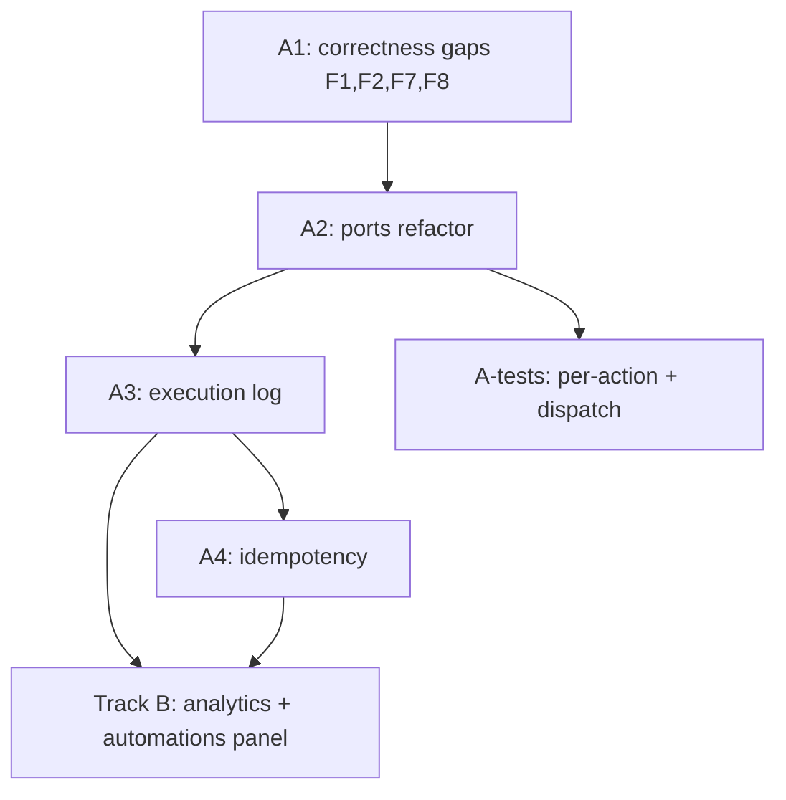

# Call Centre — Trigger Propagation, Testability & Analytics Plan

> **Status:** Proposal for review (no code yet).
> **Date:** 2026-06-22
> **Scope:** Two tracks — **(A)** make call-centre triggers/actions propagate reliably across the app *and* be properly testable, and **(B)** analytics & reporting. Telephony, billing, and predictive dialing are explicitly out of scope here.

---

## 0. Context — How triggers flow today

There are **two entry points** that both funnel into **one shared effect engine**, which is the right shape:

```
                       submitOutcome()  ──► executeCampaignAutomations()  ─┐
 (post-call, async)    [call-centre-service.ts:723]   [:910]              │
                                                                          ├─► executeCallActionEffect(type, params, ctx)
 (live, during call)   WorkspaceClient / InteractiveScriptView           │   [call-centre-service.ts:951]  ← single source of truth
                       └► executeScriptActionAction() ► executeScriptAction()┘
                          [call-centre-actions.ts:127]   [:1327]
```

`executeCallActionEffect` is a 12-case switch that reaches directly into app modules:
`updateEntityAction`, `applyTagsAction` / `removeTagsAction`, `createTaskAction`, `sendSms`,
`sendEmail`, `sendWhatsApp` (dynamic import), `logActivity`, and raw `adminDb` reads/writes.

Each `outcome` on a campaign maps to an array of rules: `campaign.automationRules[outcome]`
([types.ts:4334](../../../src/lib/types.ts)). After an agent submits an outcome, the matching
rules run in `after()` (fire-and-forget).

This section is correct architecturally. The problems below are about **correctness of propagation**,
**reliability/visibility**, and **testability** — not the overall shape.

---

## Track A — Trigger propagation & testability

### A0. Findings (confirmed in code)

| # | Severity | Finding | Evidence |
|---|----------|---------|----------|
| F1 | **High** | `TRANSFER_CALL` is offered in the builder UI (`CALL_ACTION_META`, with default params) but the engine returns `unsupported` for it. A manager can configure a Transfer Call action that **silently does nothing** — the automation loop swallows `unsupported` with only a `console.error`. | UI: [call-action-types.ts:114](../../../src/lib/call-action-types.ts); engine has no `TRANSFER_CALL` case → falls to `default` ([call-centre-service.ts:1315](../../../src/lib/services/call-centre-service.ts)) |
| F2 | **High** | The **post-call automation path does not pass `contactId`**. The queue item targets a *specific* contact (`contactId`/`contactName`), but `SEND_SMS`/`SEND_EMAIL`/`SEND_WHATSAPP`/`UPDATE_CONTACT` always resolve the entity's **primary** contact. So a campaign that called the "Finance signatory" sends the follow-up SMS to the primary contact instead. | `executeCampaignAutomations` calls effect with only `{entityId,userId,workspaceId,organizationId}` ([:929](../../../src/lib/services/call-centre-service.ts)); `submitOutcome` transaction result drops `contactId` ([:758](../../../src/lib/services/call-centre-service.ts)) |
| F3 | **High** | The **automation path has no tests at all.** Submitting an outcome → triggering the right rules is entirely uncovered. Only the *live per-node* path is tested. | [call-centre-script-action.test.ts](../../../src/lib/__tests__/call-centre-script-action.test.ts) covers `executeScriptActionAction` only |
| F4 | **Medium** | **Half the action types are untested.** Tested: CREATE_TASK, ADD_TAG, REMOVE_TAG, WEBHOOK, LOG_NOTE, SCHEDULE_MEETING. Untested: SEND_SMS, SEND_EMAIL, SEND_WHATSAPP, CHANGE_STAGE, UPDATE_CONTACT, ADD_TO_CALL_CAMPAIGN (+ the unsupported TRANSFER_CALL). The messaging actions are untested because the loose `firebase-admin` mock can't model "entity → primary contact → phone". | test file mock returns one doc for every `.doc().get()` |
| F5 | **Medium** | **No execution visibility.** Automation failures are `console.error` only. A manager never learns that "SMS for outcome *Interested* failed: contact has no phone." There's a `call_completed` activity log, but **no per-action success/failure record**. Propagation across the app is effectively unauditable. | [:936](../../../src/lib/services/call-centre-service.ts) |
| F6 | **Medium** | **No idempotency.** `submitOutcome` can run twice (double-click, client retry, `after()` + fallback both firing in edge cases) and re-fire every automation — duplicate tasks, duplicate SMS. No idempotency key or "automations already ran" guard. | [:782–804](../../../src/lib/services/call-centre-service.ts) |
| F7 | **Low** | **Outcome key matching is exact-string.** `automationRules[outcome]` won't match if the stored outcome has case/whitespace drift from the rule key. | [:925](../../../src/lib/services/call-centre-service.ts) |
| F8 | **Low** | **Hardcoded `entityType: 'person'`** in CREATE_TASK and LOG_NOTE even though the real type is on the queue item — pollutes downstream CRM data/filters. | [:999](../../../src/lib/services/call-centre-service.ts), [:1109](../../../src/lib/services/call-centre-service.ts) |
| F9 | **Low** | **Engine is hard to unit-test** because it imports concrete modules and `adminDb` directly. Tests must mock 8+ modules and can't assert messaging branches cleanly (see F4). | structure of `executeCallActionEffect` |

### A1. Goal

Every configured trigger (task creation, SMS/email/WhatsApp, stage change, tags, notes, meetings,
webhooks, transfer, add-to-campaign, contact update) **fires against the correct contact, is
observable when it fails, never double-fires, and is covered by fast unit tests** that don't require
the Firestore emulator.

### A2. Proposed changes

**Step 1 — Close the correctness gaps (small, high-value).**
- **F2:** Thread `contactId`/`contactName` from the queue item through `submitOutcome` →
  `executeCampaignAutomations` → `executeCallActionEffect`, and make the messaging/update cases prefer
  the targeted contact, falling back to primary only when absent.
- **F1:** Either implement `TRANSFER_CALL` (warm/cold transfer metadata + activity log; full bridging
  is a telephony concern, deferred) **or** mark it `disabled` in `CALL_ACTION_META` so the builder
  can't offer an action the backend ignores. Recommend: implement a minimal logging/record version now,
  gate the "live bridge" behind the future telephony track.
- **F7:** Normalize outcome keys (trim + canonical case) on both write (rule definition) and read
  (lookup) so rules reliably match.
- **F8:** Pass the real `entityType` from the queue item into CREATE_TASK / LOG_NOTE.

**Step 2 — Introduce a side-effects "ports" layer for testability (F9, unlocks F3/F4).**
Extract the concrete dependencies of `executeCallActionEffect` behind a single injected interface so
the switch logic can be tested with plain in-memory fakes — no `firebase-admin` mocking gymnastics.

```ts
// call-centre-effects.ts (new)
export interface CallEffectPorts {
  getEntity(entityId: string): Promise<EntityRecord | null>;
  updateEntity(entityId: string, patch: Partial<EntityRecord>, actor: string, ws: string, org: string): Promise<Result>;
  applyTags(entityId: string, tagIds: string[], actor: string): Promise<Result>;
  removeTags(entityId: string, tagIds: string[], actor: string): Promise<Result>;
  createTask(input: TaskInput, actor: string): Promise<Result>;
  sendSms(input: SmsInput): Promise<Result>;
  sendEmail(input: EmailInput): Promise<Result>;
  sendWhatsApp(input: WhatsAppInput): Promise<Result>;
  getTemplate(id: string): Promise<TemplateRecord | null>;
  logNote(input: NoteInput): Promise<Result>;
  scheduleMeeting(input: MeetingInput): Promise<Result>;
  callWebhook(input: WebhookInput): Promise<Result>;   // SSRF-guarded (see note)
  now(): string;
}

export async function executeCallActionEffect(
  type: CallActionType, params: Record<string, any>, ctx: EffectCtx, ports: CallEffectPorts
): Promise<EffectResult> { /* the existing switch, but calling ports.* */ }
```

- Production wiring builds `ports` from the real modules (a thin `createLiveCallEffectPorts()`); the
  service keeps its current public methods so callers don't change.
- This is a **mechanical refactor** — move the side-effect calls behind the interface, no behavior
  change — so it can land with the existing tests staying green, then new tests are added on top.

**Step 3 — Per-action execution log + manager visibility (F5).**
- Write a `call_action_executions` record (or subcollection on the queue item) for **every** action:
  `{ queueItemId, campaignId, entityId, contactId, outcome, type, params (redacted), status:
  'success'|'failed'|'unsupported', error?, source: 'automation'|'script', durationMs, createdAt }`.
- Surface a small "Automations" tab on the campaign analytics page (Track B) showing failures so a
  manager can see "3 SMS follow-ups failed — no phone number."

**Step 4 — Idempotency (F6).**
- Guard `submitOutcome` so re-submitting the same queue item is a no-op for automations: store an
  `automationsRanAt` / `outcomeSubmissionId` on the queue item and short-circuit if already processed.
- Make individual effects idempotent where cheap (e.g., don't create a duplicate open follow-up task
  for the same queue item + outcome).

### A3. Test strategy (the core ask: "all actions should work well with testability")

Three layers, fast → realistic:

1. **Pure unit tests on `executeCallActionEffect` with fake ports** — one test per `CallActionType`
   asserting it calls the right port with the right args, casts/validates inputs, targets the correct
   contact (F2), and returns typed results (incl. `unsupported`). No emulator, runs in ms. This is the
   layer that closes **F3 + F4** completely.
2. **Automation-dispatch tests on `executeCampaignAutomations`** — given a campaign with
   `automationRules`, assert the right rules fire for an outcome, in order, with contact context, and
   that one failing rule doesn't abort the rest, and that an execution record is written per rule.
3. **Idempotency + integration test** — re-submit the same outcome, assert automations run exactly
   once; one Firestore-emulator test (`pnpm test:emulator`) exercising `submitOutcome` end-to-end
   through real `adminDb` for confidence the wiring matches the fakes.

Add a `pnpm test:call-centre` script (`vitest run src/lib/__tests__/call-centre*`) and wire it into the
existing `verify` gate.

**Security note (carry-over):** while touching `callWebhook`, add an SSRF guard (block private/loopback/
metadata IP ranges, require `https`) and authenticate the
[`/api/call-centre/webhook` proxy route](../../../src/app/api/call-centre/webhook/route.ts), which is
currently unauthenticated and fetches arbitrary client-supplied URLs. Out of this plan's *primary*
scope but should ride along since the code is being opened.

### A4. Acceptance criteria (Track A)
- [ ] Every `CallActionType` either executes or is explicitly disabled in the builder (no silent no-ops).
- [ ] Follow-up messaging/contact-update actions target the **called** contact, not just primary.
- [ ] Each action produces a success/failure execution record; failures are visible to managers.
- [ ] Re-submitting an outcome never double-fires automations.
- [ ] 100% of `CallActionType` cases covered by unit tests; automation dispatch + idempotency covered;
      `pnpm test:call-centre` green and wired into `verify`.

---

## Track B — Analytics & reporting

### B0. Findings
Current analytics ([CampaignAnalyticsClient.tsx](../../../src/app/admin/messaging/call-centre/analytics/%5BcampaignId%5D/CampaignAnalyticsClient.tsx))
are **single-campaign** and shallow: outcome counts + progress + a completed-call list, computed
client-side from `queueItems`. Gaps:
- No **agent performance** (calls handled, calls/hour, connect rate, conversion, avg talk time).
- No **time-series** (volume/outcomes per day/hour).
- No **cross-campaign** dashboard.
- No **funnel** (queued → attempted → connected → positive outcome).
- No **export** (CSV).
- **Duration is unreliable** — a manual `setInterval` stopwatch
  ([WorkspaceClient.tsx:342](../../../src/app/admin/messaging/call-centre/workspace/%5BcampaignId%5D/WorkspaceClient.tsx)),
  so any talk-time metric is caveated until real telephony lands. Report it, but label it
  "agent-reported."

### B1. Goal
Managers can answer: *Which campaigns/agents/outcomes are working? Where are contacts dropping out?
Are automations firing?* — with cross-campaign rollups and export.

### B2. Proposed changes
- **Aggregation layer:** add `CallCentreService.getCampaignAnalytics(campaignId)` and
  `getWorkspaceCallAnalytics(workspaceId, range)` returning typed summaries (outcome breakdown, funnel,
  per-agent stats, time buckets). Compute server-side from `call_queue_items` (+ the new
  `call_action_executions` from Track A). Keep these **pure and unit-tested** — pass in queue items,
  assert the rollups — mirroring the Track A testability principle.
- **Per-agent metrics:** group completed items by `assignedTo` at completion time. *Requires* recording
  the completing agent on the queue item at outcome time (today `assignedTo` is cleared on submit) —
  add `completedBy` to `CallQueueItem` in `submitOutcome`.
- **Funnel + connect rate:** derive from statuses/outcomes (`scheduled → in_progress → completed`,
  connected = outcome not in {no answer, voicemail, wrong number}). Document the outcome→bucket mapping
  in one place and reuse it (today the bucketing logic is duplicated string-matching in both the
  workspace and analytics clients — consolidate into a shared `classifyOutcome()` helper).
- **Workspace dashboard:** a new cross-campaign overview (totals, top outcomes, agent leaderboard,
  trend) on the call-centre landing page.
- **Automations panel:** surface the `call_action_executions` failures (ties Track A → visibility).
- **CSV export:** completed calls + per-agent summary.

### B3. Acceptance criteria (Track B)
- [ ] Shared `classifyOutcome()` helper; no duplicated outcome string-matching.
- [ ] Server aggregation functions are pure + unit-tested.
- [ ] Per-agent stats accurate (requires `completedBy`).
- [ ] Cross-campaign dashboard + per-campaign funnel + automations failures panel.
- [ ] CSV export of completed calls and agent summary.

---

## Sequencing



**Recommended order:** A1 (quick correctness wins) → A2 (ports refactor) → A-tests (lock it in) →
A3/A4 (visibility + idempotency) → Track B (which consumes A3's execution log). The webhook SSRF/auth
hardening rides along in A2/A3.

## Risks
- **Ports refactor regressions** — mitigate by landing it as a pure move with existing tests green
  before adding new behavior.
- **`completedBy` migration** — older completed items lack it; per-agent history is forward-looking
  only (acceptable; note in UI).
- **Talk-time validity** — duration is agent-reported until telephony exists; label clearly, don't
  build conversion-per-minute style metrics on it yet.
