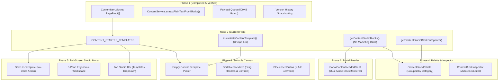

# Phase 2 Detailed Implementation Plan: Shared Content Templates & Registry Filtering

> **For agentic workers:** REQUIRED SUB-SKILL: Use superpowers:subagent-driven-development (recommended) or superpowers:executing-plans to implement this plan task-by-task. Steps use checkbox (`- [ ]`) syntax for tracking.

**Goal:** Establish shared, high-fidelity pedagogical and editorial starter templates (`CONTENT_STARTER_TEMPLATES`) and Content Studio block registry filters (`getContentStudioBlocks`), ensuring seamless cross-builder reuse without landing page marketing bloat, and preparing the structural foundation for the interactive sortable canvas (Phase 3) and palette (Phase 4).

**Architecture:**
1. **Shared Template Contract (`ContentStarterTemplate`)**: A strictly typed representation (`id`, `name`, `description`, `type`, `category`, `badge`, `blocks: PageBlock[]`, `suggestedSummary`) that feeds directly into `ContentItem.blocks`.
2. **Template Hydration & ID Regeneration (`instantiateContentTemplate`)**: Clones template block ASTs while generating fresh, globally unique IDs for each block and nested child block, eliminating ID collisions.
3. **Editorial Registry Filter (`getContentStudioBlocks`)**: Curates `allBlocks()` from `src/lib/page-builder/registry.tsx` into a high-signal editorial palette, excluding landing-page bloat (`countdown`, `app_download`, `payment_methods`, `logo_grid`) while preserving layout containers, media players, rich text, and pedagogical list blocks.
4. **Categorized Block Metadata (`getContentStudioBlockCategories`)**: Groups available studio blocks into 5 intuitive, everyday plain-English categories (*Text & Structure*, *Media & Embeds*, *Interactive & Lists*, *Layout Containers*, *Engagement & Proof*) for direct consumption by the Phase 4 Palette.
5. **Backwards & Search Compatibility**: Template block trees validate 100% against Zod schemas in `blockRegistry` and produce rich plain text when processed by `ContentService.extractPlainTextFromBlocks`.

**Tech Stack:** Next.js 15, TypeScript (strictly 0 `any` / 0 `any[]`), Zod, Vitest.

---

## File Structure & Responsibilities

| File Path | Action | Architectural Responsibility |
|:---|:---|:---|
| `src/lib/page-builder/templates/content-templates.ts` | Create | Defines `ContentStarterTemplate` interface, 4 starter templates (Standard Article, Curriculum Lesson, Downloadable Resource, Knowledge Base Doc), and `instantiateContentTemplate()`. |
| `src/lib/page-builder/templates/index.ts` | Modify | Re-exports `CONTENT_STARTER_TEMPLATES`, `ContentStarterTemplate`, and `instantiateContentTemplate()`. |
| `src/lib/page-builder/registry.tsx` | Modify | Implements `getContentStudioBlocks()` and `getContentStudioBlockCategories()` for clean palette rendering. |
| `src/lib/page-builder/__tests__/content-templates.test.ts` | Create | Unit test suite verifying template validity, schema parsing, ID uniqueness, block filtering, and search text extraction. |

---

## Foresight & Connection Across Completed & Upcoming Phases



### Key UI Impacts Anticipated
1. **Empty Canvas State (Phase 3 Preview)**:
   - When a user opens an empty content draft, instead of a blank intimidating white screen, the canvas renders an **Empty Canvas Hero**:
     - *Start Blank*: single paragraph block.
     - *Starter Templates*: 4 responsive cards showing thumbnail icon, badge (`Curriculum`, `Article`, `Guide`, `Doc`), title, and description.
     - 1-click hydration populates the canvas with pre-wired blocks instantly.
2. **Palette Navigation (Phase 4 Preview)**:
   - The Block Palette sidebar uses `getContentStudioBlockCategories()` to render 5 clean collapsible groups with icons, preventing cognitive overload and eliminating irrelevant marketing components.
3. **Admin Template Governance (Phase 5 Preview)**:
   - Admins can customize any lesson or article layout and click **"Save as Reusable Template"**, which serializes the current blocks into `portal_content_templates` in Firestore conforming to `ContentStarterTemplate`.

---

## Detailed Task Breakdown

### Task 2.1: Write Failing Unit Tests for Starter Templates & Registry Filter

**Files:**
- Create: `src/lib/page-builder/__tests__/content-templates.test.ts`

- [ ] **Step 1: Write test suite covering starter templates, registry filter, and schema validation**

Create `src/lib/page-builder/__tests__/content-templates.test.ts`:

```typescript
import { describe, it, expect } from 'vitest';
import {
  CONTENT_STARTER_TEMPLATES,
  instantiateContentTemplate,
  type ContentStarterTemplate,
} from '../templates/content-templates';
import {
  getContentStudioBlocks,
  getContentStudioBlockCategories,
  validateBlockProps,
  getBlock,
} from '../registry';
import { ContentService } from '@/lib/services/content-service';
import '@/lib/page-builder/blocks'; // Register all blocks

describe('Phase 2: Shared Content Templates & Registry Filtering', () => {
  describe('Starter Templates Catalog', () => {
    it('provides all 4 core starter templates with rich initial structures', () => {
      expect(CONTENT_STARTER_TEMPLATES.length).toBeGreaterThanOrEqual(4);

      const expectedIds = [
        'article-standard-starter',
        'lesson-curriculum-starter',
        'resource-download-starter',
        'documentation-kb-starter',
      ];

      for (const id of expectedIds) {
        const tpl = CONTENT_STARTER_TEMPLATES.find((t: ContentStarterTemplate) => t.id === id);
        expect(tpl).toBeDefined();
        expect(tpl?.blocks.length).toBeGreaterThan(0);
        expect(tpl?.name).toBeTruthy();
        expect(tpl?.description).toBeTruthy();
      }
    });

    it('validates every block in each starter template against its registered Zod schema', () => {
      for (const tpl of CONTENT_STARTER_TEMPLATES) {
        for (const block of tpl.blocks) {
          const def = getBlock(block.type);
          expect(def, `Block type "${block.type}" in template "${tpl.id}" must be registered`).toBeDefined();

          // Ensure props validate cleanly without falling back to blank defaults
          const parsed = validateBlockProps(block);
          expect(parsed).toBeDefined();
        }
      }
    });

    it('instantiateContentTemplate deep-clones blocks and assigns unique IDs', () => {
      const original = CONTENT_STARTER_TEMPLATES[0];
      const instance1 = instantiateContentTemplate(original.id);
      const instance2 = instantiateContentTemplate(original.id);

      expect(instance1.length).toBe(original.blocks.length);
      expect(instance2.length).toBe(original.blocks.length);

      // Verify IDs are distinct from the original template and from each other
      for (let i = 0; i < instance1.length; i++) {
        expect(instance1[i].id).not.toBe(original.blocks[i].id);
        expect(instance1[i].id).not.toBe(instance2[i].id);
        expect(instance1[i].type).toBe(original.blocks[i].type);
      }
    });

    it('extracts searchable plain text from starter templates for search parity', () => {
      for (const tpl of CONTENT_STARTER_TEMPLATES) {
        const text = ContentService.extractPlainTextFromBlocks(tpl.blocks);
        expect(text.trim().length, `Template ${tpl.id} must synthesize non-empty text`).toBeGreaterThan(20);
      }
    });
  });

  describe('Content Studio Registry Filter (getContentStudioBlocks)', () => {
    it('filters out landing-page campaign bloat while retaining editorial and media blocks', () => {
      const studioBlocks = getContentStudioBlocks();
      const types = studioBlocks.map((b) => b.type);

      // Must include essential editorial, media, and layout blocks
      expect(types).toContain('title');
      expect(types).toContain('text');
      expect(types).toContain('video');
      expect(types).toContain('image');
      expect(types).toContain('columns');
      expect(types).toContain('container');
      expect(types).toContain('procedure_list');
      expect(types).toContain('step_section');
      expect(types).toContain('faq');
      expect(types).toContain('divider');
      expect(types).toContain('spacer');
      expect(types).toContain('cta');
      expect(types).toContain('testimonial');

      // Must exclude campaign and e-commerce marketing widgets
      expect(types).not.toContain('countdown');
      expect(types).not.toContain('app_download');
      expect(types).not.toContain('payment_methods');
      expect(types).not.toContain('logo_grid');
    });

    it('provides organized block categories with plain-English labels for the studio palette', () => {
      const categories = getContentStudioBlockCategories();
      expect(categories.length).toBeGreaterThanOrEqual(4);

      const categoryKeys = categories.map((c) => c.category);
      expect(categoryKeys).toContain('text');
      expect(categoryKeys).toContain('media');
      expect(categoryKeys).toContain('lists');
      expect(categoryKeys).toContain('layout');

      // Every block in each category must be a valid studio block
      const studioBlocks = getContentStudioBlocks();
      const studioTypes = new Set(studioBlocks.map((b) => b.type));

      for (const cat of categories) {
        expect(cat.label).toBeTruthy();
        for (const type of cat.types) {
          expect(studioTypes.has(type), `Type "${type}" in category "${cat.category}" must be in studio blocks`).toBe(true);
        }
      }
    });
  });
});
```

- [ ] **Step 2: Run test to confirm it fails**

Run: `npx vitest run src/lib/page-builder/__tests__/content-templates.test.ts`
Expected: FAIL (`content-templates.ts` does not exist, `getContentStudioBlocks` not defined).

---

### Task 2.2: Implement Content Starter Templates (`content-templates.ts`)

**Files:**
- Create: `src/lib/page-builder/templates/content-templates.ts`

- [ ] **Step 1: Write `src/lib/page-builder/templates/content-templates.ts` with strict types and 4 starter templates**

Implement `STANDARD_ARTICLE_TEMPLATE`, `CURRICULUM_LESSON_TEMPLATE`, `RESOURCE_DOWNLOAD_TEMPLATE`, and `DOCUMENTATION_KB_TEMPLATE` along with `instantiateContentTemplate()`.

---

### Task 2.3: Re-export Templates in `src/lib/page-builder/templates/index.ts`

**Files:**
- Modify: `src/lib/page-builder/templates/index.ts`

- [ ] **Step 1: Export content starter templates and helper**

---

### Task 2.4: Update Block Registry with Content Studio Filters

**Files:**
- Modify: `src/lib/page-builder/registry.tsx`

- [ ] **Step 1: Add `getContentStudioBlocks` and `getContentStudioBlockCategories`**

---

### Task 2.5: Automated Verification & Verification Checks

- [ ] **Step 1: Run Vitest unit tests**
- [ ] **Step 2: Run strict TypeScript static analysis (`NODE_OPTIONS='--max-old-space-size=8192' npx tsc --noEmit`)**
- [ ] **Step 3: Run ESLint**
- [ ] **Step 4: Commit changes locally**
