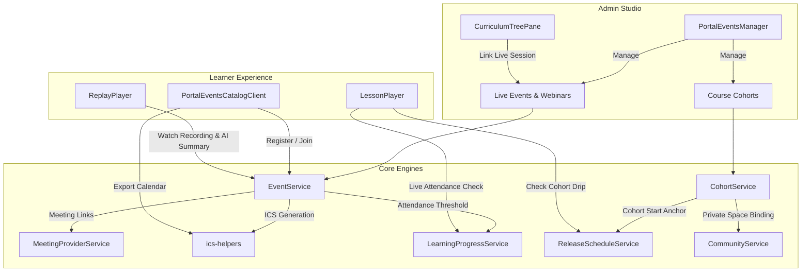

# Phase 7: Live Learning, Events & Cohorts Architecture & Implementation Plan

> **For agentic workers:** REQUIRED SUB-SKILL: Use superpowers:subagent-driven-development (recommended) or superpowers:executing-plans to implement this plan task-by-task. Steps use checkbox (`- [ ]`) syntax for tracking.

**Goal:** Turn SmartSapp Experience Platform into an enterprise-grade live training and cohort learning engine with webinars, workshops, coaching sessions, attendance tracking tied to LMS progress, post-session recording/AI pipelines, multi-cohort course management, cohort-relative drip releases, and private cohort community spaces.

**Architecture:** Extend the existing meetings framework (`src/lib/meetings/`) into a seamless portal learning experience (`EventService`, `CohortService`, `ReleaseScheduleService`, `LearningProgressService`). Unify live event scheduling (Zoom/Meet/Custom), 1-click registration, automated attendance heartbeat with threshold LMS lesson completion, post-meeting AI recording summaries, and date-anchored cohort releases with private community channels.

**Tech Stack:** Next.js 15 App Router, React 19, TypeScript (Strict 0 `any`), Tailwind CSS, Radix UI, Framer Motion / Emil Kowalski animations, Firebase Firestore & Security Rules, Vitest, Zoom Meeting SDK & Google Meet integration.

---

## 1. Executive Summary & Industry Standard

In premier online learning platforms (Maven, Section4, Kajabi, Circle.so, Teachable), live cohorts achieve up to **85% course completion rates** compared to just 5-10% for self-paced courses. Synchronous learning thrives on three pillars:
1. **Predictable Schedules & Social Accountability:** Date-bound cohorts (`Cohort Jan`, `Cohort Mar`) where learners progress through the curriculum together on a unified calendar.
2. **Frictionless Live Sessions:** One-click registration, timezone-accurate calendar syncing (`.ics` / Google / Outlook), and single-click room entry (Zoom / Google Meet).
3. **Automated Attendance & Recaps:** Real-time attendance verification that satisfies LMS curriculum requirements, paired with an automated post-session replay pipeline featuring video recordings, AI transcripts, summaries, and action checklists.

This implementation plan delivers full Phase 7 capabilities while maintaining **100% backward compatibility**, **strict typing (0 `any`)**, **mobile-first $\ge 44\text{px}$ touch targets**, **anti-quota batch chunking ($\le 400$ ops)**, and **backoffice no-code management**.

---

## 2. Competitive Feature Matrix

| Feature | Kajabi | Circle.so | Maven | SmartSapp Phase 7 |
| :--- | :---: | :---: | :---: | :---: |
| **Multi-Cohort Courses** | Limited | Yes (Spaces) | Native | **Native (`Course -> Cohorts`)** |
| **Cohort Drip Releases** | Enrollment only | Fixed Date only | Cohort start | **Synchronous (`days_after_cohort_start`)** |
| **Integrated Video Conferencing** | Zoom custom | Custom links | Zoom embedded | **Zoom, Google Meet, Teams, Custom** |
| **Calendar Sync (`.ics` / GCal)** | Basic | Yes | Full timezone | **Universal `.ics` + 1-click Web Calendars** |
| **Attendance-Driven LMS Milestones** | No (Manual) | No | Limited | **Automated (Duration % $\ge$ Threshold)** |
| **Post-Session AI Replay Pipeline** | Video only | Video only | Summary | **Video + Transcript + AI Summary + Action Items** |
| **Private Cohort Community Space** | Separate | Spaces | Channels | **Auto-Provisioned Private Space** |
| **Gamification & Points Integration** | No | Basic | No | **+15 RSVP, +20 Attended, Streak sync** |

---

## 3. Architecture & Domain Contracts



### Key Data Contract Extensions

#### A. `LiveEvent` & `EventRegistration` (`src/lib/types/events.ts`)
```typescript
export type LiveEventType =
  | 'webinar'
  | 'workshop'
  | 'coaching'
  | 'office_hours'
  | 'masterclass'
  | 'cohort_session';

export type MeetingProvider = 'zoom' | 'google_meet' | 'teams' | 'custom';

export type EventStatus = 'scheduled' | 'live' | 'completed' | 'cancelled';

export type AttendanceStatus = 'registered' | 'attended' | 'partial' | 'no_show' | 'cancelled';

export interface LiveEvent {
  id: string;
  organizationId: string;
  portalId: string;
  workspaceIds: string[];
  title: string;
  slug: string;
  description?: string;
  type: LiveEventType;
  coverImageUrl?: string;
  instructorName: string;
  instructorTitle?: string;
  instructorAvatarUrl?: string;
  meetingProvider: MeetingProvider;
  meetingUrl: string;
  meetingId?: string;
  meetingPasscode?: string;
  scheduledStartTime: string; // ISO UTC
  scheduledEndTime: string;   // ISO UTC
  durationMinutes: number;
  maxAttendees?: number;
  registeredCount: number;
  attendedCount: number;
  status: EventStatus;
  isPublic: boolean;
  allowedPlanIds?: string[];
  cohortId?: string;
  courseId?: string;
  lessonId?: string;
  recordingUrl?: string;
  recordingDurationSeconds?: number;
  aiSummary?: string;
  keyTakeaways?: string[];
  actionItems?: string[];
  slideDeckUrl?: string;
  createdAt: string;
  updatedAt: string;
}

export interface EventRegistration {
  id: string;
  organizationId: string;
  portalId: string;
  eventId: string;
  userId: string;
  userName: string;
  userEmail: string;
  status: AttendanceStatus;
  calendarIcsUrl?: string;
  registeredAt: string;
  joinedAt?: string;
  leftAt?: string;
  attendedDurationSeconds?: number;
  updatedAt: string;
}
```

#### B. `CourseCohort` & `CohortMember` (`src/lib/types/events.ts`)
```typescript
export type CohortMemberStatus = 'active' | 'graduated' | 'dropped';

export interface CourseCohort {
  id: string;
  organizationId: string;
  portalId: string;
  courseId: string;
  workspaceIds: string[];
  name: string;
  slug: string;
  description?: string;
  instructorId?: string;
  instructorName?: string;
  startDate: string; // ISO UTC
  endDate: string;   // ISO UTC
  maxCapacity?: number;
  enrolledCount: number;
  status: 'upcoming' | 'in_progress' | 'completed' | 'archived';
  linkedSpaceId?: string; // Private Community Space
  createdAt: string;
  updatedAt: string;
}

export interface CohortMember {
  id: string;
  organizationId: string;
  portalId: string;
  cohortId: string;
  courseId: string;
  userId: string;
  userName: string;
  userEmail: string;
  joinedAt: string;
  status: CohortMemberStatus;
  progressPercentage?: number;
  completedLessonCount?: number;
}
```

#### C. LMS Release Rule & Completion Rule Extensions (`src/lib/types/learning.ts`)
```typescript
// Add cohort-relative drip to ReleaseScheduleType
export type ReleaseScheduleType =
  | 'immediate'
  | 'specific_date'
  | 'days_after_enrollment'
  | 'days_after_join'
  | 'sequential_prerequisite'
  | 'days_after_cohort_start'
  | 'cohort_start_date';

// Add live session to LessonContentType
export type LessonContentType =
  | 'video'
  | 'article'
  | 'quiz'
  | 'assignment'
  | 'interactive'
  | 'live_session';

// Add attendance to CompletionRuleType
export type CompletionRuleType =
  | 'manual_button'
  | 'video_percentage'
  | 'assessment_pass'
  | 'assignment_approved'
  | 'attendance';

export interface CompletionRule {
  type: CompletionRuleType;
  minVideoPercentage?: number; // e.g. 80
  minAssessmentScore?: number; // e.g. 75
  minAttendancePercentage?: number; // e.g. 70
}

export interface ReleaseRule {
  type: ReleaseScheduleType;
  daysDelay?: number;
  releaseDate?: string;
  requiredLessonId?: string;
  requiredModuleId?: string;
  cohortStartDate?: string; // Anchor date when evaluating days_after_cohort_start
}
```

---

## 4. Failure Modes & Resilience Matrix ("What Could Go Wrong")

| # | Risk Scenario | Severity | Mitigation Strategy |
| :--- | :--- | :--- | :--- |
| **1** | **Attendance Race Condition & Spoofing:** Learner sends fake `attendedDurationSeconds` or spam clicks join to fake 100% attendance. | **High** | Calculate duration server-side from `joinedAt` to `now` (capped by session duration). Enforce `minAttendancePercentage` threshold (default 70%) before marking lesson completed. |
| **2** | **Parameter Inversion Bug in Lesson Completion:** `LearningProgressService.completeLesson` called with inverted arguments (`portalId, courseId, lessonId, userId` vs `courseId, lessonId, userId, portalId`). | **Critical** | Fix signature in `EventService.recordEventAttendance` and add explicit unit tests ensuring progress doc writes to the correct path. |
| **3** | **Timezone Discrepancy:** International learners join at the wrong hour due to UTC vs local machine timezone confusion. | **High** | Store all dates as UTC ISO strings (`scheduledStartTime`). In the UI, render relative countdowns ("Starts in 2 hours") alongside local timezone badges using `Intl.DateTimeFormat().resolvedOptions().timeZone`. |
| **4** | **Cohort Capacity Oversubscription:** Multiple learners enroll simultaneously, exceeding `maxCapacity`. | **High** | Use `adminDb.runTransaction` when enrolling cohort members, checking `cohort.enrolledCount < cohort.maxCapacity` before committing the increment. |
| **5** | **Batch Deletion / Cascade Quota Exceeded:** Deleting a cohort with 1,000 enrolled members throws Firestore 500-op limit error. | **High** | Implement chunked batch deletion ($\le 400$ ops per batch) with `Promise.all` chunking in `CohortService.deleteCohort`. |
| **6** | **Cohort Drip Schedule Crash for Unassigned Learners:** Learner enrolled in course but not assigned to any cohort encounters an unhandled null exception during drip evaluation. | **Medium** | In `ReleaseScheduleService.evaluateRule`, if `rule.type === 'days_after_cohort_start'` and no cohort is provided, fail safe by checking course enrollment date or default to locked with `lockReason: 'Assigned to cohort required'`. |
| **7** | **Calendar Export Incompatibility:** Apple iCal or Outlook rejecting `.ics` downloads due to malformed VCALENDAR syntax or missing `UID`. | **Medium** | Reuse validated `ics-helpers.ts` from `src/lib/meetings/`, generating RFC 5545 compliant `.ics` with proper `DTSTART`, `DTEND`, `SUMMARY`, and `DESCRIPTION`. |
| **8** | **AI Replay Empty Transcript Crash:** Recording uploaded without audio transcript triggers AI processing error. | **Low** | Provide graceful fallbacks: if transcript is unavailable, publish the video replay immediately and flag AI summary as pending or optional. |

---

## 5. Backoffice Impact & No-Code Governance

### How This Empowers Portal Admins & Educators:
1. **Visual Cohort Studio:**
   - Create and schedule cohorts (`Cohort Spring 2026`, `Cohort Summer 2026`) with defined start and end dates.
   - Manage student rosters: inspect student attendance rates, add members, or remove members without writing code or touching databases.
   - 1-click binding to private community channels so students have their own peer discussion space.
2. **Event & Webinar Scheduler:**
   - Choose between **Auto Zoom**, **Auto Google Meet**, or **Custom Link**.
   - Set attendee limits, gated membership tiers, and link directly to curriculum lessons.
   - Live roster table showing who RSVP'd, who joined, and exact attendance duration.
3. **One-Click Post-Session Replay Publishing:**
   - Paste or auto-fetch recording URL.
   - Generate AI summaries, key takeaways, and action items.
   - Check **"Attach as Lesson Resource"** to instantly update the corresponding LMS course module so students can watch the recording inside the portal player.
4. **Database Permissions & Unauthenticated Public Access:**
   - Public webinars (`isPublic: true`) can be viewed and registered by prospective leads on landing pages (`/portal/[slug]/events/[eventSlug]`).
   - `firestore.rules` allows public reads on `live_events` where `isPublic == true`, while protecting attendee rosters and private cohort spaces.

---

## 6. Phase-by-Phase TDD Implementation Plan

### Phase 7.1: Data Contracts, Firestore Rules & Compound Indexes
- **Files:**
  - Modify: `src/lib/types/events.ts` (extend `LiveEvent`, `EventRegistration`, `CourseCohort`, `CohortMember`)
  - Modify: `src/lib/types/learning.ts` (extend `LessonContentType`, `CompletionRuleType`, `ReleaseScheduleType`, `ReleaseRule`, `CompletionRule`)
  - Modify: `firestore.rules` (add `cohort_members` rules)
  - Modify: `firestore.indexes.json` (add compound indexes for `course_cohorts`, `cohort_members`, `live_events`)
- [x] **Step 1: Write type & contract validation unit tests**
  - Path: `src/lib/types/__tests__/events-types.test.ts`
  - Verify that `LiveEvent`, `CourseCohort`, `CohortMember`, and extended `ReleaseRule` compile and conform to strict typing.
- [x] **Step 2: Run test to verify it fails**
  - Command: `npx vitest run src/lib/types/__tests__/events-types.test.ts`
- [x] **Step 3: Update `src/lib/types/events.ts` and `src/lib/types/learning.ts`**
  - Add `AttendanceStatus`, `CohortMemberStatus`, `days_after_cohort_start`, `cohort_start_date`, `live_session`, `attendance`.
- [x] **Step 4: Update `firestore.rules` and `firestore.indexes.json`**
  - Add security rules for `cohort_members`.
  - Add compound indexes for `course_cohorts` (`portalId, courseId, startDate`) and `cohort_members` (`cohortId, status, joinedAt`).
- [x] **Step 5: Run tests and verify they pass**
- [x] **Step 6: Commit locally** (`git commit -m "feat(events): extend schema contracts, security rules, and firestore indexes for cohorts and live sessions"`)

---

### Phase 7.2: Cohort Management Engine & Cohort-Anchored Drip Scheduler (TDD)
- **Files:**
  - Create: `src/lib/services/__tests__/cohort-service.test.ts`
  - Create: `src/lib/services/cohort-service.ts`
  - Modify: `src/lib/services/release-schedule-service.ts`
  - Modify: `src/lib/services/__tests__/release-schedule-service.test.ts`
  - Modify: `src/app/actions/event-actions.ts`
- [x] **Step 1: Write failing cohort service tests**
  - Test cohort creation with slug generation and default 'upcoming' status.
  - Test member enrollment with capacity check and transaction safety.
  - Test member removal with count decrement.
  - Test chunked batch deletion ($\le 400$ ops) when deleting a cohort with multiple members.
- [x] **Step 2: Run tests to verify they fail**
  - Command: `npx vitest run src/lib/services/__tests__/cohort-service.test.ts`
- [x] **Step 3: Implement `CohortService`**
  - Implement `createCohort`, `updateCohort`, `deleteCohort`, `enrollMember`, `removeMember`, `listCohortMembers`, `getCohortById`.
  - Ensure zero `any`, transaction safety on capacity, and chunked batch operations.
- [x] **Step 4: Implement cohort-anchored drip in `ReleaseScheduleService`**
  - Add support for `days_after_cohort_start`: unlocks when `now >= cohortStartDate + (daysDelay * 86400000)`.
  - Add support for `cohort_start_date`: unlocks when `now >= cohortStartDate`.
  - Add tests in `src/lib/services/__tests__/release-schedule-service.test.ts`.
- [x] **Step 5: Export new server actions in `src/app/actions/event-actions.ts`**
  - `enrollCohortMemberAction`, `removeCohortMemberAction`, `listCohortMembersAction`.
- [x] **Step 6: Run tests and verify they pass**
- [x] **Step 7: Commit locally** (`git commit -m "feat(cohorts): implement CohortService and cohort-anchored drip release engine"`)

---

### Phase 7.3: Live Events & Video Conferencing Provider Bridge (TDD)
- **Files:**
  - Create: `src/lib/services/__tests__/event-calendar.test.ts`
  - Modify: `src/lib/services/event-service.ts`
  - Modify: `src/lib/services/__tests__/event-service.test.ts`
  - Modify: `src/app/actions/event-actions.ts`
- [x] **Step 1: Write failing tests for calendar export and provider link generation**
  - Test `.ics` calendar content generation (DTSTART, DTEND, SUMMARY, URL, DESCRIPTION).
  - Test Google Calendar and Outlook web calendar URL generation.
  - Test meeting URL sanitization (reject `javascript:`, data URIs).
- [x] **Step 2: Run tests to verify they fail**
  - Command: `npx vitest run src/lib/services/__tests__/event-calendar.test.ts`
- [x] **Step 3: Implement Calendar & Meeting Provider Utilities in `event-service.ts`**
  - Add `generateEventIcs(event: LiveEvent): string`.
  - Add `generateCalendarWebUrls(event: LiveEvent): { google: string; outlook: string; yahoo: string }`.
  - Add `sanitizeMeetingUrl(url: string): string`.
  - Integrate with `MeetingProviderService` to support auto-generating Zoom or Google Meet links.
- [x] **Step 4: Run tests and verify they pass**
- [x] **Step 5: Commit locally** (`git commit -m "feat(events): integrate calendar export and meeting provider bridge"`)

---

### Phase 7.4: Attendance Tracking Engine & LMS Milestone Completion Bridge (TDD)
- **Files:**
  - Create: `src/lib/services/__tests__/attendance-engine.test.ts`
  - Modify: `src/lib/services/event-service.ts`
  - Modify: `src/lib/services/learning-progress-service.ts`
  - Modify: `src/app/actions/event-actions.ts`
- [x] **Step 1: Write failing attendance engine tests**
  - Test recording join timestamp (`recordJoinSession`).
  - Test recording leave / heartbeat timestamp (`recordLeaveSession`), computing `attendedDurationSeconds` and `attendancePercentage`.
  - Test automated lesson completion: when `attendancePercentage >= minAttendancePercentage`, verify `LearningProgressService.completeLesson` is called with the correct argument order `(courseId, lessonId, userId, portalId)`.
  - Test gamification points award (+20 pts) and engagement activity logging.
- [x] **Step 2: Run tests to verify they fail**
  - Command: `npx vitest run src/lib/services/__tests__/attendance-engine.test.ts`
- [x] **Step 3: Implement Attendance Engine in `event-service.ts` & `learning-progress-service.ts`**
  - Fix argument order bug in `EventService.recordEventAttendance`.
  - Implement `recordJoinSession(eventId, userId, portalId)` and `recordLeaveSession(eventId, userId, portalId, durationSeconds)`.
  - Add `attendance` completion rule check in `LearningProgressService`.
- [x] **Step 4: Run tests and verify they pass**
- [x] **Step 5: Commit locally** (`git commit -m "feat(attendance): implement attendance engine with automated LMS completion bridge"`)

---

### Phase 7.5: Post-Session Recording & AI Replay Pipeline (TDD)
- **Files:**
  - Create: `src/lib/services/__tests__/replay-pipeline.test.ts`
  - Modify: `src/lib/services/event-service.ts`
  - Modify: `src/lib/services/course-service.ts`
  - Modify: `src/app/actions/event-actions.ts`
- [x] **Step 1: Write failing replay pipeline tests**
  - Test publishing replay with video URL, duration, AI summary, key takeaways, and action items.
  - Test "Attach Replay to Course Lesson": verify the target `CourseLesson` receives the recording URL as its video URL and attachments.
- [x] **Step 2: Run tests to verify they fail**
  - Command: `npx vitest run src/lib/services/__tests__/replay-pipeline.test.ts`
- [x] **Step 3: Implement Replay-to-Curriculum Attachment in `event-service.ts`**
  - Add `attachReplayToCourseLesson(eventId: string, courseId: string, lessonId: string): Promise<void>`.
  - Add server action `attachReplayToCourseLessonAction`.
- [x] **Step 4: Run tests and verify they pass**
- [x] **Step 5: Commit locally** (`git commit -m "feat(replay): implement post-session replay and AI summary curriculum integration"`)

---

### Phase 7.6: Portal Learner Live Hub & Replay Library UI
- **Files:**
  - Modify: `src/app/portal/[slug]/events/PortalEventsCatalogClient.tsx`
  - Modify: `src/app/portal/[slug]/events/[eventSlug]/page.tsx`
  - Create: `src/app/portal/[slug]/events/[eventSlug]/PortalEventDetailClient.tsx`
  - Modify: `src/app/portal/[slug]/learn/[courseId]/page.tsx` (or Course Player)
- [x] **Step 1: Upgrade `PortalEventsCatalogClient.tsx`**
  - Add Live Countdown Timer badge with Emil Kowalski animations.
  - Add "Add to Calendar" dropdown (Google Calendar, Outlook, iCal download).
  - Add Zoom / Meet badge indicators.
  - Mobile touch targets $\ge 44\text{px}$ (`min-h-[44px]`).
- [x] **Step 2: Implement `PortalEventDetailClient.tsx`**
  - Live session header with speaker bio, countdown clock, registered attendee count.
  - Prominent "Join Live Session" button (`min-h-[48px]`, `active:scale-[0.97]`).
  - Completed state showing Replay Video Player, AI Summary accordion, Key Takeaways pill cards, and Action Checklist.
- [x] **Step 3: Add Cohort Banner & Upcoming Sessions in Course Player**
  - In `/portal/[slug]/learn/[courseId]`, render cohort indicator banner ("Spring 2026 Cohort • Starts Oct 1").
  - Show upcoming live sessions scheduled for this cohort.
  - Add "Join Cohort Discussion 💬" button linking to the cohort's private community space.
- [x] **Step 4: Run typecheck and linting**
- [x] **Step 5: Commit locally** (`git commit -m "feat(portal): upgrade live events catalog, event detail replay view, and cohort learner hub"`)

---

### Phase 7.7: Admin Backoffice Studio (Curriculum & Cohort Studio)
- **Files:**
  - Modify: `src/app/admin/portals/components/PortalEventsManager.tsx`
  - Create: `src/app/admin/portals/components/events/EventAttendanceModal.tsx`
  - Create: `src/app/admin/portals/components/events/CohortRosterModal.tsx`
  - Modify: `src/app/admin/portals/components/curriculum/LessonInspectorPane.tsx`
- [x] **Step 1: Create `EventAttendanceModal.tsx`**
  - Table of registered attendees with joinedAt, duration, attendance status (`attended`, `partial`, `no_show`).
  - Manual attendance override toggle switch.
  - Export CSV / attendance report button.
- [x] **Step 2: Create `CohortRosterModal.tsx`**
  - Roster of enrolled students in the cohort with joinedAt, status, and course progress bar.
  - Add student modal / remove student action.
  - Space binding selector: link or create private community space for the cohort.
- [x] **Step 3: Integrate Modals into `PortalEventsManager.tsx`**
  - Add "Manage Attendance" button on completed or live events.
  - Add "Manage Roster" button on cohort cards.
  - Add "Attach to Course Lesson" option inside the Replay Publishing modal.
- [x] **Step 4: Upgrade `LessonInspectorPane.tsx`**
  - Add `'live_session'` to content type selector.
  - When `'live_session'` is chosen, show live event selector and attendance completion rule.
  - Add `'days_after_cohort_start'` to release schedule dropdown with day delay number stepper.
- [x] **Step 5: Run tests, typecheck (`tsc --noEmit`), and lint**
- [x] **Step 6: Commit locally** (`git commit -m "feat(studio): add EventAttendanceModal, CohortRosterModal, and curriculum live session controls"`)

---

## 7. Verification & Quality Gates

1. **Unit & Integration Test Suites:**
   ```bash
   npx vitest run src/lib/services/__tests__/event* src/lib/services/__tests__/cohort* src/lib/services/__tests__/attendance* src/lib/services/__tests__/release-schedule*
   ```
2. **TypeScript Strict Typecheck:**
   ```bash
   NODE_OPTIONS='--max-old-space-size=8192' npx tsc --noEmit
   ```
   Must exit with **0 errors**.
3. **ESLint Verification:**
   ```bash
   npm run lint
   ```
4. **Git Protocol:**
   - All commits strictly local.
   - **Zero push to origin/main.**
