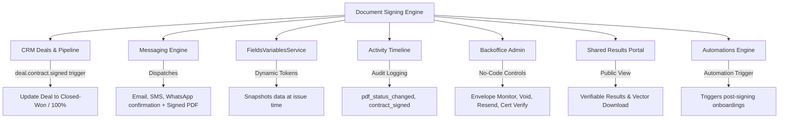

# Document Signing & Contract Platform — Master Implementation Plan (Phases 0–6)

> **For agentic workers:** REQUIRED SUB-SKILL: Use superpowers:subagent-driven-development (recommended) or superpowers:executing-plans to implement this plan task-by-task. Steps use checkbox (`- [ ]`) syntax for tracking.

**Goal:** Transform the institutional document signing feature into an enterprise-grade, legally compliant, multi-party e-signature and contract intelligence platform—preserving 100% of existing functionality while resolving architectural debt, security vulnerabilities, and mobile UX friction.

**Architecture:** Domain-Driven, Layered Architecture with strict separation between HTTP/Server Actions, Domain Services, and Data Adapters. Replaces client-side DOM rasterization (`html2canvas`) with an authoritative server-side vector PDF engine (`pdf-lib`), introduces tamper-evident cryptographic evidence chains (SHA-256 digests and Certificate of Completion), orchestrates multi-signer envelopes with sequential/parallel routing, and enforces strict type safety (zero `any`) across all boundaries.

**Tech Stack:** Next.js (App Router, Server Actions, Route Handlers), React 19, TypeScript (Strict Mode), Firebase Admin SDK (Firestore, Cloud Storage), Vitest, Zod, pdf-lib, pdfjs-dist, Framer Motion, Tailwind CSS v4.

---

## 1. Governance & Quality Standards

This plan strictly conforms to repository and engineering rules:
1. **`next-best-practices` & `vercel-react-best-practices`**:
   - Zero waterfalls: async work parallelized with `Promise.all()`, await deferred to branch execution.
   - Dynamic imports (`next/dynamic`) for heavy client components (`PdfFormRenderer`, `SignaturePadModal`).
   - Server Actions authenticated with `requireAuth()` and tenant-verified with `requireWorkspace()`.
   - Data passed from RSC to Client Components minimized and serialized cleanly.
2. **`emilkowal-animations`**:
   - Durations $\le 300\text{ms}$ for micro-interactions; 500ms max for drawers/sheets.
   - Default easing `cubic-bezier(0.16, 1, 0.3, 1)` (ease-out) for on-screen transitions.
   - Press feedback: `active:scale-[0.97]` on all buttons, badges, and selectable cards.
   - Touch interactions: pointer-capture for drawing; `touch-pan-y` to avoid scroll-drag conflicts.
   - Accessibility: full `prefers-reduced-motion` compliance using opacity fallbacks.
3. **`frontend-design` & Mobile-First UX**:
   - Touch target compliance: minimum `44x44px` (`min-h-[44px] min-w-[44px]`).
   - Sticky guided signing action dock at the viewport bottom ("Start Signing", "Next Field", "Finish").
   - Clear, concise, everyday English (minimal microcopy; zero legal clutter in interactive tags).
4. **`cc-skill-backend-patterns`**:
   - Layered architecture: Route Handler/Action $\rightarrow$ Domain Service $\rightarrow$ Adapter/Repository.
   - Idempotency keys (`idempotencyKey`) on all state-mutating actions (signing, finalization, dispatch).
   - Atomic Firestore batch/transaction commits with exponential backoff on contention.
5. **Strict Typing Standard (Rule 4)**:
   - **Zero tolerance for `any` or `any[]`** across application and domain code.
   - `unknown` strictly restricted to external boundaries (`req.json()`, searchParams, webhook payloads) and immediately narrowed via Zod schemas before entering domain logic.
6. **Maintainer Documentation Standard (Rule 10)**:
   - Mandatory architectural header comment on every file: Purpose, Why this design, Caution areas, and Testability pointers.

---

## 2. Failure Modes, Edge Cases & Defenses Matrix (What Could Go Wrong?)

| Failure Mode / Edge Case | Root Cause | Impact | Architectural Defense & Resolution |
| :--- | :--- | :--- | :--- |
| **Serverless Memory Spike (OOM)** | Large PDF (10–50MB) loaded into memory by `pdf-lib` during concurrent batch sends. | Function crash, failed signing emails. | Enforce 15MB template upload limit. Stream downloads, use buffer pooling, and throttle batch concurrency to max 3 concurrent renders via `p-limit`. |
| **Firestore Document Bloat** | High-res signatures stored as raw base64 data URLs in Firestore submission records. | Exceeds 1MB Firestore limit; high read latency. | Store signature PNGs directly in Firebase Storage (`signatures/{envelopeId}/{recipientId}.png`); store only signed storage path and SHA-256 hash in Firestore. Provide legacy base64 fallback reader for existing records. |
| **Sub-pixel Alignment Drift** | CSS percentage coordinates vs native PDF point coordinate conversion. | Field text renders shifted by 2–5 points in exported PDF. | Normalize coordinates to native PDF points (`page.getSize()`), locking aspect ratio in viewer canvas. Enforce golden-file visual regression tests. |
| **Duplicate Finalization Race** | Signer double-clicks "Finalize", or webhook retries concurrently. | Duplicate submission entries, double emails, corrupt contract status. | Enforce Firestore `runTransaction` with idempotency key `${envelopeId}_${recipientId}_finalize`. If status already `'signed'`, return existing submission ID. |
| **Breaking Existing Live Links** | Modifying URL structure from `/forms/[pdfId]?entityId=...` to tokenized `/sign/[token]`. | Hundreds of outstanding sent customer contracts fail with 404. | Bi-directional compatibility adapter: legacy `/forms/[pdfId]` endpoint dynamically wraps query params into an ephemeral session and routes to the modern engine without breaking. |
| **Cross-Tenant IDOR Tampering** | Malicious user alters `?entityId=school_123` to access another school's confidential document. | Critical data leak; illegal contract inspection. | Replace raw entity IDs with HMAC-SHA256 signed magic tokens. Reject mismatched or tampered signatures server-side. |
| **Client Download Degraded Quality** | Browser screenshotting via `html2canvas` produces blurry A4 raster JPEGs. | Unprofessional downloads, unselectable text, broken links, distorted non-A4 pages. | Phase out `html2canvas`. Direct all download clicks to serverless vector route `/api/pdfs/[pdfId]/generate/[submissionId]` returning crisp PDF/A vector files. |
| **Missing Character Glyphs in PDF** | Recipient enters accented name or emoji in text field; standard Helvetica crashes or renders `?`. | Corrupted PDF export or server error. | Embed unicode-compatible OpenType font subsets in `pdf-lib` alongside standard Helvetica. |

---

## 3. Systemic Blast Radius & Affected Subsystems

Modernizing document signing touches several core modules in the repository. This plan accounts for every dependency:



### Subsystem Impact Analysis & Mitigation:
1. **CRM Deals (`src/app/actions/deal-actions.ts`, `src/lib/deals/deal-event-bus.ts`)**:
   - *Impact*: Deals automatically advance to 100% Probability / `contractStatus: 'signed'` upon completion.
   - *Mitigation*: Contract finalization emits the canonical `deal.contract.signed` event via the shared event bus, ensuring synchronization without direct tight coupling.
2. **Messaging Engine (`src/lib/messaging-engine.ts`, `src/lib/contract-actions.ts`)**:
   - *Impact*: Contract wizard triggers dual Email and SMS dispatches with attachments.
   - *Mitigation*: Durable outbox pattern: message jobs are persisted before dispatch so third-party network timeouts (Twilio/Resend/WhatsApp) do not roll back signed database states.
3. **Fields & Variables SSOT (`src/lib/services/fields-variables-service-impl.ts`)**:
   - *Impact*: Resolves `{{school_name}}`, `{{contact_name}}`, etc.
   - *Mitigation*: Variable snapshotting: at the moment of envelope dispatch, resolved variable values are frozen into the envelope record so future CRM edits never alter previously executed legal agreements.
4. **Automation Engine (`src/lib/automations/payload-enricher.ts`)**:
   - *Impact*: Listens for `DEAL_CONTRACT_SIGNED` and `PDF_FORM_SUBMITTED`.
   - *Mitigation*: The new finalization command continues firing legacy webhook triggers in parallel with modern domain events.

---

## 4. Backoffice No-Code Management Capabilities

To allow operational staff, legal teams, and customer success managers to administer contracts without touching code:

1. **Envelope Operations Dock**:
   - Real-time status tracker: *Sent*, *Delivered*, *Opened*, *Partially Signed*, *Signed*, *Declined*, *Expired*.
   - One-click **Resend Link**: Dispatches updated SMS/Email with refreshed token.
   - One-click **Void / Cancel**: Voids an active envelope with a mandatory audit reason.
   - One-click **Extend Expiry**: Extends contract validity by 7, 14, or 30 days.
2. **Visual Template & Multi-Role Manager**:
   - Visual color-coded role assigner in PDF Studio (Signer 1, Signer 2, Countersigner).
   - Configurable automated reminder cadence (e.g. Day 3, Day 7, Day 13) managed via UI toggles.
3. **Public & Internal Verification Portal (`/verify`)**:
   - Instant document verification: staff or external parties can enter an Envelope ID or upload any signed PDF to verify its SHA-256 fingerprint, view signer IPs, and validate cryptographic integrity without accessing database tables.

---

## 5. Strict Type System & Zod Schema Contracts

All domain structures conform to Rule 4 (**Zero `any`**):

```typescript
// Location: src/lib/types/document-signing.ts

import { z } from 'zod';

export const RecipientRoleSchema = z.enum([
  'signer',
  'countersigner',
  'approver',
  'viewer'
]);
export type RecipientRole = z.infer<typeof RecipientRoleSchema>;

export const RecipientStatusSchema = z.enum([
  'pending',
  'sent',
  'delivered',
  'opened',
  'signed',
  'declined'
]);
export type RecipientStatus = z.infer<typeof RecipientStatusSchema>;

export const EnvelopeStatusSchema = z.enum([
  'draft',
  'sent',
  'partially_signed',
  'completed',
  'declined',
  'voided',
  'expired'
]);
export type EnvelopeStatus = z.infer<typeof EnvelopeStatusSchema>;

export const SigningRecipientSchema = z.object({
  id: z.string().min(1),
  role: RecipientRoleSchema,
  name: z.string().min(1),
  email: z.string().email(),
  phone: z.string().optional(),
  routingOrder: z.number().int().positive(),
  status: RecipientStatusSchema,
  tokenHash: z.string(),
  tokenExpiresAt: z.string(),
  openedAt: z.string().optional(),
  signedAt: z.string().optional(),
  signatureStoragePath: z.string().optional(),
  signatureHash: z.string().optional(),
  ipAddress: z.string().optional(),
  userAgent: z.string().optional(),
  declineReason: z.string().optional(),
});
export type SigningRecipient = z.infer<typeof SigningRecipientSchema>;

export const EvidenceAuditLogEntrySchema = z.object({
  id: z.string(),
  timestamp: z.string(),
  action: z.enum([
    'created',
    'sent',
    'delivered',
    'opened',
    'progress_saved',
    'signature_applied',
    'completed',
    'declined',
    'voided',
    'downloaded'
  ]),
  actorName: z.string(),
  actorEmail: z.string().optional(),
  actorRole: z.string().optional(),
  ipAddress: z.string().optional(),
  userAgent: z.string().optional(),
  details: z.string().optional(),
});
export type EvidenceAuditLogEntry = z.infer<typeof EvidenceAuditLogEntrySchema>;

export const SigningEnvelopeSchema = z.object({
  id: z.string().min(1),
  workspaceId: z.string().min(1),
  organizationId: z.string().min(1),
  templateId: z.string().min(1),
  title: z.string().min(1),
  status: EnvelopeStatusSchema,
  routingType: z.enum(['sequential', 'parallel']),
  originalDocumentStoragePath: z.string(),
  originalDocumentHash: z.string(), // SHA-256
  completedDocumentStoragePath: z.string().optional(),
  completedDocumentHash: z.string().optional(), // SHA-256
  certificateStoragePath: z.string().optional(),
  recipients: z.array(SigningRecipientSchema),
  currentRoutingOrder: z.number().int().positive(),
  fieldData: z.record(z.string(), z.union([z.string(), z.number(), z.boolean()])),
  variableSnapshot: z.record(z.string(), z.string()),
  auditTrail: z.array(EvidenceAuditLogEntrySchema),
  expiresAt: z.string(),
  createdAt: z.string(),
  updatedAt: z.string(),
  completedAt: z.string().optional(),
});
export type SigningEnvelope = z.infer<typeof SigningEnvelopeSchema>;
```

---

## 6. Phase-by-Phase Implementation Roadmap

```
Phase 0: Discovery & Baseline Hardening
Phase 1: Integrity, Unified Vector PDF & Idempotent Finalization
Phase 2: Multi-Signer Envelopes & Guided Signing Stepper
Phase 3: Backoffice Workspace & No-Code Operations Dock
Phase 4: CRM Pipeline Synchronization & Advanced Analytics
Phase 5: AI Field Auto-Detection & Clause Intelligence
Phase 6: Enterprise Readiness & Security Verification
```

---

### PHASE 0 — Discovery and Baseline Hardening (Immediate Focus)

**Goal:** Audit all code paths, lock in existing untested behaviors with automated baseline test suites, document data schemas, and establish rollback safety.

#### Task 0.1: Code-Path & Downstream Dependency Inventory (P0.1)
**Files:**
- Create: `docs/DocSigning/phase-0/code-path-inventory.md`

- [x] **Step 1: Document all active routes, server actions, client components, and downstream dependencies.**
  - Catalog template editor, wizard, public viewer, submission endpoints, and download handlers.
  - Map external integrations: `pdf-lib`, `pdfjs-dist`, `react-signature-canvas`, `react-easy-crop`, `messaging-engine`, and `activity-logger`.
- [x] **Step 2: Commit inventory document.**
  - Command: `git add docs/DocSigning/phase-0/code-path-inventory.md && git commit -m "docs(docsigning): document P0.1 code-path inventory and call graph"`

#### Task 0.2: Data Schemas, Storage & Security Matrix (P0.2)
**Files:**
- Create: `docs/DocSigning/phase-0/data-and-security-inventory.md`

- [x] **Step 1: Document Firestore collection schemas, storage paths, tenant isolation rules, and threat model.**
  - Document `pdfs`, `contracts`, `submissions`, `pdf_sessions`, `activity`.
  - Detail Authorization Matrix (Anonymous, Workspace Member, Admin).
  - Catalog Threat Register (R-01 through R-12).
- [x] **Step 2: Commit data and security inventory document.**
  - Command: `git add docs/DocSigning/phase-0/data-and-security-inventory.md && git commit -m "docs(docsigning): document P0.2 data and security inventory"`

#### Task 0.3: Signature Processing Engine Baseline Tests (P0.3)
**Files:**
- Create: `src/lib/__tests__/signature-processing.baseline.test.ts`

- [x] **Step 1: Write baseline tests for `signature-processing.ts`.**
  - Verify thresholding, luminance calculation, transparent background removal, crop boundaries, and auto-tighten normalization.
- [x] **Step 2: Run test suite to verify baseline passes.**
  - Command: `pnpm test:run src/lib/__tests__/signature-processing.baseline.test.ts`
- [x] **Step 3: Commit signature processing tests.**
  - Command: `git add src/lib/__tests__/signature-processing.baseline.test.ts && git commit -m "test(docsigning): add P0.3 signature processing baseline tests"`

#### Task 0.4: Dynamic Variable Resolution Baseline Tests (P0.3)
**Files:**
- Create: `src/lib/__tests__/pdf-variable-resolution.baseline.test.ts`

- [x] **Step 1: Write baseline tests for template variable substitution in `pdf-actions.ts`.**
  - Verify `{{entity_name}}`, `{{entity_location}}`, and FER-01 contact dynamic variables.
  - Verify unknown tokens remain untouched without throwing exceptions.
- [x] **Step 2: Run test suite to verify pass.**
  - Command: `pnpm test:run src/lib/__tests__/pdf-variable-resolution.baseline.test.ts`
- [x] **Step 3: Commit variable resolution tests.**
  - Command: `git add src/lib/__tests__/pdf-variable-resolution.baseline.test.ts && git commit -m "test(docsigning): add P0.3 variable resolution baseline tests"`

#### Task 0.5: Contract Actions & Dispatch Baseline Tests (P0.3)
**Files:**
- Create: `src/lib/__tests__/contract-actions.baseline.test.ts`

- [x] **Step 1: Write baseline tests for contract lifecycle actions.**
  - Verify `upsertContractAction`: RBAC checks, draft upsert logic.
  - Verify `sendContractAction`: dual Email/SMS dispatch, variable interpolation, status update to `'sent'`.
  - Verify `deleteContractAction`: atomic deletion of contract and linked submission record.
- [x] **Step 2: Run contract actions test suite.**
  - Command: `pnpm test:run src/lib/__tests__/contract-actions.baseline.test.ts`
- [x] **Step 3: Commit contract actions tests.**
  - Command: `git add src/lib/__tests__/contract-actions.baseline.test.ts && git commit -m "test(docsigning): add P0.3 contract actions baseline tests"`

#### Task 0.6: PDF Actions & Finalization Lifecycle Baseline Tests (P0.3)
**Files:**
- Create: `src/lib/__tests__/pdf-actions.baseline.test.ts`

- [x] **Step 1: Write baseline tests for PDF signing actions.**
  - Verify `saveAgreementProgressAction`: partial submission write, contract status update to `'partially_signed'`.
  - Verify `finalizeAgreementAction`: final submission write, contract status update to `'signed'`, confirmation dispatch, team alert.
- [x] **Step 2: Run PDF actions test suite.**
  - Command: `pnpm test:run src/lib/__tests__/pdf-actions.baseline.test.ts`
- [x] **Step 3: Commit PDF actions tests.**
  - Command: `git add src/lib/__tests__/pdf-actions.baseline.test.ts && git commit -m "test(docsigning): add P0.3 PDF actions baseline tests"`

#### Task 0.7: Operational Baseline & Known-Gap Register (P0.4)
**Files:**
- Create: `docs/DocSigning/phase-0/operational-baseline-and-rehearsal.md`

- [x] **Step 1: Document Known-Gap Register, Backup Procedures, and Phase 0 Gate Checklist.**
  - Document Gaps: `html2canvas` raster download, missing SHA-256 hashes, missing Certificate of Completion, base64 signature storage, single-signer limitation.
  - Document Firestore backup commands and Phase 1 rollback steps.
- [x] **Step 2: Commit operational baseline document.**
  - Command: `git add docs/DocSigning/phase-0/operational-baseline-and-rehearsal.md && git commit -m "docs(docsigning): document P0.4 operational baseline and known-gap register"`

---

### PHASE 1 — Integrity, Unified Vector PDF & Idempotent Finalization

**Goal:** Eliminate `html2canvas` client screenshotting, build authoritative server-side vector PDF generation with SHA-256 digests, implement transactional idempotent finalization, and issue verifiable Certificates of Completion.

#### Task 1.1: Unified Vector PDF Engine (P1.1)
- Refactor `generatePdfBuffer` in `src/lib/pdf-actions.ts`:
  - Preserve exact page dimensions for A4, Letter, Legal, and landscape pages.
  - Embed true OpenType font subsets to support unicode names and cursive scripts.
  - Replace `html2canvas` downloads in `SharedSubmissionView.tsx` and `SubmissionsPage.tsx` with direct streaming from `/api/pdfs/[pdfId]/generate/[submissionId]`.
  - Delete `html2canvas` dependency to reduce client bundle size by ~180KB.

#### Task 1.2: Idempotent Finalization Command & Transaction Lock (P1.2)
- Refactor `finalizeAgreementAction` and `POST /api/pdfs/submit`:
  - Add client-generated `idempotencyKey: string`.
  - Wrap database execution in a Firestore transaction: check if contract is already signed.
  - Offload base64 signature images to Firebase Storage (`signatures/{contractId}/{signerId}.png`) and store clean storage references.

#### Task 1.3: Cryptographic Integrity & Evidence Record (P1.3)
- Create `src/lib/documents/evidence-service.ts`:
  - Calculate `crypto.createHash('sha256')` on template bytes and final signed PDF bytes.
  - Record client IP address (from headers `x-forwarded-for`) and User-Agent.
  - Create append-only evidence events in `signing_evidence` collection.

#### Task 1.4: Certificate of Completion Generator (P1.4)
- Create `src/lib/documents/audit-certificate-service.ts`:
  - Generates an official Certificate of Completion page using `pdf-lib`.
  - Features Envelope ID, SHA-256 fingerprints, signer timeline table, and a secure verification QR code.
  - Appends the certificate as the final page of every completed legal document.

---

### PHASE 2 — Multi-Signer Envelopes & Guided Signing Stepper

**Goal:** Support multi-party agreements (sequential and parallel signing), role-based field assignment, and deliver a frictionless mobile-first guided signing stepper.

#### Task 2.1: Multi-Signer Domain Model & Compatibility Adapter (P2.1, P2.2)
- Implement `SigningEnvelope`, `SigningRecipient`, and `EvidenceEvent` in `src/lib/types/document-signing.ts`.
- Build bidirectional adapter in `src/lib/documents/document-signing-adapter.ts` ensuring all legacy `PDFForm`, `Contract`, and `Submission` reads/writes map seamlessly to the new envelope model.

#### Task 2.2: PDF Studio Signer Role Assignment (P2.3)
- Update [Inspector.tsx](file:///Users/josephaidoo/Desktop/Codes/vibe%20Coding/Onboarding-Dashbaord-main/src/app/admin/pdfs/[id]/edit/components/Editor/Sidebar/Inspector.tsx):
  - Add `assignedRole` dropdown to field properties (e.g. Signer 1, Signer 2, Countersigner).
  - Color-code field bounding boxes on canvas by role (Amber for Signer 1, Blue for Signer 2, Indigo for Countersigner).

#### Task 2.3: Guided Signing Action Dock (P2.5)
- Create `src/app/forms/[pdfId]/components/SigningActionDock.tsx`:
  - Sticky bottom action dock conforming to `emilkowal-animations` (`timing-300ms-max`, `transform-scale-097`).
  - Displays remaining required fields counter ("2 of 5 completed").
  - "Start Signing" $\rightarrow$ scrolls smoothly to the first required field and zooms in.
  - "Next Field" $\rightarrow$ auto-focuses the next field.
  - "Finish Agreement" $\rightarrow$ activates when all required fields are complete.
  - Fully mobile-optimized with `min-h-[44px]` touch targets and gesture safety.

#### Task 2.4: Natural Ink Drawing Physics
- Upgrade [SignaturePadModal.tsx](file:///Users/josephaidoo/Desktop/Codes/vibe%20Coding/Onboarding-Dashbaord-main/src/components/SignaturePadModal.tsx):
  - Implement velocity-sensitive Bezier curve interpolation in the freehand drawing tab, simulating natural fountain pen ink.
  - Preserve camera "Scan" mode with its computer-vision ink isolation and transparent alpha extraction.

---

### PHASE 3 — Backoffice Workspace & No-Code Operations Dock

**Goal:** Provide administrative staff with full operational visibility, voiding controls, manual resend tools, and a standalone verification portal.

#### Task 3.1: Backoffice Envelope Operations Dock (P3.1)
- Enhance [ContractsClient.tsx](file:///Users/josephaidoo/Desktop/Codes/vibe%20Coding/Onboarding-Dashbaord-main/src/app/admin/finance/contracts/ContractsClient.tsx):
  - Live recipient progress pills showing who has opened and signed.
  - Action buttons: "Resend Link", "Void Agreement", "Extend Expiry".
  - Filter by envelope status (`draft`, `sent`, `completed`, `declined`, `expired`).

#### Task 3.2: Standalone Public & Internal Verification Portal (P3.3)
- Create `/verify` page (`src/app/verify/page.tsx`):
  - Allows staff, clients, or auditors to upload any completed PDF or enter an Envelope ID.
  - Verifies SHA-256 hash match against Firestore evidence records.
  - Displays tamper status, signer identities, and timestamps without leaking confidential field data.

---

### PHASE 4 — CRM Pipeline Synchronization & Advanced Analytics

**Goal:** Deeply integrate contract state changes into CRM deals, automated onboarding sequences, and commercial dashboards.

#### Task 4.1: Canonical CRM Domain Event Bus Integration (P4.1, P4.2)
- Connect envelope completion to `src/lib/deals/deal-event-bus.ts`:
  - When all signatories complete signing, emit `deal.contract.signed`.
  - Automatically update the parent Deal stage to Closed-Won / 100% Probability, recording `contractSignedAt` and `contractTermMonths`.
  - Trigger linked post-signing onboarding workflows in `src/lib/automations/payload-enricher.ts`.

#### Task 4.2: Commercial Signing Analytics & Attribution (P4.4)
- Upgrade `SubmissionsPage.tsx`:
  - Add completion velocity metrics (mean time from dispatch to signature).
  - Add signer device analytics (Mobile vs Desktop completion rate).
  - Track drop-off rate by field and by page.

---

### PHASE 5 — AI Field Auto-Detection & Clause Intelligence

**Goal:** Accelerate contract preparation by using Gemini AI vision/OCR to automatically detect blank lines and place signature/date tags.

#### Task 5.1: AI Form Field Auto-Detection (P5.1)
- Create `src/lib/documents/ai-field-detector.ts`:
  - When an admin uploads a blank contract to PDF Studio, run Gemini 2.0 Flash text/vision analysis.
  - Detect `Signature: ________`, `Date: ________`, and `Name: ________` bounding boxes.
  - Offer a one-click banner in the studio: *"Detected 3 signature fields and 2 date fields. Auto-place tags?"*

---

### PHASE 6 — Enterprise Readiness & Security Verification

**Goal:** Formalize security assurance profiles, audit rules, rate limiting, and conduct automated penetration testing.

#### Task 6.1: Security Hardening & Rate Limiting (P6.1, P6.2)
- Enforce HMAC-SHA256 signature verification on all public signing routes (`/sign/[token]`).
- Add IP-based rate limiting on public finalization endpoints to prevent brute-force or resource exhaustion.
- Run `firebase-security-rules-auditor` on Firestore security rules for `pdfs`, `contracts`, `signing_envelopes`, and `signing_evidence`.

---

## 7. Verification & Acceptance Checklist

Before declaring any phase complete:
1. [ ] **Typecheck**: Run `pnpm typecheck` with zero errors and zero `any` usage.
2. [ ] **Lint**: Run `pnpm lint` with zero errors.
3. [ ] **Test Suite**: Run `pnpm test:run` ensuring 100% of baseline and new tests pass.
4. [ ] **Mobile Touch Test**: Verify all interactive elements meet `min-h-[44px]` touch targets on 375px viewport.
5. [ ] **Git Protocol**: Stage and commit changes cleanly. **Do not push to origin** until explicitly instructed.
