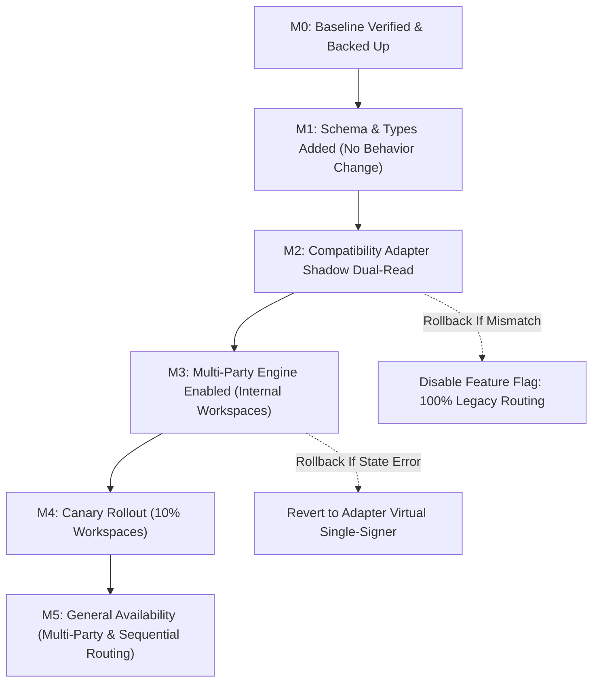

# Document Signing Phase 2: Domain Model, Envelopes & Multi-Party Sequential/Parallel Routing Master Implementation Plan

> **For agentic workers:** REQUIRED SUB-SKILL: Use superpowers:subagent-driven-development (recommended) or superpowers:executing-plans to implement this plan task-by-task. Steps use checkbox (`- [ ]`) syntax for tracking.

**Goal:** Decouple monolithic PDF forms and single-signer contracts into an authoritative, enterprise-grade Document & Signing Domain Model. Introduce immutable template versioning (`TemplateVersion`), multi-party signing envelopes (`SigningEnvelope`), sequential and parallel routing rules (`routingOrder`), recipient role state machines (`signer`, `approver`, `countersigner`, `viewer`), capability tokens with SHA-256 hashing, role-aware PDF field assignment, and a bi-directional compatibility adapter (`DocumentAdapter`) ensuring 100% zero-regression preservation of existing single-signer contracts, public signing links, and downstream CRM automations.

---

## 1. Executive Architecture & Strategic Foresight

```
┌──────────────────────────────────────────────────────────────────────────────────────────────────┐
│                                 PHASE 2 TARGET DOMAIN TOPOLOGY                                    │
│                                                                                                  │
│   DocumentTemplate ──► TemplateVersion (Immutable Snapshot: storagePath + SHA-256)               │
│          │                                                                                       │
│          ▼                                                                                       │
│   SigningEnvelope  ──► DocumentInstance (Issued content with frozen resolvedVariablesSnapshot)   │
│          │                                                                                       │
│          ├──► EnvelopeRecipient[] (Sequential & Parallel Routing Engine)                         │
│          │      ├── Recipient 1: Signer (routingOrder: 1, status: 'signed')                      │
│          │      ├── Recipient 2: Co-Signer (routingOrder: 1, status: 'signed') [Parallel]       │
│          │      ├── Recipient 3: Approver (routingOrder: 2, status: 'approved') [Sequential]    │
│          │      └── Recipient 4: Countersigner (routingOrder: 3, status: 'pending')              │
│          │                                                                                       │
│          ├──► DocumentArtifact[] (Source PDF, Sealed Vector PDF, Vector Certificate)             │
│          └──► DocumentEvent[] / EvidenceRecord[] (Append-only SHA-256 audit ledger)              │
│                                                                                                  │
│   Compatibility Layer:                                                                           │
│   DocumentAdapter ◄──► Bi-directional bridge to legacy `PDFForm`, `Contract`, `Submission`      │
└──────────────────────────────────────────────────────────────────────────────────────────────────┘
```

### 1.1 How Phase 2 Integrates with Past & Future Phases:
- **Phase 0 & 1 Continuity**:
  - Reuses Phase 1's authoritative `generatePdfBuffer` vector engine for final sealing.
  - Reuses Phase 1's Cloud Storage signature offloading (`uploadSignatureImage`) to prevent 1MB Firestore document limits when handling envelopes with 3–5 recipients.
  - Extends the append-only `signing_evidence` ledger to record per-recipient intermediate actions (`opened`, `signed`, `approved`, `declined`).
- **Phase 3 Foresight (Contract Lifecycle, Template Studio & Obligations)**:
  - Establishes `TemplateVersion` immutability (`contentSnapshot.sha256`), guaranteeing that future template studio revisions never alter an issued, in-flight envelope.
  - Encapsulates structured form data so Phase 3's obligation tracker can extract deliverables (e.g. payment dates, renewal terms) without OCR parsing.
- **Phase 4 Foresight (CRM Analytics & Funnel Automation)**:
  - Recipient timestamps (`invitedAt`, `openedAt`, `signedAt`) feed signing turnaround metrics and trigger automated reminder workflows on stalled signers.
- **Phase 5 Foresight (AI Multimodal Intelligence)**:
  - Structured `formData` maps paired with clean vector text glyphs allow Gemini 2.0 to extract obligations and analyze risk without raster noise.
- **Phase 6 Foresight (Enterprise eIDAS Assurance & Audit)**:
  - Multi-party Certificates of Completion with per-signer SHA-256 fingerprints provide legal enforceability and independent proof.

---

## 2. Failure Modes & Edge Cases Register ("What Could Go Wrong & Resolutions")

| Risk ID | Potential Failure Mode | Root Cause | Impact | Engineering Mitigation in Phase 2 |
| :--- | :--- | :--- | :--- | :--- |
| **FM-P2-01** | **Out-of-Order Multi-Party Signing Race** | Recipient 2 guesses or receives public link and signs before Recipient 1 completes. | Legal execution order invalidated; Recipient 2 signs an un-executed draft; audit trail corrupted. | **Resolution:** `EnvelopeRoutingService` enforces sequential locking. Signer session token validation verifies: `min(routingOrder of all pending recipients) === currentRecipient.routingOrder`. Unauthorized attempts receive an informative "Waiting for Previous Signatory" screen. |
| **FM-P2-02** | **Simultaneous Parallel Signer Finalization Overwrite** | Two recipients in a parallel routing cohort ($routingOrder = 1$) sign at the exact same second. | Race condition overwrites intermediate field values or produces diverged vector PDFs. | **Resolution:** Firestore transaction with field-level merging in `signing_envelopes/{envelopeId}/recipients/{recipientId}`. Intermediate signatures offloaded to Cloud Storage immediately; master vector PDF generated only upon transition to terminal `completed` state. |
| **FM-P2-03** | **Legacy Contract & Submission Disruption** | New envelope schema causes existing single-recipient contracts or `/forms/[pdfId]` links to break. | Customer onboarding stops; existing active links return 404 or schema parsing errors. | **Resolution:** `DocumentAdapter` transparently bridges legacy records. If `envelopeId` is not found, adapter queries `contracts/{id}` and synthesizes a virtual single-signer envelope in-memory. Legacy routes remain 100% functional. |
| **FM-P2-04** | **Recipient Decline Deadlock** | Recipient 2 in a 3-party chain clicks "Decline to Sign", but envelope status remains pending. | Other signers left in limbo; CRM deal never updates; sender not notified. | **Resolution:** Atomic `declineEnvelopeAction` transitions envelope to `declined`, cancels pending recipient tokens, writes audit event with mandatory decline reason, dispatches internal alerts, and emits `deal.contract.declined` on the CRM event bus. |
| **FM-P2-05** | **Signing Token Leakage via URL Sharing** | Forwarded email or browser history leaks raw signing token to unauthorized third party. | Impersonation; unauthorized execution of binding legal contract. | **Resolution:** Raw tokens never stored in Firestore (only SHA-256 hashes). Optional SMS OTP or Email Verification challenge before signing access. Capability token bound to recipient IP/fingerprint after first view. |
| **FM-P2-06** | **Template Mutation After Dispatch** | Admin edits PDF template fields or text after envelope is dispatched to signers. | Signers sign modified document terms; legal enforceability compromised. | **Resolution:** Immutability rule: Envelopes bind strictly to a published `TemplateVersion` snapshot (`contentSnapshot.storagePath` and `sha256`). Edits to templates create a new `draft` version; issued envelopes never re-read draft templates. |
| **FM-P2-07** | **Variable Desynchronization at Execution Time** | CRM contact details (e.g. signer name, address) update during a 14-day multi-party signing window. | Document variables mutate between Recipient 1 and Recipient 2 signing, corrupting executed text. | **Resolution:** `DocumentInstance` captures a frozen `resolvedVariablesSnapshot` at issue time via `FieldsVariablesService`. All subsequent vector renderings reference the frozen snapshot. |
| **FM-P2-08** | **Mobile Touch Target Fatigue on Multi-Signer Documents** | Recipient cannot easily locate the 4 fields assigned to them amongst 20 fields assigned to others. | High drop-off rate, user frustration on mobile devices. | **Resolution:** Role-based field filtering. Mobile signing viewport dynamically highlights only fields assigned to `currentRecipient.role` / `currentRecipient.id`, rendering other fields in read-only dimmed state, with a floating "Next Required Field" FAB. |
| **FM-P2-09** | **Certificate Canvas Vertical Overflow with 3+ Signers** | Certificate of Completion hardcoded to 1 page overflows when 4 signers and 10 audit logs are appended. | Text clips below bottom margin; verification QR code displaced or unreadable. | **Resolution:** Implement dynamic vertical height budgeting in `audit-certificate-service.ts`. If signers $> 2$ or audit entries $> 5$, dynamically paginate across multiple vector certificate pages. |
| **FM-P2-10** | **Batch Processing Resource Exhaustion during Bulk Dispatch** | User bulk-dispatches envelopes to 50 entities simultaneously, exhausting server memory or hitting Firestore batch write limits (500 ops). | Timeouts, partial failure states, and un-notified signatories. | **Resolution:** Implement chunked batch dispatching ($10$ entities per batch) with concurrency throttling, individual error recovery, and transactional outbox recording. |

---

## 3. Subsystem Impacts & No-Code Backoffice Enhancements

### 3.1 Subsystem Impact Matrix
- **CRM Deals (`src/lib/deals/deal-event-bus.ts`, `src/app/actions/deal-actions.ts`)**:
  - Emits `deal.contract.in_progress` when Recipient 1 signs in a multi-party chain.
  - Advances to `deal.contract.signed` (100% win probability) only when final recipient signs and envelope transitions to `completed`.
  - Emits `deal.contract.declined` or `deal.contract.voided` upon rejection.
- **Messaging Engine (`src/lib/messaging-actions.ts`, `messaging-engine.ts`)**:
  - Automated notification router: When Recipient $N$ completes, automatically triggers email/SMS invitation to Recipient $N+1$ with freshly minted signing capability token.
- **Link Shortener (`src/app/go/[linkId]/route.ts`)**:
  - Upgraded to support dynamic envelope recipient links: `/go/[linkId]` $\to$ `/sign/[envelopeId]?token=...`.
- **FieldsVariablesService (`src/lib/services/fields-variables-service.ts`)**:
  - Freezes resolved variable tokens at envelope generation time into `issuedContentSnapshot`.
- **Public Verification Console (`src/app/verify/[envelopeId]/page.tsx`)**:
  - Displays multi-party timeline with all signers, roles, IP addresses, signing timestamps, and individual signature SHA-256 digests.

### 3.2 Backoffice Operations Capabilities (No Code Required)
Compliance, operations, and sales managers can manage contracts directly from the UI without code:
1. **Multi-Party Envelope Status Board**: Real-time status tags per recipient (*Invited*, *Delivered*, *Opened*, *Signed*, *Declined*).
2. **One-Click Reassign Recipient**: Replace an unavailable signer/counsel with a new name and email without voiding the entire agreement. Reissues a fresh capability token.
3. **One-Click Skip Optional Approver**: Authorized managers can approve on behalf of an internal reviewer.
4. **One-Click Resend Recipient Reminder**: Send targeted reminder to the specific stalled recipient currently holding up the routing order.
5. **Envelope Void & Audit Ledger**: Void envelope with mandatory reason, auto-notifying all parties and rendering void watermarks across all draft artifacts.
6. **One-Click Expiry Extension**: Extend envelope validity by 7, 14, or 30 days via a simple dropdown.

---

## 4. Comprehensive UI/UX Architect Specifications

Conforming to `frontend-design`, `ui-ux-pro-max`, `emilkowal-animations`, and `vercel-react-best-practices`:

```
┌──────────────────────────────────────────────────────────────────────────────────────┐
│                            UI/UX INTERFACE TOUCHPOINTS                               │
│                                                                                      │
│  1. SENDER EXPERIENCE          2. TEMPLATE STUDIO        3. SIGNING PORTAL           │
│     [ContractWizard.tsx]          [Inspector.tsx]           [/sign/[envelopeId]]     │
│     • Recipient Matrix            • Field Role Assignment   • Turn-Aware Stepper     │
│     • Drag & Drop Stepper         • Color-Coded Outlines    • Sequential Lockout     │
│     • High-Contrast Badges        • Signer 1 / Signer 2     • Role-Filtered Inputs   │
│     • Channel (Email/SMS)         • Countersign Tags        • Mobile FAB Navigator   │
│                                                                                      │
│                                4. OPERATIONS DOCK                                    │
│                                   [ContractsClient.tsx]                              │
│                                   • Multi-Party Status Rails                         │
│                                   • One-Click Reassignment                           │
│                                   • Void / Cancel Modal                              │
└──────────────────────────────────────────────────────────────────────────────────────┘
```

### 4.1 Sender UI: Recipient Routing Editor (`ContractWizard.tsx`)
- **Stepper Navigation**: Upgrades from 3 to 4 steps: `1. Template` $\to$ `2. Recipients & Routing` $\to$ `3. Simulation` $\to$ `4. Dispatch`.
- **Routing Mode Toggle**:
  - **Sequential (Linear Chain)**: Signers complete in numbered order ($1 \to 2 \to 3$).
  - **Parallel (Simultaneous Cohort)**: All signers receive invitations simultaneously and can sign concurrently.
  - **Mixed Routing**: Parallel cohort followed by sequential approval or countersigning.
- **Recipient Card Components (`@dnd-kit/sortable`)**:
  - Reorderable list with drag handles and stepper arrows (`min-h-[44px]` touch targets).
  - Role pill selector with high-contrast color coding:
    - **Signer**: Indigo (`bg-indigo-500/10 text-indigo-700 dark:text-indigo-400 border-indigo-500/20`)
    - **Approver**: Amber (`bg-amber-500/10 text-amber-700 dark:text-amber-400 border-amber-500/20`)
    - **Countersigner**: Emerald (`bg-emerald-500/10 text-emerald-700 dark:text-emerald-400 border-emerald-500/20`)
    - **Viewer/CC**: Slate (`bg-slate-500/10 text-slate-700 dark:text-slate-400 border-slate-500/20`)
  - Auto-complete entity contacts: Quick dropdown linking directly to workspace entity contacts with designated `isSignatory` flags.
  - Delivery channel toggles: Email, SMS, or Both with phone/email validation.

### 4.2 Template Studio: Field Role Assignment (`src/app/admin/pdfs/[id]/edit`)
- **Inspector Role Assignment**: In `Editor/Sidebar/Inspector.tsx`, adding an "Assigned Recipient" dropdown:
  - `Signer 1 (Primary Client)`
  - `Signer 2 (Secondary / Witness)`
  - `Countersigner (Internal Management)`
  - `Sender (Pre-filled Variable)`
- **Color-Coded Canvas Bounding Boxes**:
  - Signer 1: Indigo outline (`border-indigo-500 bg-indigo-500/10`)
  - Signer 2: Amber outline (`border-amber-500 bg-amber-500/10`)
  - Countersigner: Emerald outline (`border-emerald-500 bg-emerald-500/10`)
  - Sender/Pre-filled: Slate outline (`border-slate-500 bg-slate-500/10`)

### 4.3 Multi-Party Public Signing Viewport (`/sign/[envelopeId]` & `PdfFormRenderer.tsx`)
- **Turn-Aware Progress Header**:
  - Breadcrumb: `Step 1 of 2: Signatory (You) ➔ Step 2: Countersign (Management)`.
  - Floating badge displaying current signer role.
- **Sequential Lockout View (`WaitingForTurnView.tsx`)**:
  - If a recipient accesses the link before prior signers complete:
  - Clean zero-state card: "Waiting for [Previous Signer Name] to complete their review. You will be notified automatically via email and SMS when it is your turn."
  - Re-check button with Emil Kowalski spring micro-interaction (`active:scale-[0.97]`).
- **Role-Filtered Field Navigation**:
  - Fields assigned to current recipient: Full interactive input, highlighted with pulsating focus ring.
  - Fields completed by previous signers: Rendered in read-only mode with subtle signature verification badge.
  - Fields assigned to subsequent signers: Rendered as dimmed placeholder boxes: `[Will be signed by Management Countersigner]`.
- **Mobile Floating Action Button (FAB)**:
  - Fixed at bottom-right of viewport: "Next Field ($N$ remaining)".
  - Smooth-scrolls to the next unfilled assigned field without triggering virtual keyboard layout shifts.
  - Form input typography strictly enforces `text-base` ($16\text{px}$ minimum) to prevent iOS Safari auto-zoom.
- **Decline to Sign Experience**:
  - Accessible modal prompting for a mandatory reason.
  - Confirms action: "Declining will terminate the agreement for all parties and notify the sender."

### 4.4 Backoffice Operations Dock: Live Tracker & Reassignment (`ContractsClient.tsx`)
- **Multi-Party Live Status Drawer (`EnvelopeDetailModal.tsx`)**:
  - Recipient rail showing live progress pills: *Invited*, *Delivered*, *Opened*, *Signed*, *Declined*.
  - Activity timestamps, IP addresses, and user-agent details.
- **One-Click Signer Reassignment (`ReassignRecipientModal.tsx`)**:
  - Form allowing operations managers to replace an unavailable signer with a new name and email.
  - Revokes old token, records audit event, and dispatches fresh invite to new recipient.
- **One-Click Reminder Dispatch**:
  - Sends a targeted reminder specifically to the current bottleneck recipient.

---

## 5. Strict Type Contracts & Zod Schemas (Rule 4: Zero `any`)

All domain models must strictly live in `src/lib/types/document-signing.ts`:

```typescript
// Location: src/lib/types/document-signing.ts

import { z } from 'zod';

export const RecipientRoleSchema = z.enum([
  'signer',
  'approver',
  'countersigner',
  'viewer'
]);
export type RecipientRole = z.infer<typeof RecipientRoleSchema>;

export const RecipientStatusSchema = z.enum([
  'pending',
  'invited',
  'delivered',
  'opened',
  'signed',
  'declined',
  'revoked',
  'reassigned'
]);
export type RecipientStatus = z.infer<typeof RecipientStatusSchema>;

export const EnvelopeRoutingModeSchema = z.enum([
  'sequential',
  'parallel',
  'mixed'
]);
export type EnvelopeRoutingMode = z.infer<typeof EnvelopeRoutingModeSchema>;

export const EnvelopeStatusSchema = z.enum([
  'draft',
  'pending_approval',
  'sent',
  'in_progress',
  'completed',
  'declined',
  'voided',
  'expired'
]);
export type EnvelopeStatus = z.infer<typeof EnvelopeStatusSchema>;

export const DocumentFieldDefinitionSchema = z.object({
  id: z.string().min(1),
  key: z.string().min(1),
  label: z.string().optional(),
  type: z.enum([
    'text',
    'multiline',
    'number',
    'date',
    'checkbox',
    'dropdown',
    'email',
    'phone',
    'signature',
    'initials',
    'static_text',
    'variable'
  ]),
  page: z.number().int().min(1),
  x: z.number().min(0).max(100),
  y: z.number().min(0).max(100),
  width: z.number().min(0).max(100),
  height: z.number().min(0).max(100),
  required: z.boolean().default(false),
  assignedRole: RecipientRoleSchema.default('signer'),
  assignedRecipientId: z.string().optional(),
  variableKey: z.string().optional(),
  validation: z.record(z.unknown()).optional(),
  style: z.record(z.unknown()).optional(),
});
export type DocumentFieldDefinition = z.infer<typeof DocumentFieldDefinitionSchema>;

export const EnvelopeRecipientSchema = z.object({
  id: z.string().min(1),
  workspaceId: z.string().min(1),
  envelopeId: z.string().min(1),
  crmContactId: z.string().optional(),
  entityId: z.string().optional(),
  role: RecipientRoleSchema,
  name: z.string().min(1),
  email: z.string().email(),
  phone: z.string().optional(),
  routingOrder: z.number().int().min(1),
  status: RecipientStatusSchema,
  tokenHash: z.string(),
  tokenExpiresAt: z.string(),
  invitedAt: z.string().optional(),
  openedAt: z.string().optional(),
  signedAt: z.string().optional(),
  declinedAt: z.string().optional(),
  declineReason: z.string().optional(),
  reassignedToId: z.string().optional(),
  signatureStoragePath: z.string().optional(),
  signatureHash: z.string().optional(),
  ipAddress: z.string().optional(),
  userAgent: z.string().optional(),
  formData: z.record(z.unknown()).optional(),
});
export type EnvelopeRecipient = z.infer<typeof EnvelopeRecipientSchema>;

export const SigningEnvelopeSchema = z.object({
  id: z.string().min(1),
  workspaceId: z.string().min(1),
  title: z.string().min(1),
  status: EnvelopeStatusSchema,
  templateId: z.string().optional(),
  templateVersionId: z.string().optional(),
  contractId: z.string().optional(),
  dealId: z.string().optional(),
  entityId: z.string().optional(),
  routingMode: EnvelopeRoutingModeSchema,
  currentRoutingOrder: z.number().int().min(1),
  recipients: z.array(EnvelopeRecipientSchema),
  documentStoragePath: z.string(),
  preExecutionSha256: z.string(),
  completedDocumentStoragePath: z.string().optional(),
  completedSha256: z.string().optional(),
  resolvedVariablesSnapshot: z.record(z.unknown()).optional(),
  expiresAt: z.string(),
  completedAt: z.string().optional(),
  voidedAt: z.string().optional(),
  voidReason: z.string().optional(),
  createdBy: z.string().min(1),
  createdAt: z.string(),
  updatedAt: z.string(),
  isLegacyMigrated: z.boolean().optional(),
});
export type SigningEnvelope = z.infer<typeof SigningEnvelopeSchema>;
```

---

## 6. Phase 2 Trackable Task Breakdown (TDD)

### Task 1: Domain Models, Strict Types & Zod Schemas (P2.1)
**Files:**
- Modify: `src/lib/types/document-signing.ts`
- Create: `src/lib/documents/__tests__/domain-schemas.test.ts`

- [ ] **Step 1: Write schema validation test in `domain-schemas.test.ts`**
  - Verify valid and invalid envelope payloads, recipient role parsing, sequential routing modes, and status transitions.
- [ ] **Step 2: Run test to verify failure**
  - Command: `pnpm test:run src/lib/documents/__tests__/domain-schemas.test.ts`
- [ ] **Step 3: Update `src/lib/types/document-signing.ts`**
  - Implement `EnvelopeRecipientSchema`, `SigningEnvelopeSchema`, `EnvelopeRoutingModeSchema`, `DocumentFieldDefinitionSchema`.
  - Ensure zero `any` or `any[]` (Rule 4).
- [ ] **Step 4: Run test to verify pass**
  - Command: `pnpm test:run src/lib/documents/__tests__/domain-schemas.test.ts`
- [ ] **Step 5: Commit changes**
  - Command: `git add src/lib/types/document-signing.ts src/lib/documents/__tests__/domain-schemas.test.ts && git commit -m "feat(docsigning): implement strict domain schemas for multi-party envelopes"`

---

### Task 2: Multi-Party State Machine & Sequential Routing Engine (P2.4)
**Files:**
- Create: `src/lib/documents/envelope-routing-service.ts`
- Create: `src/lib/documents/__tests__/envelope-routing-service.test.ts`

- [ ] **Step 1: Write routing unit tests in `envelope-routing-service.test.ts`**
  - Test sequential routing: Recipient 2 cannot sign when Recipient 1 is pending.
  - Test parallel routing: Both Recipient 1 and Recipient 2 can sign concurrently at order 1.
  - Test routing advance: When Recipient 1 signs, Recipient 2 status advances from `pending` to `invited`.
  - Test terminal completion: When final recipient signs, envelope advances to `completed`.
- [ ] **Step 2: Run test to verify failure**
  - Command: `pnpm test:run src/lib/documents/__tests__/envelope-routing-service.test.ts`
- [ ] **Step 3: Implement `src/lib/documents/envelope-routing-service.ts`**
  - Pure deterministic functions: `canRecipientAct(envelope, recipientId)`, `advanceEnvelopeRouting(envelope, completedRecipientId)`.
  - Add inline architectural comments on state invariants (Rule 10).
- [ ] **Step 4: Run test to verify pass**
  - Command: `pnpm test:run src/lib/documents/__tests__/envelope-routing-service.test.ts`
- [ ] **Step 5: Commit changes**
  - Command: `git add src/lib/documents/envelope-routing-service.ts src/lib/documents/__tests__/envelope-routing-service.test.ts && git commit -m "feat(docsigning): implement deterministic multi-party envelope routing engine"`

---

### Task 3: Compatibility Adapter Layer (`DocumentAdapter`) (P2.2)
**Files:**
- Create: `src/lib/documents/document-adapter.ts`
- Create: `src/lib/documents/__tests__/document-adapter.test.ts`

- [ ] **Step 1: Write adapter unit tests in `document-adapter.test.ts`**
  - Test converting legacy `Contract` + `PDFForm` to `SigningEnvelope`.
  - Test synthesizing virtual recipient from legacy single-signer contract data.
  - Test converting new `SigningEnvelope` to legacy `Contract` projection for backward compatibility.
- [ ] **Step 2: Run test to verify failure**
  - Command: `pnpm test:run src/lib/documents/__tests__/document-adapter.test.ts`
- [ ] **Step 3: Implement `src/lib/documents/document-adapter.ts`**
  - Bi-directional mapper functions: `legacyContractToEnvelope(contract, pdfForm)`, `envelopeToLegacyContract(envelope)`.
  - Preserve all legacy IDs, timestamps, and workspace bindings.
- [ ] **Step 4: Run test to verify pass**
  - Command: `pnpm test:run src/lib/documents/__tests__/document-adapter.test.ts`
- [ ] **Step 5: Commit changes**
  - Command: `git add src/lib/documents/document-adapter.ts src/lib/documents/__tests__/document-adapter.test.ts && git commit -m "feat(docsigning): implement bi-directional compatibility adapter for legacy contracts"`

---

### Task 4: Ephemeral Capability Tokens & Recipient Security Service (P2.4 & P1.3)
**Files:**
- Create: `src/lib/documents/signing-token-service.ts`
- Create: `src/lib/documents/__tests__/signing-token-service.test.ts`

- [ ] **Step 1: Write unit tests in `signing-token-service.test.ts`**
  - Test cryptographically random token generation (32 bytes entropy).
  - Test SHA-256 token hashing (`tokenHash = SHA256(rawToken)`).
  - Test token expiry verification (default 14 days, configurable).
  - Test token validation against stored `tokenHash`.
- [ ] **Step 2: Run test to verify failure**
  - Command: `pnpm test:run src/lib/documents/__tests__/signing-token-service.test.ts`
- [ ] **Step 3: Implement `src/lib/documents/signing-token-service.ts`**
  - `generateRecipientToken()`, `hashSigningToken(rawToken)`, `verifyRecipientToken(rawToken, recipient)`.
- [ ] **Step 4: Run test to verify pass**
  - Command: `pnpm test:run src/lib/documents/__tests__/signing-token-service.test.ts`
- [ ] **Step 5: Commit changes**
  - Command: `git add src/lib/documents/signing-token-service.ts src/lib/documents/__tests__/signing-token-service.test.ts && git commit -m "feat(docsigning): implement secure recipient capability tokens and sha256 hashing"`

---

### Task 5: Multi-Party Envelope Creation Server Actions (P2.1 & P2.4)
**Files:**
- Create: `src/lib/documents/envelope-actions.ts`
- Create: `src/lib/documents/__tests__/envelope-actions.test.ts`

- [ ] **Step 1: Write integration tests in `envelope-actions.test.ts`**
  - Test `createEnvelopeAction` with multiple recipients (sequential and parallel).
  - Test initial token generation for order 1 recipients.
  - Test validation rejection if duplicate recipient emails or missing required fields.
- [ ] **Step 2: Run test to verify failure**
  - Command: `pnpm test:run src/lib/documents/__tests__/envelope-actions.test.ts`
- [ ] **Step 3: Implement `src/lib/documents/envelope-actions.ts`**
  - Atomic creation in `signing_envelopes` collection.
  - Frozen variable snapshot via `FieldsVariablesService.resolveTemplateVariables`.
  - Notification dispatch for initial cohort via `messaging-actions.ts`.
- [ ] **Step 4: Run test to verify pass**
  - Command: `pnpm test:run src/lib/documents/__tests__/envelope-actions.test.ts`
- [ ] **Step 5: Commit changes**
  - Command: `git add src/lib/documents/envelope-actions.ts src/lib/documents/__tests__/envelope-actions.test.ts && git commit -m "feat(docsigning): implement atomic multi-party envelope creation server action"`

---

### Task 6: Multi-Party Step Signing & Dynamic Height Certificate Action (P2.4 & P1.2)
**Files:**
- Modify: `src/lib/documents/envelope-actions.ts`
- Modify: `src/lib/documents/audit-certificate-service.ts` (Implement dynamic multi-page certificate height budgeting)
- Create: `src/lib/documents/__tests__/envelope-step-finalization.test.ts`

- [ ] **Step 1: Write unit tests in `envelope-step-finalization.test.ts`**
  - Test intermediate step signing (Recipient 1 signs: status `signed`, envelope advances, Recipient 2 invited).
  - Test terminal step signing (Recipient 2 signs: envelope completed, final vector PDF + certificate sealed, CRM `deal.contract.signed` emitted).
  - Test dynamic multi-page certificate when 3+ signers are present.
  - Test idempotent replay (re-submitting intermediate step returns success without double advancement).
- [ ] **Step 2: Run test to verify failure**
  - Command: `pnpm test:run src/lib/documents/__tests__/envelope-step-finalization.test.ts`
- [ ] **Step 3: Implement `submitRecipientSignatureAction` in `envelope-actions.ts`**
  - Transactional lock via `adminDb.runTransaction()`.
  - Signature offloading via `uploadSignatureImage`.
  - Cryptographic evidence record creation via `createEvidenceRecord`.
  - Update `audit-certificate-service.ts` to support multi-signer vertical pagination.
- [ ] **Step 4: Run test to verify pass**
  - Command: `pnpm test:run src/lib/documents/__tests__/envelope-step-finalization.test.ts`
- [ ] **Step 5: Commit changes**
  - Command: `git add src/lib/documents/envelope-actions.ts src/lib/documents/audit-certificate-service.ts src/lib/documents/__tests__/envelope-step-finalization.test.ts && git commit -m "feat(docsigning): transactional multi-party step finalization, multi-page certificate, and routing progression"`

---

### Task 7: Sender Experience Upgrade: Multi-Recipient Dispatch Matrix (P2.5 UI)
**Files:**
- Modify: `src/app/admin/finance/contracts/components/ContractWizard.tsx`
- Create: `src/app/admin/finance/contracts/components/RecipientRoutingEditor.tsx`

- [ ] **Step 1: Build `RecipientRoutingEditor.tsx`**
  - Visual recipient list using `@dnd-kit/sortable` with order badges, role dropdown (Signer, Approver, Countersigner, Viewer), email/phone inputs, and delete/add buttons.
  - High-contrast role badges and accessible `min-h-[44px]` touch targets.
- [ ] **Step 2: Integrate into `ContractWizard.tsx`**
  - Toggle between "Single Signer (Quick)" and "Multi-Party Routing".
  - Wire to `createEnvelopeAction`.
- [ ] **Step 3: Verify TypeScript compiler and lint**
  - Command: `pnpm typecheck && pnpm eslint 'src/app/admin/finance/contracts/components/*.tsx'`
- [ ] **Step 4: Commit changes**
  - Command: `git add src/app/admin/finance/contracts/components/ContractWizard.tsx src/app/admin/finance/contracts/components/RecipientRoutingEditor.tsx && git commit -m "feat(docsigning): implement multi-party recipient routing editor in contract wizard"`

---

### Task 8: Dedicated Multi-Party Public Signing Experience (`/sign/[envelopeId]`) (P2.5 UI)
**Files:**
- Create: `src/app/sign/[envelopeId]/page.tsx`
- Create: `src/app/sign/[envelopeId]/components/MultiPartySigningPortal.tsx`
- Create: `src/app/sign/[envelopeId]/components/WaitingForTurnView.tsx`

- [ ] **Step 1: Implement `page.tsx`**
  - Server component: extracts `envelopeId` and `token` query param.
  - Validates capability token via `signing-token-service.ts`.
  - If envelope is completed or recipient is out-of-turn, renders appropriate view safely without leaking other signers' private PII.
- [ ] **Step 2: Implement `MultiPartySigningPortal.tsx`**
  - Responsive vector PDF canvas.
  - Role-focused field guide highlighting assigned fields for current recipient.
  - Emil Kowalski spring micro-interactions (`active:scale-[0.97]`).
  - Mobile double-tap prevention and `text-base` input zoom lock.
- [ ] **Step 3: Implement `WaitingForTurnView.tsx`**
  - Friendly everyday English status: "Waiting for [Signer 1] to complete their review. You'll be notified automatically."
- [ ] **Step 4: Verify TypeScript compiler and lint**
  - Command: `pnpm typecheck && pnpm eslint 'src/app/sign/**/*.{ts,tsx}'`
- [ ] **Step 5: Commit changes**
  - Command: `git add src/app/sign/ && git commit -m "feat(docsigning): implement dedicated multi-party signing portal and waiting state"`

---

### Task 9: Operations Dock Upgrade: Multi-Party Live Tracker & Reassignment (P1.4 / P2.5)
**Files:**
- Modify: `src/app/admin/finance/contracts/ContractsClient.tsx`
- Create: `src/app/admin/finance/contracts/components/EnvelopeDetailModal.tsx`
- Create: `src/app/admin/finance/contracts/components/ReassignRecipientModal.tsx`

- [ ] **Step 1: Build `EnvelopeDetailModal.tsx`**
  - Displays multi-party timeline with individual recipient status pills (*Invited*, *Opened*, *Signed*).
  - Quick action: "Resend to Current Signer".
  - Quick action: "Reassign Signer" if recipient is unavailable.
- [ ] **Step 2: Build `ReassignRecipientModal.tsx`**
  - Form allowing manager to enter replacement signer name and email.
  - Revokes old token, records audit event, and dispatches fresh invite to new recipient.
- [ ] **Step 3: Verify TypeScript compiler and lint**
  - Command: `pnpm typecheck && pnpm eslint 'src/app/admin/finance/contracts/**/*.{ts,tsx}'`
- [ ] **Step 4: Commit changes**
  - Command: `git add src/app/admin/finance/contracts/ && git commit -m "feat(docsigning): implement multi-party live tracker and recipient reassignment dock"`

---

### Task 10: Phase 2 Acceptance Gate & Full Suite Verification
**Files:**
- Verify: Full test suite across baseline, Phase 1, and Phase 2 tests.
- Update: `docs/superpowers/plans/2026-09-28-doc-signing-phase-2.md`

- [ ] **Step 1: Run all unit and integration test suites**
  - Command: `pnpm test:run src/lib/__tests__/*.test.ts src/lib/documents/__tests__/*.test.ts`
  - Expected: 100% pass across all suites.
- [ ] **Step 2: Run TypeScript compiler**
  - Command: `pnpm typecheck`
  - Expected: 0 errors.
- [ ] **Step 3: Run ESLint**
  - Command: `pnpm lint`
  - Expected: 0 errors, warnings $\le 670$.
- [ ] **Step 4: Commit completed Phase 2 master plan status**
  - Command: `git add docs/superpowers/plans/2026-09-28-doc-signing-phase-2.md && git commit -m "docs(docsigning): mark Phase 2 tasks completed"`

---

## 7. Staged Migration (M0–M10) & Rollback Procedures



- **Feature Flag Key**: `features.multi_party_envelopes.enabled` (Boolean, workspace-scoped).
- **Rollback Procedure**: If multi-party routing experiences an unrecoverable edge case in production:
  1. Toggle `features.multi_party_envelopes.enabled = false` in Remote Config / Firestore workspace settings.
  2. The system immediately reverts to standard single-signer contract dispatch.
  3. Envelopes in progress retain their immutable state; signers continue to have read-only access to their completed documents via the authoritative vector PDF download endpoint.
