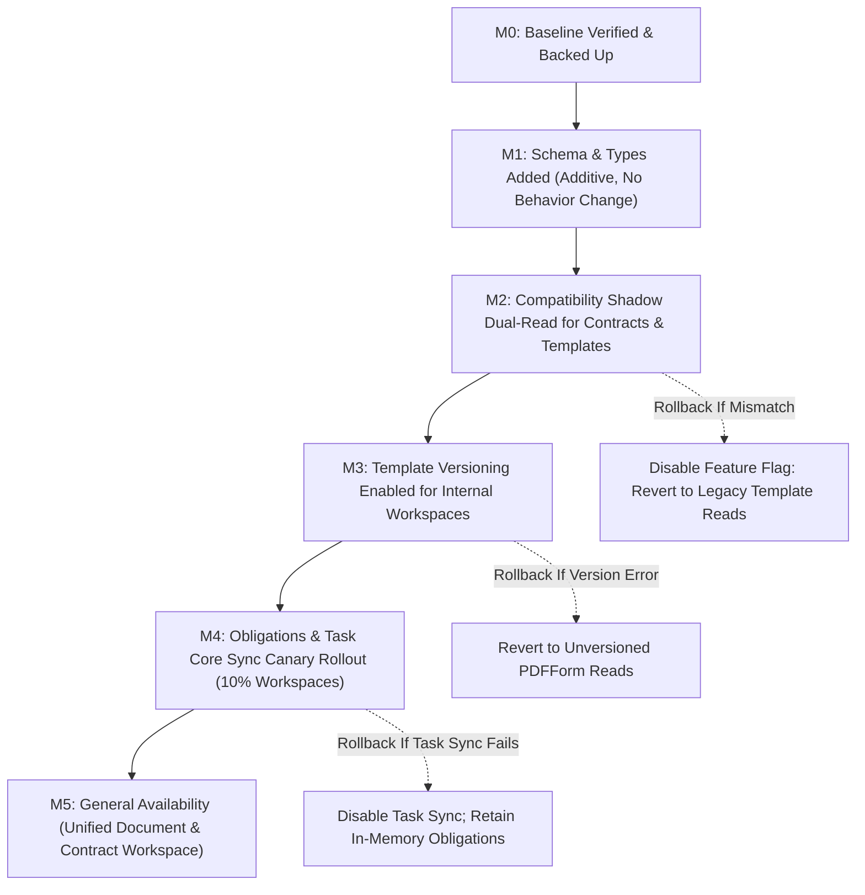

# Document Signing Phase 3: Document & Contract Management, Template Studio Maturity, and Post-Signing Obligations Lifecycle Master Implementation Plan

> **For agentic workers:** REQUIRED SUB-SKILL: Use superpowers:subagent-driven-development (recommended) or superpowers:executing-plans to implement this plan task-by-task. Steps use checkbox (`- [ ]`) syntax for tracking.

**Goal:** Elevate SmartSapp from multi-party execution into a complete Document & Contract Intelligence Lifecycle Platform. Introduce immutable template versioning (`DocumentTemplate` + `TemplateVersion`), a dedicated contract aggregate (`ContractRecord`) decoupled from transient envelopes, non-destructive contract relationships (`amendment`, `renewal`, `supersedes`), an authoritative obligations and renewal milestone engine synchronized directly with SmartSapp's existing task core (`src/lib/tasks/task-core.ts`), and a unified, mobile-first Document & Contract Workspace, maintaining 100% zero-regression backward compatibility across all legacy templates, contracts, and CRM automations.

---

## 1. Executive Architecture & Strategic Foresight

```
┌────────────────────────────────────────────────────────────────────────────────────────────────────────┐
│                                   PHASE 3 TARGET DOMAIN TOPOLOGY                                       │
│                                                                                                        │
│   DocumentTemplate ──► TemplateVersion[] (Immutable Snapshots: v1, v2, v3 [sha256])                   │
│          │                    │                                                                        │
│          │                    └──► Published Version (Locked vector PDF storagePath + field schema)     │
│          ▼                                                                                             │
│   SigningEnvelope  ◄──► DocumentInstance (Issued content with frozen resolvedVariablesSnapshot)        │
│          │                                                                                             │
│          ├──► Execution Complete (deal.contract.signed emitted via DealEventBus)                       │
│          │                                                                                             │
│          ▼                                                                                             │
│   ContractRecord (Authoritative Agreement Lifecycle: executed, active, renewal_pending, terminated)    │
│          │                                                                                             │
│          ├──► ContractRelationship[] (Parent ──► Amendment / Renewal / Superseding Agreement)          │
│          │      └── Preserves historical executed PDFs & vector certificates without overwriting       │
│          │                                                                                             │
│          ├──► ContractObligation[] (Deliverables, Payments, Compliance, Renewal Notices)               │
│          │      └──► SmartSapp Task Core (createTaskCore: appears on agent /admin/tasks queue)         │
│          │                                                                                             │
│          └──► DocumentArtifact[] (Source PDF, Executed Vector PDF, Cryptographic Certificate)          │
│                                                                                                        │
│   Single Source of Truth Standards:                                                                    │
│   • Variables: FieldsVariablesService (src/lib/services/fields-variables-service.ts)                   │
│   • Tags: TagSelector (src/components/tags/TagSelector.tsx)                                           │
│   • Tasks: Task Core (src/lib/tasks/task-core.ts)                                                     │
└────────────────────────────────────────────────────────────────────────────────────────────────────────┘
```

### 1.1 Multi-Phase Architectural Trajectory:
- **Phase 0 & 1 Continuity**:
  - Reuses Phase 1's authoritative vector PDF rendering engine (`generatePdfBuffer`) and vector audit certificates (`generateAuditCertificatePdfBuffer`) for all executed agreement artifacts.
  - Reuses the append-only cryptographic evidence ledger (`signing_evidence`) for all post-signing lifecycle events (`contract.amended`, `contract.renewed`, `contract.obligation_fulfilled`, `contract.terminated`).
- **Phase 2 Continuity**:
  - Leverages Phase 2's `SigningEnvelope` and `DocumentAdapter` as the execution engine. Envelopes execute agreements; `ContractRecord` manages them post-execution.
  - Recipient `formData` captured at signing time deterministically seeds contract metadata (effective dates, payment terms, renewal cycles).
- **Phase 3 Focus (Current Phase)**:
  - Establishes immutable template version control (`TemplateVersion`), preventing draft changes from corrupting in-flight envelopes.
  - Introduces post-signing lifecycle management: contracts, amendments, renewals, and obligations.
  - Unifies templates, contracts, and obligations into a high-performance, mobile-first Document Workspace.
- **Phase 4 Foresight (CRM Analytics, Funnel & Reminders)**:
  - Obligation due dates feed automated notification reminders (30, 60, 90 days before expiry) via `messaging-actions.ts`.
  - Contract commercial values (`contractValue.amount` and `cadence`) aggregate into CRM pipeline win attribution.
- **Phase 5 Foresight (AI Multimodal Intelligence)**:
  - Structured `ContractObligation` schema provides target ground-truth for Gemini 2.0 clause extraction and obligation suggestions.
  - Immutable `TemplateVersion` snapshots allow automated clause diffing between revisions.
- **Phase 6 Foresight (Enterprise Assurance & Legal Hold)**:
  - Immutable version trees and contract relationship chains satisfy enterprise eIDAS, SOC2, and statutory document retention requirements.

---

## 2. Failure Modes & Edge Cases Register ("What Could Go Wrong & Resolutions")

| Risk ID | Potential Failure Mode | Root Cause | Impact | Engineering Mitigation in Phase 3 |
| :--- | :--- | :--- | :--- | :--- |
| **FM-P3-01** | **Template Mutation Contamination** | Admin modifies template fields or wording while recipients are in the process of signing an issued envelope. | Signatories sign an agreement whose terms or fields differ from the sender's intent; legal enforceability compromised. | **Resolution:** Immutability invariant. Any edit creates a new `TemplateVersion(status: 'draft')`. Publishing transitions draft to `published`, marking previous version `superseded`. Issued envelopes bind strictly to immutable `contentSnapshot.sha256` and `templateVersionId`. |
| **FM-P3-02** | **Contract History Overwrite via Amendments** | Operations user creates an amendment or renewal, which mutates or overwrites the original executed contract record. | Destroys the legal audit trail of the original agreement; prior signed vector PDFs become orphaned or unlinked. | **Resolution:** Non-destructive `ContractRelationship` ledger (`amendment`, `renewal`, `supersedes`). Amendments create a linked contract instance via `parentContractId` and `relationshipType`. Original executed contract updates status to `amended` while preserving all original artifacts and evidence records untouched. |
| **FM-P3-03** | **Shadow Task Desynchronization** | Contract obligations create a separate, disconnected task model that does not appear on the agent's task board. | Missed contractual deadlines, duplicate entry confusion, agents unaware of deliverable obligations. | **Resolution:** Strict integration with SmartSapp's existing task core (`src/lib/tasks/task-core.ts`). Every obligation with a due date creates an authoritative workspace `Task` (type: `'contract_obligation'`), storing `linkedTaskId`. Fulfilling the task in CRM syncs the obligation, and vice versa. |
| **FM-P3-04** | **Version Collisions & Branching Races** | Two workspace admins edit and publish a template concurrently, resulting in duplicate version numbers. | Divergent version history, nondeterministic version ordering, and corrupted template references. | **Resolution:** Monotonic integer version numbering (`versionNumber: 1, 2, 3...`) enforced inside a Firestore transaction. `currentPublishedVersionId` on `DocumentTemplate` points strictly to the single active published version. |
| **FM-P3-05** | **Post-Signing CRM State Divergence** | Contract value, effective dates, or signatory contact info diverge between signed PDF form submissions and CRM master records. | Finance and operations see inconsistent values; invoices generated with inaccurate figures. | **Resolution:** Authoritative extraction mapper. Upon envelope completion (`submitRecipientSignatureAction`), key contract fields (effective date, renewal date, signatory contacts) are deterministically synchronized from validated `formData` snapshots via `DocumentAdapter` into the `ContractRecord`. |
| **FM-P3-06** | **Cross-Tenant Document & Contract Leakage** | Backoffice workspace user crafts an ID query targeting contracts or templates belonging to another workspace. | Severe enterprise data breach; confidential commercial terms and PII exposed. | **Resolution:** Strict tenant isolation: all read/write server actions enforce `requireAuth()` and `requireWorkspace(workspaceId)`. Queries filter strictly by `where('workspaceId', '==', workspaceId)`. Firestore security rules enforce workspace ownership. |
| **FM-P3-07** | **Unbounded Workspace Query Latency** | Document Workspace list queries load all nested versions, submissions, and audit logs into client memory simultaneously. | High memory consumption, slow mobile rendering, excessive Firestore read costs. | **Resolution:** Paginated cursor queries (`limit(20)`), composite indexes (`workspaceId + status + updatedAt`), and denormalized summary fields (`activeVersionNumber`, `recipientsCount`, `obligationsSummary`) on parent documents. |
| **FM-P3-08** | **Variable Binding Drift in Template Versions** | Template author uses custom double-brace tokens or un-registered variable keys in draft templates. | Corrupted text rendering, missing values at dispatch, violation of workspace variables rule. | **Resolution:** Rule 1 Compliance: All variable display, mapping, rendering, selection, and compiler replacements route exclusively through `FieldsVariablesService` and `<VariablesPanel>`. Pre-publish lint validation blocks publishing if unknown variable keys exist. |
| **FM-P3-09** | **Mobile Table & Form Degradation** | Dense contract tables with 10+ columns break on mobile viewports; obligation modals trigger iOS auto-zoom. | Unusable on smartphones, mobile users drop off, input layout shift. | **Resolution:** Responsive card layout switch on `< 768px` viewports, sticky action footers, `min-h-[44px]` touch targets, `text-base` (16px) form inputs. |
| **FM-P3-10** | **Cascading Deletion Destruction** | Deleting a template or contract accidentally purges linked historical envelopes, executed PDFs, or tasks. | Permanent loss of executed legal evidence; critical compliance breach. | **Resolution:** Soft-deletion / Archival invariant (`status: 'archived'`). Hard deletion (`deleteContractAction`) is strictly guarded: only allowed for draft records with zero executed signatures, with mandatory audit logging. |

---

## 3. Subsystem Impacts & No-Code Backoffice Enhancements

### 3.1 Subsystem Impact Matrix
- **Task Infrastructure (`src/lib/tasks/task-core.ts`, `src/lib/task-server-actions.ts`)**:
  - Contract obligations create real tasks in the `tasks` collection with `entityId`, `dealId`, and `metadata.contractId`.
  - Bi-directional Reverse Hook: When an agent marks a task done in `/admin/tasks`, task hooks automatically advance the obligation status to `fulfilled`.
- **CRM Deals (`src/lib/deals/deal-event-bus.ts`, `src/app/actions/deal-actions.ts`)**:
  - Deal detail page (`/admin/deals/[id]`) gains an active "Contracts & Lifecycle" card displaying active agreement status, commercial value, renewal countdown, and outstanding obligations.
- **FieldsVariablesService (`src/lib/services/fields-variables-service.ts`)**:
  - Template Studio integrates `<VariablesPanel>` for inserting standardized CRM variables (Entity Name, Signatory Name, Contract Value, Effective Date, Expiry Date).
- **TagSelector (`src/components/tags/TagSelector.tsx`)**:
  - Document templates and contracts utilize `<TagSelector>` for categorizing agreements (e.g. `NDA`, `Master Services`, `Enterprise`, `Vendor`, `Tier-1`).
- **Messaging Engine (`src/lib/messaging-actions.ts`)**:
  - Provides notification triggers for upcoming renewal milestones (30-day, 60-day, 90-day notices) and deliverable reminders.

### 3.2 Backoffice Operations Capabilities (No-Code Operations Console)
Compliance, operations, and account managers can manage the entire document and contract lifecycle directly from the UI without touching code:
1. **One-Click Renewal Wizard**:
   - Operations managers can initiate an agreement renewal directly from the contract drawer in 1 click.
   - Automatically pre-populates the new agreement with updated effective and expiry dates, carries forward party links, and links to the parent contract for complete continuity.
2. **One-Click Amendment Dispatch**:
   - Launch an amendment to add terms, change liability limits, or adjust pricing.
   - Links the new draft envelope to the parent agreement without overwriting the original signed PDF.
3. **Visual Version History & Historical Preview**:
   - Browse past template versions in a dedicated drawer.
   - Preview historical PDF field mappings and see exact visual diffs between revisions.
4. **Manual Obligation Overrides & Waiver**:
   - Mark contractual deliverables fulfilled or waived with a mandatory reason note, without database surgery.
5. **Cross-Contract Milestone Calendar & Task Assignment**:
   - View all upcoming deliverables, payments, and compliance milestones across all client agreements in a unified calendar.
   - Reassign internal responsibility to specific CRM users and configure automated notification intervals (30/60/90 days).
6. **One-Click Agreement Termination & Archival**:
   - Terminate breached or cancelled contracts with an immutable audit reason.
   - Automatically updates CRM deal probabilities and archives active obligations in the agent's task queue.
7. **Batch Expiry & Renewal Alerts Configuration**:
   - Workspace-level settings allowing non-technical managers to define default notice periods (e.g. 30 days vs 60 days) and alert channels (Email, SMS, In-App).

---

## 4. Comprehensive UI/UX Architect Specifications

Conforming to `frontend-design`, `ui-ux-pro-max`, `emilkowal-animations`, and `vercel-react-best-practices`:

```
┌────────────────────────────────────────────────────────────────────────────────────────────────────────┐
│                                   PHASE 3 UI/UX TOUCHPOINTS & FLOWS                                    │
│                                                                                                        │
│  1. UNIFIED DOCUMENT WORKSPACE       2. TEMPLATE STUDIO MATURITY       3. CONTRACT LIFECYCLE DOCK      │
│     [/admin/finance/contracts]          [/admin/pdfs/[id]/edit]           [ContractLifecycleModal.tsx] │
│     • Tab 1: Contracts & Lifecycle      • Version Bar (v1.0 Published)    • Executed PDF & Certificate │
│     • Tab 2: Document Templates         • Draft ──► Publish Stepper       • Linked Envelopes Timeline  │
│     • Tab 3: Obligations & Milestones   • VariablesPanel Integration      • Active Obligations Rail    │
│     • Mobile Card / Desktop Table       • Field Role Outlines             • Amendment / Renewal Modal  │
│                                                                                                        │
│                                   4. OBLIGATION & RENEWAL DRAWER                                       │
│                                      [CreateObligationModal.tsx]                                       │
│                                      • Due Date & Trigger Picker                                       │
│                                      • Internal / Counterparty Owner                                   │
│                                      • Sync to SmartSapp Task Queue                                    │
└────────────────────────────────────────────────────────────────────────────────────────────────────────┘
```

### 4.1 Microcopy & Everyday English Dictionary (Rule 7 Minimal Text)
All UI interfaces must use common, simple everyday English with minimal copy, avoiding technical jargon:

| Technical Concept | Everyday UI English Label | Context & Tooltip |
| :--- | :--- | :--- |
| `SigningEnvelope` | **Signing Workflow** / **Agreement** | "The process of collecting signatures." |
| `TemplateVersion` | **Version 1.0 (Published)** | "The current approved version used for contracts." |
| `ContractObligation` | **Deliverable** / **To-Do** | "A required milestone or payment for this agreement." |
| `Fulfill Obligation` | **Mark Done** | "Confirm this milestone has been completed." |
| `ContractRelationship` (Amendment) | **Contract Amendment** | "An update or modification linked to the original agreement." |
| `ContractRelationship` (Renewal) | **Contract Renewal** | "A renewed agreement extending the contract term." |
| `Sequential Lockout` | **Waiting for [Name] to sign** | "You'll get an alert when it's your turn to review." |
| `Immutable Digest` | **Verified File** | "This document cannot be altered." |

### 4.2 Unified Document & Contract Workspace (`ContractsClient.tsx`)
- **Tabbed Layout**:
  - **Contracts & Lifecycle**: Active, Pending Execution, Executed, Renewal Due, Expired, Terminated. Displays commercial value, renewal countdown badge (`Renews in 42 days`), primary counterparty, and obligations progress.
  - **Document Templates**: Reusable template library with Version pills (`v1.0 (Published)`, `v2.0-draft`), category tags via `<TagSelector>`, and one-click "Issue Agreement" action.
  - **Obligations & Milestones**: Cross-contract calendar and list view of all upcoming deliverables, payments, and compliance milestones with responsible party badges.
- **Mobile Ergonomics**: Responsive card layout on `< 768px` viewports, sticky filters, `min-h-[44px]` touch targets.

### 4.3 Template Studio Maturity (`src/app/admin/pdfs/[id]/edit`)
- **Version Control Status Bar**:
  - Fixed at top of studio: `Document: Master Services Agreement` | Badge: `v2.0 (Published)` or `v3.0-draft (Unpublished changes)`.
  - "Publish New Version" button triggers modal prompting for a brief change summary (e.g. "Updated liability cap to $1M and added countersigner role") with automated field diff preview (`diffTemplateVersions`).
  - "Version History" drawer displaying past versions with published timestamps, author, and preview.
- **Strict Variables & Tags Integration**:
  - Incorporates standardized `<VariablesPanel>` for drag-and-drop CRM variable tokens.
  - Uses `<TagSelector>` in client/draft mode for template tagging.

### 4.4 Contract Lifecycle Detail Modal (`ContractLifecycleDetailModal.tsx`)
- **Agreement Overview Header**: Commercial value (`$50,000 USD`), Effective Date, Expiration Date, Renewal Countdown pill (`Renews in 42 days`), Primary Signatory Contact.
- **Authoritative Artifacts Rail**: One-click download of executed vector PDF, Certificate of Completion, and link to Public Verification Portal (`/verify/[envelopeId]`).
- **Amendment & Renewal Workflows**:
  - "Create Amendment": clones contract metadata, creates a linked draft envelope referencing the latest template version, and links to parent contract.
  - "Initiate Renewal": pre-populates a renewal agreement with updated effective and expiry dates.

### 4.5 Obligations & Milestones Operations Rail (`CreateObligationModal.tsx`)
- **Obligation Creator Form**:
  - Title, Obligation Type (Deliverable, Payment, Renewal Notice, Compliance Audit, Report).
  - Due Date picker with quick presets (+30 days, +60 days, +90 days, End of Quarter).
  - Responsible Party toggle: Internal Staff (with user dropdown) vs Counterparty.
  - "Sync to SmartSapp Task Queue" toggle (checked by default, creating an actionable task).
  - Reminder notification schedule selector.

---

## 5. Strict Type Contracts, Zod Schemas & Security Rules (Rule 4 & 5)

All domain models will live in `src/lib/types/document-signing.ts`:

```typescript
// Additions to: src/lib/types/document-signing.ts

import { z } from 'zod';

export const DocumentTypeSchema = z.enum([
  'contract',
  'agreement',
  'proposal',
  'form',
  'letter',
  'policy',
  'certificate',
  'other'
]);
export type DocumentType = z.infer<typeof DocumentTypeSchema>;

export const TemplateStatusSchema = z.enum(['draft', 'published', 'archived']);
export type TemplateStatus = z.infer<typeof TemplateStatusSchema>;

export const TemplateVersionStatusSchema = z.enum(['draft', 'published', 'superseded']);
export type TemplateVersionStatus = z.infer<typeof TemplateVersionStatusSchema>;

export const TemplateVersionSchema = z.object({
  id: z.string().min(1),
  workspaceId: z.string().min(1),
  templateId: z.string().min(1),
  versionNumber: z.number().int().min(1),
  status: TemplateVersionStatusSchema,
  contentSnapshot: z.object({
    storagePath: z.string().min(1),
    sha256: z.string().min(1),
  }),
  fields: z.array(DocumentFieldDefinitionSchema),
  variableSchemaVersion: z.string().default('1.0'),
  changeSummary: z.string().optional(),
  publishedAt: z.string().optional(),
  createdBy: z.string().min(1),
  createdAt: z.string(),
  updatedAt: z.string(),
});
export type TemplateVersion = z.infer<typeof TemplateVersionSchema>;

export const DocumentTemplateSchema = z.object({
  id: z.string().min(1),
  workspaceId: z.string().min(1),
  name: z.string().min(1),
  description: z.string().optional(),
  documentType: DocumentTypeSchema.default('contract'),
  status: TemplateStatusSchema.default('draft'),
  currentPublishedVersionId: z.string().optional(),
  tagIds: z.array(z.string()).default([]),
  storagePath: z.string(),
  createdBy: z.string().min(1),
  createdAt: z.string(),
  updatedAt: z.string(),
  archivedAt: z.string().optional(),
});
export type DocumentTemplate = z.infer<typeof DocumentTemplateSchema>;

export const ContractLifecycleStatusSchema = z.enum([
  'proposed',
  'negotiation',
  'pending_execution',
  'executed',
  'active',
  'renewal_pending',
  'renewed',
  'amended',
  'expired',
  'terminated',
  'superseded'
]);
export type ContractLifecycleStatus = z.infer<typeof ContractLifecycleStatusSchema>;

export const ContractRelationshipTypeSchema = z.enum([
  'amendment',
  'renewal',
  'supersedes',
  'parent_child'
]);
export type ContractRelationshipType = z.infer<typeof ContractRelationshipTypeSchema>;

export const ContractRelationshipSchema = z.object({
  id: z.string().min(1),
  workspaceId: z.string().min(1),
  sourceContractId: z.string().min(1),
  targetContractId: z.string().min(1),
  relationshipType: ContractRelationshipTypeSchema,
  description: z.string().optional(),
  createdAt: z.string(),
  createdBy: z.string().min(1),
});
export type ContractRelationship = z.infer<typeof ContractRelationshipSchema>;

export const ObligationTypeSchema = z.enum([
  'deliverable',
  'payment',
  'reporting',
  'renewal_notice',
  'audit',
  'compliance',
  'other'
]);
export type ObligationType = z.infer<typeof ObligationTypeSchema>;

export const ObligationStatusSchema = z.enum([
  'pending',
  'in_progress',
  'fulfilled',
  'breached',
  'waived'
]);
export type ObligationStatus = z.infer<typeof ObligationStatusSchema>;

export const ContractObligationSchema = z.object({
  id: z.string().min(1),
  workspaceId: z.string().min(1),
  contractId: z.string().min(1),
  title: z.string().min(1),
  description: z.string().optional(),
  type: ObligationTypeSchema.default('deliverable'),
  status: ObligationStatusSchema.default('pending'),
  dueDate: z.string(), // ISO-8601
  responsibleParty: z.enum(['internal', 'counterparty', 'mutual']).default('internal'),
  assignedUserId: z.string().optional(),
  counterpartyContactId: z.string().optional(),
  linkedTaskId: z.string().optional(),
  reminderDaysBefore: z.array(z.number().int()).default([7, 14, 30]),
  fulfilledAt: z.string().optional(),
  fulfilledBy: z.string().optional(),
  createdAt: z.string(),
  updatedAt: z.string(),
});
export type ContractObligation = z.infer<typeof ContractObligationSchema>;

export const ContractRecordSchema = z.object({
  id: z.string().min(1),
  workspaceId: z.string().min(1),
  title: z.string().min(1),
  status: ContractLifecycleStatusSchema.default('proposed'),
  templateId: z.string().optional(),
  templateVersionId: z.string().optional(),
  envelopeIds: z.array(z.string()).default([]),
  dealId: z.string().optional(),
  entityId: z.string().optional(),
  partyLinks: z.array(z.object({
    entityId: z.string().optional(),
    contactId: z.string().optional(),
    name: z.string(),
    email: z.string().optional(),
    role: z.string(),
  })).default([]),
  contractValue: z.object({
    amount: z.number().min(0),
    currency: z.string().default('USD'),
    cadence: z.enum(['one_off', 'monthly', 'quarterly', 'annually']).default('one_off'),
  }).optional(),
  effectiveAt: z.string().optional(),
  expiresAt: z.string().optional(),
  renewalAt: z.string().optional(),
  noticePeriodDays: z.number().int().default(30),
  parentContractId: z.string().optional(),
  ownerId: z.string().min(1),
  executedPdfStoragePath: z.string().optional(),
  executedPdfSha256: z.string().optional(),
  certificateStoragePath: z.string().optional(),
  tagIds: z.array(z.string()).default([]),
  createdAt: z.string(),
  updatedAt: z.string(),
});
export type ContractRecord = z.infer<typeof ContractRecordSchema>;
```

### 5.1 Firestore Security Rules & Composite Index Specifications
1. **Security Rules (`firestore.rules`)**:
   - `match /contracts/{contractId}`: read/write requires `isAuthenticated()` and `request.resource.data.workspaceId in userWorkspaces()`.
   - `match /document_templates/{templateId}`: read/write requires workspace membership.
   - `match /template_versions/{versionId}`: update/delete denied if `resource.data.status in ['published', 'superseded']` (server-side immutability guard).
   - `match /contract_obligations/{obligationId}`: read/write requires workspace membership.
2. **Composite Indexes**:
   - `contracts`: `workspaceId` (ASC) + `status` (ASC) + `updatedAt` (DESC)
   - `contracts`: `workspaceId` (ASC) + `dealId` (ASC) + `updatedAt` (DESC)
   - `contract_obligations`: `workspaceId` (ASC) + `status` (ASC) + `dueDate` (ASC)
   - `contract_obligations`: `workspaceId` (ASC) + `contractId` (ASC) + `dueDate` (ASC)
   - `document_templates`: `workspaceId` (ASC) + `status` (ASC) + `updatedAt` (DESC)
   - `template_versions`: `workspaceId` (ASC) + `templateId` (ASC) + `versionNumber` (DESC)

---

## 6. Phase 3 Trackable Task Breakdown (TDD)

### Task 1: Strict Schemas & Zod Validation for Template Versions, Contracts & Obligations (P3.1 & P3.3)
**Files:**
- Modify: `src/lib/types/document-signing.ts`
- Create: `src/lib/documents/__tests__/template-contract-schemas.test.ts`

- [ ] **Step 1: Write schema validation unit tests in `template-contract-schemas.test.ts`**
  - Test valid and invalid payloads for `TemplateVersionSchema`, `DocumentTemplateSchema`, `ContractRecordSchema`, `ContractObligationSchema`, `ContractRelationshipSchema`.
  - Test monotonic version number constraints, `cadence` validation on `contractValue`, and obligation status transitions.
- [ ] **Step 2: Run test to verify failure**
  - Command: `pnpm test:run src/lib/documents/__tests__/template-contract-schemas.test.ts`
- [ ] **Step 3: Update `src/lib/types/document-signing.ts`**
  - Implement all Phase 3 schemas and exported TypeScript types.
  - Guarantee zero `any` or `any[]` (Rule 4).
- [ ] **Step 4: Run test to verify pass**
  - Command: `pnpm test:run src/lib/documents/__tests__/template-contract-schemas.test.ts`
- [ ] **Step 5: Commit changes**
  - Command: `git add src/lib/types/document-signing.ts src/lib/documents/__tests__/template-contract-schemas.test.ts && git commit -m "feat(docsigning): implement strict domain schemas for template versions, contracts, and obligations"`

---

### Task 2: Immutable Template Versioning Engine & Immutability Service (P3.2)
**Files:**
- Create: `src/lib/documents/template-version-service.ts`
- Create: `src/lib/documents/__tests__/template-version-service.test.ts`

- [ ] **Step 1: Write unit tests in `template-version-service.test.ts`**
  - Test creating initial template with `v1` draft version.
  - Test publishing draft version: status becomes `published`, prior published version becomes `superseded`.
  - Test editing published template: automatically creates a new incremental draft version (`v2-draft`) without mutating `v1`.
  - Test immutability guard: rejecting modifications to any version with status `published` or `superseded`.
  - Test `diffTemplateVersions(vOld, vNew)` helper: returns added, removed, and updated fields for visual publication review.
- [ ] **Step 2: Run test to verify failure**
  - Command: `pnpm test:run src/lib/documents/__tests__/template-version-service.test.ts`
- [ ] **Step 3: Implement `src/lib/documents/template-version-service.ts`**
  - Pure state-machine functions and Firestore transaction helpers: `publishTemplateVersion`, `createDraftVersion`, `validateTemplateVersionImmutability`, `diffTemplateVersions`.
  - Add inline architectural comments on immutability invariants (Rule 10).
- [ ] **Step 4: Run test to verify pass**
  - Command: `pnpm test:run src/lib/documents/__tests__/template-version-service.test.ts`
- [ ] **Step 5: Commit changes**
  - Command: `git add src/lib/documents/template-version-service.ts src/lib/documents/__tests__/template-version-service.test.ts && git commit -m "feat(docsigning): implement immutable template versioning engine"`

---

### Task 3: Post-Signing Contract Lifecycle & Relationship Engine (P3.3)
**Files:**
- Create: `src/lib/documents/contract-lifecycle-service.ts`
- Create: `src/lib/documents/__tests__/contract-lifecycle-service.test.ts`

- [ ] **Step 1: Write unit tests in `contract-lifecycle-service.test.ts`**
  - Test advancing contract from `proposed` $\to$ `pending_execution` $\to$ `executed` $\to$ `active`.
  - Test creating an amendment relationship: creates new contract record with `relationshipType: 'amendment'` and `parentContractId`, while prior contract transitions to `amended` without mutating historical executed PDF.
  - Test creating a renewal relationship: updates `renewalAt` and links to new agreement.
  - Test calculating renewal countdown and expiry urgency flags.
- [ ] **Step 2: Run test to verify failure**
  - Command: `pnpm test:run src/lib/documents/__tests__/contract-lifecycle-service.test.ts`
- [ ] **Step 3: Implement `src/lib/documents/contract-lifecycle-service.ts`**
  - Deterministic state machine functions: `transitionContractStatus`, `createContractRelationship`, `calculateRenewalUrgency`.
- [ ] **Step 4: Run test to verify pass**
  - Command: `pnpm test:run src/lib/documents/__tests__/contract-lifecycle-service.test.ts`
- [ ] **Step 5: Commit changes**
  - Command: `git add src/lib/documents/contract-lifecycle-service.ts src/lib/documents/__tests__/contract-lifecycle-service.test.ts && git commit -m "feat(docsigning): implement post-signing contract lifecycle and relationship engine"`

---

### Task 4: Obligations & Renewal Task Synchronization Engine (P3.4)
**Files:**
- Create: `src/lib/documents/contract-obligation-service.ts`
- Create: `src/lib/documents/__tests__/contract-obligation-service.test.ts`

- [ ] **Step 1: Write unit tests in `contract-obligation-service.test.ts`**
  - Test creating obligation with linked SmartSapp task creation via `createTaskCore`.
  - Test obligation fulfillment: marks obligation `fulfilled` and updates linked task to completed.
  - Test bi-directional reverse hook: completing linked task in CRM advances obligation status to `fulfilled`.
  - Test overdue obligation calculation and reminder schedule evaluation.
  - Test idempotency: fulfilling already-fulfilled obligation returns success without duplicate side effects.
- [ ] **Step 2: Run test to verify failure**
  - Command: `pnpm test:run src/lib/documents/__tests__/contract-obligation-service.test.ts`
- [ ] **Step 3: Implement `src/lib/documents/contract-obligation-service.ts`**
  - Functions: `createContractObligation`, `fulfillObligation`, `getUpcomingObligations`, `syncObligationWithTask`.
- [ ] **Step 4: Run test to verify pass**
  - Command: `pnpm test:run src/lib/documents/__tests__/contract-obligation-service.test.ts`
- [ ] **Step 5: Commit changes**
  - Command: `git add src/lib/documents/contract-obligation-service.ts src/lib/documents/__tests__/contract-obligation-service.test.ts && git commit -m "feat(docsigning): implement contract obligations and task synchronization engine"`

---

### Task 5: Server Actions for Template Versioning, Contracts & Obligations (P3.1, P3.3, P3.4)
**Files:**
- Create: `src/lib/documents/contract-actions.ts`
- Create: `src/lib/documents/__tests__/contract-actions.test.ts`

- [ ] **Step 1: Write integration tests in `contract-actions.test.ts`**
  - Test `publishTemplateVersionAction`: publishes draft version and records audit event.
  - Test `createContractRecordAction`: creates contract with tenant isolation checks.
  - Test `createContractAmendmentAction`: creates linked amendment with non-destructive history.
  - Test `createContractObligationAction`: creates obligation and triggers task core integration.
  - Test `fulfillContractObligationAction`: updates status and logs evidence record.
- [ ] **Step 2: Run test to verify failure**
  - Command: `pnpm test:run src/lib/documents/__tests__/contract-actions.test.ts`
- [ ] **Step 3: Implement `src/lib/documents/contract-actions.ts`**
  - Authoritative Next.js Server Actions with strict workspace session checks (`requireAuth()`, `requireWorkspace(workspaceId)`).
  - Transactional updates via `adminDb.runTransaction()` (addressing Senior Code Reviewer Guardrail 1).
- [ ] **Step 4: Run test to verify pass**
  - Command: `pnpm test:run src/lib/documents/__tests__/contract-actions.test.ts`
- [ ] **Step 5: Commit changes**
  - Command: `git add src/lib/documents/contract-actions.ts src/lib/documents/__tests__/contract-actions.test.ts && git commit -m "feat(docsigning): implement authoritative contract and template versioning server actions"`

---

### Task 6: Template Studio Versioning Bar & Publication Modal (P3.2 UI)
**Files:**
- Modify: `src/app/admin/pdfs/[id]/edit/page.tsx`
- Create: `src/app/admin/pdfs/[id]/edit/components/TemplateVersionBar.tsx`
- Create: `src/app/admin/pdfs/[id]/edit/components/PublishVersionModal.tsx`
- Create: `src/app/admin/pdfs/[id]/edit/components/VersionHistoryDrawer.tsx`

- [ ] **Step 1: Build `TemplateVersionBar.tsx`**
  - Displays current template version badge (`v1.0 (Published)` or `v2.0-draft`), change status, and action buttons.
  - Incorporates Emil Kowalski micro-interactions (`active:scale-[0.97]`).
- [ ] **Step 2: Build `PublishVersionModal.tsx` & `VersionHistoryDrawer.tsx`**
  - Form capturing change summary, showing field diffs via `diffTemplateVersions`, validating that required fields exist, and calling `publishTemplateVersionAction`.
  - Drawer displaying historical versions with published dates, author, and view buttons.
- [ ] **Step 3: Integrate into PDF Studio Editor**
  - Wire versioning bar to top navigation of `/admin/pdfs/[id]/edit`.
- [ ] **Step 4: Verify TypeScript compiler and lint**
  - Command: `pnpm typecheck && pnpm eslint 'src/app/admin/pdfs/[id]/edit/**/*.tsx'`
- [ ] **Step 5: Commit changes**
  - Command: `git add src/app/admin/pdfs/[id]/edit/ && git commit -m "feat(docsigning): implement template studio versioning bar and publication workflow"`

---

### Task 7: Contract Lifecycle Detail Modal & Amendment Workflow (P3.3 UI)
**Files:**
- Create: `src/app/admin/finance/contracts/components/ContractLifecycleDetailModal.tsx`
- Create: `src/app/admin/finance/contracts/components/CreateAmendmentModal.tsx`

- [ ] **Step 1: Build `ContractLifecycleDetailModal.tsx`**
  - Displays contract header (Status badge, Value with cadence, Effective Date, Expiry Date, Renewal Urgency pill).
  - Executed PDF & Vector Certificate download buttons.
  - Linked signing envelopes timeline.
  - Party links rail (Signatories, Entity contacts).
  - Relationship tree showing parent contracts, amendments, and renewals.
- [ ] **Step 2: Build `CreateAmendmentModal.tsx`**
  - Form allowing operations user to draft an amendment with description and updated terms, calling `createContractAmendmentAction`.
- [ ] **Step 3: Verify TypeScript compiler and lint**
  - Command: `pnpm typecheck && pnpm eslint 'src/app/admin/finance/contracts/components/ContractLifecycleDetailModal.tsx' 'src/app/admin/finance/contracts/components/CreateAmendmentModal.tsx'`
- [ ] **Step 4: Commit changes**
  - Command: `git add src/app/admin/finance/contracts/components/ContractLifecycleDetailModal.tsx src/app/admin/finance/contracts/components/CreateAmendmentModal.tsx && git commit -m "feat(docsigning): implement contract lifecycle detail modal and amendment workflow"`

---

### Task 8: Obligations & Renewal Milestones Operations Rail (P3.4 UI)
**Files:**
- Create: `src/app/admin/finance/contracts/components/CreateObligationModal.tsx`
- Create: `src/app/admin/finance/contracts/components/ObligationsListRail.tsx`

- [ ] **Step 1: Build `CreateObligationModal.tsx`**
  - Form with Obligation Title, Description, Type selector (Deliverable, Payment, Compliance, Renewal Notice).
  - Due Date picker with quick presets (+30d, +60d, +90d, End of Quarter).
  - Responsible Party toggle (Internal vs Counterparty).
  - "Sync to SmartSapp Task Queue" checkbox.
  - Calls `createContractObligationAction`.
- [ ] **Step 2: Build `ObligationsListRail.tsx`**
  - Interactive obligations list with status pills (Pending, In Progress, Fulfilled, Overdue).
  - One-click fulfillment checkbox with Emil Kowalski spring micro-interaction.
  - Direct link to view the synced task in `/admin/tasks`.
- [ ] **Step 3: Verify TypeScript compiler and lint**
  - Command: `pnpm typecheck && pnpm eslint 'src/app/admin/finance/contracts/components/CreateObligationModal.tsx' 'src/app/admin/finance/contracts/components/ObligationsListRail.tsx'`
- [ ] **Step 4: Commit changes**
  - Command: `git add src/app/admin/finance/contracts/components/CreateObligationModal.tsx src/app/admin/finance/contracts/components/ObligationsListRail.tsx && git commit -m "feat(docsigning): implement contract obligations rail and task creation modal"`

---

### Task 9: Unified Document & Contract Workspace Dashboard (P3.1 & P3.5 UI)
**Files:**
- Modify: `src/app/admin/finance/contracts/ContractsClient.tsx`
- Create: `src/app/admin/finance/contracts/components/TemplateCatalogTab.tsx`
- Create: `src/app/admin/finance/contracts/components/ObligationsSummaryTab.tsx`

- [ ] **Step 1: Build `TemplateCatalogTab.tsx`**
  - Visual grid/table of reusable templates with version pills (`v1.0 (Published)`), category tags via `<TagSelector>`, and one-click "Issue Agreement".
- [ ] **Step 2: Build `ObligationsSummaryTab.tsx`**
  - Cross-contract obligations overview with urgency filter (Upcoming 7 Days, Upcoming 30 Days, Overdue).
- [ ] **Step 3: Update `ContractsClient.tsx`**
  - Integrate 3-tab navigation (`Contracts & Lifecycle`, `Document Templates`, `Obligations & Milestones`).
  - Wire `ContractLifecycleDetailModal`, `CreateAmendmentModal`, and `CreateObligationModal`.
  - Fix legacy `StatCard` typing to `icon: React.ComponentType<{ className?: string }>` (Senior Code Reviewer Guardrail 3).
- [ ] **Step 4: Verify TypeScript compiler and lint**
  - Command: `pnpm typecheck && pnpm eslint 'src/app/admin/finance/contracts/**/*.{ts,tsx}'`
- [ ] **Step 5: Commit changes**
  - Command: `git add src/app/admin/finance/contracts/ && git commit -m "feat(docsigning): implement unified 3-tab document workspace and obligations dashboard"`

---

### Task 10: Phase 3 Acceptance Gate & Full Suite Verification
**Files:**
- Verify: Full test suite across baseline, Phase 1, Phase 2, and Phase 3 tests.
- Update: `docs/superpowers/plans/2026-09-29-doc-signing-phase-3.md`

- [ ] **Step 1: Run all unit and integration test suites**
  - Command: `pnpm test:run src/lib/__tests__/*.test.ts src/lib/documents/__tests__/*.test.ts`
  - Expected: 100% pass across all suites.
- [ ] **Step 2: Run TypeScript compiler**
  - Command: `pnpm typecheck`
  - Expected: 0 errors.
- [ ] **Step 3: Run ESLint**
  - Command: `pnpm lint`
  - Expected: 0 errors, warnings $\le 670$.
- [ ] **Step 4: Commit completed Phase 3 master plan status**
  - Command: `git add docs/superpowers/plans/2026-09-29-doc-signing-phase-3.md && git commit -m "docs(docsigning): mark Phase 3 tasks completed"`

---

## 7. Staged Migration (M0–M10) & Rollback Procedures



- **Feature Flag Keys**:
  - `features.template_versioning.enabled` (Boolean, workspace-scoped).
  - `features.contract_lifecycle.enabled` (Boolean, workspace-scoped).
  - `features.obligation_task_sync.enabled` (Boolean, workspace-scoped).
- **Rollback Procedure**:
  1. Toggle feature flags to `false` in remote config or workspace settings.
  2. Legacy templates (`PDFForm`) and legacy contracts (`Contract`) immediately resume serving reads and writes without disruption.
  3. No historical records, signed artifacts, or synced tasks are deleted during rollback.
