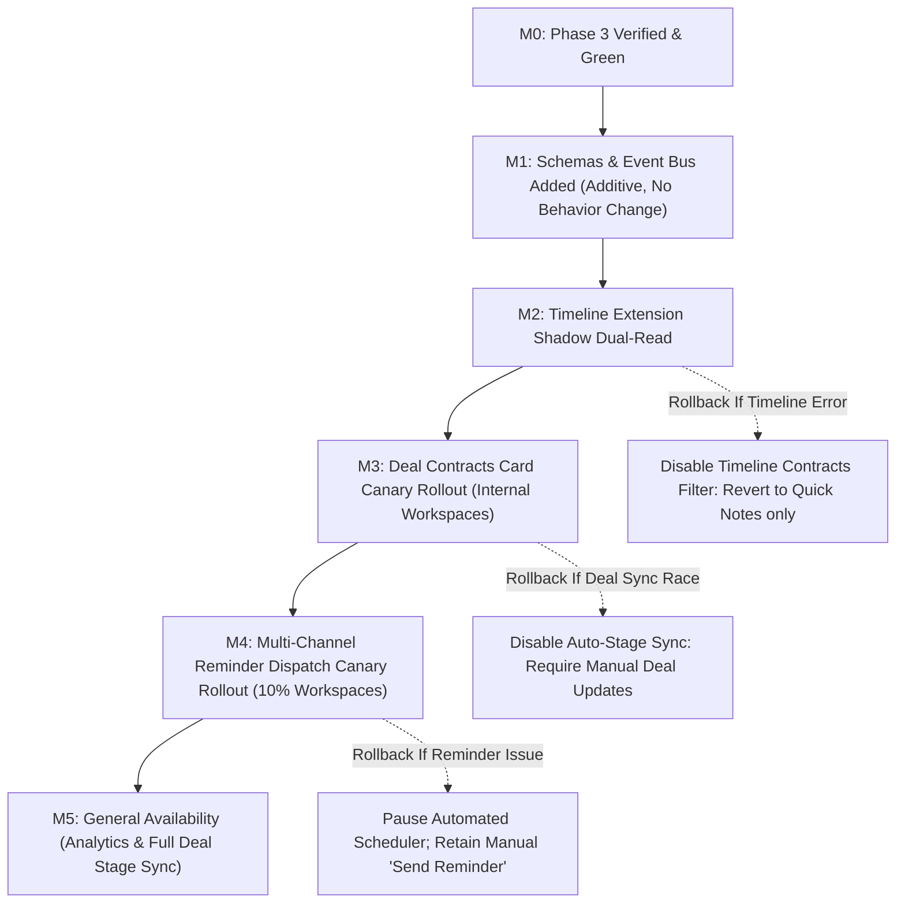

# Document Signing Phase 4: CRM Master-Record Federation, Event-Derived Analytics, Multi-Channel Reminders, and Contextual Deal Intelligence Master Implementation Plan

> **For agentic workers:** REQUIRED SUB-SKILL: Use superpowers:subagent-driven-development (recommended) or superpowers:executing-plans to implement this plan task-by-task. Steps use checkbox (`- [ ]`) syntax for tracking.

**Goal:** Bridge the execution engine (Phases 1–3) directly into SmartSapp's core business workflows: CRM deals, master entities, unified contact timelines, event-derived operational analytics, and automated multi-channel reminder escalations (Email, SMS, WhatsApp). Ensure zero master-record duplication, 100% tenant isolation, immutable event tracking, high-velocity mobile ergonomics, and complete no-code operational control for backoffice operators.

---

## 1. Executive Architecture & Strategic Foresight

```
┌────────────────────────────────────────────────────────────────────────────────────────────────────────┐
│                                   PHASE 4 TARGET DOMAIN TOPOLOGY                                       │
│                                                                                                        │
│   CRM Master Entities ◄───────────────────────────────────────────────────────► Document Platform     │
│   (Entities / Institutions / Contacts)                                         (Templates / Contracts) │
│          │                                                                                │            │
│          ├──► CRM Deals (/admin/deals/[id])                                               │            │
│          │      └──► DealContractsCard.tsx (Active Agreements, Value, 1-Click Dispatch)  │            │
│          │      └──► Stage Sync Engine (deal.contract.sent ──► Sent, signed ──► Won)      │            │
│          │                                                                                │            │
│          ├──► Unified Knowledge Timeline (use-unified-entity-timeline.ts)                 │            │
│          │      └──► Stream source: 'contract' | 'signing_envelope'                       │            │
│          │                                                                                │            │
│          ├──► Task Core (/admin/tasks) ◄──► Contract Obligations Rail                     │            │
│          │                                                                                │            │
│          ▼                                                                                ▼            │
│   ┌──────────────────────────────────────────────────────────────────────────────────────────────┐     │
│   │                        CANONICAL DOCUMENT & SIGNING EVENT TAXONOMY                           │     │
│   │  • document.template_published   • signing.recipient_completed   • contract.amended          │     │
│   │  • document.instance_created     • signing.recipient_declined    • contract.renewal_due      │     │
│   │  • document.dispatched           • signing.envelope_completed    • contract.terminated       │     │
│   │  • document.viewed               • contract.created              • obligation.fulfilled      │     │
│   └──────────────────────────────────────────────┬───────────────────────────────────────────────┘     │
│                                                  │                                                     │
│                        ┌─────────────────────────┴─────────────────────────┐                           │
│                        ▼                                                   ▼                           │
│   ┌──────────────────────────────────────────────┐    ┌──────────────────────────────────────────┐     │
│   │      EVENT-DERIVED ANALYTICS ENGINE          │    │    MULTI-CHANNEL REMINDER DISPATCH       │     │
│   │  • Draft-to-Dispatch Conversion Rate         │    │  • 30 / 60 / 90-Day Renewal Alerts       │     │
│   │  • Lifecycle Velocity (Time to First View)   │    │  • Signer Inaction Escalations           │     │
│   │  • Time to Signature (Median Completion Hrs) │    │  • Channels: Email, SMS, WhatsApp        │     │
│   │  • Signer Bottlenecks & Drop-Off Funnel      │    │  • Idempotency & Deduplication Guard     │     │
│   │  • Deal-to-Contract Value Attribution        │    │  • Quiet-Hours & Timezone Windowing      │     │
│   └──────────────────────────────────────────────┘    └──────────────────────────────────────────┘     │
└────────────────────────────────────────────────────────────────────────────────────────────────────────┘
```

### 1.1 Multi-Phase Architectural Continuity:
- **Phase 0 & 1 Baseline**:
  - Leverages Phase 1's authoritative vector PDF generator (`generatePdfBuffer`) and vector audit certificates (`generateAuditCertificatePdfBuffer`) for downloads directly within CRM contextual cards.
  - Leverages `signing_evidence` ledger as the immutable seed for all event-derived analytics.
- **Phase 2 Execution**:
  - Leverages Phase 2's `SigningEnvelope` and sequential/parallel routing for triggering granular recipient reminder notifications (`signing.recipient_pending`).
  - Emits canonical signing lifecycle events into the CRM domain bus.
- **Phase 3 Maturity**:
  - Leverages Phase 3's `ContractRecord` aggregate, immutable `TemplateVersion`, non-destructive relationships (`amendment`, `renewal`, `supersedes`), and obligations synced to `src/lib/tasks/task-core.ts`.
- **Phase 4 Focus (Current Phase)**:
  - **CRM Master-Record Federation**: Zero data duplication. Contracts and envelopes bind directly to existing `dealId`, `entityId`, `contactId`.
  - **Contextual Deal Intelligence**: Live contract card on Deal details page, automatic deal stage transitions based on signing milestones, and entity timeline federation.
  - **Event-Derived Analytics**: Replaces fragile counters with pure aggregate metrics derived from immutable signing evidence events.
  - **Multi-Channel Reminder Engine**: Durable, idempotent reminder and renewal escalation schedules across Email (Resend), SMS (mNotify), and WhatsApp.
- **Phase 5 Foresight (AI Document Intelligence)**:
  - Event taxonomy and deal linking provide ground-truth contextual embeddings for Gemini 2.0 deal risk scoring and clause recommendations.
- **Phase 6 Foresight (Enterprise Assurance & Compliance)**:
  - Analytics and delivery logs satisfy enterprise auditing, SLA tracking, and SOC2 non-repudiation standards.

---

## 2. Failure Modes & Edge Cases Register ("What Could Go Wrong & Resolutions")

| Risk ID | Potential Failure Mode | Root Cause | Impact | Engineering Mitigation in Phase 4 |
| :--- | :--- | :--- | :--- | :--- |
| **FM-P4-01** | **Split-Brain Deal vs Contract State** | User manually drags deal to "Won" in pipeline while the signing envelope was declined or voided. | Revenue reported before legal binding; invoices generated without signed agreements. | **Resolution:** Authoritative Bi-Directional Synchronizer. When a contract envelope is signed, `deal.contract.signed` advances deal stage and updates `deal.contractStatus = 'signed'`. If user manually forces "Won" without a signed contract, an explicit warning modal prompts for commercial confirmation. If an envelope is voided/declined, deal reflects `contractStatus = 'declined'`. |
| **FM-P4-02** | **Duplicate Reminder Storm** | Network timeout or retry loop triggers multiple automated reminders to signers or clients simultaneously. | Signers spammed with 10+ SMS/Emails, damaged brand reputation, provider rate-limit penalties. | **Resolution:** Deterministic Deduplication Window. All reminder executions check `scheduled_reminders` or `message_logs` with a unique composite key: `rem_${envelopeId}_${recipientId}_${reminderType}_${dateKey}`. If a message was dispatched within the last 24 hours for the same step, execution is skipped idempotently. |
| **FM-P4-03** | **Analytics Discrepancy & Drift** | Counting cached fields or volatile counters in memory produces different numbers than actual signed contracts. | Management relies on inaccurate revenue and velocity numbers; audits fail reconciliation. | **Resolution:** Event-Derived Analytics Invariant. Operational metrics are strictly derived from append-only events (`signing_evidence` and `document_events`). Metrics calculate dynamically or materialize through timestamped snapshots with visible data freshness indicators. |
| **FM-P4-04** | **Cross-Tenant CRM Document Leakage** | Deal detail page fetches all contracts without filtering by `workspaceId`. | Sensitive contractual figures and NDAs exposed across tenant boundaries. | **Resolution:** Tenant Scoping Invariant: All queries strictly mandate `where('workspaceId', '==', workspaceId)`. Server actions enforce `requireAuth()` and `requireWorkspace(workspaceId)`. Sub-collections and entity lookups check tenant ownership before returning. |
| **FM-P4-05** | **Signer Inaction Stall in Multi-Party Envelopes** | Signer 2 in a sequential workflow never receives reminders because automated reminders only track Signer 1. | In-flight agreements stall indefinitely; sales cycle lengthens without operator visibility. | **Resolution:** Active Signer Routing in Reminder Engine. The reminder job queries the current active step in `SigningEnvelope.routingRules.currentStep`. Reminders are dispatched strictly to recipients assigned to the currently pending step. |
| **FM-P4-06** | **Unbounded Analytics Query Latency** | Backoffice loads 50,000 historical envelopes into client state to compute median completion time. | Browser tab freezes, mobile app crashes, excessive Firestore billing. | **Resolution:** Time-Bounded Cursor Queries. Analytics tabs query bounded rolling windows (Last 7 Days, Last 30 Days, Last 90 Days, Year-to-Date) with Firestore composite indexes (`workspaceId + createdAt`). Aggregate calculations use pure memoized reducers. |
| **FM-P4-07** | **Quiet-Hours & Timezone Notification Spam** | Automated 30-day reminder fires at 2:00 AM recipient local time. | Poor customer experience, recipient frustration, unsubscribes from transactional channel. | **Resolution:** Timezone-Aware Delivery Window. When recipient timezone is known, reminders are held until 9:00 AM local time. If unknown, system defaults to 9:00 AM in the workspace default timezone. |
| **FM-P4-08** | **Currency & Cadence Formatting Mismatch** | Deal currency is EUR while contract value is USD, or monthly MRR is treated as total TCV in pipeline reporting. | Distorted pipeline forecasts and incorrect win attribution. | **Resolution:** Strict Currency & Cadence Normalizer. `ContractRecord.contractValue` includes both `currency` and `cadence` ('one_off', 'monthly', 'annual'). When syncing to deal value, annual contract value (ARR) or total contract value (TCV) is calculated explicitly with currency conversion checks. |
| **FM-P4-09** | **Orphaned Timeline Items upon Contract Archival** | A contract is archived or purged, but timeline references point to deleted documents. | Broken links, 404 errors when clicking timeline items, broken audit trails. | **Resolution:** Soft-Delete & Tombstone Invariant. Purging or archiving a contract updates status to `'archived'`. Timeline items display an "Archived" badge and suppress dead links cleanly. |
| **FM-P4-10** | **Mobile Card & Modal Input Degradation** | Contextual deal contract card overflows on mobile viewport; reminder date picker triggers iOS zoom. | Mobile sales reps unable to issue contracts or review terms on smartphones. | **Resolution:** Mobile-First Layout: All inputs use `text-base` (16px) font to prevent iOS zoom, minimum `44x44px` touch targets, tactile button feedback (`active:scale-[0.97]`), and responsive card/sheet drawers. |

---

## 3. Subsystem Impacts & No-Code Backoffice Enhancements

### 3.1 Subsystem Impact Matrix
- **CRM Deals (`src/app/admin/deals/[id]/page.tsx`, `src/lib/deals/deal-event-bus.ts`)**:
  - Receives live `<DealContractsCard>` component rendering active contracts, total value, renewal countdown, and linked signing envelopes.
  - Automatically updates deal status/stage when contracts are dispatched or signed (`deal.contract.sent`, `deal.contract.signed`).
  - Adds 1-click "Issue Agreement" button opening the pre-populated contract wizard.
- **Unified Knowledge Timeline (`src/lib/hooks/use-unified-entity-timeline.ts`, `src/lib/quick-notes-types.ts`)**:
  - Extends `TimelineItemSource` with `'contract'` and `'signing_envelope'`.
  - Documents and signing milestones appear in the unified timeline for entities, contacts, and deals with 1-click view and verification links.
- **Task Core (`src/lib/tasks/task-core.ts`, `src/app/admin/tasks/TasksClient.tsx`)**:
  - Reminders and overdue obligations automatically generate actionable tasks in the agent's task queue with direct links to the agreement.
- **Messaging Engine (`src/lib/messaging-engine.ts`, `src/lib/reminder-actions.ts`)**:
  - Dispatches automated signing reminders and contract renewal notices via configured sender profiles (Email via Resend, SMS via mNotify, WhatsApp).
- **Agreements Hub (`src/app/admin/finance/contracts/ContractsClient.tsx`)**:
  - Adds Tab 4: "Analytics & Velocity" (`ContractsAnalyticsTab.tsx`) with funnel breakdown, velocity KPIs, and signer bottleneck reports.

### 3.2 Backoffice Operations Capabilities (No-Code Operations Console)
Compliance, operations, and account managers can configure and manage the entire lifecycle without touching code:
1. **Automated Reminder Intervals Configuration**:
   - Operations managers configure reminder cadences (e.g. Day 3, Day 7, Day 14, Day 21) per template or workspace.
2. **Channel Selection Per Notification Type**:
   - Choose whether signers receive Email, SMS, or WhatsApp reminders, and select the default sender profile.
3. **One-Click Manual Reminder Escalation**:
   - Operations user can click "Send Reminder Now" on any stalled envelope directly from the CRM deal or contracts table.
4. **Renewal Notice Schedule Setup**:
   - Configure automatic 30-day, 60-day, and 90-day renewal notices to internal account managers or external counterparties.
5. **Deal Stage Auto-Advance Rules**:
   - Toggle whether signing a contract automatically moves a deal to "Closed Won" or prompts for confirmation.
6. **Analytics Date-Range & Funnel Filtering**:
   - Filter velocity metrics and drop-off rates by template, deal owner, or time window with zero SQL queries.

---

## 4. Comprehensive UI/UX Architect Specifications

Conforming to `frontend-design`, `ui-ux-pro-max`, `emilkowal-animations`, and `vercel-react-best-practices`:

```
┌────────────────────────────────────────────────────────────────────────────────────────────────────────┐
│                                   PHASE 4 UI/UX TOUCHPOINTS & FLOWS                                    │
│                                                                                                        │
│  1. DEAL CONTEXTUAL INTELLIGENCE     2. AGREEMENTS HUB ANALYTICS       3. REMINDER CONFIG DRAWER       │
│     [/admin/deals/[id]]                 [/admin/finance/contracts]        [ReminderSettingsModal.tsx] │
│     • DealContractsCard.tsx             • ContractsAnalyticsTab.tsx       • Cadence: 3d, 7d, 14d      │
│     • Active Agreement Status Badge     • Funnel Drop-off Chart           • Channels: Email/SMS/WA    │
│     • Contract Value & Cadence Pill     • Median Sign Time (Velocity)     • Escalation Rules          │
│     • 1-Click "Issue Agreement"         • Signer Bottleneck Heatmap       • Quiet-Hours Windowing     │
│     • Executed PDF & Cert Download      • Date Range Filter (7d/30d/90d)                              │
│                                                                                                        │
│                                   4. UNIFIED ENTITY & DEAL TIMELINE                                    │
│                                      [use-unified-entity-timeline.ts]                                  │
│                                      • Contract Created / Dispatched                                   │
│                                      • Recipient Viewed / Signed                                       │
│                                      • 1-Click Public Verify URL                                       │
└────────────────────────────────────────────────────────────────────────────────────────────────────────┘
```

### 4.1 Microcopy & Everyday English Dictionary (Rule 7 Minimal Text)

| Technical Concept | Everyday UI English Label | Context & Tooltip |
| :--- | :--- | :--- |
| `SigningEnvelope` | **Agreement** / **Signing Workflow** | "The active document out for signatures." |
| `deal.contract.signed` | **Agreement Signed** | "All parties have signed this agreement." |
| `Lifecycle Velocity` | **Signing Speed** | "The average time it takes from sending to final signature." |
| `Funnel Drop-off` | **Completion Rate** | "Percentage of sent agreements that get signed." |
| `Automated Escalation` | **Reminders** | "Automated nudges sent to signers who have not signed." |
| `Renewal Notice` | **Renewal Alert** | "Notice sent before an agreement expires or renews." |

---

## 5. Security, Tenant Isolation & Resilience

1. **Zero-Tolerance Typing (Rule 4)**:
   - Zero `any` or `any[]` throughout all domain code, hooks, and UI components.
   - All event payloads and analytics aggregations strictly validated via Zod schemas.
2. **Strict Tenant Scoping (Rule 5 & 8)**:
   - Every server action and query strictly enforces `requireAuth()` and `requireWorkspace(workspaceId)`.
   - Deals, contracts, and envelopes verify that both entities belong to the calling workspace before executing linking actions.
3. **Idempotent Background Dispatch (Rule 9)**:
   - Reminder dispatch writes a deterministic record to `message_logs` and `scheduled_reminders` with a composite lock key, preventing race conditions and double-sends.
4. **Resilient Error Logging (Rule 10)**:
   - Downstream event hooks never throw or crash user transactions; all side-effects route safely through Next.js `after()`.

---

## 6. Phase 4 Trackable Task Breakdown (TDD)

### Task 1: Strict Schemas & Zod Validation for CRM Document Links, Events & Analytics (P4.1 & P4.3)
**Files:**
- Modify: `src/lib/types/document-signing.ts`
- Create: `src/lib/documents/__tests__/crm-analytics-schemas.test.ts`

- [x] **Step 1: Write schema validation unit tests in `crm-analytics-schemas.test.ts`**
  - Test valid and invalid payloads for `DocumentDomainEventSchema`, `CrmDocumentLinkSchema`, `SigningAnalyticsMetricSchema`, `ReminderScheduleConfigSchema`.
  - Test event taxonomy constraints (`document.dispatched`, `signing.recipient_completed`, `contract.created`, etc.).
- [x] **Step 2: Run test to verify failure**
  - Command: `pnpm test:run src/lib/documents/__tests__/crm-analytics-schemas.test.ts`
- [x] **Step 3: Update `src/lib/types/document-signing.ts`**
  - Implement all Phase 4 schemas and exported TypeScript types.
  - Strictly zero `any` or `any[]` (Rule 4).
- [x] **Step 4: Run test to verify pass**
  - Command: `pnpm test:run src/lib/documents/__tests__/crm-analytics-schemas.test.ts`
- [x] **Step 5: Commit changes**
  - Command: `git add src/lib/types/document-signing.ts src/lib/documents/__tests__/crm-analytics-schemas.test.ts && git commit -m "feat(docsigning): implement strict domain schemas for CRM links, document events, and analytics"`

---

### Task 2: Canonical Document Event Taxonomy & Durable Event Bus (P4.3)
**Files:**
- Create: `src/lib/documents/document-event-bus.ts`
- Create: `src/lib/documents/__tests__/document-event-bus.test.ts`

- [x] **Step 1: Write unit tests in `document-event-bus.test.ts`**
  - Test emitting `document.dispatched`, `signing.recipient_completed`, `signing.envelope_completed`.
  - Test emitting canonical contract lifecycle events (`contract.created`, `contract.amended`, `contract.renewed`, `contract.terminated`, `obligation.fulfilled`).
  - Test event persistence to Firestore collection `document_events` with workspace scoping.
  - Test non-blocking execution via Next.js `after()`.
  - Test forwarding relevant signing and contract events directly to `emitDealDomainEvent`.
- [x] **Step 2: Run test to verify failure**
  - Command: `pnpm test:run src/lib/documents/__tests__/document-event-bus.test.ts`
- [x] **Step 3: Implement `src/lib/documents/document-event-bus.ts`**
  - Pure event construction, deterministic `eventId` generator, and Firestore storage helper.
  - Bridge to `emitDealDomainEvent` for downstream CRM webhook and visual automation dispatch.
  - Add inline maintainer comments on event immutability (Rule 10).
- [x] **Step 4: Run test to verify pass**
  - Command: `pnpm test:run src/lib/documents/__tests__/document-event-bus.test.ts`
- [x] **Step 5: Commit changes**
  - Command: `git add src/lib/documents/document-event-bus.ts src/lib/documents/__tests__/document-event-bus.test.ts && git commit -m "feat(docsigning): implement canonical document event bus and deal bridge"`

---

### Task 3: CRM Master-Record Federation, Bi-Directional Deal Stage Synchronizer & Task Core Hook (P4.1 & P4.2)
**Files:**
- Create: `src/lib/documents/crm-deal-sync-service.ts`
- Modify: `src/lib/tasks/task-core.ts`
- Create: `src/lib/documents/__tests__/crm-deal-sync-service.test.ts`

- [x] **Step 1: Write unit tests in `crm-deal-sync-service.test.ts`**
  - Test `syncEnvelopeWithDeal`: links envelope to deal, updates deal `contractStatus = 'sent'`.
  - Test `handleEnvelopeSigned`: advances deal stage to Won or updates `contractStatus = 'signed'` and updates deal value if specified.
  - Test `handleEnvelopeDeclined`: updates deal `contractStatus = 'declined'`.
  - Test tenant isolation check: rejecting deal link if workspaceId does not match.
  - Test reverse task completion hook: completing a task with `relatedParentId` (contractId) triggers `syncObligationWithTask`.
- [x] **Step 2: Run test to verify failure**
  - Command: `pnpm test:run src/lib/documents/__tests__/crm-deal-sync-service.test.ts`
- [x] **Step 3: Implement `src/lib/documents/crm-deal-sync-service.ts` & wire `task-core.ts`**
  - Transactional synchronization functions between `deals` and `signing_envelopes`/`contracts`.
  - Connect `updateTaskCore` in `src/lib/tasks/task-core.ts` to call `syncObligationWithTask` when task status becomes `'done'`.
- [x] **Step 4: Run test to verify pass**
  - Command: `pnpm test:run src/lib/documents/__tests__/crm-deal-sync-service.test.ts`
- [x] **Step 5: Commit changes**
  - Command: `git add src/lib/documents/crm-deal-sync-service.ts src/lib/tasks/task-core.ts src/lib/documents/__tests__/crm-deal-sync-service.test.ts && git commit -m "feat(docsigning): implement bi-directional CRM deal stage synchronization and task core reverse hook"`

---

### Task 4: Unified Timeline Federation Adapter for Contracts & Envelopes (P4.2)
**Files:**
- Modify: `src/lib/quick-notes-types.ts`
- Modify: `src/lib/quick-notes-domain.ts`
- Modify: `src/lib/hooks/use-unified-entity-timeline.ts`
- Create: `src/lib/documents/__tests__/timeline-contract-adapter.test.ts`

- [x] **Step 1: Write unit tests in `timeline-contract-adapter.test.ts`**
  - Test transforming `ContractRecord` into `CRMKnowledgeTimelineItem` (source: `'contract'`).
  - Test transforming `SigningEnvelope` into `CRMKnowledgeTimelineItem` (source: `'signing_envelope'`).
  - Test timeline filtering by date, status, and search query.
  - Test query bounding: strictly enforcing `limit(25)` alongside `orderBy('createdAt', 'desc')`.
- [x] **Step 2: Run test to verify failure**
  - Command: `pnpm test:run src/lib/documents/__tests__/timeline-contract-adapter.test.ts`
- [x] **Step 3: Implement timeline extensions**
  - Add `'contract' | 'signing_envelope'` to `TimelineItemSource` in `src/lib/quick-notes-types.ts`.
  - Implement federated streaming in `use-unified-entity-timeline.ts` with bounded `limit(25)`.
- [x] **Step 4: Run test to verify pass**
  - Command: `pnpm test:run src/lib/documents/__tests__/timeline-contract-adapter.test.ts`
- [x] **Step 5: Commit changes**
  - Command: `git add src/lib/quick-notes-types.ts src/lib/quick-notes-domain.ts src/lib/hooks/use-unified-entity-timeline.ts src/lib/documents/__tests__/timeline-contract-adapter.test.ts && git commit -m "feat(docsigning): federate contracts and signing workflows into unified CRM timeline"`

---

### Task 5: Event-Derived Lifecycle Analytics Engine (P4.4)
**Files:**
- Create: `src/lib/documents/signing-analytics-service.ts`
- Create: `src/lib/documents/__tests__/signing-analytics-service.test.ts`

- [x] **Step 1: Write unit tests in `signing-analytics-service.test.ts`**
  - Test `calculateSigningVelocity`: calculates median and average hours from dispatch to signature.
  - Test `calculateFunnelDropOff`: calculates completion %, decline %, void %, expired %.
  - Test `identifySignerBottlenecks`: groups turnaround time by recipient role and order index.
  - Test `calculateDealContractAttribution`: calculates total contract value signed by deal pipeline and stage.
- [x] **Step 2: Run test to verify failure**
  - Command: `pnpm test:run src/lib/documents/__tests__/signing-analytics-service.test.ts`
- [x] **Step 3: Implement `src/lib/documents/signing-analytics-service.ts`**
  - Pure calculation reducers operating over immutable event streams.
- [x] **Step 4: Run test to verify pass**
  - Command: `pnpm test:run src/lib/documents/__tests__/signing-analytics-service.test.ts`
- [x] **Step 5: Commit changes**
  - Command: `git add src/lib/documents/signing-analytics-service.ts src/lib/documents/__tests__/signing-analytics-service.test.ts && git commit -m "feat(docsigning): implement event-derived lifecycle analytics engine"`

---

### Task 6: Multi-Channel Reminder & Renewal Escalation Engine & Cron Endpoint (P4.5)
**Files:**
- Create: `src/lib/documents/signing-reminder-service.ts`
- Create: `src/app/api/cron/signing-reminders/route.ts`
- Create: `src/lib/documents/__tests__/signing-reminder-service.test.ts`

- [x] **Step 1: Write unit tests in `signing-reminder-service.test.ts`**
  - Test evaluating envelopes requiring reminders based on configured cadence (e.g. 3d, 7d).
  - Test active signer isolation (only sends reminder to the recipient whose turn it currently is).
  - Test deduplication window: skips if a reminder was sent in the last 24 hours.
  - Test multi-channel dispatch: triggers Email via Resend or SMS via mNotify.
  - Test evaluating upcoming contract renewals (30d, 60d, 90d notice).
- [x] **Step 2: Run test to verify failure**
  - Command: `pnpm test:run src/lib/documents/__tests__/signing-reminder-service.test.ts`
- [x] **Step 3: Implement `src/lib/documents/signing-reminder-service.ts` & cron route**
  - Service functions: `evaluatePendingEnvelopeReminders`, `dispatchEnvelopeReminder`, `evaluateContractRenewalAlerts`.
  - Create secure Next.js Route Handler `/api/cron/signing-reminders/route.ts` with `CRON_SECRET` authorization.
- [x] **Step 4: Run test to verify pass**
  - Command: `pnpm test:run src/lib/documents/__tests__/signing-reminder-service.test.ts`
- [x] **Step 5: Commit changes**
  - Command: `git add src/lib/documents/signing-reminder-service.ts src/app/api/cron/signing-reminders/route.ts src/lib/documents/__tests__/signing-reminder-service.test.ts && git commit -m "feat(docsigning): implement multi-channel reminder and renewal escalation engine and cron endpoint"`

---

### Task 7: Deal Contextual Intelligence Card & 1-Click Dispatch (`DealContractsCard.tsx`) (P4.2 UI)
**Files:**
- Create: `src/app/admin/deals/[id]/components/DealContractsCard.tsx`
- Modify: `src/app/admin/deals/[id]/page.tsx`

- [x] **Step 1: Build `DealContractsCard.tsx`**
  - Shows linked agreements, contract status badge, commercial value with cadence, and active obligations.
  - 1-Click "Issue Agreement" button opening pre-populated dispatch dialog.
  - 1-Click download of executed vector PDF and vector audit certificate.
  - Emil Kowalski micro-interactions (`active:scale-[0.97]`).
- [x] **Step 2: Integrate into `src/app/admin/deals/[id]/page.tsx`**
  - Mount `<DealContractsCard deal={deal} />` in the Deal page main tab section.
- [x] **Step 3: Verify TypeScript compiler and lint**
  - Command: `pnpm typecheck && pnpm eslint 'src/app/admin/deals/[id]/components/DealContractsCard.tsx'`
- [x] **Step 4: Commit changes**
  - Command: `git add src/app/admin/deals/[id]/components/DealContractsCard.tsx src/app/admin/deals/[id]/page.tsx && git commit -m "feat(docsigning): implement deal contracts card and contextual dispatch UI"`

---

### Task 8: Agreements Hub Analytics & Velocity Dashboard Tab (`ContractsAnalyticsTab.tsx`) (P4.4 UI)
**Files:**
- Create: `src/app/admin/finance/contracts/components/ContractsAnalyticsTab.tsx`
- Modify: `src/app/admin/finance/contracts/ContractsClient.tsx`

- [x] **Step 1: Build `ContractsAnalyticsTab.tsx`**
  - Metrics overview cards (Completion Rate %, Median Hours to Sign, Drop-Off %, Active Agreements Value).
  - Funnel status breakdown visualizer.
  - Signer turnaround bottlenecks chart.
  - Date range selector (Last 7 Days, Last 30 Days, Last 90 Days, Year-to-Date).
  - Mobile card responsive layout.
- [x] **Step 2: Integrate as Tab 4 in `ContractsClient.tsx`**
  - Add "Analytics & Reports" tab trigger and content panel.
- [x] **Step 3: Verify TypeScript compiler and lint**
  - Command: `pnpm typecheck && pnpm eslint 'src/app/admin/finance/contracts/components/ContractsAnalyticsTab.tsx'`
- [x] **Step 4: Commit changes**
  - Command: `git add src/app/admin/finance/contracts/components/ContractsAnalyticsTab.tsx src/app/admin/finance/contracts/ContractsClient.tsx && git commit -m "feat(docsigning): implement agreements hub analytics and velocity tab"`

---

### Task 9: Automated Reminder & Notification Settings Drawer (P4.5 UI)
**Files:**
- Create: `src/app/admin/finance/contracts/components/ReminderSettingsDrawer.tsx`
- Modify: `src/app/admin/finance/contracts/ContractsClient.tsx`

- [x] **Step 1: Build `ReminderSettingsDrawer.tsx`**
  - Form allowing operations users to configure reminder frequency (e.g. 3d, 7d, 14d).
  - Channel toggles (Email, SMS, WhatsApp).
  - Renewal alert intervals (30d, 60d, 90d).
  - Quiet hours start/end time picker.
- [x] **Step 2: Wire Settings button in Agreements Hub top header**
  - Opens `ReminderSettingsDrawer` and saves workspace preferences via server action.
- [x] **Step 3: Verify TypeScript compiler and lint**
  - Command: `pnpm typecheck && pnpm eslint 'src/app/admin/finance/contracts/components/ReminderSettingsDrawer.tsx'`
- [x] **Step 4: Commit changes**
  - Command: `git add src/app/admin/finance/contracts/components/ReminderSettingsDrawer.tsx src/app/admin/finance/contracts/ContractsClient.tsx && git commit -m "feat(docsigning): implement reminder and escalation settings drawer"`

---

### Task 10: Phase 4 Acceptance Gate & Full Suite Verification
**Files:**
- Verify: Full test suite across baseline, Phase 1, Phase 2, Phase 3, and Phase 4 tests.
- Update: `docs/superpowers/plans/2026-09-29-doc-signing-phase-4.md`

- [x] **Step 1: Run all unit and integration test suites**
  - Command: `pnpm test:run src/lib/__tests__/*.test.ts src/lib/documents/__tests__/*.test.ts`
  - Expected: 100% pass across all suites.
- [x] **Step 2: Run TypeScript compiler**
  - Command: `pnpm typecheck`
  - Expected: 0 errors.
- [x] **Step 3: Run ESLint**
  - Command: `pnpm lint`
  - Expected: 0 errors, warnings $\le 670$.
- [x] **Step 4: Commit completed Phase 4 master plan status**
  - Command: `git add docs/superpowers/plans/2026-09-29-doc-signing-phase-4.md && git commit -m "docs(docsigning): mark Phase 4 tasks completed"`

---

## 7. Staged Migration (M0–M10) & Rollback Procedures



- **Feature Flag Keys**:
  - `features.deal_contract_sync.enabled` (Boolean, workspace-scoped).
  - `features.timeline_contract_stream.enabled` (Boolean, workspace-scoped).
  - `features.automated_signing_reminders.enabled` (Boolean, workspace-scoped).
  - `features.signing_analytics.enabled` (Boolean, workspace-scoped).
- **Rollback Procedure**:
  1. Toggle feature flags to `false` in workspace settings.
  2. Deals and Timeline immediately fall back to standard behavior without disrupting existing contracts or signatures.
  3. No historical records, signed artifacts, or evidence entries are altered during rollback.
