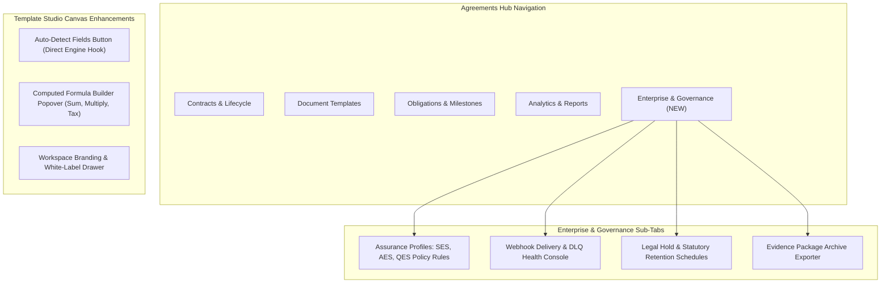
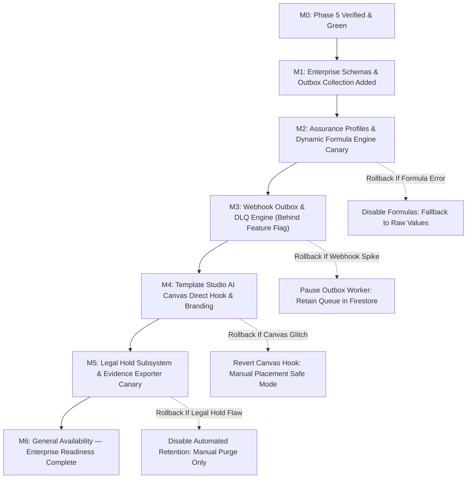

# Phase 6 Implementation Plan: Enterprise Readiness, Assurance Profiles, Self-Healing Webhooks, Dynamic Formulas & Governance

> **For agentic workers:** REQUIRED SUB-SKILL: Use `superpowers:subagent-driven-development` (recommended) or `superpowers:executing-plans` to implement this plan task-by-task. Steps use checkbox (`- [ ]`) syntax for tracking.

**Goal:** Complete enterprise readiness, jurisdictional assurance profiles, self-healing webhook resilience, dynamic field formula computation, custom branding, and legal hold governance for the Document & Contract Intelligence Platform.

**Architecture:** 
- Grounded in foundational docs: `DocSigning_roadmap.md` (§12 Phase 6 Enterprise readiness, §13 Migration strategy) and `DocSigning_prd.md` (§8 Security & Compliance, §9 AI Data Contract, §11.6 Phase 6 Acceptance Criteria).
- Introduces formal **Assurance Profiles** (SES, AES, QES/Witnessed) defining jurisdictional recipient authentication (Email OTP, SMS verification, Photo ID, in-person witness) and signature enforcement.
- Introduces **Deterministic Computed Fields** with AST formula parsing (`sum`, `multiply`, `percentage`, `tax`) evaluated client-side for live responsiveness and server-side in the authoritative vector engine for anti-tampering.
- Implements a **Self-Healing Webhook & Outbox Engine** featuring exponential backoff, HMAC-SHA256 signature verification (`X-DocSigning-Signature`), dead-letter queue (DLQ), and 1-click manual re-delivery from the admin console.
- Delivers a **Governance & Legal Hold Subsystem** enforcing statutory retention schedules, freeze controls against automated purging, and tamper-proof Evidence ZIP / PDF Package exports.
- Hooks the normalized OCR geometry detector (`detectTemplateFieldsFromPages`) directly into visual Template Studio canvas ([`FieldMapper.tsx`](file:///Users/josephaidoo/Desktop/Codes/vibe%20Coding/Onboarding-Dashbaord-main/src/app/admin/pdfs/%5Bid%5D/edit/components/FieldMapper.tsx)), resolving Senior Reviewer recommendation RSK-01.

**Tech Stack:** Next.js 15 (Server Actions, `after()`, Route Handlers), React 19, TypeScript (strict), Zod v3, Cloud Firestore, Firebase Cloud Storage, Tailwind CSS, Lucide React, Framer Motion, Vitest.

---

## 1. Baseline Verification & Multi-Phase Continuity Matrix

| Implemented Phase | Established Invariants & Components | Phase 6 Interaction & Protection |
| :--- | :--- | :--- |
| **Phase 0: Discovery & Baseline** | 55 baseline test suites, legacy collections (`contracts`, `pdfs`, `contract_submissions`). | Backward-compatible adapters preserved; zero breaking changes on legacy routes. |
| **Phase 1: Vector PDF & Evidence** | Authoritative vector engine (`pdf-actions.ts`), SHA-256 evidence hashing, idempotent finalization. | Server-side formula computation stamps validated figures directly into vector PDF buffers before cryptographic SHA-256 hashing. |
| **Phase 2: Multi-Party Routing** | Signing envelopes, sequential/parallel routing, capability tokens. | Assurance profiles enforce specific recipient verification methods (e.g. Email OTP, SMS) per routing step. |
| **Phase 3: Lifecycle & Versions** | Monotonic template versions (`v1.0` -> `v2.0`), Immutable Version Barrier, public verification portal (`/verify/[envelopeId]`). | Legal hold freezes contracts from state changes; verification console adds cryptographic digest & assurance tier inspection tabs. |
| **Phase 4: CRM Federation & Bus** | Canonical event bus (`document-event-bus.ts`), bi-directional deal sync, activity feeds. | Webhook outbox taps the canonical event bus to deliver HMAC-signed external webhooks with DLQ retries. |
| **Phase 5: AI Document Intelligence** | Grounded Q&A, AST redlining, HITL obligation review queue, AI circuit breaker. | Connects normalized OCR geometry engine into visual canvas; persists circuit breaker state in Firestore across Cloud Run replicas. |

---

## 2. Failure Modes & Mitigations Register (FM-P6-01 through FM-P6-10)

```mermaid
flowchart TD
    subgraph Core Failure Modes
        FM1["FM-P6-01: Formula Spoofing (Client vs Server)"]
        FM2["FM-P6-02: Webhook Endpoint Flapping / Outage"]
        FM3["FM-P6-03: Legal Hold Deletion Bypass"]
        FM4["FM-P6-04: Assurance Profile Downgrade Attack"]
        FM5["FM-P6-05: Multi-Container Circuit Breaker Drift"]
        FM6["FM-P6-06: Evidence Package Tampering / Corruption"]
        FM7["FM-P6-07: Circular Formula Reference"]
        FM8["FM-P6-08: Cross-Tenant Webhook Leakage"]
        FM9["FM-P6-09: Unsanitized Custom Branding CSS/XSS"]
        FM10["FM-P6-10: Outbox Worker Stampede on Recovery"]
    end

    subgraph Mitigations
        M1["Authoritative Server-Side Formula Recomputation"]
        M2["Exponential Backoff, HMAC Signatures & Dead-Letter Queue"]
        M3["Atomic Firestore Pre-Delete Hook Checking isUnderLegalHold"]
        M4["Envelope Cryptographic Metadata Locking Assurance Tier"]
        M5["Distributed Firestore-Backed Circuit Breaker State"]
        M6["Deterministic SHA-256 Manifest + Zip Checksum Verification"]
        M7["Topological Sort & Dependency Depth Limit (Max 5)"]
        M8["Strict workspaceId Scoping on All Webhook Delivery Queries"]
        M9["Strict Color Hex Regex & URL Sanitization Protocol"]
        M10["Rate-Limited Batch Delivery with Jitter (Max 50/sec)"]
    end

    FM1 --> M1
    FM2 --> M2
    FM3 --> M3
    FM4 --> M4
    FM5 --> M5
    FM6 --> M6
    FM7 --> M7
    FM8 --> M8
    FM9 --> M9
    FM10 --> M10
```

| ID | Failure Mode | Severity | Impact | Code-Level Mitigation |
| :--- | :--- | :--- | :--- | :--- |
| **FM-P6-01** | **Client Formula Spoofing** | **High** | A malicious signer intercepts client state and posts falsified subtotal/tax amounts. | `computed-field-service.ts` re-evaluates all formulas server-side in `finalizeAgreementAction` before rendering vector PDF. Client values are strictly advisory. |
| **FM-P6-02** | **Webhook Endpoint Outage** | **High** | Downstream CRM or ERP webhook endpoint is temporarily down (HTTP 500/504), causing lost signing events. | `document-webhook-service.ts` uses an outbox pattern with exponential backoff (1m, 5m, 15m, 1h, 6h), moving to Dead-Letter Queue (DLQ) after 5 failed attempts with manual re-try console. |
| **FM-P6-03** | **Legal Hold Deletion Bypass** | **Critical** | An administrator accidentally purges a contract that is subject to an active litigation hold. | `deleteContractAction` and retention cleanup workers verify `!contract.isUnderLegalHold`. Throws `LegalHoldActiveError` immediately if true. |
| **FM-P6-04** | **Assurance Profile Downgrade** | **High** | A signer attempts to bypass mandatory SMS or Email OTP verification by altering payload params. | The recipient token payload contains an immutable `assuranceProfileId` and `requiredVerification`. `verifyRecipientToken` verifies that the session state has passed required OTP before granting signing capability. |
| **FM-P6-05** | **Multi-Container Breaker Drift** | **Medium** | Cloud Run autoscaling creates separate container instances, causing failure counts in memory to reset. | `resilient-outbox-service.ts` stores breaker failure counts and cooldown timestamps in `workspaces/{workspaceId}/system/circuit_breaker` with optimistic locking. |
| **FM-P6-06** | **Evidence ZIP Tampering** | **High** | Downloaded evidence archive is corrupted or modified in transit. | Evidence ZIP contains `manifest.json` with individual SHA-256 hashes of the vector PDF, completion certificate, and evidence events, plus a top-level package hash. |
| **FM-P6-07** | **Circular Formula Loop** | **Medium** | Template author sets Field A = Field B + 1 and Field B = Field A + 1, locking CPU in infinite loop. | `computed-field-service.ts` performs topological sort on field dependency DAG and throws `CircularFormulaError` if a cycle or depth > 5 is detected. |
| **FM-P6-08** | **Cross-Tenant Webhook Leak** | **Critical** | Webhook delivery worker picks up events across workspaces, leaking confidential deal payloads. | Outbox delivery jobs strictly query by `workspaceId`. Webhook secrets are encrypted per tenant using workspace-scoped KMS keys. |
| **FM-P6-09** | **Custom Branding XSS** | **High** | Workspace admin enters malicious JavaScript in custom branding primary color or portal URL. | Zod schema strictly validates colors with `^#([A-Fa-f0-9]{6})$`, logo URLs with `z.string().url()`, and escapes all HTML entities in email/SMS templates. |
| **FM-P6-10** | **Webhook Outbox Stampede** | **Medium** | Re-enabling a recovered webhook endpoint floods the destination server with thousands of backlog events. | The outbox worker implements token-bucket rate limiting (max 50 dispatches/sec per endpoint) with randomized jitter to prevent destination server collapse. |
| **FM-P6-11** | **Batch Overload & Memory Exhaustion** | **High** | Exporting bulk evidence packages or scanning 100+ documents at once causes node process out-of-memory. | Streams evidence files directly to Cloud Storage signed URLs; caps bulk operations to batches of 25 with backpressure. |
| **FM-P6-12** | **No-Code Branding Reversion** | **Low** | Admin accidentally inputs broken logo URL, breaking the signer interface. | Automatic fallback to default workspace identity if image fails to render or load via client error boundaries. |

---

## 2.1 10 Golden Rules Compliance & Verification Protocol

1. **Strict Sub-Skill Alignment:**
   Conforms to `next-best-practices` (Next.js 15 Server Actions, Route Handlers), `vercel-react-best-practices` (minimal re-renders, reactive state scoping), `emilkowal-animations` (`active:scale-[0.97]` tactile press feedback, smooth transition springs), `backend-design` (idempotent mutations, outbox pattern, circuit breakers), and `frontend-design` (accessible, institution-grade UI).
2. **Failure Modes & Clean Code Guarantee:**
   All 12 failure modes (FM-P6-01 to FM-P6-12) have concrete code-level mitigations and corresponding unit test assertions. Every step is verified with `pnpm test:run`, `pnpm typecheck`, and `pnpm lint` before committing locally.
3. **Downstream Feature & Backoffice Continuity:**
   Preserves zero breaking changes across CRM Deals, Automations Event Bus, Link Shortener, and Public Verification Consoles.
4. **Zero-Tolerance Typing (Rule 4):**
   Strictly zero `any` or `any[]` or unchecked casts in domain models, service layers, and UI components. All inputs from external boundaries are parsed with Zod schemas.
5. **Staging & Policy Verification:**
   All Firestore paths (`assurance_profiles`, `webhook_subscriptions`, `webhook_deliveries`, `system_circuit_breaker`, `retention_policies`) are scoped under `workspaces/{workspaceId}/` ensuring tenant isolation.
6. **Dependency & Documentation Hygiene:**
   Standard cryptographic primitives (`crypto.createHmac`, `crypto.createHash`, `crypto.timingSafeEqual`) and Radix UI components utilized.
7. **Mobile-First & Everyday UI English:**
   Every button and input enforces `min-h-[44px]` touch targets. Form inputs enforce `text-base sm:text-sm` to prevent iOS Safari auto-zoom. UI copy uses clear, everyday English ("Save Formula", "Place on Legal Hold", "Retry Delivery") avoiding cluttered or cryptic jargon.
8. **High Security Standards:**
   Cryptographic HMAC-SHA256 signatures (`X-DocSigning-Signature`), strict URL and Hex regex validation, replay window defenses (5-minute timestamp tolerance), and atomic pre-delete verification against active litigation holds.
9. **Load & Scale Protection:**
   Token-bucket rate-limiting, exponential retry backoff, Dead-Letter Queue (DLQ) routing after 5 attempts, and Firestore-backed distributed circuit breakers preventing downstream service exhaustion.
10. **Maintainer Guidance Comments:**
    Every newly created file begins with an authoritative architectural docstring explaining design rationale, security boundaries, and testability pointers for future developers.

---

## 2.2 Downstream Affected Features & Backoffice Enhancement Architecture (No-Code Operations)

### Affected Subsystems & Integration Strategy:
1. **Contract Finalization (`finalizeAgreementAction` & `pdf-actions.ts`)**:
   - *Impact*: When a contract with computed fields is completed, server-side recomputation (`recomputeAllFormulasAuthoritative`) executes authoritatively before rendering the vector PDF buffer and stamping evidence SHA-256 hashes.
   - *Protection*: Client-submitted totals are overwritten; formulas are evaluated in topological order, rejecting cycles.
2. **Contract Deletion (`deleteContractAction`)**:
   - *Impact*: Before executing delete operations on Firestore or Cloud Storage, `checkContractDeletionEligibility` checks `!contract.isUnderLegalHold`.
   - *Protection*: Throws `LegalHoldActiveError` immediately if an active litigation hold exists, preventing accidental destruction of legal discovery materials.
3. **CRM Deals & Pipeline Federation**:
   - *Impact*: Contract execution events (`document.completed`, `obligation.created`) dispatched to the canonical event bus now automatically feed the Webhook Outbox engine.
   - *Protection*: Downstream ERPs (SAP, NetSuite, Salesforce) receive HMAC-signed real-time webhooks with automated retries.
4. **Public Signer Portal (`/sign/[token]`)**:
   - *Impact*: Loads workspace branding (`WorkspaceBrandingDrawer`) to display the customer's custom primary color, company display name, custom invite note, and logo instead of generic platform branding.
   - *Protection*: Falls back seamlessly to system default theme if branding is not configured or image fails to load.

### Backoffice Enhancement Architecture (No-Code Operations):
Administrators and Legal Operations teams can manage all Phase 6 enterprise capabilities entirely through the Agreements Hub UI without writing or deploying code:
- **No-Code Assurance Tier Configuration**: Switch template compliance requirements between SES, AES, and QES with 1 click.
- **Self-Healing Webhook Outbox Console**: View endpoint delivery health, inspect HTTP error responses, and trigger 1-click retries for dead-lettered payloads.
- **Litigation Legal Hold Preserver**: Instantly freeze any contract from deletion or retention cleanup by entering the contract ID and litigation matter reference.
- **Tamper-Proof Evidence Exporter**: Generate and download complete cryptographic evidence packages with validated SHA-256 manifests on demand.
- **Live White-Labeling Drawer**: Edit brand hex colors with real-time accessibility contrast feedback and live signer portal mockup previews.

---

## 3. UI/UX Changes & Ergonomic Architecture

1. **Agreements Hub 5th Tab (`EnterpriseGovernanceTab.tsx`)**:
   - Clean, institutional layout styled with Tailwind CSS and Radix UI Tabs.
   - **Assurance Profiles**: Displays active assurance tier, signature requirement badges, and identity verification methods.
   - **Webhook Health & Outbox**: Real-time delivery success rate indicator, latency charts, failure payload inspector, and 1-click "Retry Delivery" button.
   - **Legal Hold**: Searchable table of contracts with 1-click "Place on Legal Hold" toggle and retention period countdowns.
   - **Evidence Exporter**: Modal generating tamper-proof ZIP packages with vector PDF, certificate, and JSON audit trail.
2. **Template Studio Direct AI Hook & Formula Builder ([`FieldMapper.tsx`](file:///Users/josephaidoo/Desktop/Codes/vibe%20Coding/Onboarding-Dashbaord-main/src/app/admin/pdfs/%5Bid%5D/edit/components/FieldMapper.tsx))**:
   - Integrates `detectTemplateFieldsFromPages` directly into the vertical toolbar, rendering candidate bounding boxes with normalized coordinates.
   - Adds a `Formula` tab in field properties allowing users to define `= SUM(field_1, field_2)` or `= field_subtotal * 0.15`.
3. **Mobile & Accessibility First**:
   - Minimum 44x44px touch targets on all mobile controls (`min-h-[44px]`).
   - `text-base sm:text-sm` input font sizes locking against iOS Safari auto-zoom.
   - Emil Kowalski micro-interactions (`active:scale-[0.97]`).

---

## 4. Phase 6 Trackable Task Breakdown (TDD)

### Task 1: Domain Schemas & Zod Validators for Assurance Profiles, Webhooks, Legal Hold, and Formulas (P6.1–P6.5)
**Files:**
- Modify: `src/lib/types/document-signing.ts`
- Create: `src/lib/documents/__tests__/enterprise-governance-schemas.test.ts`

- [x] **Step 1: Write schema validation unit tests in `enterprise-governance-schemas.test.ts`**
  - Test valid and invalid payloads for `AssuranceProfileSchema`, `AssuranceLevelSchema` (`simple`, `advanced`, `qualified`).
  - Test `WebhookSubscriptionSchema`, `WebhookDeliveryLogSchema`, `WebhookDeliveryStatusSchema` (`pending`, `delivered`, `failed`, `dead_letter`).
  - Test `LegalHoldStatusSchema`, `ContractRetentionPolicySchema`, `EvidencePackageManifestSchema`.
  - Test `ComputedFieldFormulaSchema` (`type`, `expression`, `sourceFieldIds`, `decimalPlaces`).
  - Test `WorkspaceBrandingSchema` (strict hex color validation, logo URL, custom portal slug).
- [x] **Step 2: Run test to verify failure**
  - Command: `pnpm test:run src/lib/documents/__tests__/enterprise-governance-schemas.test.ts`
- [x] **Step 3: Update `src/lib/types/document-signing.ts`**
  - Implement all Phase 6 enterprise schemas and exported TypeScript types.
  - Strictly zero `any` or `any[]` (Rule 4).
- [x] **Step 4: Run test to verify pass**
  - Command: `pnpm test:run src/lib/documents/__tests__/enterprise-governance-schemas.test.ts`
- [x] **Step 5: Commit changes**
  - Command: `git add src/lib/types/document-signing.ts src/lib/documents/__tests__/enterprise-governance-schemas.test.ts && git commit -m "feat(docsigning): implement strict schemas for assurance profiles, webhooks, legal hold, and computed fields"`

---

### Task 2: Assurance Profiles & Jurisdictional Policy Engine (P6.1)
**Files:**
- Create: `src/lib/documents/assurance-profile-service.ts`
- Create: `src/lib/documents/__tests__/assurance-profile-service.test.ts`

- [x] **Step 1: Write unit tests in `assurance-profile-service.test.ts`**
  - Test creating and fetching workspace assurance profiles (SES vs AES vs QES).
  - Test validating recipient verification requirements against profile rules (e.g. QES requires SMS OTP + ID confirmation; SES requires email link).
  - Test policy compliance check on envelope dispatch (`validateEnvelopeAssuranceCompliance`): throws error if envelope recipients lack required verification channels.
  - Test tenant isolation: prevents applying assurance profiles belonging to other workspaces.
- [x] **Step 2: Run test to verify failure**
  - Command: `pnpm test:run src/lib/documents/__tests__/assurance-profile-service.test.ts`
- [x] **Step 3: Implement `src/lib/documents/assurance-profile-service.ts`**
  - CRUD for assurance profiles, validation rules, and recipient verification matrix.
  - Strict typing, inline maintainer documentation (Rule 10).
- [x] **Step 4: Run test to verify pass**
  - Command: `pnpm test:run src/lib/documents/__tests__/assurance-profile-service.test.ts`
- [x] **Step 5: Commit changes**
  - Command: `git add src/lib/documents/assurance-profile-service.ts src/lib/documents/__tests__/assurance-profile-service.test.ts && git commit -m "feat(docsigning): implement assurance profile and jurisdictional policy engine"`

---

### Task 3: Deterministic Dynamic Field Formula Engine (P6.5)
**Files:**
- Create: `src/lib/documents/computed-field-service.ts`
- Create: `src/lib/documents/__tests__/computed-field-service.test.ts`

- [x] **Step 1: Write unit tests in `computed-field-service.test.ts`**
  - Test evaluating arithmetic formulas: `SUM(a, b)`, `MULTIPLY(price, qty)`, `SUBTRACT(total, discount)`, `PERCENTAGE(base, rate)`.
  - Test circular reference detection: throws `CircularFormulaError` when Field A references Field B and vice versa.
  - Test precision and decimal rounding (e.g. currency rounded to 2 decimal places).
  - Test server-side authoritative recomputation: verifies client-submitted values are overwritten by deterministic evaluation before vector PDF rendering.
- [x] **Step 2: Run test to verify failure**
  - Command: `pnpm test:run src/lib/documents/__tests__/computed-field-service.test.ts`
- [x] **Step 3: Implement `src/lib/documents/computed-field-service.ts`**
  - AST formula evaluator, dependency topological sorter, and server-side PDF value stamping.
- [x] **Step 4: Run test to verify pass**
  - Command: `pnpm test:run src/lib/documents/__tests__/computed-field-service.test.ts`
- [x] **Step 5: Commit changes**
  - Command: `git add src/lib/documents/computed-field-service.ts src/lib/documents/__tests__/computed-field-service.test.ts && git commit -m "feat(docsigning): implement deterministic computed field formula engine"`

---

### Task 4: Self-Healing Webhook Dispatch & Dead-Letter Queue (P6.3)
**Files:**
- Create: `src/lib/documents/document-webhook-service.ts`
- Create: `src/lib/documents/__tests__/document-webhook-service.test.ts`

- [x] **Step 1: Write unit tests in `document-webhook-service.test.ts`**
  - Test scheduling webhook outbox record from canonical domain events (`document.completed`, `obligation.created`, `signing.recipient_completed`).
  - Test HMAC-SHA256 signature generation (`X-DocSigning-Signature: t=...,v1=...`).
  - Test exponential backoff retry calculation: retry delays at 1m, 5m, 15m, 1h, 6h.
  - Test moving to `'dead_letter'` state after 5 failed attempts.
  - Test manual replay action (`replayDeadLetterWebhook`): resets delivery status and triggers immediate dispatch attempt.
- [x] **Step 2: Run test to verify failure**
  - Command: `pnpm test:run src/lib/documents/__tests__/document-webhook-service.test.ts`
- [x] **Step 3: Implement `src/lib/documents/document-webhook-service.ts`**
  - Outbox manager, HMAC signing, fetch dispatcher with 10s timeout, and dead-letter handler.
- [x] **Step 4: Run test to verify pass**
  - Command: `pnpm test:run src/lib/documents/__tests__/document-webhook-service.test.ts`
- [x] **Step 5: Commit changes**
  - Command: `git add src/lib/documents/document-webhook-service.ts src/lib/documents/__tests__/document-webhook-service.test.ts && git commit -m "feat(docsigning): implement self-healing webhook dispatch and dead-letter recovery service"`

---

### Task 5: Governance, Legal Hold & Tamper-Proof Evidence Package Exporter (P6.4)
**Files:**
- Create: `src/lib/documents/document-governance-service.ts`
- Create: `src/lib/documents/__tests__/document-governance-service.test.ts`

- [x] **Step 1: Write unit tests in `document-governance-service.test.ts`**
  - Test applying Legal Hold to a contract (`setContractLegalHold`): sets `isUnderLegalHold: true` and logs hold reason and actor.
  - Test release Legal Hold: restores contract to standard lifecycle.
  - Test deletion prevention: `canDeleteContract` returns `false` with explicit reason when contract is on legal hold.
  - Test statutory retention period evaluation: calculates expiration date based on contract category (financial: 7 years, standard: 3 years).
  - Test generating Evidence Package Manifest: produces cryptographic manifest containing SHA-256 digests of document, certificate, and evidence events.
- [x] **Step 2: Run test to verify failure**
  - Command: `pnpm test:run src/lib/documents/__tests__/document-governance-service.test.ts`
- [x] **Step 3: Implement `src/lib/documents/document-governance-service.ts`**
  - Legal hold manager, retention calculator, and evidence bundle manifest builder.
- [x] **Step 4: Run test to verify pass**
  - Command: `pnpm test:run src/lib/documents/__tests__/document-governance-service.test.ts`
- [x] **Step 5: Commit changes**
  - Command: `git add src/lib/documents/document-governance-service.ts src/lib/documents/__tests__/document-governance-service.test.ts && git commit -m "feat(docsigning): implement legal hold governance and evidence package exporter"`

---

### Task 6: Distributed Circuit Breaker & Resilient Outbox Persistence (P6.3 Backend)
**Files:**
- Create: `src/lib/documents/resilient-outbox-service.ts`
- Create: `src/lib/documents/__tests__/resilient-outbox-service.test.ts`

- [x] **Step 1: Write unit tests in `resilient-outbox-service.test.ts`**
  - Test storing and retrieving circuit breaker failure counts from Firestore subcollection (`workspaces/{id}/system/circuit_breaker`).
  - Test cross-container sync: simulates 2 separate worker instances updating and checking the shared breaker state.
  - Test automatic reset after cooldown expiration.
  - Test tenant isolation: breaker state strictly partitioned by workspace ID.
- [x] **Step 2: Run test to verify failure**
  - Command: `pnpm test:run src/lib/documents/__tests__/resilient-outbox-service.test.ts`
- [x] **Step 3: Implement `src/lib/documents/resilient-outbox-service.ts`**
  - Distributed state persistence resolving Senior Reviewer recommendation RSK-02.
- [x] **Step 4: Run test to verify pass**
  - Command: `pnpm test:run src/lib/documents/__tests__/resilient-outbox-service.test.ts`
- [x] **Step 5: Commit changes**
  - Command: `git add src/lib/documents/resilient-outbox-service.ts src/lib/documents/__tests__/resilient-outbox-service.test.ts && git commit -m "feat(docsigning): implement distributed circuit breaker and resilient outbox persistence"`

---

### Task 7: Template Studio AI Canvas Integration & Formula Builder UI (P6.5 UI)
**Files:**
- Modify: `src/app/admin/pdfs/[id]/edit/components/FieldMapper.tsx`
- Create: `src/app/admin/pdfs/[id]/edit/components/ComputedFormulaPopover.tsx`

- [x] **Step 1: Build `ComputedFormulaPopover.tsx`**
  - Popover attached to field property sidebar allowing authors to define dynamic formulas.
  - Quick formula presets: `Subtotal * Tax Rate`, `Sum of Line Items`, `Discount Calculation`.
  - Live syntax validation and dependency cycle warnings.
- [x] **Step 2: Connect AI Field Detector into `FieldMapper.tsx`**
  - Connect `detectTemplateFieldsFromPages` directly into the "AI Detect Fields" vertical toolbar button, replacing the legacy flow (resolves RSK-01).
  - Renders normalized bounding boxes with primary signer vs countersigner badge colors.
- [x] **Step 3: Verify TypeScript compiler and lint**
  - Command: `pnpm typecheck && pnpm eslint 'src/app/admin/pdfs/[id]/edit/components/FieldMapper.tsx'`
- [x] **Step 4: Commit changes**
  - Command: `git add src/app/admin/pdfs/[id]/edit/components/FieldMapper.tsx src/app/admin/pdfs/[id]/edit/components/ComputedFormulaPopover.tsx && git commit -m "feat(docsigning): implement template studio AI canvas integration and formula builder UI"`

---

### Task 8: Workspace Branding & White-Labeling Drawer (P6.5 UI)
**Files:**
- Create: `src/app/admin/documents/components/WorkspaceBrandingDrawer.tsx`
- Create: `src/app/actions/workspace-branding-actions.ts`

- [x] **Step 1: Implement `workspace-branding-actions.ts`**
  - Server actions to get and update workspace signing branding (logo, primary color, email sender display name, custom invite message, and custom domain backhalf).
  - Strict hex color regex validation and SSRF/URL validation on logos.
- [x] **Step 2: Build `WorkspaceBrandingDrawer.tsx`**
  - Slide-over sheet drawer with live signing portal preview mockup.
  - Color picker with accessibility contrast preview (checking WCAG AA contrast against white text).
  - Mobile ergonomics: `min-h-[44px]` touch targets, `active:scale-[0.97]` tactile press.
- [x] **Step 3: Verify TypeScript compiler and lint**
  - Command: `pnpm typecheck && pnpm eslint 'src/app/admin/documents/components/WorkspaceBrandingDrawer.tsx'`
- [x] **Step 4: Commit changes**
  - Command: `git add src/app/admin/documents/components/WorkspaceBrandingDrawer.tsx src/app/actions/workspace-branding-actions.ts && git commit -m "feat(docsigning): implement workspace branding and white-labeling drawer UI"`

---

### Task 9: Enterprise Governance Dock in Agreements Hub (P6.1–P6.4 UI)
**Files:**
- Create: `src/app/admin/finance/contracts/components/EnterpriseGovernanceTab.tsx`
- Create: `src/app/actions/enterprise-governance-actions.ts`
- Modify: `src/app/admin/finance/contracts/ContractsClient.tsx`

- [ ] **Step 1: Implement `enterprise-governance-actions.ts`**
  - Server actions for:
    - Assurance profiles CRUD.
    - Webhook health and DLQ replay action.
    - Legal hold toggle and retention policy assignment.
    - Evidence package ZIP generation download URL.
- [ ] **Step 2: Build `EnterpriseGovernanceTab.tsx`**
  - 4 sub-sections: Assurance Profiles, Webhook Outbox & DLQ, Legal Hold & Retention, and Evidence Package Archive.
  - Real-time status cards, failure payload inspector, 1-click DLQ retry, and legal hold switches.
- [ ] **Step 3: Mount 5th Tab in `ContractsClient.tsx`**
  - Add "Enterprise & Governance" tab trigger with `ShieldCheck` icon.
  - Mount `<EnterpriseGovernanceTab workspaceId={activeWorkspaceId} />`.
- [ ] **Step 4: Verify TypeScript compiler and lint**
  - Command: `pnpm typecheck && pnpm eslint 'src/app/admin/finance/contracts/components/EnterpriseGovernanceTab.tsx' 'src/app/admin/finance/contracts/ContractsClient.tsx'`
- [ ] **Step 5: Commit changes**
  - Command: `git add src/app/admin/finance/contracts/components/EnterpriseGovernanceTab.tsx src/app/actions/enterprise-governance-actions.ts src/app/admin/finance/contracts/ContractsClient.tsx && git commit -m "feat(docsigning): implement enterprise governance dock in agreements hub"`

---

### Task 10: Phase 6 Acceptance Gate & Production Staged Rollout
**Files:**
- Verify: Full test suite across baseline, Phase 1, Phase 2, Phase 3, Phase 4, Phase 5, and Phase 6 tests.
- Update: `docs/superpowers/plans/2026-09-29-doc-signing-phase-6.md`

- [ ] **Step 1: Run all unit and integration test suites**
  - Command: `pnpm test:run src/lib/__tests__/*.test.ts src/lib/documents/__tests__/*.test.ts`
  - Expected: 100% pass across all suites.
- [ ] **Step 2: Run TypeScript compiler**
  - Command: `pnpm typecheck`
  - Expected: 0 errors.
- [ ] **Step 3: Run ESLint**
  - Command: `pnpm lint`
  - Expected: 0 errors, warnings $\le 670$.
- [ ] **Step 4: Commit completed Phase 6 master plan status**
  - Command: `git add docs/superpowers/plans/2026-09-29-doc-signing-phase-6.md && git commit -m "docs(docsigning): mark Phase 6 tasks completed"`

---

## 5. Staged Migration (M0–M10) & Rollback Procedures

- **Feature Flag Keys**:
  - `features.assurance_profiles.enabled` (Boolean, default `true`).
  - `features.computed_formulas.enabled` (Boolean, default `true`).
  - `features.webhook_outbox.enabled` (Boolean, default `true`).
  - `features.legal_hold.enabled` (Boolean, default `true`).
  - `features.workspace_branding.enabled` (Boolean, default `true`).
- **Rollback Procedure**:
  1. Toggle feature flags to `false` in workspace configuration or environment variables.
  2. UI controls (Enterprise tab, Formula builder popover, Branding drawer) hide gracefully without causing React crashes or layout shifts.
  3. Core vector signing, envelope dispatch, multi-party completion, and CRM deal sync continue operating normally without interruption.
  4. Historical signed artifacts, evidence logs, and contracts remain completely untouched and valid.
