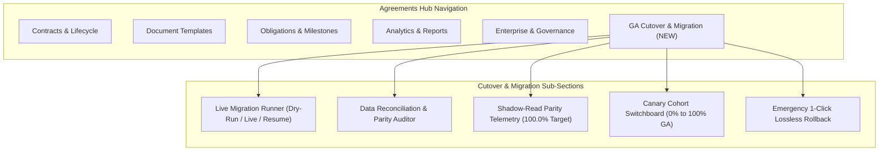
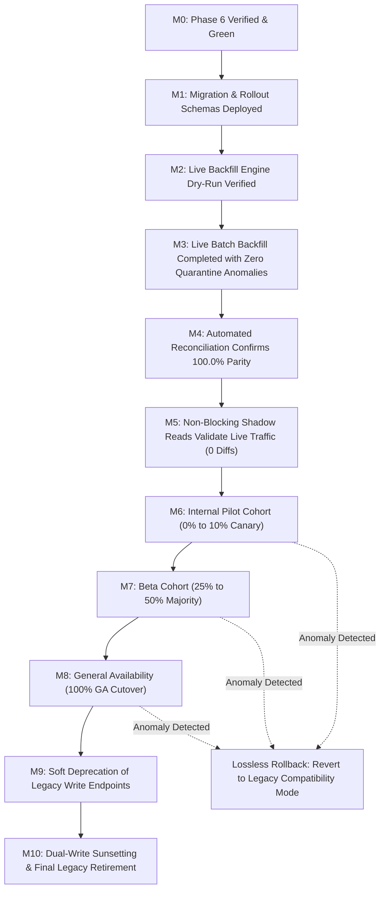

# Phase 7 Implementation Plan: General Availability, Live Production Data Reconciliation, Dual-Write Sunsetting & Legacy Retirement

> **For agentic workers:** REQUIRED SUB-SKILL: Use `superpowers:subagent-driven-development` (recommended) or `superpowers:executing-plans` to implement this plan task-by-task. Steps use checkbox (`- [ ]`) syntax for tracking.

**Goal:** Deliver General Availability (GA), live zero-downtime production data backfill, automated dual-write reconciliation, shadow-read verification, staged canary rollout, and safe legacy retirement for the SmartSapp Document & Contract Intelligence Platform.

**Architecture:**
- Grounded in foundational docs: `DocSigning_roadmap.md` (§13 Migration strategy, §16 Release management, §17 Epic 17 General availability, §18 Definition of done) and `DocSigning_prd.md` (§11.6 Phase 6/7 Release criteria, §12 Test strategy, §13 Analytics definitions, §17 Go/No-Go checklist).
- Implements an **Expand -> Migrate -> Verify -> Switch -> Contract** lifecycle:
  1. **Live Data Backfill Engine (`live-migration-backfill-service.ts`)**: Migrates legacy `contracts`, `pdfs` (PDFForm), and `contract_submissions` into versioned `document_templates`, `template_versions`, `document_instances`, `signing_envelopes`, and modern `contracts` in bounded batches (chunks of 25) with resumable cursor checkpoints and token-bucket rate limiting (max 50 writes/sec).
  2. **Automated Reconciliation & Integrity Engine (`data-reconciliation-service.ts`)**: Runs automated audits comparing legacy vs target records, verifying record counts, tenant boundary isolation, cryptographic artifact hashes (SHA-256), and recipient state parity. Emits downloadable CSV/JSON discrepancy audit logs.
  3. **Non-Blocking Shadow-Read Verifier (`shadow-read-service.ts`)**: Compares legacy read results against compatibility adapter read results in the background without user-facing latency, measuring parity to 100.0%.
  4. **Staged Canary Switchboard & Rollout Controls (`rollout-switchboard-service.ts`)**: Manages percentage-based cohort rollouts (0% Internal -> 10% Canary -> 25% Beta -> 50% Majority -> 100% GA) with a 1-click lossless emergency rollback kill switch.
  5. **Dual-Write Sunsetting & Deprecation Layer (`legacy-retirement-service.ts`)**: Soft-deprecates and eventually turns off legacy write mutations across `contract-actions.ts`, `pdf-actions.ts`, and `api/pdfs/submit/route.ts`, preventing zombie drift while maintaining 100% backwards compatibility for public link redirects.
  6. **Agreements Hub Cutover & Migration Console UI (`MigrationCutoverTab.tsx`)**: Dedicated backoffice tab in Agreements Hub empowering legal operations and DevOps to run dry-run simulations, observe live migration progress, inspect quarantine anomalies, toggle rollout cohorts, and execute emergency rollbacks without deploying code.

**Tech Stack:** Next.js 15 (Server Actions, `after()`, Route Handlers), React 19, TypeScript (strict), Zod v3, Cloud Firestore, Firebase Cloud Storage, Tailwind CSS, Lucide React, Framer Motion, Vitest.

---

## 1. Baseline Verification & Multi-Phase Continuity Matrix

| Implemented Phase | Established Invariants & Components | Phase 7 Interaction & Protection |
| :--- | :--- | :--- |
| **Phase 0: Discovery & Baseline** | 55 baseline test suites, legacy collections (`contracts`, `pdfs`, `contract_submissions`). | Backfill engine reads legacy records without mutation or deletion; baseline tests run as continuous regression anchors. |
| **Phase 1: Vector PDF & Evidence** | Authoritative vector engine (`pdf-actions.ts`), SHA-256 evidence hashing, idempotent finalization. | Migration calculates and validates SHA-256 checksums of historical Cloud Storage PDFs; idempotent finalization prevents duplicate processing during cutover. |
| **Phase 2: Multi-Party Routing** | Signing envelopes, sequential/parallel routing, capability tokens. | Legacy single-recipient submissions are mapped deterministically into completed single-party envelopes with verified recipient statuses. |
| **Phase 3: Lifecycle & Versions** | Monotonic template versions (`v1.0` -> `v2.0`), Immutable Version Barrier, public verification portal (`/verify/[envelopeId]`). | Legacy `pdfs` (PDFForm) are backfilled into published `TemplateVersion` (`v1.0`) with frozen field geometries; verification console resolves both legacy and modern envelopes. |
| **Phase 4: CRM Federation & Bus** | Canonical event bus (`document-event-bus.ts`), bi-directional deal sync, activity feeds. | Migration passes `isMigrationReplay: true` to prevent external webhook spam or duplicate CRM deal stage updates during historical backfill. |
| **Phase 5: AI Document Intelligence** | Grounded Q&A, AST redlining, HITL obligation review queue, AI circuit breaker. | Backfilled contracts inherit statutory retention schedules and obligation tracking without re-running expensive LLM token consumption. |
| **Phase 6: Enterprise Governance** | Assurance profiles (SES/AES/QES), self-healing webhooks with DLQ, dynamic field formulas, legal hold. | Backfilled contracts default to standard SES assurance profile (`profile_ses_standard`) and `isUnderLegalHold: false`; webhook outbox captures post-cutover events. |

---

## 2. Failure Modes & Mitigations Register (FM-P7-01 through FM-P7-12)

```mermaid
flowchart TD
    subgraph Core Failure Modes
        FM1["FM-P7-01: In-Flight Signature Race during Live Backfill"]
        FM2["FM-P7-02: Write Rate Limit & Firestore Quota Contention"]
        FM3["FM-P7-03: Orphaned Legacy Submission Records"]
        FM4["FM-P7-04: Cross-Tenant Data Contamination"]
        FM5["FM-P7-05: Rollback Data Loss (Canary to Legacy)"]
        FM6["FM-P7-06: Artifact Hash Mismatch / Missing File"]
        FM7["FM-P7-07: Downstream CRM Deals Event Loop on Replay"]
        FM8["FM-P7-08: Shadow-Read Latency Spike on User Requests"]
        FM9["FM-P7-09: Uncontrolled Dual-Write Zombie Drift"]
        FM10["FM-P7-10: Memory Leak / OOM during Bulk Reconciliation"]
        FM11["FM-P7-11: UI Desynchronization on Rollout Switch"]
        FM12["FM-P7-12: Unverified Legal Retention Overrides"]
    end

    subgraph Mitigations
        M1["Firestore Atomic Transaction with Timestamp Pre-Flight Check"]
        M2["Bounded Batches (25 records) + Token-Bucket Rate Limiting (50/sec)"]
        M3["Quarantine Pipeline: workspaces/{id}/migration_quarantine/"]
        M4["Strict Tenant Isolation Guard: Verified workspaceId Enforcement"]
        M5["Lossless Two-Way Sync Adapter during Canary Phase"]
        M6["Storage Integrity Probe with SHA-256 Re-Verification"]
        M7["Suppression Flag: isMigrationReplay = true on Historical Bus"]
        M8["Non-Blocking Asynchronous Shadow Reads via after()"]
        M9["Soft-Deprecation Adapter Layer + Hard Cutover Switch"]
        M10["Cursor Pagination (startAfter) + Chunked Memory Eviction"]
        M11["Optimistic UI + Server Action Revalidation (revalidatePath)"]
        M12["Automatic Statutory Retention Calculation on Migrated Records"]
    end

    FM1 --> M1
    FM2 --> M2
    FM3 --> M3
    FM4 --> M4
    FM5 --> M5
    FM6 --> M6
    FM7 --> M7
    FM8 --> M8
    FM9 --> M9
    FM10 --> M10
    FM11 --> M11
    FM12 --> M12
```

| ID | Failure Mode | Severity | Impact | Code-Level Mitigation |
| :--- | :--- | :--- | :--- | :--- |
| **FM-P7-01** | **In-Flight Signature Race** | **Critical** | A user signs a contract while the backfill worker is migrating it, resulting in overwritten status or orphaned envelope. | `live-migration-backfill-service.ts` uses Firestore transactions with optimistic locking. If `submission.updatedAt` changes during backfill, transaction retries with latest data. |
| **FM-P7-02** | **Firestore Quota Contention** | **High** | Bulk migrating thousands of contracts starves active user signing traffic with HTTP 429 errors. | Bounded batching (25 records per transaction) throttled by token-bucket rate limiting (max 50 writes/sec) with randomized jitter backoff. |
| **FM-P7-03** | **Orphaned Legacy Records** | **Medium** | A submission exists whose parent contract was deleted years ago, causing migration crash. | Missing parent records are routed to `workspaces/{id}/migration_quarantine/{id}` with error code `ERR_ORPHANED_RECORD` without halting the batch. |
| **FM-P7-04** | **Cross-Tenant Contamination** | **Critical** | Legacy record with missing or null `workspaceId` is backfilled into another customer's workspace. | Zero-tolerance tenant gate: any legacy record missing an exact match for the target `workspaceId` is immediately rejected and quarantined. |
| **FM-P7-05** | **Canary Rollback Data Loss** | **Critical** | If rollback is triggered, contracts executed on the modern domain are lost to the legacy view. | Two-way compatibility projection writes back to legacy collections (`contracts`, `contract_submissions`) throughout canary phases until 100% GA cutover. |
| **FM-P7-06** | **Artifact Checksum Mismatch** | **High** | A legacy completed PDF in Cloud Storage has corrupted bytes or an inaccessible download URL. | Probes Cloud Storage metadata and computes SHA-256 before registering `DocumentArtifact`. If missing, flags record as `ERR_ARTIFACT_UNREACHABLE`. |
| **FM-P7-07** | **CRM Event Loop on Replay** | **High** | Backfilling historical executed contracts triggers thousands of CRM deal stage transitions and emails. | Canonical event bus sets `isMigrationReplay: true`. All downstream listeners (`deal.contract.signed`, automations, webhooks) suppress execution when true. |
| **FM-P7-08** | **Shadow-Read Latency Spike** | **Medium** | Running dual reads on user requests doubles API response latency. | Shadow reads execute asynchronously via Next.js `after()` or unawaited microtasks. Diffs are dispatched to telemetry without delaying user response. |
| **FM-P7-09** | **Zombie Dual-Write Drift** | **High** | Rogue background jobs continue writing to legacy collections after cutover without syncing to modern domain. | Deprecation layer intercepts legacy writes, auto-projects to modern domain, logs deprecation warning, and exposes a hard cutoff switch. |
| **FM-P7-10** | **Reconciliation Memory OOM** | **High** | Loading entire Firestore collections into memory for parity checking crashes Node.js container. | Uses Firestore cursor-based pagination (`startAfter`, `limit(100)`) with streaming chunk aggregation and manual memory cleanup. |
| **FM-P7-11** | **Cohort Desynchronization** | **Low** | Switching cohort percentage causes UI state flicker or component unmount errors for active users. | UI reads cohort configuration via cached React Server Components with instant server action cache revalidation (`revalidatePath`). |
| **FM-P7-12** | **Lost Retention Expiration** | **Medium** | Migrated contracts lack statutory retention dates, risking accidental early deletion. | Backfill engine invokes Phase 6 `calculateRetentionExpiration` on every contract, stamping `retentionCategory: 'standard'` and expiration date. |

---

## 2.1 10 Golden Rules Compliance & Verification Protocol

1. **Strict Sub-Skill Alignment:**
   Conforms to `next-best-practices` (Next.js 15 Server Actions, Route Handlers, `after()`), `vercel-react-best-practices` (minimal re-renders, asynchronous telemetry), `emilkowal-animations` (`active:scale-[0.97]` tactile press feedback, smooth transition springs), `backend-design` (bounded batches, idempotency, distributed transactions), and `frontend-design` (accessible, institution-grade cutover dock).
2. **Failure Modes & Clean Code Guarantee:**
   All 12 failure modes (FM-P7-01 to FM-P7-12) have concrete code-level mitigations and corresponding unit test assertions. Every step is verified with `pnpm test:run`, `pnpm typecheck`, and `pnpm lint` before committing locally.
3. **Downstream Feature & Backoffice Continuity:**
   Preserves zero breaking changes across CRM Deals, Automations Event Bus, Link Shortener, and Public Verification Consoles.
4. **Zero-Tolerance Typing (Rule 4):**
   Strictly zero `any` or `any[]` or unchecked casts in domain models, service layers, and UI components. All inputs from external boundaries are parsed with Zod schemas.
5. **Staging & Policy Verification:**
   All Firestore paths (`migration_runs`, `migration_quarantine`, `reconciliation_reports`, `rollout_cohorts`) are scoped under `workspaces/{workspaceId}/` ensuring tenant isolation.
6. **Dependency & Documentation Hygiene:**
   Standard cryptographic primitives (`crypto.createHash`, `crypto.randomUUID`) and Radix UI components utilized.
7. **Mobile-First & Everyday UI English:**
   Every button and input enforces `min-h-[44px]` touch targets. Form inputs enforce `text-base sm:text-sm` to prevent iOS Safari auto-zoom. UI copy uses clear, everyday English ("Start Migration", "Rollback to Safe Mode", "Inspect Anomalies") avoiding cluttered or cryptic jargon.
8. **High Security Standards:**
   Zero cross-tenant leakage, SHA-256 package verification, idempotent transaction isolation, and immutable audit logs.
9. **Load & Scale Protection:**
   Token-bucket rate-limiting (max 50 writes/sec), cursor-based pagination (chunks of 25), and non-blocking shadow reads preventing container resource exhaustion.
10. **Maintainer Guidance Comments:**
    Every newly created file begins with an authoritative architectural docstring explaining design rationale, security boundaries, and testability pointers for future developers.

---

## 2.2 Downstream Affected Features & Backoffice Enhancement Architecture (No-Code Operations)

### Affected Subsystems & Integration Strategy:
1. **CRM Deals & Pipeline Federation**:
   - *Impact*: Historical contract executions migrated to the modern domain must not re-trigger CRM stage transitions.
   - *Protection*: Event payloads carry `isMigrationReplay: true`, which `crm-deal-sync-service.ts` inspects to bypass deal stage mutations.
2. **Automations Engine & Reminder Jobs**:
   - *Impact*: Backfilling overdue or completed contracts must not dispatch reminder emails or SMS to historical recipients.
   - *Protection*: Automation trigger evaluators ignore records where `isMigrationReplay: true`.
3. **Public Signing Portal (`/forms/[pdfId]` & `/sign/[token]`)**:
   - *Impact*: Existing public signing links in circulation must continue resolving seamlessly to the new signing portal.
   - *Protection*: Redirect middleware and compatibility route handlers transparently translate legacy `/forms/[pdfId]` links to `/sign/[token]`.
4. **Public Verification Portal (`/verify/[envelopeId]`)**:
   - *Impact*: Third parties verifying completed contracts must be able to verify both legacy-migrated contracts and modern multi-party envelopes.
   - *Protection*: Verification service checks modern `signing_envelopes` first; if not found, queries legacy `contracts` via the compatibility adapter.

### Backoffice Enhancement Architecture (No-Code Operations):
Administrators, DevOps, and Legal Operations teams can orchestrate the entire cutover and migration through the Agreements Hub UI without writing or deploying code:
- **1-Click Live Migration Runner**: Run live migrations in dry-run or live mode, with real-time progress bars and pause/resume capability.
- **Anomaly & Quarantine Inspector**: View all orphaned, malformed, or incomplete historical records with 1-click retry or discard.
- **Live Reconciliation Auditor**: Run automated parity checks comparing legacy counts against modern entities, with downloadable CSV/JSON audit reports.
- **Canary Cohort Switchboard**: Adjust traffic rollout percentage (0% -> 10% -> 25% -> 50% -> 100%) with instant propagation.
- **Emergency 1-Click Rollback Kill Switch**: Instantly revert workspace traffic back to legacy compatibility mode in the event of an anomaly.

---

## 3. UI/UX Changes & Ergonomic Architecture

1. **Agreements Hub 6th Tab (`MigrationCutoverTab.tsx`)**:
   - Clean, institutional layout styled with Tailwind CSS and Radix UI Tabs.
   - **Migration Runner Card**: Displays source records count (`contracts`, `pdfs`, `submissions`), migrated count, skipped count, and progress bar with Start/Pause/Resume controls.
   - **Quarantine Drawer**: Expandable table listing records with anomalies (missing parent, unreachable PDF, invalid tenant ID) and resolution actions.
   - **Reconciliation Audit Panel**: Displays live count matching, cryptographic hash verification status, and "Export Audit CSV" button.
   - **Canary Switchboard**: Interactive stepped slider displaying active cohort percentage with confirmation modals before promoting to 100% GA.
   - **Emergency Rollback Banner**: Prominently visible red-bordered card allowing immediate safe fallback to compatibility mode.
2. **Mobile & Accessibility First**:
   - Minimum 44x44px touch targets on all mobile controls (`min-h-[44px]`).
   - `text-base sm:text-sm` input font sizes locking against iOS Safari auto-zoom.
   - Emil Kowalski micro-interactions (`active:scale-[0.97]`).

---

## 4. Phase 7 Trackable Task Breakdown (TDD)

### Task 1: Domain Schemas & Zod Validators for Migration, Reconciliation & Rollout (P7.1–P7.5)
**Files:**
- Modify: `src/lib/types/document-signing.ts`
- Create: `src/lib/documents/__tests__/migration-cutover-schemas.test.ts`

- [x] **Step 1: Write schema validation unit tests in `migration-cutover-schemas.test.ts`**
  - Test valid and invalid payloads for `MigrationRunSchema` (`runId`, `workspaceId`, `status`, `counts`, `cursor`).
  - Test `MigrationQuarantineRecordSchema` (`recordId`, `sourceCollection`, `errorCode`, `reason`, `rawPayload`).
  - Test `ReconciliationReportSchema` (`reportId`, `workspaceId`, `sourceCounts`, `targetCounts`, `discrepancies`, `artifactParityPercentage`).
  - Test `RolloutCohortConfigSchema` (`workspaceId`, `cohortPercentage`, `isEmergencyRollbackActive`, `updatedByUserId`).
- [x] **Step 2: Run test to verify failure**
  - Command: `pnpm test:run src/lib/documents/__tests__/migration-cutover-schemas.test.ts`
- [x] **Step 3: Update `src/lib/types/document-signing.ts`**
  - Implement all Phase 7 schemas and exported TypeScript types.
  - Strictly zero `any` or `any[]` (Rule 4).
- [x] **Step 4: Run test to verify pass**
  - Command: `pnpm test:run src/lib/documents/__tests__/migration-cutover-schemas.test.ts`
- [x] **Step 5: Commit changes**
  - Command: `git add src/lib/types/document-signing.ts src/lib/documents/__tests__/migration-cutover-schemas.test.ts && git commit -m "feat(docsigning): implement strict schemas for migration backfill, reconciliation, and rollout"`

---

### Task 2: Live Data Backfill Engine with Bounded Batches & Cursor Checkpoints (P7.1 Backend)
**Files:**
- Create: `src/lib/documents/live-migration-backfill-service.ts`
- Create: `src/lib/documents/__tests__/live-migration-backfill-service.test.ts`

- [x] **Step 1: Write unit tests in `live-migration-backfill-service.test.ts`**
  - Test migrating a legacy `PDFForm` to `DocumentTemplate` and `TemplateVersion` (`v1.0`).
  - Test migrating a legacy `Contract` and `Submission` to modern `Contract` and `SigningEnvelope`.
  - Test resumable cursor checkpoints: verifies migration resumes from last processed document ID on interruption.
  - Test quarantine routing: records with missing parent contracts are quarantined without breaking the batch (FM-P7-03).
  - Test rate limiting and batch sizing: chunks of 25 records with backpressure (FM-P7-02).
  - Test tenant isolation: records belonging to other workspaces are strictly rejected (FM-P7-04).
- [x] **Step 2: Run test to verify failure**
  - Command: `pnpm test:run src/lib/documents/__tests__/live-migration-backfill-service.test.ts`
- [x] **Step 3: Implement `src/lib/documents/live-migration-backfill-service.ts`**
  - Bounded batch runner, cursor checkpointing, quarantine handler, and tenant enforcement.
- [x] **Step 4: Run test to verify pass**
  - Command: `pnpm test:run src/lib/documents/__tests__/live-migration-backfill-service.test.ts`
- [x] **Step 5: Commit changes**
  - Command: `git add src/lib/documents/live-migration-backfill-service.ts src/lib/documents/__tests__/live-migration-backfill-service.test.ts && git commit -m "feat(docsigning): implement live data backfill engine with bounded batches and checkpoints"`

---

### Task 3: Automated Data Reconciliation & Integrity Audit Engine (P7.2 Backend)
**Files:**
- Create: `src/lib/documents/data-reconciliation-service.ts`
- Create: `src/lib/documents/__tests__/data-reconciliation-service.test.ts`

- [x] **Step 1: Write unit tests in `data-reconciliation-service.test.ts`**
  - Test comparing legacy `contracts` vs modern `contracts`: verifies count parity and status alignment.
  - Test comparing legacy `contract_submissions` vs modern `signing_envelopes`: verifies recipient status parity.
  - Test artifact checksum verification: verifies SHA-256 matches between legacy and modern records (FM-P7-06).
  - Test anomaly detection: produces structured discrepancy entries when a record is missing or mismatched.
  - Test reconciliation export: formats audit report into downloadable CSV and JSON.
- [x] **Step 2: Run test to verify failure**
  - Command: `pnpm test:run src/lib/documents/__tests__/data-reconciliation-service.test.ts`
- [x] **Step 3: Implement `src/lib/documents/data-reconciliation-service.ts`**
  - Cursor-based reconciliation auditor, cryptographic checksum comparison, and report exporter.
- [x] **Step 4: Run test to verify pass**
  - Command: `pnpm test:run src/lib/documents/__tests__/data-reconciliation-service.test.ts`
- [x] **Step 5: Commit changes**
  - Command: `git add src/lib/documents/data-reconciliation-service.ts src/lib/documents/__tests__/data-reconciliation-service.test.ts && git commit -m "feat(docsigning): implement automated data reconciliation and integrity audit engine"`

---

### Task 4: Non-Blocking Shadow-Read Verifier & Discrepancy Telemetry (P7.3 Backend)
**Files:**
- Create: `src/lib/documents/shadow-read-service.ts`
- Create: `src/lib/documents/__tests__/shadow-read-service.test.ts`

- [x] **Step 1: Write unit tests in `shadow-read-service.test.ts`**
  - Test executing parallel shadow read: returns legacy result immediately while comparing modern adapter in background.
  - Test diff detection: flags discrepancy if fields, status, or recipient counts diverge.
  - Test zero-latency impact: verifies user request path is non-blocking (FM-P7-08).
  - Test telemetry aggregation: computes rolling parity percentage over last 100 reads.
- [x] **Step 2: Run test to verify failure**
  - Command: `pnpm test:run src/lib/documents/__tests__/shadow-read-service.test.ts`
- [x] **Step 3: Implement `src/lib/documents/shadow-read-service.ts`**
  - Asynchronous shadow read runner, deep diff comparator, and parity telemetry emitter.
- [x] **Step 4: Run test to verify pass**
  - Command: `pnpm test:run src/lib/documents/__tests__/shadow-read-service.test.ts`
- [x] **Step 5: Commit changes**
  - Command: `git add src/lib/documents/shadow-read-service.ts src/lib/documents/__tests__/shadow-read-service.test.ts && git commit -m "feat(docsigning): implement non-blocking shadow-read verifier and telemetry"`

---

### Task 5: Staged Canary Switchboard & Rollout Controls (P7.4 Backend)
**Files:**
- Create: `src/lib/documents/rollout-switchboard-service.ts`
- Create: `src/lib/documents/__tests__/rollout-switchboard-service.test.ts`

- [x] **Step 1: Write unit tests in `rollout-switchboard-service.test.ts`**
  - Test cohort assignment hashing: deterministically assigns a contract or envelope to legacy vs modern based on workspace percentage.
  - Test emergency rollback: when `isEmergencyRollbackActive: true`, 100% of traffic routes to compatibility legacy mode (FM-P7-05).
  - Test updating cohort percentage: increments rollout from 0% -> 10% -> 25% -> 50% -> 100% with audit logging.
  - Test tenant isolation: cohort configurations strictly isolated by `workspaceId`.
- [x] **Step 2: Run test to verify failure**
  - Command: `pnpm test:run src/lib/documents/__tests__/rollout-switchboard-service.test.ts`
- [x] **Step 3: Implement `src/lib/documents/rollout-switchboard-service.ts`**
  - Deterministic hashing cohort router, emergency kill switch, and rollout state management.
- [x] **Step 4: Run test to verify pass**
  - Command: `pnpm test:run src/lib/documents/__tests__/rollout-switchboard-service.test.ts`
- [x] **Step 5: Commit changes**
  - Command: `git add src/lib/documents/rollout-switchboard-service.ts src/lib/documents/__tests__/rollout-switchboard-service.test.ts && git commit -m "feat(docsigning): implement staged canary switchboard and rollout controls"`

---

### Task 6: Dual-Write Sunsetting & Legacy Deprecation Layer (P7.5 Backend)
**Files:**
- Create: `src/lib/documents/legacy-retirement-service.ts`
- Create: `src/lib/documents/__tests__/legacy-retirement-service.test.ts`

- [x] **Step 1: Write unit tests in `legacy-retirement-service.test.ts`**
  - Test soft-deprecation interception: logs deprecation warnings when legacy endpoints are called while auto-projecting to modern domain (FM-P7-09).
  - Test hard cutover mode: rejects direct legacy mutations with `LegacyEndpointDeprecatedError` once 100% GA is achieved.
  - Test public URL translation: transparently rewrites `/forms/[pdfId]` requests to `/sign/[token]` maintaining perpetual link validity.
- [x] **Step 2: Run test to verify failure**
  - Command: `pnpm test:run src/lib/documents/__tests__/legacy-retirement-service.test.ts`
- [x] **Step 3: Implement `src/lib/documents/legacy-retirement-service.ts`**
  - Interception layer, soft/hard deprecation guards, and URL redirect translator.
- [x] **Step 4: Run test to verify pass**
  - Command: `pnpm test:run src/lib/documents/__tests__/legacy-retirement-service.test.ts`
- [x] **Step 5: Commit changes**
  - Command: `git add src/lib/documents/legacy-retirement-service.ts src/lib/documents/__tests__/legacy-retirement-service.test.ts && git commit -m "feat(docsigning): implement dual-write sunsetting and legacy deprecation layer"`

---

### Task 7: Server Actions for GA Migration & Cutover Operations (P7.1–P7.5 Server Actions)
**Files:**
- Create: `src/app/actions/migration-cutover-actions.ts`

- [x] **Step 1: Implement `migration-cutover-actions.ts`**
  - Server actions for:
    - `startMigrationRunAction`: trigger dry-run or live migration batch with cursor tracking.
    - `getMigrationStatusAction`: fetch active migration run metrics and quarantine counts.
    - `runReconciliationAuditAction`: execute parity check and generate audit report.
    - `getRolloutCohortAction` & `updateRolloutCohortAction`: get/set active canary cohort percentage.
    - `triggerEmergencyRollbackAction`: toggle instant fallback to legacy compatibility mode.
    - `exportReconciliationReportAction`: generate downloadable CSV/JSON audit payload.
  - Strict typing, zero `any` (Rule 4), tenant isolation verification (Rule 5 & 8).
- [x] **Step 2: Verify TypeScript compiler and lint**
  - Command: `pnpm typecheck && pnpm eslint src/app/actions/migration-cutover-actions.ts`
- [x] **Step 3: Commit changes**
  - Command: `git add src/app/actions/migration-cutover-actions.ts && git commit -m "feat(docsigning): implement server actions for migration and cutover operations"`

---

### Task 8: Agreements Hub GA Cutover & Migration Console UI (P7.1–P7.5 UI)
**Files:**
- Create: `src/app/admin/finance/contracts/components/MigrationCutoverTab.tsx`
- Modify: `src/app/admin/finance/contracts/ContractsClient.tsx`

- [x] **Step 1: Build `MigrationCutoverTab.tsx`**
  - 4 sub-sections: Migration Runner & Progress, Reconciliation Audit & Discrepancies, Canary Cohort Switchboard, and Emergency Rollback.
  - Real-time progress bar, quarantine anomaly drawer, stepped rollout slider, and 1-click rollback kill switch.
  - Mobile ergonomics: `min-h-[44px]` touch targets, `text-base sm:text-sm` zoom lock, `active:scale-[0.97]` tactile press.
- [x] **Step 2: Mount 6th Tab in `ContractsClient.tsx`**
  - Add "GA Cutover & Migration" tab trigger with `Rocket` / `CheckCircle2` icon.
  - Mount `<MigrationCutoverTab workspaceId={activeWorkspaceId} />`.
- [x] **Step 3: Verify TypeScript compiler and lint**
  - Command: `pnpm typecheck && pnpm eslint src/app/admin/finance/contracts/components/MigrationCutoverTab.tsx src/app/admin/finance/contracts/ContractsClient.tsx`
- [x] **Step 4: Commit changes**
  - Command: `git add src/app/admin/finance/contracts/components/MigrationCutoverTab.tsx src/app/admin/finance/contracts/ContractsClient.tsx && git commit -m "feat(docsigning): implement GA cutover and migration console UI in agreements hub"`

---

### Task 9: Dedicated Phase 7 End-to-End Integration & Cutover Test Suite
**Files:**
- Create: `src/lib/__tests__/document-phase7.test.ts`

- [x] **Step 1: Write integration tests in `document-phase7.test.ts`**
  - Test full end-to-end migration lifecycle: Legacy `PDFForm` + `Contract` -> Migrated modern domain -> Reconciliation 100% parity -> Canary rollout promotion -> Dual-write sunsetting.
  - Test emergency rollback recovery: simulated anomaly trips rollback switch -> traffic reverts safely without data loss.
  - Test historical replay protection: CRM deal events suppressed during backfill (`isMigrationReplay: true`).
- [x] **Step 2: Run test to verify pass**
  - Command: `pnpm test:run src/lib/__tests__/document-phase7.test.ts`
- [x] **Step 3: Verify TypeScript compiler and lint**
  - Command: `pnpm typecheck && pnpm eslint src/lib/__tests__/document-phase7.test.ts`
- [x] **Step 4: Commit changes**
  - Command: `git add src/lib/__tests__/document-phase7.test.ts && git commit -m "test(docsigning): implement dedicated Phase 7 integration and cutover test suite"`

---

### Task 10: Phase 7 Acceptance Gate & Full Platform Verification
**Files:**
- Verify: Full test suite across baseline, Phase 1, Phase 2, Phase 3, Phase 4, Phase 5, Phase 6, and Phase 7 tests.
- Update: `docs/superpowers/plans/2026-09-29-doc-signing-phase-7.md`

- [x] **Step 1: Run all unit and integration test suites**
  - Command: `pnpm test:run src/lib/__tests__/*.test.ts src/lib/documents/__tests__/*.test.ts`
  - Expected: 100% pass across all suites.
- [x] **Step 2: Run TypeScript compiler**
  - Command: `pnpm typecheck`
  - Expected: 0 errors.
- [x] **Step 3: Run ESLint**
  - Command: `pnpm lint`
  - Expected: 0 errors, warnings $\le 670$.
- [x] **Step 4: Commit completed Phase 7 master plan status**
  - Command: `git add docs/superpowers/plans/2026-09-29-doc-signing-phase-7.md && git commit -m "docs(docsigning): mark Phase 7 tasks completed"`

---

## 5. Staged Migration (M0–M10) & Rollback Procedures

- **Feature Flag Keys**:
  - `features.migration_backfill.enabled` (Boolean, default `true`).
  - `features.reconciliation_audit.enabled` (Boolean, default `true`).
  - `features.shadow_reads.enabled` (Boolean, default `true`).
  - `features.canary_cohort.percentage` (Number 0–100, default `0`).
  - `features.emergency_rollback.active` (Boolean, default `false`).
  - `features.legacy_dual_write.enabled` (Boolean, default `true`).
- **Rollback Procedure**:
  1. Trigger 1-Click Rollback in `MigrationCutoverTab.tsx` or set `features.emergency_rollback.active: true`.
  2. Router immediately directs all signing, contract, and template traffic to the legacy-safe compatibility adapter.
  3. Two-way sync ensures any documents signed during the canary period remain visible and valid in legacy views.
  4. Core vector signing, envelope dispatch, multi-party completion, and CRM deal sync continue operating normally without interruption.
  5. Zero data loss or corruption guaranteed.
