# Phase 8 Master Implementation Plan: Advanced Cross-Platform Mobile Signing Experience, Offline Biometric Captures, Embedded Partner SDK & Developer Webhooks / REST API Platform

> **For agentic workers:** REQUIRED SUB-SKILL: Use `superpowers:subagent-driven-development` (recommended) or `superpowers:executing-plans` to implement this plan task-by-task. Steps use checkbox (`- [ ]`) syntax for tracking.

**Goal:** Deliver an institutional-grade external Developer Platform, Scoped REST API, Embedded Partner Signing SDK with secure postMessage handshake, and an Offline PWA Signing Engine with biometric stroke evidence capture and conflict-resilient background sync for the SmartSapp Document & Contract Intelligence Platform.

**Architecture:**
- Grounded in foundational docs: `DocSigning_prd.md` (§6 API & Event Design, §6.6 Webhooks, §7.2 Developer Tools, §7.3 Responsive & Mobile Signing, §8.2 Security & Token Controls, §8.3 Evidence & Integrity) and `DocSigning_roadmap.md` (§8.1 Domain Boundaries, §14 Architecture Guardrails, §18 Definition of Done).
- Architectural Pillars:
  1. **Scoped API Key Auth & Timing-Safe Verification (`api-key-auth-service.ts`)**: Generates cryptographically secure API keys (`sapp_live_...` / `sapp_test_...`), stores SHA-256 hashed digests with prefix indexing, verifies requests using constant-time `crypto.timingSafeEqual`, and enforces granular scopes (`envelopes:create`, `envelopes:read`, `envelopes:void`, `templates:read`, `webhooks:manage`).
  2. **Token-Bucket Rate Limiter & Abuse Guard (`api-rate-limiter-service.ts`)**: Protects public APIs and vector PDF pipelines from exhaustion using sliding-window token buckets per API key and client IP, returning standard HTTP 429 with `Retry-After` and `X-RateLimit-*` headers.
  3. **Public Developer REST API Handlers (`/api/v1/envelopes`, `/api/v1/templates`)**: Standard RESTful endpoints accepting idempotency keys, validating payloads with runtime Zod schemas, returning structured `{ data, meta }` and `{ error }` envelopes, and filtering PII.
  4. **Embedded Partner Signing SDK & Secure Iframe Host (`embedded-signing-service.ts`, `/embed/sign/[token]`)**: Provides a zero-chrome embedded signing host with origin whitelisting (`Content-Security-Policy: frame-ancestors`), cryptographic session token exchange, bidirectional postMessage event protocol (`PARENT_READY`, `EMBED_LOADED`, `RECIPIENT_SIGNED`, `RECIPIENT_DECLINED`, `RESIZE_REQUEST`), and debounced auto-height resizing.
  5. **Offline PWA Signing Engine & IndexedDB Evidence Sync Queue (`offline-signing-service.ts`)**: Enables field signers with intermittent connectivity to sign offline, capturing biometric stroke vectors (x, y, timestamp, pressure, velocity), packaging offline cryptographic device fingerprints, and safely replaying queued submissions via an idempotent sync protocol with server-side conflict quarantine (`offline_sync_conflicts`).
  6. **Agreements Hub Developer Platform & Embedded SDK Console UI (`DeveloperPlatformTab.tsx`)**: 7th Tab in Agreements Hub featuring API key management with 1-time secret copy modals, allowed origin whitelist editor, interactive live iframe testbed with real-time postMessage event stream viewer, webhook delivery simulator, and offline sync queue health monitor.

**Tech Stack:** Next.js 15 (Route Handlers, Server Actions, `next/headers`), React 19, TypeScript (strict), Zod v3, Cloud Firestore, Firebase Cloud Storage, Tailwind CSS, Lucide React, Framer Motion, Vitest.

---

## 1. 10 Important Rules Invariant Compliance Protocol

### Rule 1: Strict Sub-Skill Alignment & Code Conformance
- **`next-best-practices`**: Implements Next.js 15 Route Handlers (`NextRequest`, `NextResponse`), Server Actions with `await requireWorkspace(workspaceId)`, and dynamic header extraction via `next/headers`. Client components strictly avoid direct database access.
- **`vercel-react-best-practices`**: Zero waterfall data fetching, server-side data preparation, memoized coordinate geometry transformations, and debounced `ResizeObserver` callbacks to avoid client main-thread congestion.
- **`emilkowal-animations`**: Tactile micro-interactions (`active:scale-[0.97]` on all buttons), 200ms ease-out transitions (`transition-all duration-200 ease-out`), smooth dialog enter transitions (never scaling from 0), and reduced-motion fallbacks (`motion-reduce:transform-none`).
- **`backend-design`**: Sliding-window token-bucket rate limiting, constant-time authentication verification, atomic distributed transactions with retry backoff, and durable dead-letter conflict isolation.
- **`frontend-design`**: Distinctive, institution-grade developer dock in Agreements Hub with syntax-highlighted curl examples, clean scope chip groups, real-time postMessage stream loggers, and zero generic "AI slop" styling.

### Rule 2: Failure Modes, Testability & Scalable Refactoring
- All 15 identified failure modes (FM-P8-01 through FM-P8-15) have concrete code-level mitigations and corresponding unit test assertions.
- Code is modularized into testable, single-responsibility services (`api-key-auth-service.ts`, `api-rate-limiter-service.ts`, `embedded-signing-service.ts`, `offline-signing-service.ts`).
- Verification commands (`pnpm test:run`, `pnpm typecheck`, `pnpm lint`) are executed at each step before committing locally.

### Rule 3: Downstream Features Affected & Backoffice Enhancement Architecture
- **Preserved Existing Features**: CRM deal stage sync (`crm-deal-sync-service.ts`), outbox reminders (`signing-reminder-service.ts`), public verification portal (`/verify/[envelopeId]`), template studio versioning, and link shortener continue operating without interruption.
- **No-Code Backoffice Operations**: Legal ops and developer platform administrators can manage all aspects of API keys, iframe domain whitelists, webhook replay simulations, and offline sync conflicts directly within Agreements Hub without deploying code or touching database records.

### Rule 4: Zero-Tolerance Typing (Zero `any` or `any[]`)
- Strictly zero `any`, `any[]`, or unchecked casts in domain models, service layers, route handlers, and UI components.
- External inputs (`req.json()`, `postMessage` payloads, IndexedDB blobs) enter as `unknown` and are immediately narrowed using strict Zod schemas before reaching business logic.

### Rule 5: Staging, Rules & Governance Verification
- Firestore collections (`api_keys`, `developer_webhooks`, `offline_sync_queue`, `offline_sync_conflicts`) are strictly scoped under `workspaces/{workspaceId}/`.
- Security rules enforce that client SDKs cannot read secret hashes or mutate API keys directly; all key operations route through authenticated Server Actions.
- Changes are verified against local emulators and test suites prior to production cutover.

### Rule 6: Dependency & Context7 MCP Documentation Protocol
- Uses native Node.js `crypto` primitives (`crypto.timingSafeEqual`, `crypto.createHmac`, `crypto.randomBytes`) and standard repository packages (`zod`, `lucide-react`, `framer-motion`).
- When external framework conventions (Next.js 15 headers, route handler signatures) are updated, Context7 MCP is leveraged for canonical documentation.

### Rule 7: Mobile-First Ergonomics & Everyday UI English
- All buttons, inputs, and touch targets enforce `min-h-[44px]` height and `min-w-[44px]` width.
- Form inputs enforce `text-base sm:text-sm` (16px on mobile) to eliminate iOS Safari automatic zoom-in behavior.
- UI copy uses clean, concise, everyday English ("Create API Key", "Allowed Sites", "Test Connection", "Pending Sync") without walls of text or cryptic developer jargon.

### Rule 8: High Security Standards & Threat Mitigation
- API key secrets are hashed using SHA-256; only prefixes and hashes are stored.
- Key authentication uses constant-time comparison (`crypto.timingSafeEqual`) to prevent timing side-channel attacks.
- Embedded iframes enforce `Content-Security-Policy: frame-ancestors` and validate `event.origin` against the workspace whitelist.
- Webhook payloads are signed with HMAC SHA-256 headers (`X-Sapp-Signature`) with replay timestamps.

### Rule 9: High Load & Scale Protection
- Sliding-window token-bucket limiter throttles burst requests (standard: 60/min, enterprise: 300/min).
- Maximum envelope creation constraints (max 10 recipients, max 5 documents, max 25MB total payload) prevent vector PDF generator OOM crashes.
- Debounced resize observers (100ms interval + 8px deadband) prevent infinite layout recalculation loops.

### Rule 10: Future Maintainer Guidance Comments
- Every newly created file begins with an authoritative architectural docstring explaining design rationale, security boundaries, and testability pointers for future developers.
- Inline caution markers (`CAUTION: Security-sensitive boundary`, `TESTABILITY: Inject clock for deterministic time assertions`) are strategically placed.

---

## 2. Multi-Phase Continuity Matrix (Phases 0 through 7)

| Implemented Phase | Established Invariants & Components | Phase 8 Interaction & Protection |
| :--- | :--- | :--- |
| **Phase 0: Baseline & Discovery** | 55 baseline test suites, legacy collections, invariant regression anchors. | REST API endpoints route through modern domain services, never bypassing Phase 0 baseline invariants or creating unmigrated legacy drift. |
| **Phase 1: Vector PDF & Evidence** | Authoritative vector renderer (`pdf-actions.ts`), SHA-256 digests, idempotent finalization. | Programmatic envelope creation and offline sync submissions invoke the authoritative vector engine; offline biometric data is hashed and anchored to the evidence ledger. |
| **Phase 2: Multi-Party Routing** | Multi-recipient state machines (`SigningEnvelope`, `EnvelopeRecipient`), capability tokens. | Developer REST API supports full multi-party sequential and parallel recipient specifications (`routingOrder`, `role`, `verificationPolicy`). |
| **Phase 3: Lifecycle & Versions** | Published `TemplateVersion` immutability, CRM variable schemas, `/verify/[envelopeId]`. | Developer REST API `/api/v1/templates` lists published immutable versions; programmatic dispatches bind authorized template versions. |
| **Phase 4: CRM Federation & Bus** | Canonical event bus (`document-event-bus.ts`), deal federation, activity timeline. | Envelopes dispatched via Developer API or completed via Embedded SDK emit canonical events (`envelope.sent`, `recipient.signed`, `envelope.completed`) linking optional `externalReferenceId`. |
| **Phase 5: AI Document Intelligence** | Grounded Q&A, template field detection, AST redlining, HITL obligation review. | Templates with AI-detected fields can be populated and issued via REST API; completed agreements feed into the obligation extraction pipeline. |
| **Phase 6: Enterprise Governance** | Assurance profiles (SES/AES/QES), self-healing webhooks with DLQ, dynamic formulas. | Developer API key operations inherit workspace assurance profiles; developer webhooks leverage the Phase 6 self-healing webhook dispatcher. |
| **Phase 7: GA Cutover & Switchboard** | Live backfill engine, canary switchboard, legacy retirement, perpetual redirect `/forms/[pdfId]`. | All developer endpoints interact exclusively with the modernized GA domain; emergency rollback switch retains global jurisdiction. |

---

## 3. Failure Modes & Mitigations Register (FM-P8-01 through FM-P8-15)

```mermaid
flowchart TD
    subgraph Phase 8 Failure Modes
        FM1["FM-P8-01: Clickjacking & Cross-Origin PostMessage Injection"]
        FM2["FM-P8-02: Offline Biometric Capture Desync & Voided Tokens"]
        FM3["FM-P8-03: API Key Plaintext Exposure & Timing Attacks"]
        FM4["FM-P8-04: API Rate Limit Exhaustion & PDF Vector DOS"]
        FM5["FM-P8-05: Recursive PostMessage Resize Infinite Layout Loops"]
        FM6["FM-P8-06: Cross-Tenant API Key Header Manipulation"]
        FM7["FM-P8-07: Offline Double-Sign Race Condition"]
        FM8["FM-P8-08: Stale Client PWA Cache with Outdated Fields"]
        FM9["FM-P8-09: Unsanitized External Webhook Payloads (SSRF)"]
        FM10["FM-P8-10: Mobile Safari iOS Viewport Auto-Zoom Clutter"]
        FM11["FM-P8-11: Malformed Idempotency Keys in Developer REST API"]
        FM12["FM-P8-12: Scope Escalation to Administrative Operations"]
        FM13["FM-P8-13: Excessive Payload Size Causing Node.js OOM Crash"]
        FM14["FM-P8-14: Stale API Key Revocation Cache Window"]
        FM15["FM-P8-15: Clock Drift between Offline Client and Server"]
    end

    subgraph Mitigations
        M1["CSP frame-ancestors Whitelist + Strict origin PostMessage Check"]
        M2["Cryptographic Offline Token Timestamping + Conflict Quarantine"]
        M3["Prefix Indexing + SHA-256 Digest + crypto.timingSafeEqual"]
        M4["Sliding-Window Token Bucket Limiter + HTTP 429 Headers"]
        M5["Debounced ResizeObserver (100ms) + 8px Threshold Clamping"]
        M6["Server-Side Workspace Scoping Bound to Validated Key Record"]
        M7["Recipient State Atomic Compare-and-Set in Firestore Tx"]
        M8["Cache-First for Static Assets + Network-First for Form Schemas"]
        M9["Strict HTTPS Whitelist + HMAC SHA-256 Payload Signature"]
        M10["Touch Targets >= 44px + text-base sm:text-sm Zoom Lock"]
        M11["Strict UUIDv4/Alphanumeric Idempotency Key Validator Regex"]
        M12["Granular Scope Enforcement: envelopes:create, templates:read"]
        M13["Server-Side Payload Bounding: Max 10 Recipients, 25MB Max Payload"]
        M14["Direct Firestore Document Read on Mutation Boundaries"]
        M15["Cryptographic Device Nonce + Server Replay Time Bounds (Max 7 Days)"]
    end

    FM1 --> M1
    FM2 --> M2
    FM3 --> M3
    FM4 --> M4
    FM5 --> M5
    FM6 --> M6
    FM7 --> M7
    FM8 --> M8
    FM9 --> M9
    FM10 --> M10
    FM11 --> M11
    FM12 --> M12
    FM13 --> M13
    FM14 --> M14
    FM15 --> M15
```

| ID | Failure Mode | Severity | Impact | Code-Level Mitigation |
| :--- | :--- | :--- | :--- | :--- |
| **FM-P8-01** | **Clickjacking & PostMessage Injection** | **Critical** | Attacker embeds `/embed/sign` in an unauthorized iframe or sends spoofed `postMessage` to trigger signing. | Enforce `Content-Security-Policy: frame-ancestors` against workspace `allowedOrigins`. All postMessage handlers check `event.origin === registeredOrigin` and reject wildcard `*`. |
| **FM-P8-02** | **Offline Desync & Voided Tokens** | **High** | Recipient signs offline on a tablet, but envelope was voided or expired before the device reconnects. | Sync engine verifies token status upon replay. If voided or expired during offline period, payload is quarantined to `offline_sync_conflicts` with full audit logs instead of dirty overwrite. |
| **FM-P8-03** | **API Key Plaintext Leak & Timing Attack** | **Critical** | Database dump exposes raw API secrets, or attacker uses character timing differences to guess key. | Keys follow `sapp_live_<prefix8>_<secret32>`. Only SHA-256 hash of secret is persisted. Key verification uses `crypto.timingSafeEqual` over fixed-length buffer digests. |
| **FM-P8-04** | **API Rate Limit Exhaustion / DOS** | **High** | Automated developer script floods `POST /api/v1/envelopes` causing memory spikes in PDF generator. | Sliding-window token bucket limiter (`api-rate-limiter-service.ts`) caps requests at 60/min standard, returning HTTP 429 with `Retry-After` and `X-RateLimit-*` headers. |
| **FM-P8-05** | **Recursive Resize Infinite Loop** | **Medium** | Embedded iframe posts height resize, parent resizes iframe, triggering another resize indefinitely. | Debounce `ResizeObserver` events by 100ms, apply an 8px deadband threshold, and clamp between `minHeight: 500px` and `maxHeight: 2400px` per page. |
| **FM-P8-06** | **Cross-Tenant Key Spoofing** | **Critical** | Developer passes API key from Workspace A but attempts to create envelopes in Workspace B. | API key authentication unconditionally binds `workspaceId` from the cryptographically verified key document in Firestore, ignoring client-supplied workspace query params. |
| **FM-P8-07** | **Offline Double-Sign Race** | **High** | User signs offline on tablet while another party signs or declines online concurrently. | Sync replay uses atomic Firestore transaction (`adminDb.runTransaction`) checking `recipient.status === 'invited' \| 'viewed'`. Fails safely if status has advanced. |
| **FM-P8-08** | **Stale PWA Form Definitions** | **Medium** | Signer caches template offline, but administrator updated template fields before connection dropped. | Template version snapshot SHA-256 is checked before offline render. PWA uses Network-First for field definitions and Cache-First for static font/vector assets. |
| **FM-P8-09** | **Unsanitized Webhook Payloads (SSRF)** | **Medium** | Developer provides malicious webhook URL (SSRF) or receives unauthenticated event payloads. | Webhook URLs must start with `https://` (or `http://localhost` in test mode). Payloads are signed with HMAC SHA-256 using key secret with `X-Sapp-Signature` header. |
| **FM-P8-10** | **Mobile Safari Auto-Zoom** | **Low** | Mobile signers tapping input fields experience abrupt Safari zoom in/out, breaking field coordinates. | Form inputs enforce `text-base sm:text-sm` (16px minimum on mobile), while touch targets enforce `min-h-[44px]` and `active:scale-[0.97]` tactile press feedback. |
| **FM-P8-11** | **Malformed Idempotency Keys** | **Medium** | External clients send random strings or empty headers as idempotency keys, causing collisions. | Validate `Idempotency-Key` header with regex `^[A-Za-z0-9_-]{8,128}$`. Reject non-compliant keys with HTTP 400 Bad Request. |
| **FM-P8-12** | **Scope Escalation** | **Critical** | Read-only API key attempts to dispatch new envelopes or void active contracts. | Authorization middleware checks required scope (e.g. `envelopes:create`) against `apiKey.scopes` array; returns HTTP 403 Forbidden with clear scope denial message. |
| **FM-P8-13** | **Payload Size OOM Crash** | **High** | Client uploads 100MB embedded PDF payload crashing the API route handler. | Enforce 25MB max payload body size, max 10 recipients, and max 5 documents per envelope in Zod validator. |
| **FM-P8-14** | **Stale Key Revocation Window** | **High** | Revoked key continues succeeding in API requests due to in-memory caching. | In-memory key verification cache has maximum 10-second TTL; revocation immediately clears local key cache entry. |
| **FM-P8-15** | **Offline Client Clock Drift** | **Medium** | Signer device has clock set back 2 years, submitting deceptive signature timestamps. | Server records both client `signedAt` and server `syncedAt` in evidence ledger. Rejects packages where client timestamp is > 7 days in the past or > 1 hour in the future. |

---

## 4. Backoffice Enhancement Architecture (No-Code Operations)

The Agreements Hub backoffice dock (`ContractsClient.tsx`) is extended with a dedicated 7th tab: **"Developer Platform & Embedded SDK"** (`DeveloperPlatformTab.tsx`), giving workspace administrators full control over external integrations without writing code:

1. **Scoped API Key Switchboard**:
   - Create new API keys with selectable scopes (`envelopes:create`, `envelopes:read`, `envelopes:void`, `templates:read`, `webhooks:manage`).
   - 1-time secret reveal modal with copy button, visual security warning, and auto-dismissal.
   - 1-click key revocation and key secret rotation.
   - Real-time telemetry: key status (`active` | `revoked`), creation date, expiration, and `lastUsedAt` timestamp.
2. **Embed Origins Whitelist Editor**:
   - Manage permitted parent domain origins (`https://partner.example.com`, `https://app.clientcrm.com`).
   - Dynamic validation preventing wildcards (`*`) or insecure HTTP URLs in production.
   - Instantly propagates to the CSP `frame-ancestors` header on `/embed/sign/[token]`.
3. **Interactive Iframe Sandbox & PostMessage Inspector**:
   - Live embedded signing testbed with customizable sample envelope.
   - Real-time event visualizer showing bidirectional postMessage frames (`PARENT_READY` -> `EMBED_LOADED` -> `RESIZE_REQUEST` -> `RECIPIENT_SIGNED`).
   - Auto-height resize toggle and mobile viewport simulation dock.
4. **Webhook Delivery Simulator**:
   - Send test event payloads (`envelope.sent`, `recipient.signed`, `envelope.completed`) to any destination URL.
   - View live HTTP response codes, latency in milliseconds, and HMAC SHA-256 header preview.
5. **Offline Sync Queue Health Monitor**:
   - Real-time status cards: Pending Sync, Successfully Synced, and Sync Conflicts.
   - 1-click retry for pending offline packages.
   - Conflict resolution modal for inspecting quarantined offline signatures.

---

## 5. Trackable Task Breakdown (Tasks 1 through 10)

### Task 1: Domain Schemas & Zod Validators for Developer Platform, API Keys, Embedded SDK & Offline Biometrics
**Files:**
- Modify: `src/lib/types/document-signing.ts`
- Create: `src/lib/documents/__tests__/developer-platform-schemas.test.ts`

- [ ] **Step 1: Write failing test for developer platform domain schemas**
  - Test Zod validation for:
    - `ApiKeyScopeSchema` (`'envelopes:create' | 'envelopes:read' | 'envelopes:void' | 'templates:read' | 'webhooks:manage'`)
    - `ApiKeyRecordSchema` (id, workspaceId, name, prefix, hashedSecret, scopes, status, rateLimitTier, createdAt, expiresAt, lastUsedAt)
    - `CreateApiKeyRequestSchema` (name, scopes, rateLimitTier, expiresInDays)
    - `EmbedMessageSchema` (discriminated union: `handshake_init`, `handshake_ack`, `recipient_signed`, `recipient_declined`, `resize_request`)
    - `OfflineBiometricStrokeSchema` (points array with x, y, timestamp, pressure, velocity)
    - `OfflineSigningPayloadSchema` (envelopeId, recipientId, signedAt, strokes, deviceFingerprint, documentSha256, nonce)
    - `OfflineSyncRecordSchema` (id, workspaceId, envelopeId, recipientId, status: `pending` | `synced` | `conflict`, payload, error, syncedAt)
    - `RateLimitConfigSchema` (windowMs, maxRequests)

- [ ] **Step 2: Run test to verify it fails**
  - Run: `pnpm test:run src/lib/documents/__tests__/developer-platform-schemas.test.ts`
  - Expected: FAIL with missing exports in `document-signing.ts`.

- [ ] **Step 3: Implement domain schemas in `src/lib/types/document-signing.ts`**
  - Append schemas and export inferred TypeScript types without using `any` or `any[]`.

- [ ] **Step 4: Run test to verify it passes**
  - Run: `pnpm test:run src/lib/documents/__tests__/developer-platform-schemas.test.ts`
  - Expected: PASS (all schema tests green).

- [ ] **Step 5: Commit**
  - `git add src/lib/types/document-signing.ts src/lib/documents/__tests__/developer-platform-schemas.test.ts`
  - `git commit -m "feat(docsigning): implement strict domain schemas for developer platform, api keys, embed sdk, and offline biometrics"`

---

### Task 2: Scoped API Key Authentication & Timing-Safe Verification Engine
**Files:**
- Create: `src/lib/documents/api-key-auth-service.ts`
- Create: `src/lib/documents/__tests__/api-key-auth-service.test.ts`

- [ ] **Step 1: Write failing test for API Key Auth Service**
  - Test `generateApiKey(workspaceId, name, scopes, tier)`:
    - Returns `{ rawKey: 'sapp_live_...', keyRecord: ApiKeyRecord }`
    - Formats key with `sapp_live_${prefix8}_${secret32}`
    - Correctly hashes secret with SHA-256 and does not store raw secret in record
  - Test `authenticateApiKey(rawKey, requiredScope)`:
    - Extracts prefix, retrieves candidate record by prefix
    - Verifies secret using `crypto.timingSafeEqual`
    - Rejects invalid keys, revoked keys, expired keys, or keys lacking `requiredScope`
    - Updates `lastUsedAt` asynchronously
  - Test `revokeApiKey(workspaceId, keyId)` and `rotateApiKey(workspaceId, keyId)`

- [ ] **Step 2: Run test to verify it fails**
  - Run: `pnpm test:run src/lib/documents/__tests__/api-key-auth-service.test.ts`
  - Expected: FAIL with module not found.

- [ ] **Step 3: Implement `src/lib/documents/api-key-auth-service.ts`**
  - Cryptographically secure key generation via `crypto.randomBytes`.
  - SHA-256 digest creation and timing-safe comparison (`crypto.timingSafeEqual`).
  - Scoped permission validation and workspace binding.
  - Zero `any` typing.

- [ ] **Step 4: Run test to verify it passes**
  - Run: `pnpm test:run src/lib/documents/__tests__/api-key-auth-service.test.ts`
  - Expected: PASS.

- [ ] **Step 5: Commit**
  - `git add src/lib/documents/api-key-auth-service.ts src/lib/documents/__tests__/api-key-auth-service.test.ts`
  - `git commit -m "feat(docsigning): implement scoped api key authentication and timing-safe verification engine"`

---

### Task 3: Token-Bucket API Rate Limiter & Security Guard
**Files:**
- Create: `src/lib/documents/api-rate-limiter-service.ts`
- Create: `src/lib/documents/__tests__/api-rate-limiter-service.test.ts`

- [ ] **Step 1: Write failing test for API Rate Limiter**
  - Test sliding-window token bucket:
    - Standard tier: 60 requests / 60 seconds
    - Enterprise tier: 300 requests / 60 seconds
  - Test rate limit decrement and replenishment over time
  - Test headers generation: `X-RateLimit-Limit`, `X-RateLimit-Remaining`, `X-RateLimit-Reset`, `Retry-After`
  - Test rejection with `isAllowed: false` and accurate `retryAfterSeconds` when quota exceeded

- [ ] **Step 2: Run test to verify it fails**
  - Run: `pnpm test:run src/lib/documents/__tests__/api-rate-limiter-service.test.ts`
  - Expected: FAIL with module not found.

- [ ] **Step 3: Implement `src/lib/documents/api-rate-limiter-service.ts`**
  - Sliding-window token bucket tracker with automatic window expiration.
  - Generates typed rate limit response headers.
  - Strict typing without `any`.

- [ ] **Step 4: Run test to verify it passes**
  - Run: `pnpm test:run src/lib/documents/__tests__/api-rate-limiter-service.test.ts`
  - Expected: PASS.

- [ ] **Step 5: Commit**
  - `git add src/lib/documents/api-rate-limiter-service.ts src/lib/documents/__tests__/api-rate-limiter-service.test.ts`
  - `git commit -m "feat(docsigning): implement token-bucket api rate limiter and security guard"`

---

### Task 4: Public Developer REST API Route Handlers
**Files:**
- Create: `src/app/api/v1/envelopes/route.ts`
- Create: `src/app/api/v1/envelopes/[id]/route.ts`
- Create: `src/app/api/v1/envelopes/[id]/void/route.ts`
- Create: `src/app/api/v1/templates/route.ts`
- Create: `src/lib/documents/__tests__/developer-rest-api.test.ts`

- [ ] **Step 1: Write failing test for Developer REST API routes**
  - Test `GET /api/v1/envelopes`:
    - Enforces `Authorization: Bearer sapp_live_...` with `envelopes:read` scope
    - Returns paginated envelopes matching caller's workspace
  - Test `POST /api/v1/envelopes`:
    - Validates payload with `CreateEnvelopeApiRequestSchema` (bounds check max 10 recipients, max 5 documents)
    - Enforces idempotency via `Idempotency-Key` header
    - Returns 201 Created with `{ data: { envelopeId, status: 'sent' }, meta: { requestId } }`
  - Test `GET /api/v1/envelopes/[id]`:
    - Returns envelope details with redacted recipient token/auth details
  - Test `POST /api/v1/envelopes/[id]/void`:
    - Enforces `envelopes:void` scope and required reason string
  - Test `GET /api/v1/templates`:
    - Enforces `templates:read` scope, returns published templates and variable keys
  - Test 401 Unauthorized, 403 Forbidden (missing scope), and 429 Too Many Requests responses

- [ ] **Step 2: Run test to verify it fails**
  - Run: `pnpm test:run src/lib/documents/__tests__/developer-rest-api.test.ts`
  - Expected: FAIL.

- [ ] **Step 3: Implement Route Handlers in `src/app/api/v1/...`**
  - Wire authentication helper `authenticateApiKeyHeader(request, scope)`.
  - Wire rate limiter `checkApiRateLimit(keyRecord.id, keyRecord.rateLimitTier)`.
  - Return standardized response envelope and error format.

- [ ] **Step 4: Run test to verify it passes**
  - Run: `pnpm test:run src/lib/documents/__tests__/developer-rest-api.test.ts`
  - Expected: PASS.

- [ ] **Step 5: Commit**
  - `git add src/app/api/v1/ src/lib/documents/__tests__/developer-rest-api.test.ts`
  - `git commit -m "feat(docsigning): implement public developer rest api route handlers with scoped auth and rate limiting"`

---

### Task 5: Embedded Signing SDK & Secure Iframe PostMessage Host
**Files:**
- Create: `src/lib/documents/embedded-signing-service.ts`
- Create: `src/app/embed/sign/[token]/page.tsx`
- Create: `src/lib/documents/__tests__/embedded-signing-service.test.ts`

- [ ] **Step 1: Write failing test for Embedded Signing Service**
  - Test `validateEmbedOrigin(workspaceId, origin)`:
    - Rejects unauthorized origins
    - Allows registered origins from workspace `allowedEmbedOrigins`
  - Test postMessage event parser `parseEmbedMessage(data)`:
    - Safely parses and discriminates `handshake_init`, `recipient_signed`, `resize_request`
    - Rejects malformed or untrusted events
  - Test debounced resize calculation:
    - Clamps heights between 500px and 2400px, enforces 8px deadband
  - Test CSP frame-ancestors header generator `generateEmbedCspHeader(allowedOrigins)`

- [ ] **Step 2: Run test to verify it fails**
  - Run: `pnpm test:run src/lib/documents/__tests__/embedded-signing-service.test.ts`
  - Expected: FAIL.

- [ ] **Step 3: Implement `embedded-signing-service.ts` and `/embed/sign/[token]/page.tsx`**
  - Zero-chrome iframe container rendering the core signing interaction.
  - Client-side postMessage listener with strict `event.origin` verification.
  - ResizeObserver posting `RESIZE_REQUEST` to parent window.
  - Mobile responsiveness (`min-h-[44px]` touch targets, zoom lock).

- [ ] **Step 4: Run test to verify it passes**
  - Run: `pnpm test:run src/lib/documents/__tests__/embedded-signing-service.test.ts`
  - Expected: PASS.

- [ ] **Step 5: Commit**
  - `git add src/lib/documents/embedded-signing-service.ts src/app/embed/sign/ src/lib/documents/__tests__/embedded-signing-service.test.ts`
  - `git commit -m "feat(docsigning): implement embedded signing sdk and secure iframe postmessage host"`

---

### Task 6: Offline PWA Signing Engine & IndexedDB Evidence Sync Queue
**Files:**
- Create: `src/lib/documents/offline-signing-service.ts`
- Create: `src/lib/documents/__tests__/offline-signing-service.test.ts`

- [ ] **Step 1: Write failing test for Offline Signing Service**
  - Test biometric stroke recording:
    - Captures pressure, velocity, timestamp array per point
    - Computes stroke bounding box and biometric entropy score
  - Test offline package packaging:
    - Bundles document SHA-256, device fingerprint, local timestamp, stroke data, and nonce
  - Test `replayOfflineSigningPackage(payload)`:
    - Replays with idempotency key
    - Successfully finalizes recipient signature if envelope is still active
    - Quarantines payload to `offline_sync_conflicts` if envelope was voided or expired during offline period
    - Prevents double-sign if recipient was signed online in the interim

- [ ] **Step 2: Run test to verify it fails**
  - Run: `pnpm test:run src/lib/documents/__tests__/offline-signing-service.test.ts`
  - Expected: FAIL.

- [ ] **Step 3: Implement `src/lib/documents/offline-signing-service.ts`**
  - Biometric stroke normalization and entropy calculation.
  - Sync queue processor with atomic transaction checking and conflict isolation.
  - Zero `any` typing.

- [ ] **Step 4: Run test to verify it passes**
  - Run: `pnpm test:run src/lib/documents/__tests__/offline-signing-service.test.ts`
  - Expected: PASS.

- [ ] **Step 5: Commit**
  - `git add src/lib/documents/offline-signing-service.ts src/lib/documents/__tests__/offline-signing-service.test.ts`
  - `git commit -m "feat(docsigning): implement offline pwa signing engine and biometric evidence sync queue"`

---

### Task 7: Server Actions for Developer Platform & Embedded Management
**Files:**
- Create: `src/app/actions/developer-platform-actions.ts`
- Create: `src/lib/documents/__tests__/developer-platform-actions.test.ts`

- [ ] **Step 1: Write failing test for developer platform server actions**
  - Test `createApiKeyAction(workspaceId, data)`:
    - Enforces workspace authorization, returns raw key once
  - Test `listApiKeysAction(workspaceId)`:
    - Returns masked API key records (without secret)
  - Test `revokeApiKeyAction(workspaceId, keyId)`
  - Test `updateAllowedEmbedOriginsAction(workspaceId, origins)`:
    - Validates URL origins (rejects invalid schemes or wildcards)
  - Test `getAllowedEmbedOriginsAction(workspaceId)`
  - Test `testWebhookDeliveryAction(workspaceId, targetUrl, eventType)`:
    - Dispatches HMAC-signed test webhook and reports status/latency
  - Test `getOfflineSyncQueueStatusAction(workspaceId)`

- [ ] **Step 2: Run test to verify it fails**
  - Run: `pnpm test:run src/lib/documents/__tests__/developer-platform-actions.test.ts`
  - Expected: FAIL.

- [ ] **Step 3: Implement Server Actions in `src/app/actions/developer-platform-actions.ts`**
  - Strict input validation with Zod schemas.
  - Workspace auth guard `await requireWorkspace(workspaceId)`.
  - Discriminated union return `ActionResponse<T>`.

- [ ] **Step 4: Run test to verify it passes**
  - Run: `pnpm test:run src/lib/documents/__tests__/developer-platform-actions.test.ts`
  - Expected: PASS.

- [ ] **Step 5: Commit**
  - `git add src/app/actions/developer-platform-actions.ts src/lib/documents/__tests__/developer-platform-actions.test.ts`
  - `git commit -m "feat(docsigning): implement server actions for developer platform and embedded sdk management"`

---

### Task 8: Agreements Hub Developer Platform & Embedded SDK Console UI
**Files:**
- Create: `src/app/admin/finance/contracts/components/DeveloperPlatformTab.tsx`
- Modify: `src/app/admin/finance/contracts/ContractsClient.tsx`

- [ ] **Step 1: Implement `DeveloperPlatformTab.tsx`**
  - Sub-views / Sections:
    - **API Keys Manager**: Key list with status badge, scopes chip group, last-used timestamp, "Create Key" dialog, and 1-time secret copy modal with warning.
    - **Embed Origins Whitelist**: Domain list input (`https://partner.example.com`), add/remove buttons, CSP frame-ancestors status indicator.
    - **Interactive Iframe Sandbox**: Test signing playground with live iframe preview and real-time postMessage event stream logger (`PARENT_READY` -> `EMBED_LOADED` -> `RECIPIENT_SIGNED`).
    - **Webhook Simulator**: Test event payload generator with live response latency and HMAC header preview.
    - **Offline Sync Queue Health**: Live indicator showing synced vs pending vs conflicted offline packages.
  - Conform to Rule 7: Touch targets `min-h-[44px]`, `active:scale-[0.97]` tactile press, form inputs `text-base sm:text-sm` zoom lock.

- [ ] **Step 2: Mount Developer Platform Tab in `ContractsClient.tsx`**
  - Add 7th tab: "Developer & Embedded SDK" with `Code2` icon.
  - Preserve all existing 6 tabs (Overview, Templates, Contracts, Lifecycle & Obligations, Enterprise Governance, GA Cutover & Migration).

- [ ] **Step 3: Verify build and types**
  - Run: `pnpm typecheck`
  - Expected: 0 errors.

- [ ] **Step 4: Commit**
  - `git add src/app/admin/finance/contracts/components/DeveloperPlatformTab.tsx src/app/admin/finance/contracts/ContractsClient.tsx`
  - `git commit -m "feat(docsigning): implement agreements hub developer platform and embedded sdk console ui"`

---

### Task 9: Dedicated Phase 8 Integration & End-to-End Test Suite
**Files:**
- Create: `src/lib/__tests__/document-phase8.test.ts`

- [ ] **Step 1: Write comprehensive Phase 8 integration test suite**
  - Test 1: API key generation, prefix indexing, and constant-time SHA-256 verification.
  - Test 2: Token-bucket rate limiter under heavy burst traffic and HTTP 429 generation.
  - Test 3: Public REST API `POST /api/v1/envelopes` with idempotency key deduplication.
  - Test 4: Developer REST API `GET /api/v1/envelopes/[id]` with PII redaction.
  - Test 5: Scoped permission enforcement (e.g. read-only key blocked from voiding envelope).
  - Test 6: Embedded signing origin whitelist verification and CSP frame-ancestors header.
  - Test 7: PostMessage event parser and bidirectional handshake simulation.
  - Test 8: Debounced auto-height calculation preventing recursive resize loops.
  - Test 9: Offline biometric stroke entropy evaluation and signature package assembly.
  - Test 10: Offline replay sync transaction with atomic compare-and-set and conflict quarantine.

- [ ] **Step 2: Run test suite**
  - Run: `pnpm test:run src/lib/__tests__/document-phase8.test.ts`
  - Expected: PASS (10/10 tests green).

- [ ] **Step 3: Commit**
  - `git add src/lib/__tests__/document-phase8.test.ts`
  - `git commit -m "feat(docsigning): implement dedicated Phase 8 end-to-end integration test suite"`

---

### Task 10: Full Acceptance Gate & TypeScript/Lint Alignment
**Files:**
- Verification only

- [ ] **Step 1: Run comprehensive document test suite across all phases**
  - Run: `pnpm test:run src/lib/documents/__tests__/*.test.ts src/lib/__tests__/document-phase7.test.ts src/lib/__tests__/document-phase8.test.ts`
  - Expected: All test suites green (over 380+ tests passing).

- [ ] **Step 2: Run strict TypeScript compiler verification**
  - Run: `pnpm typecheck`
  - Expected: 0 errors (`tsc --noEmit`).

- [ ] **Step 3: Run repository linter**
  - Run: `pnpm lint`
  - Expected: 0 errors, warnings within ceiling.

- [ ] **Step 4: Update Master Plan and mark tasks completed**
  - Commit final verification state to git branch `main`.

---

## 6. Review Checkpoints & Acceptance Gate

Before Phase 8 is declared complete and ready for production, the following criteria must be satisfied:
1. **Zero `any` or `any[]` Typing**: Strict Zod schemas and TypeScript types on all REST requests, postMessage events, biometric strokes, and API key handlers.
2. **Security & Cryptography**: API key verification uses `crypto.timingSafeEqual`; webhook signatures use HMAC SHA-256; iframe embeds enforce `Content-Security-Policy: frame-ancestors`.
3. **Resilience & Rate Limiting**: Token-bucket rate limiter throttles excessive traffic and generates standard HTTP 429 headers with `Retry-After`.
4. **Offline Signing Integrity**: Biometric strokes (pressure, velocity, coordinates, timestamps) are packaged with cryptographic device fingerprints and replayed via atomic compare-and-set transactions with conflict isolation.
5. **Ergonomic UI & Mobile Standards**: Developer Console in Agreements Hub respects touch targets >= 44x44px, tactile `active:scale-[0.97]` interactions, and `text-base sm:text-sm` zoom locks.
6. **Continuous Quality Gate**: `pnpm typecheck` (0 errors), `pnpm test:run` (100% green across all 60+ suites), and zero uncommitted files.
