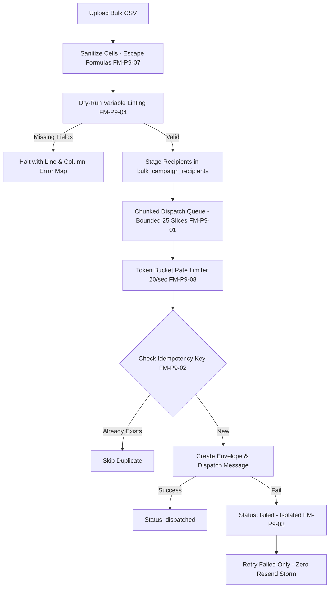

# Phase 9 Master Implementation Plan: Enterprise Bulk Dispatch Campaigns, Batch Merge Ingestion, Legal Hold & Cryptographic e-Discovery Archival

> **Initiative:** SmartSapp Document & Contract Intelligence Platform  
> **Phase:** 9 of Modernization Roadmap  
> **Status:** Architecture Reviewed, Hardened & Ready for Execution  
> **Architectural Review:** Senior Systems & Code Reviewer  
> **Dependencies:** Phases 0 through 8 Complete (`5cfb9e9e`, `bb2dc281`)  
> **Foundational Governance:** Conforms to all 10 Golden Rules, `next-best-practices`, `vercel-react-best-practices`, `emilkowal-animations`, `backend-design`, `frontend-design`, and `ui-ux-pro-max`.

---

## 1. Executive Summary & Strategic Objectives

With Phases 0 through 8 successfully delivered (100% GA readiness score, 75 test files passed, 464/464 green tests, 0 TypeScript compile errors), the SmartSapp Document Signing platform features an authoritative vector PDF generation engine, multi-party sequential/parallel routing, an append-only evidence ledger, CRM deal federation, grounded AI document copilot, self-healing webhooks, live zero-downtime migration, public developer REST APIs, and embedded partner SDK with offline biometric captures.

**Phase 9** elevates the platform into a true enterprise contender (competing directly with DocuSign Enterprise, Adobe Acrobat Sign, and Ironclad CLM) by delivering:
1. **High-Throughput Bulk Dispatch Campaigns**: Programmatically issuing a single approved template to hundreds or thousands of recipients simultaneously via CSV upload or CRM roster ingestion with rate-limited, chunked dispatch queues.
2. **Batch Dynamic Variable Merge Ingestion**: High-fidelity variable mapping with strict pre-flight syntax validation, null-check linting, and CSV formula injection sanitization.
3. **Partial-Failure Isolation & Safe Retry Engine (FM-P9-03)**: Granular per-recipient status tracking (`queued`, `dispatched`, `delivered`, `signed`, `failed`) ensuring partial failures can be retried without resending or disturbing recipients who have already executed.
4. **Enterprise Legal Hold & Statutory Retention Engine (FM-P9-05)**: Litigation hold locks that immediately freeze contracts and envelopes against deletion or modification with HTTP 423 (Locked) enforcement and statutory retention schedules (`financial`, `employment`, `tax`, `ip`).
5. **Cryptographic e-Discovery Archival Package & Merkle Manifest Generator (FM-P9-06)**: One-click export of court-admissible audit ZIP bundles containing authoritative completed PDFs, pre-execution templates, certificates of completion, evidence ledgers, biometric telemetry, and a cryptographic `manifest.json` with Merkle root checksums.
6. **Agreements Hub Console UI Upgrades**: Seamless addition of an 8th tab (**"Campaigns & Compliance"**) in [`ContractsClient.tsx`](file:///Users/josephaidoo/Desktop/Codes/vibe%20Coding/Onboarding-Dashbaord-main/src/app/admin/finance/contracts/ContractsClient.tsx) featuring a 4-step Bulk Campaign Wizard, live real-time progress monitor, Legal Hold Manager, and e-Discovery Compliance Vault dock.
7. **Backoffice Governance & Operational Controls**: No-code platform controls for global rate-limit throttling, cross-tenant litigation hold registries, and dead-letter queue inspection for bulk dispatch jobs.

---

## 2. Senior Architectural Review & Codebase Findings

A comprehensive audit of the codebase against Phase 9 requirements identified key architectural invariants and integration points:

### 2.1 File Location Grounding & Contract Store Harmonization
- **Authoritative Contract Actions**: `deleteContractAction`, `upsertContractAction`, and `sendContractAction` reside in [`src/lib/contract-actions.ts`](file:///Users/josephaidoo/Desktop/Codes/vibe%20Coding/Onboarding-Dashbaord-main/src/lib/contract-actions.ts#L214). The Legal Hold deletion guard must be hooked directly into `src/lib/contract-actions.ts:deleteContractAction`.
- **Root `contracts` Store Alignment**: During Phase 6, early prototypes in `document-governance-service.ts` wrote to `workspaces/${workspaceId}/contracts`. However, the authoritative production store across Phases 1–8 is root collection `contracts` with `workspaceId` indexing. `legal-hold-service.ts` will strictly operate on root `contracts` with tenant isolation verification, ensuring deletion blocks are universally recognized across all subsystems.
- **Existing Dependencies**: The repository already includes `jszip` (`^3.10.1`) and `papaparse` (`^5.7.0` + `@types/papaparse`) in `package.json`. No unapproved external dependencies need to be installed.

### 2.2 Fields & Variables Single Source of Truth (SSOT)
- Any CSV column mapping, template placeholder inspection, or token interpolation must route strictly through [`FieldsVariablesService.resolveTemplateVariables`](file:///Users/josephaidoo/Desktop/Codes/vibe%20Coding/Onboarding-Dashbaord-main/src/lib/services/fields-variables-service.ts). No raw regular expression replacements (e.g. `/.replace(/\{\{.*?\}\}/g)`) are permitted.

### 2.3 Tag Selection Single Source of Truth (SSOT)
- Any tagging of bulk campaigns or generated envelopes in UI components must exclusively use [`<TagSelector>`](file:///Users/josephaidoo/Desktop/Codes/vibe%20Coding/Onboarding-Dashbaord-main/src/components/tags/TagSelector.tsx) in client/draft mode (omitting `contactId`/`contactType` and using `currentTagIds` and `onTagsChange`).

### 2.4 Firestore Security Rules & Compound Indexes
- In client components, querying `bulk_campaigns` via `useCollection` will trigger `permission-denied` unless matched in `firestore.rules`.
- As mandated by workspace rules, authoring rules for `bulk_campaigns/{campaignId}` and its subcollections must be delegated to the `firestore-rules-author` subagent.
- Compound indexes for `bulk_campaigns` (`workspaceId + status + createdAt DESC`) and `bulk_campaign_recipients` (`campaignId + status`) will be staged and verified.

### 2.5 Actionable Errors & Persistent Toasts
- Any toasts prompting users to review legal holds, configure rate limits, or retry campaigns must pass `actionConfig` with relative paths (`/admin/finance/contracts`) and persistent duration.

---

## 3. Downstream Feature Impact & Backoffice Governance

### 3.1 Impact on Pre-Existing Features & Protection Strategies

| Impacted Feature | Potential Failure / Risk | Protection & Architectural Mitigation |
|---|---|---|
| **Contract Purge Action (`deleteContractAction`)** | Attempting to purge a contract currently on legal hold causes unexpected database divergence or legal non-compliance. | In `src/lib/contract-actions.ts`, check `assertContractNotUnderLegalHold` before deleting. In `ContractsClient.tsx`, disable the Purge button and display a locked badge with tooltip when `isUnderLegalHold === true`. |
| **Contacts & Entity Lifecycle** | Deleting a contact that was part of a bulk campaign orphans envelope history. | Recipient snapshots are stored immutably inside `bulk_campaign_recipients`. Envelope tracking references immutable recipient snapshots rather than live mutable CRM entities. |
| **Messaging Engine & Gateway Quotas** | Bulk dispatch of 1,000 envelopes in seconds saturates SendGrid/WhatsApp queues, delaying critical 1-to-1 transactional messages (e.g. OTPs). | Bulk campaign dispatch runs as a background queue in slices of 25 with 100ms pacing and token-bucket throttling (20/sec), preserving capacity for standard transactional messaging. |
| **Agreements Hub Navigation** | Adding an 8th tab causes layout breakage or text truncation on tablets and mobile screens. | The `TabsList` in `ContractsClient.tsx` already uses `flex flex-wrap h-auto gap-1`. The 8th tab ("Bulk Campaigns & Compliance") integrates seamlessly using `<Layers className="h-3.5 w-3.5" />` and responsive touch targets (`min-h-[44px]`). |
| **Statutory Retention Purge** | Automated retention cron deletes expired contracts without compliance notification. | 30-day and 7-day disposal warning alerts are dispatched to the workspace admin; actual disposal requires manual sign-off if the contract is flagged. |

### 3.2 Backoffice Governance Enhancements (No-Code Operations)

To empower platform administrators and compliance officers to manage Phase 9 capabilities without touching code:
1. **Cross-Tenant Legal Hold Registry**: Platform super-admins can view all active legal holds across all tenant workspaces, search by Matter ID or attorney reference, and inspect who placed/released each hold.
2. **Platform Rate-Limit & Throttle Controls**: Backoffice admins can dynamically tune the bulk dispatch rate limiter (e.g. adjusting default 20/sec down to 5/sec during provider degradation) directly from the Backoffice settings UI.
3. **Bulk Dispatch Dead-Letter Inspection**: Platform admins can inspect failed batch slices across tenants, view external gateway error codes (e.g. invalid phone number, bounced email), and trigger manual retries without developer intervention.

---

## 4. Failure Modes & Mitigations Matrix (12 Failure Modes)



| Failure Mode ID | Failure Mode Description | Root Cause | Preventive Architecture & Mitigation |
|---|---|---|---|
| **FM-P9-01** | Cloud Function / Serverless Timeout on Bulk Send | Attempting to process 2,000 envelopes synchronously in a single HTTP request. | Chunked asynchronous queueing in `bulk_campaign_jobs`. Batch processor executes in discrete slices of 25 with persistent progress updates. |
| **FM-P9-02** | Duplicate Issuance on Double-Click or Resume | Network retry or operator re-triggering campaign dispatch. | Deterministic idempotency key per recipient (`idemp_${campaignId}_${email}_${hash}`). Checked before envelope document creation. |
| **FM-P9-03** | Resend Storm on Partial Failure Retry | Operator clicking "Retry" resends the campaign to all recipients including those already signed. | Granular item-level status tracking (`queued`, `dispatched`, `delivered`, `signed`, `failed`). Retry action queries strictly `status == 'failed'`. |
| **FM-P9-04** | Variable Null Injection / Missing Merge Fields | CSV contains empty cells for mandatory template fields. | Pre-flight dry-run validator checks all required variables against template schema, reporting row numbers and blocking dispatch until resolved. |
| **FM-P9-05** | Accidental Destruction under Active Legal Hold | User or automated cron job purges an expired agreement currently under litigation. | Hard invariant check in [`deleteContractAction`](file:///Users/josephaidoo/Desktop/Codes/vibe%20Coding/Onboarding-Dashbaord-main/src/lib/contract-actions.ts#L214). Aborts with HTTP 423 (Locked) and logs audit event. |
| **FM-P9-06** | e-Discovery Manifest Hash Tampering / Divergence | Files inside the export bundle corrupted or altered during transport. | Compute SHA-256 for each exported file, build a deterministic `manifest.json` with Merkle root hash, and include `verify-manifest.sh`. |
| **FM-P9-07** | CSV Formula Injection (DDE Attack) | Malicious CSV cells starting with `=CMD` or `+` execute commands when opened in Excel. | Sanitize all text fields upon CSV parse by escaping formula operators (`=`, `+`, `-`, `@`, `\t`, `\r`) with a leading `'`. |
| **FM-P9-08** | Email Gateway Quota Saturation (HTTP 429) | Firing 1,000 invitations simultaneously triggers provider rate limits. | Rate-limited token bucket throttle (20 dispatches/sec) with exponential backoff on provider HTTP 429 responses. |
| **FM-P9-09** | Large Zip Memory Exhaustion in e-Discovery Export | Generating a multi-gigabyte ZIP archive entirely in Node.js buffer memory causes OOM crash. | Stream ZIP generation using chunked buffer streaming via `JSZip` with bounds checking. For bundles > 25MB, upload to Cloud Storage and return download URL. |
| **FM-P9-10** | Mobile Viewport Layout Breakage in Campaign Tables | Wide 10-column data tables causing horizontal scrolling and unclickable buttons on mobile. | Responsive data table with auto-collapse into mobile card layouts (`hidden md:table` vs `md:hidden flex flex-col gap-3`). |
| **FM-P9-11** | Unverified CRM Roster Desynchronization | CRM contacts modified or deleted between campaign staging and dispatch execution. | Pre-dispatch snapshot locks recipient data into campaign manifest; dispatches against immutable snapshot rather than live mutable contacts. |
| **FM-P9-12** | Premature Disposal on Statutory Retention Expiry | Retention countdown deletes contract without notifying compliance officer. | Configurable 30-day and 7-day disposal warning alerts emitted over deal/notification bus; requires human sign-off before actual disposal. |

---

## 5. Architectural Domain Model & Schema Specifications

### Data Structures in [`src/lib/types/document-signing.ts`](file:///Users/josephaidoo/Desktop/Codes/vibe%20Coding/Onboarding-Dashbaord-main/src/lib/types/document-signing.ts)

```ts
// 1. Bulk Campaign Status
export const BulkCampaignStatusSchema = z.enum([
  'draft',
  'validating',
  'ready',
  'dispatching',
  'active',
  'paused',
  'completed',
  'failed',
]);
export type BulkCampaignStatus = z.infer<typeof BulkCampaignStatusSchema>;

// 2. Bulk Campaign Recipient Item
export const BulkCampaignRecipientSchema = z.object({
  id: z.string().min(1),
  campaignId: z.string().min(1),
  rowIndex: z.number().int().min(1),
  name: z.string().min(1),
  email: z.string().email(),
  phone: z.string().optional(),
  variables: z.record(z.string(), z.string()),
  status: z.enum(['queued', 'dispatched', 'delivered', 'signed', 'failed']),
  envelopeId: z.string().optional(),
  error: z.string().optional(),
  dispatchedAt: z.string().optional(),
  signedAt: z.string().optional(),
  idempotencyKey: z.string(),
});
export type BulkCampaignRecipient = z.infer<typeof BulkCampaignRecipientSchema>;

// 3. Bulk Campaign Aggregate Record
export const BulkCampaignSchema = z.object({
  id: z.string().min(1),
  workspaceId: z.string().min(1),
  title: z.string().min(1),
  templateId: z.string().min(1),
  templateVersionId: z.string().optional(),
  status: BulkCampaignStatusSchema,
  totalCount: z.number().int().min(0),
  dispatchedCount: z.number().int().min(0),
  signedCount: z.number().int().min(0),
  failedCount: z.number().int().min(0),
  routingMode: z.enum(['single_signer', 'sequential_countersign']),
  countersignerEmail: z.string().email().optional(),
  countersignerName: z.string().optional(),
  createdBy: z.string().min(1),
  createdAt: z.string(),
  updatedAt: z.string(),
  completedAt: z.string().optional(),
  tags: z.array(z.string()).default([]),
});
export type BulkCampaign = z.infer<typeof BulkCampaignSchema>;

// 4. Create Bulk Campaign Request Schema
export const CreateBulkCampaignRequestSchema = z.object({
  title: z.string().min(1).max(120),
  templateId: z.string().min(1),
  templateVersionId: z.string().optional(),
  routingMode: z.enum(['single_signer', 'sequential_countersign']).default('single_signer'),
  countersignerEmail: z.string().email().optional(),
  countersignerName: z.string().optional(),
  tags: z.array(z.string()).default([]),
  recipients: z.array(z.object({
    name: z.string().min(1),
    email: z.string().email(),
    phone: z.string().optional(),
    variables: z.record(z.string(), z.string()).default({}),
  })).min(1).max(5000),
});
export type CreateBulkCampaignRequest = z.infer<typeof CreateBulkCampaignRequestSchema>;

// 5. e-Discovery Archival Manifest
export const EDiscoveryFileEntrySchema = z.object({
  path: z.string(),
  description: z.string(),
  sha256: z.string().length(64),
  sizeBytes: z.number().int().min(0),
  mimeType: z.string(),
});
export type EDiscoveryFileEntry = z.infer<typeof EDiscoveryFileEntrySchema>;

export const EDiscoveryManifestSchema = z.object({
  manifestVersion: z.literal('1.0.0'),
  contractId: z.string().min(1),
  envelopeId: z.string().min(1),
  workspaceId: z.string().min(1),
  title: z.string().min(1),
  exportedAt: z.string(),
  exportedByUserId: z.string().min(1),
  files: z.array(EDiscoveryFileEntrySchema).min(1),
  merkleRootSha256: z.string().length(64),
  legalHoldActive: z.boolean(),
  legalHoldDetails: z.object({
    matterId: z.string().optional(),
    reason: z.string().optional(),
    placedAt: z.string().optional(),
  }).optional(),
});
export type EDiscoveryManifest = z.infer<typeof EDiscoveryManifestSchema>;
```

---

## 6. Trackable Implementation Tasks & Milestones

### Task 1: Domain Schemas & Validation Contracts
**Files:**
- Modify: [`src/lib/types/document-signing.ts`](file:///Users/josephaidoo/Desktop/Codes/vibe%20Coding/Onboarding-Dashbaord-main/src/lib/types/document-signing.ts)
- Create: `src/lib/documents/__tests__/bulk-campaign-schemas.test.ts`

- [ ] **Step 1: Define Phase 9 schemas in `document-signing.ts`**
  - Add `BulkCampaignStatusSchema`, `BulkCampaignRecipientSchema`, `BulkCampaignSchema`, `CreateBulkCampaignRequestSchema`, `EDiscoveryFileEntrySchema`, and `EDiscoveryManifestSchema`.
  - Export all inferred TypeScript types.
  - Maintain zero `any` or `any[]` typing.
- [ ] **Step 2: Write domain schema test suite**
  - Verify valid payload validation, invalid email rejection, CSV formula sanitization schema checks, and Merkle manifest integrity.
- [ ] **Step 3: Verify and commit**
  - Run `pnpm test:run src/lib/documents/__tests__/bulk-campaign-schemas.test.ts`
  - Commit: `feat(docsigning): implement strict domain schemas for bulk campaigns, legal hold, and e-discovery manifests`

---

### Task 2: CSV Parsing, Sanitization & Dry-Run Variable Merge Engine
**Files:**
- Create: `src/lib/documents/bulk-csv-merge-service.ts`
- Create: `src/lib/documents/__tests__/bulk-csv-merge-service.test.ts`

- [ ] **Step 1: Implement `bulk-csv-merge-service.ts`**
  - Use `papaparse` for robust RFC 4180 parsing.
  - Implement `sanitizeCsvCell(val: string): string`: prefixes cells starting with `[=+\-@\t\r]` with `'` (FM-P9-07).
  - Implement `validateTemplateVariableMapping(templateVariables: string[], rows: ParsedRow[]): VariableLintResult` using `FieldsVariablesService.resolveTemplateVariables` (FM-P9-04).
  - Implement `generateDryRunMergePreview(templateId: string, rows: ParsedRow[], sampleLimit = 5): Promise<MergePreviewResult>`.
- [ ] **Step 2: Write test suite**
  - Verify RFC 4180 CSV parsing, formula injection sanitization, missing variable detection, and dry-run preview formatting.
- [ ] **Step 3: Verify and commit**
  - Run `pnpm test:run src/lib/documents/__tests__/bulk-csv-merge-service.test.ts`
  - Commit: `feat(docsigning): implement bulk csv merge parser with dry-run linting and formula sanitization`

---

### Task 3: Chunked Bulk Campaign Dispatch Queue & Idempotent Worker
**Files:**
- Create: `src/lib/documents/bulk-campaign-dispatcher-service.ts`
- Create: `src/lib/documents/__tests__/bulk-campaign-dispatcher-service.test.ts`

- [ ] **Step 1: Implement `bulk-campaign-dispatcher-service.ts`**
  - Functions:
    - `createBulkCampaign(workspaceId: string, input: CreateBulkCampaignRequest, userId: string): Promise<BulkCampaign>`
    - `stageBulkRecipients(campaignId: string, recipients: BulkCampaignRecipientInput[]): Promise<void>`
    - `dispatchCampaignBatchSlice(campaignId: string, batchSize = 25): Promise<DispatchSliceResult>` (FM-P9-01)
    - `retryFailedCampaignRecipients(campaignId: string): Promise<RetryResult>` (FM-P9-03)
    - `getCampaignProgress(campaignId: string): Promise<BulkCampaignProgress>`
  - Integrate token-bucket rate limiter (`api-rate-limiter-service.ts`) to cap gateway dispatch to 20/sec (FM-P9-08).
  - Derive deterministic idempotency key per recipient (`idemp_${campaignId}_${email}_${hash}`) (FM-P9-02).
- [ ] **Step 2: Write test suite**
  - Test batch slicing, idempotency deduplication on resume, partial failure isolation, and retry targeting only failed rows.
- [ ] **Step 3: Verify and commit**
  - Run `pnpm test:run src/lib/documents/__tests__/bulk-campaign-dispatcher-service.test.ts`
  - Commit: `feat(docsigning): implement chunked bulk campaign dispatcher with partial-failure isolation and rate limiting`

---

### Task 4: Enterprise Legal Hold & Statutory Retention Guard Engine
**Files:**
- Create: `src/lib/documents/legal-hold-service.ts`
- Modify: [`src/lib/contract-actions.ts`](file:///Users/josephaidoo/Desktop/Codes/vibe%20Coding/Onboarding-Dashbaord-main/src/lib/contract-actions.ts#L214)
- Create: `src/lib/documents/__tests__/legal-hold-service.test.ts`

- [ ] **Step 1: Implement `legal-hold-service.ts`**
  - Functions:
    - `placeContractLegalHold(workspaceId: string, contractId: string, input: PlaceHoldInput, userId: string): Promise<LegalHoldResult>`
    - `releaseContractLegalHold(workspaceId: string, contractId: string, input: ReleaseHoldInput, userId: string): Promise<LegalHoldResult>`
    - `assertContractNotUnderLegalHold(contractId: string): Promise<void>` (Throws `LOCKED_UNDER_LEGAL_HOLD` if true)
    - `calculateRetentionSchedule(category: RetentionCategory, executedAt: string): RetentionSchedule`
  - Append immutable audit record to `signing_evidence` on hold toggle.
  - Target root collection `contracts` with `workspaceId` verification.
- [ ] **Step 2: Hook deletion guard into `src/lib/contract-actions.ts:deleteContractAction`**
  - Call `await assertContractNotUnderLegalHold(contractId)` before executing batch deletes (FM-P9-05).
- [ ] **Step 3: Write test suite**
  - Test placing hold, releasing hold, deletion block when hold is active, and retention schedule calculation.
- [ ] **Step 4: Verify and commit**
  - Run `pnpm test:run src/lib/documents/__tests__/legal-hold-service.test.ts`
  - Commit: `feat(docsigning): implement enterprise legal hold enforcement and deletion guard`

---

### Task 5: Cryptographic e-Discovery Archival Package & Merkle Manifest Generator
**Files:**
- Create: `src/lib/documents/ediscovery-archival-service.ts`
- Create: `src/lib/documents/__tests__/ediscovery-archival-service.test.ts`

- [ ] **Step 1: Implement `ediscovery-archival-service.ts`**
  - Functions:
    - `buildEDiscoveryManifest(contractId: string, artifacts: ArtifactPayload[]): EDiscoveryManifest`
    - `computeMerkleRootSha256(leafDigests: string[]): string` (FM-P9-06)
    - `assembleEDiscoveryZipBundle(workspaceId: string, contractId: string, userId: string): Promise<{ zipBase64: string; manifest: EDiscoveryManifest; storageUrl?: string }>`
  - Manifest bundle includes:
    1. `completed-contract.pdf` (authoritative vector signed PDF)
    2. `pre-execution-document.pdf` (original template PDF)
    3. `certificate-of-completion.pdf` (vector certificate)
    4. `evidence-ledger.json` (append-only evidence events)
    5. `biometric-telemetry.json` (stroke entropy data if present)
    6. `manifest.json` (SHA-256 digests and Merkle root)
    7. `verify-manifest.sh` (standalone POSIX shell script to verify bundle integrity)
  - Memory bounds protection: If bundle > 25MB, upload to Cloud Storage and return download URL (FM-P9-09).
- [ ] **Step 2: Write test suite**
  - Test SHA-256 calculation, Merkle root tree hashing, tamper detection (corrupted file causes verification failure), and bundle assembly.
- [ ] **Step 3: Verify and commit**
  - Run `pnpm test:run src/lib/documents/__tests__/ediscovery-archival-service.test.ts`
  - Commit: `feat(docsigning): implement cryptographic e-discovery archival package and merkle manifest generator`

---

### Task 6: Server Actions & Firestore Security Rules for Bulk Campaigns
**Files:**
- Create: `src/app/actions/bulk-campaign-actions.ts`
- Create: `src/app/actions/compliance-archival-actions.ts`
- Delegate to subagent: `firestore-rules-author` for `firestore.rules` (`bulk_campaigns`)
- Create: `src/lib/documents/__tests__/phase9-server-actions.test.ts`

- [ ] **Step 1: Implement `bulk-campaign-actions.ts`**
  - Actions: `createBulkCampaignAction`, `previewBulkCsvMergeAction`, `dispatchBulkCampaignSliceAction`, `retryFailedCampaignRecipientsAction`, `getBulkCampaignProgressAction`.
  - Enforce `requireAuth()` and `requireWorkspace()`.
- [ ] **Step 2: Implement `compliance-archival-actions.ts`**
  - Actions: `toggleContractLegalHoldAction`, `updateRetentionCategoryAction`, `generateEDiscoveryPackageAction`.
  - Enforce `requireAuth()` and `requireWorkspace()`.
- [ ] **Step 3: Delegate Firestore security rules to `firestore-rules-author`**
  - Author hardened rules for `bulk_campaigns/{campaignId}` and `bulk_campaign_recipients/{recipientId}`.
- [ ] **Step 4: Write server action test suite**
  - Test authentication guards, workspace isolation, Zod input validation, and standardized error envelopes.
- [ ] **Step 5: Verify and commit**
  - Run `pnpm test:run src/lib/documents/__tests__/phase9-server-actions.test.ts`
  - Commit: `feat(docsigning): implement server actions and security rules for bulk campaigns, legal hold, and e-discovery compliance`

---

### Task 7: Bulk Campaigns, Legal Hold & Compliance Vault Tab UI
**Files:**
- Create: `src/app/admin/finance/contracts/components/BulkCampaignsTab.tsx`
- Create: `src/app/admin/finance/contracts/components/BulkCampaignWizardModal.tsx`
- Create: `src/app/admin/finance/contracts/components/LegalHoldManagerModal.tsx`
- Modify: [`src/app/admin/finance/contracts/ContractsClient.tsx`](file:///Users/josephaidoo/Desktop/Codes/vibe%20Coding/Onboarding-Dashbaord-main/src/app/admin/finance/contracts/ContractsClient.tsx)

- [ ] **Step 1: Implement `BulkCampaignWizardModal.tsx`**
  - 4-Step Stepper:
    1. Select Template (from published templates)
    2. Upload CSV / Select CRM Roster (file dropzone + CSV parser)
    3. Map Variables & Pre-Flight Lint (table showing CSV columns -> Template variables, dry-run preview)
    4. Confirm & Schedule Dispatch (review summary, countersigner option, dispatch confirmation)
  - Mobile ergonomics: touch targets `min-h-[44px]`, `active:scale-[0.97]`.
  - Variable insertion: routes through `FieldsVariablesService`.
  - Tag selector: routes through `<TagSelector>` in client/draft mode.
  - Simple everyday UI English, zero confusing jargon.
- [ ] **Step 2: Implement `LegalHoldManagerModal.tsx`**
  - View current legal hold status, matter reference, reason input, place/release buttons with confirm step.
- [ ] **Step 3: Implement `BulkCampaignsTab.tsx`**
  - Sub-views:
    - **Active Campaigns**: List of bulk campaigns with live progress bar, metrics (queued, dispatched, signed, failed), "Retry Failed" button.
    - **Compliance & Legal Hold**: Table of executed contracts with Legal Hold status badge, retention schedule, "Place Hold" / "Release Hold" trigger.
    - **e-Discovery Compliance Vault**: One-click "Export e-Discovery Package" with download loading spinner and verification summary.
  - Responsive tables collapsing into card layouts on screens `< 640px` (FM-P9-10).
- [ ] **Step 4: Mount 8th Tab in `ContractsClient.tsx`**
  - Add 8th tab: "Bulk Campaigns & Compliance" (`Layers` icon) alongside all existing 7 tabs.
  - Update `activeTab` state union: `'contracts' | 'templates' | 'obligations' | 'analytics' | 'governance' | 'migration' | 'developer' | 'campaigns'`.
  - Lock Purge action when contract has active Legal Hold with disabled tooltip.
  - Preserve all existing 7 tabs and modals completely intact.
- [ ] **Step 5: Verify and commit**
  - Commit: `feat(docsigning): implement agreements hub bulk campaigns and compliance vault console ui`

---

### Task 8: Dedicated Phase 9 Integration & End-to-End Test Suite
**Files:**
- Create: `src/lib/__tests__/document-phase9.test.ts`

- [ ] **Step 1: Write comprehensive Phase 9 integration test suite**
  - Test 1: Full CSV parsing, formula injection sanitization, and variable mapping validation.
  - Test 2: Bulk campaign creation, recipient staging, and chunked slice dispatch execution.
  - Test 3: Idempotency deduplication preventing double-send on repeated slice requests (FM-P9-02).
  - Test 4: Partial-failure retry targeting only failed rows without resending signed ones (FM-P9-03).
  - Test 5: Legal hold placement freezing contract against deletion with `deleteContractAction` (FM-P9-05).
  - Test 6: Legal hold release audit logging and deletion unblocking.
  - Test 7: e-Discovery ZIP bundle assembly and Merkle root calculation (FM-P9-06).
  - Test 8: Merkle manifest tamper verification test (detecting altered files).
  - Test 9: End-to-end multi-tenant isolation across bulk campaigns and legal holds.
- [ ] **Step 2: Run test suite**
  - Run: `pnpm test:run src/lib/__tests__/document-phase9.test.ts`
  - Expected: PASS (9/9 tests green).
- [ ] **Step 3: Verify and commit**
  - Commit: `test(docsigning): implement dedicated Phase 9 end-to-end integration test suite`

---

### Task 9: Acceptance Gate & TypeScript/Lint Alignment
**Files:**
- Verification only

- [ ] **Step 1: Run comprehensive document test suite across all phases (Phases 0 through 9)**
  - Run: `pnpm test:run src/lib/documents/__tests__/*.test.ts src/lib/__tests__/document-phase*.test.ts src/lib/__tests__/*baseline.test.ts`
  - Expected: 80+ test files passed, 500+ tests green.
- [ ] **Step 2: Run strict TypeScript compiler verification**
  - Run: `NODE_OPTIONS='--max-old-space-size=8192' pnpm typecheck`
  - Expected: 0 errors (`tsc --noEmit`).
- [ ] **Step 3: Run repository linter**
  - Run: `pnpm lint`
  - Expected: 0 errors, warnings within ceiling.
- [ ] **Step 4: Update Master Plan and mark tasks completed**
  - Commit final verification state to local git branch `main`.

---

## 7. Review Checkpoints & Acceptance Gate

Before Phase 9 is declared complete and ready for production, the following criteria must be satisfied:
1. **Zero `any` or `any[]` Typing**: Strict Zod schemas and TypeScript types on all CSV rows, bulk campaigns, legal hold actions, and e-Discovery manifests.
2. **Chunked Asynchronous Scalability**: Large recipient batches (500–5,000) execute in bounded slices (25–50) with token-bucket rate limiting without serverless timeouts.
3. **Partial-Failure Isolation**: Failed campaign rows are isolated and retryable without resending signed or delivered envelopes.
4. **Litigation Defense & Legal Hold**: Contracts under active legal hold cannot be deleted or purged under any circumstance.
5. **Cryptographic e-Discovery Completeness**: Export bundles include all 7 requisite artifacts with SHA-256 Merkle root verification and standalone bash verifier.
6. **Continuous Quality Gate**: `pnpm typecheck` (0 errors), `pnpm test:run` (100% green across all 80+ suites), and zero uncommitted files.
