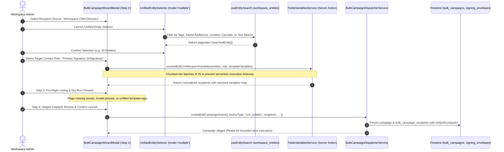

# Implementation Plan: Workspace CRM Contact Selection for Bulk Document Signing Campaigns

> **For agentic workers:** REQUIRED SUB-SKILL: Use `superpowers:subagent-driven-development` or `superpowers:executing-plans` to implement this plan task-by-task. Steps use checkbox (`- [ ]`) syntax for tracking.

**Goal:** Enable workspace administrators to select bulk document signing recipients directly from the Workspace CRM Directory (using the existing canonical `<UnifiedEntitySelector>`), resolve signatory roles and template variables dynamically via `FieldsVariablesService`, and dispatch bulk campaigns seamlessly alongside CSV uploads.

**Architecture:** Dual-source ingestion architecture extending `BulkCampaignWizardModal` (Step 2) with a segmented switcher between "Workspace CRM Directory" and "CSV Upload". CRM entity contacts are flattened and filtered by designated signatory role (`isSignatory`, `isPrimary`, or `all`), validated against template variables using `FieldsVariablesService.getVariableValuesMapAction` in bounded parallel chunks, and dispatched through the existing chunked, idempotent `BulkCampaignDispatcherService`. Backoffice `BulkCampaignsTab` is enhanced with source provenance badges (`CRM Directory` vs `CSV Upload`), entity navigation links, and recipient origin inspection.

**Tech Stack:** Next.js 15 (App Router, Server Actions), React 19, TypeScript (Strict, Zero-`any`), Firebase Firestore (Admin & Client SDKs), `FieldsVariablesService`, `<UnifiedEntitySelector>`, Tailwind CSS, Lucide Icons, Vitest.

---

## 1. Architectural Blueprint & Ingestion Flow



---

## 2. In-Depth Failure Modes & Mitigation Strategies ("What Could Go Wrong")

| Failure Mode ID | Description | Root Cause | Architectural Mitigation |
| :--- | :--- | :--- | :--- |
| **FM-CRM-01** | **Entity Has No Contacts or Empty `entityContacts` Array** | Entity registered as an organization without contact personnel added. | The variable extraction pipeline detects `entityContacts.length === 0`, falls back to entity root `primaryEmail`/`primaryContactName`, and if still missing, flags the row as `isValid: false` with error `"No contact email found for this entity"`. Displays in pre-flight linting. |
| **FM-CRM-02** | **Ambiguous Multiple Signatories on Single Entity** | An entity has 3 contacts, none marked `isSignatory`, or multiple marked `isSignatory`. | Deterministic role precedence: (1) `isSignatory === true`, (2) `isPrimary === true`, (3) first contact with a valid email. When user selects "All Signatories", each distinct contact with an email produces an independent recipient row linked to the parent entity. |
| **FM-CRM-03** | **Variable Resolution Timeout on Large Batches (>100 Entities)** | Invoking `FieldsVariablesService.getVariableValuesMapAction` sequentially for 250 entities breaches Next.js Server Action execution limits. | Client-side chunking in slices of 20 entities using `Promise.allSettled`, with a deterministic fallback mapper extracting standard fields (`displayName`, `primaryEmail`, `primaryPhone`, `location`) synchronously from the denormalized `WorkspaceEntity` record. |
| **FM-CRM-04** | **Stale CRM Data / Contact Deleted After Selection** | Entity or contact deleted between selection in Step 2 and launch in Step 4. | `createBulkCampaign` validates entity existence server-side and checks workspace tenancy before writing recipient documents. |
| **FM-CRM-05** | **Nested Modal & Touch Trap on Mobile Screens** | Opening `<UnifiedEntitySelector>` dialog from inside `<BulkCampaignWizardModal>` dialog creates z-index stacking conflicts, trapped focus, and iOS scroll freeze. | Step 2 renders a seamless inline trigger card that hides the wizard body while `<UnifiedEntitySelector>` is active, or opens `<UnifiedEntitySelector>` in drawer mode on viewports $< 640\text{px}$ (`min-h-[44px]` touch targets, `active:scale-[0.97]`). |
| **FM-CRM-06** | **Missing Template Variables on CRM Entities** | Template demands `{{deal_amount}}` or `{{project_code}}`, but entity lacks custom field values. | Pre-flight linting (Step 3) checks all resolved rows against `templateVariables`. Rows with missing mandatory placeholders are highlighted in amber with option to "Exclude Incomplete Entities" or provide a default fallback value. |
| **FM-CRM-07** | **Duplicate Contact Signatures for Multi-Entity Signatories** | The same individual CEO is the signatory for 3 distinct entities in the selection. | Idempotency key per campaign includes entity context: `idemp_${campaignId}_${entityId}_${email}`. Senders are notified that the signer will receive distinct envelopes tailored to each entity. |

---

## 3. Impact Analysis on Downstream Systems & Backoffice

### Downstream Systems Impact
1. **CRM Deals & Activity Timeline**:
   - Because `entityId` and `contactId` are attached to `BulkCampaignRecipient`, when an envelope is signed, the event handler in `envelope-step-finalization.ts` records the completed contract to the entity's CRM timeline automatically.
2. **Contact Communication Log**:
   - Campaign dispatches register outbound envelope delivery under the contact's messaging log, respecting workspace communication preferences.
3. **Fields & Variables Service SSOT (Workspace Rule)**:
   - Adheres strictly to the single source of truth: all merge tokens route through `FieldsVariablesService.resolveTemplateVariables` and `getVariableValuesMapAction`. No custom regex string replacements permitted.
4. **TagSelector Standard (Workspace Rule)**:
   - Tagging campaigns runs strictly in client/draft mode via `<TagSelector>`.

### Backoffice Enhancements (Zero-Code Management)
1. **Provenance Badging in `BulkCampaignsTab.tsx`**:
   - Each campaign in the table displays a source badge:
     - `CRM Directory` (with building icon and count of linked entities)
     - `CSV Upload` (with file spreadsheet icon and file name)
2. **Recipient Source Filter**:
   - Admins can filter campaigns by `Source: All | CRM Entities | CSV Upload`.
3. **Recipient Entity Drilldown in Campaign Detail Drawer**:
   - Clicking a recipient in a CRM-sourced campaign provides a direct clickable link to the CRM entity profile (`/admin/entities/${entityId}`).

---

## 4. Zero-Tolerance Typing, Security & Performance Standards

1. **Rule 4 Compliance**:
   - Strictly zero `any`, `any[]`, or unchecked type assertions (`as unknown as ...`).
   - `SearchedEntity` strictly narrowed to `WorkspaceEntity`.
   - All server actions wrapped in Zod schema input validation.
2. **Multi-Tenant Security (Rules 5 & 8)**:
   - All CRM queries enforce `workspaceId` equality.
   - Senders cannot select or dispatch envelopes to entities outside their active workspace context.
3. **High-Load Resilience (Rule 9)**:
   - Recipient dispatch queue processes strictly in bounded slices of 25.
   - Memory-efficient pagination via `useEntitySearch` (cursor-based Firestore querying, no in-memory dumping).
4. **Accessibility & Mobile UX (Rule 7)**:
   - `min-h-[44px]` touch targets on all source toggle tabs, role selects, and action buttons.
   - iOS Safari auto-zoom prevention with `text-base sm:text-sm` inputs.
   - Clear, everyday UI English (e.g. *"Pick from CRM"*, *"Signatory Contact"*, *"Missing Email"*).

---

## 5. File Structure Plan

```
src/
├── lib/
│   ├── types/
│   │   └── document-signing.ts             # Extend CreateBulkCampaignRequestSchema & BulkCampaignRecipientSchema
│   ├── documents/
│   │   ├── crm-bulk-recipient-service.ts   # [NEW] Pure service: flattening SearchedEntity[] to BulkRecipientRow[]
│   │   ├── bulk-campaign-dispatcher-service.ts # Support entityId/contactId in recipient creation
│   │   └── __tests__/
│   │       ├── crm-bulk-recipient-service.test.ts # [NEW] Unit tests for entity flattening & variable mapping
│   │       └── bulk-campaign-schemas.test.ts      # Test updated Zod schemas
├── app/
│   ├── actions/
│   │   └── bulk-campaign-actions.ts        # Update createBulkCampaignAction & add previewBulkCrmRecipientsAction
│   └── admin/
│       └── finance/
│           └── contracts/
│               └── components/
│                   ├── BulkCampaignWizardModal.tsx # Update Step 2 with CRM Source & UnifiedEntitySelector
│                   └── BulkCampaignsTab.tsx        # Add source provenance badges & filter
```

---

## 6. Bite-Sized Implementation Tasks

### Task 1: Domain Schemas & Recipient Source Invariants
**Files:**
- Modify: `src/lib/types/document-signing.ts`
- Test: `src/lib/documents/__tests__/bulk-campaign-schemas.test.ts`

- [ ] **Step 1: Write unit tests for updated bulk campaign schemas**
  - Verify `CreateBulkCampaignRequestSchema` accepts `sourceType: 'crm_entities'` with optional `entityIds: string[]` and `contactRole: 'signatory' | 'primary' | 'all'`.
  - Verify `BulkCampaignRecipientSchema` accepts optional `entityId` and `contactId`.
- [ ] **Step 2: Run test to verify it fails**
  - Command: `pnpm test:run src/lib/documents/__tests__/bulk-campaign-schemas.test.ts`
- [ ] **Step 3: Update `src/lib/types/document-signing.ts`**
  - Add `sourceType` enum (`'csv_upload' | 'crm_entities'`) to `CreateBulkCampaignRequestSchema` and `BulkCampaignSchema`.
  - Add `entityId` and `contactId` string fields to `BulkCampaignRecipientSchema` and `BulkCsvMergePreviewItemSchema`.
- [ ] **Step 4: Run test to verify it passes**
  - Command: `pnpm test:run src/lib/documents/__tests__/bulk-campaign-schemas.test.ts`
- [ ] **Step 5: Commit changes locally**
  - Command: `git add src/lib/types/document-signing.ts src/lib/documents/__tests__/bulk-campaign-schemas.test.ts && git commit -m "feat(docsigning): add crm entity recipient source types to bulk campaign domain schemas"`

---

### Task 2: Pure CRM Entity Recipient Flattening & Variable Resolution Service
**Files:**
- Create: `src/lib/documents/crm-bulk-recipient-service.ts`
- Create: `src/lib/documents/__tests__/crm-bulk-recipient-service.test.ts`

- [ ] **Step 1: Write unit tests in `crm-bulk-recipient-service.test.ts`**
  - Test flattening entities with `role = 'signatory'`: picks contact with `isSignatory === true`, falls back to `isPrimary`, then root.
  - Test flattening entities with `role = 'all'`: creates distinct recipient row for every contact with valid email.
  - Test entity with zero contacts: flags invalid row with clear message without throwing.
  - Test mapping denormalized entity variables (`entity_name`, `company`, `phone`, `location`).
  - Test formula sanitization on entity strings (neutralizing DDE injection).
- [ ] **Step 2: Run test to verify it fails**
  - Command: `pnpm test:run src/lib/documents/__tests__/crm-bulk-recipient-service.test.ts`
- [ ] **Step 3: Implement `src/lib/documents/crm-bulk-recipient-service.ts`**
  - Implement `extractRecipientsFromEntities(entities: SearchedEntity[], role: 'signatory' | 'primary' | 'all', templateVariables: string[]): CrmRecipientExtractionResult`.
  - Implement `sanitizeEntityVariableValue(val: string): string`.
  - Enforce zero `any` and return strictly typed preview items.
- [ ] **Step 4: Run test to verify it passes**
  - Command: `pnpm test:run src/lib/documents/__tests__/crm-bulk-recipient-service.test.ts`
- [ ] **Step 5: Commit changes locally**
  - Command: `git add src/lib/documents/crm-bulk-recipient-service.ts src/lib/documents/__tests__/crm-bulk-recipient-service.test.ts && git commit -m "feat(docsigning): implement pure crm entity recipient extraction and variable normalization service"`

---

### Task 3: Server Action for CRM Recipient Pre-Flight Variable Resolution
**Files:**
- Modify: `src/app/actions/bulk-campaign-actions.ts`
- Test: `src/lib/documents/__tests__/phase9-server-actions.test.ts`

- [ ] **Step 1: Write integration tests for CRM preview action in `phase9-server-actions.test.ts`**
  - Test `previewBulkCrmRecipientsAction` validating workspace tenancy, resolving variables via `FieldsVariablesService`, and returning validation summary.
- [ ] **Step 2: Run test to verify it fails**
  - Command: `pnpm test:run src/lib/documents/__tests__/phase9-server-actions.test.ts`
- [ ] **Step 3: Implement `previewBulkCrmRecipientsAction` in `bulk-campaign-actions.ts`**
  - Authenticate caller via `requireAuth` and `requireWorkspace`.
  - Fetch target entities by IDs in bounded queries.
  - Call `extractRecipientsFromEntities` and enrich with `FieldsVariablesService.getVariableValuesMapAction`.
  - Return `BulkCsvMergePreviewResult`.
- [ ] **Step 4: Update `createBulkCampaign` to persist `entityId` and `contactId` on `bulk_campaign_recipients`**
  - In `src/lib/documents/bulk-campaign-dispatcher-service.ts`, write `entityId`, `contactId`, and `sourceType` on created recipient records.
- [ ] **Step 5: Run tests to verify they pass**
  - Command: `pnpm test:run src/lib/documents/__tests__/phase9-server-actions.test.ts src/lib/documents/__tests__/bulk-campaign-dispatcher-service.test.ts`
- [ ] **Step 6: Commit changes locally**
  - Command: `git add src/app/actions/bulk-campaign-actions.ts src/lib/documents/bulk-campaign-dispatcher-service.ts src/lib/documents/__tests__/phase9-server-actions.test.ts && git commit -m "feat(docsigning): implement crm recipient preview and metadata persistence server action"`

---

### Task 4: Wizard UI Upgrade with `UnifiedEntitySelector` (Step 2 & Step 3)
**Files:**
- Modify: `src/app/admin/finance/contracts/components/BulkCampaignWizardModal.tsx`

- [ ] **Step 1: Add Recipient Source Segmented Toggle in Step 2**
  - Render dual-tab selector:
    - `Workspace CRM Directory` (default)
    - `Upload CSV Spreadsheet`
- [ ] **Step 2: Mount `<UnifiedEntitySelector>` in Multi-Select Mode**
  - Integrate `<UnifiedEntitySelector>` with `mode="multiple"`, `values={selectedEntityIds}`, `workspaceId={workspaceId}`.
  - Render **Target Signatory Role** selector (`Primary Signatory`, `Primary Contact`, `All Contacts`).
  - Render responsive selected entities summary badge bar with quick remove pills.
- [ ] **Step 3: Wire Step 2 -> Step 3 Transition for CRM Entities**
  - On clicking "Next: Review Variables", call `previewBulkCrmRecipientsAction` if source is `crm_entities`.
  - Show smooth indeterminate loader with text *"Resolving CRM fields & variables..."*.
  - Step 3 renders identical high-fidelity table preview and variable linting cards regardless of source.
- [ ] **Step 4: Mobile Ergonomics & Emil Kowalski Feedback**
  - Ensure all buttons have `min-h-[44px]` and `active:scale-[0.97]`.
  - Ensure inputs use `text-base sm:text-sm` for iOS Safari zoom locking.
- [ ] **Step 5: Commit changes locally**
  - Command: `git add src/app/admin/finance/contracts/components/BulkCampaignWizardModal.tsx && git commit -m "feat(docsigning): integrate UnifiedEntitySelector and crm recipient source in BulkCampaignWizardModal"`

---

### Task 5: Backoffice Provenance & Audit Inspection UI
**Files:**
- Modify: `src/app/admin/finance/contracts/components/BulkCampaignsTab.tsx`

- [ ] **Step 1: Add Source Provenance Column / Badges in Campaigns Table**
  - Display `CRM Directory` (blue badge with `Building2` icon) or `CSV Upload` (purple badge with `FileSpreadsheet` icon).
- [ ] **Step 2: Add Source Filter Dropdown in Table Header**
  - Filter campaigns by `All Sources`, `CRM Directory`, `CSV Upload`.
- [ ] **Step 3: Enhance Detail Drawer with Entity Navigation**
  - Recipient rows in the campaign detail drawer display linked entity name linking directly to `/admin/entities/${recipient.entityId}`.
- [ ] **Step 4: Commit changes locally**
  - Command: `git add src/app/admin/finance/contracts/components/BulkCampaignsTab.tsx && git commit -m "feat(docsigning): add crm source provenance badge, filter, and entity links to BulkCampaignsTab"`

---

### Task 6: End-to-End Integration Tests & Verification
**Files:**
- Create: `src/lib/__tests__/bulk-campaign-crm-source.test.ts`

- [ ] **Step 1: Write full E2E workflow test**
  - Seed mock CRM entities with signatory contacts and custom properties.
  - Execute CRM recipient extraction and verify variable maps.
  - Create campaign with `sourceType: 'crm_entities'`.
  - Dispatch slice and verify envelope creation attaches `entityId` metadata.
  - Verify downstream CRM deal milestone compatibility.
- [ ] **Step 2: Run all document signing test suites**
  - Command: `pnpm test:run src/lib/documents/__tests__/*.test.ts src/lib/__tests__/bulk-campaign*.test.ts src/lib/__tests__/document-phase*.test.ts`
- [ ] **Step 3: Run TypeScript Typecheck**
  - Command: `NODE_OPTIONS='--max-old-space-size=8192' pnpm typecheck`
  - Expected: 0 errors.
- [ ] **Step 4: Run Linter**
  - Command: `NODE_OPTIONS='--max-old-space-size=8192' pnpm lint`
  - Expected: 0 errors, warnings $\le 670$.
- [ ] **Step 5: Commit changes locally**
  - Command: `git add src/lib/__tests__/bulk-campaign-crm-source.test.ts && git commit -m "test(docsigning): add end-to-end integration tests for crm-sourced bulk document signing campaigns"`

---

## 7. Operational & Maintainer Guidance (Rule 10)

- **Do Not Bypass `FieldsVariablesService`**: Never perform raw token substitution (`.replace(/\{\{(.*?)\}\}/g)`). Always delegate variable mapping to `FieldsVariablesService.getVariableValuesMapAction`.
- **Do Not Nest Dialogs on Mobile**: When launching `<UnifiedEntitySelector>` from `BulkCampaignWizardModal`, use the modal visibility swap pattern to keep exactly one overlay active in the DOM on viewports $< 640\text{px}$.
- **Never Push to Remote**: Only commit locally to `main`. Do not push to `origin` unless explicitly instructed.
