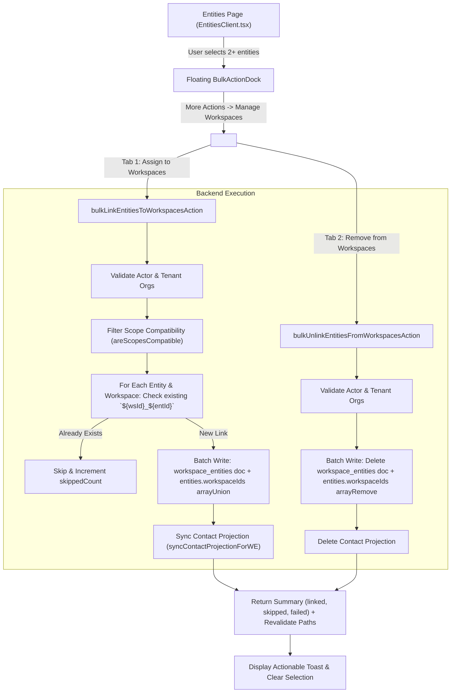

# Bulk Entity Workspace Management (Multi-Workspace Assign & Remove) Implementation Plan

> **Goal:** Enable users to manage workspace assignments for bulk contacts directly from the Entities directory. When multiple entities are selected, "Manage Workspaces" in the More Actions dropdown opens an interactive, accessible modal allowing users to assign all selected entities to one or more workspaces (skipping already assigned entities idempotently) or remove them from selected workspaces.

---

### Governance & Compliance Review against `agent_mcp_rules.md`

| Rule | Requirement | How This Plan Conforms |
| :--- | :--- | :--- |
| **Rule 1: Framework & Best Practices** | Conform to `next-best-practices`, `vercel-react-best-practices`, `frontend-design`, `backend-design`. | Clean Server Actions separated from business core (`workspace-entity-core.ts`), zero client hydration mismatch, optimistic state handling. |
| **Rule 2: What Could Go Wrong & Edge Cases** | Identify failure modes and scalability bottlenecks upfront. | Handled: Scope mismatch validation, cross-tenant leaks, batch write limits (>500 ops), orphaned entities, idempotent skip of existing assignments. |
| **Rule 3: Downstream & Backoffice Impact** | Verify changes preserve backoffice functionality and cross-workspace projections. | Uses `EntitySyncGateway.unlinkEntityFromWorkspace` and `syncContactProjectionForWE` to keep search indexes, contact projections, and activity logs synchronized. |
| **Rule 4: Strict Typing Protocol** | Zero `any` or `any[]` across all inputs, state, and server actions. | Strictly typed interfaces: `BulkLinkEntitiesInput`, `BulkUnlinkEntitiesInput`, `BulkWorkspaceOperationResult`, `BulkManageWorkspacesModalProps`. |
| **Rule 5: Deployment Protocol** | Staging verification before production; no unattended git pushes. | Verification via `pnpm typecheck` and ESLint; no pushing commits to remote branches. |
| **Rule 7: Mobile & Accessibility First** | Touch targets $\ge$ 44px, screen-reader descriptions, tactile buttons. | Standardized Modal Architecture in `theme.md` (Section 8), `<CardInfoTooltip>` alongside titles, `min-h-[44px]` targets, `active:scale-[0.97]` buttons. |
| **Rule 8: Security & Multi-Tenancy** | Enforce tenant isolation and authorization checks. | `requireAuth()`, `requireWorkspace()`, entity and workspace `organizationId` matching, `checkEntityPermission(actor, workspaceId, 'edit')`. |
| **Rule 9: Load & Batch Scalability** | Prevent resource exhaustion on large bulk sets. | Chunks batch operations in sizes $\le 200$ operations to strictly respect Firestore's 500-write limit per batch. |
| **Rule 10: Inline Architectural Guides** | Provide clear commentary on why and how code is structured. | Complete architectural docstrings and inline comments in every created and modified file. |

---

### Technical Specification & Architecture



---

### Key Failure Modes & Guardrails

1. **Idempotent Skip of Existing Assignments**:
   - For an entity $E$ and workspace $W$, the canonical document key in `workspace_entities` is `${W}_${E}`.
   - If that document exists (or the entity's `workspaceIds` array already contains $W$), the backend **skips** it without throwing an error and increments `skippedExistingCount`.
2. **Scope Compatibility Guard**:
   - Workspaces have a `contactScope` (`institution`, `person`, `family`). Entities have an `entityType`.
   - The UI filters out or disables incompatible workspaces using `areScopesCompatible(entityType, workspace.contactScope)`.
   - The server core validates scope compatibility and skips incompatible pairs if present, recording `skippedIncompatibleCount`.
3. **Firestore 500-Write Batch Limit**:
   - If 100 entities are assigned to 3 workspaces, up to 300 link operations may execute (each touching 2 docs: `workspace_entities` and `entities` = 600 operations).
   - The core chunks writes into groups of 100 entities (200 ops max per batch) and commits each sequentially.
4. **Current Workspace Removal Warning**:
   - If the user selects the active workspace in the "Remove from Workspaces" tab, the modal displays a clear warning: *"Removing selected contacts from your current workspace will remove them from this view."*
5. **Orphan Safety**:
   - Removing an entity from a workspace does NOT delete its master identity document in the `entities` collection. It only removes the workspace-specific projection (`workspace_entities`) and unlinks the ID from `entity.workspaceIds`.

---

### File Structure & Responsibility Map

1. `src/lib/crm/workspace-entity-core.ts`
   - Implement `bulkLinkEntitiesToWorkspacesCore(actor, input)`
   - Implement `bulkUnlinkEntitiesFromWorkspacesCore(actor, input)`
2. `src/lib/workspace-entity-actions.ts`
   - Export server actions:
     - `bulkLinkEntitiesToWorkspacesAction(input)`
     - `bulkUnlinkEntitiesFromWorkspacesAction(input)`
3. `src/app/admin/entities/components/BulkActionDock.tsx`
   - Add `onManageWorkspaces` prop and render "Manage Workspaces" menu item in More Actions dropdown.
4. `src/app/admin/entities/components/BulkManageWorkspacesModal.tsx` (New)
   - Standardized modal adhering to `theme.md` (Section 8).
   - Header with `<CardInfoTooltip text="..." />` and `<DialogDescription className="sr-only">`.
   - Tabs: **Assign to Workspaces** and **Remove from Workspaces**.
   - Workspace selection cards with checkboxes, scope badges, and member counts.
   - Demarcated footer with tactile action buttons.
5. `src/app/admin/entities/EntitiesClient.tsx`
   - Wire `isBulkManageWorkspacesOpen` state.
   - Pass handler to `BulkActionDock`.
   - Render `BulkManageWorkspacesModal` with selected entities and accessible workspaces.

---

### Task Breakdown & Execution Steps

- [ ] **Task 1: Core Backend Functions (`workspace-entity-core.ts`)**
  - Implement `bulkLinkEntitiesToWorkspacesCore` with:
    - Actor permission checks (`keepPermitted`).
    - Scope compatibility verification (`areScopesCompatible`).
    - Multi-tenant boundary checks (`entity.organizationId === workspace.organizationId`).
    - Idempotency check: skip already assigned entities.
    - Chunked batch writes ($\le 200$ ops per batch).
    - Asynchronous contact projection sync (`syncContactProjectionForWE`).
    - Audit logging (`logWorkspaceEntityCreated`).
  - Implement `bulkUnlinkEntitiesFromWorkspacesCore` with:
    - Actor permission checks.
    - Chunked batch deletes and `entities.workspaceIds` array removal.
    - Contact projection cleanup.
    - Audit logging (`logWorkspaceEntityDeleted`).

- [ ] **Task 2: Server Actions Wrapper (`workspace-entity-actions.ts`)**
  - Define strictly typed inputs and outputs:
    ```typescript
    export interface BulkLinkEntitiesActionInput {
      entityIds: string[];
      workspaceIds: string[];
    }
    export interface BulkUnlinkEntitiesActionInput {
      entityIds: string[];
      workspaceIds: string[];
    }
    export interface BulkWorkspaceOperationResult {
      success: boolean;
      totalProcessed: number;
      assignedCount?: number;
      removedCount?: number;
      skippedExistingCount?: number;
      skippedIncompatibleCount?: number;
      error?: string;
    }
    ```
  - Export `bulkLinkEntitiesToWorkspacesAction` and `bulkUnlinkEntitiesFromWorkspacesAction` with session validation (`sessionCaller`).

- [ ] **Task 3: Unit Tests (`workspace-entity-bulk.test.ts`)**
  - Write test suite verifying:
    - Skipping entities already linked to a workspace.
    - Correctly linking unlinked entities.
    - Rejecting or skipping incompatible scope workspaces.
    - Safely unlinking entities from workspaces.
    - Batch chunking integrity.

- [ ] **Task 4: Bulk Action Dock Integration (`BulkActionDock.tsx`)**
  - Add `onManageWorkspaces?: () => void;` to `BulkActionDockProps`.
  - Add menu item to "More Actions" dropdown under "Data Management":
    ```tsx
    <DropdownMenuItem 
      onClick={onManageWorkspaces}
      className="rounded-xl p-2.5 gap-3 hover:bg-slate-800 cursor-pointer focus:bg-primary/25 focus:text-white"
    >
      <div className="p-1.5 bg-sky-500/10 rounded-lg text-sky-400">
        <Share2 className="h-3.5 w-3.5" />
      </div>
      <span className="font-bold text-sm">Manage Workspaces</span>
    </DropdownMenuItem>
    ```

- [ ] **Task 5: UI Modal: `<BulkManageWorkspacesModal>` (`BulkManageWorkspacesModal.tsx`)**
  - Standardized Modal Architecture in `theme.md` (Section 8):
    - Dialog surface: `border border-border/80 bg-card text-card-foreground shadow-2xl sm:rounded-2xl`.
    - Demarcated header: `<DialogHeader demarcated>` with `<CardInfoTooltip>` and `<DialogDescription className="sr-only">`.
    - Demarcated footer: tactile buttons `active:scale-[0.97]` and `min-h-[44px]`.
  - Tabs:
    - **Tab 1: Assign to Workspaces**:
      - Multi-select list of accessible workspaces.
      - Shows scope compatibility badge and member status.
      - Displays live summary: e.g. "Assign 12 selected contacts to 2 workspaces".
    - **Tab 2: Remove from Workspaces**:
      - Multi-select list of workspaces where selected contacts currently reside.
      - Warning banner if active workspace is selected.
      - Displays live summary: e.g. "Remove selected contacts from 1 workspace".

- [ ] **Task 6: Wire Modal in `EntitiesClient.tsx`**
  - State: `const [isBulkManageWorkspacesOpen, setIsBulkManageWorkspacesOpen] = useState(false);`
  - Pass `onManageWorkspaces={() => setIsBulkManageWorkspacesOpen(true)}` to `<BulkActionDock>`.
  - Render `<BulkManageWorkspacesModal>` passing:
    - `entities={selectedEntities}`
    - `currentWorkspaceId={activeWorkspace?.id}`
    - `onComplete={() => { clearSelection(); router.refresh(); }}`

- [ ] **Task 7: Comprehensive Verification & Typecheck**
  - Run Vitest tests for the new bulk workspace actions.
  - Run ESLint on all touched files.
  - Run `pnpm typecheck` to confirm 0 TypeScript compiler errors.
