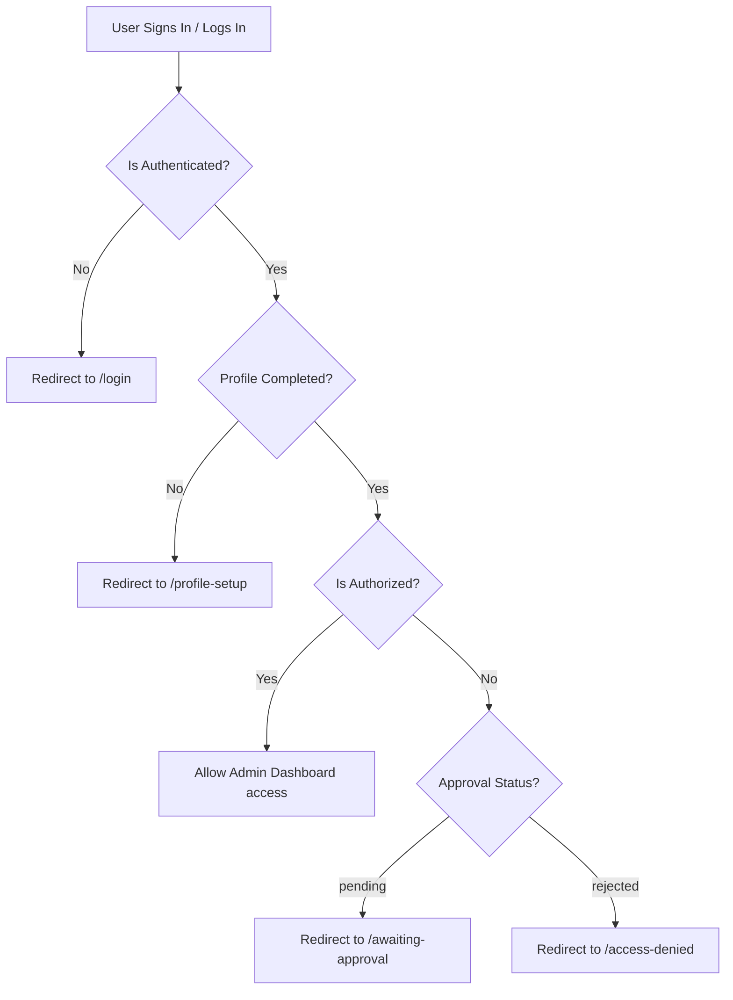

# Spec: Self-Signup Profile Onboarding Flow

## 1. Goal & Context
The current self-signup flow creates a Firebase user and a pending user document (`isAuthorized: false`), then immediately signs the user out and displays an access error page. This prevents new self-signup users from selecting their organization, setting up their profile details, or configuring their notification preferences.

This design introduces a **Self-Signup Onboarding Wizard** that captures user profiles upon initial authentication. Users will provide their full name, phone number, department, target organization (via an Organization Code/Token), and notification preferences. The user is then placed in a clean, professional "Awaiting Approval" state inside their designated organization. Organization administrators can view and approve these pending requests.

---

## 2. Core Architecture & Routing Guard Flow

We will change the entry guard logic inside the Next.js layouts (`src/app/admin/layout-client.tsx` and custom hooks/components) to handle three primary user states post-authentication:

1. **Awaiting Onboarding Form** (`profileCompleted === false`)
   * Regardless of `isAuthorized`, if they are authenticated but have not finished setting up their profile, they are redirected to `/profile-setup`.
2. **Awaiting Admin Approval** (`profileCompleted === true` and `isAuthorized === false` and `approvalStatus === 'pending'`)
   * The user has completed the wizard. They are redirected to a dedicated `/awaiting-approval` dashboard that displays their pending status and prevents access to any administrative pages or workspace data.
3. **Authorized** (`isAuthorized === true` and `approvalStatus === 'approved'`)
   * Normal access is allowed. The user is redirected to the `/admin` workspace.

### Navigation / Redirection Guard Matrix

---

## 3. Data Schema Specifications

### 3.1 Users Collection (`users/{uid}`)
We will add the following properties to the user profile document:
* **`profileCompleted`** (`boolean`): Flags whether the user completed the onboarding form.
* **`organizationId`** (`string`): The organization the user selected or matched.
* **`department`** (`string`): User-specified department (e.g., `academic`, `finance`, `operations`, `administration`).
* **`approvalStatus`** (`'pending' | 'approved' | 'rejected'`): Status of their membership request in the organization.
* **`notificationPreferences`** (`NotificationPreferences`):
  * `email` (`boolean`)
  * `sms` (`boolean`)
  * `inApp` (`boolean`)
  * `push` (`boolean`)
* **`updatedAt`** (`string`): Timestamp of the last profile modification.

### 3.2 Organizations Collection (`organizations/{orgId}`)
Administrators need a simple token/slug to share. We will support:
* **`joinToken`** (`string`): A shareable, random, or customizable short alphanumeric code (e.g. `SMART-OPS-101`) stored in the organization document. If the user enters this code, they are linked to the corresponding `organizationId`. If not set, they can use the organization's unique `slug` (e.g. `acme-corp`).

---

## 4. UI/UX Page Specifications

Adhering to our premium visual guidelines, the onboarding interface will utilize glassmorphism, harmonious HSL colors (emerald and neutral slate accents), modern typography, and smooth micro-animations.

### 4.1 Onboarding Profile Form (`/profile-setup`)
A beautiful, multi-step card layout that guides the user through setting up their account details:

* **Step 1: Organization Identification**
  * Enter **Organization ID or Join Code**.
  * Input is validated asynchronously against Firestore. Once found, it renders a subtle green success checkmark and displays: *"You are joining: [Organization Name]"*.
* **Step 2: Profile Details**
  * **Full Name** (Input with pre-filled default from auth if available).
  * **Phone Number** (Input formatted to international phone standards).
  * **Department** (Select dropdown: *Operations*, *Finance*, *HR*, *Academic*, *Technical*, *Other*).
* **Step 3: Notification Preferences**
  * Sleek toggle switches for each channel (Email, SMS, Push, In-App).
* **Step 4: Submission**
  * Activates a server action to save details and triggers the state change to `profileCompleted = true` and `approvalStatus = 'pending'`.

### 4.2 Awaiting Approval Page (`/awaiting-approval`)
A premium dashboard skeleton with a glassmorphism card containing:
* A dynamic pulsing radar animation.
* **Header**: *"Profile Setup Complete — Verification Pending"*
* **Body text**: *"Your profile has been submitted to the administrators of **[Organization Name]** for verification. You will be notified via [your chosen channels] as soon as your access is approved."*
* An options section:
  * **View Submitted Info** (Allows reviewing name, phone, department, and preferences).
  * **Sign Out** button (Signs them out and returns them to `/login`).

---

## 5. Parallel Invites Preservation

The invite-user flow remains fully functional alongside self-signup:
1. When an administrator invites a user, the system pre-registers the email and links them to the `organizationId` directly.
2. The invitation link contains `?orgId=[id]&inviteToken=[token]`.
3. When the user navigates to `/signup` via the link, the **Organization Identification** step is pre-filled and locked, bypassing manual input.
4. They complete their profile, and because they were pre-invited, they are **automatically approved** (`isAuthorized = true`) upon form submission, skipping the awaiting approval queue.

---

## 6. Admin User Approval Interface

Inside `/admin/settings/organizations` or `/admin/users`:
1. Administrators will see a **Join Code / Join Link** card where they can copy their shareable code to distribute to their team.
2. A new tab for **Pending Registrations** will show users who signed up with their Join Code:
   * Displays Name, Email, Department, and Date.
   * Actions: **Approve** (calls server action to set `isAuthorized = true` and `approvalStatus = 'approved'`) and **Reject** (sets `approvalStatus = 'rejected'`).

---

## 7. Security Rules Updates
We will update Firestore security rules (`firestore.rules`) to ensure:
1. Authenticated users can read/write their own `users/{uid}` document to submit their profile setup *even if* `isAuthorized` is false.
2. Users can read public organization metadata (only `name`, `logoUrl`, `slug` and checking `joinToken`) during validation without exposing sensitive organization files.
3. Pending users cannot access any collections inside workspaces (`workspaces/{id}/**`) until `isAuthorized === true`.
