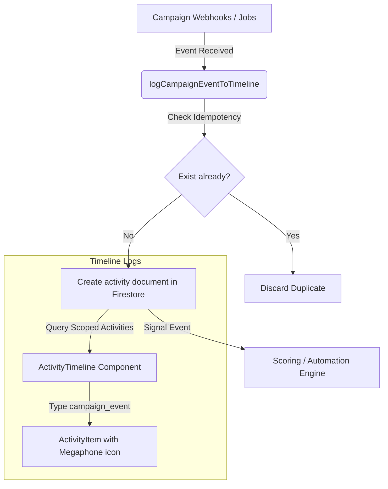

# Design Specification: Messaging Campaign Upgrades
**Date**: 2026-06-11
**Status**: APPROVED

---

## 1. Goal & Vision
Upgrade the SmartSapp Messaging Campaign Builder to integrate seamlessly with the platform's core systems: the newly reformed CRM Deals & Timelines, advanced automation pipelines, and modern UI/UX standards.

This specification covers four areas of improvements:
1.  **CRM Automation Integration**: Allowing post-send events (delivery, click, open, failure) to trigger complex CRM actions such as creating deals or assigning tasks.
2.  **Deal Timeline Integration**: Capturing and rendering campaign outreach and interaction history directly in the chronological Deal/Contact activity feeds.
3.  **A/B Testing Control**: Adding cancellation and pause/resume logic to active A/B tests to manage remainder dispatches.
4.  **UI/UX Slider Polish**: Redesigning the Step 4 test size slider into a premium, custom glassmorphic component with animated Framer Motion tooltips and quick presets.

---

## 2. Proposed System Architecture



---

## 3. Detailed Components & Data Design

### 3.1. Data Models (`PostSendActionRule`)
In `src/lib/types.ts`, we update the tagging rules schema to generic post-send action rules:

```typescript
export interface PostSendActionRule {
  id: string;
  appliesTo: 'delivered' | 'opened' | 'clicked' | 'failed';
  actionType: 'add_tag' | 'create_deal' | 'create_task';
  
  // parameters for 'add_tag'
  tagId?: string;
  tagName?: string;

  // parameters for 'create_deal'
  dealPipelineId?: string;
  dealStageId?: string;
  dealTitleTemplate?: string; // e.g. "Engaged: {{contact_name}} - {{campaign_name}}"
  
  // parameters for 'create_task'
  taskTitleTemplate?: string; // e.g. "Follow up with {{contact_name}} on campaign click"
  taskDueDateOffsetDays?: number; // e.g. 2 days
}
```

### 3.2. A/B Testing Remainder Control
In `src/lib/campaign-automation-jobs.ts`, we implement cancellation:
*   **`cancelCampaignABTest(campaignId: string): Promise<void>`**:
    1. Queries the `automation_jobs` collection for pending evaluation tasks linked to this `campaignId` with `targetNodeId: '__campaign_ab_evaluate__'`.
    2. Updates their statuses to `'cancelled'`.
    3. Updates the parent campaign status in the `message_campaigns` collection to `'paused'`.
*   **`resumeCampaignABTest(campaignId: string): Promise<void>`**:
    1. Re-queues the evaluation job in `automation_jobs`.
    2. Restores the campaign status to `'testing'`.

### 3.3. Activity Timeline Integration
In [campaign-events.ts](file:///Users/josephaidoo/Desktop/Codes/vibe%20Coding/Onboarding-Dashbaord-main/src/lib/campaign-events.ts), we inject deterministic logging:
*   **Idempotency Document Key**: `camp_${entityId}_${campaignId}_${event}`.
*   **Timeline Logs**:
    *   Creates a system audit log of `type: 'campaign_event'` in the global `activities` collection.
    *   Maps `campaign_event` type to a `Megaphone` icon in `src/lib/activity-icons.tsx`.
    *   Overrides the default system `Bot` icon with the mapped `Megaphone` icon in `ActivityItem.tsx`.

---

## 4. UI/UX Interface Polish

### 4.1. Custom Framer Motion A/B Split Slider
*   **Visual Track**: A split range track showing blue (Variant A), violet (Variant B), and slate-gray (Remainder) bar widths.
*   **Floating Tooltip**: Animated Framer Motion box hovering above the slider handle displaying:
    `A: X% | B: X% | Remainder: Y%`
*   **Preset Buttons**: Inline badge buttons to quickly select splits:
    *   `[10% Split]` (5% A / 5% B / 90% Remainder)
    *   `[20% Split]` (10% A / 10% B / 80% Remainder)
    *   `[50% Split]` (25% A / 25% B / 50% Remainder)
    *   `[100% Split]` (50% A / 50% B / 0% Remainder)

### 4.2. Action Rule Configurator (Step 4)
*   Drop-down selector maps: `WHEN [event] THEN [actionType]`.
*   Inputs display dynamically:
    *   `add_tag` $\rightarrow$ tag multi-select combobox.
    *   `create_deal` $\rightarrow$ pipeline/stage dropdown selectors.
    *   `create_task` $\rightarrow$ text input for task title template and due-date offset input.

---

## 5. Verification Plan

### 5.1. Automated Unit Tests
We will write tests in `src/lib/__tests__/campaign-integrations.test.ts` to verify:
1.  **Backwards Compatibility**: Reading legacy campaigns with simple tag rules maps cleanly to the new `add_tag` rules structure.
2.  **A/B Cancellation**: Calling `cancelCampaignABTest` successfully cancels the queue jobs and marks the campaign as `paused`.
3.  **Idempotent Timeline Logging**: Running `logCampaignEventToTimeline` multiple times does not result in duplicate timeline records.
4.  **CRM Action Execution**: Executing the automation rules fires deal creation and task assignments.

### 5.2. Manual Verification
*   Open the Campaign Wizard, enable A/B testing, and verify the sliding behavior, animated tooltip, and preset selections.
*   Configure a post-send deal creation rule, send a test campaign, open/click a link, and verify that a deal gets created in the correct stage.
*   Navigate to the Contact detail page and inspect the chronological timeline feed to check the Megaphone icons and campaign activity descriptions.
