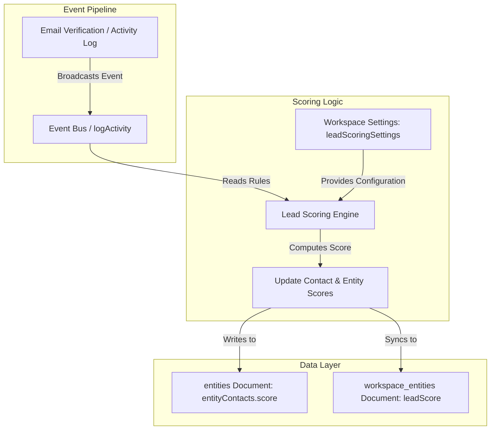

# Lead Scoring Implementation Specification

Introduce Lead Scoring into the CRM platform to track and rank contact quality. This design enables granular, multi-level scoring (contact scope vs. entity scope), automated scoring from verification events and engagements, manual automation step controls, and a dedicated cleanup dashboard.

---

## Architectural Approach: Hybrid Model



### Pros:
- **Instant Query & Sort**: Lead scores are persisted at the root of `entities` and `workspace_entities` documents, allowing O(1) reads, sorting, and filtering in the dashboard directory.
- **Unified Contact Compatibility**: Fits cleanly within the `entityContacts` array schema without requiring custom joins or new collections.
- **Audit Trails**: Changes to lead scores are logged as timeline events in the existing `activities` collection, providing a complete history of score changes.
- **No Cascade Delays**: Contact scores directly aggregate to the parent Entity score in the same Firestore transaction.

---

## Technical Specifications

### 1. Data Model Updates

#### [MODIFY] [types.ts](file:///Users/josephaidoo/Desktop/Codes/vibe Coding/Onboarding-Dashbaord-main/src/lib/types.ts)

Add the following properties to existing schemas:

```typescript
export interface EntityContact {
  // ... existing fields
  emailVerificationScore?: number; // Cache for the current verification sub-score (0-10)
  score?: number;                  // Contact scope lead score (clamped >= 0)
}

export interface Entity {
  // ... existing fields
  leadScore?: number;              // Entity scope lead score (sum of all contact scores, clamped >= 0)
}

export interface WorkspaceEntity {
  // ... existing fields
  leadScore?: number;              // Denormalized overall lead score for sorting & filtering
}

export interface EmailVerificationRule {
  minScore: number;                // Min verifier quality percentage (0-100)
  scoreValue: number;              // Lead score points to assign (0-10)
}

export interface LeadScoringSettings {
  emailVerificationRules: EmailVerificationRule[];
  engagementRules: Record<string, number>; // Maps activity type (e.g. SURVEY_SUBMITTED) to points
}

export interface Workspace {
  // ... existing fields
  leadScoringSettings?: LeadScoringSettings;
}
```

---

### 2. Logic Implementations

#### A. Email Verification Auto-Scoring
**File:** [hygiene-repository.ts](file:///Users/josephaidoo/Desktop/Codes/vibe Coding/Onboarding-Dashbaord-main/src/lib/hygiene-repository.ts)
Update `ContactHygieneRepository.commitBatch` to perform scoring updates after verifying email addresses:
1. Fetch the corresponding `Workspace` documents to read `workspace.leadScoringSettings`.
2. For each verified email address:
   - Identify the matching `EntityContact` inside the entity's `entityContacts` array.
   - Match the verifier's score (0-100) against the workspace's `emailVerificationRules` to resolve the points value (default: $\ge 90\% \rightarrow 10$ points, $\ge 40\% \rightarrow 5$ points, others $\rightarrow 0$).
   - Prevent double-counting: Subtract the contact's old `emailVerificationScore` (or 0) and add the new points value.
   - Adjust the contact's overall `score` field, clamping it at $\ge 0$.
   - Recalculate the overall Entity `leadScore` as the sum of all its contacts' scores.
   - Update both the `entities` document and the `workspace_entities` documents in the batched transaction.

#### B. Global Engagement Scoring
**File:** [activity-logger.ts](file:///Users/josephaidoo/Desktop/Codes/vibe Coding/Onboarding-Dashbaord-main/src/lib/activity-logger.ts)
Update `logActivity` to automatically trigger engagement-based scoring:
1. Read the active workspace's `leadScoringSettings.engagementRules` (e.g., `{'survey_submitted': 15, 'campaign_opened': 2}`).
2. If the logged activity type matches a configured rule:
   - Resolve the target contact from the event payload (matches email or contact ID).
   - Fetch the entity document, find the target contact in `entityContacts`, and update `contact.score += engagementPoints` (clamped at 0).
   - Sum contacts to update `entity.leadScore`.
   - Save to both `entities` and `workspace_entities`.
   - Log a nested activity event (`type: 'lead_score_updated'`) with `isAutomation: true` to prevent infinite audit trigger loops.

#### C. Automation Action (`UPDATE_LEAD_SCORE`)
**Files:**
- [index.ts](file:///Users/josephaidoo/Desktop/Codes/vibe Coding/Onboarding-Dashbaord-main/src/lib/automations/actions/index.ts)
- [entity-actions.ts](file:///Users/josephaidoo/Desktop/Codes/vibe Coding/Onboarding-Dashbaord-main/src/lib/automations/actions/entity-actions.ts)

Implement a server action `handleUpdateLeadScore(config, context)`:
- Config: `{ operation: 'add' | 'subtract' | 'set', value: number | string }`
- Logic:
  1. Retrieve the entity ID and workspace ID from the execution context.
  2. Resolve the triggering contact (matching by email/contactId in `context.payload`), falling back to the designated primary contact or the first contact in `entityContacts`.
  3. Parse the resolved config `value` as a number (variables are pre-resolved in `resolveConfigVariables`).
  4. Perform the operation:
     - `add`: `score = (score || 0) + value`
     - `subtract`: `score = (score || 0) - value` (clamp $\ge 0$)
     - `set`: `score = value`
  5. Recalculate Entity overall `leadScore`.
  6. Commit changes to Firestore.
  7. Log the score update activity.

---

### 3. UI and Canvas Components

#### A. Automation Builder
- **Step Library**: Register `UPDATE_LEAD_SCORE` under `contacts_data` in [AutomationStepLibraryModal.tsx](file:///Users/josephaidoo/Desktop/Codes/vibe Coding/Onboarding-Dashbaord-main/src/app/admin/automations/components/AutomationStepLibraryModal.tsx):
  ```typescript
  {
    id: 'update_lead_score',
    title: 'Adjust Lead Score',
    description: 'Add, subtract, or set the lead score of the contact, which automatically updates the parent entity score.',
    category: 'contacts_data',
    icon: Target,
    nodeType: 'actionNode',
    payload: { type: 'actionNode', label: 'Adjust Lead Score', actionType: 'UPDATE_LEAD_SCORE' }
  }
  ```
- **Node Renderer**: Add a case in `ActionNode.tsx` to display the description of the adjustment node (e.g. `Add 10 to lead score` or `Set lead score to 100`).
- **Config Sidebar**: Add the `UPDATE_LEAD_SCORE` config panel form in [ActionConfigPanel.tsx](file:///Users/josephaidoo/Desktop/Codes/vibe Coding/Onboarding-Dashbaord-main/src/app/admin/automations/components/ActionConfigPanel.tsx) with a Select input for the operation (`Add`, `Subtract`, `Set`) and a MappableInputField for the score value.

#### B. Lead Scoring Cleanup & Config Page
**File:** `src/app/admin/entities/lead-scoring/page.tsx`
Create a high-fidelity dashboard page following `frontend-design` aesthetics:
- **Design Tone**: Sleek Dark Mode with Glassmorphism highlights. High contrast metrics cards and clean staggered borders.
- **Top KPI Row**:
  - Total Scored Leads
  - Average Lead Score
  - Hot Leads Count ($\ge 80$)
  - Cold Leads Count ($< 15$)
- **Data Table (Leads List)**:
  - Lists Workspace Entities having `leadScore > 0` (or showing all).
  - Expandable row details: reveals the individual sub-contacts, their role, email, and contact-level scores.
  - Interactive Action Panel:
    - **Archiving**: One-click archive button to soft delete cold leads ($< 15$) in bulk or individually.
    - **Reset**: Reset lead scores back to 0.
    - **Adjust**: Manually trigger a score override modal for quick fixes.
- **Settings Panel**:
  - Form to update the workspace's verification score thresholds.
  - Tab list to assign positive/negative weights to triggers (Survey, Opens, Clicks).

---

## Verification Plan

### Automated Tests
- Create unit test `src/lib/__tests__/lead-scoring.test.ts` to assert:
  - Correct execution of `handleUpdateLeadScore` action node.
  - Proper double-counting prevention and clamping of scores at 0.
  - Verification-based scores mapping correctly from workspace setting.
  - `logActivity` event mapping applying points to correct contact.

### Manual Verification
- Deploy to local dev. Create an automation with the "Adjust Lead Score" action and run it.
- Verify changes reflect in the Firestore database under `entities` and `workspace_entities`.
- Open the dedicated `/admin/entities/lead-scoring` page and test sorting, filtering, manual score adjustments, and bulk cleanup functions.
