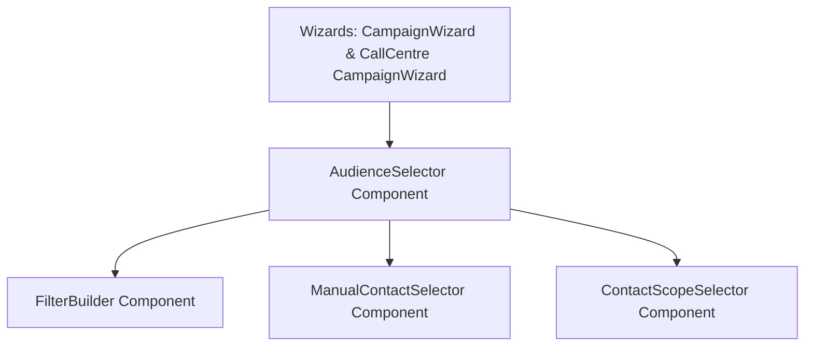

# Design Specification: Unified Audience Selector Refactoring

**Date**: 2026-06-13  
**Status**: Proposal  
**Authors**: Antigravity (Google DeepMind Team)  

---

## 1. Overview & Objectives

Currently, the messaging (email/sms) campaign wizard uses a comprehensive, multi-mode audience selector (`FilterBuilder`, `ManualContactSelector`, `ContactScopeSelector`), while the Call Centre campaign wizard uses a simplified, tag-only segment filter. 

To ensure layout consistency and guarantee that future UI enhancements automatically apply to both wizards, we will extract this unified filtering interface into a single reusable component: `AudienceSelector`.

### Key Goals:
1. **Consistency**: Maintain a single source of truth for the segment selection UI.
2. **Feature Parity**: Enable the same 4 audience modes (All Workspace, By Filters, Saved Audience, Manual Pick) in both wizards.
3. **Channel-aware Filter Logic**: Limit query pre-rendering/manual list extraction based on the active campaign channel (`email`, `sms`, `call`). Outbound calling will be treated similarly to `sms`, focusing on contacts with phone numbers.
4. **Performance & Memoization**: Avoid redundant rendering cycles by applying proper memoization and following `vercel-react-best-practices` (e.g. `useMemoFirebase` for queries, hoisting static configuration, etc.).

---

## 2. Architecture & Component Decomposition

We will refactor the existing code into three distinct layers:



### Shared Component Module Layout
* **`src/app/admin/messaging/audiences/components/ContactScopeSelector.tsx` [NEW]**: Extracted from `campaign-wizard.tsx`. Manages scope selection (Primary, Signatories, Broadcast).
* **`src/app/admin/messaging/audiences/components/ManualContactSelector.tsx` [NEW]**: Extracted from `campaign-wizard.tsx`. Handles list search, pagination, and toggle selections.
* **`src/app/admin/messaging/audiences/components/AudienceSelector.tsx` [NEW]**: The wrapper component encapsulating segment tabs, conditional render states, and preview reach summary.

---

## 3. Component Interface Spec

### `AudienceSelectorProps`
```typescript
import type { AudienceFilter, ConditionGroup } from '@/lib/types';

export interface AudienceSelectorProps {
  workspaceId: string;
  organizationId: string;
  channel: 'email' | 'sms' | 'call';
  
  // State
  audienceMode: 'all' | 'advanced' | 'saved' | 'manual';
  filters: AudienceFilter[];
  filterLogic: 'AND' | 'OR';
  groups?: ConditionGroup[];
  savedAudienceId: string;
  selectedContacts: Array<{
    entityId: string;
    contactId: string;
    name?: string;
    email?: string;
    phone?: string;
    entityName?: string;
  }>;
  contactScope: 'primary' | 'signatories' | 'all' | (string & {});
  
  // Updates
  onChange: (updates: {
    audienceMode?: 'all' | 'advanced' | 'saved' | 'manual';
    filters?: AudienceFilter[];
    filterLogic?: 'AND' | 'OR';
    groups?: ConditionGroup[];
    savedAudienceId?: string;
    selectedContacts?: any[];
    contactScope?: any;
  }) => void;
}
```

---

## 4. Performance & Best Practices (Vercel & Next.js Guidelines)

* **`rerender-defer-reads` & `rerender-memo`**: Wrap nested items (like row list renderers in `ManualContactSelector`) with `React.memo` to prevent cascading component re-renders when inputs or pagination change.
* **`useMemoFirebase`**: Ensure all Firestore queries inside `AudienceSelector` sub-components (such as querying saved audiences) use `useMemoFirebase` to prevent subscription recreation.
* **RSC Boundaries**: Ensure all shared selectors are clearly marked with `'use client'` to separate them from server actions.

---

## 5. Verification Plan

1. **Unit Tests**:
   - Verify that all unit tests inside `src/lib/__tests__/call-centre.test.ts` pass after campaign state changes.
2. **Compilation**:
   - `pnpm typecheck` must run cleanly without errors.
   - `pnpm lint` must run without warnings/errors in modified files.
3. **Manual Validation**:
   - Ensure the calling wizard step 3 displays the 4 segments correctly.
   - Verify that clicking different filters updates the reach projection count.
