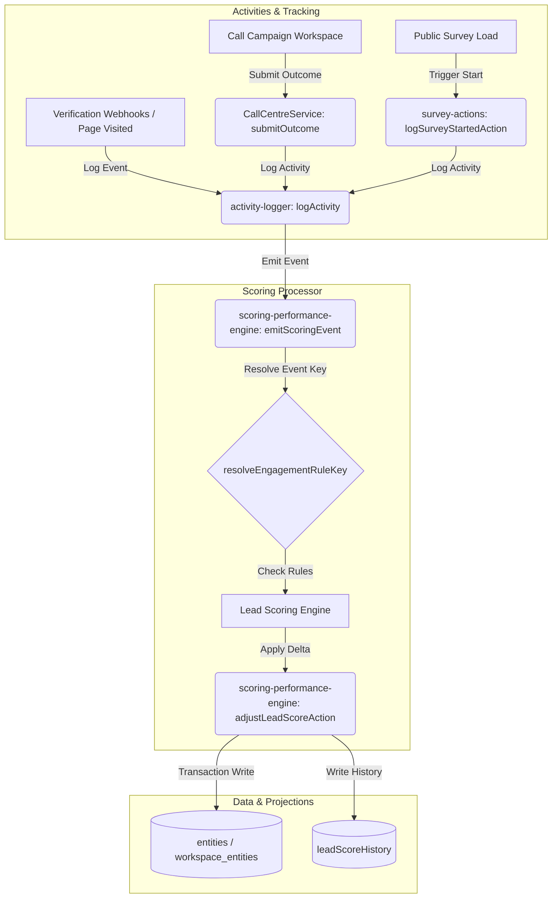

# Expanded Lead Scoring Implementation Specification

Introduce expanded lead scoring criteria, positive/negative scoring parameters, automatic call outcome validation rules, real-time event-bus triggers, and lead-score visualizations across the directory and console dashboard.

---

## Architectural Approach



---

## Technical Specifications

### 1. Data Model Updates

#### [MODIFY] [types.ts](file:///Users/josephaidoo/Desktop/Codes/vibe Coding/Onboarding-Dashbaord-main/src/lib/types.ts)
Add properties to `LeadScoringSettings` to support call outcome classifications:
```typescript
export interface LeadScoringSettings {
  emailVerificationRules: EmailVerificationRule[];
  phoneVerificationRules: PhoneVerificationRule[];
  engagementRules: Record<string, number>; // Maps activity keys to score adjustments
  callCampaignPositiveOutcomes?: string[]; // List of outcome strings treated as positive
  callCampaignDefaultPoints?: number;       // Default score points for positive call outcomes
}
```

---

### 2. Logic Implementations

#### A. Event Mapping & Key Resolution
**File:** [scoring-performance-engine.ts](file:///Users/josephaidoo/Desktop/Codes/vibe Coding/Onboarding-Dashbaord-main/src/lib/scoring-performance-engine.ts)
Implement `resolveEngagementRuleKey(eventType: string, metadata?: Record<string, unknown>): string` to translate raw activity parameters into configured lead-scoring mapping keys:
*   `campaign_event` (where `metadata` holds details):
    *   `channel === 'email' && event === 'failed'` \(\rightarrow\) `'email_bounced'`
    *   `channel === 'sms' && event === 'failed'` \(\rightarrow\) `'sms_failed'`
    *   `channel === 'sms' && event === 'clicked'` \(\rightarrow\) `'sms_link_clicked'`
*   `webpage_visited` \(\rightarrow\) `'page_visited'`
*   `button_clicked` \(\rightarrow\) `'button_clicked'`
*   `survey_started` \(\rightarrow\) `'survey_started'`
*   `form_submission` \(\rightarrow\) `'survey_completed'`
*   `pdf_form_submitted` or `form_submitted` \(\rightarrow\) `'document_signed'`
*   `call_completed` \(\rightarrow\) Check call outcome positive classification (see below).

#### B. Call Outcome Resolution
In `emitScoringEvent`, if the event type resolves to `call_completed`:
1.  Check `workspace.leadScoringSettings.engagementRules` for an explicit outcome mapping rule key: `call_outcome:${outcomeValue}`. If found, adjust the score by this specific value.
2.  If no explicit outcome mapping is found, check if the outcome value is listed in the workspace's `callCampaignPositiveOutcomes` array. If yes, award the default points stored in `callCampaignDefaultPoints`.

#### C. Survey Start Event Logging
**File:** [survey-actions.ts](file:///Users/josephaidoo/Desktop/Codes/vibe Coding/Onboarding-Dashbaord-main/src/lib/survey-actions.ts)
Create a server action `logSurveyStartedAction(params)` that logs an activity of type `'survey_started'`.
**File:** [survey-display.tsx](file:///Users/josephaidoo/Desktop/Codes/vibe Coding/Onboarding-Dashbaord-main/src/app/surveys/[slug]/components/survey-display.tsx)
In the client-side component's `useEffect` mount flow: if the url context has a valid `ref` (contact is resolved) and it is not preview mode, invoke `logSurveyStartedAction` asynchronously.

---

### 3. UI and Directory Updates

#### A. Settings / Mapping Panel
**File:** [page.tsx](file:///Users/josephaidoo/Desktop/Codes/vibe Coding/Onboarding-Dashbaord-main/src/app/admin/entities/lead-scoring/page.tsx)
*   Update `COMMON_ENGAGEMENTS` list with all new keys.
*   Format engagement rule cards: style the input borders/badges dynamically using `rose-500/10` for negative score deltas and `emerald-500/10` for positive score deltas.
*   Add a Call Campaigns section containing:
    *   A multiselect pill-input to add outcomes to `callCampaignPositiveOutcomes`.
    *   An input for `callCampaignDefaultPoints`.

#### B. Entity Directory View
**File:** [EntitiesClient.tsx](file:///Users/josephaidoo/Desktop/Codes/vibe Coding/Onboarding-Dashbaord-main/src/app/admin/entities/EntitiesClient.tsx)
*   Insert a sortable `Lead Score` table column next to "Status".
*   Display dynamic heat badges:
    *   \(\ge 80\): `🔥 [Score] HOT` (rose color)
    *   \(15\text{--}79\): `⚡ [Score] WARM` (amber color)
    *   \(< 15\): `❄️ [Score] COLD` (slate/blue color)

#### C. Entity Console Page
**File:** [[id]/page.tsx](file:///Users/josephaidoo/Desktop/Codes/vibe Coding/Onboarding-Dashbaord-main/src/app/admin/entities/[id]/page.tsx)
*   Render a metric card showing aggregate lead score (`weData.leadScore`) in the summary indicators row at the top.

#### D. Contact Cards Directory
**File:** [EntityContactDirectory.tsx](file:///Users/josephaidoo/Desktop/Codes/vibe Coding/Onboarding-Dashbaord-main/src/app/admin/entities/components/EntityContactDirectory.tsx)
*   Display contact score badge next to roles inside `ContactRow` component.

---

## Verification Plan

### Automated Tests
*   Run unit test `src/lib/__tests__/lead-scoring-rules.test.ts` to assert:
    *   `resolveEngagementRuleKey` parses events and campaign sub-metadata correctly.
    *   Outcome override priorities evaluate correctly.
    *   Delta increments are applied transactionally.

### Manual Verification
*   Create a mock lead and verify that navigating to its public survey with a tracking token logs a `survey_started` event and increments lead score.
*   Edit engagement rules in the scoring console, save configuration, and review layout colors.
