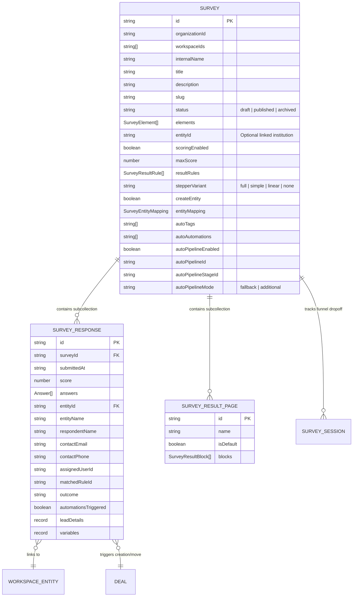

# Comprehensive Architecture & Capabilities Report: Enterprise Survey Subsystem

**System**: SmartSapp Multi-Tenant Onboarding & Experience Engine  
**Module**: Survey Architecture, Public Runtime, Admin Studio, AI Copilot & CRM Intelligence Subsystem  
**Reviewer Role**: Senior Principal Systems Architect & Staff Code Reviewer  
**Status**: Production-Grade & Verified  

---

## 1. Executive Summary & High-Level System Topology

The **Survey Subsystem** is an enterprise-grade, multi-tenant survey creation, scoring, public runtime, identity attribution, and CRM automation engine built with **Next.js (App Router, Server Actions, React Server Components)** and **Firebase (Cloud Firestore, Storage, Authentication)**.

```
┌─────────────────────────────────────────────────────────────────────────────────────────────────────────┐
│                                       SURVEY MODULE SYSTEM TOPOLOGY                                     │
├──────────────────────────────────┬─────────────────────────────────────┬────────────────────────────────┤
│       1. PUBLIC RUNTIME          │         2. ADMIN STUDIO             │        3. AI & AUTOMATION      │
│  • Next.js RSC & Dynamic Routes  │  • Multi-Step Visual Builder        │  • 3-Phase Chunked Generator   │
│  • Encrypted URL Identity Token  │  • Dnd-Kit Reordering Canvas        │  • Conversational Copilot      │
│  • Client-Side Variable Context  │  • Slash "/" Variable Autocomplete  │  • NL Response Data Querying   │
│  • 4 Stepper Presentation Modes  │  • Live Simulation Pane             │  • Executive AI Summarizer     │
│  • Conditional Skip/Jump Logic   │  • Unified <TagSelector> Client     │  • Multi-Channel Alert Engine  │
│  • Multi-File Upload & Media     │  • Result Page & Logic Rules        │  • Deal Pipeline Routing       │
└──────────────────────────────────┴─────────────────────────────────────┴────────────────────────────────┘
```

### Architectural Highlights
- **Zero-Trust Multi-Tenant Isolation**: Enforces tenant boundaries via `workspaceIds` array containment and `workspaceId` matching across all Firestore queries, security rules, and server actions.
- **Single Source of Truth for Variables & Tags**: Server-side substitutions route exclusively through `FieldsVariablesService`. Client-side tag management routes exclusively through `<TagSelector>` in client/draft mode.
- **3-Phase Chunked AI Generation**: Splits complex survey synthesis into Blueprint Outline, Question Generation, and Logic/Scoring phases to prevent LLM token exhaustion and HTTP gateway timeouts.
- **Atomic CRM & Deal Lifecycle Sync**: Submissions automatically perform deduplicated CRM entity matching, pipeline stage progression, and media asset registration.

---

## 2. Full Capabilities Matrix & Functional Specifications

| Subsystem Component | Capabilities & Functional Specifications | Key Code References |
| :--- | :--- | :--- |
| **Public Survey Runtime** | Dynamic route `/surveys/[slug]` with `force-dynamic` rendering. Single-pass data fetching via `React.cache(getSurveyBySlug)`. Decrypts URL identity tokens (`decryptToken`), resolves cookie contexts (`resolveOnboardingContext`), and injects preloaded CRM variables into `SurveyVariableProvider`. Supports fullscreen, embedded (`iframe`), and modal presentations. | `src/app/surveys/[slug]/page.tsx`<br>`src/app/surveys/[slug]/components/survey-display.tsx` |
| **Form Renderer & 4 Stepper Modes** | Supports 4 distinct stepper presentations:<br>1. **`full`**: Detailed section progress bar with step headers.<br>2. **`simple`**: Animated pill dots indicator.<br>3. **`linear`**: Minimalist progress percentage bar with section titles.<br>4. **`none`**: Streamlined zero-header survey experience.<br>Supports multi-page section breaks (`renderAsPage`), strict section validation (`validateBeforeNext`), and instant auto-advancing on choice selection. | `src/app/surveys/[slug]/components/survey-form.tsx`<br>`src/app/admin/surveys/components/survey-preview-renderer.tsx` |
| **Logic & Condition Engine** | Pure functional syncing (`syncElementsOnOptionChange`) and client evaluation. Operators include `isEqualTo`, `isNotEqualTo`, `contains`, `doesNotContain`, `startsWith`, `endsWith`, `isEmpty`, `isNotEmpty`, `isGreaterThan`, and `isLessThan`. Actions include `jump`, `require`, `show`, `hide`, and `disableSubmit`. | `src/lib/survey-logic-utils.ts`<br>`src/app/surveys/[slug]/components/survey-form.tsx` |
| **Scoring & Assessment System** | Weighted option scores (`optionScores`), Boolean points (`yesScore`, `noScore`), and total score calculation. Displays results via `points` or `percentage` with dynamic canvas confetti celebration and ranking comparisons. | `src/app/surveys/[slug]/result/components/ResultRenderer.tsx`<br>`src/lib/survey-analytics-utils.ts` |
| **File Upload & Media Ingestion** | Preset format bundles (`all`, `spreadsheets`, `documents`, `images`, `archives`, `custom`). Validates MIME types, custom file extensions (`.pdf`, `.xlsx`, `.csv`), and enforces file size limits (e.g. 25MB). Auto-registers uploaded files into the workspace `media` collection. | `src/lib/survey-file-utils.ts`<br>`src/lib/survey-actions.ts` |
| **Result Page Builder** | Modular outcome page builder featuring 14 block types: `heading`, `text`, `image`, `video`, `audio`, `button`, `quote`, `divider`, `score-card`, `list`, `logo`, `header`, `footer`, `outcome-categories`, and `code`. Supports actionable CTA buttons that execute background tag mutations and automation triggers upon navigation. | `src/app/admin/surveys/components/result-page-builder.tsx`<br>`src/app/surveys/[slug]/result/components/ResultRenderer.tsx` |
| **Attribution & Field Team** | Tracking link generator appending encrypted tokens (`?ref=...`). Field Team yield analytics tracks total responses, converted CRM leads, and conversion percentages by agent. | `src/lib/survey-analytics-utils.ts`<br>`src/app/admin/surveys/[id]/results/components/field-team-view.tsx` |

---

## 3. CRM, Pipeline & Enterprise System Integrations

### 3.1 Entity Matching, Deduplication & Identity Protection
Submissions link into the CRM via a 4-tier deduplication pipeline:
1. **Pre-Tracked Entity Reference**: Extracted from decrypted link token (`contactId:entityId`).
2. **Contact Identifier Match**: Queries `contacts` collection for exact phone or email match.
3. **Workspace Entity Name Match**: Exact normalized name search within `workspace_entities`.
4. **Graceful Duplicate Fallback**: Captures `createEntityAction` duplicate conflict signals and routes safely to `updateEntityAction`.

> [!IMPORTANT]
> **Entity Display Name Protection**: `sanitizeEntityPayloadForUpdate` ensures that generic choice values (e.g., `"Yes"`, `"Later"`, `"Option 1"`) or unmapped question responses NEVER overwrite legitimate CRM entity names during updates.

### 3.2 Atomic Deal Pipeline Progression
`addOrMoveEntityInPipeline` in `src/lib/survey-actions.ts`:
- Normalizes entity IDs to prevent double workspace prefixing (`cleanEntityId`).
- Checks for open deals in target `workspaceId` and `pipelineId`.
- **Open Deal Found**: Atomically updates stage (`stageId`, `stageName`), appends plain-text formatted score summary (`[Survey Score Update]`), and updates custom fields. Logs `deal_stage_changed` on the CRM timeline.
- **No Open Deal**: Automatically creates a new deal via `createDeal` with initial survey score metadata and suppressed duplicate automation loops.

### 3.3 High-Load Batch Chunking & Tag Sync
In `src/lib/survey-entity-actions.ts`:
- Bulk actions enforce Cloud Firestore's 30-item limit for `in` query filters by chunking `entityIds` into slices of 30 items (`cleanEntityIds.slice(i, i + 30)`).
- Atomically synchronizes both `tagIds` and `workspaceTags` using `FieldValue.arrayUnion`.
- Strictly routes user tag selection via standardized `<TagSelector>` in client/draft mode.

### 3.4 Multi-Channel Notification Dispatch
Post-submission dispatch (`triggerPostSubmissionAutomations`) coordinates:
1. **Webhook Execution**: Protected server-side dispatch to configured webhook endpoint.
2. **Outcome-Specific Messaging**: Dispatches templated emails, SMS, or WhatsApp via `sendMessage`.
3. **Internal Team Alerts**: Multi-channel alerts (`email`, `sms`, `whatsapp`, `both`, `all`) dispatched via `triggerInternalNotification`.
4. **External Stakeholder Alerts**: Filtered by contact type / roles via `triggerExternalNotification`.
5. **Assigned Rep Alerts**: Direct SMS/email notification to the specific user whose link was used.
6. **Global Event Protocol**: Triggers `SURVEY_SUBMITTED` event in the central `automation-processor`.

---

## 4. AI Subsystem Architecture & Capabilities

```
┌────────────────────────────────────────────────────────────────────────────────────────────────────────┐
│                                   AI SUBSYSTEM PIPELINE FLOW                                           │
├────────────────────────────┬────────────────────────────┬──────────────────────────────────────────────┤
│ Phase 1: Blueprint         │ Phase 2: Questions         │ Phase 3: Logic & Scoring                     │
│ • Input: Text/URL/Doc      │ • Input: Blueprint + Source│ • Input: Blueprint + Elements + Source       │
│ • Schema: BlueprintOutput  │ • Schema: QuestionsOutput  │ • Schema: LogicScoringOutput                 │
│ • Extracts: Sections,      │ • Extracts: Layout blocks, │ • Extracts: Scoring rules, outcome pages,    │
│   titles, descriptions,    │   questions, and 100% of   │   branching logic blocks, and action         │
│   stepper outline          │   options & choices        │   buttons                                    │
└────────────────────────────┴────────────────────────────┴──────────────────────────────────────────────┘
```

### 4.1 Chunked Generation Flow (`generate-survey-chunked-flow.ts`)
- Solves LLM generation token limits by splitting generation into 3 isolated phases.
- Merges phases seamlessly into a complete Firestore-ready Survey object via `src/ai/utils/merge-survey-phases.ts`.
- Integrated exponential backoff with per-phase retry state caching in the client UI.

### 4.2 Conversational AI Copilot (`modify-survey-flow.ts`)
- Accepts natural language instructions, current survey JSON state, and multimodal attachments (PDF/Images).
- Enforces strict architectural rules:
  - Preserves exact source copy in instruction blocks.
  - Converts bulleted lines into dedicated `list` blocks.
  - Enforces Title Case on headings and buttons.
  - Places `outcome-categories` blocks immediately beneath `score-card` widgets.
  - Generates valid `targetElementId` pointers for all logic blocks.

### 4.3 AI Analytics & NL Data Querying
- **`generate-survey-summary-flow.ts`**: Synthesizes response distributions, highlights critical anomalies, and produces executive HTML summaries with actionable takeaways.
- **`query-survey-data-flow.ts`**: Answers ad-hoc natural language questions across all response records with quantitative percentages and qualitative theme identification.
- **Multi-Provider Fallback**: Supports native Genkit (Anthropic Claude 3.5 Sonnet / Gemini) and custom OpenRouter endpoints (`openrouter/free`).

---

## 5. UI/UX, Design Systems & Motion Architecture

### 5.1 Ergonomics & Mobile-First Touch Standards
- All clickable elements (buttons, inputs, select triggers, table actions) enforce `min-h-[44px]` touch targets.
- Interactive components use active compression scaling (`active:scale-[0.97]`).
- Clean visual states with dark mode tokens (`hsl(var(--primary))`), glassmorphism card backgrounds (`backdrop-blur-sm`), and responsive typography.

### 5.2 Dynamic Theming & Live Host Communication
- The public survey runtime injects dynamic CSS custom properties derived from organization branding hex colors:
  - Dynamically calculates HSL channel values for `--primary` and `--secondary`.
  - Calculates YIQ contrast ratios (`yiq >= 140 ? "#020617" : "#ffffff"`) to guarantee WCAG AAA text contrast on primary buttons.
- Supports cross-origin `postMessage` listener for embedded iframe theme synchronization (`theme_change`).
- Embedded iframe height reporting via `useIframeHeightReporter` eliminates nested scrollbars.

### 5.3 Live Preview & Simulation
- The builder studio integrates `LivePreviewPane` with real-time viewport switching (Desktop, Tablet, Mobile).
- Includes an Entity Simulation Dropdown that allows administrators to preview variable interpolation against real CRM entities and contacts in real time.

---

## 6. Complete Data Model & Firestore Schema Specifications



---

## 7. Code Review Findings & Alignment Verification

### 7.1 Verified Recent Updates
- **Adaptive Entity Actions**: Row actions dynamically adjust between CRM entities and anonymous respondents.
- **Bulk Actions Dock**: Floating bottom bar with 30-item Firestore batch chunking and dual `tagIds`/`workspaceTags` synchronization.
- **Atomic Pipeline Updates**: `updateDealStageAction` atomically handles stage, status, loss reasons, and stage-entry automations.
- **OWASP CSV Protection**: Exports neutralize formula injection characters (`=`, `+`, `-`, `@`, `\t`, `\r`, `\n`).
- **Strict Typing (Zero-`any`)**: Complete TypeScript coverage across variable interpolation, response processing, and server actions.

---

## 8. Strategic Roadmap & Architectural Improvement Recommendations

```
┌────────────────────────────────────────────────────────────────────────────────────────────────────────┐
│                                 SURVEY MODULE ARCHITECTURAL ROADMAP                                     │
├─────────────────────────┬──────────────────────────────┬───────────────────────────────────────────────┤
│ Immediate (Q1)          │ Medium-Term (Q2)             │ Strategic Long-Term (Q3-Q4)                   │
│ • Modularize actions.ts │ • Edge caching for public    │ • Real-time collaborative survey builder      │
│ • Split question editor │   published survey layouts   │ • Offline PWA submission with IndexedDB sync  │
│ • Exponential backoff   │ • Automated A/B variant test │ • AI adaptive question routing based on       │
│   on result reads       │   reporting for survey slugs │   in-flight response sentiment                │
└─────────────────────────┴──────────────────────────────┴───────────────────────────────────────────────┘
```

### Key Recommendations for the Domain Expert
1. **Modularize `src/lib/survey-actions.ts`**: Decompose the 2,500-line server action file into domain-specific modules (`survey-submission-actions.ts`, `survey-automation-actions.ts`, `survey-pipeline-routing.ts`, `survey-media-sync.ts`).
2. **Decompose Builder Components**: Refactor `question-editor.tsx` (111 KB) and `result-page-builder.tsx` (107 KB) into dedicated question-type subcomponents.
3. **Edge-Cached Metadata & Static Shells**: Implement Next.js ISR (`revalidate = 300` or `revalidateTag`) for published survey layouts while preserving dynamic client hydration for respondent variable personalization.
4. **Offline Field Survey PWA**: Add service workers and IndexedDB storage to `survey-form.tsx` for zero-connectivity field data collection.
5. **AI Adaptive In-Flight Questioning**: Allow the runtime logic engine to dynamically generate follow-up clarifying questions in real-time when low-confidence or negative sentiment ratings are detected on critical assessment questions.
