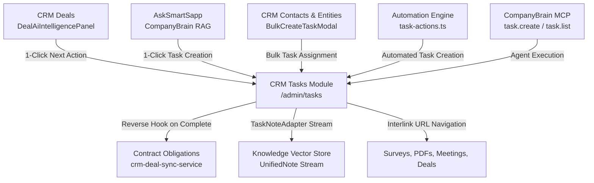

# Comprehensive Architectural Analysis & Code Review: Tasks Module

**Document Version:** 1.0.0  
**Target Audience:** Principal Architects, Senior Engineers, and Product Leadership  
**Scope:** Operational CRM Tasks, Cross-Module Integrations, AI Capabilities, Security Boundary, UI/UX, and Platform Architecture  
**Status:** Audit & Architecture Baseline  

---

## Table of Contents

1. [Executive Summary](#1-executive-summary)
2. [Task Subsystems Taxonomy](#2-task-subsystems-taxonomy)
3. [Senior Code Review & Workspace Rule Compliance](#3-senior-code-review--workspace-rule-compliance)
   - 3.1. [Critical Vulnerabilities & Security Boundaries](#31-critical-vulnerabilities--security-boundaries)
   - 3.2. [Dual Mutation Architecture Flaw (Client SDK vs Server Actions)](#32-dual-mutation-architecture-flaw-client-sdk-vs-server-actions)
   - 3.3. [Strict Typing Audit (`any` & `any[]` Violations)](#33-strict-typing-audit-any--any-violations)
   - 3.4. [Fields & Variables Compliance](#34-fields--variables-compliance)
   - 3.5. [Tag Selection Compliance](#35-tag-selection-compliance)
   - 3.6. [Actionable Error & Toast Navigation Compliance](#36-actionable-error--toast-navigation-compliance)
   - 3.7. [Mobile, Touch Targets & Accessibility (A11y)](#37-mobile-touch-targets--accessibility-a11y)
   - 3.8. [Performance, Query Limits & Scalability Hazards](#38-performance-query-limits--scalability-hazards)
4. [Current Capabilities Breakdown](#4-current-capabilities-breakdown)
   - 4.1. [Multi-View Task Registry (List, Board, Calendar)](#41-multi-view-task-registry-list-board-calendar)
   - 4.2. [Temporal Interval Filtering & Period Navigation](#42-temporal-interval-filtering--period-navigation)
   - 4.3. [Multi-Select & Bulk Operations Engine](#43-multi-select--bulk-operations-engine)
   - 4.4. [Task Lifecycle & 2-Step Configuration Modal](#44-task-lifecycle--2-step-configuration-modal)
   - 4.5. [KPI Analytics & Performance Metrics](#45-kpi-analytics--performance-metrics)
5. [Cross-Module Integrations & Bi-Directional Hooks](#5-cross-module-integrations--bi-directional-hooks)
   - 5.1. [CRM Entities & Unified Contact Model](#51-crm-entities--unified-contact-model)
   - 5.2. [CRM Deals & Pipeline Acceleration](#52-crm-deals--pipeline-acceleration)
   - 5.3. [DocSigning & Contract Obligation Reverse Hook](#53-docsigning--contract-obligation-reverse-hook)
   - 5.4. [Surveys & Form Submissions](#54-surveys--form-submissions)
   - 5.5. [Automation Engine & Protocol Workflows](#55-automation-engine--protocol-workflows)
   - 5.6. [Quick Notes & Workspace Knowledge RAG (Task Note Adapter)](#56-quick-notes--workspace-knowledge-rag-task-note-adapter)
6. [Artificial Intelligence (AI) Capabilities](#6-artificial-intelligence-ai-capabilities)
   - 6.1. [Governed MCP Tools (`task.list`, `task.create`)](#61-governed-mcp-tools-tasklist-taskcreate)
   - 6.2. [CompanyBrain RAG & Knowledge Conversion to Action](#62-companybrain-rag--knowledge-conversion-to-action)
   - 6.3. [Deal AI Intelligence & Next-Best-Action Synthesis](#63-deal-ai-intelligence--next-best-action-synthesis)
   - 6.4. [Cloud Tasks Worker for Asynchronous Agent Multi-Step Execution](#64-cloud-tasks-worker-for-asynchronous-agent-multi-step-execution)
7. [UI & UX Design Architecture](#7-ui--ux-design-architecture)
   - 7.1. [Component Hierarchy & State Flow](#71-component-hierarchy--state-flow)
   - 7.2. [Design Tokens & Theme Consistency](#72-design-tokens--theme-consistency)
   - 7.3. [Micro-Interactions & Animation Patterns](#73-micro-interactions--animation-patterns)
   - 7.4. [Simple View vs Detailed View Density](#74-simple-view-vs-detailed-view-density)
8. [Data Model & Database Schema Reference](#8-data-model--database-schema-reference)
9. [Prioritized Recommendations & Architectural Modernization Roadmap](#9-prioritized-recommendations--architectural-modernization-roadmap)

---

## 1. Executive Summary

The **Tasks Module** in this platform serves as the central operational execution nervous system. It bridges strategic CRM workflows (deals, contacts, contract obligations, and form submissions) with tactical daily human action items and automated protocol interventions.

From an architectural standpoint, the tasks domain has undergone significant hardening in recent updates (e.g., introduction of `@/lib/tasks/task-core.ts` with tenant containment, session authorization guards in `@/lib/task-server-actions.ts`, and Zod request sanitization in REST endpoints). However, a deep code review reveals **critical architectural bifurcations**:
1. **Legacy direct-to-Firestore client mutations (`src/lib/task-actions.ts`) coexist with protected Server Actions (`src/lib/task-server-actions.ts`)**, causing drag-and-drop actions on the Kanban Board and Dashboard widgets to bypass permissions, immutable field protections, and contract-obligation completion hooks.
2. **An unauthenticated public Server Action export in `src/app/actions/bulk-task-actions.ts`** that allows unauthenticated callers to spawn bulk tasks across arbitrary tenants.
3. **Pervasive typing compromises (`any` and `as any`)** in UI handlers, dropdowns, and icon mappings that violate workspace engineering invariants.
4. **Unimplemented UI hooks** (e.g. reminders and external entity linking are modeled in Zod and stored in database schemas, but completely omitted from the Task Editor UI).

This document serves as an exhaustive baseline for an external expert to evaluate the current capabilities and execute a clean, enterprise-grade refactor.

---

## 2. Task Subsystems Taxonomy

The codebase contains three distinct subsystems sharing the name "Task". Clarifying their boundaries is vital for any architect working on this platform:

```
┌──────────────────────────────────────────────────────────────────────────────────┐
│                             PLATFORM TASK ECOSYSTEM                              │
├──────────────────────────┬──────────────────────────┬────────────────────────────┤
│   1. CRM OPERATIONAL     │    2. CLIENT PORTAL      │      3. PLATFORM AI        │
│       TASKS              │      MEMBER TASKS        │     ASYNC CLOUD TASKS      │
├──────────────────────────┼──────────────────────────┼────────────────────────────┤
│ • Collection: `tasks`    │ • Collection:            │ • Queue: Google Cloud      │
│ • Admin Hub:             │   `member_tasks`,        │   Tasks                    │
│   `/admin/tasks`         │   `task_submissions`     │ • Worker:                  │
│ • Audience: Internal     │ • Portal:                │   `/api/tasks/agent-step`  │
│   staff, advisors, admins│   `/portal/[slug]/tasks` │ • Audience: Background     │
│ • Scope: Workspaces,     │ • Audience: Learners,    │   autonomous multi-step    │
│   CRM entities, deals,   │   client members,        │   AI agent execution,      │
│   contract obligations   │   onboarding candidates  │   capability approval      │
└──────────────────────────┴──────────────────────────┴────────────────────────────┘
```

> **Primary Focus of this Review:** The **CRM Operational Tasks Subsystem** (Collection: `tasks`), its interface at `/admin/tasks`, its backend server actions/core, and its integrations with CRM, AI, and Automations.

---

## 3. Senior Code Review & Workspace Rule Compliance

### 3.1. Critical Vulnerabilities & Security Boundaries

#### VULN-01: Publicly Exposed Unguarded Server Action (`bulkCreateTasksActionCore`)
* **File:** [`src/app/actions/bulk-task-actions.ts`](file:///Users/josephaidoo/Desktop/Codes/vibe%20Coding/Onboarding-Dashbaord-main/src/app/actions/bulk-task-actions.ts#L1-L30)
* **Risk Level:** **CRITICAL**
* **Finding:** Line 1 designates `'use server';`. In Next.js, **every top-level export of a `'use server'` file becomes a publicly callable HTTP RPC endpoint**.
* **Impact:** `export async function bulkCreateTasksActionCore(data: BulkTaskCreationData)` is exported directly. Any anonymous attacker on the internet can POST to this Next.js action endpoint with arbitrary `workspaceId`, `organizationId`, and `entityIds`, inserting unmetered batches of tasks directly via `adminDb.batch()`.
* **Secondary Defect:** The wrapped action `bulkCreateTasksAction(data)` calls `await requireAuth();`, but fails to call `await requireWorkspace(data.workspaceId)` or `canUser(uid, 'operations', 'tasks', 'create', data.workspaceId)`. Any authenticated user from Tenant A can create tasks in Tenant B's workspace.

#### VULN-02: Missing Permission Guard on Automation Task Updates
* **File:** [`src/lib/automations/actions/task-actions.ts`](file:///Users/josephaidoo/Desktop/Codes/vibe%20Coding/Onboarding-Dashbaord-main/src/lib/automations/actions/task-actions.ts#L47-L63)
* **Risk Level:** **HIGH**
* **Finding:** `handleUpdateTask` calls `adminDb.collection('tasks').doc(taskId).update(updates)` directly.
* **Impact:** Bypasses workspace isolation checks (it never verifies that `taskId` belongs to `context.workspaceId`), does not call `updateTaskCore`, and fails to trigger activity logging or the contract-obligation fulfillment hook when an automation sets a task to `done`.

---

### 3.2. Dual Mutation Architecture Flaw (Client SDK vs Server Actions)

The architecture exhibits an uncoordinated dual-write pattern:

```
                            MUTATION PATH SPLIT
                                     │
           ┌─────────────────────────┴─────────────────────────┐
           ▼                                                   ▼
┌─────────────────────────────┐             ┌──────────────────────────────────┐
│   LEGACY CLIENT SDK PATH    │             │       SECURE SERVER ACTION       │
│  (src/lib/task-actions.ts)  │             │ (src/lib/task-server-actions.ts) │
└──────────────┬──────────────┘             └──────────────────┬───────────────┘
               │                                               │
  • Direct Firestore writes                   • Derives session from auth cookie
  • Bypasses `canUser` RBAC                   • Enforces `requireWorkspace`
  • Bypasses immutable field stripping        • Checks RBAC permissions via `canUser`
  • Fails to invoke Obligation Hooks          • Sanitizes fields via Zod
  • Hardcodes tenant fallback 'onboarding'    • Fires Obligation Reverse Hook
               │                               • Logs structured activity
               ▼                                               │
     Used By:                                                  ▼
     - TaskBoard (Kanban drag-drop)                  Used By:
     - Dashboard TaskWidget                          - TasksClient list view
     - Entity Detail [id] page                       - TaskEditor modal
                                                     - Deal AI Intelligence Panel
```

* **Files Involved:**
  - [`src/lib/task-actions.ts`](file:///Users/josephaidoo/Desktop/Codes/vibe%20Coding/Onboarding-Dashbaord-main/src/lib/task-actions.ts#L145-L195) (Client side Firestore SDK)
  - [`src/app/admin/tasks/components/TaskBoard.tsx`](file:///Users/josephaidoo/Desktop/Codes/vibe%20Coding/Onboarding-Dashbaord-main/src/app/admin/tasks/components/TaskBoard.tsx#L97-L109) (`updateTaskNonBlocking`)
  - [`src/components/dashboard/TaskWidget.tsx`](file:///Users/josephaidoo/Desktop/Codes/vibe%20Coding/Onboarding-Dashbaord-main/src/components/dashboard/TaskWidget.tsx#L63-L66) (`completeTaskNonBlocking`)
  - [`src/app/admin/entities/[id]/page.tsx`](file:///Users/josephaidoo/Desktop/Codes/vibe%20Coding/Onboarding-Dashbaord-main/src/app/admin/entities/%5Bid%5D/page.tsx#L430-L434) (`completeTaskNonBlocking`)
* **Architectural Consequences:**
  When a user moves a task card to "Resolved" in the Kanban board, `TaskBoard.tsx` invokes `updateTaskNonBlocking(firestore, activeId, { status: currentLocalTask.status })`. Because this executes client-side against Firebase directly:
  1. The **Contractual Obligation Reverse Hook** (`syncTaskCompletionToObligation` in `task-core.ts`) is **NEVER RUN**. Linked contract obligations remain pending.
  2. The update bypasses `NON_EDITABLE_TASK_FIELDS` restrictions.
  3. The activity logger records `userId: null` and falls back to `workspaceId: 'onboarding'`.

---

### 3.3. Strict Typing Audit (`any` & `any[]` Violations)

Workspace Rules explicitly state: **"Strict Typing: The use of `any` or `any[]` is strictly prohibited. All props, state, API calls, and handlers must be strictly typed."**

The following violations were flagged:

| File | Line | Code Snippet | Issue Description |
| :--- | :--- | :--- | :--- |
| `TasksClient.tsx` | 97 | `Record<TaskPriority, { ..., icon: any }>` | Untyped Lucide icon reference (`React.ComponentType<{ className?: string }>`). |
| `TasksClient.tsx` | 104 | `_CATEGORY_MAP: Record<TaskCategory, { ..., icon: any, ... }>` | Untyped Lucide icon component. |
| `TasksClient.tsx` | 595 | `const handleSaveTask = async (payload: any) =>` | Form save payload stripped of type safety. |
| `TasksClient.tsx` | 633 | `} as any);` | Forced type cast on quick category creation. |
| `TasksClient.tsx` | 913 | `onValueChange={(val: any) => setDateFilterType(val)}` | Select value callback stripped of union type. |
| `TasksClient.tsx` | 1027 | `onValueChange={(val: any) => setSelectedDayType(val)}` | Select value callback stripped of union type. |
| `TasksClient.tsx` | 1668 | `} as any);` | Forced type cast on calendar date click task creation. |
| `TasksClient.tsx` | 1790 | `function StatCard({ ..., icon: any, ... })` | Untyped icon prop. |
| `TaskBoard.tsx` | 29 | `userMap?: Map<string, any>;` | Untyped map of `UserProfile`. |
| `TaskCard.tsx` | 26 | `Record<TaskPriority, { ..., icon: any }>` | Untyped Lucide icon. |
| `TaskCard.tsx` | 40 | `userMap?: Map<string, any>;` | Untyped map of `UserProfile`. |
| `TaskColumn.tsx` | 15 | `Record<TaskStatus, { ..., icon: any }>` | Untyped Lucide icon. |
| `TaskColumn.tsx` | 28 | `userMap?: Map<string, any>;` | Untyped map of `UserProfile`. |
| `TaskCalendar.tsx` | 37 | `const PRIORITY_ICONS: Record<TaskPriority, any>` | Untyped icon lookup. |
| `TaskEditor.tsx` | 107 | `onSave: (data: any) => Promise<void>;` | Prop interface accepts `any`. |
| `TaskEditor.tsx` | 258 | `const normalizeAssignees = (val: any): string[] =>` | Helper parameter typed as `any`. |
| `TaskEditor.tsx` | 276, 297, 317 | `entityType: (task.entityType as any)` | Cast used to bypass enum mismatch with legacy string. |
| `bulk-task-actions.ts` | 78 | `category: category as any` | String cast to `TaskCategory`. |
| `task-actions.ts` | 149, 202 | `const data: any = { ...updates, ... }` | Object typed as `any`. |

---

### 3.4. Fields & Variables Compliance

* **Workspace Rule:** All variable tokens, resolution, and editor integration must exclusively route through `FieldsVariablesService` (`src/lib/services/fields-variables-service.ts`) and `<VariablesPanel>` (`src/components/shared/VariablesPanel.tsx`). Custom regex replacements on `{{token}}` are strictly prohibited.
* **Findings:**
  - Operational tasks currently **do not support or render dynamic template variables**. Task descriptions are stored and rendered as raw markdown/plain-text.
  - In `src/app/actions/bulk-task-actions.ts`, when tasks are created across multiple entities, titles and descriptions are static strings (e.g. "Conduct Document Check") and cannot dynamically inject `{{contact.name}}` or `{{deal.amount}}`.
  - **Recommendation:** When parameterized task templates are implemented, the task creation engine must compile templates via `FieldsVariablesService.resolveTemplateVariables` and integrate `<VariablesPanel>` in `TaskEditor.tsx`.

---

### 3.5. Tag Selection Compliance

* **Workspace Rule:** Any feature requiring tag selection or application of workspace contact tags must exclusively use `<TagSelector>` (`src/components/tags/TagSelector.tsx`) in client/draft mode. Direct inputs are strictly forbidden.
* **Findings:**
  - The `Task` entity in `src/lib/types.ts` (lines 4709–4739) **completely lacks a `tags` or `tagIds` property**.
  - As a result, tasks cannot be tagged or grouped by tags. In `src/lib/note-source-adapters/task-note-adapter.ts`, the mapping sets `tags: []` as a hardcoded empty array.
  - **Recommendation:** When tags are added to `Task`, tag selection in `TaskEditor.tsx` must strictly use `<TagSelector>` without `contactId`/`contactType`, using `currentTagIds` and `onTagsChange`.

---

### 3.6. Actionable Error & Toast Navigation Compliance

* **Workspace Rule:** Whenever a toast prompts the user to visit a specific section or take action, developers must provide `actionConfig` with a relative path beginning with `/` and persistent duration.
* **Findings:**
  - **In `TasksClient.tsx`:** Standard error toasts use basic error titles without actionable navigation:
    ```ts
    // Lines 539, 553, 569, 609:
    toast({ variant: 'destructive', title: 'Update Failed', description: res.error });
    ```
    If permission is denied (`canUser` failure), the user is given no link to request permissions or switch workspaces.
  - **In `AskSmartSappView.tsx`:** Accurately conforms:
    ```ts
    toast({
      title: 'Task Created',
      description: `"${action.title}" added to your Tasks.`,
      actionConfig: { path: '/admin/tasks', label: 'View Tasks' }
    });
    ```

---

### 3.7. Mobile, Touch Targets & Accessibility (A11y)

* **Workspace Rule:** Mobile & Accessibility First: All inputs, controls, modals, and toolbars must provide `min-h-[44px]` touch targets, responsive viewports, and proper focus outlines.
* **Findings:**
  1. **Touch Target Deficiencies:**
     - In `TaskCard.tsx` (line 106), the interlink navigation button has `h-6 w-6` (24px by 24px), which is nearly half the accessible touch standard.
     - In `TaskCard.tsx` (lines 86, 131), badges use `text-[7px]` and `h-3.5` (14px height), making them illegible on small mobile screens.
     - In `TaskCalendar.tsx` (line 174), avatar initials use `text-[7px]` inside `h-4 w-4` containers.
  2. **Kanban Touch Gesture Conflict:**
     - `TaskBoard.tsx` renders 5 fixed columns with `w-72 flex-shrink-0` (line 41). On mobile devices, dragging cards horizontally conflicts with scrolling the parent container.
     - Drag handle requires a pointer movement of 10px before activation (`activationConstraint: { distance: 10 }`), which interferes with touch scrolling gestures.

---

### 3.8. Performance, Query Limits & Scalability Hazards

* **Hardcoded 200 Limit:**
  In `TasksClient.tsx`:
  ```ts
  291: return query(
  292:     collection(firestore, 'tasks'), 
  293:     where('workspaceId', '==', activeWorkspaceId),
  294:     orderBy('dueDate', 'asc'), 
  295:     limit(200)
  296: );
  ```
  In any workspace with >200 tasks, all tasks after the 200th are invisible in List, Kanban, and Calendar views. There is no pagination, cursor, or "Load More" trigger.
* **N+1 RPCs in Bulk Operations:**
  In `TasksClient.tsx`:
  ```ts
  // Lines 716-721:
  const promises = selectedIds.map(id => updateTaskAction(id, { ...task, assignedTo: [userId] }));
  await Promise.all(promises);
  ```
  `bulkUpdateTasksAction` already exists in `task-server-actions.ts` using Firestore atomic batches. However, `handleBulkAssign`, `handleBulkChangeStatus`, and `handleBulkPostpone` trigger individual Server Action round-trips in a loop, causing HTTP socket flooding and rate-limit risks.

---

## 4. Current Capabilities Breakdown

### 4.1. Multi-View Task Registry (List, Board, Calendar)

The Tasks module features three synchronized views toggled via the top tab bar:

```
                            OPERATIONS HUB VIEWS
                                     │
           ┌─────────────────────────┼─────────────────────────┐
           ▼                         ▼                         ▼
   ┌───────────────┐         ┌───────────────┐         ┌───────────────┐
   │   LIST VIEW   │         │  KANBAN BOARD │         │   CALENDAR    │
   └───────┬───────┘         └───────┬───────┘         └───────┬───────┘
           │                         │                         │
  • Accordion grouping      • 5 drag-and-drop         • Month, Week, Day
    (Current, Overdue,        status lanes              views
    Upcoming, Resolved)     • @dnd-kit core           • 15-minute slot snapping
  • Simple View (dense)       with collision          • Timeline cluster layout
    vs Detailed View          detection                 (overlap avoidance)
  • Inline checkbox quick-  • Status counters         • Resizable task duration
    resolve button          • Entity avatars            handles
```

1. **List View:**
   - **Collapsible Period Accordions:** Automatically divides filtered tasks into four groups:
     - *Current Period* (Today, This Week, or This Month based on the active interval)
     - *Overdue Tasks* (Due date in the past, unresolved)
     - *Upcoming Tasks* (Due after current period)
     - *Completed Archive* (Resolved tasks)
   - **Density Modes:** Includes a persisted switch (`task_simple_view` in `localStorage`):
     - *Simple View:* Ultra-compact single-line rows displaying title, priority badge, entity name with avatar, relative time remaining ("2d left", "Today", "3d overdue"), and progress bar.
     - *Detailed View:* Expanded card layout exposing full category indicators, exact timestamp strings, notes/attachments counts, and assignee avatars.

2. **Kanban Board:**
   - Visual drag-and-drop powered by `@dnd-kit/core` and `@dnd-kit/sortable`.
   - Five operational columns: **Backlog (`todo`)**, **In Progress (`in_progress`)**, **Waiting (`waiting`)**, **Under Review (`review`)**, and **Resolved (`done`)**.
   - Floating drag overlay displaying a tilted, shadowed card (`rotate-2 scale-105 shadow-2xl`).

3. **Calendar View:**
   - Three viewing modes: **Month Grid**, **Week Timetable**, and **Day Timeline**.
   - **Timeline Overlap Engine (`src/app/admin/tasks/utils/timelineLayout.ts`):** Implements an algorithmic cluster partitioner that computes exact `top`, `height`, `left`, and `width` percentages to render concurrent overlapping tasks side-by-side without visual collision.
   - **Interactive Duration Resizing:** Allows dragging the top or bottom edges of day-timeline cards to adjust start and due times in 15-minute increments (`calculate15MinSlot`).

---

### 4.2. Temporal Interval Filtering & Period Navigation

The module provides date scoping capabilities located in the top toolbar:

* **Filter Modes:**
  - *All Time:* Global workspace tasks up to query limit.
  - *Custom Range:* Dual `DateTimePicker` start and end inputs.
  - *By Month:* Month picker spanning -12 months to +12 months with left/right Chevron arrow navigation.
  - *By Week:* 32-week picker (Monday start to Sunday end) with period traversal.
  - *By Day:* Presets for "Today", "Yesterday", "Tomorrow", or specific date picking with day-by-day navigation arrows.
* **Unified Period Sync:**
  The stat cards, list accordions, and calendar view synchronously adapt their scopes to match the active period filter.

---

### 4.3. Multi-Select & Bulk Operations Engine

When entering "Selection Mode" via the toolbar button:

* **Floating Command Dock (`framer-motion`):**
  A pill dock floats at the bottom center of the viewport (`fixed bottom-8 left-1/2 -translate-x-1/2 z-50`) indicating the count of selected items.
* **Bulk Execution Actions:**
  - **Bulk Resolve:** Triggers confirmation dialog and sets status to `done`.
  - **Bulk Assign:** Dropdown submenu of authorized workspace users.
  - **Bulk Status Shift:** Moves selected items across `todo`, `in_progress`, `waiting`, `review`, or `done`.
  - **Bulk Postpone:** Increments due dates by 1 day, 3 days, or 1 week.
  - **Bulk Purge (Delete):** Permanently deletes selected tasks via an atomic transaction.

---

### 4.4. Task Lifecycle & 2-Step Configuration Modal

Creation and editing route through `TaskEditor.tsx`:

* **Step 1: Preset Template Selection:**
  Users can select from 6 quick templates with pre-configured priorities and categories:
  - 📞 **Phone Call** (`call`, Medium Priority)
  - 📍 **Site Visit** (`visit`, High Priority)
  - 📄 **Documentation** (`document`, Medium Priority)
  - 🎓 **Training Session** (`training`, High Priority)
  - ⏱️ **Follow Up** (`follow_up`, Medium Priority)
  - ✅ **General Task** (`general`, Medium Priority)
  Or click **"Start From Scratch"** to open a blank form.
* **Step 2: Configuration & Details:**
  - **Priority Matrix:** 4 visual color-coded buttons (Low, Medium, High, Urgent).
  - **Entity Linker:** `EntityCombobox` binding the task to a contact/institution.
  - **Teammate Multi-Assignee Picker:** Popover with checkboxes and user avatars.
  - **Date Scheduling:** Start date and Due date with automatic 1-hour offset default.
  - **Attachments:** Document attachment via `MediaSelect`.
  - **Threaded Notes:** Real-time note append with author name and timestamp.
  - **Omission Warning:** The form schema accepts `reminders` (up to 3 notifications) and external links (`relatedEntityType`), but **no UI controls exist in the modal to edit them**.

---

### 4.5. KPI Analytics & Performance Metrics

Four real-time metric cards sit above the list view:

```
┌──────────────────┐  ┌──────────────────┐  ┌──────────────────┐  ┌──────────────────┐
│  ACTIVE ACTIONS  │  │RESOLVED PROTOCOLS│  │  OVERDUE ALERTS  │  │ CLOSURE VELOCITY │
│       42         │  │       128        │  │        5         │  │       75%        │
│  Active Unsolved │  │ Resolved in Scope│  │   Past Due Date  │  │ Efficiency Ratio │
└──────────────────┘  └──────────────────┘  └──────────────────┘  └──────────────────┘
```

The metrics calculate reactively from `statsScopedTasks`:
$$\text{Closure Velocity} = \text{round}\left(\frac{\text{Resolved Tasks}}{\text{Total Tasks in Period}} \times 100\right)$$

---

## 5. Cross-Module Integrations & Bi-Directional Hooks



### 5.1. CRM Entities & Unified Contact Model
* **Identifier Preservation:** Implements Requirement 3.1 & 25.3. All tasks store `entityId` as the primary identifier, resolving dynamic names and types via `resolveContact` in `src/lib/contact-adapter.ts`.
* **Entity Detail Integration:** `src/app/admin/entities/[id]/page.tsx` renders a dedicated task list for the contact and supports inline task creation and completion.
* **Bulk Assignment from Tables:** Entity directory tables allow multi-selecting records and launching `BulkCreateTaskModal.tsx` to distribute identical tasks across multiple entities.

### 5.2. CRM Deals & Pipeline Acceleration
* **Deal AI Intelligence:** `src/app/admin/deals/[id]/components/DealAiIntelligencePanel.tsx` synthesizes win probabilities and identifies deal blockers, outputting 3 prioritized **"Next-Best-Actions"**. Clicking "Add as Task" executes `createTaskAction` with `relatedEntityType: 'Deal'`, `relatedEntityId: deal.id`, and a +3 day SLA.
* **Navigation Interlinks:** `getTaskInterlinkUrl` recognizes `relatedEntityType === 'Deal'` and renders a jump button directly to `/admin/deals/[id]`.

### 5.3. DocSigning & Contract Obligation Reverse Hook
* **Bi-directional Reverse Hook:** When a task is marked `done` in `src/lib/tasks/task-core.ts`:
  ```ts
  if (stored.relatedParentId && stored.relatedEntityId) {
    const { syncTaskCompletionToObligation } = await import('@/lib/documents/crm-deal-sync-service');
    await syncTaskCompletionToObligation({
      workspaceId,
      taskId,
      contractId: stored.relatedParentId,
      obligationId: stored.relatedEntityId,
      actorUserId: actor.kind === 'user' ? actor.uid : undefined,
    });
  }
  ```
  Completing a task automatically marks the corresponding contractual clause as satisfied in the DocSigning module.

### 5.4. Surveys & Form Submissions
* Tasks created off survey or PDF submissions store `relatedEntityType: 'SurveyResponse'` or `'Submission'`. `getTaskInterlinkUrl` generates deep links directly to:
  - `/admin/surveys/[surveyId]/results/[responseId]`
  - `/admin/pdfs/[pdfId]/submissions/[submissionId]`

### 5.5. Automation Engine & Protocol Workflows
* `src/lib/automations/actions/task-actions.ts` provides `handleCreateTask`, enabling workspace rules (e.g. "On Contact Created" or "On Form Signed") to schedule follow-up tasks with dynamic offsets (`dueOffsetDays`).

### 5.6. Quick Notes & Workspace Knowledge RAG (Task Note Adapter)
* `src/lib/note-source-adapters/task-note-adapter.ts` flattens all nested `task.notes` into `UnifiedNote` objects. This allows the CompanyBrain RAG engine and Quick Notes search to retrieve task comments as citations when answering team questions.

---

## 6. Artificial Intelligence (AI) Capabilities

### 6.1. Governed MCP Tools (`task.list`, `task.create`)
Located in [`src/lib/mcp/tools/task-tools.ts`](file:///Users/josephaidoo/Desktop/Codes/vibe%20Coding/Onboarding-Dashbaord-main/src/lib/mcp/tools/task-tools.ts):
* **`task.list` (Read-Only):** Enables external AI agents (like Claude Desktop or Google Antigravity) to query tasks scoped strictly to the authorized workspace with filtering by status and entity.
* **`task.create` (Low-Risk Mutation):** Allows autonomous agents to create tasks via `createTaskCore`. Agent callers are tracked as `{ kind: 'system', source: 'system-<callerId>' }`, while human callers are permission-checked via `canUser`.

### 6.2. CompanyBrain RAG & Knowledge Conversion to Action
* In `AskSmartSappView.tsx`, when users query the AI knowledge base (e.g., *"What documents are missing for Greenfield Academy?"*), the AI suggests concrete follow-up actions (`RagActionSuggestion`).
* Users can click **"Create Task"** to generate a pre-filled task linked to the entity with due date and priority pre-configured.

### 6.3. Deal AI Intelligence & Next-Best-Action Synthesis
* Uses Gemini to analyze deal stages, customer communications, and historical close rates to produce actionable interventions with written rationale.

### 6.4. Cloud Tasks Worker for Asynchronous Agent Multi-Step Execution
* `src/app/api/tasks/agent-step/route.ts` provides a Google Cloud Tasks worker endpoint that processes long-running asynchronous AI agent execution steps. It verifies task signatures using `cloud-tasks-auth.ts`, delegates to `processAgentStep`, and verifies policy approvals before execution.

---

## 7. UI & UX Design Architecture

### 7.1. Component Hierarchy & State Flow

```
TasksPage (src/app/admin/tasks/page.tsx)
 └── TasksClient (src/app/admin/tasks/TasksClient.tsx)
      ├── PageContainerFluid
      ├── Tabs (list | board | calendar)
      │    ├── StatCards [Active, Resolved, Overdue, Efficiency]
      │    ├── Toolbar (Search, Priority, Status, Date Interval Pickers, Density Switch)
      │    ├── Floating Bulk Action Dock (AnimatePresence)
      │    │
      │    ├── TabsContent "list"
      │    │    └── Accordions [Current, Overdue, Upcoming, Completed]
      │    │         └── Simple View Rows / Detailed View Cards
      │    │
      │    ├── TabsContent "board"
      │    │    └── TaskBoard (src/app/admin/tasks/components/TaskBoard.tsx)
      │    │         ├── DndContext (PointerSensor, closestCorners)
      │    │         ├── TaskColumn x 5 [todo, in_progress, waiting, review, done]
      │    │         │    └── TaskCard (Sortable)
      │    │         └── DragOverlay -> TaskCard
      │    │
      │    └── TabsContent "calendar"
      │         └── TaskCalendar (src/app/admin/tasks/components/TaskCalendar.tsx)
      │              ├── Month View (Grid)
      │              ├── Week View (Column Timetable)
      │              └── Day View (Hourly Slots with computeTimelineLayout)
      │
      ├── TaskEditor Modal (src/app/admin/tasks/components/TaskEditor.tsx)
      │    ├── Step 1: Preset Template Gallery
      │    └── Step 2: Form (Title, Priority, Status, EntityCombobox, Dates, Notes, MediaSelect)
      │
      └── Confirmation AlertDialogs (Delete, Resolve, Bulk Delete, Bulk Resolve)
```

### 7.2. Design Tokens & Theme Consistency
* **Backgrounds & Cards:** Employs standard token classes (`bg-card`, `bg-background`, `border-border/50`, `ring-1 ring-border`). Dark mode is fully supported.
* **Priority Color Palette:**
  - Urgent: `text-rose-600 bg-rose-500/10 border-rose-200/20`
  - High: `text-orange-600 bg-orange-500/10 border-orange-200/20`
  - Medium: `text-blue-600 bg-blue-500/10 border-blue-200/20`
  - Low: `text-slate-500 bg-muted/10 border-slate-200/20`

### 7.3. Micro-Interactions & Animation Patterns
* Conforms to `emilkowal-animations`:
  - Card interactions feature `active:scale-[0.98]` tactile depression.
  - Dragging cards applies `rotate-2 scale-105 shadow-2xl`.
  - Floating bulk toolbar enters/exits via spring animations (`initial={{ y: 50, opacity: 0 }}`).

### 7.4. Simple View vs Detailed View Density
* **Simple View:** Designed for high-volume operational speed. Fits ~15 tasks per viewport. Hides extraneous counters and displays clean progress bars.
* **Detailed View:** Designed for project management. Exposes category indicators, note counters, file attachment badges, and full assignee avatars.

---

## 8. Data Model & Database Schema Reference

The stored Firestore document shape in the root `tasks` collection:

```typescript
export interface Task {
  // Identity & Tenancy
  id: string;                                // Firestore Document ID
  workspaceId: string;                       // Strict tenant boundary (Required)
  organizationId?: string;                   // Derived from workspace (Required for multi-tenant)
  
  // Core Operational Fields
  title: string;                             // Minimum 3 characters
  description: string;                       // Markdown or plain text
  priority: 'low' | 'medium' | 'high' | 'urgent';
  status: 'todo' | 'in_progress' | 'waiting' | 'review' | 'done';
  category: 'call' | 'visit' | 'document' | 'training' | 'follow_up' | 'general';
  
  // Assignees
  assignedTo: string | string[];             // Single UID or array of UIDs
  assignedToName?: string;
  assignedToNames?: string[];
  
  // CRM Entity Linkage
  entityId?: string | null;                  // Unified Entity ID (Contact / Institution / Family)
  entityName?: string | null;                // Denormalized for display
  entityType?: 'institution' | 'family' | 'person' | 'School';
  
  // Temporal Fields
  startDate?: string;                        // ISO String
  dueDate: string;                           // ISO String (Required)
  createdAt: string;                         // ISO String (Store owned)
  updatedAt: string;                         // ISO String (Store owned)
  completedAt?: string;                      // ISO String, populated when status == 'done'
  
  // Source Attribution
  source?: 'manual' | 'automation' | 'system';
  automationId?: string;                     // ID of triggering automation if automated
  
  // Sub-Collections / Embedded Arrays
  notes?: Array<{
    id: string;
    content: string;
    createdAt: string;
    authorName?: string;
  }>;
  attachments?: Array<{
    id: string;
    name: string;
    url: string;
    type: string;
    createdAt: string;
  }>;
  reminders: Array<{
    reminderTime: string;
    channels: ('notification' | 'email' | 'sms')[];
    sent: boolean;
  }>;
  reminderSent: boolean;
  
  // Cross-Module Deep Linking
  relatedEntityType?: 'SurveyResponse' | 'Submission' | 'Meeting' | 'School' | 'Deal' | null;
  relatedParentId?: string | null;           // e.g. Contract ID, Survey ID, PDF ID
  relatedEntityId?: string | null;           // e.g. Obligation ID, Response ID
  dealId?: string | null;                    // Direct deal linkage
}
```

---

## 9. Prioritized Recommendations & Architectural Modernization Roadmap

The following prioritized roadmap is prepared for the incoming senior engineering expert:

### Phase 1: Security & Data Integrity Remediation (Immediate / Priority 0)
1. **Secure `bulkCreateTasksActionCore`:**
   - Remove `bulkCreateTasksActionCore` from `src/app/actions/bulk-task-actions.ts`.
   - Move the unauthenticated core to an internal non-`'use server'` library module (e.g. `src/lib/tasks/task-bulk-core.ts`).
   - In `bulkCreateTasksAction`, enforce `requireWorkspace(data.workspaceId)` and verify `canUser(uid, 'operations', 'tasks', 'create', data.workspaceId)`.
2. **Eliminate Client Firestore Mutations (`src/lib/task-actions.ts`):**
   - Refactor `TaskBoard.tsx` (Kanban drag-drop) to call `updateTaskAction` instead of `updateTaskNonBlocking`.
   - Refactor `TaskWidget.tsx` and `entities/[id]/page.tsx` to call `updateTaskAction(taskId, { status: 'done' })`.
   - Deprecate and remove `updateTaskNonBlocking` and `completeTaskNonBlocking` to guarantee that all updates route through `task-core.ts` and fire the DocSigning reverse hook.
3. **Guard Automation Task Updates:**
   - Refactor `handleUpdateTask` in `src/lib/automations/actions/task-actions.ts` to call `updateTaskCore` using `{ kind: 'system', source: 'automation' }`.

### Phase 2: Code Quality & Typing Hardening (Priority 1)
1. **Zero-`any` Refactor:**
   - Replace `icon: any` with `React.ComponentType<{ className?: string }>` in `TasksClient.tsx`, `TaskCard.tsx`, `TaskColumn.tsx`, and `TaskCalendar.tsx`.
   - Replace `userMap?: Map<string, any>` with `Map<string, UserProfile>`.
   - Strictly type `handleSaveTask` and `TaskEditorProps['onSave']` using `NewTaskInput`.
   - Remove all `as any` casts in `TasksClient.tsx` and `TaskEditor.tsx`.
2. **Actionable Toast Navigation:**
   - Add `actionConfig: { path: '/settings/permissions', label: 'View Permissions' }` to permission failure toasts.

### Phase 3: Missing Feature & Form Parity (Priority 2)
1. **Implement Reminders UI in TaskEditor:**
   - Expose the existing `reminders` field array in `TaskEditor.tsx`, allowing users to schedule notification/email reminders (15m, 1h, 1d before due date).
2. **Expose Cross-Module Links in UI:**
   - Display a read-only or selectable badge in `TaskEditor.tsx` when a task is linked to a Deal, Contract Obligation, Survey, or Form Submission.
3. **Integrate `<TagSelector>`:**
   - Add a `tags: string[]` field to the `Task` type and integrate `<TagSelector>` in client/draft mode within `TaskEditor.tsx`.

### Phase 4: Scalability & Enterprise Scale (Priority 3)
1. **Cursor-Based Pagination & Infinite Scroll:**
   - Replace `limit(200)` in `TasksClient.tsx` with Firestore cursor pagination (`startAfter`) or a virtualized infinite scroll list to support workspaces with thousands of tasks.
2. **Batch Bulk Operations:**
   - Refactor `handleBulkAssign`, `handleBulkChangeStatus`, and `handleBulkPostpone` to use `bulkUpdateTasksAction` (atomic batch) rather than `Promise.all` with individual RPCs.

### Phase 5: Next-Generation AI Co-Pilot Features (Priority 4)
1. **Natural Language Task Creation:**
   - Add an AI quick-entry bar (e.g. *"Call Dr. Smith tomorrow at 2pm regarding onboarding agreement"* $\rightarrow$ parses into category `call`, assignee current user, entity Dr. Smith, due date tomorrow 14:00).
2. **Predictive SLA & Overdue Risk Scoring:**
   - Utilize historical task resolution patterns to flag tasks that are at risk of missing their due date.
