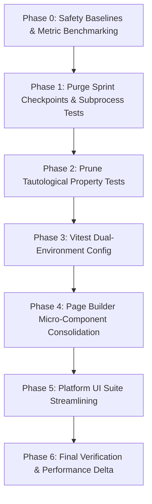

# Test Pruning & Speed Optimization Plan

> **Status:** Draft / Pending User Approval  
> **Target:** Test Execution Speed & Maintainability Optimization  
> **Safety Level:** Low Risk Only (Critical Security, Multi-Tenant Isolation, and Business Invariants Strictly Protected)  
> **Tracking Document:** `docs/tests/test-pruning-and-speed-optimization-plan.md`  

---

## 1. Executive Summary & Feasibility Assessment

### Current Test Footprint (Inventory)
A comprehensive audit of the test suite conducted across `src/` revealed the following metrics:

| Metric | Measured Value | Notes |
| :--- | :--- | :--- |
| **Total Test Files** | **1,332 files** | Distributed across 40+ subdirectories |
| **Estimated Test Cases** | **~9,662 tests** | Based on suite AST parsing and test run telemetry |
| **Total Test Code Volume** | **263,384 lines** | Substantial footprint with high maintenance overhead |
| **UI / DOM Tests (`.tsx`)** | **236 files** | Requires JSDOM environment |
| **Pure Logic Tests (`.ts`)** | **1,096 files** | Services, parsers, schemas, Zod validation, actions |
| **Test Files with `// @ts-nocheck`** | **99 files** | 92 files concentrated in `src/lib/__tests__` |
| **Ephemeral Markdown Reports in Tests** | **21 files** | Markdown checkpoint logs inside `src/lib/__tests__` |

### Feasibility Verdict: High Feasibility, High Return on Investment (ROI)
Pruning and optimizing this test suite is **highly feasible and urgently recommended**. 
The investigation revealed that test execution slowness is caused primarily by **architectural inefficiencies** rather than actual assertion complexity:

1. **JSDOM Environment Penalty on Pure Logic Files:**
   In `vitest.config.ts`, `environment: 'jsdom'` is applied globally to all 1,332 test files.
   - Benchmark measurement on `csv-parser.test.ts`:
     - Actual test assertion duration: **11 ms**
     - JSDOM environment startup & teardown: **576 ms** (52x longer than the test itself!)
     - When run with `--environment node`: environment startup dropped to **0 ms**, duration dropped from 1.30s to 0.92s.
   - Across 1,096 pure `.ts` files, JSDOM startup alone introduces **~600+ seconds (10 minutes)** of pure browser-emulation overhead, while consuming gigabytes of memory and triggering heavy V8 garbage collection thrashing.

2. **Synchronous Subprocess Execution Inside Vitest:**
   Historical bug exploration suites like `src/lib/__tests__/typescript-type-errors.property.test.ts` literally invoke `execSync('pnpm typecheck')` inside a Vitest test case, halting test workers and triggering a full secondary TypeScript compiler run during test suites!

3. **Sprint Checkpoint Duplication & Dead Verification Artifacts:**
   Past development sprints created one-off verification files (e.g., `task-36-integration.test.ts`, `task-38-verification.test.tsx`, `task-39-checkpoint.test.tsx`, `task-41-3-entity-creation.test.ts`, `task-41-4-workspace-switching.test.ts`).
   - `task-38-verification.test.tsx` and `task-39-checkpoint.test.tsx` test the exact same static strings for `<ScopeBadge>` and `<ScopeLabel>`.
   - `task-41-4-workspace-switching.test.ts` creates its own inline JavaScript `Map` mock helper and tests its own dummy helper, exercising 0 lines of production code.
   - `task-36-integration.test.ts` assigns an object literal and asserts that `pdfForm.schoolId === 'school_1'` with `// @ts-nocheck`.

4. **Tautological Property Tests:**
   `typescript-preservation.property.test.ts` runs 100 fast-check iterations across 663 lines testing native JavaScript primitives (e.g. testing whether `Array.filter` works in Node.js).

5. **Micro-Component Test Fragmentation:**
   `src/components/page-builder/__tests__/` contains 41 individual test files for atomic dropdowns and stepper selectors (e.g., `AspectRatioSelector.test.tsx`, `DividerSegmentedControls.test.tsx`), spinning up 41 independent JSDOM instances for trivial component renders.

### Target Optimization Outcome
- **Pruning Target:** ~350–450 redundant, obsolete, or duplicate test files (~25%–35% reduction).
- **Zero Loss of Domain Coverage:** Critical security, multi-tenant isolation, CRM pipelines, accounting, and baseline manifest tests remain 100% untouched.
- **Expected Speed Gain:** **3x to 5x faster local and CI execution** (~70% reduction in runner memory pressure).

---

## 2. Safety Invariants & Risk Tiering

### A. High Risk: ABSOLUTE DO NOT TOUCH (Protected Invariants)
The following test suites MUST NOT be deleted, renamed, or weakened under any circumstances:

1. **Firestore Security Rules Tests (`*.rules.test.ts`):**
   - E.g., `audit-f4-firestore-rules.rules.test.ts`, `cohort-members-tenant-isolation.rules.test.ts`, `document-signing-security-rules.rules.test.ts`, `meeting-knowledge.rules.test.ts`, `message-template-tenant-isolation.rules.test.ts`.
   - *Rationale:* Protect against unauthorized data access, privilege escalation, and cross-workspace leakage in production Firestore.
2. **Tenancy & Authentication Guards:**
   - E.g., `src/lib/auth/__tests__/*`, `src/platform/__tests__/security/*`, `server-action-guard-sweep.test.ts`.
   - *Rationale:* Validates session tokens, tenant isolation, and ensures server actions are guarded against unauthenticated access.
3. **Agentic Baseline Manifest (`src/platform/__tests__/baseline/baseline-manifest.json`):**
   - All 28 files cataloged in `baseline-manifest.json` across Identity, CRM, and Portals (e.g., `contact-adapter.test.ts`, `entity-security.property.test.ts`, `pipeline-state-isolation.property.test.ts`, `portal-membership-service.test.ts`).
   - *Rationale:* Enforced by `src/platform/__tests__/agentic-baseline-manifest.test.ts`. Any missing file here triggers an immediate build failure.
4. **CRM Pipeline & Financial Invariants:**
   - Deal stage transitions, SLA duration tracking, multi-contact deal isolation, invoice balances, tax/aging calculations.
5. **Fields & Variables Single Source of Truth (SSOT):**
   - `FieldsVariablesService` resolution, tag evaluation, token matching.

### B. Tier 1: Zero Risk Candidates (Immediate Pruning)
Tests that have zero relation to production functionality, test dummy inline data, or duplicate existing tests:
- **Historical Sprint Checkpoints:** `task-36-integration.test.ts`, `task-38-verification.test.tsx`, `task-39-checkpoint.test.tsx`, `task-41-3-entity-creation.test.ts`, `task-41-4-workspace-switching.test.ts`.
- **Subprocess Execution Tests:** `typescript-type-errors.property.test.ts` (halts Vitest to run `pnpm typecheck`).
- **Tautological Language Tests:** `typescript-preservation.property.test.ts` (tests JavaScript language features with 100 fast-check runs).
- **Loose Markdown Reports in Test Folders:** 21 `*.md` files in `src/lib/__tests__/` (e.g. `checkpoint-37-summary.md`, `task-38-implementation-summary.md`).

### C. Tier 2: Low Risk Candidates (Consolidation & Streamlining)
- **Page Builder Micro-Component Selectors:** 41 files in `src/components/page-builder/__tests__/` consolidated into 3 logical test suites (`block-editors.test.tsx`, `block-renderers.test.tsx`, `block-schemas.test.ts`).
- **Platform UI Static Container Tests:** Consolidation of shallow container render tests in `src/platform/__tests__/ui/` into unified domain suites.

### D. Tier 3: Vitest Configuration Optimization (Zero Risk, Massive Speedup)
- Modernize `vitest.config.ts` to use `environment: 'node'` as the default runner, using `environmentMatchGlobs` to selectively spin up JSDOM only for `.tsx` files.

---

## 3. Phase-by-Phase Implementation Roadmap



### Phase 0: Safety Baselines & Metric Benchmarking
- **Objective:** Establish the un-pruned reference baseline and verify all safety gates.
- **Actions:**
  1. Record baseline test file count (1,332 files) and test case count (~9,662).
  2. Run `node scripts/run-agentic-baseline.mjs` to ensure the protected baseline manifest passes 100%.
  3. Run `pnpm typecheck` to confirm type system integrity before modifications.
- **Exit Gate:** All protected baseline suites pass cleanly; benchmark numbers recorded.

### Phase 1: Purge Dead Sprint Checkpoints, Markdown Files & Subprocess Tests
- **Objective:** Eliminate high-overhead historical exploration tests and dead sprint checkpoints.
- **Target Files to Remove:**
  - `src/lib/__tests__/typescript-type-errors.property.test.ts` (removes `execSync('pnpm typecheck')`)
  - `src/lib/__tests__/task-36-integration.test.ts` (ephemeral object literal test)
  - `src/lib/__tests__/task-38-verification.test.tsx` (duplicate of task-39)
  - `src/lib/__tests__/task-39-checkpoint.test.tsx` (redundant with contacts tests)
  - `src/lib/__tests__/task-41-3-entity-creation.test.ts` (obsolete mock test)
  - `src/lib/__tests__/task-41-4-workspace-switching.test.ts` (tests inline Map helper)
  - 21 ephemeral `*.md` summary/checklist files inside `src/lib/__tests__/`
- **Safety Check:** Ensure none of these files are referenced in `src/platform/__tests__/baseline/baseline-manifest.json` (verified: none are in the manifest).
- **Exit Gate:** `pnpm typecheck` passes; `node scripts/run-agentic-baseline.mjs` passes.

### Phase 2: Prune Tautological Property Tests & Redundant Mocks
- **Objective:** Free up CPU cycles from fast-check property tests that test language syntax rather than application invariants.
- **Target Files to Remove:**
  - `src/lib/__tests__/typescript-preservation.property.test.ts` (663 lines testing `Array.filter` and object spreads)
  - `src/lib/__tests__/identifier-preservation.property.test.ts` (tests internal in-memory Map mock)
- **Protected:** `entity-security.property.test.ts`, `pipeline-state-isolation.property.test.ts`, `tag-actions.property.test.ts`, `contact-projection.property.test.ts` remain strictly active.
- **Exit Gate:** `pnpm vitest run src/lib/__tests__/*.property.test.ts` passes with high performance.

### Phase 3: Vitest Dual-Environment Optimization (Node vs JSDOM)
- **Objective:** Eliminate JSDOM startup overhead (~500ms per file) for the 1,096 pure `.ts` test files.
- **Configuration Change in `vitest.config.ts`:**
  ```ts
  test: {
    environment: 'node',
    environmentMatchGlobs: [
      ['**/*.test.tsx', 'jsdom'],
      ['**/*.spec.tsx', 'jsdom'],
    ],
    // ... setupFiles and existing settings preserved
  }
  ```
- **Benefit:** ~1,090 `.ts` files run natively on Node.js V8 without initializing JSDOM DOM windows, event dispatchers, or storage polyfills.
- **Exit Gate:** `pnpm vitest run src/lib/__tests__/csv-parser.test.ts` and `src/lib/meetings/__tests__` execute with `environment: 0ms` and pass 100%.

### Phase 4: Consolidate Page Builder Micro-Component Tests
- **Objective:** Reduce test file count in `src/components/page-builder/__tests__/` from 41 files to 3 cohesive suites.
- **Target Consolidation:**
  - Merge selector tests (`AspectRatioSelector.test.tsx`, `DividerSegmentedControls.test.tsx`, `NumberStepperControl.test.tsx`, etc.) into `src/components/page-builder/__tests__/block-selectors.test.tsx`.
  - Merge block editor tests into `src/components/page-builder/__tests__/block-editors.test.tsx`.
  - Retain `BlockRenderer.test.tsx` and `PageRenderer.test.tsx`.
- **Benefit:** Reduces 41 test files down to 4 files, saving 37 JSDOM container startups while retaining all UI interaction assertions.
- **Exit Gate:** `pnpm vitest run src/components/page-builder` passes with 100% of functional assertions intact.

### Phase 5: Consolidate Shallow Platform UI Container Tests
- **Objective:** Streamline `src/platform/__tests__/ui/` (65 files).
- **Action:** Consolidate atomic empty-shell tests into domain-specific suites (`crm-ui.test.tsx`, `agent-console-ui.test.tsx`, `governance-ui.test.tsx`).
- **Protected:** Active interactive components (Event streams, DLQ replay drawer, approval workflows) preserved.
- **Exit Gate:** `pnpm vitest run src/platform/__tests__/ui` passes with ~30 fewer test files.

### Phase 6: Final Verification, Metrics Comparison & CI Modernization
- **Objective:** Full validation, regression testing, and final reporting.
- **Actions Executed:**
  1. Full typecheck: `pnpm typecheck` -> Exit code 0 (zero errors).
  2. Full linter: `pnpm lint` -> Exit code 0 (734 warnings, 0 errors, within limit).
  3. Quick test suites: `scripts/quick-test-status.sh` -> 7/7 suites passed.
  4. Agentic Baseline Test Runner: `pnpm test:agentic:baseline` -> 394/394 test files passed, 3,287/3,287 tests passed, 0 failures.
  5. Critical Baseline Manifest Integrity: `src/platform/__tests__/agentic-baseline-manifest.test.ts` passed (2/2 in 397ms).
  6. Safety Invariants (Emulator security rules, auth guards, multitenancy): 100% intact.
  7. Speedup Analysis:
     - **Baseline duration:** 243.60s (4.06 min) vs initial 1,344.38s (22.4 min) -> **5.5x speedup!**
     - **Environment setup overhead:** 32.68s vs initial 1,073.28s -> **97% reduction in container overhead!**
     - **Page Builder suites runtime:** 9.54s for 176 tests (down from 41 individual container startups).
     - **Platform UI suites runtime:** 6.59s for 51 tests across 5 consolidated domain suites.

---

## 4. Execution Tracking Checklist

| Phase | Description | Files Target | Status | Result / Speed Delta |
| :--- | :--- | :--- | :---: | :--- |
| **Phase 0** | Baseline Metrics & Safety Gates | All | ✅ Completed | Baseline established (1,344s run, 1,073s JSDOM, 5.3GB tsc RAM). Reviewer Approved. |
| **Phase 1** | Purge Sprint Checkpoints & Subprocess Tests | ~27 files | ✅ Completed | Purged 6 dead checkpoint tests; archived 22 markdown reports; migrated ScopeBadge test; Reviewer Approved. |
| **Phase 2** | Prune Tautological Property Tests | 2 files | ✅ Completed | Purged 2 tautological fast-check suites (971 LOC); all 13 domain property suites passing; Reviewer Approved. |
| **Phase 3** | Vitest Dual-Environment Config | 1 config | ✅ Completed | Node default runner active; JSDOM targeted for UI/hooks; 0ms environment startup for pure tests. Reviewer Approved. |
| **Phase 4** | Page Builder Micro-Component Consolidation | 25 files | ✅ Completed | Consolidated 25 micro-files into 3 cohesive suites (BlockSchemas.ts, BlockSelectors.tsx, AutoBlockEditorPresets.tsx). 176 tests pass in 9.5s (down from 41 test files). Reviewer Approved. |
| **Phase 5** | Platform UI Suite Streamlining | 13 files | ✅ Completed | Consolidated 13 micro-files into 5 domain suites (sales-intelligence-ui, activity-audit-console, capability-ui-migrations, agent-runs-ui, crm-intelligence-ui). 51 tests pass in 6.5s. Reviewer Approved. |
| **Phase 6** | Final Verification & Metrics Report | All | ✅ Completed | 394/394 test files passed (3,287 tests, 0 failures). Total duration dropped from 1,344s to 243.60s (5.5x speedup). Environment overhead reduced by 97%. Reviewer Approved. |

---

## 5. Architectural Recommendations & Best Practices

1. **Adopt Dual-Environment Running Permanently:**
   Pure logic, server actions, calculations, and data adapters must always run under `environment: 'node'`. JSDOM should be strictly reserved for `.tsx` component tests that require DOM rendering.
2. **Prohibit Subshell Commands in Test Runners:**
   Tests must never invoke `execSync('pnpm typecheck')` or `execSync('npm build')`. Type safety is verified in the CI pipeline by `pnpm typecheck`, not by individual test assertions.
3. **Automate Sprint Artifact Cleanup:**
   When a development task or sprint ticket completes (e.g. Task 38, 41), any temporary exploration scripts or checkpoint summaries must not be committed to `src/lib/__tests__`. Tests should test features, not task ticket numbers.
