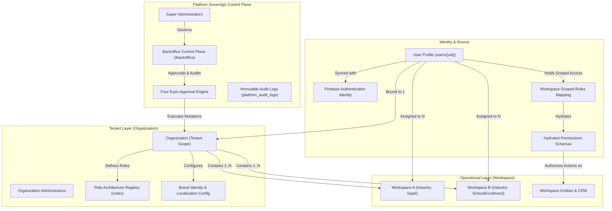
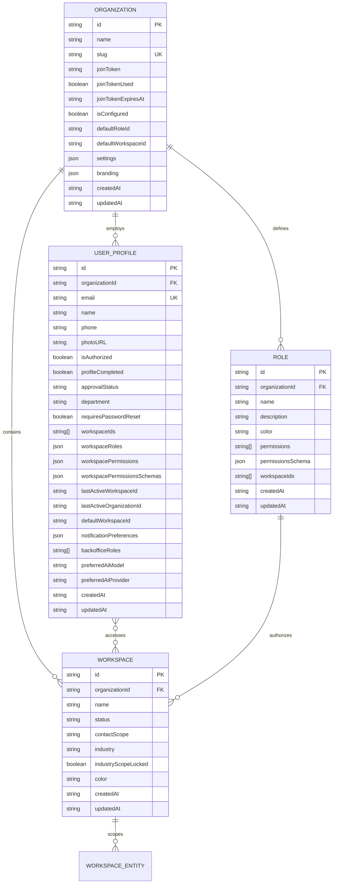
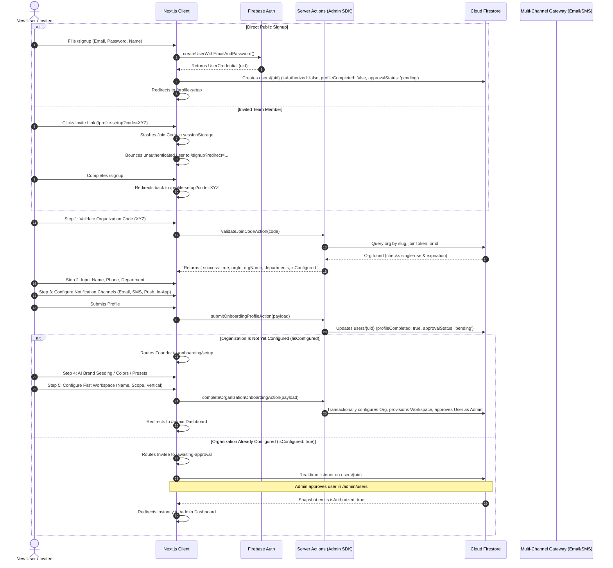
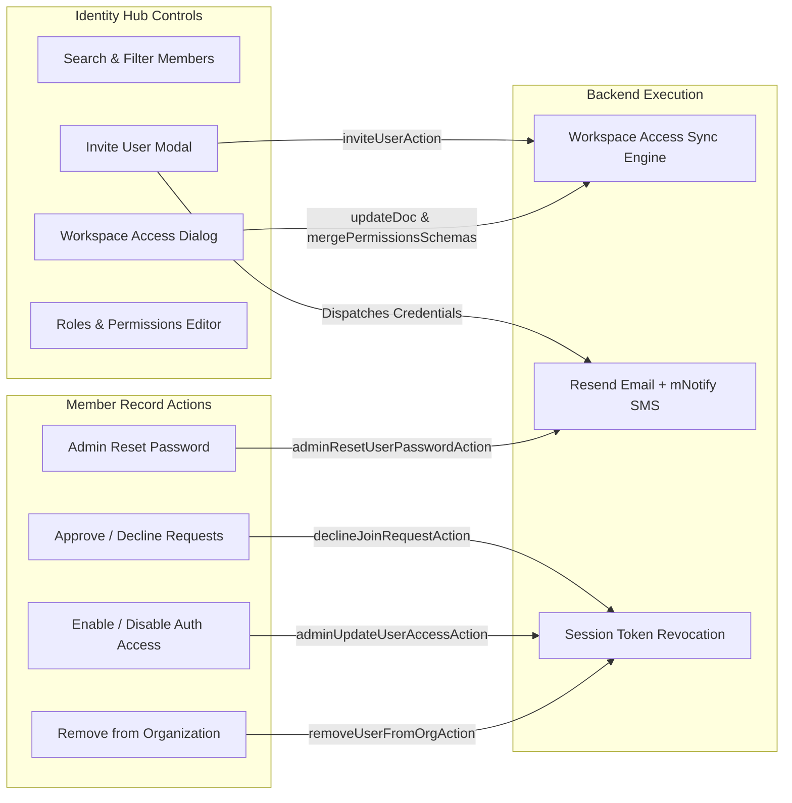
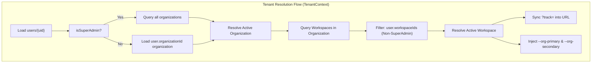
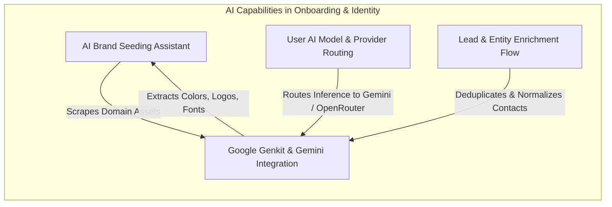

# Comprehensive Architecture & Code Review: User Management, Onboarding & Identity Governance

> **Document Version:** 2.4.0  
> **Status:** Production Reference & Architectural Audit  
> **Target Audience:** Principal Architects, Security Engineers, Senior Full-Stack Reviewers  
> **Repository Scope:** `src/app/(auth)`, `src/app/onboarding`, `src/app/admin/users`, `src/lib/auth`, `src/lib/permissions-engine.ts`, `src/context/TenantContext.tsx`, `src/app/(backoffice)`

---

## Table of Contents

1. [Executive Summary & System Topology](#1-executive-summary--system-topology)
2. [Identity & Multi-Tenancy Data Model](#2-identity--multi-tenancy-data-model)
3. [Authentication & Onboarding Lifecycle](#3-authentication--onboarding-lifecycle)
   - 3.1 [Registration & Sign-Up Engine (`/signup`)](#31-registration--sign-up-engine-signup)
   - 3.2 [Authentication & Session Initialization (`/login`)](#32-authentication--session-initialization-login)
   - 3.3 [Profile Setup Wizard (`/profile-setup`)](#33-profile-setup-wizard-profile-setup)
   - 3.4 [First-Time Organization & Workspace Provisioning (`/onboarding/setup`)](#34-first-time-organization--workspace-provisioning-onboardingsetup)
   - 3.5 [Awaiting Approval State Machine (`/awaiting-approval`)](#35-awaiting-approval-state-machine-awaiting-approval)
   - 3.6 [Mandatory Password Reset & Credential Hygiene (`/force-password-reset`)](#36-mandatory-password-reset--credential-hygiene-force-password-reset)
   - 3.7 [Account Recovery & Password Reset Pipelines](#37-account-recovery--password-reset-pipelines)
4. [User Management & Identity Hub (`/admin/users`)](#4-user-management--identity-hub-adminusers)
   - 4.1 [Organization-Scoped User Registry](#41-organization-scoped-user-registry)
   - 4.2 [Workspace Access Manager (`WorkspaceAccessDialog`)](#42-workspace-access-manager-workspaceaccessdialog)
   - 4.3 [User Invitation & Credential Dispatch Engine (`InviteUserModal`)](#43-user-invitation--credential-dispatch-engine-inviteusermodal)
   - 4.4 [Administrative Actions & Lifecycle Governance](#44-administrative-actions--lifecycle-governance)
5. [Hierarchical RBAC & Role Architecture](#5-hierarchical-rbac--role-architecture)
   - 5.1 [Granular 4-Tier Hierarchical Permission Schema](#51-granular-4-tier-hierarchical-permission-schema)
   - 5.2 [Section Gate & Master View Logic](#52-section-gate--master-view-logic)
   - 5.3 [Additive Role Merging & Schema Normalization](#53-additive-role-merging--schema-normalization)
   - 5.4 [Canonical Role Blueprints & Multi-Industry Presets](#54-canonical-role-blueprints--multi-industry-presets)
   - 5.5 [Legacy Compatibility & Permission Flattening](#55-legacy-compatibility--permission-flattening)
6. [Multi-Tenant Sovereignty & Context Switching](#6-multi-tenant-sovereignty--context-switching)
   - 6.1 [Tenant Context Engine (`TenantContext.tsx`)](#61-tenant-context-engine-tenantcontexttsx)
   - 6.2 [URL Track Parameter Synchronization & Transition Guard](#62-url-track-parameter-synchronization--transition-guard)
   - 6.3 [Deep Route Segment Workspace Resolution](#63-deep-route-segment-workspace-resolution)
   - 6.4 [Deadlock Breaker & Self-Healing Identity Recovery](#64-deadlock-breaker--self-healing-identity-recovery)
7. [Backoffice Control Plane Governance](#7-backoffice-control-plane-governance)
   - 7.1 [Backoffice Role Matrix & Immutable RBAC](#71-backoffice-role-matrix--immutable-rbac)
   - 7.2 [Four-Eyes Dual-Authorization Approval Engine](#72-four-eyes-dual-authorization-approval-engine)
   - 7.3 [Support Sandbox Mode & Impersonation Boundaries](#73-support-sandbox-mode--impersonation-boundaries)
   - 7.4 [Immutable Platform Audit Logging](#74-immutable-platform-audit-logging)
8. [Artificial Intelligence Integration](#8-artificial-intelligence-integration)
   - 8.1 [AI Brand Seeding Assistant](#81-ai-brand-seeding-assistant)
   - 8.2 [User-Level AI Preferences & Provider Routing](#82-user-level-ai-preferences--provider-routing)
   - 8.3 [Contextual Intelligence & Workspace Copilot Integrations](#83-contextual-intelligence--workspace-copilot-integrations)
9. [UI/UX, Design Architecture & Accessibility](#9-uiux-design-architecture--accessibility)
   - 9.1 [Dynamic Brand Theming & CSS Variable Injection](#91-dynamic-brand-theming--css-variable-injection)
   - 9.2 [Visual Hierarchy, Micro-Interactions & State Loading](#92-visual-hierarchy-micro-interactions--state-loading)
   - 9.3 [Mobile Viewport & Touch Optimization Standards](#93-mobile-viewport--touch-optimization-standards)
10. [Security, Isolation & Compliance Infrastructure](#10-security-isolation--compliance-infrastructure)
    - 10.1 [Cloud Firestore Security Rules Architecture](#101-cloud-firestore-security-rules-architecture)
    - 10.2 [Server Action & REST API Authorization Guards](#102-server-action--rest-api-authorization-guards)
    - 10.3 [Session Invalidation & Token Revocation Protocol](#103-session-invalidation--token-revocation-protocol)
    - 10.4 [Multi-Channel Communication Resilience](#104-multi-channel-communication-resilience)
11. [Senior Architectural Code Review Findings & Upgrade Recommendations](#11-senior-architectural-code-review-findings--upgrade-recommendations)

---

## 1. Executive Summary & System Topology

The SmartSapp identity, onboarding, and user management architecture is built as an **enterprise-grade, multi-tenant, sovereign role-based access control (RBAC) platform**. It manages authentication, tenant provisioning, cross-organization sovereignty, granular feature entitlement, multi-channel automated credential delivery, and dual-authorization backoffice governance.



### Core Architectural Pillars

1. **Strict Multi-Tenant Isolation:** Users belong strictly to one Organization (Tenant), while maintaining access to one or more Workspaces within that Organization. Superadmins have cross-tenant elevation capabilities.
2. **Hierarchical 4-Section RBAC:** Complete decomposition of platform capabilities into **Operations**, **Finance**, **Studios**, and **Management**, with explicit `view`, `create`, `edit`, and `delete` CRUD toggles.
3. **Workspace-Scoped Granular Entitlements:** A single user can possess different roles (e.g., Administrator in Workspace A, Read-Only Operator in Workspace B) with independent hydrated permission trees.
4. **Resilient Server-First Provisioning:** Onboarding wizards and status resolution run on Next.js Server Actions using the Firebase Admin SDK, eliminating client-side WebChannel offline locks and security rule bootstrapping errors.
5. **Zero-Trust Administrative Safeguards:** Multi-channel notification delivery (Resend Email + mNotify SMS), immediate token revocation upon user offboarding, mandatory temporary password expiration walls, and four-eyes dual-authorization for backoffice structural mutations.

---

## 2. Identity & Multi-Tenancy Data Model

The data layer models tenant boundaries, user memberships, and permission structures across Firestore collections.

### 2.1 Entity Relationship Diagram



### 2.2 TypeScript Data Contract (`src/lib/types.ts`)

```typescript
export interface UserProfile {
  id: string;
  organizationId: string;
  workspaceIds: string[];
  name: string;
  email: string;
  phone: string;
  photoURL?: string;
  isAuthorized: boolean;
  profileCompleted?: boolean;
  department?: string;
  approvalStatus?: 'pending' | 'approved' | 'rejected' | 'none';
  requiresPasswordReset?: boolean;
  
  // Legacy global compatibility fields
  roles?: string[];
  permissions?: AppPermissionId[];
  permissionsSchema?: PermissionsSchema;
  
  // Workspace-Scoped Entitlement Mappings
  workspaceRoles?: Record<string, string[]>;
  workspacePermissions?: Record<string, AppPermissionId[]>;
  workspacePermissionsSchemas?: Record<string, PermissionsSchema>;

  // AI Preferences
  preferredAiModel?: string;
  preferredAiProvider?: string;
  
  // Sticky UI Session Persistence
  lastActiveWorkspaceId?: string;
  lastActiveOrganizationId?: string;
  defaultWorkspaceId?: string;
  
  // Multi-Channel Notifications
  notificationPreferences?: NotificationPreferences;

  // Platform Backoffice Control Plane Roles
  backofficeRoles?: BackofficeRole[];

  createdAt: string;
  updatedAt?: string;
}
```

---

## 3. Authentication & Onboarding Lifecycle

The onboarding system routes prospective users, invited team members, and organization founders through an authorized, progressive-disclosure onboarding journey.



### 3.1 Registration & Sign-Up Engine (`/signup`)
- **Dual Authentication Modes:** Supports both Email/Password registration (with Zod validation enforcing $\ge 8$ character matching passwords) and Google OAuth popup/redirect authentication.
- **Pending State Creation:** New accounts are initialized with `isAuthorized: false`, `profileCompleted: false`, and `approvalStatus: 'pending'`.
- **Open-Redirect Safe Navigation:** Carries destination parameters across the authentication barrier using `safeInternalRedirect` (`src/lib/auth/return-to.ts`), strictly enforcing that redirects begin with `/` and preventing XSS or external phish redirects.
- **Invite Context Banner:** Displays contextual branding when the user arrives via an administrative invitation.

### 3.2 Authentication & Session Initialization (`/login`)
- **Superadmin Auto-Enforcement:** On every login attempt, `enforceSuperAdminProfileAction` checks `system_config/super_admins` server-side. If the user's email matches, administrative privileges, `system_admin` permissions, and bypass flags are immediately updated via the Admin SDK.
- **Mandatory Password Reset Interceptor:** Checks if `userDoc.requiresPasswordReset === true`. If active, the session is intercepted and redirected to `/force-password-reset`.
- **Multi-Route Status Guard:** Directs approved administrators to `/admin`, pending users to `/admin` (which gracefully redirects to `/awaiting-approval` or `/profile-setup`), and unauthorized/disabled users to a sign-out toast.

### 3.3 Profile Setup Wizard (`/profile-setup`)
- **Step 1 (Organization Link):** Validates the organization join token or slug. The `validateJoinCodeAction` server action checks:
  1. Organization `slug` exact match and prefix lookup.
  2. Provisioning `joinToken` with validation against `joinTokenUsed === true` and `joinTokenExpiresAt` timestamps.
  3. Direct document ID fallback.
- **Step 2 (Personal Details):** Captures Legal Full Name, Mobile Contact Phone (E.164 / local format), and dynamically loads organizational departments.
- **Step 3 (Alert Channels):** Configures user notification preferences across Email, SMS, In-App Notifications, and Web Push.
- **Server Action Submission:** Dispatches `submitOnboardingProfileAction` which pre-assigns existing workspace IDs and marks `profileCompleted: true`.

### 3.4 First-Time Organization & Workspace Provisioning (`/onboarding/setup`)
- **Step 4 (Branding & Localization):** Allows founders to customize primary and secondary accent colors, typography, logos, default language, timezone, and currency. Features an **AI Seeding Assistant** that analyzes domain assets.
- **Step 5 (First Workspace Configuration):** Captures workspace name, Contact Scope Policy (`person` | `institution` | `family`), and Industry Vertical (`SaaS` | `SchoolEnrollment` | `Law` | `Marketing` | `RealEstate` | `Consultancy`).
- **Atomic Transaction (`completeOrganizationOnboardingAction`):**
  - Executes inside `adminDb.runTransaction()`.
  - Verifies concurrency: rejects with `ALREADY_CONFIGURED` if another administrator completed setup concurrently.
  - Updates Organization document with branding and marks `isConfigured: true`.
  - Marks `joinTokenUsed: true` with timestamp to prevent token reuse.
  - Provisions the primary Workspace document.
  - Grants the founder full Organization Administrator permissions (`ORG_ADMIN_PERMISSIONS`), approving their account and binding their `lastActiveWorkspaceId`.

### 3.5 Awaiting Approval State Machine (`/awaiting-approval`)
- **Zero-Polling Real-Time Listener:** Attaches an `onSnapshot` listener to `users/{uid}`.
- **Dynamic Status Transitions:** Instantly updates when the organization administrator approves or rejects the membership request.
- **Auto-Redirect:** Upon approval (`isAuthorized: true`), the listener triggers `router.push('/admin')`.
- **Review Summary UI:** Displays submitted organization name, department, phone, email, and active alert channels while waiting.

### 3.6 Mandatory Password Reset & Credential Hygiene (`/force-password-reset`)
- **Enforced Security Wall:** Activated whenever an administrator invites a user or performs an administrative password reset.
- **Direct Auth Synchronization:** Updates the credential in Firebase Authentication via `updatePassword(auth.currentUser)` and resets `requiresPasswordReset: false` in Firestore.

### 3.7 Account Recovery & Password Reset Pipelines
- **Email Recovery:** Standard Firebase Auth password reset flow.
- **SMS Phone Recovery (`publicResetPasswordViaPhoneAction`):** Users enter their registered phone number. The server queries `users` where `phone == targetPhone`, generates a cryptographically random password (`crypto.randomBytes`), updates Firebase Auth, sets `requiresPasswordReset: true`, resolves the dynamic SMS template via `resolveAndRender`, and dispatches the temporary credential via mNotify SMS.

---

## 4. User Management & Identity Hub (`/admin/users`)

The Identity Hub provides operational control over team memberships, role assignments, multi-workspace access, and credential provisioning.



### 4.1 Organization-Scoped User Registry
- **Reactive Firestore Query:** Subscribed via `useCollection` with query constraint `where('organizationId', '==', activeOrganizationId)`.
- **Derived Real-Time Search:** Instant filtering across member names and email addresses with zero debounce lag.
- **Additive Role Badge Previews:** Shows assigned roles, department tags, pending verification status, and an interactive tooltip revealing all flattened effective permissions.

### 4.2 Workspace Access Manager (`WorkspaceAccessDialog`)
- **Multi-Workspace Memberships:** Displays all workspaces within the organization that a user belongs to.
- **Per-Workspace Role Architecture:** Allows administrators to select specific roles for each workspace.
- **Dynamic Schema Merging:** Automatically executes `mergePermissionsSchemas()` across all assigned roles for that workspace and stores the result in `workspacePermissionsSchemas[workspaceId]`.
- **Immediate Membership Revocation:** Allows stripping a user's access to individual workspaces while preserving their membership in others.

### 4.3 User Invitation & Credential Dispatch Engine (`InviteUserModal`)
- **Multi-Channel Provisioning:** Administrators enter Full Legal Name, Corporate Email, Mobile Phone, and select delivery channels (**Email** and/or **SMS**).
- **Automated Password Generation:** The server action `inviteUserAction` generates a secure 10-character alphanumeric password (`generateRandomPassword()`).
- **Firebase Auth Account Creation:** Provisions the user in Firebase Authentication with `emailVerified: false`.
- **Role Hydration & Permission Pre-Computation:** Hydrates all selected roles from Firestore, computes hierarchical schemas, flattens legacy string permissions, and saves the complete `UserProfile`.
- **Dynamic Template Resolution:** Renders custom organizational invitation templates via `resolveAndRender('users', 'user_invitation', orgId, context)`.
- **Resilient Dispatch:** Uses `Promise.allSettled()` to send email via Resend and SMS via mNotify, returning actionable warning messages if a specific channel encounters provider throttling.

### 4.4 Administrative Actions & Lifecycle Governance
| Administrative Action | Server Action / Implementation | Security & Functional Mechanics |
| :--- | :--- | :--- |
| **Approve Membership** | `adminUpdateUserAccessAction(uid, true)` | Enables Firebase Auth account (`disabled: false`), sets `isAuthorized: true`, updates `approvalStatus: 'approved'`. |
| **Decline Request** | `declineJoinRequestAction(uid, adminUid)` | Verifies admin rights, disables Firebase Auth user, sets `approvalStatus: 'rejected'`, revokes refresh tokens via `revokeRefreshTokens(uid)`, and dispatches rejection notice. |
| **Toggle Access** | `adminUpdateUserAccessAction(uid, boolean)` | Toggles Firebase Auth account status. If disabled, dispatches cancellation notifications via Email/SMS and revokes active sessions. |
| **Reset Password** | `adminResetUserPasswordAction(uid)` | Generates random password, updates Firebase Auth, sets `requiresPasswordReset: true`, and dispatches new temporary credentials via Email/SMS. |
| **Remove from Org** | `removeUserFromOrgAction(uid, adminUid)` | Prevents self-removal; clears `organizationId`, `workspaceIds`, `workspaceRoles`, `workspacePermissions`, and invalidates all active session tokens. |

---

## 5. Hierarchical RBAC & Role Architecture

The platform implements a **4-section hierarchical RBAC model** engineered to replace flat, string-based permission checks with structural, type-safe authorization.

```mermaid
graph TD
    subgraph "Hierarchical Permissions Schema (PermissionsSchema)"
        Ops["operations (Section Enabled: boolean)"]
        Fin["finance (Section Enabled: boolean)"]
        Std["studios (Section Enabled: boolean)"]
        Mgt["management (Section Enabled: boolean)"]
    end

    subgraph "Operations Features"
        Ops --> dashboard["dashboard (view, edit)"]
        Ops --> campuses["campuses / entities (view, create, edit, delete)"]
        Ops --> pipeline["pipeline / deals (view, create, edit, delete)"]
        Ops --> tasks["tasks (view, create, edit, delete)"]
        Ops --> meetings["meetings (view, create, edit, delete)"]
        Ops --> automations["automations (view, create, edit, delete)"]
        Ops --> intelligence["intelligence / reports (view)"]
        Ops --> quickNotes["quickNotes (view, create, edit, delete)"]
    end

    subgraph "Finance Features"
        Fin --> agreements["agreements / contracts (view, create, edit, delete)"]
        Fin --> invoices["invoices (view, create, edit, delete)"]
        Fin --> packages["packages (view, create, edit, delete)"]
        Fin --> cycles["cycles / billing periods (view, create, edit, delete)"]
        Fin --> billingSetup["billingSetup (view, edit)"]
    end

    subgraph "Studios Features"
        Std --> portals["publicPortals (view, create, edit, delete)"]
        Std --> landingPages["landingPages (view, create, edit, delete)"]
        Std --> media["media library (view, create, edit, delete)"]
        Std --> surveys["surveys (view, create, edit, delete)"]
        Std --> docSigning["docSigning / PDFs (view, create, edit, delete)"]
        Std --> messaging["messaging studio (view, create, edit, delete)"]
        Std --> forms["forms builder (view, create, edit, delete)"]
        Std --> tags["tags manager (view, create, edit, delete)"]
        Std --> qrStudio["qrStudio (view, create, edit, delete)"]
        Std --> verifyStudio["verifyStudio (view, create, edit, delete)"]
        Std --> socialIntel["socialIntelligence (view, create, edit, delete)"]
    end

    subgraph "Management Features"
        Mgt --> activities["activities timeline (view)"]
        Mgt --> users["users & team access (view, create, edit, delete)"]
        Mgt --> fields["fields & variables registry (view, create, edit, delete)"]
        Mgt --> sysSettings["systemSettings (view, edit)"]
    end
```



### 5.1 Granular 4-Tier Hierarchical Permission Schema
Defined in `src/lib/types.ts`:
- **`PermissionsSchema`**: Root schema containing `operations`, `finance`, `studios`, and `management`.
- **`SectionPermissions`**: Holds `{ enabled: boolean; features: Record<string, FeaturePermissions> }`.
- **`FeaturePermissions`**: Holds `{ view: boolean; create?: boolean; edit?: boolean; delete?: boolean }`.

### 5.2 Section Gate & Master View Logic
Implemented in `evaluatePermission()` (`src/lib/permissions-engine.ts`):
1. **Section Master Check:** If `schema[section].enabled === false`, all features under that section evaluate to `false` immediately.
2. **Feature Existence Check:** If `schema[section].features[feature]` is missing, evaluation returns `false`.
3. **Master View Requirement:** If `featurePerm.view === false`, all actions (`create`, `edit`, `delete`) are denied regardless of their individual boolean values.
4. **Default Deny:** If an action is not explicitly `true`, it is denied.

### 5.3 Additive Role Merging & Schema Normalization
- **Additive OR-Logic (`mergePermissionsSchemas`):** When a user holds multiple roles in a workspace, permissions are merged additively. If *any* role grants `view`, `create`, `edit`, or `delete` on a feature, the resulting effective schema grants that capability.
- **Deep Normalization (`normalizePermissionsSchema`):** Ensures schemas loaded from storage or legacy sources are immutable, deeply cloned, and guaranteed to have all section objects defined.

### 5.4 Canonical Role Blueprints & Multi-Industry Presets
`src/lib/role-blueprint-presets.ts` defines **22 platform blueprints** tailored for vertical industry workflows:

```mermaid
graph TD
    Catalog["Canonical Role Blueprint Catalog (22 Presets)"]

    Catalog --> SaaS["SaaS & Software Vertical"]
    SaaS --> CS["Customer Success Lead"]
    SaaS --> Sales["Sales & Growth Executive"]
    SaaS --> RevOps["RevOps & Billing Specialist"]
    SaaS --> Growth["Growth Marketing Manager"]

    Catalog --> School["School Enrollment Vertical"]
    School --> Reg["Registrar & Admissions Officer"]
    School --> Bursar["School Bursar / Finance Officer"]
    School --> ParentCoord["Parent Engagement Coordinator"]
    School --> Outreach["Outreach & Communications Director"]

    Catalog --> Law["Law & Legal Vertical"]
    Law --> Partner["Managing Partner / Compliance Officer"]
    Law --> Paralegal["Paralegal / Case Coordinator"]
    Law --> Billing["Legal Billing & Retainer Specialist"]

    Catalog --> Marketing["Marketing Agency Vertical"]
    Marketing --> AcctExec["Account Director / Client Lead"]
    Marketing --> MediaPlan["Media & Content Strategist"]
    Marketing --> MktOps["Agency Operations Coordinator"]

    Catalog --> RealEstate["Real Estate Vertical"]
    RealEstate --> Principal["Principal Broker / Managing Director"]
    RealEstate --> Agent["Listing & Buyer Agent"]
    RealEstate --> Escrow["Transaction & Escrow Coordinator"]

    Catalog --> Consultancy["Consultancy Vertical"]
    Consultancy --> Engagement["Engagement Director / Partner"]
    Consultancy --> Consultant["Senior Consultant / Lead Analyst"]
    Consultancy --> ProjectOps["Project Operations Specialist"]

    Catalog --> Universal["Universal Governance Presets"]
    Universal --> FullAdmin["Administrator (Full Platform Control)"]
    Universal --> OperationsMgr["Operations Manager"]
    Universal --> FinanceAdmin["Finance Administrator"]
    Universal --> StudioMgr["Studio & Content Manager"]
```



### 5.5 Legacy Compatibility & Permission Flattening
- **Flattening Engine (`flattenPermissionsSchema`):** Derives flat string permission arrays (e.g., `schools_view`, `finance_manage`, `tasks_manage`) from hierarchical schemas for Firestore security rules and backward-compatible UI components.
- **Migration Engine (`migrateToPermissionsSchema`):** Upgrades legacy flat permission arrays into structured `PermissionsSchema` trees upon role modification.

---

## 6. Multi-Tenant Sovereignty & Context Switching

The application enforces tenant isolation while allowing frictionless multi-workspace management.



### 6.1 Tenant Context Engine (`TenantContext.tsx`)
- **Single Source of Truth:** Exposes `activeOrganizationId`, `activeOrganization`, `activeWorkspaceId`, `activeWorkspace`, `accessibleWorkspaces`, `allAccessibleWorkspaces`, `isSuperAdmin`, `hasPermission`, and `permissionsSchema`.
- **Dynamic Brand Injection:** Injects organization-specific brand colors directly into CSS root properties (`--org-primary`, `--org-secondary`), updating themes on the fly.
- **Sticky Persistence:** Persists active organization and workspace selections across page refreshes via `localStorage` and background Firestore profile updates (`lastActiveOrganizationId`, `lastActiveWorkspaceId`).

### 6.2 URL Track Parameter Synchronization & Transition Guard
- **Automatic Track Sync:** Ensures the active workspace is reflected in the URL parameter `?track=<workspaceId>`.
- **Query Parameter Preservation:** Preserves active filter queries (e.g., `mode`, `tab`, `category`, `edit`) during navigation transitions while preventing infinite router refresh loops.

### 6.3 Deep Route Segment Workspace Resolution
- **`resolveWorkspaceFromPathname`:** When navigating directly to deep links (e.g., `/admin/automations/xyz123`, `/admin/meetings/abc456`), the engine resolves the target entity's parent workspace and automatically updates the active tenant context.

### 6.4 Deadlock Breaker & Self-Healing Identity Recovery
- **Orphan User Recovery:** If a user profile is missing an explicit `organizationId` but possesses an assigned `activeWorkspaceId`, the system queries `workspaces/{workspaceId}` to recover the parent `organizationId`, preventing authentication deadlocks.

---

## 7. Backoffice Control Plane Governance

The Backoffice (`src/app/(backoffice)`) represents the super-administrative control plane for platform operators, multi-tenant diagnostics, cross-organization propagation, and compliance enforcement.

### 7.1 Backoffice Role Matrix & Immutable RBAC
`src/lib/backoffice/backoffice-rbac.ts` enforces an immutable matrix of **8 specialized operator roles** across **17 platform modules**:

```
Role Matrix Summary:
• super_admin:            Full CRUD + Execution on ALL 17 Modules
• tenant_admin_ops:       Organizations, Workspaces, Tenant Health (Edit/Create)
• release_admin:          Platform Feature Flags & System Rollouts (Full Access)
• template_admin:         Templates, Survey Governance, Field Packs, Assets
• support_admin:          Tenant Health, Messaging Observatory, Support Sandbox
• security_auditor:       Audit Logs, Security Policies, Approvals Execution
• migration_admin:        Data Migration Engine, Operations Jobs, Webhook Replay
• readonly_auditor:       Strict View-Only access across all modules
```

### 7.2 Four-Eyes Dual-Authorization Approval Engine
Located in `src/lib/backoffice/backoffice-approval-actions.ts`:
- **Dual-Authorization Rule:** Critical operations (e.g., destructive tenant deletions, global template propagations, cross-tenant migration scripts) cannot be executed unilaterally.
- **Requester Exclusion:** The administrator who creates an approval request (`requestedBy.userId`) is strictly prohibited from approving or rejecting their own request.
- **Transactional Atomic Execution:** Approval decisions run inside `adminDb.runTransaction()` to prevent race conditions. Upon approval, the payload stored at creation time is executed under the approver's authenticated identity.

### 7.3 Support Sandbox Mode & Impersonation Boundaries
- **Time-Bounded Impersonation:** Platform support engineers can enter an organization's workspace in **Support Sandbox Mode** for a maximum of 30 minutes.
- **Visual Alert Banner:** Renders a high-contrast amber indicator (`Support Sandbox Mode Active — Actor: <id>`).
- **Audit Trace:** Every action performed during the impersonation session is logged with the operator's actual UID as the actor.

### 7.4 Immutable Platform Audit Logging
- **Lockdown in Security Rules:** `platform_audit_logs` has rules set to `allow read, write: if false;`. Client SDKs cannot write or tamper with logs. All logs are generated via `logBackofficeAction()` using the Admin SDK.

---

## 8. Artificial Intelligence Integration

The platform embeds generative and deterministic AI capabilities into onboarding, configuration, and daily user workflows.



### 8.1 AI Brand Seeding Assistant
- Embedded directly in Step 4 of the Onboarding Wizard (`OnboardingSetupClient.tsx`).
- Takes an organization website domain, resolves metadata, extracts primary and secondary brand colors from stylesheets, detects favicon/logo assets, and suggests matching font families.

### 8.2 User-Level AI Preferences & Provider Routing
- `UserProfile` stores `preferredAiModel` (e.g., `gemini-2.0-flash`, `gpt-4o`, `claude-3-7-sonnet`) and `preferredAiProvider` (`googleai`, `openrouter`, `openai`).
- Standardized AI flows in `src/ai/flows` route prompts through the user's selected provider.

### 8.3 Contextual Intelligence & Workspace Copilot Integrations
- **Entity Summarizer (`entity-summarizer.ts`):** Synthesizes contact timelines and institutional engagement histories.
- **Survey AI Architect (`generate-survey-flow.ts`):** Automatically compiles multi-step conversational surveys from natural language prompts.
- **Bulk Normalization Flow (`bulk-normalization-flow.ts`):** Cleans and normalizes imported spreadsheets during team ingestion.

---

## 9. UI/UX, Design Architecture & Accessibility

The interface adheres to modern web standards, micro-interactions, and accessibility best practices.

### 9.1 Dynamic Brand Theming & CSS Variable Injection
- Supports seamless light and dark mode switching via `next-themes`.
- `TenantContext` dynamically binds the active organization's `brandPrimaryColor` and `brandSecondaryColor` to CSS custom variables (`--org-primary`, `--org-secondary`), ensuring custom white-label branding across admin layouts.

### 9.2 Visual Hierarchy, Micro-Interactions & State Loading
- **Ambient Canvas Visuals:** Utilizes WebGL-accelerated `LightRays` canvas backgrounds with pulsating ambient light.
- **Authorization Loader:** Features `AuthorizationLoader.tsx` with animated radar rings, state transitions, and a 10-second timeout to prevent UI lockups.
- **Empty States & Skeletons:** Comprehensive skeleton states on all table rows and sidebar navigation trees.

### 9.3 Mobile Viewport & Touch Optimization Standards
- All interactive buttons and touch controls satisfy the `min-h-[44px]` touch target guideline.
- Tables reflow gracefully with horizontal overflow scrolling on mobile viewports.
- Sticky action toolbars maintain keyboard focus and proper virtual keyboard scroll margins.

---

## 10. Security, Isolation & Compliance Infrastructure

Security is implemented in depth across client guards, Firestore security rules, server actions, and session management.

### 10.1 Cloud Firestore Security Rules Architecture (`firestore.rules`)
```
• Default Deny: match /{document=**} { allow read, write: if false; }
• Users Collection:
  - Users can read/create their OWN document (required for onboarding bootstrap).
  - Updates require isSystemAdmin() or specific authorization guards.
• Workspaces & Entities:
  - Gated by hasWorkspaceAccess(workspaceId) AND organizationId matching.
• Platform Backoffice Collections:
  - Completely blocked from Client SDK (allow read, write: if false;). Accessible exclusively via Admin SDK.
```

### 10.2 Server Action & REST API Authorization Guards
- **`authenticateApiRequest` (`src/lib/auth/api-auth-guard.ts`):** Verifies Firebase Bearer tokens, inspects user authorization, checks tenant/workspace boundaries, and handles platform superadmin elevation.
- **`requireOrgAdmin` (`src/lib/auth/require-org-admin.ts`):** Validates that the calling user possesses administrative privileges over the target organization before executing sensitive mutations.

### 10.3 Session Invalidation & Token Revocation Protocol
- When an account is declined, disabled, or removed from an organization, `adminAuth.revokeRefreshTokens(userId)` is immediately executed, invalidating existing JWT sessions within seconds.

### 10.4 Multi-Channel Communication Resilience
- Multi-channel credential and notification dispatches (Resend for Email, mNotify for SMS) execute inside `Promise.allSettled()`. Partial delivery failures are recorded and surfaced as non-blocking warnings.

---

## 11. Senior Architectural Code Review Findings & Upgrade Recommendations

### Strengths Identified

1. **Robust Sovereign Multi-Tenancy:** The organization $\rightarrow$ workspace $\rightarrow$ role hierarchy provides clean multi-tenant isolation without data leakage.
2. **True Hierarchical RBAC:** The 4-section permission schema (`operations`, `finance`, `studios`, `management`) provides fine-grained control over features and CRUD operations.
3. **Resilient Onboarding Initialization:** Server Action routing with Admin SDK bypasses client Firestore connectivity issues and offline locking.
4. **Dual-Authorization Governance:** The four-eyes approval workflow in the Backoffice sets a high security standard for structural changes.
5. **Clean Multi-Channel Delivery:** Automated password generation and dual-channel dispatch (Email/SMS) reduces manual administrative burden.

---

### Architectural Gaps & Recommendations for the Senior Expert

#### 1. Multi-Factor Authentication (MFA / 2FA) Enforcement
- **Current State:** Authentication relies on single-factor password or Google OAuth.
- **Recommendation:** Implement TOTP (Time-Based One-Time Password) or SMS MFA enrollment during onboarding for administrative and finance roles, enforced via Firebase Auth Multi-Factor Authentication APIs.

#### 2. Enterprise Single Sign-On (SAML / OIDC / SCIM)
- **Current State:** Direct email/password and consumer Google Sign-In.
- **Recommendation:** Integrate Google Cloud Identity Platform (GCIP) SAML/OIDC enterprise providers (Okta, Azure AD, Google Workspace) and SCIM 2.0 provisioning endpoints to support enterprise tenant provisioning.

#### 3. Real-Time In-Flight Permission Invalidation
- **Current State:** When an administrator modifies a user's roles, the new permissions take full effect in the client upon next token refresh or page navigation.
- **Recommendation:** Introduce a real-time Firestore listener on `users/{uid}/permissionsHash` or broadcast channel in `TenantContext` to trigger instant client-side authorization cache re-computation without requiring a reload.

#### 4. Granular Organization-Level Audit Trail
- **Current State:** Platform-level mutations are recorded in `platform_audit_logs`, while tenant-level CRM activities are in `activities`.
- **Recommendation:** Create a dedicated `organization_audit_logs` collection to track member role changes, permission adjustments, invitations, and access toggles specifically for organization compliance reporting.

#### 5. Session Timeout & Inactivity Safeguards
- **Current State:** Standard Firebase Auth token lifecycle.
- **Recommendation:** Implement an idle session timer hook for administrative views (e.g., 30 minutes of inactivity) that locks the UI with a re-authentication modal.

---

## Summary Matrix of Feature Implementations

| Feature Area | Implementation Path | Primary Technologies |
| :--- | :--- | :--- |
| **Sign-Up & Google OAuth** | `src/app/signup/page.tsx` | Firebase Auth, Zod, React Hook Form |
| **Sign-In & Reset Enforcement** | `src/app/login/page.tsx` | Firebase Auth, Server Action Guards |
| **Profile Onboarding Wizard** | `src/app/profile-setup/page.tsx` | Server Actions, Multi-Channel Preferences |
| **Organization Setup Wizard** | `src/app/onboarding/setup/OnboardingSetupClient.tsx` | Admin SDK Transactions, AI Seeding |
| **Awaiting Approval Real-Time UI** | `src/app/awaiting-approval/page.tsx` | Firestore `onSnapshot`, Radar Animations |
| **Team Access Control Hub** | `src/app/admin/users/UsersClient.tsx` | Firestore Query, Multi-Select, Access Toggles |
| **Workspace Access Dialog** | `src/app/admin/users/components/WorkspaceAccessDialog.tsx` | Scoped Roles, Schema Merging |
| **Invite & Dispatch Engine** | `src/lib/user-invite-actions.ts` | Resend API, mNotify SMS, Crypto Generator |
| **Hierarchical RBAC Engine** | `src/lib/permissions-engine.ts` | 4-Section Schema, Additive OR-Merger |
| **Role Blueprint Presets** | `src/lib/role-blueprint-presets.ts` | 22 Vertical Industry Blueprints |
| **Multi-Tenant Context Engine** | `src/context/TenantContext.tsx` | Sticky Storage, Pathname Resolution |
| **Backoffice Governance & Approvals**| `src/lib/backoffice/backoffice-approval-actions.ts` | Four-Eyes Transactions, Immutable Audit |
| **Security Rules & API Guards** | `firestore.rules`, `src/lib/auth/api-auth-guard.ts` | Cloud Firestore Rules, Bearer JWT Guard |
